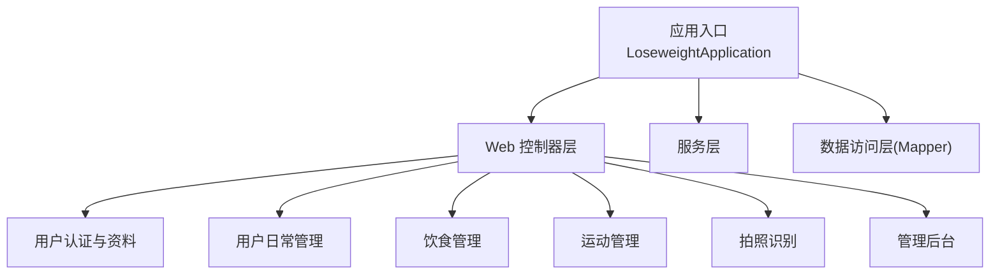
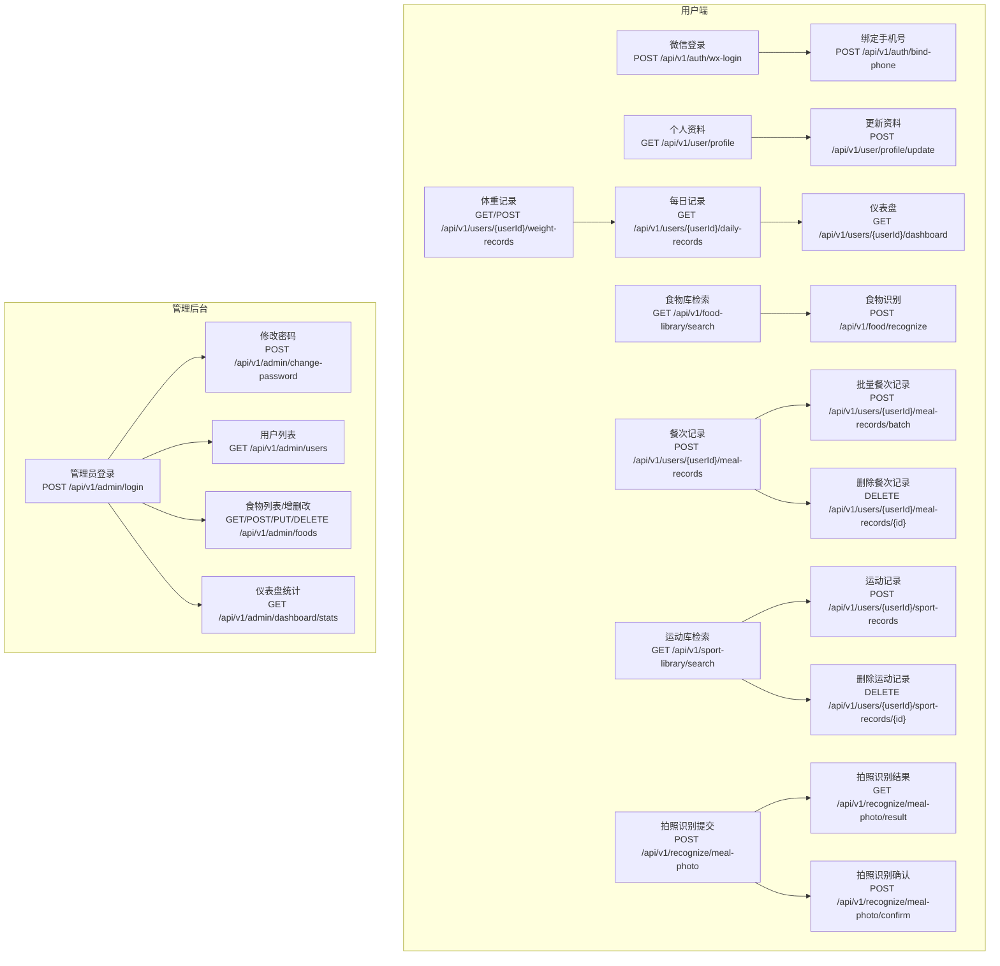
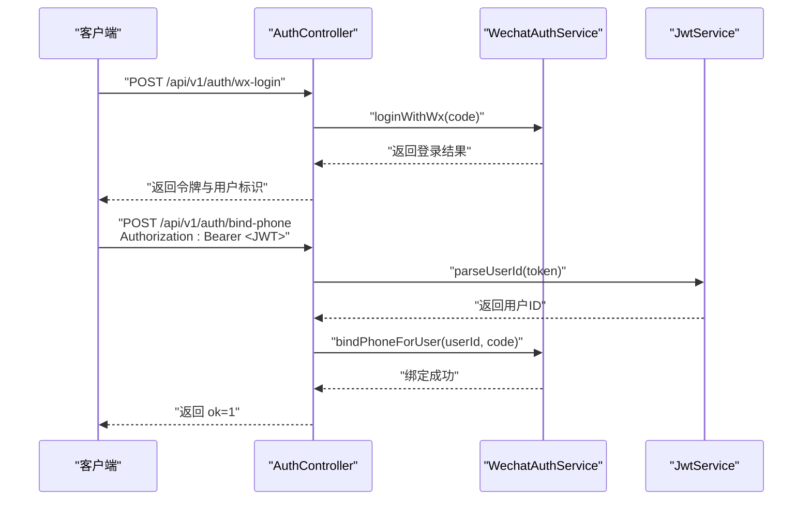
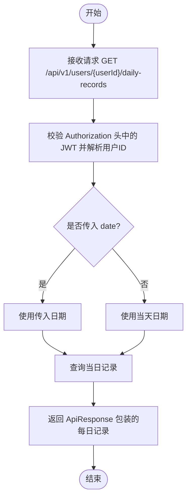
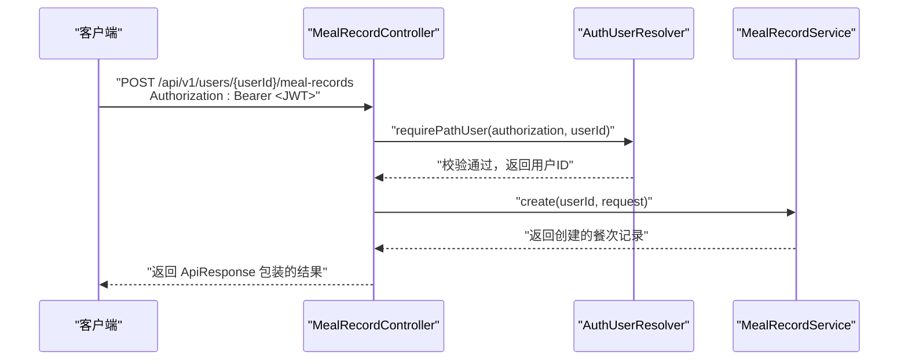
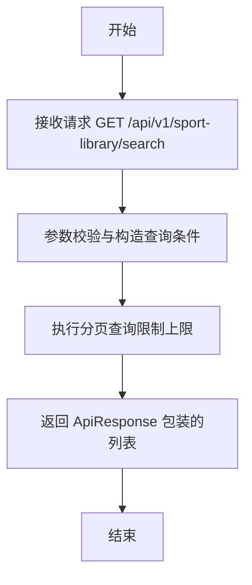
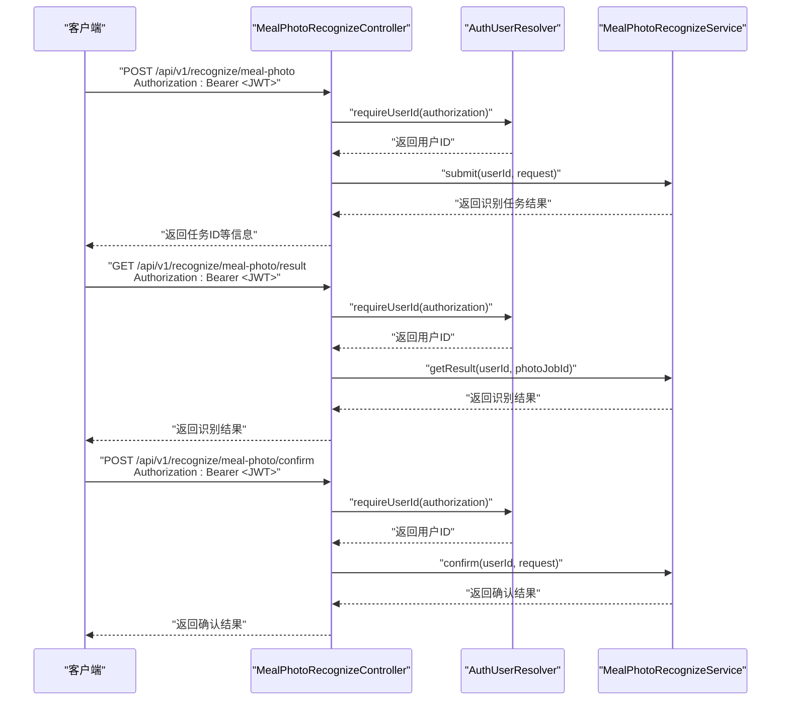
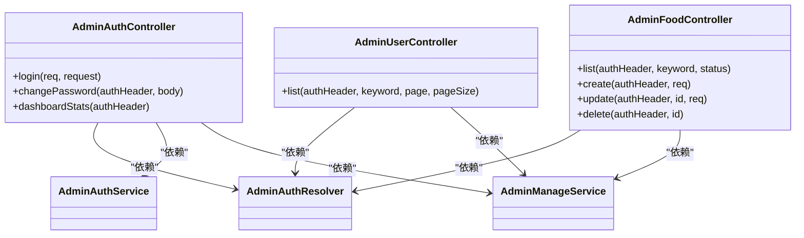
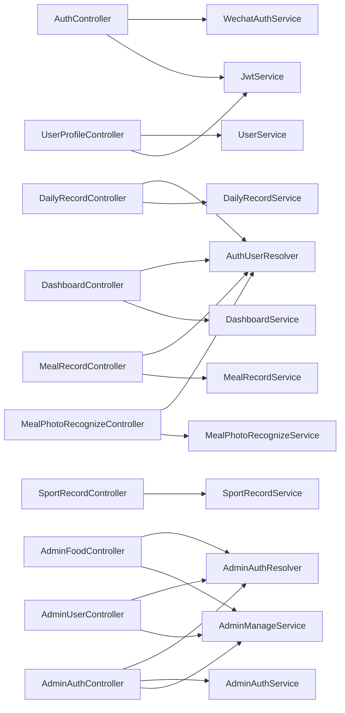

# API接口文档

<cite>
**本文档引用的文件**
- [LoseweightApplication.java](file://backend/src/main/java/com/ypfr/loseweight/LoseweightApplication.java)
- [AuthController.java](file://backend/src/main/java/com/ypfr/loseweight/web/AuthController.java)
- [UserProfileController.java](file://backend/src/main/java/com/ypfr/loseweight/web/UserProfileController.java)
- [UserController.java](file://backend/src/main/java/com/ypfr/loseweight/web/UserController.java)
- [WeightController.java](file://backend/src/main/java/com/ypfr/loseweight/web/WeightController.java)
- [DailyRecordController.java](file://backend/src/main/java/com/ypfr/loseweight/web/DailyRecordController.java)
- [DashboardController.java](file://backend/src/main/java/com/ypfr/loseweight/web/DashboardController.java)
- [FoodLibraryController.java](file://backend/src/main/java/com/ypfr/loseweight/web/FoodLibraryController.java)
- [FoodRecognizeController.java](file://backend/src/main/java/com/ypfr/loseweight/web/FoodRecognizeController.java)
- [MealRecordController.java](file://backend/src/main/java/com/ypfr/loseweight/web/MealRecordController.java)
- [SportLibraryController.java](file://backend/src/main/java/com/ypfr/loseweight/web/SportLibraryController.java)
- [SportRecordController.java](file://backend/src/main/java/com/ypfr/loseweight/web/SportRecordController.java)
- [MealPhotoRecognizeController.java](file://backend/src/main/java/com/ypfr/loseweight/web/MealPhotoRecognizeController.java)
- [AdminAuthController.java](file://backend/src/main/java/com/ypfr/loseweight/web/AdminAuthController.java)
- [AdminUserController.java](file://backend/src/main/java/com/ypfr/loseweight/web/AdminUserController.java)
- [AdminFoodController.java](file://backend/src/main/java/com/ypfr/loseweight/web/AdminFoodController.java)
</cite>

## 目录
1. [简介](#简介)
2. [项目结构](#项目结构)
3. [核心组件](#核心组件)
4. [架构总览](#架构总览)
5. [详细组件分析](#详细组件分析)
6. [依赖分析](#依赖分析)
7. [性能考虑](#性能考虑)
8. [故障排除指南](#故障排除指南)
9. [结论](#结论)
10. [附录](#附录)

## 简介
本项目为一个减肥健康管理平台，提供面向用户的健康数据管理与面向管理后台的运营能力。后端采用 Spring Boot 构建，RESTful API 基于版本化路径组织，主要分为以下几类：
- 用户认证与个人资料：微信登录、手机号绑定、个人资料查询与更新
- 用户日常管理：体重记录、每日汇总、仪表盘、周统计
- 饮食管理：食物库检索、食物识别、餐次记录与批量导入
- 运动管理：运动库检索、运动记录管理
- 拍照识别：图片提交、识别结果轮询、识别确认
- 管理后台：管理员登录、密码修改、用户列表、食物管理、仪表盘统计

所有接口均返回统一响应包装对象，并在需要时进行 JWT 认证校验。

## 项目结构
后端以包结构划分领域层，Web 层控制器按功能域组织，服务层负责业务逻辑，Mapper 层负责数据库访问。应用启动类启用 MyBatis Mapper 扫描与配置类属性绑定。

图表来源
- [LoseweightApplication.java:12-19](file://backend/src/main/java/com/ypfr/loseweight/LoseweightApplication.java#L12-L19)

章节来源
- [LoseweightApplication.java:1-26](file://backend/src/main/java/com/ypfr/loseweight/LoseweightApplication.java#L1-L26)

## 核心组件
- 统一响应包装：所有接口返回统一的响应体封装，便于前端解析与错误处理。
- 认证机制：用户端通过 JWT Bearer Token 认证；管理端通过管理员登录获取令牌后调用受保护接口。
- 参数校验：使用 Jakarta Bean Validation 注解对请求参数进行校验。
- 路径设计：接口路径采用 /api/v1/{resource} 的版本化结构，便于后续演进。

章节来源
- [AuthController.java:32-39](file://backend/src/main/java/com/ypfr/loseweight/web/AuthController.java#L32-L39)
- [UserProfileController.java:50-55](file://backend/src/main/java/com/ypfr/loseweight/web/UserProfileController.java#L50-L55)

## 架构总览
下图展示了用户端与管理端的关键接口交互流程，以及认证与授权的控制点。

图表来源
- [AuthController.java:33-39](file://backend/src/main/java/com/ypfr/loseweight/web/AuthController.java#L33-L39)
- [UserProfileController.java:57-78](file://backend/src/main/java/com/ypfr/loseweight/web/UserProfileController.java#L57-L78)
- [WeightController.java:26-37](file://backend/src/main/java/com/ypfr/loseweight/web/WeightController.java#L26-L37)
- [DailyRecordController.java:27-38](file://backend/src/main/java/com/ypfr/loseweight/web/DailyRecordController.java#L27-L38)
- [DashboardController.java:27-37](file://backend/src/main/java/com/ypfr/loseweight/web/DashboardController.java#L27-L37)
- [FoodLibraryController.java:22-29](file://backend/src/main/java/com/ypfr/loseweight/web/FoodLibraryController.java#L22-L29)
- [FoodRecognizeController.java:23-26](file://backend/src/main/java/com/ypfr/loseweight/web/FoodRecognizeController.java#L23-L26)
- [MealRecordController.java:30-59](file://backend/src/main/java/com/ypfr/loseweight/web/MealRecordController.java#L30-L59)
- [SportLibraryController.java:24-34](file://backend/src/main/java/com/ypfr/loseweight/web/SportLibraryController.java#L24-L34)
- [SportRecordController.java:24-34](file://backend/src/main/java/com/ypfr/loseweight/web/SportRecordController.java#L24-L34)
- [MealPhotoRecognizeController.java:33-61](file://backend/src/main/java/com/ypfr/loseweight/web/MealPhotoRecognizeController.java#L33-L61)
- [AdminAuthController.java:36-60](file://backend/src/main/java/com/ypfr/loseweight/web/AdminAuthController.java#L36-L60)
- [AdminUserController.java:25-33](file://backend/src/main/java/com/ypfr/loseweight/web/AdminUserController.java#L25-L33)
- [AdminFoodController.java:32-65](file://backend/src/main/java/com/ypfr/loseweight/web/AdminFoodController.java#L32-L65)

## 详细组件分析

### 用户认证与个人资料

- 微信登录
  - 方法与路径：POST /api/v1/auth/wx-login
  - 请求体：包含小程序登录所需的 code 等参数
  - 响应体：登录成功返回令牌与用户标识等信息
  - 认证方式：无需认证
  - 错误处理：参数校验失败或登录异常将返回统一错误响应
  - 安全考虑：登录日志记录 IP 与 UA，防止滥用
  - 版本信息：v1

- 绑定手机号
  - 方法与路径：POST /api/v1/auth/bind-phone
  - 请求头：Authorization: Bearer <JWT>
  - 请求体：包含获取手机号的 code
  - 响应体：成功返回 ok=1
  - 认证方式：JWT
  - 错误处理：未携带有效令牌时返回 401
  - 安全考虑：仅允许绑定当前令牌对应用户
  - 版本信息：v1

- 个人资料查询
  - 方法与路径：GET /api/v1/user/profile
  - 请求头：Authorization: Bearer <JWT>
  - 响应体：当前用户资料
  - 认证方式：JWT
  - 版本信息：v1

- 更新个人资料
  - 方法与路径：POST /api/v1/user/profile/update
  - 请求头：Authorization: Bearer <JWT>
  - 请求体：用户资料更新项
  - 响应体：更新后的用户资料
  - 认证方式：JWT
  - 性能：资料变更后会尝试刷新当日日汇总预算，失败时记录告警
  - 版本信息：v1

- 绑定手机号（用户端）
  - 方法与路径：POST /api/v1/user/bind-phone
  - 请求头：Authorization: Bearer <JWT>
  - 请求体：包含获取手机号的 code
  - 响应体：成功返回 ok=1
  - 认证方式：JWT
  - 版本信息：v1

图表来源
- [AuthController.java:33-53](file://backend/src/main/java/com/ypfr/loseweight/web/AuthController.java#L33-L53)
- [UserProfileController.java:80-88](file://backend/src/main/java/com/ypfr/loseweight/web/UserProfileController.java#L80-L88)

章节来源
- [AuthController.java:32-53](file://backend/src/main/java/com/ypfr/loseweight/web/AuthController.java#L32-L53)
- [UserProfileController.java:50-88](file://backend/src/main/java/com/ypfr/loseweight/web/UserProfileController.java#L50-L88)

### 用户日常管理

- 获取用户信息
  - 方法与路径：GET /api/v1/users/{id}
  - 响应体：指定用户的基本信息
  - 认证方式：无需认证
  - 版本信息：v1

- 周统计
  - 方法与路径：GET /api/v1/users/{userId}/week-stats
  - 查询参数：startDate、endDate（ISO 日期）
  - 响应体：指定时间范围内的周统计
  - 认证方式：无需认证
  - 版本信息：v1

- 体重记录
  - 方法与路径：GET /api/v1/users/{userId}/weight-records
  - 查询参数：limit（默认 30，最大 200）
  - 响应体：最近体重记录列表
  - 认证方式：无需认证
  - 版本信息：v1

- 新增体重记录
  - 方法与路径：POST /api/v1/users/{userId}/weight-records
  - 请求体：recordDate、weightKg
  - 响应体：新增的体重记录
  - 认证方式：无需认证
  - 版本信息：v1

- 每日记录
  - 方法与路径：GET /api/v1/users/{userId}/daily-records
  - 请求头：Authorization: Bearer <JWT>
  - 查询参数：date（可选，默认当天）
  - 响应体：指定日期的每日记录
  - 认证方式：JWT
  - 版本信息：v1

- 仪表盘
  - 方法与路径：GET /api/v1/users/{userId}/dashboard
  - 请求头：Authorization: Bearer <JWT>
  - 查询参数：date（可选，默认当天）
  - 响应体：仪表盘聚合数据
  - 认证方式：JWT
  - 版本信息：v1

图表来源
- [DailyRecordController.java:27-38](file://backend/src/main/java/com/ypfr/loseweight/web/DailyRecordController.java#L27-L38)

章节来源
- [UserController.java:28-39](file://backend/src/main/java/com/ypfr/loseweight/web/UserController.java#L28-L39)
- [WeightController.java:26-37](file://backend/src/main/java/com/ypfr/loseweight/web/WeightController.java#L26-L37)
- [DailyRecordController.java:27-38](file://backend/src/main/java/com/ypfr/loseweight/web/DailyRecordController.java#L27-L38)
- [DashboardController.java:27-37](file://backend/src/main/java/com/ypfr/loseweight/web/DashboardController.java#L27-L37)

### 饮食管理

- 食物库检索
  - 方法与路径：GET /api/v1/food-library/search
  - 查询参数：q（关键词）、limit（默认 30）、forUserId（用户ID）、categoryCode（分类编码）
  - 响应体：匹配的食物列表
  - 认证方式：无需认证
  - 版本信息：v1

- 食物识别
  - 方法与路径：POST /api/v1/food/recognize
  - 请求体：识别请求参数
  - 响应体：识别结果
  - 认证方式：无需认证
  - 版本信息：v1

- 餐次记录
  - 方法与路径：POST /api/v1/users/{userId}/meal-records
  - 请求头：Authorization: Bearer <JWT>
  - 请求体：餐次记录创建参数
  - 响应体：创建的餐次记录
  - 认证方式：JWT
  - 版本信息：v1

- 批量餐次记录
  - 方法与路径：POST /api/v1/users/{userId}/meal-records/batch
  - 请求头：Authorization: Bearer <JWT>
  - 请求体：批量创建参数（同一天同一餐次复用已有主记录）
  - 响应体：批量创建结果
  - 认证方式：JWT
  - 版本信息：v1

- 删除餐次记录
  - 方法与路径：DELETE /api/v1/users/{userId}/meal-records/{id}
  - 请求头：Authorization: Bearer <JWT>
  - 响应体：空
  - 认证方式：JWT
  - 版本信息：v1

图表来源
- [MealRecordController.java:30-37](file://backend/src/main/java/com/ypfr/loseweight/web/MealRecordController.java#L30-L37)

章节来源
- [FoodLibraryController.java:22-29](file://backend/src/main/java/com/ypfr/loseweight/web/FoodLibraryController.java#L22-L29)
- [FoodRecognizeController.java:23-26](file://backend/src/main/java/com/ypfr/loseweight/web/FoodRecognizeController.java#L23-L26)
- [MealRecordController.java:30-59](file://backend/src/main/java/com/ypfr/loseweight/web/MealRecordController.java#L30-L59)

### 运动管理

- 运动库检索
  - 方法与路径：GET /api/v1/sport-library/search
  - 查询参数：q（关键词）、limit（默认 50，上限 200）
  - 响应体：匹配的运动项目列表
  - 认证方式：无需认证
  - 版本信息：v1

- 运动记录
  - 方法与路径：POST /api/v1/users/{userId}/sport-records
  - 请求体：运动记录创建参数
  - 响应体：创建的运动记录
  - 认证方式：无需认证
  - 版本信息：v1

- 删除运动记录
  - 方法与路径：DELETE /api/v1/users/{userId}/sport-records/{id}
  - 响应体：空
  - 认证方式：无需认证
  - 版本信息：v1

图表来源
- [SportLibraryController.java:24-34](file://backend/src/main/java/com/ypfr/loseweight/web/SportLibraryController.java#L24-L34)

章节来源
- [SportLibraryController.java:24-34](file://backend/src/main/java/com/ypfr/loseweight/web/SportLibraryController.java#L24-L34)
- [SportRecordController.java:24-34](file://backend/src/main/java/com/ypfr/loseweight/web/SportRecordController.java#L24-L34)

### 拍照识别

- 提交照片识别
  - 方法与路径：POST /api/v1/recognize/meal-photo
  - 请求头：Authorization: Bearer <JWT>
  - 请求体：照片识别提交参数
  - 响应体：识别任务结果（含 job ID）
  - 认证方式：JWT
  - 版本信息：v1

- 查询识别结果
  - 方法与路径：GET /api/v1/recognize/meal-photo/result
  - 请求头：Authorization: Bearer <JWT>
  - 查询参数：photoJobId
  - 响应体：识别结果详情
  - 认证方式：JWT
  - 版本信息：v1

- 确认识别结果
  - 方法与路径：POST /api/v1/recognize/meal-photo/confirm
  - 请求头：Authorization: Bearer <JWT>
  - 请求体：识别确认参数
  - 响应体：确认结果
  - 认证方式：JWT
  - 版本信息：v1

图表来源
- [MealPhotoRecognizeController.java:33-61](file://backend/src/main/java/com/ypfr/loseweight/web/MealPhotoRecognizeController.java#L33-L61)

章节来源
- [MealPhotoRecognizeController.java:33-61](file://backend/src/main/java/com/ypfr/loseweight/web/MealPhotoRecognizeController.java#L33-L61)

### 管理后台

- 管理员登录
  - 方法与路径：POST /api/v1/admin/login
  - 请求体：用户名、密码
  - 响应体：登录成功返回令牌与管理员标识
  - 认证方式：无需认证
  - 版本信息：v1

- 修改密码
  - 方法与路径：POST /api/v1/admin/change-password
  - 请求头：Authorization: Bearer <JWT>
  - 请求体：旧密码、新密码
  - 响应体：true
  - 认证方式：JWT
  - 版本信息：v1

- 仪表盘统计
  - 方法与路径：GET /api/v1/admin/dashboard/stats
  - 请求头：Authorization: Bearer <JWT>
  - 响应体：管理看板统计数据
  - 认证方式：JWT
  - 版本信息：v1

- 用户列表
  - 方法与路径：GET /api/v1/admin/users
  - 请求头：Authorization: Bearer <JWT>
  - 查询参数：keyword（关键词）、page（页码，默认 1）、pageSize（每页数量，默认 20）
  - 响应体：分页用户列表
  - 认证方式：JWT
  - 版本信息：v1

- 食物管理
  - 列表：GET /api/v1/admin/foods（支持 keyword、status 过滤）
  - 新增：POST /api/v1/admin/foods
  - 更新：PUT /api/v1/admin/foods/{id}
  - 删除：DELETE /api/v1/admin/foods/{id}
  - 认证方式：JWT
  - 版本信息：v1

图表来源
- [AdminAuthController.java:27-60](file://backend/src/main/java/com/ypfr/loseweight/web/AdminAuthController.java#L27-L60)
- [AdminUserController.java:25-33](file://backend/src/main/java/com/ypfr/loseweight/web/AdminUserController.java#L25-L33)
- [AdminFoodController.java:32-65](file://backend/src/main/java/com/ypfr/loseweight/web/AdminFoodController.java#L32-L65)

章节来源
- [AdminAuthController.java:36-60](file://backend/src/main/java/com/ypfr/loseweight/web/AdminAuthController.java#L36-L60)
- [AdminUserController.java:25-33](file://backend/src/main/java/com/ypfr/loseweight/web/AdminUserController.java#L25-L33)
- [AdminFoodController.java:32-65](file://backend/src/main/java/com/ypfr/loseweight/web/AdminFoodController.java#L32-L65)

## 依赖分析
- 控制器到服务层：各控制器通过构造函数注入对应服务，职责清晰，耦合度低。
- 认证解析：用户端与管理端分别使用 AuthUserResolver 与 AdminAuthResolver 解析令牌并校验权限。
- 数据访问：Mapper 层由 MyBatis 扫描，控制器不直接操作数据库。
- 统一响应：所有接口返回统一包装对象，便于前端统一处理。

图表来源
- [AuthController.java:24-30](file://backend/src/main/java/com/ypfr/loseweight/web/AuthController.java#L24-L30)
- [UserProfileController.java:34-48](file://backend/src/main/java/com/ypfr/loseweight/web/UserProfileController.java#L34-L48)
- [DailyRecordController.java:19-25](file://backend/src/main/java/com/ypfr/loseweight/web/DailyRecordController.java#L19-L25)
- [DashboardController.java:19-25](file://backend/src/main/java/com/ypfr/loseweight/web/DashboardController.java#L19-L25)
- [MealRecordController.java:21-28](file://backend/src/main/java/com/ypfr/loseweight/web/MealRecordController.java#L21-L28)
- [SportRecordController.java:18-22](file://backend/src/main/java/com/ypfr/loseweight/web/SportRecordController.java#L18-L22)
- [MealPhotoRecognizeController.java:24-31](file://backend/src/main/java/com/ypfr/loseweight/web/MealPhotoRecognizeController.java#L24-L31)
- [AdminFoodController.java:24-30](file://backend/src/main/java/com/ypfr/loseweight/web/AdminFoodController.java#L24-L30)
- [AdminUserController.java:17-23](file://backend/src/main/java/com/ypfr/loseweight/web/AdminUserController.java#L17-L23)
- [AdminAuthController.java:23-34](file://backend/src/main/java/com/ypfr/loseweight/web/AdminAuthController.java#L23-L34)

章节来源
- [AuthController.java:24-30](file://backend/src/main/java/com/ypfr/loseweight/web/AuthController.java#L24-L30)
- [UserProfileController.java:34-48](file://backend/src/main/java/com/ypfr/loseweight/web/UserProfileController.java#L34-L48)
- [DailyRecordController.java:19-25](file://backend/src/main/java/com/ypfr/loseweight/web/DailyRecordController.java#L19-L25)
- [DashboardController.java:19-25](file://backend/src/main/java/com/ypfr/loseweight/web/DashboardController.java#L19-L25)
- [MealRecordController.java:21-28](file://backend/src/main/java/com/ypfr/loseweight/web/MealRecordController.java#L21-L28)
- [SportRecordController.java:18-22](file://backend/src/main/java/com/ypfr/loseweight/web/SportRecordController.java#L18-L22)
- [MealPhotoRecognizeController.java:24-31](file://backend/src/main/java/com/ypfr/loseweight/web/MealPhotoRecognizeController.java#L24-L31)
- [AdminFoodController.java:24-30](file://backend/src/main/java/com/ypfr/loseweight/web/AdminFoodController.java#L24-L30)
- [AdminUserController.java:17-23](file://backend/src/main/java/com/ypfr/loseweight/web/AdminUserController.java#L17-L23)
- [AdminAuthController.java:23-34](file://backend/src/main/java/com/ypfr/loseweight/web/AdminAuthController.java#L23-L34)

## 性能考虑
- 分页与限制：食物库检索与体重记录等接口对 limit 进行上限控制，避免过大查询导致资源消耗。
- 日汇总重算：资料更新后尝试刷新当日日汇总预算，确保数据一致性但可能带来额外计算开销。
- 结果轮询：拍照识别采用异步任务 + 轮询查询结果，减少长连接占用。
- 缓存策略：可在服务层引入缓存（如 Redis）存储热点数据（如食物库、运动库），降低数据库压力。
- 并发控制：对高并发场景下的写操作（如批量餐次记录）建议增加幂等性与去重逻辑。

## 故障排除指南
- 401 未授权
  - 现象：调用需要 JWT 的接口时返回未授权
  - 排查：确认 Authorization 头格式为 Bearer <JWT>，且令牌未过期
  - 参考路径：[UserProfileController.java:50-55](file://backend/src/main/java/com/ypfr/loseweight/web/UserProfileController.java#L50-L55)，[AuthController.java:46-48](file://backend/src/main/java/com/ypfr/loseweight/web/AuthController.java#L46-L48)

- 参数校验失败
  - 现象：请求参数缺失或格式不正确导致错误
  - 排查：检查请求体与查询参数是否符合接口定义
  - 参考路径：[MealRecordController.java:30-37](file://backend/src/main/java/com/ypfr/loseweight/web/MealRecordController.java#L30-L37)，[FoodLibraryController.java:22-29](file://backend/src/main/java/com/ypfr/loseweight/web/FoodLibraryController.java#L22-L29)

- 管理端权限不足
  - 现象：管理接口返回未授权或无权限
  - 排查：确认管理员登录状态与令牌有效性
  - 参考路径：[AdminAuthController.java:47-51](file://backend/src/main/java/com/ypfr/loseweight/web/AdminAuthController.java#L47-L51)，[AdminUserController.java:31](file://backend/src/main/java/com/ypfr/loseweight/web/AdminUserController.java#L31)

- 日汇总刷新失败
  - 现象：资料更新后日汇总预算未刷新
  - 排查：查看服务层日志，确认异常原因
  - 参考路径：[UserProfileController.java:72-77](file://backend/src/main/java/com/ypfr/loseweight/web/UserProfileController.java#L72-L77)

章节来源
- [UserProfileController.java:50-55](file://backend/src/main/java/com/ypfr/loseweight/web/UserProfileController.java#L50-L55)
- [AuthController.java:46-48](file://backend/src/main/java/com/ypfr/loseweight/web/AuthController.java#L46-L48)
- [MealRecordController.java:30-37](file://backend/src/main/java/com/ypfr/loseweight/web/MealRecordController.java#L30-L37)
- [FoodLibraryController.java:22-29](file://backend/src/main/java/com/ypfr/loseweight/web/FoodLibraryController.java#L22-L29)
- [AdminAuthController.java:47-51](file://backend/src/main/java/com/ypfr/loseweight/web/AdminAuthController.java#L47-L51)
- [AdminUserController.java:31](file://backend/src/main/java/com/ypfr/loseweight/web/AdminUserController.java#L31)
- [UserProfileController.java:72-77](file://backend/src/main/java/com/ypfr/loseweight/web/UserProfileController.java#L72-L77)

## 结论
本项目提供了完整的用户端与管理端 RESTful API，覆盖认证、个人资料、体重记录、每日汇总、仪表盘、食物库与识别、餐次记录、运动库与记录、拍照识别以及管理后台的核心能力。接口设计遵循统一响应与版本化路径，结合 JWT 认证与参数校验，具备良好的扩展性与安全性。建议在生产环境中进一步完善缓存、限流与监控体系，并持续优化识别与统计算法的性能。

## 附录
- 协议与版本
  - 协议：HTTP/HTTPS
  - 版本：v1（路径前缀 /api/v1）
- 认证与授权
  - 用户端：JWT Bearer Token
  - 管理端：管理员登录后获取令牌
- 错误处理
  - 统一响应包装，错误码与消息由服务层抛出并在全局异常处理器中转换
- 速率限制
  - 当前未发现显式限流实现，建议在网关或服务层增加基于令牌或 IP 的限流策略
- 客户端实现建议
  - 使用拦截器自动附加 Authorization 头
  - 对拍照识别采用轮询策略，设置合理的超时与重试
  - 对高并发写操作增加本地去重与幂等校验
- 性能优化建议
  - 引入缓存（Redis）缓存热点数据
  - 对大数据量查询增加索引与分页
  - 对识别与统计任务异步化，提升用户体验