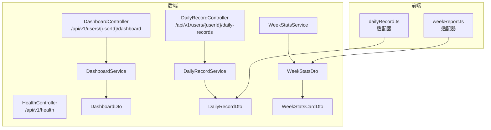
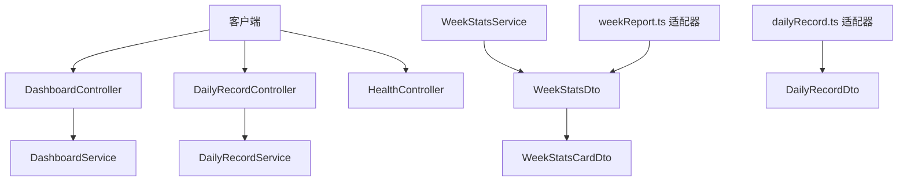
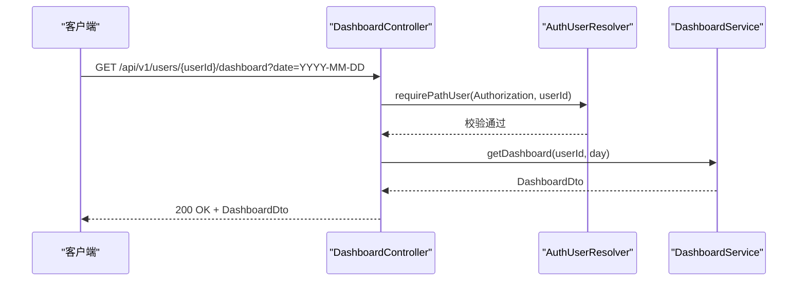
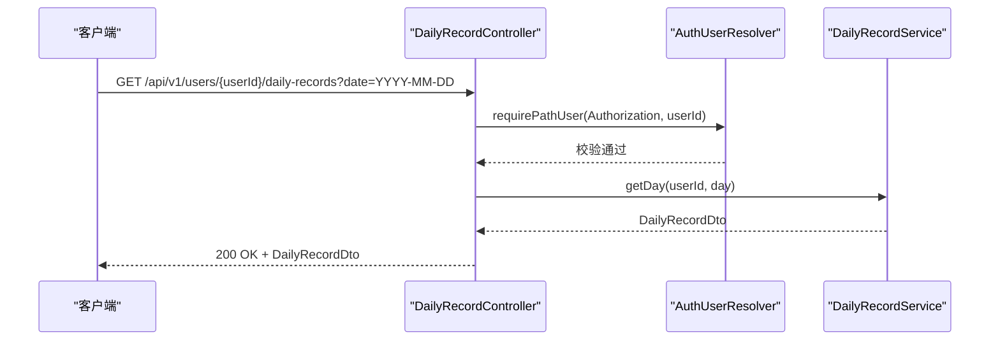
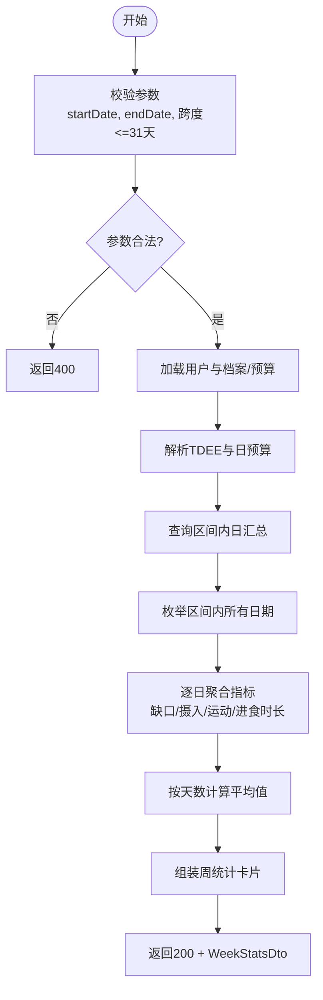
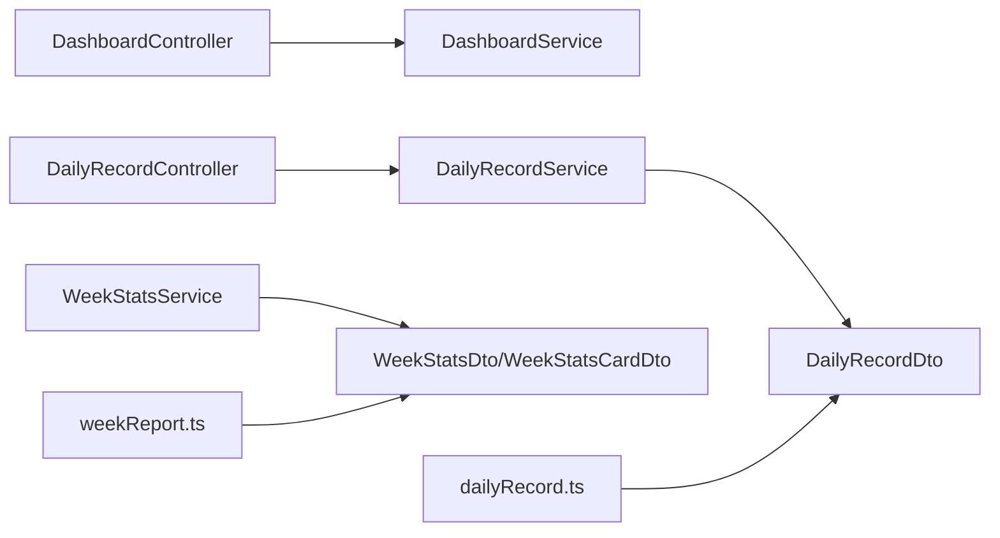

# 仪表板与统计接口

<cite>
**本文引用的文件**
- [DashboardController.java](file://backend/src/main/java/com/ypfr/loseweight/web/DashboardController.java)
- [DailyRecordController.java](file://backend/src/main/java/com/ypfr/loseweight/web/DailyRecordController.java)
- [HealthController.java](file://backend/src/main/java/com/ypfr/loseweight/web/HealthController.java)
- [DashboardService.java](file://backend/src/main/java/com/ypfr/loseweight/service/DashboardService.java)
- [DailyRecordService.java](file://backend/src/main/java/com/ypfr/loseweight/service/DailyRecordService.java)
- [WeekStatsService.java](file://backend/src/main/java/com/ypfr/loseweight/service/WeekStatsService.java)
- [DashboardDto.java](file://backend/src/main/java/com/ypfr/loseweight/web/dto/DashboardDto.java)
- [DailyRecordDto.java](file://backend/src/main/java/com/ypfr/loseweight/web/dto/DailyRecordDto.java)
- [WeekStatsDto.java](file://backend/src/main/java/com/ypfr/loseweight/web/dto/WeekStatsDto.java)
- [WeekStatsCardDto.java](file://backend/src/main/java/com/ypfr/loseweight/web/dto/WeekStatsCardDto.java)
- [dailyRecord.ts](file://frontend/src/api/adapters/dailyRecord.ts)
- [weekReport.ts](file://frontend/src/api/adapters/weekReport.ts)
</cite>

## 目录
1. [简介](#简介)
2. [项目结构](#项目结构)
3. [核心组件](#核心组件)
4. [架构总览](#架构总览)
5. [详细组件分析](#详细组件分析)
6. [依赖分析](#依赖分析)
7. [性能考虑](#性能考虑)
8. [故障排除指南](#故障排除指南)
9. [结论](#结论)
10. [附录](#附录)

## 简介
本文件为“仪表板与统计”相关API接口的权威文档，覆盖以下接口族：
- 仪表板数据接口：/api/v1/users/{userId}/dashboard
- 日常记录聚合接口：/api/v1/users/{userId}/daily-records
- 周统计分析接口：/api/v1/users/{userId}/week-stats（由服务层实现，具体控制器未在已知上下文中出现）

文档内容包括HTTP方法、URL模式、请求/响应模式、认证方式、健康检查、错误处理策略、数据聚合算法、统计口径说明、版本信息、常见用例、客户端实现指南以及数据可视化支持。

## 项目结构
后端采用Spring Boot结构，控制器位于web包，业务逻辑位于service包，数据传输对象位于web/dto包。前端通过适配器对后端返回的DTO进行兼容性处理。

**图示来源**
- [DashboardController.java:14-38](file://backend/src/main/java/com/ypfr/loseweight/web/DashboardController.java#L14-L38)
- [DailyRecordController.java:14-39](file://backend/src/main/java/com/ypfr/loseweight/web/DailyRecordController.java#L14-L39)
- [HealthController.java:9-17](file://backend/src/main/java/com/ypfr/loseweight/web/HealthController.java#L9-L17)
- [DashboardService.java:18-91](file://backend/src/main/java/com/ypfr/loseweight/service/DashboardService.java#L18-L91)
- [DailyRecordService.java:20-178](file://backend/src/main/java/com/ypfr/loseweight/service/DailyRecordService.java#L20-L178)
- [WeekStatsService.java:21-304](file://backend/src/main/java/com/ypfr/loseweight/service/WeekStatsService.java#L21-L304)
- [DashboardDto.java:1-42](file://backend/src/main/java/com/ypfr/loseweight/web/dto/DashboardDto.java#L1-L42)
- [DailyRecordDto.java:1-53](file://backend/src/main/java/com/ypfr/loseweight/web/dto/DailyRecordDto.java#L1-L53)
- [WeekStatsDto.java:1-17](file://backend/src/main/java/com/ypfr/loseweight/web/dto/WeekStatsDto.java#L1-L17)
- [WeekStatsCardDto.java:1-118](file://backend/src/main/java/com/ypfr/loseweight/web/dto/WeekStatsCardDto.java#L1-L118)
- [dailyRecord.ts:1-7](file://frontend/src/api/adapters/dailyRecord.ts#L1-L7)
- [weekReport.ts:1-46](file://frontend/src/api/adapters/weekReport.ts#L1-L46)

**章节来源**
- [DashboardController.java:14-38](file://backend/src/main/java/com/ypfr/loseweight/web/DashboardController.java#L14-L38)
- [DailyRecordController.java:14-39](file://backend/src/main/java/com/ypfr/loseweight/web/DailyRecordController.java#L14-L39)
- [HealthController.java:9-17](file://backend/src/main/java/com/ypfr/loseweight/web/HealthController.java#L9-L17)

## 核心组件
- 控制器层：负责路由、参数解析与鉴权拦截，返回统一响应包装。
- 服务层：实现数据聚合、预算计算、统计口径与图表所需指标。
- DTO层：定义前后端交互的数据结构，确保字段一致性与可扩展性。
- 前端适配器：对后端DTO进行兼容性映射，保证图表渲染稳定。

**章节来源**
- [DashboardService.java:18-91](file://backend/src/main/java/com/ypfr/loseweight/service/DashboardService.java#L18-L91)
- [DailyRecordService.java:20-178](file://backend/src/main/java/com/ypfr/loseweight/service/DailyRecordService.java#L20-L178)
- [WeekStatsService.java:21-304](file://backend/src/main/java/com/ypfr/loseweight/service/WeekStatsService.java#L21-L304)
- [DashboardDto.java:1-42](file://backend/src/main/java/com/ypfr/loseweight/web/dto/DashboardDto.java#L1-L42)
- [DailyRecordDto.java:1-53](file://backend/src/main/java/com/ypfr/loseweight/web/dto/DailyRecordDto.java#L1-L53)
- [WeekStatsDto.java:1-17](file://backend/src/main/java/com/ypfr/loseweight/web/dto/WeekStatsDto.java#L1-L17)
- [WeekStatsCardDto.java:1-118](file://backend/src/main/java/com/ypfr/loseweight/web/dto/WeekStatsCardDto.java#L1-L118)
- [dailyRecord.ts:1-7](file://frontend/src/api/adapters/dailyRecord.ts#L1-L7)
- [weekReport.ts:1-46](file://frontend/src/api/adapters/weekReport.ts#L1-L46)

## 架构总览
后端采用“控制器-服务-数据传输对象”的分层设计，前端通过适配器对DTO进行兼容处理，确保图表渲染的稳定性与可维护性。

**图示来源**
- [DashboardController.java:14-38](file://backend/src/main/java/com/ypfr/loseweight/web/DashboardController.java#L14-L38)
- [DailyRecordController.java:14-39](file://backend/src/main/java/com/ypfr/loseweight/web/DailyRecordController.java#L14-L39)
- [HealthController.java:9-17](file://backend/src/main/java/com/ypfr/loseweight/web/HealthController.java#L9-L17)
- [DashboardService.java:18-91](file://backend/src/main/java/com/ypfr/loseweight/service/DashboardService.java#L18-L91)
- [DailyRecordService.java:20-178](file://backend/src/main/java/com/ypfr/loseweight/service/DailyRecordService.java#L20-L178)
- [WeekStatsService.java:21-304](file://backend/src/main/java/com/ypfr/loseweight/service/WeekStatsService.java#L21-L304)
- [DailyRecordDto.java:1-53](file://backend/src/main/java/com/ypfr/loseweight/web/dto/DailyRecordDto.java#L1-L53)
- [WeekStatsDto.java:1-17](file://backend/src/main/java/com/ypfr/loseweight/web/dto/WeekStatsDto.java#L1-L17)
- [WeekStatsCardDto.java:1-118](file://backend/src/main/java/com/ypfr/loseweight/web/dto/WeekStatsCardDto.java#L1-L118)
- [dailyRecord.ts:1-7](file://frontend/src/api/adapters/dailyRecord.ts#L1-L7)
- [weekReport.ts:1-46](file://frontend/src/api/adapters/weekReport.ts#L1-L46)

## 详细组件分析

### 仪表板数据接口
- 接口路径
  - 方法：GET
  - 路径：/api/v1/users/{userId}/dashboard
  - 查询参数：
    - date（可选）：ISO日期格式（YYYY-MM-DD），默认取当天
- 认证方式
  - 请求头：Authorization（Bearer Token）
  - 鉴权规则：通过路径userId与令牌绑定用户身份校验
- 响应数据结构（DashboardDto）
  - 字段：intakeCalories（当日摄入千卡）、sportCalories（当日运动消耗千卡）、dailyBudget（日预算千卡）、remainingCalories（剩余千卡）
- 数据聚合算法
  - 若存在当日日汇总，则直接取汇总字段；否则根据用户预算配置与当日摄入/运动记录计算
  - 剩余热量 = 日预算 − 当日摄入 + 当日运动消耗
- 错误处理
  - 用户不存在：返回404
  - 参数非法：返回400
- 版本信息
  - 基于当前实现，接口版本为v1

**图示来源**
- [DashboardController.java:27-37](file://backend/src/main/java/com/ypfr/loseweight/web/DashboardController.java#L27-L37)
- [DashboardService.java:41-84](file://backend/src/main/java/com/ypfr/loseweight/service/DashboardService.java#L41-L84)

**章节来源**
- [DashboardController.java:27-37](file://backend/src/main/java/com/ypfr/loseweight/web/DashboardController.java#L27-L37)
- [DashboardService.java:41-84](file://backend/src/main/java/com/ypfr/loseweight/service/DashboardService.java#L41-L84)
- [DashboardDto.java:1-42](file://backend/src/main/java/com/ypfr/loseweight/web/dto/DashboardDto.java#L1-L42)

### 日常记录聚合接口
- 接口路径
  - 方法：GET
  - 路径：/api/v1/users/{userId}/daily-records
  - 查询参数：
    - date（可选）：ISO日期格式（YYYY-MM-DD），默认取当天
- 认证方式
  - 请求头：Authorization（Bearer Token）
  - 鉴权规则：通过路径userId与令牌绑定用户身份校验
- 响应数据结构（DailyRecordDto）
  - 字段：date（字符串，如"2025-01-01"）、intakeCalories（当日摄入千卡）、sportCalories（当日运动消耗千卡）、macros（宏量营养素汇总）、timeline（按时间倒序的事件时间线）
  - macros：proteinG（蛋白质克数）、fatG（脂肪克数）、carbsG（碳水克数）、proteinTargetG（目标克数）、fatTargetG（目标克数）、carbTargetG（目标克数）
  - timeline：kind（meal或sport）、id、recordedAt（ISO时间）、title、subtitle、calories
- 数据聚合算法
  - 摄入/运动千卡：按用户与日期聚合求和
  - 宏量营养素：按日汇总蛋白质/脂肪/碳水克数，并填充用户目标值
  - 时间线：合并饮食与运动记录，按recordedAt降序排列
- 错误处理
  - 用户不存在：返回404
  - 参数非法：返回400
- 版本信息
  - 基于当前实现，接口版本为v1

**图示来源**
- [DailyRecordController.java:27-38](file://backend/src/main/java/com/ypfr/loseweight/web/DailyRecordController.java#L27-L38)
- [DailyRecordService.java:44-84](file://backend/src/main/java/com/ypfr/loseweight/service/DailyRecordService.java#L44-L84)

**章节来源**
- [DailyRecordController.java:27-38](file://backend/src/main/java/com/ypfr/loseweight/web/DailyRecordController.java#L27-L38)
- [DailyRecordService.java:44-84](file://backend/src/main/java/com/ypfr/loseweight/service/DailyRecordService.java#L44-L84)
- [DailyRecordDto.java:1-53](file://backend/src/main/java/com/ypfr/loseweight/web/dto/DailyRecordDto.java#L1-L53)

### 周统计分析接口
- 接口路径
  - 方法：GET（服务层实现，具体控制器未在已知上下文中出现）
  - 路径：/api/v1/users/{userId}/week-stats
  - 查询参数：
    - startDate（必填）：起始日期（YYYY-MM-DD）
    - endDate（必填）：结束日期（YYYY-MM-DD）
- 认证方式
  - 请求头：Authorization（Bearer Token）
  - 鉴权规则：通过路径userId与令牌绑定用户身份校验
- 响应数据结构（WeekStatsDto）
  - cards：WeekStatsCardDto数组，每张卡片代表一个统计维度
- 统计维度与算法
  - 日均热量缺口：基于每日实际缺口或按TDEE-摄入+运动计算，按区间天数平均
  - 日均饮食摄入：按区间天数平均
  - 日运动消耗：按区间天数平均
  - 日均轻断食用餐时长：仅统计有进食窗口的天数，按有效天数平均
  - TDEE与目标：优先使用用户预算中的计算值，否则基于性别、年龄、身高、体重与活动系数计算
  - 区间限制：最大统计跨度31天
- 图表与可视化
  - 每个卡片包含values（逐日数值）、yAxisLabels（坐标轴刻度）、guideValue（参考线值）、barColor/guideColor等
  - 支持正向/负向/空数据三种模式
- 错误处理
  - 缺少起止日期：返回400
  - 结束日期早于起始日期：返回400
  - 跨度超过31天：返回400
  - 用户不存在：返回404
- 版本信息
  - 基于当前实现，接口版本为v1

**图示来源**
- [WeekStatsService.java:39-128](file://backend/src/main/java/com/ypfr/loseweight/service/WeekStatsService.java#L39-L128)

**章节来源**
- [WeekStatsService.java:39-128](file://backend/src/main/java/com/ypfr/loseweight/service/WeekStatsService.java#L39-L128)
- [WeekStatsDto.java:1-17](file://backend/src/main/java/com/ypfr/loseweight/web/dto/WeekStatsDto.java#L1-L17)
- [WeekStatsCardDto.java:1-118](file://backend/src/main/java/com/ypfr/loseweight/web/dto/WeekStatsCardDto.java#L1-L118)

### 健康检查接口
- 接口路径
  - 方法：GET
  - 路径：/api/v1/health
- 响应
  - 返回{"status":"UP"}，用于服务可用性探测
- 版本信息
  - 基于当前实现，接口版本为v1

**章节来源**
- [HealthController.java:13-16](file://backend/src/main/java/com/ypfr/loseweight/web/HealthController.java#L13-L16)

## 依赖分析
- 控制器依赖服务层，服务层依赖Mapper与用户服务以获取预算与档案数据
- DTO作为跨层契约，前端通过适配器确保字段兼容
- 前端适配器对WeekStatsDto与DailyRecordDto进行字段兜底与类型转换，提升图表渲染鲁棒性

**图示来源**
- [DashboardController.java:14-38](file://backend/src/main/java/com/ypfr/loseweight/web/DashboardController.java#L14-L38)
- [DailyRecordController.java:14-39](file://backend/src/main/java/com/ypfr/loseweight/web/DailyRecordController.java#L14-L39)
- [DashboardService.java:18-91](file://backend/src/main/java/com/ypfr/loseweight/service/DashboardService.java#L18-L91)
- [DailyRecordService.java:20-178](file://backend/src/main/java/com/ypfr/loseweight/service/DailyRecordService.java#L20-L178)
- [WeekStatsService.java:21-304](file://backend/src/main/java/com/ypfr/loseweight/service/WeekStatsService.java#L21-L304)
- [DailyRecordDto.java:1-53](file://backend/src/main/java/com/ypfr/loseweight/web/dto/DailyRecordDto.java#L1-L53)
- [WeekStatsDto.java:1-17](file://backend/src/main/java/com/ypfr/loseweight/web/dto/WeekStatsDto.java#L1-L17)
- [WeekStatsCardDto.java:1-118](file://backend/src/main/java/com/ypfr/loseweight/web/dto/WeekStatsCardDto.java#L1-L118)
- [dailyRecord.ts:1-7](file://frontend/src/api/adapters/dailyRecord.ts#L1-L7)
- [weekReport.ts:1-46](file://frontend/src/api/adapters/weekReport.ts#L1-L46)

**章节来源**
- [DashboardController.java:14-38](file://backend/src/main/java/com/ypfr/loseweight/web/DashboardController.java#L14-L38)
- [DailyRecordController.java:14-39](file://backend/src/main/java/com/ypfr/loseweight/web/DailyRecordController.java#L14-L39)
- [DashboardService.java:18-91](file://backend/src/main/java/com/ypfr/loseweight/service/DashboardService.java#L18-L91)
- [DailyRecordService.java:20-178](file://backend/src/main/java/com/ypfr/loseweight/service/DailyRecordService.java#L20-L178)
- [WeekStatsService.java:21-304](file://backend/src/main/java/com/ypfr/loseweight/service/WeekStatsService.java#L21-L304)
- [dailyRecord.ts:1-7](file://frontend/src/api/adapters/dailyRecord.ts#L1-L7)
- [weekReport.ts:1-46](file://frontend/src/api/adapters/weekReport.ts#L1-L46)

## 性能考虑
- 查询优化
  - 日汇总查询使用等值过滤与LIMIT约束，避免全表扫描
  - 区间统计通过between一次性拉取，减少多次往返
- 聚合精度
  - BigDecimal到int的舍入采用半入上，确保统计一致性
- 前端渲染
  - 适配器对数值进行兜底与归一化，降低图表异常风险
- 可扩展性
  - DTO独立于数据库结构，便于字段演进与兼容

[本节为通用性能建议，不直接分析具体文件]

## 故障排除指南
- 401 未授权
  - 检查Authorization头是否正确传递，且与路径userId匹配
- 403 禁止访问
  - 确认令牌对应用户与userId一致
- 404 用户不存在
  - 核对userId是否有效
- 400 参数非法
  - 检查date、startDate、endDate格式与范围
  - 区间跨度不得超过31天
- 前端图表异常
  - 使用适配器确保字段存在且类型正确
  - 关注yAxisLabels缺失时的默认值

**章节来源**
- [DashboardController.java:34-36](file://backend/src/main/java/com/ypfr/loseweight/web/DashboardController.java#L34-L36)
- [DailyRecordController.java:35-37](file://backend/src/main/java/com/ypfr/loseweight/web/DailyRecordController.java#L35-L37)
- [WeekStatsService.java:40-49](file://backend/src/main/java/com/ypfr/loseweight/service/WeekStatsService.java#L40-L49)
- [weekReport.ts:35-45](file://frontend/src/api/adapters/weekReport.ts#L35-L45)

## 结论
本API体系以清晰的分层设计与稳定的DTO契约支撑了仪表板与统计功能，结合前端适配器实现了良好的可视化兼容性。通过明确的统计口径与错误处理策略，能够满足健康数据汇总、趋势分析与周报生成等场景需求。

[本节为总结性内容，不直接分析具体文件]

## 附录

### 接口清单与示例

- 仪表板数据
  - 方法：GET
  - 路径：/api/v1/users/{userId}/dashboard
  - 查询参数：date（可选）
  - 认证：Authorization
  - 示例响应：DashboardDto（intakeCalories/sportCalories/dailyBudget/remainingCalories）

- 日常记录
  - 方法：GET
  - 路径：/api/v1/users/{userId}/daily-records
  - 查询参数：date（可选）
  - 认证：Authorization
  - 示例响应：DailyRecordDto（date/intakeCalories/sportCalories/macros/timeline）

- 周统计分析
  - 方法：GET
  - 路径：/api/v1/users/{userId}/week-stats
  - 查询参数：startDate、endDate
  - 认证：Authorization
  - 示例响应：WeekStatsDto（cards）

- 健康检查
  - 方法：GET
  - 路径：/api/v1/health
  - 示例响应：{"status":"UP"}

**章节来源**
- [DashboardController.java:27-37](file://backend/src/main/java/com/ypfr/loseweight/web/DashboardController.java#L27-L37)
- [DailyRecordController.java:27-38](file://backend/src/main/java/com/ypfr/loseweight/web/DailyRecordController.java#L27-L38)
- [WeekStatsService.java:39-128](file://backend/src/main/java/com/ypfr/loseweight/service/WeekStatsService.java#L39-L128)
- [HealthController.java:13-16](file://backend/src/main/java/com/ypfr/loseweight/web/HealthController.java#L13-L16)

### 数据聚合与统计口径说明
- 剩余热量 = 日预算 − 当日摄入 + 当日运动消耗
- 日均指标 = 总和 ÷ 区间日历天数（含无汇总日）
- 有效天数：仅统计存在进食窗口的天数，用于平均时长类指标
- TDEE与目标：优先使用预算计算值，否则基于基础代谢与活动系数推导

**章节来源**
- [DashboardService.java:40-84](file://backend/src/main/java/com/ypfr/loseweight/service/DashboardService.java#L40-L84)
- [WeekStatsService.java:110-128](file://backend/src/main/java/com/ypfr/loseweight/service/WeekStatsService.java#L110-L128)

### 客户端实现指南
- 仪表板与日常记录
  - 直接消费后端DTO，无需额外映射
- 周统计
  - 使用weekReport.ts适配器对cards进行字段兜底与类型转换
  - 确保yAxisLabels存在，若缺失则使用默认刻度

**章节来源**
- [dailyRecord.ts:1-7](file://frontend/src/api/adapters/dailyRecord.ts#L1-L7)
- [weekReport.ts:35-45](file://frontend/src/api/adapters/weekReport.ts#L35-L45)