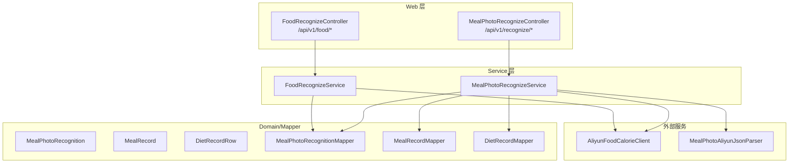
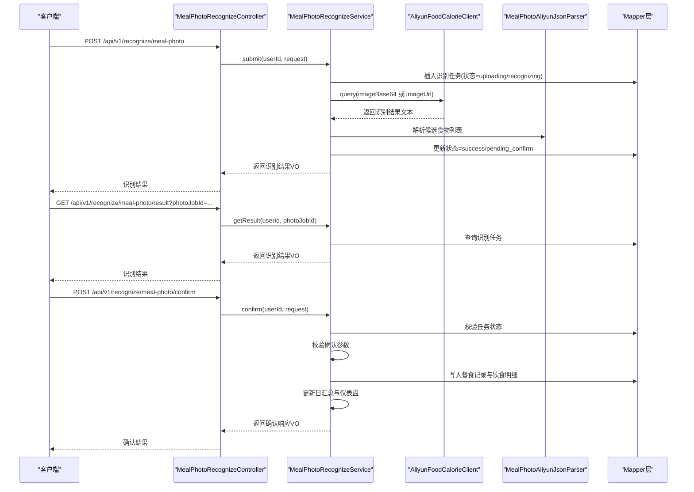
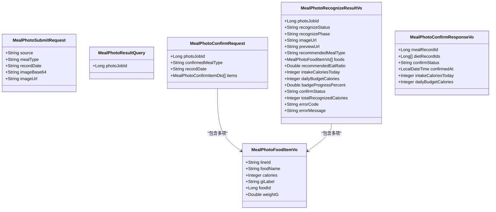
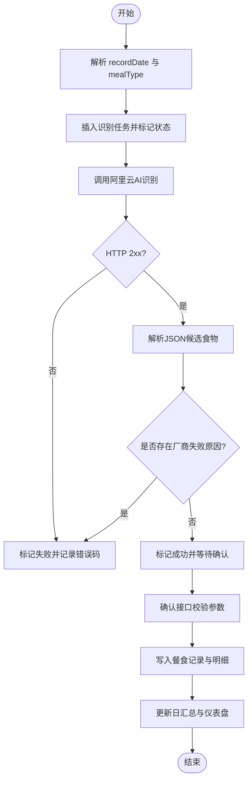
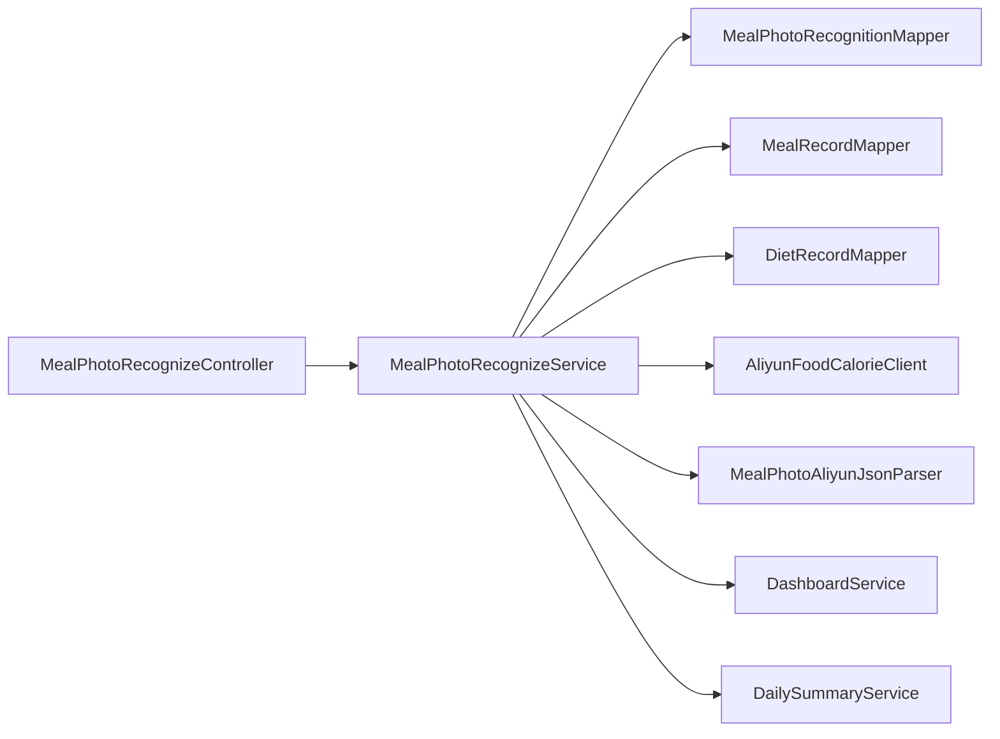

# 拍照识别接口

<cite>
**本文引用的文件**
- [MealPhotoRecognizeController.java](file://backend/src/main/java/com/ypfr/loseweight/web/MealPhotoRecognizeController.java)
- [FoodRecognizeController.java](file://backend/src/main/java/com/ypfr/loseweight/web/FoodRecognizeController.java)
- [MealPhotoRecognizeService.java](file://backend/src/main/java/com/ypfr/loseweight/service/photograph/MealPhotoRecognizeService.java)
- [FoodRecognizeService.java](file://backend/src/main/java/com/ypfr/loseweight/service/FoodRecognizeService.java)
- [MealPhotoSubmitRequest.java](file://backend/src/main/java/com/ypfr/loseweight/web/dto/photograph/MealPhotoSubmitRequest.java)
- [MealPhotoResultQuery.java](file://backend/src/main/java/com/ypfr/loseweight/web/dto/photograph/MealPhotoResultQuery.java)
- [MealPhotoConfirmRequest.java](file://backend/src/main/java/com/ypfr/loseweight/web/dto/photograph/MealPhotoConfirmRequest.java)
- [MealPhotoRecognizeResultVo.java](file://backend/src/main/java/com/ypfr/loseweight/web/dto/photograph/MealPhotoRecognizeResultVo.java)
- [MealPhotoConfirmResponseVo.java](file://backend/src/main/java/com/ypfr/loseweight/web/dto/photograph/MealPhotoConfirmResponseVo.java)
- [MealPhotoFoodItemVo.java](file://backend/src/main/java/com/ypfr/loseweight/web/dto/photograph/MealPhotoFoodItemVo.java)
- [AliyunFoodCalorieClient.java](file://backend/src/main/java/com/ypfr/loseweight/service/AliyunFoodCalorieClient.java)
- [MealPhotoAliyunJsonParser.java](file://backend/src/main/java/com/ypfr/loseweight/service/photograph/MealPhotoAliyunJsonParser.java)
- [MealPhotoRecognition.java](file://backend/src/main/java/com/ypfr/loseweight/domain/MealPhotoRecognition.java)
- [MealRecord.java](file://backend/src/main/java/com/ypfr/loseweight/domain/MealRecord.java)
- [DietRecordRow.java](file://backend/src/main/java/com/ypfr/loseweight/domain/DietRecordRow.java)
- [MealPhotoRecognitionMapper.java](file://backend/src/main/java/com/ypfr/loseweight/mapper/MealPhotoRecognitionMapper.java)
- [MealRecordMapper.java](file://backend/src/main/java/com/ypfr/loseweight/mapper/MealRecordMapper.java)
- [DietRecordMapper.java](file://backend/src/main/java/com/ypfr/loseweight/mapper/DietRecordMapper.java)
- [DashboardService.java](file://backend/src/main/java/com/ypfr/loseweight/service/DashboardService.java)
- [DailySummaryService.java](file://backend/src/main/java/com/ypfr/loseweight/service/DailySummaryService.java)
- [AuthUserResolver.java](file://backend/src/main/java/com/ypfr/loseweight/web/AuthUserResolver.java)
- [ApiResponse.java](file://backend/src/main/java/com/ypfr/loseweight/common/ApiResponse.java)
- [ApiException.java](file://backend/src/main/java/com/ypfr/loseweight/common/ApiException.java)
- [GlobalExceptionHandler.java](file://backend/src/main/java/com/ypfr/loseweight/common/GlobalExceptionHandler.java)
</cite>

## 目录
1. [简介](#简介)
2. [项目结构](#项目结构)
3. [核心组件](#核心组件)
4. [架构总览](#架构总览)
5. [详细组件分析](#详细组件分析)
6. [依赖关系分析](#依赖关系分析)
7. [性能考虑](#性能考虑)
8. [故障排查指南](#故障排查指南)
9. [结论](#结论)
10. [附录](#附录)

## 简介
本文件面向“拍照识别”相关API接口，覆盖以下能力：
- 食物拍照识别接口：提交图片、轮询结果、确认识别结果
- 餐食照片识别接口：提交图片、轮询结果、确认识别结果
- 识别结果确认：生成餐食记录与饮食明细，更新日汇总与仪表盘
- 营养分析：基于阿里云AI服务解析识别结果，计算GI标签与热量
- 认证方式：通过请求头中的Authorization进行用户鉴权
- 图片上传：支持Base64或图片URL两种输入方式
- 错误处理：统一异常与错误码，保障接口稳定性

## 项目结构
后端采用Spring Web MVC + MyBatis-Plus架构，拍照识别相关模块位于web、service、domain、mapper层，并通过DTO进行请求/响应建模。

图表来源
- [MealPhotoRecognizeController.java:19-62](file://backend/src/main/java/com/ypfr/loseweight/web/MealPhotoRecognizeController.java#L19-L62)
- [FoodRecognizeController.java:13-27](file://backend/src/main/java/com/ypfr/loseweight/web/FoodRecognizeController.java#L13-L27)
- [MealPhotoRecognizeService.java:37-66](file://backend/src/main/java/com/ypfr/loseweight/service/photograph/MealPhotoRecognizeService.java#L37-L66)
- [FoodRecognizeService.java:12-23](file://backend/src/main/java/com/ypfr/loseweight/service/FoodRecognizeService.java#L12-L23)
- [AliyunFoodCalorieClient.java](file://backend/src/main/java/com/ypfr/loseweight/service/AliyunFoodCalorieClient.java)
- [MealPhotoAliyunJsonParser.java](file://backend/src/main/java/com/ypfr/loseweight/service/photograph/MealPhotoAliyunJsonParser.java)

章节来源
- [MealPhotoRecognizeController.java:19-62](file://backend/src/main/java/com/ypfr/loseweight/web/MealPhotoRecognizeController.java#L19-L62)
- [FoodRecognizeController.java:13-27](file://backend/src/main/java/com/ypfr/loseweight/web/FoodRecognizeController.java#L13-L27)

## 核心组件
- 控制器
  - 餐食拍照识别控制器：负责提交、查询结果、确认识别
  - 食物识别控制器：通用食物识别入口
- 服务层
  - 餐食拍照识别服务：封装AI调用、解析、落库、确认逻辑
  - 食物识别服务：封装通用识别流程
- DTO与模型
  - 提交请求、结果查询、确认请求、结果VO、食物项VO等
- 外部集成
  - 阿里云AI识别客户端与JSON解析器
- 数据持久化
  - 识别任务、餐食记录、饮食明细等

章节来源
- [MealPhotoRecognizeController.java:19-62](file://backend/src/main/java/com/ypfr/loseweight/web/MealPhotoRecognizeController.java#L19-L62)
- [FoodRecognizeController.java:13-27](file://backend/src/main/java/com/ypfr/loseweight/web/FoodRecognizeController.java#L13-L27)
- [MealPhotoRecognizeService.java:37-66](file://backend/src/main/java/com/ypfr/loseweight/service/photograph/MealPhotoRecognizeService.java#L37-L66)
- [FoodRecognizeService.java:12-23](file://backend/src/main/java/com/ypfr/loseweight/service/FoodRecognizeService.java#L12-L23)

## 架构总览
拍照识别整体流程分为三步：提交识别、轮询结果、确认识别并生成记录。

图表来源
- [MealPhotoRecognizeController.java:33-61](file://backend/src/main/java/com/ypfr/loseweight/web/MealPhotoRecognizeController.java#L33-L61)
- [MealPhotoRecognizeService.java:68-138](file://backend/src/main/java/com/ypfr/loseweight/service/photograph/MealPhotoRecognizeService.java#L68-L138)
- [AliyunFoodCalorieClient.java](file://backend/src/main/java/com/ypfr/loseweight/service/AliyunFoodCalorieClient.java)
- [MealPhotoAliyunJsonParser.java](file://backend/src/main/java/com/ypfr/loseweight/service/photograph/MealPhotoAliyunJsonParser.java)

## 详细组件分析

### 餐食拍照识别接口
- 接口一：提交识别
  - 方法与路径：POST /api/v1/recognize/meal-photo
  - 认证：Authorization 请求头（Bearer）
  - 请求体：MealPhotoSubmitRequest（至少提供 imageBase64 或 imageUrl；可选 source、mealType、recordDate）
  - 响应体：MealPhotoRecognizeResultVo（包含识别任务ID、状态、候选食物、预算快照、确认状态等）
  - 流程要点：
    - 服务端解析recordDate与mealType，若为空则按时间推荐
    - 插入识别任务并标记状态为“识别中”
    - 调用阿里云AI识别，解析返回的JSON，填充候选食物与状态
    - 若识别失败，记录错误码与错误信息
- 接口二：查询识别结果
  - 方法与路径：GET /api/v1/recognize/meal-photo/result
  - 认证：Authorization 请求头
  - 查询参数：photoJobId（识别任务ID）
  - 响应体：MealPhotoRecognizeResultVo
  - 流程要点：
    - 校验任务存在且属于当前用户
    - 成功状态下从解析缓存还原候选食物列表
- 接口三：确认识别并生成记录
  - 方法与路径：POST /api/v1/recognize/meal-photo/confirm
  - 认证：Authorization 请求头
  - 请求体：MealPhotoConfirmRequest（包含photoJobId、确认餐型、recordDate、items）
  - 响应体：MealPhotoConfirmResponseVo（包含餐食记录ID、饮食明细ID列表、确认状态、今日摄入与预算等）
  - 流程要点：
    - 校验任务已成功
    - 校验确认餐型为 breakfast/lunch/dinner/snack
    - 校验每项确认热量为正数
    - 写入餐食记录与多条饮食明细
    - 更新日汇总与仪表盘，计算徽章进度百分比

章节来源
- [MealPhotoRecognizeController.java:33-61](file://backend/src/main/java/com/ypfr/loseweight/web/MealPhotoRecognizeController.java#L33-L61)
- [MealPhotoRecognizeService.java:68-138](file://backend/src/main/java/com/ypfr/loseweight/service/photograph/MealPhotoRecognizeService.java#L68-L138)
- [MealPhotoRecognizeService.java:149-255](file://backend/src/main/java/com/ypfr/loseweight/service/photograph/MealPhotoRecognizeService.java#L149-L255)
- [MealPhotoSubmitRequest.java:6-76](file://backend/src/main/java/com/ypfr/loseweight/web/dto/photograph/MealPhotoSubmitRequest.java#L6-L76)
- [MealPhotoResultQuery.java:5-16](file://backend/src/main/java/com/ypfr/loseweight/web/dto/photograph/MealPhotoResultQuery.java#L5-L16)
- [MealPhotoConfirmRequest.java:9-57](file://backend/src/main/java/com/ypfr/loseweight/web/dto/photograph/MealPhotoConfirmRequest.java#L9-L57)
- [MealPhotoRecognizeResultVo.java:10-155](file://backend/src/main/java/com/ypfr/loseweight/web/dto/photograph/MealPhotoRecognizeResultVo.java#L10-L155)
- [MealPhotoConfirmResponseVo.java:8-64](file://backend/src/main/java/com/ypfr/loseweight/web/dto/photograph/MealPhotoConfirmResponseVo.java#L8-L64)

### 食物拍照识别接口
- 接口：POST /api/v1/food/recognize
- 认证：无（当前实现未强制鉴权，但建议在生产环境启用鉴权）
- 请求体：FoodRecognizeRequest（至少提供 imageBase64 或 imageUrl）
- 响应体：FoodRecognizeResponse（HTTP状态码与识别结果文本）
- 流程要点：
  - 调用阿里云AI识别，记录识别任务与状态
  - 返回识别结果文本供上层业务处理

章节来源
- [FoodRecognizeController.java:23-26](file://backend/src/main/java/com/ypfr/loseweight/web/FoodRecognizeController.java#L23-L26)
- [FoodRecognizeService.java:25-50](file://backend/src/main/java/com/ypfr/loseweight/service/FoodRecognizeService.java#L25-L50)

### 数据模型与DTO
- 识别任务模型：MealPhotoRecognition（包含用户ID、餐型、日期、来源、供应商、状态、原始结果、解析结果等）
- 餐食记录模型：MealRecord（包含用户ID、日期、餐型、总热量、数量、状态等）
- 饮食明细模型：DietRecordRow（包含餐食ID、用户ID、日期、餐型、食物ID/名称快照、GI等级快照、总热量、来源、记录时间等）
- DTO：
  - MealPhotoSubmitRequest：提交请求
  - MealPhotoResultQuery：结果查询参数
  - MealPhotoConfirmRequest：确认请求
  - MealPhotoRecognizeResultVo：识别结果响应
  - MealPhotoConfirmResponseVo：确认响应
  - MealPhotoFoodItemVo：候选食物项

图表来源
- [MealPhotoSubmitRequest.java:6-76](file://backend/src/main/java/com/ypfr/loseweight/web/dto/photograph/MealPhotoSubmitRequest.java#L6-L76)
- [MealPhotoResultQuery.java:5-16](file://backend/src/main/java/com/ypfr/loseweight/web/dto/photograph/MealPhotoResultQuery.java#L5-L16)
- [MealPhotoConfirmRequest.java:9-57](file://backend/src/main/java/com/ypfr/loseweight/web/dto/photograph/MealPhotoConfirmRequest.java#L9-L57)
- [MealPhotoRecognizeResultVo.java:10-155](file://backend/src/main/java/com/ypfr/loseweight/web/dto/photograph/MealPhotoRecognizeResultVo.java#L10-L155)
- [MealPhotoConfirmResponseVo.java:8-64](file://backend/src/main/java/com/ypfr/loseweight/web/dto/photograph/MealPhotoConfirmResponseVo.java#L8-L64)
- [MealPhotoFoodItemVo.java:7-65](file://backend/src/main/java/com/ypfr/loseweight/web/dto/photograph/MealPhotoFoodItemVo.java#L7-L65)

章节来源
- [MealPhotoSubmitRequest.java:6-76](file://backend/src/main/java/com/ypfr/loseweight/web/dto/photograph/MealPhotoSubmitRequest.java#L6-L76)
- [MealPhotoResultQuery.java:5-16](file://backend/src/main/java/com/ypfr/loseweight/web/dto/photograph/MealPhotoResultQuery.java#L5-L16)
- [MealPhotoConfirmRequest.java:9-57](file://backend/src/main/java/com/ypfr/loseweight/web/dto/photograph/MealPhotoConfirmRequest.java#L9-L57)
- [MealPhotoRecognizeResultVo.java:10-155](file://backend/src/main/java/com/ypfr/loseweight/web/dto/photograph/MealPhotoRecognizeResultVo.java#L10-L155)
- [MealPhotoConfirmResponseVo.java:8-64](file://backend/src/main/java/com/ypfr/loseweight/web/dto/photograph/MealPhotoConfirmResponseVo.java#L8-L64)
- [MealPhotoFoodItemVo.java:7-65](file://backend/src/main/java/com/ypfr/loseweight/web/dto/photograph/MealPhotoFoodItemVo.java#L7-L65)

### 处理逻辑与算法
- 识别状态机
  - uploading → recognizing → success/fail
  - success → pending_confirm → confirmed
- 识别结果解析
  - 调用阿里云AI返回JSON，解析候选食物列表
  - 若返回失败原因，记录错误码与错误信息
- 确认逻辑
  - 校验任务状态与餐型合法性
  - 校验每项确认热量为正数
  - 写入餐食记录与明细，计算总热量
  - 更新日汇总与仪表盘，计算徽章进度百分比

图表来源
- [MealPhotoRecognizeService.java:68-138](file://backend/src/main/java/com/ypfr/loseweight/service/photograph/MealPhotoRecognizeService.java#L68-L138)
- [MealPhotoRecognizeService.java:149-255](file://backend/src/main/java/com/ypfr/loseweight/service/photograph/MealPhotoRecognizeService.java#L149-L255)

章节来源
- [MealPhotoRecognizeService.java:68-138](file://backend/src/main/java/com/ypfr/loseweight/service/photograph/MealPhotoRecognizeService.java#L68-L138)
- [MealPhotoRecognizeService.java:149-255](file://backend/src/main/java/com/ypfr/loseweight/service/photograph/MealPhotoRecognizeService.java#L149-L255)

## 依赖关系分析
- 控制器依赖服务层，服务层依赖Mapper与外部客户端
- 识别服务依赖阿里云AI客户端与JSON解析器
- 确认流程依赖日汇总与仪表盘服务，确保数据一致性

图表来源
- [MealPhotoRecognizeController.java:24-31](file://backend/src/main/java/com/ypfr/loseweight/web/MealPhotoRecognizeController.java#L24-L31)
- [MealPhotoRecognizeService.java:51-66](file://backend/src/main/java/com/ypfr/loseweight/service/photograph/MealPhotoRecognizeService.java#L51-L66)
- [DashboardService.java](file://backend/src/main/java/com/ypfr/loseweight/service/DashboardService.java)
- [DailySummaryService.java](file://backend/src/main/java/com/ypfr/loseweight/service/DailySummaryService.java)

章节来源
- [MealPhotoRecognizeController.java:24-31](file://backend/src/main/java/com/ypfr/loseweight/web/MealPhotoRecognizeController.java#L24-L31)
- [MealPhotoRecognizeService.java:51-66](file://backend/src/main/java/com/ypfr/loseweight/service/photograph/MealPhotoRecognizeService.java#L51-L66)

## 性能考虑
- 图片大小控制：建议前端压缩图片尺寸与体积，减少网络传输与AI识别延迟
- 并发与事务：确认流程涉及多表写入，使用事务保证一致性
- 缓存与解析：解析后的候选食物列表可缓存于识别任务的解析字段，避免重复解析
- 轮询策略：客户端应采用指数退避策略轮询结果，降低无效请求
- 错误重试：对临时性错误（如网络抖动）进行有限重试，避免雪崩

## 故障排查指南
- 常见错误码
  - ALIYUN_VENDOR：阿里云返回的识别失败原因
  - VENDOR_HTTP_<code>：第三方HTTP错误码
  - RECOGNIZE_EXCEPTION：内部异常
  - 400类：参数不合法（如确认餐型非法、确认热量非正、recordDate格式错误、任务未成功）
  - 403：无权访问该识别任务
  - 404：识别任务不存在
- 定位步骤
  - 检查Authorization是否正确传递
  - 确认提交请求至少包含imageBase64或imageUrl之一
  - 确认确认请求的photoJobId有效且属于当前用户
  - 查看识别任务的rawResult与parsedResult，定位阿里云返回的失败原因
- 统一异常处理
  - 使用统一异常与响应包装，便于前端统一处理

章节来源
- [MealPhotoRecognizeService.java:103-137](file://backend/src/main/java/com/ypfr/loseweight/service/photograph/MealPhotoRecognizeService.java#L103-L137)
- [MealPhotoRecognizeService.java:152-158](file://backend/src/main/java/com/ypfr/loseweight/service/photograph/MealPhotoRecognizeService.java#L152-L158)
- [ApiException.java](file://backend/src/main/java/com/ypfr/loseweight/common/ApiException.java)
- [GlobalExceptionHandler.java](file://backend/src/main/java/com/ypfr/loseweight/common/GlobalExceptionHandler.java)

## 结论
拍照识别接口以清晰的状态机与严谨的确认流程为核心，结合阿里云AI能力实现从图片到餐食记录的闭环。通过统一的DTO与响应包装，便于前后端协作与扩展。建议在生产环境中强化鉴权与限流策略，并持续优化图片预处理与轮询策略以提升用户体验。

## 附录

### 协议与认证
- 认证方式：Authorization 请求头（Bearer Token）
- 用户绑定：通过AuthUserResolver从令牌解析用户ID，无需在请求体中传userId

章节来源
- [MealPhotoRecognizeController.java:35-40](file://backend/src/main/java/com/ypfr/loseweight/web/MealPhotoRecognizeController.java#L35-L40)
- [AuthUserResolver.java](file://backend/src/main/java/com/ypfr/loseweight/web/AuthUserResolver.java)

### 请求/响应模式与示例
- 提交识别（POST /api/v1/recognize/meal-photo）
  - 请求体字段：source、mealType、recordDate、imageBase64、imageUrl
  - 示例字段路径：[MealPhotoSubmitRequest.java:6-76](file://backend/src/main/java/com/ypfr/loseweight/web/dto/photograph/MealPhotoSubmitRequest.java#L6-L76)
- 查询结果（GET /api/v1/recognize/meal-photo/result?photoJobId=...）
  - 查询参数：photoJobId
  - 示例字段路径：[MealPhotoResultQuery.java:5-16](file://backend/src/main/java/com/ypfr/loseweight/web/dto/photograph/MealPhotoResultQuery.java#L5-L16)
- 确认识别（POST /api/v1/recognize/meal-photo/confirm）
  - 请求体字段：photoJobId、confirmedMealType、recordDate、items（含confirmedCalories、lineId等）
  - 示例字段路径：[MealPhotoConfirmRequest.java:9-57](file://backend/src/main/java/com/ypfr/loseweight/web/dto/photograph/MealPhotoConfirmRequest.java#L9-L57)

章节来源
- [MealPhotoRecognizeController.java:33-61](file://backend/src/main/java/com/ypfr/loseweight/web/MealPhotoRecognizeController.java#L33-L61)
- [MealPhotoSubmitRequest.java:6-76](file://backend/src/main/java/com/ypfr/loseweight/web/dto/photograph/MealPhotoSubmitRequest.java#L6-L76)
- [MealPhotoResultQuery.java:5-16](file://backend/src/main/java/com/ypfr/loseweight/web/dto/photograph/MealPhotoResultQuery.java#L5-L16)
- [MealPhotoConfirmRequest.java:9-57](file://backend/src/main/java/com/ypfr/loseweight/web/dto/photograph/MealPhotoConfirmRequest.java#L9-L57)

### 图片格式与上传要求
- 输入方式：imageBase64或imageUrl至少提供其一
- URL长度限制：存储时截断至1024字符
- 建议：前端优先使用压缩后的JPG/PNG，避免超大文件

章节来源
- [MealPhotoSubmitRequest.java:71-76](file://backend/src/main/java/com/ypfr/loseweight/web/dto/photograph/MealPhotoSubmitRequest.java#L71-L76)
- [MealPhotoRecognizeService.java:87-90](file://backend/src/main/java/com/ypfr/loseweight/service/photograph/MealPhotoRecognizeService.java#L87-L90)

### 识别准确率与阿里云集成
- 识别流程：调用阿里云AI客户端，解析返回的JSON，提取候选食物与GI标签
- 失败处理：若返回厂商失败原因，记录错误码与错误信息；若HTTP非2xx，记录状态码前缀错误码
- 建议：在客户端显示识别置信度与建议修正项，提升用户参与度

章节来源
- [AliyunFoodCalorieClient.java](file://backend/src/main/java/com/ypfr/loseweight/service/AliyunFoodCalorieClient.java)
- [MealPhotoRecognizeService.java:96-137](file://backend/src/main/java/com/ypfr/loseweight/service/photograph/MealPhotoRecognizeService.java#L96-L137)
- [MealPhotoAliyunJsonParser.java](file://backend/src/main/java/com/ypfr/loseweight/service/photograph/MealPhotoAliyunJsonParser.java)

### 版本信息
- API版本：/api/v1
- 餐食拍照识别：/api/v1/recognize/meal-photo/*
- 食物识别：/api/v1/food/recognize

章节来源
- [MealPhotoRecognizeController.java](file://backend/src/main/java/com/ypfr/loseweight/web/MealPhotoRecognizeController.java#L20)
- [FoodRecognizeController.java](file://backend/src/main/java/com/ypfr/loseweight/web/FoodRecognizeController.java#L14)

### 常见用例与客户端实现建议
- 用例一：快速拍照识别
  - 步骤：拍照后压缩图片，选择最近餐型，提交识别，轮询结果，确认后查看今日摄入与预算
  - 建议：前端展示识别进度与候选食物，允许用户微调确认热量
- 用例二：相册导入识别
  - 步骤：选择图片URL，提交识别，轮询结果，确认
  - 建议：对URL进行有效性校验，避免无效链接
- 用例三：批量修正
  - 步骤：识别完成后，逐项调整确认热量与餐型，重新生成记录
  - 建议：提供撤销与恢复功能，保留历史快照

### 错误处理策略
- 参数校验：使用注解驱动的参数校验，提前拦截非法请求
- 状态检查：确认前严格检查识别任务状态与用户权限
- 异常捕获：统一异常包装，返回明确错误码与提示
- 日志与追踪：记录识别任务ID与关键字段，便于问题定位

章节来源
- [MealPhotoRecognizeService.java:152-158](file://backend/src/main/java/com/ypfr/loseweight/service/photograph/MealPhotoRecognizeService.java#L152-L158)
- [ApiException.java](file://backend/src/main/java/com/ypfr/loseweight/common/ApiException.java)
- [GlobalExceptionHandler.java](file://backend/src/main/java/com/ypfr/loseweight/common/GlobalExceptionHandler.java)