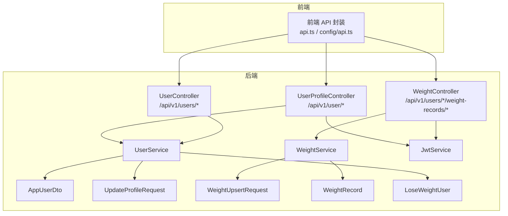
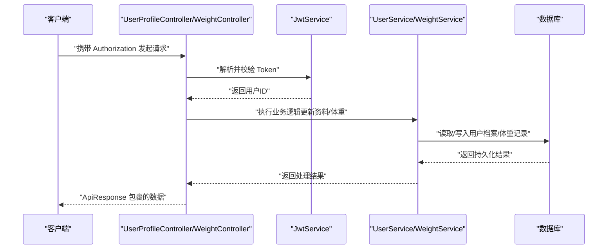
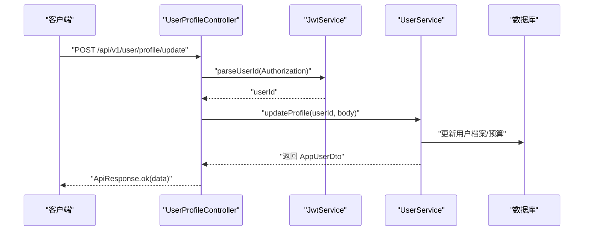
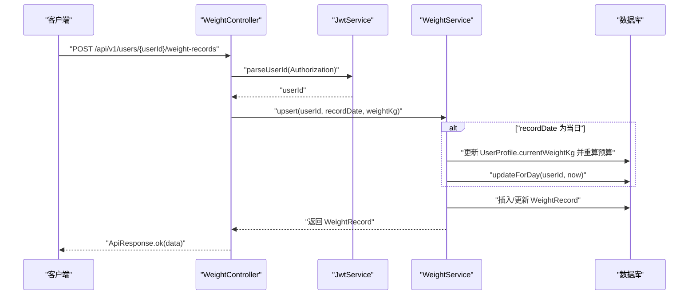
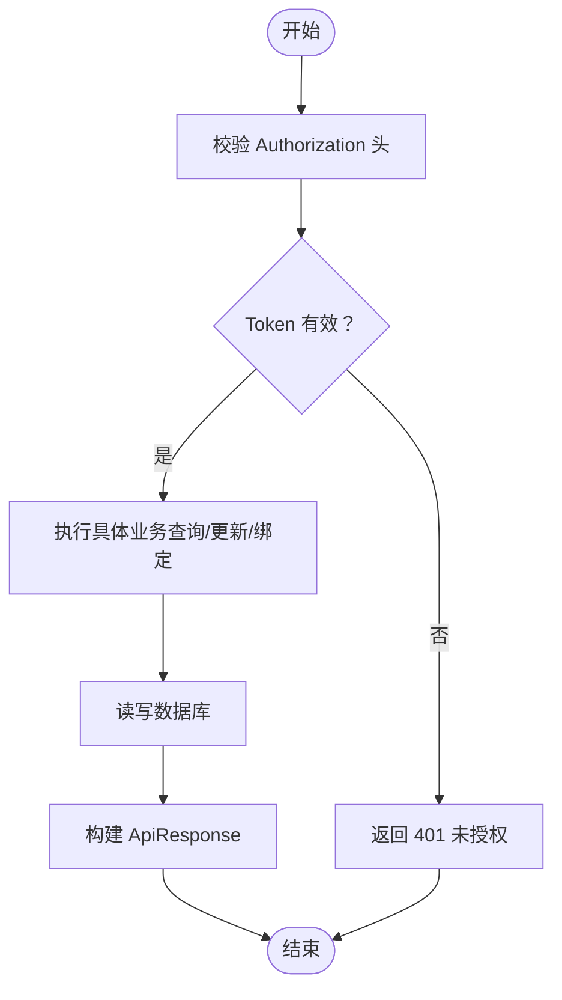
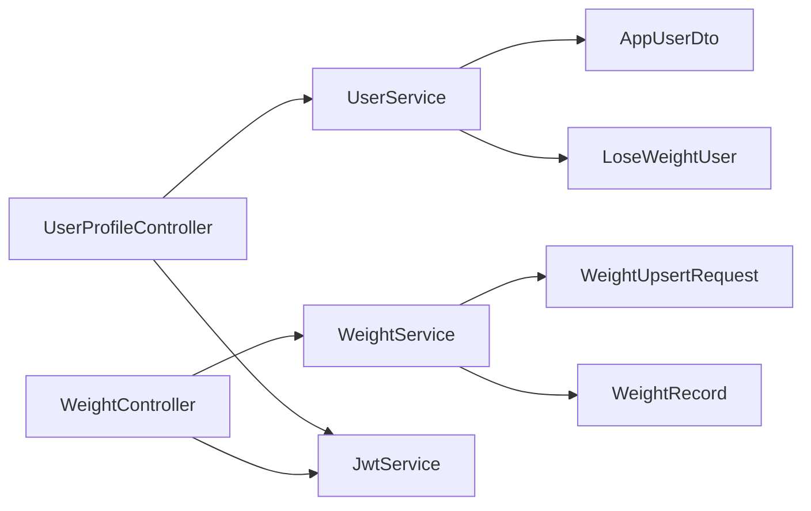

# 用户管理接口

<cite>
**本文引用的文件**
- [UserProfileController.java](file://backend/src/main/java/com/ypfr/loseweight/web/UserProfileController.java)
- [WeightController.java](file://backend/src/main/java/com/ypfr/loseweight/web/WeightController.java)
- [UserController.java](file://backend/src/main/java/com/ypfr/loseweight/web/UserController.java)
- [UserService.java](file://backend/src/main/java/com/ypfr/loseweight/service/UserService.java)
- [WeightService.java](file://backend/src/main/java/com/ypfr/loseweight/service/WeightService.java)
- [UpdateProfileRequest.java](file://backend/src/main/java/com/ypfr/loseweight/web/dto/UpdateProfileRequest.java)
- [WeightUpsertRequest.java](file://backend/src/main/java/com/ypfr/loseweight/web/dto/WeightUpsertRequest.java)
- [AppUserDto.java](file://backend/src/main/java/com/ypfr/loseweight/web/dto/AppUserDto.java)
- [WeightRecord.java](file://backend/src/main/java/com/ypfr/loseweight/domain/WeightRecord.java)
- [LoseWeightUser.java](file://backend/src/main/java/com/ypfr/loseweight/domain/LoseWeightUser.java)
- [ApiResponse.java](file://backend/src/main/java/com/ypfr/loseweight/common/ApiResponse.java)
- [ApiException.java](file://backend/src/main/java/com/ypfr/loseweight/common/ApiException.java)
- [JwtService.java](file://backend/src/main/java/com/ypfr/loseweight/service/JwtService.java)
- [application.yml](file://backend/src/main/resources/application.yml)
- [api.ts](file://frontend/src/config/api.ts)
- [user.ts](file://frontend/src/api/user.ts)
- [weight.ts](file://frontend/src/api/weight.ts)
</cite>

## 目录
1. [简介](#简介)
2. [项目结构](#项目结构)
3. [核心组件](#核心组件)
4. [架构总览](#架构总览)
5. [详细组件分析](#详细组件分析)
6. [依赖分析](#依赖分析)
7. [性能考虑](#性能考虑)
8. [故障排查指南](#故障排查指南)
9. [结论](#结论)
10. [附录](#附录)

## 简介
本文件为用户管理相关API接口的权威文档，覆盖以下接口：
- 用户信息更新接口：/api/v1/user/profile/update
- 体重记录接口：/api/v1/users/{userId}/weight-records（GET 列表，POST 新增/更新）
- 用户档案管理接口：当前用户资料查询与更新、绑定手机
同时，文档提供认证方式、请求/响应模式、错误处理策略、数据验证规则、权限控制机制、版本信息、常见用例、客户端实现指南以及数据一致性保证措施。

## 项目结构
后端采用 Spring Boot 控制器层（web）+ 服务层（service）+ 领域模型（domain）+ DTO（web/dto）+ MyBatis-Plus Mapper 的分层架构。前端通过统一的 API 配置与工具函数封装 HTTP 请求。

图表来源
- [UserProfileController.java:28-89](file://backend/src/main/java/com/ypfr/loseweight/web/UserProfileController.java#L28-L89)
- [WeightController.java:16-38](file://backend/src/main/java/com/ypfr/loseweight/web/WeightController.java#L16-L38)
- [UserController.java:16-40](file://backend/src/main/java/com/ypfr/loseweight/web/UserController.java#L16-L40)
- [UserService.java:25-54](file://backend/src/main/java/com/ypfr/loseweight/service/UserService.java#L25-L54)
- [WeightService.java:17-37](file://backend/src/main/java/com/ypfr/loseweight/service/WeightService.java#L17-L37)
- [JwtService.java:14-57](file://backend/src/main/java/com/ypfr/loseweight/service/JwtService.java#L14-L57)
- [AppUserDto.java:6-41](file://backend/src/main/java/com/ypfr/loseweight/web/dto/AppUserDto.java#L6-L41)
- [UpdateProfileRequest.java:5-24](file://backend/src/main/java/com/ypfr/loseweight/web/dto/UpdateProfileRequest.java#L5-L24)
- [WeightUpsertRequest.java:5-26](file://backend/src/main/java/com/ypfr/loseweight/web/dto/WeightUpsertRequest.java#L5-L26)
- [WeightRecord.java:10-22](file://backend/src/main/java/com/ypfr/loseweight/domain/WeightRecord.java#L10-L22)
- [LoseWeightUser.java:8-31](file://backend/src/main/java/com/ypfr/loseweight/domain/LoseWeightUser.java#L8-L31)

章节来源
- [UserProfileController.java:28-89](file://backend/src/main/java/com/ypfr/loseweight/web/UserProfileController.java#L28-L89)
- [WeightController.java:16-38](file://backend/src/main/java/com/ypfr/loseweight/web/WeightController.java#L16-L38)
- [UserController.java:16-40](file://backend/src/main/java/com/ypfr/loseweight/web/UserController.java#L16-L40)

## 核心组件
- 控制器层
  - UserProfileController：提供当前用户资料查询与更新、绑定手机接口，均需 JWT 认证。
  - WeightController：提供用户体重记录列表查询与新增/更新接口，支持路径参数 userId。
  - UserController：提供用户详情查询与周统计接口（供管理或扩展用途）。
- 服务层
  - UserService：负责用户资料更新、预算配置同步、档案完成度计算、统计数据附加等。
  - WeightService：负责体重记录的新增/更新、当日体重同步至档案与预算、日汇总重算。
  - JwtService：负责 JWT 创建与解析，校验登录有效性。
- 数据传输对象与领域模型
  - UpdateProfileRequest：个人信息更新请求体。
  - WeightUpsertRequest：体重记录请求体。
  - AppUserDto：用户信息返回体。
  - WeightRecord、LoseWeightUser：数据库实体映射。

章节来源
- [UserService.java:75-164](file://backend/src/main/java/com/ypfr/loseweight/service/UserService.java#L75-L164)
- [WeightService.java:47-107](file://backend/src/main/java/com/ypfr/loseweight/service/WeightService.java#L47-L107)
- [JwtService.java:29-56](file://backend/src/main/java/com/ypfr/loseweight/service/JwtService.java#L29-L56)
- [UpdateProfileRequest.java:5-24](file://backend/src/main/java/com/ypfr/loseweight/web/dto/UpdateProfileRequest.java#L5-L24)
- [WeightUpsertRequest.java:5-26](file://backend/src/main/java/com/ypfr/loseweight/web/dto/WeightUpsertRequest.java#L5-L26)
- [AppUserDto.java:6-41](file://backend/src/main/java/com/ypfr/loseweight/web/dto/AppUserDto.java#L6-L41)
- [WeightRecord.java:10-22](file://backend/src/main/java/com/ypfr/loseweight/domain/WeightRecord.java#L10-L22)
- [LoseWeightUser.java:8-31](file://backend/src/main/java/com/ypfr/loseweight/domain/LoseWeightUser.java#L8-L31)

## 架构总览
下图展示用户管理相关接口的端到端调用流程，包括认证、业务处理与数据一致性保障。

图表来源
- [UserProfileController.java:50-78](file://backend/src/main/java/com/ypfr/loseweight/web/UserProfileController.java#L50-L78)
- [WeightController.java:26-37](file://backend/src/main/java/com/ypfr/loseweight/web/WeightController.java#L26-L37)
- [JwtService.java:39-56](file://backend/src/main/java/com/ypfr/loseweight/service/JwtService.java#L39-L56)
- [UserService.java:75-164](file://backend/src/main/java/com/ypfr/loseweight/service/UserService.java#L75-L164)
- [WeightService.java:47-107](file://backend/src/main/java/com/ypfr/loseweight/service/WeightService.java#L47-L107)

## 详细组件分析

### 用户信息更新接口
- 接口定义
  - 方法：POST
  - URL：/api/v1/user/profile/update
  - 认证：Bearer Token（Authorization 头）
- 请求体
  - UpdateProfileRequest（字段均为可选，未传则保留原值）
  - 支持昵称、头像（base64）、性别、年龄、身高、当前体重、目标体重、初始体重、目标日期、活动级别（1-5）、是否使用自定义BMR、自定义BMR（kcal）
- 响应体
  - AppUserDto：包含用户基本信息、BMI解读、预算相关指标与统计
- 权限与安全
  - 通过 JwtService 校验 Token，解析用户ID
  - 若 Authorization 缺失或格式不正确，返回 401
- 业务逻辑
  - 更新 LoseWeightUser 与 UserProfile，必要时确保 UserBudgetConfig 存在
  - 若更新涉及初始体重，可能自动回填初始体重
  - 重算预算与日汇总（当日）以保证数据一致性
- 错误处理
  - 参数非法（如目标日期格式、自定义BMR>0、活动级别范围）返回 400
  - 用户不存在返回 404
  - 登录失效返回 401

图表来源
- [UserProfileController.java:64-78](file://backend/src/main/java/com/ypfr/loseweight/web/UserProfileController.java#L64-L78)
- [UserService.java:75-164](file://backend/src/main/java/com/ypfr/loseweight/service/UserService.java#L75-L164)
- [JwtService.java:39-56](file://backend/src/main/java/com/ypfr/loseweight/service/JwtService.java#L39-L56)

章节来源
- [UserProfileController.java:64-78](file://backend/src/main/java/com/ypfr/loseweight/web/UserProfileController.java#L64-L78)
- [UpdateProfileRequest.java:5-24](file://backend/src/main/java/com/ypfr/loseweight/web/dto/UpdateProfileRequest.java#L5-L24)
- [AppUserDto.java:6-41](file://backend/src/main/java/com/ypfr/loseweight/web/dto/AppUserDto.java#L6-L41)
- [UserService.java:75-164](file://backend/src/main/java/com/ypfr/loseweight/service/UserService.java#L75-L164)
- [JwtService.java:39-56](file://backend/src/main/java/com/ypfr/loseweight/service/JwtService.java#L39-L56)

### 体重记录接口
- 接口定义
  - GET /api/v1/users/{userId}/weight-records
    - 查询指定用户的体重记录（默认最近30条，上限200）
  - POST /api/v1/users/{userId}/weight-records
    - 新增或更新某日体重记录
- 认证
  - Bearer Token（Authorization 头）
- 请求体（POST）
  - WeightUpsertRequest：recordDate（yyyy-MM-dd）、weightKg
- 响应体
  - WeightRecord：包含 id、userId、recordDate、weightKg、source、remark、createdAt
- 权限与安全
  - 通过 JwtService 校验 Token，解析用户ID
  - 若 recordDate 非当日，则仅更新/插入记录，不触发档案与预算同步
  - 若 recordDate 为当日，则同步更新 UserProfile.currentWeightKg，并重算预算与当日日汇总
- 错误处理
  - recordDate 缺失或格式无效返回 400
  - weightKg 为空或非正数返回 400
  - 用户不存在返回 404
  - 登录失效返回 401

图表来源
- [WeightController.java:32-37](file://backend/src/main/java/com/ypfr/loseweight/web/WeightController.java#L32-L37)
- [WeightService.java:47-107](file://backend/src/main/java/com/ypfr/loseweight/service/WeightService.java#L47-L107)
- [JwtService.java:39-56](file://backend/src/main/java/com/ypfr/loseweight/service/JwtService.java#L39-L56)
- [WeightRecord.java:10-22](file://backend/src/main/java/com/ypfr/loseweight/domain/WeightRecord.java#L10-L22)

章节来源
- [WeightController.java:26-37](file://backend/src/main/java/com/ypfr/loseweight/web/WeightController.java#L26-L37)
- [WeightUpsertRequest.java:5-26](file://backend/src/main/java/com/ypfr/loseweight/web/dto/WeightUpsertRequest.java#L5-L26)
- [WeightService.java:47-107](file://backend/src/main/java/com/ypfr/loseweight/service/WeightService.java#L47-L107)
- [JwtService.java:39-56](file://backend/src/main/java/com/ypfr/loseweight/service/JwtService.java#L39-L56)

### 用户档案管理接口
- 当前用户资料查询
  - 方法：GET
  - URL：/api/v1/user/profile
  - 认证：Bearer Token
  - 响应：AppUserDto
- 绑定手机
  - 方法：POST
  - URL：/api/v1/user/bind-phone
  - 认证：Bearer Token
  - 请求体：包含验证码（code）
  - 响应：{"ok":"1"}

图表来源
- [UserProfileController.java:50-88](file://backend/src/main/java/com/ypfr/loseweight/web/UserProfileController.java#L50-L88)
- [JwtService.java:39-56](file://backend/src/main/java/com/ypfr/loseweight/service/JwtService.java#L39-L56)

章节来源
- [UserProfileController.java:57-88](file://backend/src/main/java/com/ypfr/loseweight/web/UserProfileController.java#L57-L88)

## 依赖分析
- 控制器依赖服务层，服务层依赖 Mapper 与领域模型
- 认证链路：控制器 -> JwtService -> 解析用户ID
- 数据一致性：体重更新（当日）会同步档案与预算并重算日汇总

图表来源
- [UserProfileController.java:28-89](file://backend/src/main/java/com/ypfr/loseweight/web/UserProfileController.java#L28-L89)
- [WeightController.java:16-38](file://backend/src/main/java/com/ypfr/loseweight/web/WeightController.java#L16-L38)
- [UserService.java:25-54](file://backend/src/main/java/com/ypfr/loseweight/service/UserService.java#L25-L54)
- [WeightService.java:17-37](file://backend/src/main/java/com/ypfr/loseweight/service/WeightService.java#L17-L37)
- [JwtService.java:14-57](file://backend/src/main/java/com/ypfr/loseweight/service/JwtService.java#L14-L57)
- [AppUserDto.java:6-41](file://backend/src/main/java/com/ypfr/loseweight/web/dto/AppUserDto.java#L6-L41)
- [LoseWeightUser.java:8-31](file://backend/src/main/java/com/ypfr/loseweight/domain/LoseWeightUser.java#L8-L31)
- [WeightUpsertRequest.java:5-26](file://backend/src/main/java/com/ypfr/loseweight/web/dto/WeightUpsertRequest.java#L5-L26)
- [WeightRecord.java:10-22](file://backend/src/main/java/com/ypfr/loseweight/domain/WeightRecord.java#L10-L22)

## 性能考虑
- 分页与限制
  - 体重记录列表默认返回最近30条，最大限制200条，避免一次性拉取过多数据
- 日汇总重算
  - 仅在当日体重更新时触发，降低对历史数据的影响
- 缓存与索引
  - 建议在数据库层面为 user_weight_record 的 (userId, recordDate) 建立唯一/组合索引，提升 upsert 查询效率
- 异常降级
  - 日汇总重算失败被吞并并记录告警，不影响主流程

## 故障排查指南
- 401 未授权
  - 检查 Authorization 头是否以 "Bearer " 开头，Token 是否过期或签名无效
- 403 权限不足
  - 路径中的 userId 与 Token 解析出的用户ID不一致
- 400 参数错误
  - 目标日期格式必须为 yyyy-MM-dd
  - 自定义BMR需大于0，useCustomBmr仅支持0/1
  - recordDate 必填且格式有效，weightKg 必须为正数
- 404 用户不存在
  - 操作的目标用户ID不存在
- 日汇总未更新
  - 确认 recordDate 是否为当日；非当日不会触发同步

章节来源
- [UserProfileController.java:50-55](file://backend/src/main/java/com/ypfr/loseweight/web/UserProfileController.java#L50-L55)
- [WeightController.java:28-29](file://backend/src/main/java/com/ypfr/loseweight/web/WeightController.java#L28-L29)
- [WeightService.java:47-59](file://backend/src/main/java/com/ypfr/loseweight/service/WeightService.java#L47-L59)
- [UserService.java:75-143](file://backend/src/main/java/com/ypfr/loseweight/service/UserService.java#L75-L143)
- [JwtService.java:40-55](file://backend/src/main/java/com/ypfr/loseweight/service/JwtService.java#L40-L55)

## 结论
本文档梳理了用户管理相关的核心接口，明确了认证方式、请求/响应模式、数据验证规则、权限控制与版本信息，并提供了端到端调用流程与故障排查要点。客户端应严格遵循 Authorization 头传递与请求体字段约束，确保数据一致性与用户体验。

## 附录

### 接口清单与规范
- 用户信息更新
  - 方法：POST
  - URL：/api/v1/user/profile/update
  - 认证：Bearer Token
  - 请求体：UpdateProfileRequest（字段可选）
  - 响应：AppUserDto
- 体重记录
  - GET /api/v1/users/{userId}/weight-records
    - 查询最近体重记录，默认 limit=30，最大200
  - POST /api/v1/users/{userId}/weight-records
    - 新增或更新某日体重记录
  - 认证：Bearer Token
  - 请求体：WeightUpsertRequest（recordDate, weightKg）
  - 响应：WeightRecord
- 用户档案管理
  - GET /api/v1/user/profile
  - POST /api/v1/user/profile/update
  - POST /api/v1/user/bind-phone

章节来源
- [UserProfileController.java:57-88](file://backend/src/main/java/com/ypfr/loseweight/web/UserProfileController.java#L57-L88)
- [WeightController.java:26-37](file://backend/src/main/java/com/ypfr/loseweight/web/WeightController.java#L26-L37)
- [UserController.java:28-39](file://backend/src/main/java/com/ypfr/loseweight/web/UserController.java#L28-L39)

### 客户端实现指南
- 基础配置
  - API 基址与路径前缀由前端配置决定，确保与后端一致
- 认证
  - 所有受保护接口需在 Authorization 头中携带 Bearer Token
- 常见用例
  - 更新个人资料：构造 UpdateProfileRequest，调用更新接口
  - 记录体重：构造 WeightUpsertRequest，调用新增/更新接口
  - 查看体重趋势：调用列表接口，结合映射函数处理返回数据

章节来源
- [api.ts:10-18](file://frontend/src/config/api.ts#L10-L18)
- [user.ts:9-22](file://frontend/src/api/user.ts#L9-L22)
- [weight.ts:11-41](file://frontend/src/api/weight.ts#L11-L41)

### 数据一致性保证措施
- 体重更新（当日）
  - 同步更新 UserProfile.currentWeightKg
  - 重算 UserBudgetConfig 相关指标
  - 调用 DailySummaryService.updateForDay 刷新当日汇总
- 个人资料更新
  - 更新 LoseWeightUser 与 UserProfile
  - 若当日已有体重记录，同步刷新预算与日汇总

章节来源
- [WeightService.java:81-107](file://backend/src/main/java/com/ypfr/loseweight/service/WeightService.java#L81-L107)
- [UserService.java:75-164](file://backend/src/main/java/com/ypfr/loseweight/service/UserService.java#L75-L164)

### 版本信息
- 接口版本：/api/v1
- 认证方式：JWT（HS256），密钥长度要求≥32字节
- 配置项参考
  - app.jwt.secret：JWT 密钥（生产环境必须≥32字节）
  - app.jwt.expire-seconds：Token 过期时间（秒）

章节来源
- [application.yml:42-46](file://backend/src/main/resources/application.yml#L42-L46)
- [JwtService.java:20-27](file://backend/src/main/java/com/ypfr/loseweight/service/JwtService.java#L20-L27)