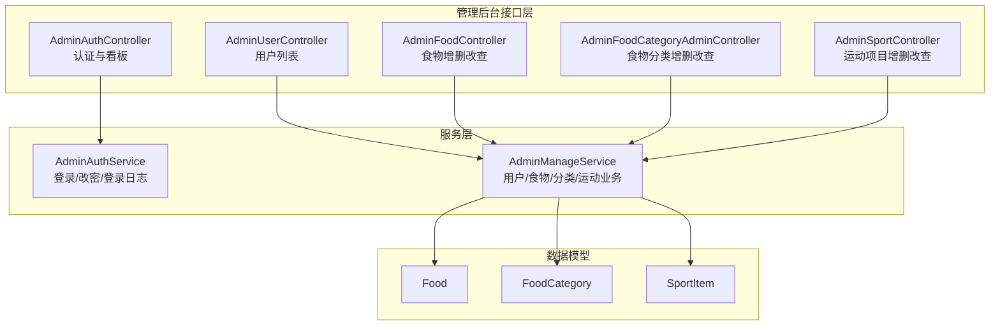
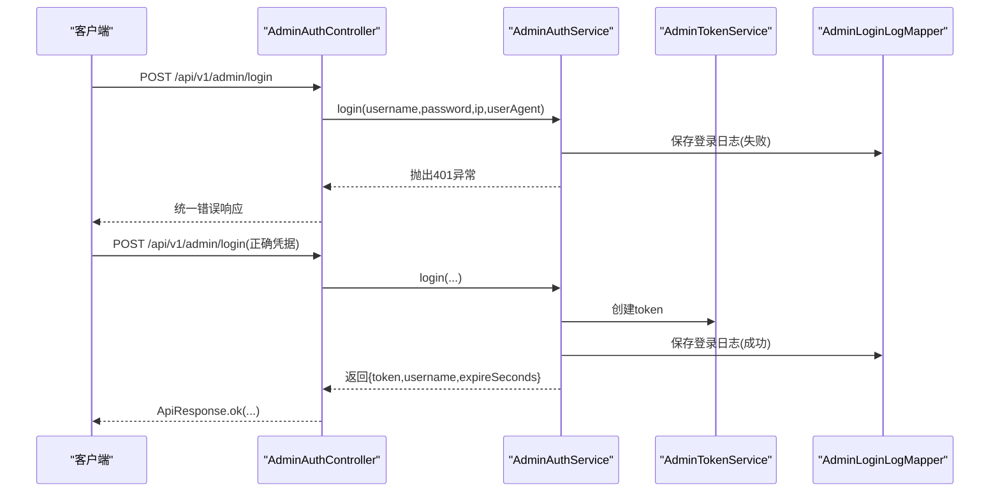
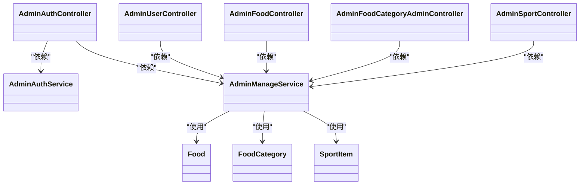

# 管理后台接口

<cite>
**本文引用的文件**
- [AdminAuthController.java](file://backend/src/main/java/com/ypfr/loseweight/web/AdminAuthController.java)
- [AdminUserController.java](file://backend/src/main/java/com/ypfr/loseweight/web/AdminUserController.java)
- [AdminFoodController.java](file://backend/src/main/java/com/ypfr/loseweight/web/AdminFoodController.java)
- [AdminFoodCategoryAdminController.java](file://backend/src/main/java/com/ypfr/loseweight/web/AdminFoodCategoryAdminController.java)
- [AdminSportController.java](file://backend/src/main/java/com/ypfr/loseweight/web/AdminSportController.java)
- [AdminAuthService.java](file://backend/src/main/java/com/ypfr/loseweight/service/AdminAuthService.java)
- [AdminManageService.java](file://backend/src/main/java/com/ypfr/loseweight/service/AdminManageService.java)
- [AdminLoginRequest.java](file://backend/src/main/java/com/ypfr/loseweight/web/dto/admin/AdminLoginRequest.java)
- [AdminLoginResponse.java](file://backend/src/main/java/com/ypfr/loseweight/web/dto/admin/AdminLoginResponse.java)
- [AdminFoodUpsertRequest.java](file://backend/src/main/java/com/ypfr/loseweight/web/dto/admin/AdminFoodUpsertRequest.java)
- [AdminFoodCategoryUpsertRequest.java](file://backend/src/main/java/com/ypfr/loseweight/web/dto/admin/AdminFoodCategoryUpsertRequest.java)
- [AdminSportUpsertRequest.java](file://backend/src/main/java/com/ypfr/loseweight/web/dto/admin/AdminSportUpsertRequest.java)
- [Food.java](file://backend/src/main/java/com/ypfr/loseweight/domain/Food.java)
- [FoodCategory.java](file://backend/src/main/java/com/ypfr/loseweight/domain/FoodCategory.java)
- [SportItem.java](file://backend/src/main/java/com/ypfr/loseweight/domain/SportItem.java)
</cite>

## 目录
1. [简介](#简介)
2. [项目结构](#项目结构)
3. [核心组件](#核心组件)
4. [架构总览](#架构总览)
5. [详细组件分析](#详细组件分析)
6. [依赖分析](#依赖分析)
7. [性能考虑](#性能考虑)
8. [故障排查指南](#故障排查指南)
9. [结论](#结论)
10. [附录](#附录)

## 简介
本文件为管理后台相关 API 的权威技术文档，覆盖以下接口族：
- 管理员认证：/api/v1/admin/auth/login、/api/v1/admin/change-password、/api/v1/admin/dashboard/stats
- 用户管理：/api/v1/admin/users
- 食物管理：/api/v1/admin/foods
- 食物分类管理：/api/v1/admin/food-categories
- 运动项目管理：/api/v1/admin/sports

文档提供各接口的 HTTP 方法、URL 模式、请求/响应模式、认证方式、错误处理策略、权限控制机制、操作日志记录与版本信息，并给出常见用例、客户端实现建议与后台管理最佳实践。

## 项目结构
管理后台接口采用 Spring MVC 控制器分层设计，按功能域划分控制器与服务层，统一通过 ApiResponse 包裹返回体，遵循 REST 风格路径命名。

图表来源
- [AdminAuthController.java:19-61](file://backend/src/main/java/com/ypfr/loseweight/web/AdminAuthController.java#L19-L61)
- [AdminUserController.java:13-34](file://backend/src/main/java/com/ypfr/loseweight/web/AdminUserController.java#L13-L34)
- [AdminFoodController.java:20-66](file://backend/src/main/java/com/ypfr/loseweight/web/AdminFoodController.java#L20-L66)
- [AdminFoodCategoryAdminController.java:19-64](file://backend/src/main/java/com/ypfr/loseweight/web/AdminFoodCategoryAdminController.java#L19-L64)
- [AdminSportController.java:20-66](file://backend/src/main/java/com/ypfr/loseweight/web/AdminSportController.java#L20-L66)
- [AdminAuthService.java:14-79](file://backend/src/main/java/com/ypfr/loseweight/service/AdminAuthService.java#L14-L79)
- [AdminManageService.java:31-287](file://backend/src/main/java/com/ypfr/loseweight/service/AdminManageService.java#L31-L287)
- [Food.java:11-212](file://backend/src/main/java/com/ypfr/loseweight/domain/Food.java#L11-L212)
- [FoodCategory.java:8-82](file://backend/src/main/java/com/ypfr/loseweight/domain/FoodCategory.java#L8-L82)
- [SportItem.java:13-130](file://backend/src/main/java/com/ypfr/loseweight/domain/SportItem.java#L13-L130)

章节来源
- [AdminAuthController.java:19-61](file://backend/src/main/java/com/ypfr/loseweight/web/AdminAuthController.java#L19-L61)
- [AdminUserController.java:13-34](file://backend/src/main/java/com/ypfr/loseweight/web/AdminUserController.java#L13-L34)
- [AdminFoodController.java:20-66](file://backend/src/main/java/com/ypfr/loseweight/web/AdminFoodController.java#L20-L66)
- [AdminFoodCategoryAdminController.java:19-64](file://backend/src/main/java/com/ypfr/loseweight/web/AdminFoodCategoryAdminController.java#L19-L64)
- [AdminSportController.java:20-66](file://backend/src/main/java/com/ypfr/loseweight/web/AdminSportController.java#L20-L66)

## 核心组件
- 接口层控制器：负责路由、参数解析、鉴权头校验与返回体封装。
- 服务层：承载业务规则、数据校验、查询与持久化调用。
- 数据模型：与数据库表映射，定义字段与序列化别名。

章节来源
- [AdminAuthService.java:14-79](file://backend/src/main/java/com/ypfr/loseweight/service/AdminAuthService.java#L14-L79)
- [AdminManageService.java:31-287](file://backend/src/main/java/com/ypfr/loseweight/service/AdminManageService.java#L31-L287)
- [Food.java:11-212](file://backend/src/main/java/com/ypfr/loseweight/domain/Food.java#L11-L212)
- [FoodCategory.java:8-82](file://backend/src/main/java/com/ypfr/loseweight/domain/FoodCategory.java#L8-L82)
- [SportItem.java:13-130](file://backend/src/main/java/com/ypfr/loseweight/domain/SportItem.java#L13-L130)

## 架构总览
管理后台接口采用“控制器 -> 服务 -> Mapper/Domain”的分层架构，统一通过 ApiResponse 返回标准结构，异常由全局处理器转换为统一错误响应。

图表来源
- [AdminAuthController.java:36-42](file://backend/src/main/java/com/ypfr/loseweight/web/AdminAuthController.java#L36-L42)
- [AdminAuthService.java:31-52](file://backend/src/main/java/com/ypfr/loseweight/service/AdminAuthService.java#L31-L52)
- [AdminAuthService.java:70-78](file://backend/src/main/java/com/ypfr/loseweight/service/AdminAuthService.java#L70-L78)

## 详细组件分析

### 管理员认证接口
- 登录
  - 方法与路径：POST /api/v1/admin/login
  - 认证方式：无（登录接口）
  - 请求体：AdminLoginRequest（用户名、密码）
  - 响应体：AdminLoginResponse（token、username、expireSeconds）
  - 异常：用户名或密码错误返回 401
  - 日志：登录日志入库（包含 IP、UA、是否成功）
- 修改密码
  - 方法与路径：POST /api/v1/admin/change-password
  - 认证方式：Authorization 头（Bearer）
  - 请求体：AdminChangePasswordRequest（旧密码、新密码）
  - 响应体：Boolean（true）
  - 异常：账号不存在/禁用、原密码不正确、新旧密码相同等返回 400
- 仪表盘统计
  - 方法与路径：GET /api/v1/admin/dashboard/stats
  - 认证方式：Authorization 头（Bearer）
  - 查询：用户总数、食物总数、当日餐次记录数
  - 响应体：AdminDashboardStatsVo

章节来源
- [AdminAuthController.java:36-60](file://backend/src/main/java/com/ypfr/loseweight/web/AdminAuthController.java#L36-L60)
- [AdminAuthService.java:31-68](file://backend/src/main/java/com/ypfr/loseweight/service/AdminAuthService.java#L31-L68)
- [AdminLoginRequest.java:5-28](file://backend/src/main/java/com/ypfr/loseweight/web/dto/admin/AdminLoginRequest.java#L5-L28)
- [AdminLoginResponse.java:3-32](file://backend/src/main/java/com/ypfr/loseweight/web/dto/admin/AdminLoginResponse.java#L3-L32)

### 用户管理接口
- 列表查询
  - 方法与路径：GET /api/v1/admin/users
  - 认证方式：Authorization 头（Bearer）
  - 查询参数：keyword（关键字）、page（页码，默认1）、pageSize（每页数量，默认20，上限100）
  - 响应体：AdminPagedResult<AdminUserListItemVo>

章节来源
- [AdminUserController.java:25-33](file://backend/src/main/java/com/ypfr/loseweight/web/AdminUserController.java#L25-L33)
- [AdminManageService.java:73-86](file://backend/src/main/java/com/ypfr/loseweight/service/AdminManageService.java#L73-L86)

### 食物管理接口
- 列表查询
  - 方法与路径：GET /api/v1/admin/foods
  - 认证方式：Authorization 头（Bearer）
  - 查询参数：keyword（名称关键字）、status（状态）
  - 响应体：List<Food>
- 新增
  - 方法与路径：POST /api/v1/admin/foods
  - 认证方式：Authorization 头（Bearer）
  - 请求体：AdminFoodUpsertRequest（分类ID、名称、图片、GI等级、热量、单位、标准重量、可食部分率、宏量营养素、关键词、状态等）
  - 响应体：Food
- 更新
  - 方法与路径：PUT /api/v1/admin/foods/{id}
  - 认证方式：Authorization 头（Bearer）
  - 路径参数：id（主键）
  - 请求体：AdminFoodUpsertRequest
  - 响应体：Food
- 删除
  - 方法与路径：DELETE /api/v1/admin/foods/{id}
  - 认证方式：Authorization 头（Bearer）
  - 路径参数：id（主键）
  - 响应体：Boolean（true）

章节来源
- [AdminFoodController.java:32-65](file://backend/src/main/java/com/ypfr/loseweight/web/AdminFoodController.java#L32-L65)
- [AdminFoodUpsertRequest.java:7-141](file://backend/src/main/java/com/ypfr/loseweight/web/dto/admin/AdminFoodUpsertRequest.java#L7-L141)
- [Food.java:11-212](file://backend/src/main/java/com/ypfr/loseweight/domain/Food.java#L11-L212)
- [AdminManageService.java:118-146](file://backend/src/main/java/com/ypfr/loseweight/service/AdminManageService.java#L118-L146)

### 食物分类管理接口
- 列表查询
  - 方法与路径：GET /api/v1/admin/food-categories
  - 认证方式：Authorization 头（Bearer）
  - 响应体：List<FoodCategory>
- 新增
  - 方法与路径：POST /api/v1/admin/food-categories
  - 认证方式：Authorization 头（Bearer）
  - 请求体：AdminFoodCategoryUpsertRequest（名称、编码、父级ID、类型、排序号、状态）
  - 响应体：FoodCategory
- 更新
  - 方法与路径：PUT /api/v1/admin/food-categories/{id}
  - 认证方式：Authorization 头（Bearer）
  - 路径参数：id（主键）
  - 请求体：AdminFoodCategoryUpsertRequest
  - 响应体：FoodCategory
- 删除
  - 方法与路径：DELETE /api/v1/admin/food-categories/{id}
  - 认证方式：Authorization 头（Bearer）
  - 路径参数：id（主键）
  - 响应体：Boolean（true）
  - 限制：若分类下存在食物则禁止删除

章节来源
- [AdminFoodCategoryAdminController.java:32-63](file://backend/src/main/java/com/ypfr/loseweight/web/AdminFoodCategoryAdminController.java#L32-L63)
- [AdminFoodCategoryUpsertRequest.java:6-68](file://backend/src/main/java/com/ypfr/loseweight/web/dto/admin/AdminFoodCategoryUpsertRequest.java#L6-L68)
- [FoodCategory.java:8-82](file://backend/src/main/java/com/ypfr/loseweight/domain/FoodCategory.java#L8-L82)
- [AdminManageService.java:88-116](file://backend/src/main/java/com/ypfr/loseweight/service/AdminManageService.java#L88-L116)

### 运动项目管理接口
- 列表查询
  - 方法与路径：GET /api/v1/admin/sports
  - 认证方式：Authorization 头（Bearer）
  - 查询参数：keyword（名称关键字）、status（状态）
  - 响应体：List<AdminSportItemVo>
- 新增
  - 方法与路径：POST /api/v1/admin/sports
  - 认证方式：Authorization 头（Bearer）
  - 请求体：AdminSportUpsertRequest（名称、图标、每60分钟消耗热量、分类、排序号、状态）
  - 响应体：AdminSportItemVo
- 更新
  - 方法与路径：PUT /api/v1/admin/sports/{id}
  - 认证方式：Authorization 头（Bearer）
  - 路径参数：id（主键）
  - 请求体：AdminSportUpsertRequest
  - 响应体：AdminSportItemVo
- 删除
  - 方法与路径：DELETE /api/v1/admin/sports/{id}
  - 认证方式：Authorization 头（Bearer）
  - 路径参数：id（主键）
  - 响应体：Boolean（true）

章节来源
- [AdminSportController.java:32-65](file://backend/src/main/java/com/ypfr/loseweight/web/AdminSportController.java#L32-L65)
- [AdminSportUpsertRequest.java:7-70](file://backend/src/main/java/com/ypfr/loseweight/web/dto/admin/AdminSportUpsertRequest.java#L7-L70)
- [SportItem.java:13-130](file://backend/src/main/java/com/ypfr/loseweight/domain/SportItem.java#L13-L130)
- [AdminManageService.java:148-178](file://backend/src/main/java/com/ypfr/loseweight/service/AdminManageService.java#L148-L178)

## 依赖分析
- 控制器依赖服务层，服务层依赖 Mapper 与 Domain 实体。
- AdminManageService 聚合多个 Mapper，承担业务编排与校验。
- AdminAuthService 负责登录流程与登录日志写入。

图表来源
- [AdminAuthController.java:23-34](file://backend/src/main/java/com/ypfr/loseweight/web/AdminAuthController.java#L23-L34)
- [AdminUserController.java:17-22](file://backend/src/main/java/com/ypfr/loseweight/web/AdminUserController.java#L17-L22)
- [AdminFoodController.java:24-29](file://backend/src/main/java/com/ypfr/loseweight/web/AdminFoodController.java#L24-L29)
- [AdminFoodCategoryAdminController.java:23-29](file://backend/src/main/java/com/ypfr/loseweight/web/AdminFoodCategoryAdminController.java#L23-L29)
- [AdminSportController.java:24-29](file://backend/src/main/java/com/ypfr/loseweight/web/AdminSportController.java#L24-L29)
- [AdminAuthService.java:17-29](file://backend/src/main/java/com/ypfr/loseweight/service/AdminAuthService.java#L17-L29)
- [AdminManageService.java:36-55](file://backend/src/main/java/com/ypfr/loseweight/service/AdminManageService.java#L36-L55)
- [Food.java:11-212](file://backend/src/main/java/com/ypfr/loseweight/domain/Food.java#L11-L212)
- [FoodCategory.java:8-82](file://backend/src/main/java/com/ypfr/loseweight/domain/FoodCategory.java#L8-L82)
- [SportItem.java:13-130](file://backend/src/main/java/com/ypfr/loseweight/domain/SportItem.java#L13-L130)

## 性能考虑
- 分页参数校验：用户列表接口对 page 与 pageSize 进行边界约束，避免过大分页导致数据库压力。
- 查询限制：食物与运动列表默认限制最大返回条数，防止超大数据集返回。
- 缓存与索引：建议在高频查询字段（如食物名称、分类编码、运动名称、状态）建立数据库索引。
- 日志落库：登录日志写入独立表，注意异步化或批量写入以降低主流程开销。

## 故障排查指南
- 登录失败
  - 现象：返回 401，登录日志 success=0
  - 排查：确认用户名是否存在且状态正常；确认密码加密匹配；检查 IP 与 UA 是否被风控
- 修改密码失败
  - 现象：返回 400（账号不存在/禁用、原密码不正确、新旧密码相同）
  - 排查：确认 Authorization 头有效；确认旧密码正确；确认新密码与旧密码不同
- 删除分类失败
  - 现象：返回 400，提示分类下存在食物
  - 排查：先清理分类下的食物再删除
- 资源不存在
  - 现象：返回 404（食物/分类/运动不存在）
  - 排查：确认主键 id 正确

章节来源
- [AdminAuthService.java:38-45](file://backend/src/main/java/com/ypfr/loseweight/service/AdminAuthService.java#L38-L45)
- [AdminManageService.java:109-115](file://backend/src/main/java/com/ypfr/loseweight/service/AdminManageService.java#L109-L115)
- [AdminManageService.java:180-202](file://backend/src/main/java/com/ypfr/loseweight/service/AdminManageService.java#L180-L202)

## 结论
本文档梳理了管理后台的核心接口族，明确了鉴权方式、请求/响应模式、错误处理与权限控制机制。建议客户端在发起请求前完成鉴权与参数校验，并结合服务端的分页与查询限制进行合理调用。

## 附录

### 版本信息
- 接口版本：/api/v1/admin
- 协议：HTTP/HTTPS
- 认证：基于令牌的 Bearer 方案（Authorization 头）
- 返回体：统一 ApiResponse 包裹，包含状态码、消息与数据

### 权限控制机制
- 所有受保护接口均要求 Authorization 头（Bearer token），控制器内部通过解析器校验管理员身份。
- 登录成功后返回 token 与过期秒数，客户端需在后续请求中携带 Authorization: Bearer {token}。

### 操作日志记录
- 登录接口会记录登录尝试（成功/失败）、IP、User-Agent 与管理员信息至登录日志表，便于审计与风控。

### 常见用例
- 管理员登录并获取 token，随后访问用户列表与统计数据。
- 新增食物分类，再新增食物条目，最后更新/删除。
- 新增运动项目，按状态筛选并调整排序。

### 客户端实现建议
- 鉴权：在请求头统一添加 Authorization: Bearer {token}。
- 参数校验：对必填字段与范围进行本地校验，减少无效请求。
- 错误处理：针对 401（未授权）、400（参数/业务错误）、404（资源不存在）进行明确提示与重试策略。
- 分页：根据接口文档设置合理的 page 与 pageSize，避免过大请求。