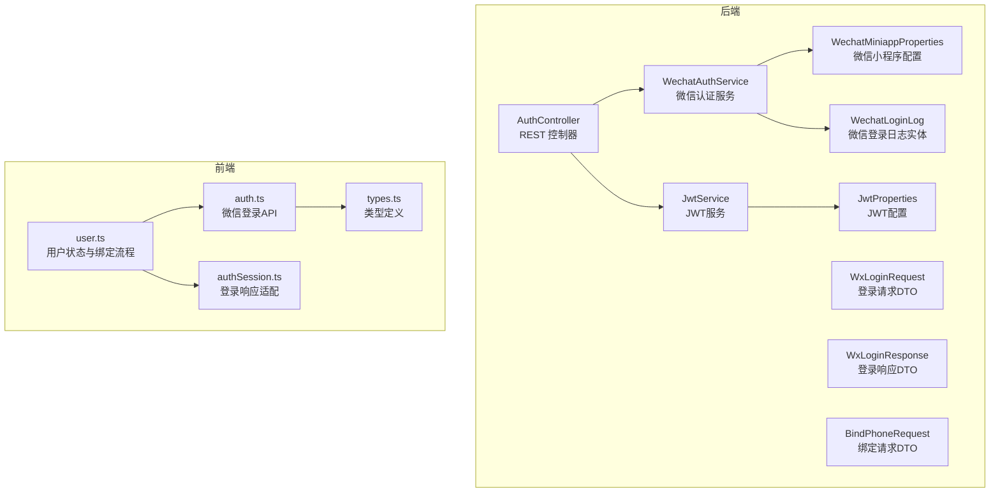
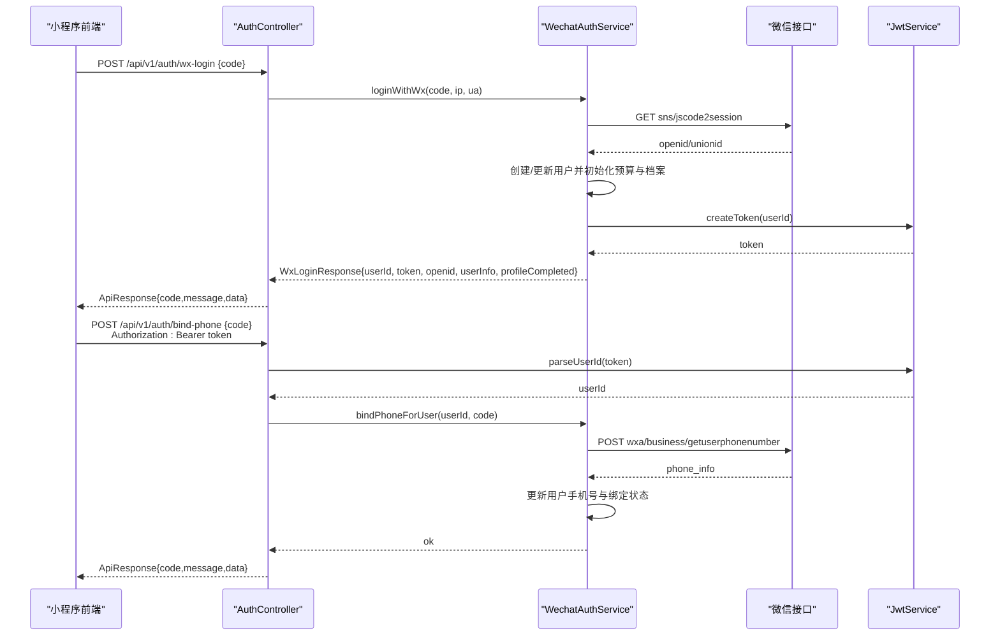
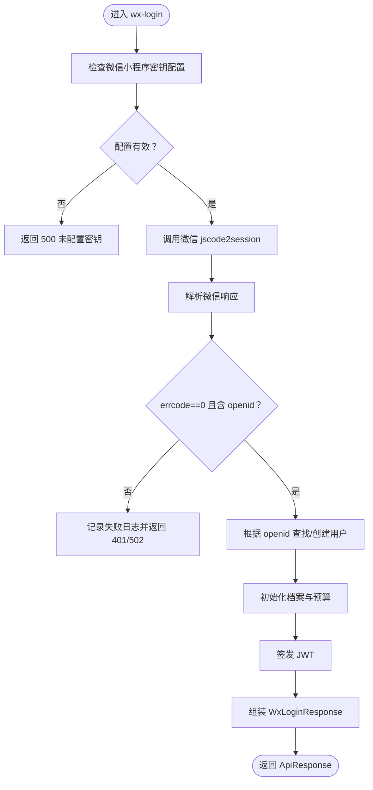
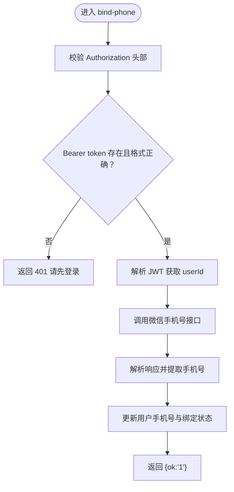
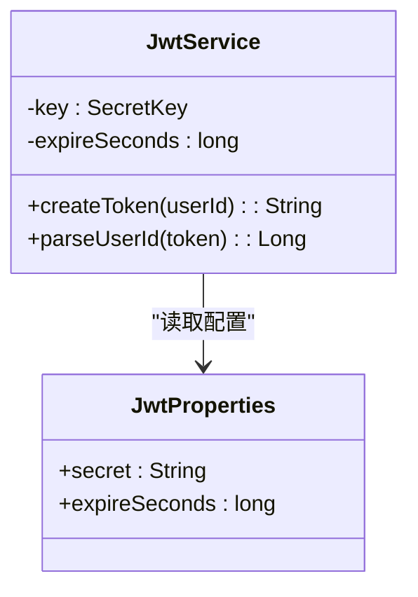
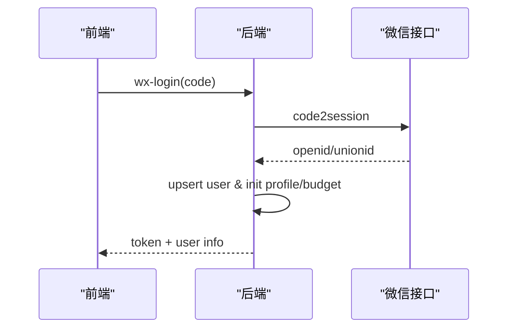
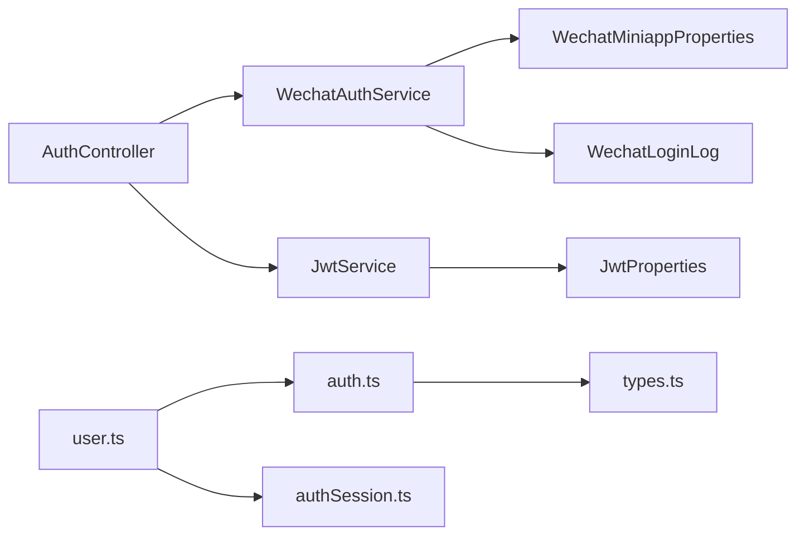

# 认证相关接口

<cite>
**本文引用的文件**
- [AuthController.java](file://backend/src/main/java/com/ypfr/loseweight/web/AuthController.java)
- [WechatAuthService.java](file://backend/src/main/java/com/ypfr/loseweight/service/WechatAuthService.java)
- [JwtService.java](file://backend/src/main/java/com/ypfr/loseweight/service/JwtService.java)
- [WxLoginRequest.java](file://backend/src/main/java/com/ypfr/loseweight/web/dto/WxLoginRequest.java)
- [WxLoginResponse.java](file://backend/src/main/java/com/ypfr/loseweight/web/dto/WxLoginResponse.java)
- [BindPhoneRequest.java](file://backend/src/main/java/com/ypfr/loseweight/web/dto/BindPhoneRequest.java)
- [JwtProperties.java](file://backend/src/main/java/com/ypfr/loseweight/config/JwtProperties.java)
- [WechatMiniappProperties.java](file://backend/src/main/java/com/ypfr/loseweight/config/WechatMiniappProperties.java)
- [WechatLoginLog.java](file://backend/src/main/java/com/ypfr/loseweight/domain/WechatLoginLog.java)
- [application.yml](file://backend/src/main/resources/application.yml)
- [auth.ts](file://frontend/src/api/auth.ts)
- [user.ts](file://frontend/src/stores/user.ts)
- [types.ts](file://frontend/src/api/types.ts)
- [authSession.ts](file://frontend/src/api/adapters/authSession.ts)
- [ApiResponse.java](file://backend/src/main/java/com/ypfr/loseweight/common/ApiResponse.java)
- [GlobalExceptionHandler.java](file://backend/src/main/java/com/ypfr/loseweight/common/GlobalExceptionHandler.java)
</cite>

## 目录
1. [简介](#简介)
2. [项目结构](#项目结构)
3. [核心组件](#核心组件)
4. [架构概览](#架构概览)
5. [详细组件分析](#详细组件分析)
6. [依赖分析](#依赖分析)
7. [性能考虑](#性能考虑)
8. [故障排除指南](#故障排除指南)
9. [结论](#结论)
10. [附录](#附录)

## 简介
本文件面向认证相关API接口，重点覆盖以下两个接口：
- 微信登录接口：POST /api/v1/auth/wx-login
- 手机号绑定接口：POST /api/v1/auth/bind-phone

文档内容涵盖HTTP方法、URL模式、请求/响应模式、认证方法、微信授权登录流程、JWT令牌生成与验证、手机号绑定的安全机制、协议特定示例、错误处理策略、安全考虑（如IP地址记录、User-Agent验证）、速率限制与版本信息、常见用例、客户端实现指南以及性能优化建议。

## 项目结构
后端采用Spring Boot分层架构，认证相关逻辑集中在Web控制器、服务层与DTO模型中，并通过配置类读取JWT与微信小程序参数。前端通过Pinia状态管理与API适配器封装请求与响应。

图表来源
- [AuthController.java:20-55](file://backend/src/main/java/com/ypfr/loseweight/web/AuthController.java#L20-L55)
- [WechatAuthService.java:27-233](file://backend/src/main/java/com/ypfr/loseweight/service/WechatAuthService.java#L27-L233)
- [JwtService.java:14-58](file://backend/src/main/java/com/ypfr/loseweight/service/JwtService.java#L14-L58)
- [WxLoginRequest.java:5-64](file://backend/src/main/java/com/ypfr/loseweight/web/dto/WxLoginRequest.java#L5-L64)
- [WxLoginResponse.java:7-57](file://backend/src/main/java/com/ypfr/loseweight/web/dto/WxLoginResponse.java#L7-L57)
- [BindPhoneRequest.java:5-19](file://backend/src/main/java/com/ypfr/loseweight/web/dto/BindPhoneRequest.java#L5-L19)
- [JwtProperties.java:5-29](file://backend/src/main/java/com/ypfr/loseweight/config/JwtProperties.java#L5-L29)
- [WechatMiniappProperties.java:5-28](file://backend/src/main/java/com/ypfr/loseweight/config/WechatMiniappProperties.java#L5-L28)
- [WechatLoginLog.java:8-95](file://backend/src/main/java/com/ypfr/loseweight/domain/WechatLoginLog.java#L8-L95)
- [auth.ts:1-10](file://frontend/src/api/auth.ts#L1-L10)
- [user.ts:1-104](file://frontend/src/stores/user.ts#L1-L104)
- [types.ts:1-131](file://frontend/src/api/types.ts#L1-L131)
- [authSession.ts:1-13](file://frontend/src/api/adapters/authSession.ts#L1-L13)

章节来源
- [AuthController.java:20-55](file://backend/src/main/java/com/ypfr/loseweight/web/AuthController.java#L20-L55)
- [application.yml:31-47](file://backend/src/main/resources/application.yml#L31-L47)

## 核心组件
- AuthController：暴露认证相关REST端点，负责接收请求、提取客户端信息（IP、User-Agent）、调用服务层并返回统一响应包装。
- WechatAuthService：实现微信登录与手机号绑定的核心逻辑，包括调用微信接口换取openid、创建或更新用户、签发JWT、记录登录日志等。
- JwtService：负责JWT密钥校验、令牌签发与用户ID解析。
- DTO层：WxLoginRequest、WxLoginResponse、BindPhoneRequest用于请求/响应的数据契约。
- 配置类：JwtProperties、WechatMiniappProperties分别读取JWT密钥与微信小程序参数。
- 响应包装：ApiResponse统一返回结构，配合GlobalExceptionHandler进行异常处理。

章节来源
- [AuthController.java:24-53](file://backend/src/main/java/com/ypfr/loseweight/web/AuthController.java#L24-L53)
- [WechatAuthService.java:64-153](file://backend/src/main/java/com/ypfr/loseweight/service/WechatAuthService.java#L64-L153)
- [JwtService.java:29-56](file://backend/src/main/java/com/ypfr/loseweight/service/JwtService.java#L29-L56)
- [WxLoginRequest.java:7-8](file://backend/src/main/java/com/ypfr/loseweight/web/dto/WxLoginRequest.java#L7-L8)
- [WxLoginResponse.java:9-13](file://backend/src/main/java/com/ypfr/loseweight/web/dto/WxLoginResponse.java#L9-L13)
- [BindPhoneRequest.java:8-9](file://backend/src/main/java/com/ypfr/loseweight/web/dto/BindPhoneRequest.java#L8-L9)
- [JwtProperties.java:8-11](file://backend/src/main/java/com/ypfr/loseweight/config/JwtProperties.java#L8-L11)
- [WechatMiniappProperties.java:8-11](file://backend/src/main/java/com/ypfr/loseweight/config/WechatMiniappProperties.java#L8-L11)
- [ApiResponse.java:15-21](file://backend/src/main/java/com/ypfr/loseweight/common/ApiResponse.java#L15-L21)
- [GlobalExceptionHandler.java:34-66](file://backend/src/main/java/com/ypfr/loseweight/common/GlobalExceptionHandler.java#L34-L66)

## 架构概览
认证流程分为两步：
1) 微信登录：前端通过微信登录获取code，调用后端wx-login接口，后端调用微信code2session换取openid，创建/更新用户并签发JWT。
2) 手机号绑定：前端携带JWT访问bind-phone接口，后端解析JWT获取用户ID，再调用微信手机号接口换取手机号并更新用户信息。

图表来源
- [AuthController.java:32-53](file://backend/src/main/java/com/ypfr/loseweight/web/AuthController.java#L32-L53)
- [WechatAuthService.java:64-153](file://backend/src/main/java/com/ypfr/loseweight/service/WechatAuthService.java#L64-L153)
- [WechatAuthService.java:155-204](file://backend/src/main/java/com/ypfr/loseweight/service/WechatAuthService.java#L155-L204)
- [JwtService.java:29-56](file://backend/src/main/java/com/ypfr/loseweight/service/JwtService.java#L29-L56)

## 详细组件分析

### 微信登录接口 /api/v1/auth/wx-login
- HTTP方法：POST
- URL模式：/api/v1/auth/wx-login
- 认证方式：无需认证，匿名访问
- 请求体：WxLoginRequest
  - code：必填，微信登录凭证
  - nickName、avatarUrl、gender、avatarBase64：可选，用于后续资料维护
- 响应体：WxLoginResponse
  - userId：用户ID
  - token：JWT令牌
  - openid：微信openid
  - profileCompleted：个人资料是否完善
  - userInfo：AppUserDto，包含昵称、头像、性别、身高、体重、目标等
- 安全机制：
  - 记录客户端IP与User-Agent到WechatLoginLog
  - 对微信接口响应进行严格校验，失败时返回401/502
  - 若未配置微信小程序密钥，直接抛出500错误
- 流程要点：
  - 调用微信code2session获取openid/unionid
  - 若用户不存在则创建新用户并初始化预算与档案
  - 生成JWT并返回给前端

图表来源
- [WechatAuthService.java:64-153](file://backend/src/main/java/com/ypfr/loseweight/service/WechatAuthService.java#L64-L153)
- [WechatAuthService.java:213-231](file://backend/src/main/java/com/ypfr/loseweight/service/WechatAuthService.java#L213-L231)
- [WxLoginRequest.java:7-8](file://backend/src/main/java/com/ypfr/loseweight/web/dto/WxLoginRequest.java#L7-L8)
- [WxLoginResponse.java:9-13](file://backend/src/main/java/com/ypfr/loseweight/web/dto/WxLoginResponse.java#L9-L13)

章节来源
- [AuthController.java:32-39](file://backend/src/main/java/com/ypfr/loseweight/web/AuthController.java#L32-L39)
- [WechatAuthService.java:64-153](file://backend/src/main/java/com/ypfr/loseweight/service/WechatAuthService.java#L64-L153)
- [WxLoginRequest.java:7-22](file://backend/src/main/java/com/ypfr/loseweight/web/dto/WxLoginRequest.java#L7-L22)
- [WxLoginResponse.java:9-55](file://backend/src/main/java/com/ypfr/loseweight/web/dto/WxLoginResponse.java#L9-L55)

### 手机号绑定接口 /api/v1/auth/bind-phone
- HTTP方法：POST
- URL模式：/api/v1/auth/bind-phone
- 认证方式：Bearer Token（Authorization头部）
- 请求体：BindPhoneRequest
  - code：必填，来自微信按钮 getPhoneNumber 的返回值
- 响应体：ApiResponse<Map<String,String>>，data为{"ok":"1"}
- 安全机制：
  - 解析JWT获取用户ID，缺失或无效则返回401
  - 调用微信手机号接口需要全局access_token
  - 成功后更新用户手机号、绑定状态与时间戳
- 流程要点：
  - 校验Authorization头部格式
  - 解析JWT得到userId
  - 调用微信手机号接口换取手机号
  - 更新用户信息并返回成功

图表来源
- [AuthController.java:42-53](file://backend/src/main/java/com/ypfr/loseweight/web/AuthController.java#L42-L53)
- [JwtService.java:40-56](file://backend/src/main/java/com/ypfr/loseweight/service/JwtService.java#L40-L56)
- [WechatAuthService.java:155-204](file://backend/src/main/java/com/ypfr/loseweight/service/WechatAuthService.java#L155-L204)
- [BindPhoneRequest.java:8-9](file://backend/src/main/java/com/ypfr/loseweight/web/dto/BindPhoneRequest.java#L8-L9)

章节来源
- [AuthController.java:42-53](file://backend/src/main/java/com/ypfr/loseweight/web/AuthController.java#L42-L53)
- [JwtService.java:40-56](file://backend/src/main/java/com/ypfr/loseweight/service/JwtService.java#L40-L56)
- [WechatAuthService.java:155-204](file://backend/src/main/java/com/ypfr/loseweight/service/WechatAuthService.java#L155-L204)
- [BindPhoneRequest.java:8-9](file://backend/src/main/java/com/ypfr/loseweight/web/dto/BindPhoneRequest.java#L8-L9)

### JWT令牌生成与验证
- 令牌签发：JwtService基于HS256算法，使用配置的密钥与过期秒数生成JWT。
- 令牌解析：从Authorization头部提取Bearer token，校验签名与过期时间，解析出用户ID。
- 配置要求：密钥长度至少32字节，生产环境必须在本地配置文件中覆盖默认值。

图表来源
- [JwtService.java:14-58](file://backend/src/main/java/com/ypfr/loseweight/service/JwtService.java#L14-L58)
- [JwtProperties.java:5-29](file://backend/src/main/java/com/ypfr/loseweight/config/JwtProperties.java#L5-L29)

章节来源
- [JwtService.java:29-56](file://backend/src/main/java/com/ypfr/loseweight/service/JwtService.java#L29-L56)
- [JwtProperties.java:8-26](file://backend/src/main/java/com/ypfr/loseweight/config/JwtProperties.java#L8-L26)

### 微信授权登录流程
- 前端：调用微信登录获取code，随后调用后端wx-login接口。
- 后端：调用微信code2session换取openid/unionid，创建或更新用户，初始化档案与预算，签发JWT。
- 安全记录：将客户端IP与User-Agent写入WechatLoginLog，便于审计与风控。

图表来源
- [AuthController.java:32-39](file://backend/src/main/java/com/ypfr/loseweight/web/AuthController.java#L32-L39)
- [WechatAuthService.java:64-153](file://backend/src/main/java/com/ypfr/loseweight/service/WechatAuthService.java#L64-L153)

章节来源
- [AuthController.java:32-39](file://backend/src/main/java/com/ypfr/loseweight/web/AuthController.java#L32-L39)
- [WechatAuthService.java:64-153](file://backend/src/main/java/com/ypfr/loseweight/service/WechatAuthService.java#L64-L153)

### 手机号绑定的安全机制
- 双重校验：Authorization头部校验与JWT解析校验。
- 微信接口安全：手机号接口调用需要全局access_token，确保接口安全性。
- 数据完整性：对手机号长度进行截断保护，避免超长数据入库。
- 登录日志：记录绑定过程中的错误信息，便于追踪问题。

章节来源
- [AuthController.java:46-52](file://backend/src/main/java/com/ypfr/loseweight/web/AuthController.java#L46-L52)
- [WechatAuthService.java:155-204](file://backend/src/main/java/com/ypfr/loseweight/service/WechatAuthService.java#L155-L204)

## 依赖分析
- 控制器依赖服务层与JWT服务，服务层依赖微信配置、日志实体与用户服务。
- 前端通过API模块与Pinia状态管理调用后端接口，类型定义与适配器保证数据一致性。

图表来源
- [AuthController.java:24-30](file://backend/src/main/java/com/ypfr/loseweight/web/AuthController.java#L24-L30)
- [WechatAuthService.java:42-59](file://backend/src/main/java/com/ypfr/loseweight/service/WechatAuthService.java#L42-L59)
- [JwtService.java:20-27](file://backend/src/main/java/com/ypfr/loseweight/service/JwtService.java#L20-L27)
- [auth.ts:1-9](file://frontend/src/api/auth.ts#L1-L9)
- [user.ts:1-104](file://frontend/src/stores/user.ts#L1-L104)
- [types.ts:39-45](file://frontend/src/api/types.ts#L39-L45)
- [authSession.ts:4-12](file://frontend/src/api/adapters/authSession.ts#L4-L12)

章节来源
- [AuthController.java:24-30](file://backend/src/main/java/com/ypfr/loseweight/web/AuthController.java#L24-L30)
- [WechatAuthService.java:42-59](file://backend/src/main/java/com/ypfr/loseweight/service/WechatAuthService.java#L42-L59)
- [JwtService.java:20-27](file://backend/src/main/java/com/ypfr/loseweight/service/JwtService.java#L20-L27)
- [auth.ts:1-9](file://frontend/src/api/auth.ts#L1-L9)
- [user.ts:1-104](file://frontend/src/stores/user.ts#L1-L104)
- [types.ts:39-45](file://frontend/src/api/types.ts#L39-L45)
- [authSession.ts:4-12](file://frontend/src/api/adapters/authSession.ts#L4-L12)

## 性能考虑
- 连接池与超时：微信接口调用使用RestTemplate，默认连接池与超时策略需结合线上监控调整。
- 缓存策略：手机号接口需要全局access_token，建议在服务启动时预热并定期刷新。
- 响应压缩：开启Gzip压缩可降低JSON体积，提升移动端传输效率。
- 并发控制：对高频接口增加限流策略，防止恶意刷量。
- 日志级别：生产环境建议降低日志级别，避免I/O瓶颈。

## 故障排除指南
- 401 未登录：Authorization头部缺失或格式不正确；检查前端是否正确设置Bearer token。
- 401 登录失效：JWT过期或被篡改；提示用户重新登录。
- 400 获取手机号失败：微信接口返回errcode非0；检查前端getPhoneNumber流程与权限。
- 500 未配置微信小程序密钥：application-local.yml未正确配置wechat.miniapp.*。
- 502 微信接口调用失败：网络异常或微信服务不可用；重试或降级处理。
- 502 解析微信响应失败：微信返回非JSON或格式异常；检查微信SDK版本与回调格式。

章节来源
- [AuthController.java:46-48](file://backend/src/main/java/com/ypfr/loseweight/web/AuthController.java#L46-L48)
- [JwtService.java:44-55](file://backend/src/main/java/com/ypfr/loseweight/service/JwtService.java#L44-L55)
- [WechatAuthService.java:66-69](file://backend/src/main/java/com/ypfr/loseweight/service/WechatAuthService.java#L66-L69)
- [WechatAuthService.java:83-94](file://backend/src/main/java/com/ypfr/loseweight/service/WechatAuthService.java#L83-L94)
- [WechatAuthService.java:172-184](file://backend/src/main/java/com/ypfr/loseweight/service/WechatAuthService.java#L172-L184)
- [GlobalExceptionHandler.java:34-66](file://backend/src/main/java/com/ypfr/loseweight/common/GlobalExceptionHandler.java#L34-L66)

## 结论
本文档系统性梳理了微信登录与手机号绑定两大认证接口的HTTP规范、数据契约、安全机制与错误处理策略。通过JWT令牌与微信接口的协同，实现了从匿名到实名的平滑过渡。建议在生产环境中强化密钥管理、接入限流与监控告警，并持续优化微信接口调用链路与日志审计能力。

## 附录
- 版本信息：接口前缀为/api/v1，遵循统一响应包装格式。
- 速率限制：当前代码未内置限流逻辑，建议在网关或服务层增加限流策略。
- 安全考虑：记录客户端IP与User-Agent，结合JWT过期策略与密钥轮换，提升整体安全性。