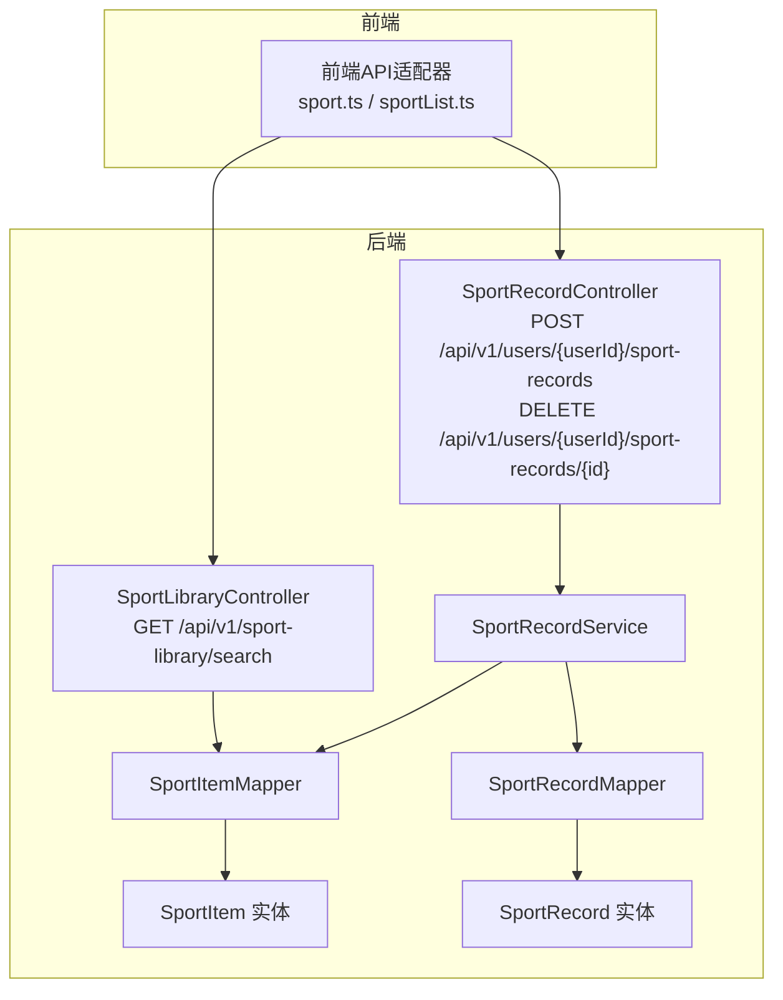
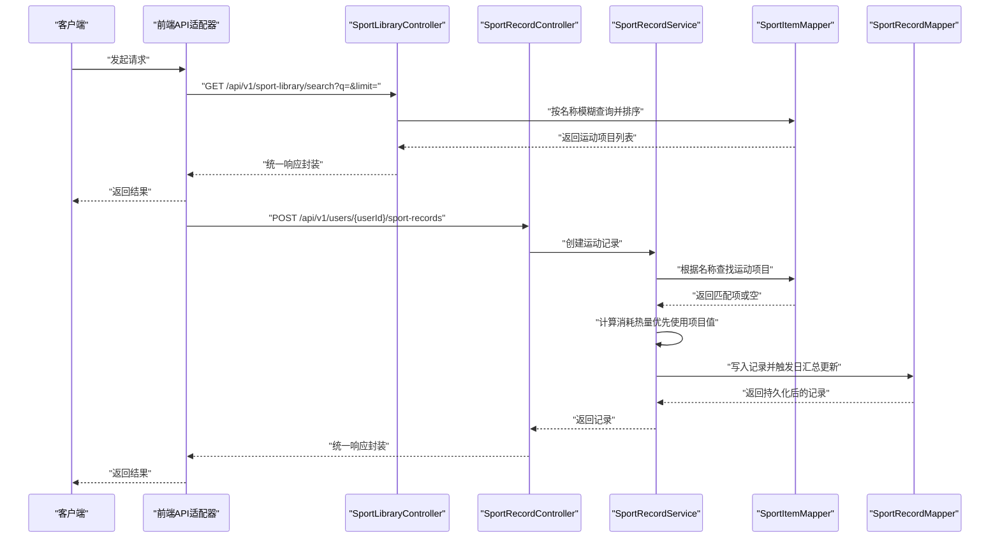
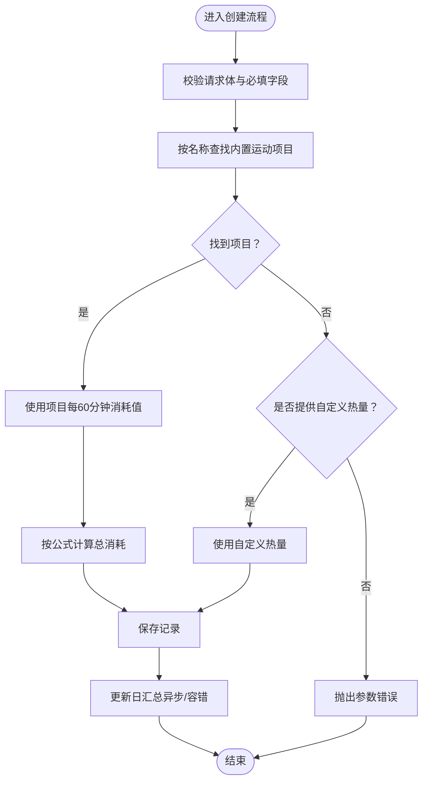
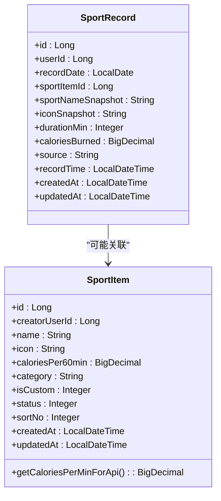
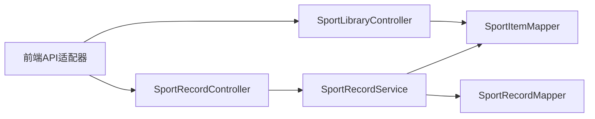

# 运动追踪接口

<cite>
**本文引用的文件**
- [SportLibraryController.java](file://backend/src/main/java/com/ypfr/loseweight/web/SportLibraryController.java)
- [SportRecordController.java](file://backend/src/main/java/com/ypfr/loseweight/web/SportRecordController.java)
- [SportItem.java](file://backend/src/main/java/com/ypfr/loseweight/domain/SportItem.java)
- [SportRecord.java](file://backend/src/main/java/com/ypfr/loseweight/domain/SportRecord.java)
- [SportRecordService.java](file://backend/src/main/java/com/ypfr/loseweight/service/SportRecordService.java)
- [CreateSportRecordRequest.java](file://backend/src/main/java/com/ypfr/loseweight/web/dto/CreateSportRecordRequest.java)
- [SportItemMapper.java](file://backend/src/main/java/com/ypfr/loseweight/mapper/SportItemMapper.java)
- [SportRecordMapper.java](file://backend/src/main/java/com/ypfr/loseweight/mapper/SportRecordMapper.java)
- [application.yml](file://backend/src/main/resources/application.yml)
- [sport.ts](file://frontend/src/api/sport.ts)
- [sportList.ts](file://frontend/src/api/adapters/sportList.ts)
- [ApiResponse.java](file://backend/src/main/java/com/ypfr/loseweight/common/ApiResponse.java)
- [ApiException.java](file://backend/src/main/java/com/ypfr/loseweight/common/ApiException.java)
- [JwtService.java](file://backend/src/main/java/com/ypfr/loseweight/service/JwtService.java)
- [AdminAuthResolver.java](file://backend/src/main/java/com/ypfr/loseweight/web/AdminAuthResolver.java)
- [sport_item 建表语句](file://database/project_current_baseline_alignment.sql)
- [sport_item 种子数据](file://database/loseweight_bak20260405.sql)
</cite>

## 目录
1. [简介](#简介)
2. [项目结构](#项目结构)
3. [核心组件](#核心组件)
4. [架构总览](#架构总览)
5. [详细组件分析](#详细组件分析)
6. [依赖分析](#依赖分析)
7. [性能考虑](#性能考虑)
8. [故障排查指南](#故障排查指南)
9. [结论](#结论)
10. [附录](#附录)

## 简介
本文件为运动追踪相关API接口的权威技术文档，覆盖以下能力：
- 运动库查询接口：按名称模糊搜索运动项目，支持分页限制
- 运动记录创建接口：支持手动录入运动记录，自动计算消耗热量
- 运动记录删除接口：按记录ID删除用户运动记录
- 热量消耗计算规则：优先使用内置运动库的每60分钟消耗值，其次接受客户端传入的自定义热量值
- 运动项目分类：内置运动库包含“有氧”“柔韧”“力量”等分类
- 版本与协议：基于Spring Boot后端与Vue前端，采用REST风格HTTP接口，统一响应包装

## 项目结构
后端采用标准分层架构：Web层（控制器）→ Service层（业务逻辑）→ Mapper层（数据库访问）→ Domain层（实体模型）。前端通过HTTP适配器调用后端接口。

图表来源
- [SportLibraryController.java:14-35](file://backend/src/main/java/com/ypfr/loseweight/web/SportLibraryController.java#L14-L35)
- [SportRecordController.java:14-35](file://backend/src/main/java/com/ypfr/loseweight/web/SportRecordController.java#L14-L35)
- [SportRecordService.java:17-110](file://backend/src/main/java/com/ypfr/loseweight/service/SportRecordService.java#L17-L110)
- [SportItemMapper.java:1-9](file://backend/src/main/java/com/ypfr/loseweight/mapper/SportItemMapper.java#L1-L9)
- [SportRecordMapper.java:13-30](file://backend/src/main/java/com/ypfr/loseweight/mapper/SportRecordMapper.java#L13-L30)
- [SportItem.java:1-131](file://backend/src/main/java/com/ypfr/loseweight/domain/SportItem.java#L1-L131)
- [SportRecord.java:1-124](file://backend/src/main/java/com/ypfr/loseweight/domain/SportRecord.java#L1-L124)

章节来源
- [SportLibraryController.java:1-36](file://backend/src/main/java/com/ypfr/loseweight/web/SportLibraryController.java#L1-L36)
- [SportRecordController.java:1-36](file://backend/src/main/java/com/ypfr/loseweight/web/SportRecordController.java#L1-L36)

## 核心组件
- 运动库查询控制器：提供按名称模糊搜索运动项目的能力，并对limit进行范围约束
- 运动记录控制器：提供创建与删除运动记录的接口，内部委托服务层完成业务处理
- 运动记录服务：负责校验请求参数、匹配运动项目、计算消耗热量、更新日汇总
- 运动项目与记录实体：描述运动库条目与用户运动记录的数据结构
- 统一响应包装：所有接口返回统一的响应结构，便于前端处理

章节来源
- [SportLibraryController.java:14-35](file://backend/src/main/java/com/ypfr/loseweight/web/SportLibraryController.java#L14-L35)
- [SportRecordController.java:14-35](file://backend/src/main/java/com/ypfr/loseweight/web/SportRecordController.java#L14-L35)
- [SportRecordService.java:17-110](file://backend/src/main/java/com/ypfr/loseweight/service/SportRecordService.java#L17-L110)
- [SportItem.java:1-131](file://backend/src/main/java/com/ypfr/loseweight/domain/SportItem.java#L1-L131)
- [SportRecord.java:1-124](file://backend/src/main/java/com/ypfr/loseweight/domain/SportRecord.java#L1-L124)
- [ApiResponse.java:1-35](file://backend/src/main/java/com/ypfr/loseweight/common/ApiResponse.java#L1-L35)

## 架构总览
下图展示从客户端到后端的典型调用链路，以及服务层如何协调数据访问与业务规则：

图表来源
- [SportLibraryController.java:24-34](file://backend/src/main/java/com/ypfr/loseweight/web/SportLibraryController.java#L24-L34)
- [SportRecordController.java:24-34](file://backend/src/main/java/com/ypfr/loseweight/web/SportRecordController.java#L24-L34)
- [SportRecordService.java:33-84](file://backend/src/main/java/com/ypfr/loseweight/service/SportRecordService.java#L33-L84)
- [SportItemMapper.java:1-9](file://backend/src/main/java/com/ypfr/loseweight/mapper/SportItemMapper.java#L1-L9)
- [SportRecordMapper.java:1-31](file://backend/src/main/java/com/ypfr/loseweight/mapper/SportRecordMapper.java#L1-L31)

## 详细组件分析

### 运动库查询接口
- 方法与路径
  - GET /api/v1/sport-library/search
- 查询参数
  - q：可选，名称关键字（前后去空白后模糊匹配）
  - limit：可选，默认50，最小1，最大200
- 返回数据
  - 列表类型，元素为运动项目对象（包含名称、图标、分类、每60分钟消耗等）
- 关键行为
  - 对limit进行边界约束
  - 按名称升序排序并截断至limit
  - 支持空查询时返回全部（受limit限制）

章节来源
- [SportLibraryController.java:24-34](file://backend/src/main/java/com/ypfr/loseweight/web/SportLibraryController.java#L24-L34)

### 运动记录创建接口
- 方法与路径
  - POST /api/v1/users/{userId}/sport-records
- 请求头
  - 需携带用户身份令牌（见认证章节）
- 请求体字段
  - sportName：必填，运动名称（将被裁剪至64字符以内）
  - durationMin：必填，持续时间（分钟），需大于0
  - calories：可选，自定义消耗热量（非负）
  - icon：可选，图标字符串
  - recordedAt：可选，记录时间（将被解析为日期与时间）
- 返回数据
  - 运动记录对象（包含用户ID、记录日期、运动项快照、时长、消耗、来源、记录时间等）
- 关键行为
  - 若存在同名内置运动项目，则使用其每60分钟消耗值计算总消耗
  - 否则若提供了自定义calories，则直接采用
  - 否则抛出参数错误
  - 写入记录后尝试更新对应日期的日汇总

章节来源
- [SportRecordController.java:24-28](file://backend/src/main/java/com/ypfr/loseweight/web/SportRecordController.java#L24-L28)
- [SportRecordService.java:33-84](file://backend/src/main/java/com/ypfr/loseweight/service/SportRecordService.java#L33-L84)
- [CreateSportRecordRequest.java:1-51](file://backend/src/main/java/com/ypfr/loseweight/web/dto/CreateSportRecordRequest.java#L1-L51)

### 运动记录删除接口
- 方法与路径
  - DELETE /api/v1/users/{userId}/sport-records/{id}
- 行为
  - 校验记录是否存在且属于当前用户
  - 删除记录并尝试更新对应日期的日汇总

章节来源
- [SportRecordController.java:30-34](file://backend/src/main/java/com/ypfr/loseweight/web/SportRecordController.java#L30-L34)
- [SportRecordService.java:86-101](file://backend/src/main/java/com/ypfr/loseweight/service/SportRecordService.java#L86-L101)

### 热量消耗计算流程

图表来源
- [SportRecordService.java:33-84](file://backend/src/main/java/com/ypfr/loseweight/service/SportRecordService.java#L33-L84)

### 运动项目数据模型

图表来源
- [SportItem.java:1-131](file://backend/src/main/java/com/ypfr/loseweight/domain/SportItem.java#L1-L131)
- [SportRecord.java:1-124](file://backend/src/main/java/com/ypfr/loseweight/domain/SportRecord.java#L1-L124)

## 依赖分析
- 控制器依赖注入
  - SportLibraryController 依赖 SportItemMapper
  - SportRecordController 依赖 SportRecordService
- 服务层依赖
  - SportRecordService 依赖 SportItemMapper、SportRecordMapper、DailySummaryService
- 前端依赖
  - sport.ts 提供搜索与创建接口的封装
  - sportList.ts 将后端返回的运动项目转换为前端选择器可用格式

图表来源
- [sport.ts:1-34](file://frontend/src/api/sport.ts#L1-L34)
- [sportList.ts:1-40](file://frontend/src/api/adapters/sportList.ts#L1-L40)
- [SportLibraryController.java:18-22](file://backend/src/main/java/com/ypfr/loseweight/web/SportLibraryController.java#L18-L22)
- [SportRecordController.java:18-22](file://backend/src/main/java/com/ypfr/loseweight/web/SportRecordController.java#L18-L22)
- [SportRecordService.java:20-31](file://backend/src/main/java/com/ypfr/loseweight/service/SportRecordService.java#L20-L31)
- [SportItemMapper.java:1-9](file://backend/src/main/java/com/ypfr/loseweight/mapper/SportItemMapper.java#L1-L9)
- [SportRecordMapper.java:1-31](file://backend/src/main/java/com/ypfr/loseweight/mapper/SportRecordMapper.java#L1-L31)

章节来源
- [sport.ts:1-34](file://frontend/src/api/sport.ts#L1-L34)
- [sportList.ts:1-40](file://frontend/src/api/adapters/sportList.ts#L1-L40)
- [SportRecordService.java:17-31](file://backend/src/main/java/com/ypfr/loseweight/service/SportRecordService.java#L17-L31)

## 性能考虑
- 查询限制：搜索接口对limit进行上限控制，避免过大数据集返回
- 排序与截断：按名称排序并限制数量，减少数据库压力
- 热量计算：纯内存计算，复杂度低
- 日汇总更新：采用异步容错策略，避免单点失败影响主流程

## 故障排查指南
- 参数错误
  - 请求体为空、运动名称为空、时长非正、未提供有效热量来源
- 权限与资源
  - 删除记录时若记录不存在或不属于当前用户，会返回相应错误
- 认证失效
  - 缺失或无效的令牌会导致鉴权失败

章节来源
- [SportRecordService.java:33-101](file://backend/src/main/java/com/ypfr/loseweight/service/SportRecordService.java#L33-L101)
- [ApiException.java:1-16](file://backend/src/main/java/com/ypfr/loseweight/common/ApiException.java#L1-L16)

## 结论
本接口体系以清晰的REST设计与统一的响应包装为基础，实现了运动库检索与运动记录的完整生命周期管理。通过内置运动项目的标准化热量数据与灵活的自定义热量支持，兼顾了准确性与易用性。建议客户端在创建记录时优先使用内置运动项目，以获得更一致的热量计算结果。

## 附录

### HTTP接口清单与示例

- 运动库搜索
  - 方法：GET
  - 路径：/api/v1/sport-library/search
  - 查询参数：
    - q：名称关键字（可选）
    - limit：返回数量限制（默认50，最小1，最大200）
  - 示例：
    - GET /api/v1/sport-library/search?q=跑步&limit=50
  - 响应：统一包装的列表数据

- 创建运动记录
  - 方法：POST
  - 路径：/api/v1/users/{userId}/sport-records
  - 请求头：Authorization: Bearer <token>
  - 请求体字段：
    - sportName：运动名称（必填）
    - durationMin：持续时间（分钟）（必填，>0）
    - calories：自定义消耗热量（可选，≥0）
    - icon：图标（可选）
    - recordedAt：记录时间（可选）
  - 示例：
    - POST /api/v1/users/123/sport-records
    - Body: {"sportName":"跑步","durationMin":30,"icon":"🏃","recordedAt":"2025-04-05T12:00:00Z"}

- 删除运动记录
  - 方法：DELETE
  - 路径：/api/v1/users/{userId}/sport-records/{id}
  - 请求头：Authorization: Bearer <token>
  - 示例：
    - DELETE /api/v1/users/123/sport-records/456

章节来源
- [SportLibraryController.java:24-34](file://backend/src/main/java/com/ypfr/loseweight/web/SportLibraryController.java#L24-L34)
- [SportRecordController.java:24-34](file://backend/src/main/java/com/ypfr/loseweight/web/SportRecordController.java#L24-L34)
- [CreateSportRecordRequest.java:1-51](file://backend/src/main/java/com/ypfr/loseweight/web/dto/CreateSportRecordRequest.java#L1-L51)

### 认证与授权
- 用户令牌
  - 使用JWT进行身份验证，服务端提供签发与解析能力
  - 解析失败或缺失将返回未授权错误
- 管理员令牌
  - 管理端使用独立的管理员令牌服务，用于后台管理接口

章节来源
- [JwtService.java:1-57](file://backend/src/main/java/com/ypfr/loseweight/service/JwtService.java#L1-L57)
- [AdminAuthResolver.java:1-27](file://backend/src/main/java/com/ypfr/loseweight/web/AdminAuthResolver.java#L1-L27)

### 数据模型与字段说明

- 运动项目（sport_item）
  - 关键字段：id、name、icon、calories_per_60min、category、is_custom、status、sort_no
  - 示例种子数据包含多类运动（如“跑步”“跳绳”“游泳”等），分类涵盖“有氧”“柔韧”“力量”

- 运动记录（sport_record）
  - 关键字段：user_id、record_date、sport_item_id、sport_name_snapshot、icon_snapshot、duration_min、calories_burned、source、record_time

章节来源
- [sport_item 建表语句:278-293](file://database/project_current_baseline_alignment.sql#L278-L293)
- [sport_item 种子数据:3824-3833](file://database/loseweight_bak20260405.sql#L3824-L3833)
- [SportItem.java:1-131](file://backend/src/main/java/com/ypfr/loseweight/domain/SportItem.java#L1-L131)
- [SportRecord.java:1-124](file://backend/src/main/java/com/ypfr/loseweight/domain/SportRecord.java#L1-L124)

### 热量消耗算法与分类规则
- 算法
  - 优先使用运动项目表中的每60分钟消耗值，按公式：总消耗 = 项目每60分钟消耗 × 持续分钟 ÷ 60
  - 若无内置项目匹配，则使用请求体中的自定义热量值
  - 两者均不可得则拒绝请求
- 分类
  - 内置运动库包含“有氧”“柔韧”“力量”等分类，便于前端筛选与展示

章节来源
- [SportRecordService.java:61-74](file://backend/src/main/java/com/ypfr/loseweight/service/SportRecordService.java#L61-L74)
- [sport_item 种子数据:3824-3833](file://database/loseweight_bak20260405.sql#L3824-L3833)

### 前端实现要点
- 搜索
  - 建议对输入做防抖处理，合理设置limit
  - 将返回的每分钟消耗转换为每60分钟显示，提升可读性
- 创建
  - 在提交前校验时长与热量来源，确保满足后端要求
  - 保存成功后刷新当日汇总与历史列表

章节来源
- [sport.ts:21-33](file://frontend/src/api/sport.ts#L21-L33)
- [sportList.ts:17-39](file://frontend/src/api/adapters/sportList.ts#L17-L39)

### 错误处理策略
- 统一响应
  - 成功：code=0，message="ok"
  - 失败：code与message由异常处理器决定
- 异常类型
  - 参数错误、权限不足、资源不存在等场景均有明确的错误码与提示

章节来源
- [ApiResponse.java:1-35](file://backend/src/main/java/com/ypfr/loseweight/common/ApiResponse.java#L1-L35)
- [ApiException.java:1-16](file://backend/src/main/java/com/ypfr/loseweight/common/ApiException.java#L1-L16)
- [SportRecordService.java:33-101](file://backend/src/main/java/com/ypfr/loseweight/service/SportRecordService.java#L33-L101)

### 版本信息
- 服务器端
  - Spring Boot应用，MyBatis-Plus集成，MySQL数据源
  - JWT密钥长度需≥32字节，生产环境务必在配置文件中覆盖默认密钥
- 前端
  - Vue生态，通过HTTP适配器调用后端接口

章节来源
- [application.yml:1-54](file://backend/src/main/resources/application.yml#L1-L54)
- [JwtService.java:20-27](file://backend/src/main/java/com/ypfr/loseweight/service/JwtService.java#L20-L27)