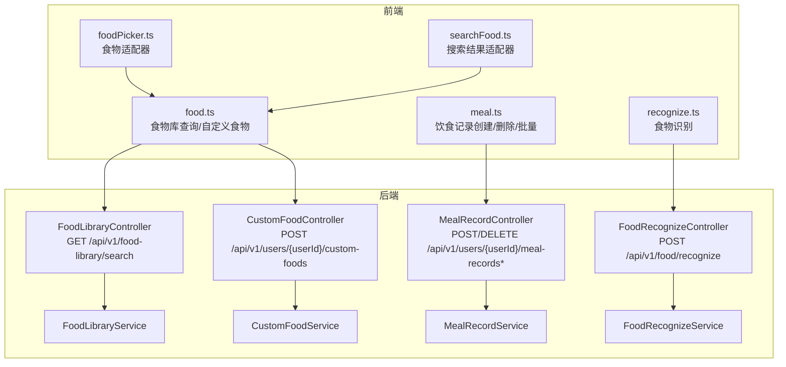
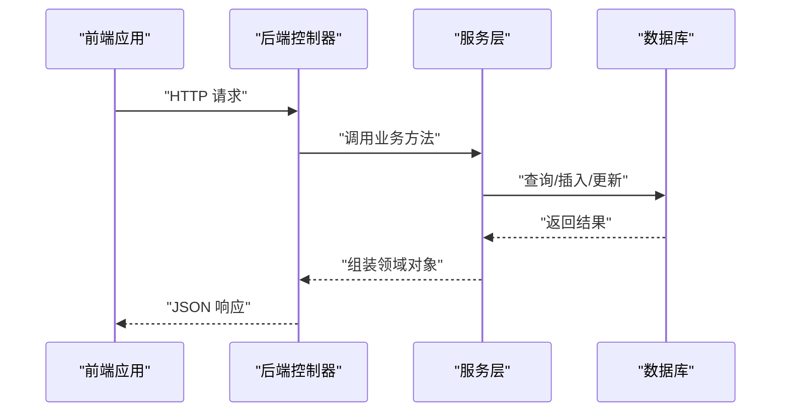
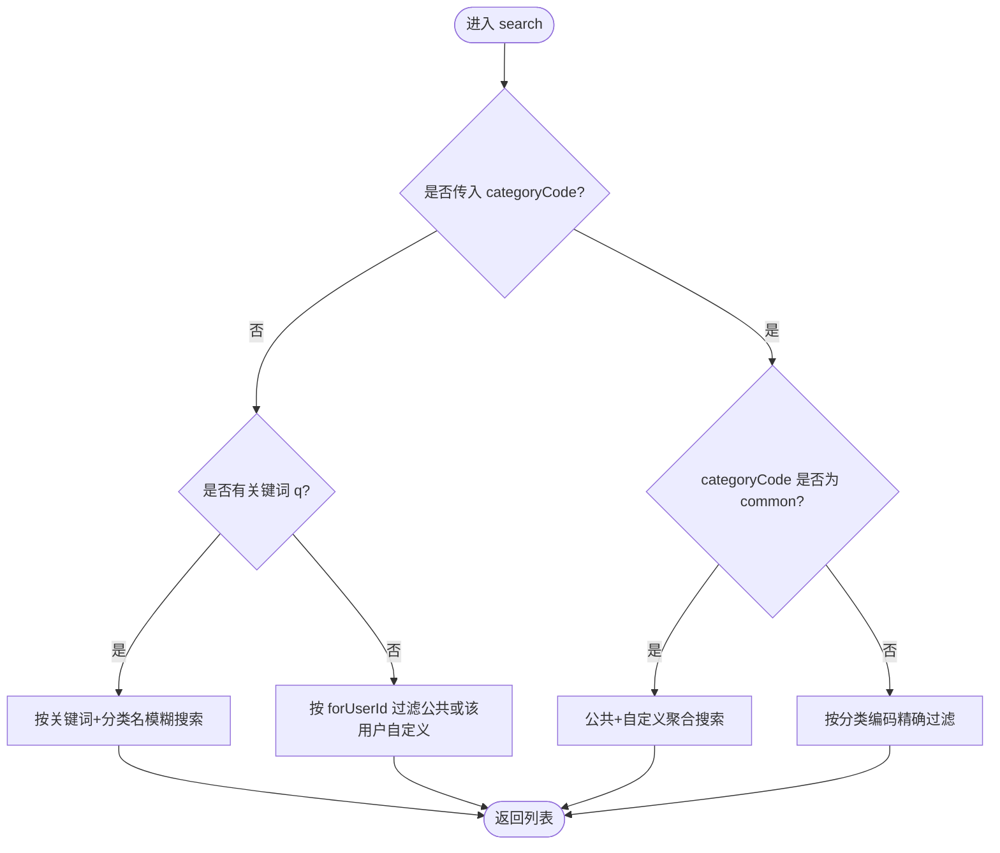
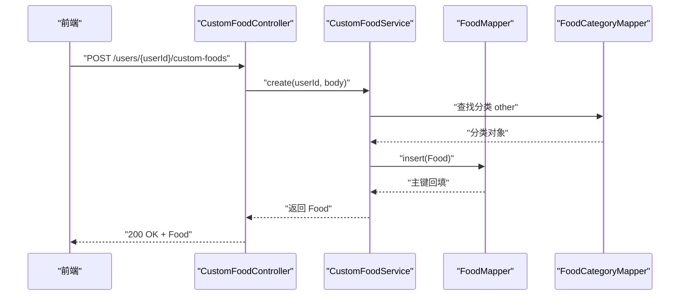
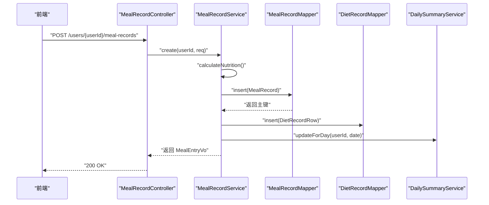
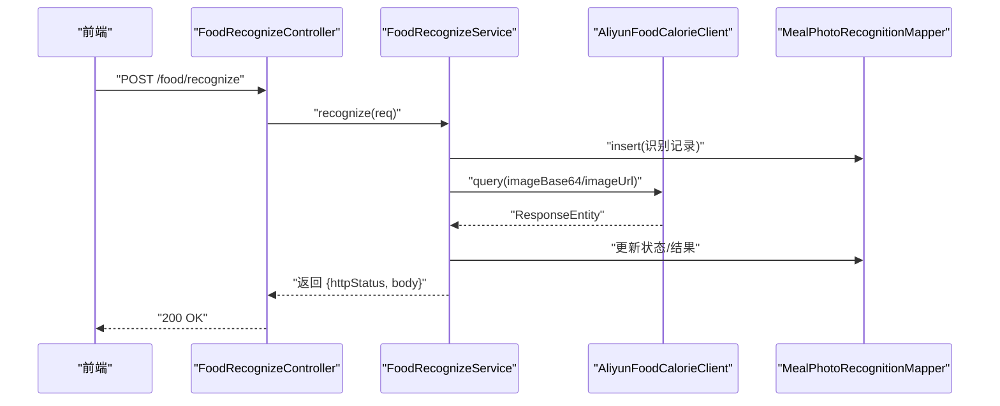
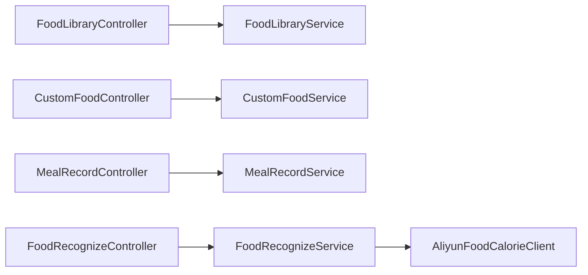

# 饮食记录接口

<cite>
**本文引用的文件**
- [FoodLibraryController.java](file://backend/src/main/java/com/ypfr/loseweight/web/FoodLibraryController.java)
- [CustomFoodController.java](file://backend/src/main/java/com/ypfr/loseweight/web/CustomFoodController.java)
- [MealRecordController.java](file://backend/src/main/java/com/ypfr/loseweight/web/MealRecordController.java)
- [FoodRecognizeController.java](file://backend/src/main/java/com/ypfr/loseweight/web/FoodRecognizeController.java)
- [FoodLibraryService.java](file://backend/src/main/java/com/ypfr/loseweight/service/FoodLibraryService.java)
- [CustomFoodService.java](file://backend/src/main/java/com/ypfr/loseweight/service/CustomFoodService.java)
- [MealRecordService.java](file://backend/src/main/java/com/ypfr/loseweight/service/MealRecordService.java)
- [FoodRecognizeService.java](file://backend/src/main/java/com/ypfr/loseweight/service/FoodRecognizeService.java)
- [CreateCustomFoodRequest.java](file://backend/src/main/java/com/ypfr/loseweight/web/dto/CreateCustomFoodRequest.java)
- [CreateMealRecordRequest.java](file://backend/src/main/java/com/ypfr/loseweight/web/dto/CreateMealRecordRequest.java)
- [CreateMealRecordsBatchRequest.java](file://backend/src/main/java/com/ypfr/loseweight/web/dto/CreateMealRecordsBatchRequest.java)
- [FoodRecognizeRequest.java](file://backend/src/main/java/com/ypfr/loseweight/web/dto/FoodRecognizeRequest.java)
- [FoodRecognizeResponse.java](file://backend/src/main/java/com/ypfr/loseweight/web/dto/FoodRecognizeResponse.java)
- [application.yml](file://backend/src/main/resources/application.yml)
- [food.ts](file://frontend/src/api/food.ts)
- [meal.ts](file://frontend/src/api/meal.ts)
- [recognize.ts](file://frontend/src/api/recognize.ts)
- [foodPicker.ts](file://frontend/src/api/adapters/foodPicker.ts)
- [searchFood.ts](file://frontend/src/api/adapters/searchFood.ts)
</cite>

## 目录
1. [简介](#简介)
2. [项目结构](#项目结构)
3. [核心组件](#核心组件)
4. [架构总览](#架构总览)
5. [详细组件分析](#详细组件分析)
6. [依赖分析](#依赖分析)
7. [性能考虑](#性能考虑)
8. [故障排查指南](#故障排查指南)
9. [结论](#结论)
10. [附录](#附录)

## 简介
本文件为“饮食记录相关API”提供完整、可操作的技术文档，覆盖以下能力：
- 食物库查询：支持关键词搜索、分类过滤、分页限制、按用户可见性过滤
- 自定义食物创建：基于“名称+估重(g)+总热量(千卡)”自动推导每100g营养值
- 饮食记录创建：支持单条记录与批量追加，自动汇总宏量营养素与总热量
- 食物识别：对接第三方服务进行图片识别，并返回识别结果
- 认证与授权：统一通过请求头 Authorization 进行鉴权校验
- 错误处理：标准化异常与状态码，便于客户端统一处理
- 版本与协议：统一以 /api/v1 前缀，遵循 REST 风格

## 项目结构
后端采用 Spring Boot 控制器层 + 服务层 + Mapper 持久化层的分层架构；前端通过独立 API 模块封装请求与适配器。

图表来源
- [FoodLibraryController.java:13-29](file://backend/src/main/java/com/ypfr/loseweight/web/FoodLibraryController.java#L13-L29)
- [CustomFoodController.java:15-34](file://backend/src/main/java/com/ypfr/loseweight/web/CustomFoodController.java#L15-L34)
- [MealRecordController.java:18-59](file://backend/src/main/java/com/ypfr/loseweight/web/MealRecordController.java#L18-L59)
- [FoodRecognizeController.java:14-26](file://backend/src/main/java/com/ypfr/loseweight/web/FoodRecognizeController.java#L14-L26)
- [food.ts:36-77](file://frontend/src/api/food.ts#L36-L77)
- [meal.ts:32-80](file://frontend/src/api/meal.ts#L32-L80)
- [recognize.ts:80-136](file://frontend/src/api/recognize.ts#L80-L136)

章节来源
- [FoodLibraryController.java:1-31](file://backend/src/main/java/com/ypfr/loseweight/web/FoodLibraryController.java#L1-L31)
- [CustomFoodController.java:1-36](file://backend/src/main/java/com/ypfr/loseweight/web/CustomFoodController.java#L1-L36)
- [MealRecordController.java:1-61](file://backend/src/main/java/com/ypfr/loseweight/web/MealRecordController.java#L1-L61)
- [FoodRecognizeController.java:1-28](file://backend/src/main/java/com/ypfr/loseweight/web/FoodRecognizeController.java#L1-L28)

## 核心组件
- 食物库查询接口：GET /api/v1/food-library/search，支持 q、limit、forUserId、categoryCode 参数
- 自定义食物创建接口：POST /api/v1/users/{userId}/custom-foods，请求体包含 name、weightG、calories
- 饮食记录创建接口：POST /api/v1/users/{userId}/meal-records，支持单条与批量（/batch）
- 食物识别接口：POST /api/v1/food/recognize，请求体包含 imageBase64 或 imageUrl

章节来源
- [FoodLibraryController.java:22-29](file://backend/src/main/java/com/ypfr/loseweight/web/FoodLibraryController.java#L22-L29)
- [CustomFoodController.java:27-34](file://backend/src/main/java/com/ypfr/loseweight/web/CustomFoodController.java#L27-L34)
- [MealRecordController.java:30-49](file://backend/src/main/java/com/ypfr/loseweight/web/MealRecordController.java#L30-L49)
- [FoodRecognizeController.java:23-26](file://backend/src/main/java/com/ypfr/loseweight/web/FoodRecognizeController.java#L23-L26)

## 架构总览
后端控制器负责路由与参数解析，服务层负责业务逻辑与数据校验，持久层通过 MyBatis-Plus 访问数据库。前端通过统一的 API 模块发起请求，并在适配器中完成数据转换与展示格式化。

图表来源
- [FoodLibraryService.java:26-51](file://backend/src/main/java/com/ypfr/loseweight/service/FoodLibraryService.java#L26-L51)
- [CustomFoodService.java:29-86](file://backend/src/main/java/com/ypfr/loseweight/service/CustomFoodService.java#L29-L86)
- [MealRecordService.java:50-114](file://backend/src/main/java/com/ypfr/loseweight/service/MealRecordService.java#L50-L114)
- [FoodRecognizeService.java:25-50](file://backend/src/main/java/com/ypfr/loseweight/service/FoodRecognizeService.java#L25-L50)

## 详细组件分析

### 食物库查询接口
- 方法与路径
  - GET /api/v1/food-library/search
- 查询参数
  - q：关键词（可选）
  - limit：返回数量上限（默认30，范围1~100）
  - forUserId：仅显示公共或该用户的自定义食物（可选）
  - categoryCode：分类编码（可选）。当为空时按关键词全库模糊匹配；传入时按分类过滤；特殊值 "common" 表示公共+当前用户自定义
- 返回
  - 成功：返回 Food 列表（包含名称、图片、热量、GI、单位等字段）
- 服务端逻辑要点
  - 限制 limit 的取值范围
  - 未传 categoryCode 时：关键词优先；否则按创建者过滤后排序并限制
  - 传入 categoryCode 时：common 表示公共+自定义聚合；其他值按分类精确过滤

图表来源
- [FoodLibraryService.java:26-51](file://backend/src/main/java/com/ypfr/loseweight/service/FoodLibraryService.java#L26-L51)

章节来源
- [FoodLibraryController.java:22-29](file://backend/src/main/java/com/ypfr/loseweight/web/FoodLibraryController.java#L22-L29)
- [FoodLibraryService.java:19-51](file://backend/src/main/java/com/ypfr/loseweight/service/FoodLibraryService.java#L19-L51)
- [food.ts:36-55](file://frontend/src/api/food.ts#L36-L55)

### 自定义食物创建接口
- 方法与路径
  - POST /api/v1/users/{userId}/custom-foods
- 请求头
  - Authorization：Bearer 令牌
- 请求体字段
  - name：自定义食物名称（必填，长度限制）
  - weightG：估重（克），必须大于0
  - calories：该份量总热量（千卡），必须大于0
- 返回
  - 成功：返回新建 Food 对象（包含每100g热量、单位、关键字等）
- 服务端逻辑要点
  - 校验必填字段与数值范围
  - 自动计算每100g热量（保留小数位）
  - 绑定“other”分类（需确保数据库迁移已创建该分类）
  - 设置自定义标记与默认单位

图表来源
- [CustomFoodController.java:27-34](file://backend/src/main/java/com/ypfr/loseweight/web/CustomFoodController.java#L27-L34)
- [CustomFoodService.java:29-86](file://backend/src/main/java/com/ypfr/loseweight/service/CustomFoodService.java#L29-L86)

章节来源
- [CustomFoodController.java:27-34](file://backend/src/main/java/com/ypfr/loseweight/web/CustomFoodController.java#L27-L34)
- [CustomFoodService.java:29-86](file://backend/src/main/java/com/ypfr/loseweight/service/CustomFoodService.java#L29-L86)
- [CreateCustomFoodRequest.java:6-37](file://backend/src/main/java/com/ypfr/loseweight/web/dto/CreateCustomFoodRequest.java#L6-L37)
- [food.ts:63-77](file://frontend/src/api/food.ts#L63-L77)

### 饮食记录创建与批量接口
- 方法与路径
  - POST /api/v1/users/{userId}/meal-records
  - POST /api/v1/users/{userId}/meal-records/batch
  - DELETE /api/v1/users/{userId}/meal-records/{id}
- 请求头
  - Authorization：Bearer 令牌
- 单条记录请求体字段
  - mealType：餐次类型（必需，取值 breakfast/lunch/dinner/snack）
  - foodName：食物名称（必需）
  - foodLibraryId：可选，关联食物库ID
  - amountValue/amountUnit：份数与单位（可选）
  - calories/proteinG/fatG/carbsG：可选，手动输入宏量或总热量
  - recordedAt：记录时间（ISO-8601 或 yyyy-MM-dd HH:mm:ss）
- 批量请求体字段
  - recordDate：yyyy-MM-dd（必需）
  - mealType：餐次类型（必需）
  - recordedAt：批次默认行时间（可选）
  - items：明细数组（每项包含 foodId、amountValue、amountUnit、可选 recordedAt）
- 返回
  - 单条：返回 MealEntryVo（包含记录ID、宏量、份量、时间等）
  - 批量：返回包含 mealRecordId 与 entries 的响应对象
  - 删除：返回空内容
- 服务端逻辑要点
  - 校验餐次类型与必填字段
  - 计算总热量与宏量（优先使用食物库标准值，否则使用手动输入）
  - 批量场景：复用同一 recordDate+mealType 的头表，逐条写入明细并重新汇总
  - 删除：校验归属与权限，删除后若无明细则删除头表，否则重新汇总

图表来源
- [MealRecordController.java:30-37](file://backend/src/main/java/com/ypfr/loseweight/web/MealRecordController.java#L30-L37)
- [MealRecordService.java:50-114](file://backend/src/main/java/com/ypfr/loseweight/service/MealRecordService.java#L50-L114)

章节来源
- [MealRecordController.java:30-59](file://backend/src/main/java/com/ypfr/loseweight/web/MealRecordController.java#L30-L59)
- [MealRecordService.java:50-219](file://backend/src/main/java/com/ypfr/loseweight/service/MealRecordService.java#L50-L219)
- [CreateMealRecordRequest.java:5-98](file://backend/src/main/java/com/ypfr/loseweight/web/dto/CreateMealRecordRequest.java#L5-L98)
- [CreateMealRecordsBatchRequest.java:11-49](file://backend/src/main/java/com/ypfr/loseweight/web/dto/CreateMealRecordsBatchRequest.java#L11-L49)
- [meal.ts:32-80](file://frontend/src/api/meal.ts#L32-L80)

### 食物识别接口
- 方法与路径
  - POST /api/v1/food/recognize
- 请求体字段
  - userId：可选（默认1）
  - imageBase64：图片Base64（二选一）
  - imageUrl：图片URL（二选一）
- 返回
  - httpStatus：第三方服务HTTP状态码
  - body：原始识别结果字符串
- 服务端逻辑要点
  - 写入识别记录（含供应商、源、状态等）
  - 调用第三方服务并透传结果
  - 异常时记录错误信息并抛出

图表来源
- [FoodRecognizeController.java:23-26](file://backend/src/main/java/com/ypfr/loseweight/web/FoodRecognizeController.java#L23-L26)
- [FoodRecognizeService.java:25-50](file://backend/src/main/java/com/ypfr/loseweight/service/FoodRecognizeService.java#L25-L50)

章节来源
- [FoodRecognizeController.java:23-26](file://backend/src/main/java/com/ypfr/loseweight/web/FoodRecognizeController.java#L23-L26)
- [FoodRecognizeService.java:25-50](file://backend/src/main/java/com/ypfr/loseweight/service/FoodRecognizeService.java#L25-L50)
- [FoodRecognizeRequest.java:5-42](file://backend/src/main/java/com/ypfr/loseweight/web/dto/FoodRecognizeRequest.java#L5-L42)
- [FoodRecognizeResponse.java:3-30](file://backend/src/main/java/com/ypfr/loseweight/web/dto/FoodRecognizeResponse.java#L3-L30)
- [recognize.ts:80-86](file://frontend/src/api/recognize.ts#L80-L86)

## 依赖分析
- 控制器到服务层：强依赖，职责清晰
- 服务层到持久层：MyBatis-Plus Mapper，条件构造器与原生 LIMIT 使用
- 第三方依赖：阿里云食物识别服务（通过配置文件中的 AppCode 与 Host）

图表来源
- [FoodLibraryController.java:16-20](file://backend/src/main/java/com/ypfr/loseweight/web/FoodLibraryController.java#L16-L20)
- [CustomFoodController.java:18-25](file://backend/src/main/java/com/ypfr/loseweight/web/CustomFoodController.java#L18-L25)
- [MealRecordController.java:21-28](file://backend/src/main/java/com/ypfr/loseweight/web/MealRecordController.java#L21-L28)
- [FoodRecognizeController.java:17-21](file://backend/src/main/java/com/ypfr/loseweight/web/FoodRecognizeController.java#L17-L21)

章节来源
- [application.yml:36-46](file://backend/src/main/resources/application.yml#L36-L46)

## 性能考虑
- 食物库查询
  - 限制 limit 上限（1~100），避免大结果集
  - 分类过滤时优先使用索引字段（分类编码、创建者）
- 自定义食物
  - 计算每100g热量为纯内存运算，成本低
- 饮食记录
  - 批量写入时复用头表，减少重复插入
  - 重新汇总时按明细聚合，避免全表扫描
- 识别接口
  - 透传第三方服务响应，注意超时与重试策略

## 故障排查指南
- 通用错误
  - 400：请求参数缺失或非法（如 mealType、数值范围、日期格式）
  - 401：未提供或无效的 Authorization
  - 403：路径用户不匹配或越权
  - 404：资源不存在（如记录、食物）
  - 500：内部错误（如分类缺失、第三方异常）
- 常见问题定位
  - 食物库无结果：确认 categoryCode 与 q 的组合；检查 forUserId 是否正确
  - 自定义食物失败：确认分类 other 是否存在（迁移V017）
  - 批量记录异常：检查 items 数量上限与每条 foodId 有效性
  - 识别失败：检查 imageBase64 与 imageUrl 至少填写其一；确认 AppCode 有效

章节来源
- [CustomFoodService.java:59-62](file://backend/src/main/java/com/ypfr/loseweight/service/CustomFoodService.java#L59-L62)
- [MealRecordService.java:122-136](file://backend/src/main/java/com/ypfr/loseweight/service/MealRecordService.java#L122-L136)
- [FoodRecognizeService.java:43-49](file://backend/src/main/java/com/ypfr/loseweight/service/FoodRecognizeService.java#L43-L49)

## 结论
本套接口围绕“食物库 + 自定义食物 + 饮食记录 + 图片识别”形成闭环，前后端通过统一的 DTO 与适配器协作，具备良好的扩展性与可维护性。建议在生产环境完善鉴权与限流、优化食物库索引、增强识别服务的降级与重试机制。

## 附录

### 接口一览与认证方式
- 食物库查询
  - GET /api/v1/food-library/search?q=&limit=&forUserId=&categoryCode=
  - 认证：可选（匿名或登录）
- 自定义食物创建
  - POST /api/v1/users/{userId}/custom-foods
  - 认证：必须（Authorization）
- 饮食记录创建
  - POST /api/v1/users/{userId}/meal-records
  - 认证：必须（Authorization）
- 饮食记录批量追加
  - POST /api/v1/users/{userId}/meal-records/batch
  - 认证：必须（Authorization）
- 饮食记录删除
  - DELETE /api/v1/users/{userId}/meal-records/{id}
  - 认证：必须（Authorization）
- 食物识别
  - POST /api/v1/food/recognize
  - 认证：可选（兼容旧版直连）

章节来源
- [FoodLibraryController.java:22-29](file://backend/src/main/java/com/ypfr/loseweight/web/FoodLibraryController.java#L22-L29)
- [CustomFoodController.java:27-34](file://backend/src/main/java/com/ypfr/loseweight/web/CustomFoodController.java#L27-L34)
- [MealRecordController.java:30-59](file://backend/src/main/java/com/ypfr/loseweight/web/MealRecordController.java#L30-L59)
- [FoodRecognizeController.java:23-26](file://backend/src/main/java/com/ypfr/loseweight/web/FoodRecognizeController.java#L23-L26)

### 请求/响应模式与字段说明
- 食物库查询
  - 请求：q（关键词）、limit（默认30）、forUserId（用户ID）、categoryCode（分类编码）
  - 响应：Food 列表（名称、图片、热量、GI、单位、分类等）
- 自定义食物创建
  - 请求体：name、weightG、calories
  - 响应：Food 对象（含每100g热量、单位、关键字、自定义标记）
- 饮食记录创建
  - 请求体：mealType、foodName、foodLibraryId、amountValue、amountUnit、calories、proteinG、fatG、carbsG、recordedAt
  - 响应：MealEntryVo（记录ID、宏量、份量、时间、来源）
- 批量创建
  - 请求体：recordDate、mealType、recordedAt、items（foodId、amountValue、amountUnit、recordedAt）
  - 响应：{ mealRecordId, entries }
- 食物识别
  - 请求体：userId、imageBase64 或 imageUrl
  - 响应：{ httpStatus, body }

章节来源
- [food.ts:36-77](file://frontend/src/api/food.ts#L36-L77)
- [meal.ts:32-80](file://frontend/src/api/meal.ts#L32-L80)
- [recognize.ts:80-136](file://frontend/src/api/recognize.ts#L80-L136)
- [CreateCustomFoodRequest.java:6-37](file://backend/src/main/java/com/ypfr/loseweight/web/dto/CreateCustomFoodRequest.java#L6-L37)
- [CreateMealRecordRequest.java:5-98](file://backend/src/main/java/com/ypfr/loseweight/web/dto/CreateMealRecordRequest.java#L5-L98)
- [CreateMealRecordsBatchRequest.java:11-49](file://backend/src/main/java/com/ypfr/loseweight/web/dto/CreateMealRecordsBatchRequest.java#L11-L49)
- [FoodRecognizeRequest.java:5-42](file://backend/src/main/java/com/ypfr/loseweight/web/dto/FoodRecognizeRequest.java#L5-L42)
- [FoodRecognizeResponse.java:3-30](file://backend/src/main/java/com/ypfr/loseweight/web/dto/FoodRecognizeResponse.java#L3-L30)

### 食物分类规则与营养数据库查询
- 分类规则
  - categoryCode 为空：按关键词全库模糊匹配；无关键词时按创建者过滤后排序并限制
  - categoryCode="common"：公共+当前用户自定义聚合
  - 其他值：按分类编码精确过滤
- 营养数据库查询
  - 优先使用食物库标准值（每100g热量、蛋白质、脂肪、碳水、标准重量）
  - 若无标准值，则使用每份总热量与单位换算
  - 手动输入宏量时直接采用

章节来源
- [FoodLibraryService.java:26-51](file://backend/src/main/java/com/ypfr/loseweight/service/FoodLibraryService.java#L26-L51)
- [MealRecordService.java:262-335](file://backend/src/main/java/com/ypfr/loseweight/service/MealRecordService.java#L262-L335)

### 客户端实现指南
- 认证
  - 在请求头添加 Authorization: Bearer <token>
- 食物库查询
  - 使用 searchFoodLibrary(q, limit, token, forUserId, categoryCode)
  - 建议在 UI 层使用适配器将后端字段映射为展示字段
- 自定义食物
  - 使用 createCustomFood(userId, token, { name, weightG, calories })
- 饮食记录
  - 单条：createMealRecord(userId, token, body)
  - 批量：createMealRecordsBatch(userId, token, batchBody)
  - 删除：deleteMealRecord(userId, token, id)
- 食物识别
  - 旧版直连：recognizeFood({ imageBase64, imageUrl, userId })
  - 新版流程：submitMealPhoto → getMealPhotoResult → confirmMealPhoto

章节来源
- [food.ts:36-77](file://frontend/src/api/food.ts#L36-L77)
- [meal.ts:32-80](file://frontend/src/api/meal.ts#L32-L80)
- [recognize.ts:80-136](file://frontend/src/api/recognize.ts#L80-L136)
- [foodPicker.ts:70-99](file://frontend/src/api/adapters/foodPicker.ts#L70-L99)
- [searchFood.ts:30-84](file://frontend/src/api/adapters/searchFood.ts#L30-L84)

### 数据准确性保证措施
- 输入校验
  - 数值范围校验（weightG、calories、amountValue > 0）
  - 字段长度限制（name 最大长度）
  - 日期与时间格式校验（recordedAt）
- 业务一致性
  - 批量场景复用头表并重新汇总
  - 删除明细后同步更新头表总计
- 第三方集成
  - 识别记录入库，便于审计与重试
  - AppCode 与 Host 通过配置文件集中管理

章节来源
- [CustomFoodService.java:30-46](file://backend/src/main/java/com/ypfr/loseweight/service/CustomFoodService.java#L30-L46)
- [MealRecordService.java:122-136](file://backend/src/main/java/com/ypfr/loseweight/service/MealRecordService.java#L122-L136)
- [FoodRecognizeService.java:25-50](file://backend/src/main/java/com/ypfr/loseweight/service/FoodRecognizeService.java#L25-L50)
- [application.yml:36-46](file://backend/src/main/resources/application.yml#L36-L46)