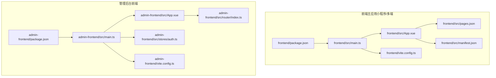
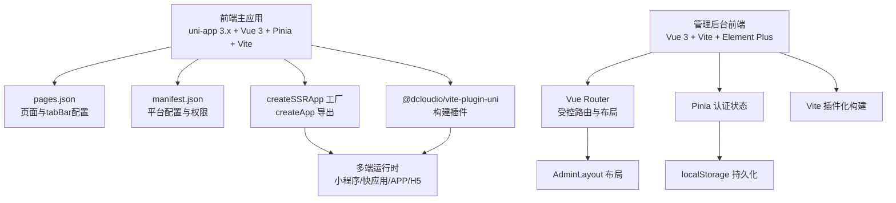
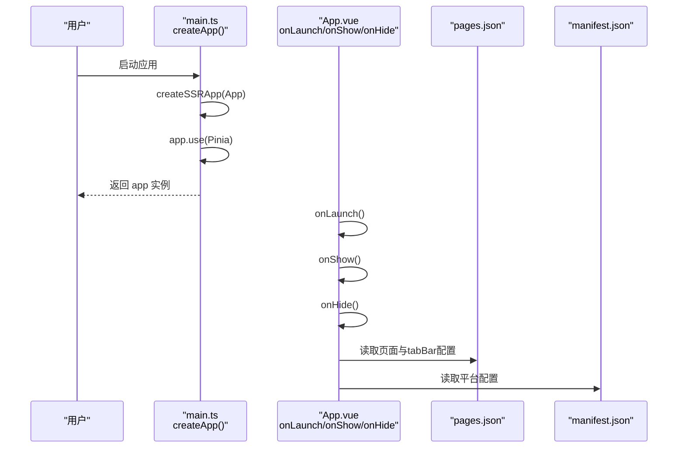
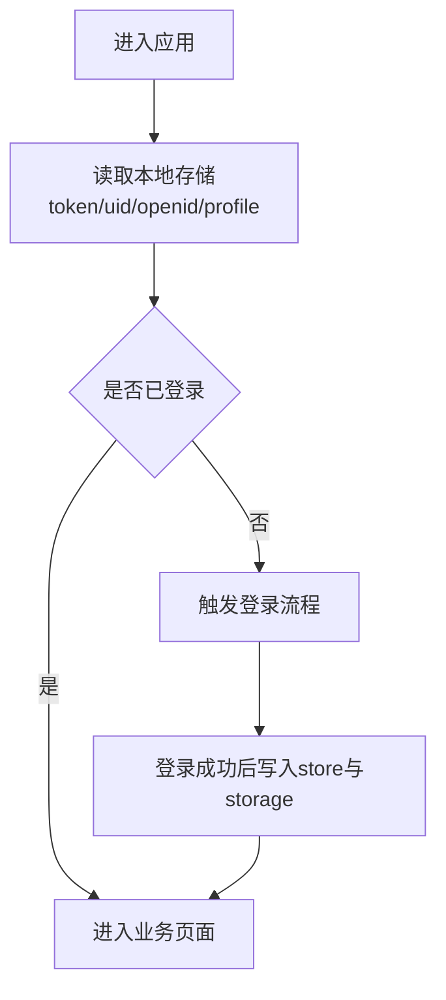
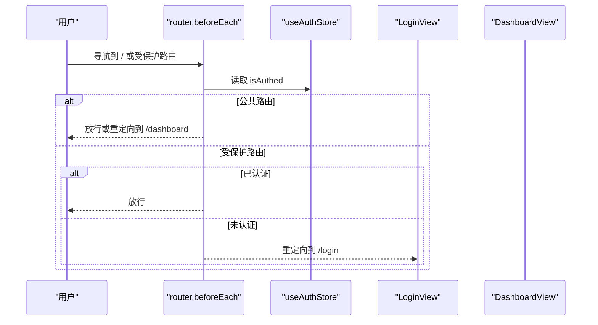
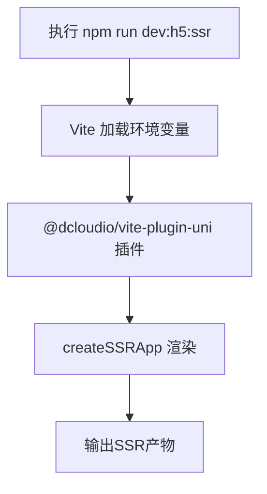
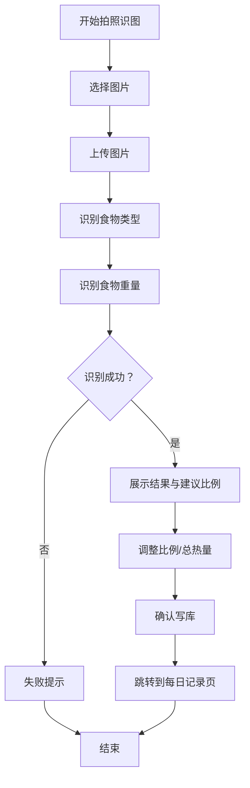
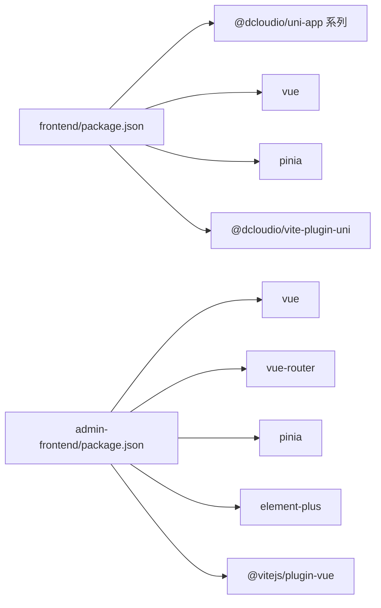

# uni-app框架介绍

<cite>
**本文引用的文件**
- [frontend/package.json](file://frontend/package.json)
- [frontend/src/main.ts](file://frontend/src/main.ts)
- [frontend/src/App.vue](file://frontend/src/App.vue)
- [frontend/src/manifest.json](file://frontend/src/manifest.json)
- [frontend/src/pages.json](file://frontend/src/pages.json)
- [frontend/vite.config.ts](file://frontend/vite.config.ts)
- [frontend/src/stores/user.ts](file://frontend/src/stores/user.ts)
- [frontend/src/composables/usePhotographFlow.ts](file://frontend/src/composables/usePhotographFlow.ts)
- [frontend/src/utils/date.ts](file://frontend/src/utils/date.ts)
- [admin-frontend/package.json](file://admin-frontend/package.json)
- [admin-frontend/src/main.ts](file://admin-frontend/src/main.ts)
- [admin-frontend/src/App.vue](file://admin-frontend/src/App.vue)
- [admin-frontend/vite.config.ts](file://admin-frontend/vite.config.ts)
- [admin-frontend/src/router/index.ts](file://admin-frontend/src/router/index.ts)
- [admin-frontend/src/stores/auth.ts](file://admin-frontend/src/stores/auth.ts)
</cite>

## 目录
1. [引言](#引言)
2. [项目结构](#项目结构)
3. [核心组件](#核心组件)
4. [架构总览](#架构总览)
5. [详细组件分析](#详细组件分析)
6. [依赖关系分析](#依赖关系分析)
7. [性能考量](#性能考量)
8. [故障排查指南](#故障排查指南)
9. [结论](#结论)
10. [附录](#附录)

## 引言
本文件面向希望在uni-app生态下进行跨平台前端开发的读者，系统梳理框架的核心概念、跨平台原理与优势，并结合仓库中的实际工程配置，给出应用入口与SSR构建流程、小程序前端与管理后台前端的实现差异、生命周期管理、插件系统与扩展机制、版本兼容性、性能特性与最佳实践，以及升级与常见问题解决方案。

## 项目结构
本仓库包含两个主要前端子项目：
- 前端主应用（小程序/多端）：位于 frontend 目录，采用 uni-app 3.x + Vue 3 + Pinia + Vite 插件化构建。
- 管理后台前端：位于 admin-frontend 目录，采用标准 Vue 3 + Vite + Element Plus 路由体系。

图表来源
- [frontend/src/main.ts:1-12](file://frontend/src/main.ts#L1-L12)
- [frontend/src/App.vue:1-77](file://frontend/src/App.vue#L1-L77)
- [frontend/src/pages.json:1-194](file://frontend/src/pages.json#L1-L194)
- [frontend/src/manifest.json:1-73](file://frontend/src/manifest.json#L1-L73)
- [frontend/vite.config.ts:1-23](file://frontend/vite.config.ts#L1-L23)
- [admin-frontend/src/main.ts:1-14](file://admin-frontend/src/main.ts#L1-L14)
- [admin-frontend/src/App.vue:1-4](file://admin-frontend/src/App.vue#L1-L4)
- [admin-frontend/src/router/index.ts:1-46](file://admin-frontend/src/router/index.ts#L1-L46)
- [admin-frontend/src/stores/auth.ts:1-29](file://admin-frontend/src/stores/auth.ts#L1-L29)
- [admin-frontend/vite.config.ts:1-8](file://admin-frontend/vite.config.ts#L1-L8)

章节来源
- [frontend/package.json:1-78](file://frontend/package.json#L1-L78)
- [frontend/src/main.ts:1-12](file://frontend/src/main.ts#L1-L12)
- [frontend/src/App.vue:1-77](file://frontend/src/App.vue#L1-L77)
- [frontend/src/pages.json:1-194](file://frontend/src/pages.json#L1-L194)
- [frontend/src/manifest.json:1-73](file://frontend/src/manifest.json#L1-L73)
- [frontend/vite.config.ts:1-23](file://frontend/vite.config.ts#L1-L23)
- [admin-frontend/package.json:1-27](file://admin-frontend/package.json#L1-L27)
- [admin-frontend/src/main.ts:1-14](file://admin-frontend/src/main.ts#L1-L14)
- [admin-frontend/src/App.vue:1-4](file://admin-frontend/src/App.vue#L1-L4)
- [admin-frontend/src/router/index.ts:1-46](file://admin-frontend/src/router/index.ts#L1-L46)
- [admin-frontend/src/stores/auth.ts:1-29](file://admin-frontend/src/stores/auth.ts#L1-L29)
- [admin-frontend/vite.config.ts:1-8](file://admin-frontend/vite.config.ts#L1-L8)

## 核心组件
- 应用入口与SSR
  - 前端主应用通过 createSSRApp 创建应用实例，挂载 Pinia 状态管理，导出 createApp 工厂函数以适配多端运行时。
  - 支持 H5 与多端开发与构建脚本，SSR 开发与构建命令在脚本中定义。
- 页面与导航
  - pages.json 定义页面列表、tabBar、全局导航样式与 easycom 组件扫描规则。
  - manifest.json 定义基础信息、版本、平台特有配置（如 app-plus、mp-weixin 等）。
- 状态管理
  - 前端主应用使用 Pinia 管理用户会话与持久化存储；管理后台使用 Pinia 管理登录态。
- 路由与布局
  - 管理后台使用 Vue Router + 布局组件 AdminLayout 实现受控访问与面包屑标题元信息。
- 构建与环境变量
  - 前端使用 @dcloudio/vite-plugin-uni 插件；通过 Vite 环境变量注入 API 基础地址，支持开发模式合并环境变量。

章节来源
- [frontend/src/main.ts:1-12](file://frontend/src/main.ts#L1-L12)
- [frontend/src/App.vue:10-28](file://frontend/src/App.vue#L10-L28)
- [frontend/src/pages.json:1-194](file://frontend/src/pages.json#L1-L194)
- [frontend/src/manifest.json:1-73](file://frontend/src/manifest.json#L1-L73)
- [frontend/src/stores/user.ts:1-104](file://frontend/src/stores/user.ts#L1-L104)
- [admin-frontend/src/router/index.ts:1-46](file://admin-frontend/src/router/index.ts#L1-L46)
- [admin-frontend/src/stores/auth.ts:1-29](file://admin-frontend/src/stores/auth.ts#L1-L29)
- [frontend/vite.config.ts:1-23](file://frontend/vite.config.ts#L1-L23)
- [admin-frontend/vite.config.ts:1-8](file://admin-frontend/vite.config.ts#L1-L8)

## 架构总览
uni-app 通过“一套代码、多端运行”的理念，基于 Vue 3 Composition API 与平台适配层，统一了小程序、App、H5 等多端的开发体验。前端主应用采用 uni-app 3.x 生态，管理后台采用标准 Vue 3 + Vite，两者在入口、路由、状态管理与构建工具链上存在差异。

图表来源
- [frontend/src/main.ts:1-12](file://frontend/src/main.ts#L1-L12)
- [frontend/src/pages.json:1-194](file://frontend/src/pages.json#L1-L194)
- [frontend/src/manifest.json:1-73](file://frontend/src/manifest.json#L1-L73)
- [frontend/vite.config.ts:1-23](file://frontend/vite.config.ts#L1-L23)
- [admin-frontend/src/main.ts:1-14](file://admin-frontend/src/main.ts#L1-L14)
- [admin-frontend/src/router/index.ts:1-46](file://admin-frontend/src/router/index.ts#L1-L46)
- [admin-frontend/src/stores/auth.ts:1-29](file://admin-frontend/src/stores/auth.ts#L1-L29)
- [admin-frontend/vite.config.ts:1-8](file://admin-frontend/vite.config.ts#L1-L8)

## 详细组件分析

### 生命周期与应用入口
- 入口工厂函数 createApp 返回应用实例与上下文，便于多端挂载与SSR渲染。
- App.vue 中注册 onLaunch/onShow/onHide 生命周期钩子，用于应用启动、显示与隐藏阶段的日志与初始化。
- 前端主应用通过 pages.json 定义页面与 tabBar，manifest.json 提供平台特定配置（如小程序 appid、权限等）。

图表来源
- [frontend/src/main.ts:1-12](file://frontend/src/main.ts#L1-L12)
- [frontend/src/App.vue:10-28](file://frontend/src/App.vue#L10-L28)
- [frontend/src/pages.json:1-194](file://frontend/src/pages.json#L1-L194)
- [frontend/src/manifest.json:1-73](file://frontend/src/manifest.json#L1-L73)

章节来源
- [frontend/src/main.ts:1-12](file://frontend/src/main.ts#L1-L12)
- [frontend/src/App.vue:10-28](file://frontend/src/App.vue#L10-L28)
- [frontend/src/pages.json:1-194](file://frontend/src/pages.json#L1-L194)
- [frontend/src/manifest.json:1-73](file://frontend/src/manifest.json#L1-L73)

### 页面与导航配置
- pages.json 中集中声明页面路径、标题、导航样式与背景色，以及 tabBar 列表与图标路径。
- easycom 规则可自动扫描与别名映射组件，减少显式导入成本。
- manifest.json 提供 app-plus 与各小程序平台的配置项，如权限、打包信息、SDK配置等。

章节来源
- [frontend/src/pages.json:1-194](file://frontend/src/pages.json#L1-L194)
- [frontend/src/manifest.json:1-73](file://frontend/src/manifest.json#L1-L73)

### 状态管理与会话持久化
- 前端主应用使用 Pinia 管理用户会话，封装 token、userId、openid、profileCompleted 等状态，并通过 uni 存储 API 实现跨端持久化。
- 管理后台使用 Pinia 管理管理员登录态，基于 localStorage 实现令牌与用户名持久化，配合路由守卫实现访问控制。

图表来源
- [frontend/src/stores/user.ts:26-104](file://frontend/src/stores/user.ts#L26-L104)
- [admin-frontend/src/stores/auth.ts:6-29](file://admin-frontend/src/stores/auth.ts#L6-L29)

章节来源
- [frontend/src/stores/user.ts:1-104](file://frontend/src/stores/user.ts#L1-L104)
- [admin-frontend/src/stores/auth.ts:1-29](file://admin-frontend/src/stores/auth.ts#L1-L29)

### 路由与布局（管理后台）
- 使用 Vue Router + 布局组件 AdminLayout 实现受控访问与面包屑标题元信息。
- 路由守卫根据 meta.public 与认证状态决定放行或重定向至登录页。

图表来源
- [admin-frontend/src/router/index.ts:35-43](file://admin-frontend/src/router/index.ts#L35-L43)
- [admin-frontend/src/stores/auth.ts:11-13](file://admin-frontend/src/stores/auth.ts#L11-L13)

章节来源
- [admin-frontend/src/router/index.ts:1-46](file://admin-frontend/src/router/index.ts#L1-L46)
- [admin-frontend/src/stores/auth.ts:1-29](file://admin-frontend/src/stores/auth.ts#L1-L29)

### SSR 应用创建流程
- 前端主应用通过 createSSRApp 创建应用实例，配合 Vite 与 @dcloudio/vite-plugin-uni 插件进行开发与构建。
- package.json 中提供 dev:h5:ssr 与 build:h5:ssr 脚本，用于启动与构建 SSR 场景。
- Vite 配置中通过 loadEnv 合并开发环境变量，注入 API 基础地址。

图表来源
- [frontend/package.json:10-10](file://frontend/package.json#L10-L10)
- [frontend/vite.config.ts:5-22](file://frontend/vite.config.ts#L5-L22)
- [frontend/src/main.ts:1-12](file://frontend/src/main.ts#L1-L12)

章节来源
- [frontend/package.json:10-10](file://frontend/package.json#L10-L10)
- [frontend/vite.config.ts:1-23](file://frontend/vite.config.ts#L1-L23)
- [frontend/src/main.ts:1-12](file://frontend/src/main.ts#L1-L12)

### 小程序前端与管理后台前端实现差异
- 技术栈差异
  - 小程序前端：uni-app 3.x + Vue 3 + Pinia + @dcloudio/vite-plugin-uni，页面与平台配置集中在 pages.json 与 manifest.json。
  - 管理后台前端：标准 Vue 3 + Vite + Element Plus，使用 Vue Router + 布局组件实现受控访问。
- 入口与挂载
  - 小程序前端：createSSRApp 工厂 + 多端运行时。
  - 管理后台前端：直接 createApp + mount。
- 路由与状态
  - 小程序前端：页面级导航与生命周期，Pinia 管理用户会话。
  - 管理后台前端：应用级路由守卫与认证状态管理。
- 构建工具
  - 小程序前端：@dcloudio/vite-plugin-uni 插件化构建。
  - 管理后台前端：@vitejs/plugin-vue 插件化构建。

章节来源
- [frontend/src/main.ts:1-12](file://frontend/src/main.ts#L1-L12)
- [frontend/src/pages.json:1-194](file://frontend/src/pages.json#L1-L194)
- [frontend/src/manifest.json:1-73](file://frontend/src/manifest.json#L1-L73)
- [admin-frontend/src/main.ts:1-14](file://admin-frontend/src/main.ts#L1-L14)
- [admin-frontend/src/router/index.ts:1-46](file://admin-frontend/src/router/index.ts#L1-L46)
- [admin-frontend/src/stores/auth.ts:1-29](file://admin-frontend/src/stores/auth.ts#L1-L29)
- [frontend/vite.config.ts:1-23](file://frontend/vite.config.ts#L1-L23)
- [admin-frontend/vite.config.ts:1-8](file://admin-frontend/vite.config.ts#L1-L8)

### 复杂业务流程示例：拍照识图流水线
- 流程概述
  - 图片选择 -> 上传 -> 识别类型 -> 识别重量 -> 结果展示与确认 -> 写库并跳转到记录页。
  - 支持 mock 流水线与真实后端调用，通过环境变量开关控制。
- 关键点
  - 使用 ref/computed 管理流程阶段与展示数据。
  - 通过定时器模拟阶段耗时，最终调用后端接口并处理异常。
  - 支持调整食用比例与总热量，按比例重分配每行食物的热量。

图表来源
- [frontend/src/composables/usePhotographFlow.ts:120-508](file://frontend/src/composables/usePhotographFlow.ts#L120-L508)

章节来源
- [frontend/src/composables/usePhotographFlow.ts:1-508](file://frontend/src/composables/usePhotographFlow.ts#L1-L508)
- [frontend/src/utils/date.ts:1-31](file://frontend/src/utils/date.ts#L1-L31)

## 依赖关系分析
- 前端主应用依赖
  - @dcloudio/uni-app、@dcloudio/uni-app-plus、@dcloudio/uni-h5 等多端运行时与组件库。
  - @dcloudio/vite-plugin-uni 构建插件。
  - pinia、vue、vue-i18n 等生态依赖。
- 管理后台依赖
  - vue、vue-router、pinia、element-plus 等。
  - @vitejs/plugin-vue 构建插件。

图表来源
- [frontend/package.json:42-76](file://frontend/package.json#L42-L76)
- [admin-frontend/package.json:11-25](file://admin-frontend/package.json#L11-L25)

章节来源
- [frontend/package.json:1-78](file://frontend/package.json#L1-L78)
- [admin-frontend/package.json:1-27](file://admin-frontend/package.json#L1-L27)

## 性能考量
- 构建与打包
  - 使用 Vite 与 @dcloudio/vite-plugin-uni，提升开发与构建效率；合理拆分页面与组件，避免不必要的全量重编译。
- 运行时优化
  - 使用 easycom 自动扫描与组件别名，减少重复导入开销。
  - 在业务流程中使用 ref/computed 管理状态，避免深层响应式对象带来的性能损耗。
- 网络与存储
  - 通过环境变量注入 API 基础地址，避免硬编码；在需要时使用本地存储减少重复请求。
- 图像处理
  - 拍照识图流程中对图片进行本地预处理与模拟耗时，确保用户体验与性能平衡。

[本节为通用指导，无需列出具体文件来源]

## 故障排查指南
- 真机调试与网络
  - App.vue 中打印 API 基础地址，检查是否为局域网 IP，避免使用旧缓存产物。
- 环境变量与构建
  - Vite 配置中合并开发环境变量，确保开发模式下正确加载 .env.* 文件。
- 登录与会话
  - 前端主应用与管理后台均使用 Pinia 管理会话，检查本地存储键值是否存在与格式是否正确。
- 路由守卫
  - 管理后台路由守卫根据 meta.public 与 isAuthed 控制访问，检查路由 meta 与 store 状态。
- 识别流程
  - 拍照识图流程中，若识别失败或未完成，检查后端返回状态与 toast 提示，必要时切换到 mock 流程定位问题。

章节来源
- [frontend/src/App.vue:15-18](file://frontend/src/App.vue#L15-L18)
- [frontend/vite.config.ts:10-13](file://frontend/vite.config.ts#L10-L13)
- [frontend/src/stores/user.ts:38-52](file://frontend/src/stores/user.ts#L38-L52)
- [admin-frontend/src/stores/auth.ts:15-26](file://admin-frontend/src/stores/auth.ts#L15-L26)
- [admin-frontend/src/router/index.ts:35-43](file://admin-frontend/src/router/index.ts#L35-L43)
- [frontend/src/composables/usePhotographFlow.ts:278-311](file://frontend/src/composables/usePhotographFlow.ts#L278-L311)

## 结论
本仓库展示了 uni-app 在多端场景下的典型实践：前端主应用通过 pages.json 与 manifest.json 管理页面与平台配置，借助 Pinia 与 Vite 插件实现高效开发；管理后台采用标准 Vue 3 + Vite + Element Plus，结合路由守卫与认证状态实现受控访问。通过合理的生命周期管理、状态持久化与构建配置，可在不同平台上获得一致的开发体验与良好的性能表现。

[本节为总结性内容，无需列出具体文件来源]

## 附录

### 版本兼容性与升级指南
- 框架版本
  - 前端主应用使用 @dcloudio/uni-app 系列 3.x 版本，对应 Vue 3 与 Vite 插件生态。
  - 管理后台使用 Vue 3 与 Vite，Element Plus 与 Vue Router。
- 升级建议
  - 前端主应用：优先升级 @dcloudio/vite-plugin-uni 与 @dcloudio/uni-app 系列版本，确保与当前 Vue 3 与 Vite 版本兼容。
  - 管理后台：同步升级 vue、vue-router、pinia、element-plus 与 @vitejs/plugin-vue，关注破坏性变更与迁移指南。
- 环境要求
  - 前端主应用 Node 版本要求 >= 20.12.2，确保构建工具链稳定运行。

章节来源
- [frontend/package.json:4-6](file://frontend/package.json#L4-L6)
- [frontend/package.json:42-76](file://frontend/package.json#L42-L76)
- [admin-frontend/package.json:1-27](file://admin-frontend/package.json#L1-L27)

### 最佳实践清单
- 页面与导航
  - 将页面与 tabBar 配置集中在 pages.json，统一管理导航样式与背景色。
  - 使用 easycom 自动扫描组件，减少显式导入。
- 平台配置
  - 在 manifest.json 中维护平台特有配置，如小程序 appid、权限与打包信息。
- 状态管理
  - 使用 Pinia 管理会话与业务状态，结合本地存储实现跨端持久化。
- 路由与安全
  - 管理后台使用路由守卫控制访问，公共路由与受保护路由明确区分。
- 构建与环境
  - 通过 Vite 环境变量注入 API 基础地址，开发模式下合并 .env.* 文件。
- 业务流程
  - 对复杂流程（如拍照识图）使用阶段化状态与模拟耗时，提升用户体验与可观测性。

[本节为通用指导，无需列出具体文件来源]