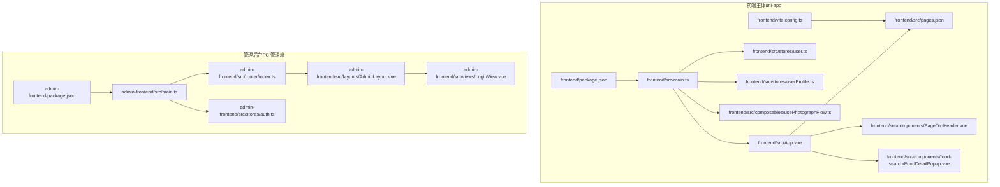
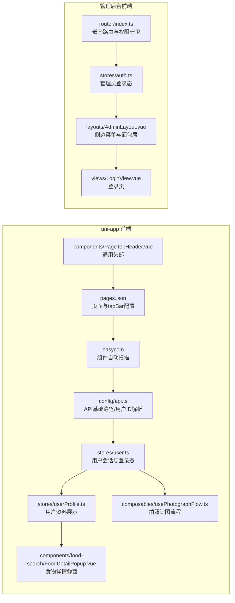
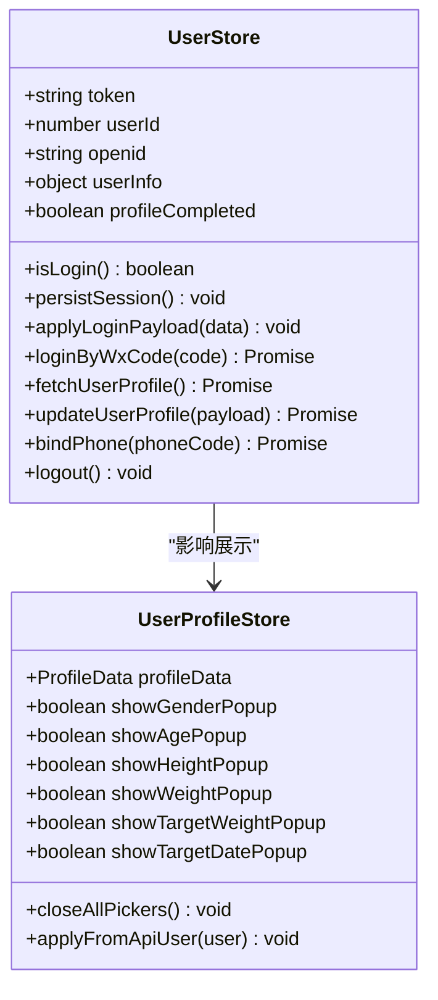
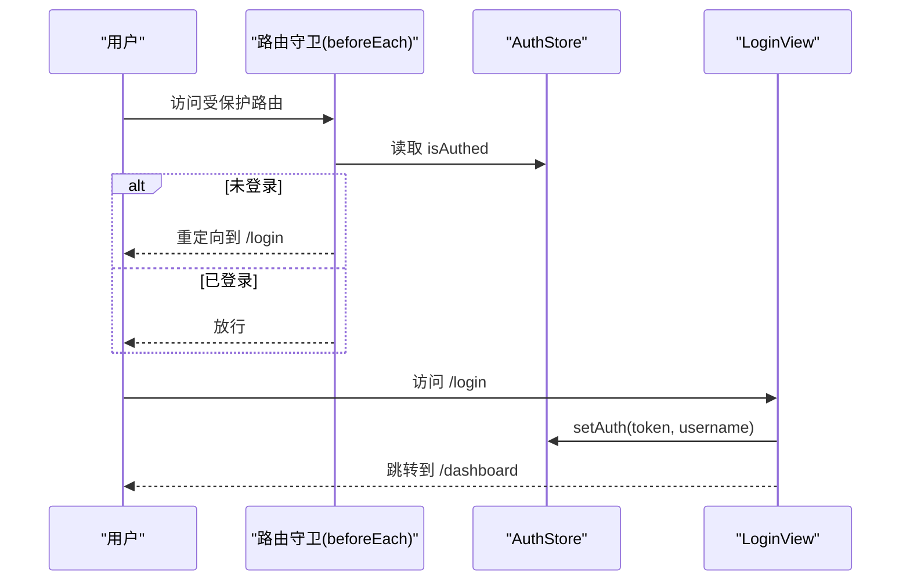
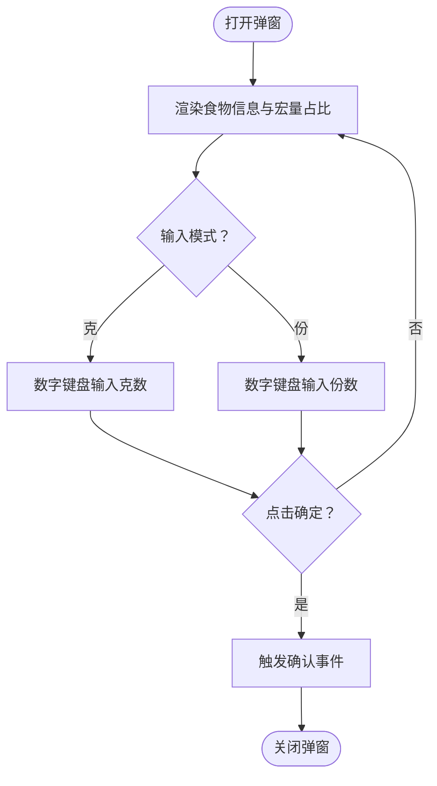
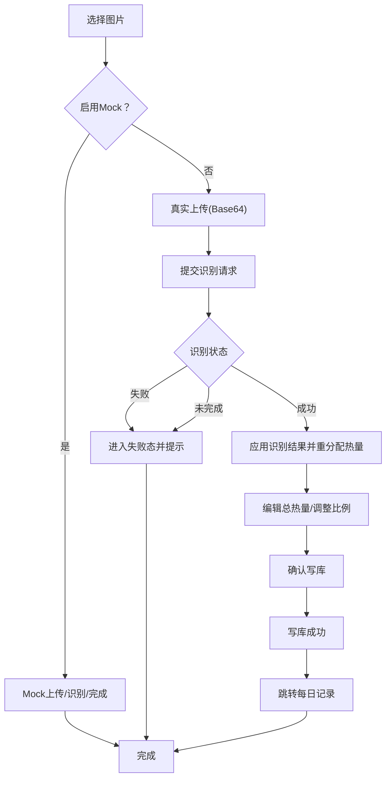
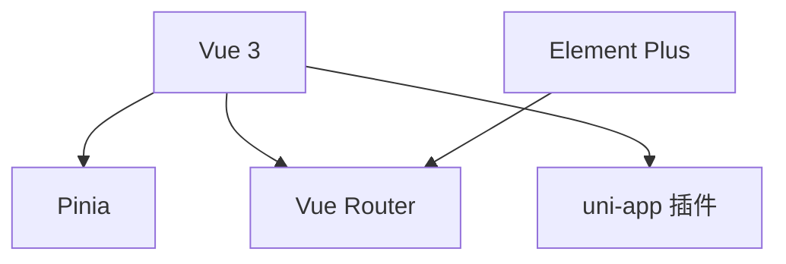

# 前端系统架构

<cite>
**本文引用的文件**
- [frontend/package.json](file://frontend/package.json)
- [admin-frontend/package.json](file://admin-frontend/package.json)
- [frontend/src/main.ts](file://frontend/src/main.ts)
- [admin-frontend/src/main.ts](file://admin-frontend/src/main.ts)
- [frontend/src/App.vue](file://frontend/src/App.vue)
- [frontend/src/pages.json](file://frontend/src/pages.json)
- [frontend/src/config/api.ts](file://frontend/src/config/api.ts)
- [frontend/src/stores/user.ts](file://frontend/src/stores/user.ts)
- [frontend/src/stores/userProfile.ts](file://frontend/src/stores/userProfile.ts)
- [admin-frontend/src/router/index.ts](file://admin-frontend/src/router/index.ts)
- [admin-frontend/src/stores/auth.ts](file://admin-frontend/src/stores/auth.ts)
- [admin-frontend/src/layouts/AdminLayout.vue](file://admin-frontend/src/layouts/AdminLayout.vue)
- [admin-frontend/src/views/LoginView.vue](file://admin-frontend/src/views/LoginView.vue)
- [frontend/src/components/PageTopHeader.vue](file://frontend/src/components/PageTopHeader.vue)
- [frontend/src/components/food-search/FoodDetailPopup.vue](file://frontend/src/components/food-search/FoodDetailPopup.vue)
- [frontend/src/composables/usePhotographFlow.ts](file://frontend/src/composables/usePhotographFlow.ts)
- [frontend/vite.config.ts](file://frontend/vite.config.ts)
</cite>

## 目录
1. [引言](#引言)
2. [项目结构](#项目结构)
3. [核心组件](#核心组件)
4. [架构总览](#架构总览)
5. [详细组件分析](#详细组件分析)
6. [依赖关系分析](#依赖关系分析)
7. [性能考虑](#性能考虑)
8. [故障排查指南](#故障排查指南)
9. [结论](#结论)
10. [附录](#附录)

## 引言
本架构文档面向前端系统，聚焦于 uni-app 前端与管理后台前端的统一设计与差异化实现。内容涵盖框架使用、组件架构、状态管理、路由配置、页面组织、组件通信模式、通用与业务组件划分、性能优化策略、构建与部署流程，以及组件开发最佳实践。读者可据此快速理解系统设计、定位问题并进行扩展。

## 项目结构
- 前端主体采用 uni-app 3.x，支持 H5 与多端小程序（含微信、百度、字节、快手、QQ、Harmony 等），通过统一的 src 目录与 pages.json 页面声明实现跨端一致性。
- 管理后台采用 Vue 3 + Vue Router + Pinia + Element Plus，提供后台管理界面与权限控制。
- 两套前端共享“组件化”理念：通用组件、业务组件、页面组件分层，配合 Pinia 状态管理与约定式路由，提升可维护性与复用性。

图表来源
- [frontend/package.json:1-78](file://frontend/package.json#L1-L78)
- [frontend/src/main.ts:1-12](file://frontend/src/main.ts#L1-L12)
- [frontend/src/App.vue:1-77](file://frontend/src/App.vue#L1-L77)
- [frontend/src/pages.json:1-194](file://frontend/src/pages.json#L1-L194)
- [frontend/src/stores/user.ts:1-104](file://frontend/src/stores/user.ts#L1-L104)
- [frontend/src/stores/userProfile.ts:1-109](file://frontend/src/stores/userProfile.ts#L1-L109)
- [frontend/src/composables/usePhotographFlow.ts:1-508](file://frontend/src/composables/usePhotographFlow.ts#L1-L508)
- [frontend/src/components/PageTopHeader.vue:1-95](file://frontend/src/components/PageTopHeader.vue#L1-L95)
- [frontend/src/components/food-search/FoodDetailPopup.vue:1-290](file://frontend/src/components/food-search/FoodDetailPopup.vue#L1-L290)
- [frontend/vite.config.ts:1-23](file://frontend/vite.config.ts#L1-L23)
- [admin-frontend/package.json:1-27](file://admin-frontend/package.json#L1-L27)
- [admin-frontend/src/main.ts:1-14](file://admin-frontend/src/main.ts#L1-L14)
- [admin-frontend/src/router/index.ts:1-46](file://admin-frontend/src/router/index.ts#L1-L46)
- [admin-frontend/src/stores/auth.ts:1-29](file://admin-frontend/src/stores/auth.ts#L1-L29)
- [admin-frontend/src/layouts/AdminLayout.vue:1-262](file://admin-frontend/src/layouts/AdminLayout.vue#L1-L262)
- [admin-frontend/src/views/LoginView.vue:1-148](file://admin-frontend/src/views/LoginView.vue#L1-L148)

章节来源
- [frontend/package.json:1-78](file://frontend/package.json#L1-L78)
- [admin-frontend/package.json:1-27](file://admin-frontend/package.json#L1-L27)

## 核心组件
- 应用入口与运行时
  - uni-app 前端：应用在入口函数中挂载 Pinia，随后由平台生命周期触发页面渲染与导航。
  - 管理后台：应用在入口中注册 Pinia、路由与 UI 组件库，随后挂载。
- 页面与布局
  - uni-app 使用 pages.json 声明页面与 tabBar，支持自定义头部样式与全局样式。
  - 管理后台使用 Vue Router 的嵌套路由与布局组件承载菜单与面包屑。
- 状态管理
  - uni-app 前端：Pinia Store 管理用户会话、用户资料展示等状态，并持久化至存储。
  - 管理后台：Pinia Store 管理管理员登录态与权限判断。
- 组合式逻辑
  - 拍照识图流程通过组合式函数集中处理上传、识别、编辑、确认与落库流程，便于测试与复用。

章节来源
- [frontend/src/main.ts:1-12](file://frontend/src/main.ts#L1-L12)
- [admin-frontend/src/main.ts:1-14](file://admin-frontend/src/main.ts#L1-L14)
- [frontend/src/pages.json:1-194](file://frontend/src/pages.json#L1-L194)
- [admin-frontend/src/router/index.ts:1-46](file://admin-frontend/src/router/index.ts#L1-L46)
- [frontend/src/stores/user.ts:1-104](file://frontend/src/stores/user.ts#L1-L104)
- [frontend/src/stores/userProfile.ts:1-109](file://frontend/src/stores/userProfile.ts#L1-L109)
- [admin-frontend/src/stores/auth.ts:1-29](file://admin-frontend/src/stores/auth.ts#L1-L29)
- [frontend/src/composables/usePhotographFlow.ts:1-508](file://frontend/src/composables/usePhotographFlow.ts#L1-L508)

## 架构总览
- uni-app 前端
  - 以 pages.json 为页面清单与导航配置中心，结合 easycom 自动扫描与别名映射，降低组件引入成本。
  - API 基础路径与用户 ID 解析通过配置模块集中管理，便于多端与环境切换。
  - 组件层分为通用组件（如顶部导航）、业务组件（如食物详情弹窗）、页面组件（如首页、我的）。
- 管理后台前端
  - 以 Vue Router 的嵌套路由与布局组件承载菜单导航与权限守卫，登录页与业务视图分离。
  - 权限守卫根据 meta.public 判断是否需要登录，未登录则重定向至登录页。
- 两者共性
  - 均采用 Pinia 管理状态；均通过组合式函数封装复杂流程；均强调组件复用与职责单一。
- 差异点
  - uni-app 前端更关注多端兼容与页面级导航；管理后台更关注权限与菜单体系。
  - uni-app 前端通过 App.vue 生命周期打印 API 基础地址，便于联调定位。

图表来源
- [frontend/src/pages.json:1-194](file://frontend/src/pages.json#L1-L194)
- [frontend/src/config/api.ts:1-42](file://frontend/src/config/api.ts#L1-L42)
- [frontend/src/stores/user.ts:1-104](file://frontend/src/stores/user.ts#L1-L104)
- [frontend/src/stores/userProfile.ts:1-109](file://frontend/src/stores/userProfile.ts#L1-L109)
- [frontend/src/composables/usePhotographFlow.ts:1-508](file://frontend/src/composables/usePhotographFlow.ts#L1-L508)
- [frontend/src/components/PageTopHeader.vue:1-95](file://frontend/src/components/PageTopHeader.vue#L1-L95)
- [frontend/src/components/food-search/FoodDetailPopup.vue:1-290](file://frontend/src/components/food-search/FoodDetailPopup.vue#L1-L290)
- [admin-frontend/src/router/index.ts:1-46](file://admin-frontend/src/router/index.ts#L1-L46)
- [admin-frontend/src/stores/auth.ts:1-29](file://admin-frontend/src/stores/auth.ts#L1-L29)
- [admin-frontend/src/layouts/AdminLayout.vue:1-262](file://admin-frontend/src/layouts/AdminLayout.vue#L1-L262)
- [admin-frontend/src/views/LoginView.vue:1-148](file://admin-frontend/src/views/LoginView.vue#L1-L148)

## 详细组件分析

### uni-app 前端：页面与导航
- 页面清单与样式
  - pages.json 定义页面路径、导航栏标题、背景色、tabBar 列表与图标等，支持全局样式与 easycom 组件别名映射，减少手动引入。
- 导航行为
  - 通用头部组件根据页面栈决定返回或切换 tab，确保多端一致的导航体验。
- 关键要点
  - 通过 pages.json 统一管理页面与 tab，避免分散配置带来的维护成本。
  - easycom 映射覆盖常用业务组件，提升开发效率。

章节来源
- [frontend/src/pages.json:1-194](file://frontend/src/pages.json#L1-L194)
- [frontend/src/components/PageTopHeader.vue:1-95](file://frontend/src/components/PageTopHeader.vue#L1-L95)

### uni-app 前端：状态管理（Pinia）
- 用户会话 Store
  - 管理 token、userId、openid、用户信息与 profileCompleted 等状态，并提供持久化与登录态判断。
  - 提供登录、更新资料、绑定手机、登出等动作方法。
- 用户资料展示 Store
  - 负责将后端用户资料映射为前端展示字段（如身高、体重、电话脱敏、统计指标等），并维护多个弹窗开关状态。
- 关键要点
  - 小程序环境使用 uni 存储 API 进行读写，非小程序环境降级处理。
  - getter 提供 isLogin 等便捷判断，简化模板逻辑。

图表来源
- [frontend/src/stores/user.ts:1-104](file://frontend/src/stores/user.ts#L1-L104)
- [frontend/src/stores/userProfile.ts:1-109](file://frontend/src/stores/userProfile.ts#L1-L109)

章节来源
- [frontend/src/stores/user.ts:1-104](file://frontend/src/stores/user.ts#L1-L104)
- [frontend/src/stores/userProfile.ts:1-109](file://frontend/src/stores/userProfile.ts#L1-L109)

### 管理后台前端：路由与权限
- 路由配置
  - 使用 Vue Router 创建路由实例，定义登录页与主布局下的子路由，设置 meta.title 用于面包屑显示。
- 权限守卫
  - 在 beforeEach 中根据 meta.public 判断是否允许访问；未登录用户访问受保护路由将重定向至登录页；已登录用户访问登录页将重定向至仪表盘。
- 布局与菜单
  - AdminLayout 提供侧边菜单、面包屑与顶部操作区，支持修改密码与退出登录。
- 登录视图
  - LoginView 负责管理员账号密码提交与消息提示，成功后写入登录态并跳转。

图表来源
- [admin-frontend/src/router/index.ts:1-46](file://admin-frontend/src/router/index.ts#L1-L46)
- [admin-frontend/src/stores/auth.ts:1-29](file://admin-frontend/src/stores/auth.ts#L1-L29)
- [admin-frontend/src/views/LoginView.vue:1-148](file://admin-frontend/src/views/LoginView.vue#L1-L148)

章节来源
- [admin-frontend/src/router/index.ts:1-46](file://admin-frontend/src/router/index.ts#L1-L46)
- [admin-frontend/src/stores/auth.ts:1-29](file://admin-frontend/src/stores/auth.ts#L1-L29)
- [admin-frontend/src/layouts/AdminLayout.vue:1-262](file://admin-frontend/src/layouts/AdminLayout.vue#L1-L262)
- [admin-frontend/src/views/LoginView.vue:1-148](file://admin-frontend/src/views/LoginView.vue#L1-L148)

### 业务组件：食物详情弹窗
- 功能特性
  - 展示食物名称、热量与宏量营养素占比；支持餐次选择、克/份切换、数字键盘输入与确认。
  - 图片加载错误回退与占位图处理；支持跳转 GI 值说明。
- 交互流程
  - 通过 emits 与父组件通信，传递关闭、餐次切换、确认等事件。
- 复杂度与性能
  - 计算属性用于动态计算标签文本与占比，避免重复计算；watch 监听食物变更重置图片错误标记。

图表来源
- [frontend/src/components/food-search/FoodDetailPopup.vue:1-290](file://frontend/src/components/food-search/FoodDetailPopup.vue#L1-L290)

章节来源
- [frontend/src/components/food-search/FoodDetailPopup.vue:1-290](file://frontend/src/components/food-search/FoodDetailPopup.vue#L1-L290)

### 组合式逻辑：拍照识图流程
- 流程阶段
  - 上传图片 → 识别类型 → 识别重量 → 成功/失败 → 编辑总热量/调整比例 → 写库确认 → 跳转每日记录。
- Mock 与真实流程
  - 通过环境变量控制是否启用 mock 管线；真实流程读取本地文件为 Base64 并调用后端接口。
- 关键能力
  - 按比例重分配多食物总热量；根据推荐比例限制调整范围；失败时提示与回退。
- 性能与健壮性
  - 使用定时器队列管理阶段延时，统一清理；异常捕获后进入失败态并提示。

图表来源
- [frontend/src/composables/usePhotographFlow.ts:1-508](file://frontend/src/composables/usePhotographFlow.ts#L1-L508)

章节来源
- [frontend/src/composables/usePhotographFlow.ts:1-508](file://frontend/src/composables/usePhotographFlow.ts#L1-L508)

### 组件化设计理念
- 通用组件
  - PageTopHeader：统一的页面头部，支持返回与胶囊按钮，适合跨页面复用。
- 业务组件
  - FoodDetailPopup：面向“食物搜索/记录”的高内聚组件，负责输入与确认。
  - Photograph 系列组件：围绕拍照识图的卡片、面板与弹层，职责清晰。
- 页面组件
  - 通过 pages.json 声明页面路径与样式，页面内部组合通用与业务组件，保持页面逻辑简洁。
- 组件通信
  - 通过 props 传参、emits 事件与 Pinia 状态共享实现松耦合通信。

章节来源
- [frontend/src/components/PageTopHeader.vue:1-95](file://frontend/src/components/PageTopHeader.vue#L1-L95)
- [frontend/src/components/food-search/FoodDetailPopup.vue:1-290](file://frontend/src/components/food-search/FoodDetailPopup.vue#L1-L290)
- [frontend/src/pages.json:1-194](file://frontend/src/pages.json#L1-L194)

## 依赖关系分析
- 依赖分层
  - 基础层：Vue 3、Pinia、uni-app 插件与多端适配。
  - 业务层：API 配置、Store、组合式逻辑与组件。
  - 视图层：页面与布局组件。
- 关键依赖
  - uni-app 与多端插件：统一多端构建与运行。
  - Element Plus：管理后台 UI 基础。
  - Vue Router：前后端路由与权限控制。
- 耦合与内聚
  - Store 与 API 配置解耦，通过工具函数与适配器对接；组件通过 emits 与父组件通信，避免直接依赖具体页面。

图表来源
- [frontend/package.json:42-61](file://frontend/package.json#L42-L61)
- [admin-frontend/package.json:11-16](file://admin-frontend/package.json#L11-L16)

章节来源
- [frontend/package.json:1-78](file://frontend/package.json#L1-L78)
- [admin-frontend/package.json:1-27](file://admin-frontend/package.json#L1-L27)

## 性能考虑
- 组件懒加载与按需引入
  - 通过 easycom 与按需导入减少首屏体积；避免在 App.vue 中引入过多重型组件。
- 状态持久化与缓存
  - 用户会话与关键状态持久化至存储，减少重复请求；Profile Store 仅维护展示态，避免冗余计算。
- 图片与资源
  - 食物图片加载失败回退至占位图；建议对静态资源进行压缩与尺寸裁剪。
- 构建优化
  - Vite 与 uni 插件配合，按需打包；生产环境开启压缩与 Tree Shaking。
- 运行时优化
  - 组合式函数中使用计算属性与防抖/节流（如键盘输入）；及时清理定时器与事件监听。

## 故障排查指南
- 登录与权限
  - 管理后台：检查路由守卫是否正确拦截未登录访问；确认 AuthStore 是否写入 token 与用户名。
  - uni-app 前端：检查用户会话 Store 是否持久化成功；确认 resolveUserId 是否返回预期值。
- API 地址与路径
  - 检查 API 基础路径与路径前缀配置，确保与后端一致；开发环境可通过 Vite 环境变量覆盖。
- 多端调试
  - 在 App.vue 生命周期中查看 API 基础地址输出，确认联调时使用正确的局域网 IP。
- 拍照识图
  - 若识别失败，检查 mock 开关与网络请求；确认 Base64 转换与参数拼装正确；查看失败提示与阶段状态。

章节来源
- [admin-frontend/src/router/index.ts:35-43](file://admin-frontend/src/router/index.ts#L35-L43)
- [admin-frontend/src/stores/auth.ts:14-26](file://admin-frontend/src/stores/auth.ts#L14-L26)
- [frontend/src/stores/user.ts:38-52](file://frontend/src/stores/user.ts#L38-L52)
- [frontend/src/config/api.ts:1-42](file://frontend/src/config/api.ts#L1-L42)
- [frontend/src/App.vue:15-18](file://frontend/src/App.vue#L15-L18)
- [frontend/src/composables/usePhotographFlow.ts:256-332](file://frontend/src/composables/usePhotographFlow.ts#L256-L332)

## 结论
本项目在 uni-app 与管理后台两端实现了统一的状态管理与组件化设计，通过 pages.json 与 Vue Router 的约定式配置，结合 Pinia 与组合式函数，提升了可维护性与扩展性。建议在后续迭代中持续完善组件文档、补充单元测试与端到端测试，并进一步优化资源加载与状态持久化策略。

## 附录
- 构建与部署
  - 前端主体：使用 uni 命令与脚本进行多端构建与预览；Vite 配置合并环境变量，确保 API 地址正确注入。
  - 管理后台：使用 Vite + Vue Router + Pinia 构建，支持本地开发与生产打包。
- 组件开发最佳实践
  - 保持组件单一职责；通过 props 与 emits 明确接口；使用计算属性与缓存减少重复计算；在组合式函数中集中处理复杂流程；为关键状态提供持久化与降级处理。

章节来源
- [frontend/package.json:7-40](file://frontend/package.json#L7-L40)
- [admin-frontend/package.json:6-10](file://admin-frontend/package.json#L6-L10)
- [frontend/vite.config.ts:1-23](file://frontend/vite.config.ts#L1-L23)