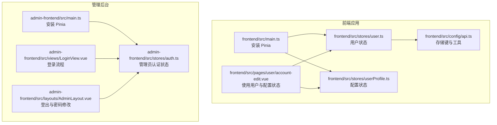
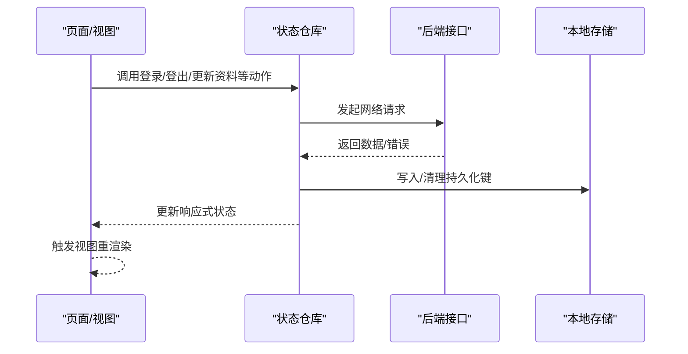
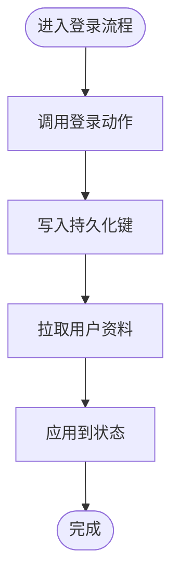
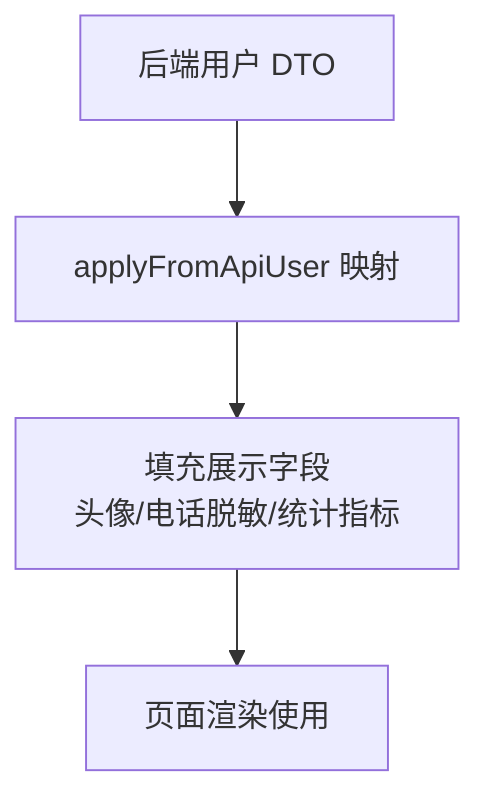
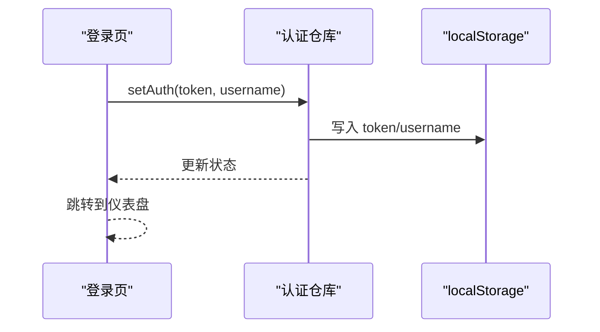
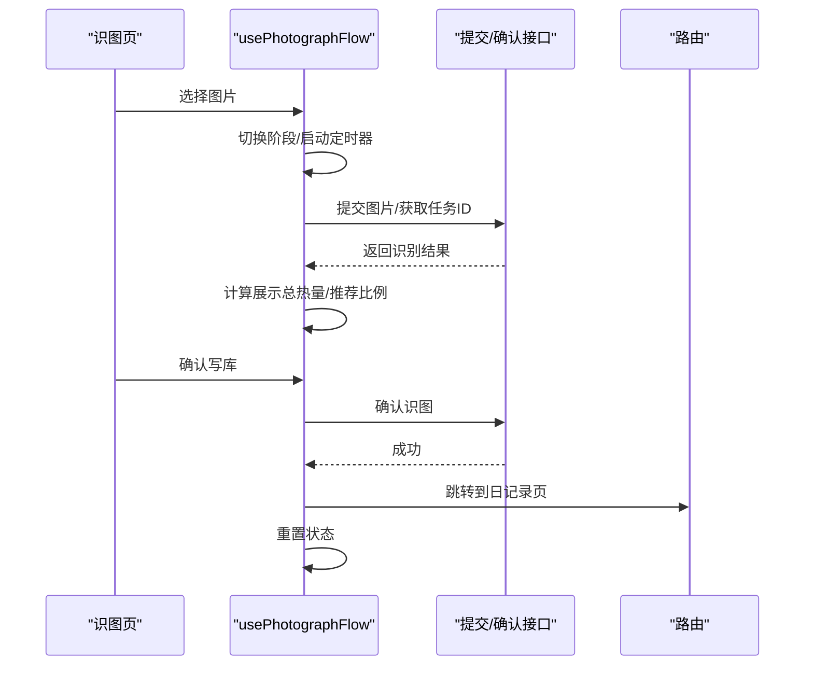
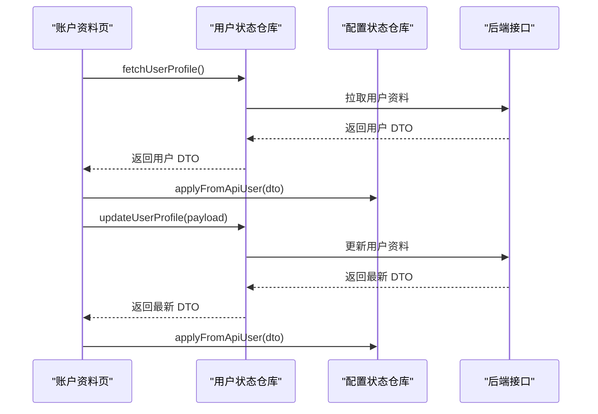
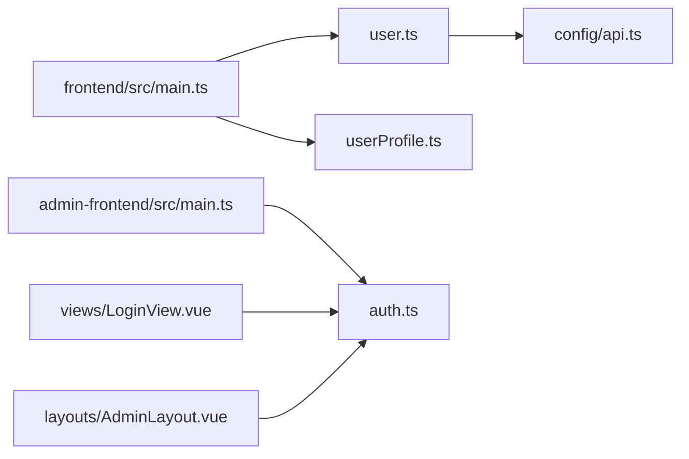

# 状态管理方案

<cite>
**本文引用的文件**
- [frontend/src/stores/user.ts](file://frontend/src/stores/user.ts)
- [frontend/src/stores/userProfile.ts](file://frontend/src/stores/userProfile.ts)
- [admin-frontend/src/stores/auth.ts](file://admin-frontend/src/stores/auth.ts)
- [frontend/src/main.ts](file://frontend/src/main.ts)
- [admin-frontend/src/main.ts](file://admin-frontend/src/main.ts)
- [frontend/src/config/api.ts](file://frontend/src/config/api.ts)
- [frontend/src/pages/user/account-edit.vue](file://frontend/src/pages/user/account-edit.vue)
- [admin-frontend/src/views/LoginView.vue](file://admin-frontend/src/views/LoginView.vue)
- [admin-frontend/src/layouts/AdminLayout.vue](file://admin-frontend/src/layouts/AdminLayout.vue)
- [frontend/src/composables/usePhotographFlow.ts](file://frontend/src/composables/usePhotographFlow.ts)
</cite>

## 目录
1. [简介](#简介)
2. [项目结构](#项目结构)
3. [核心组件](#核心组件)
4. [架构总览](#架构总览)
5. [详细组件分析](#详细组件分析)
6. [依赖分析](#依赖分析)
7. [性能考虑](#性能考虑)
8. [故障排查指南](#故障排查指南)
9. [结论](#结论)
10. [附录](#附录)

## 简介
本方案围绕 Pinia 在前端与管理后台中的状态管理实践展开，系统性阐述用户状态、配置状态与业务状态的管理策略，结合组合式 API 的使用模式与响应式数据管理，解释状态持久化、状态同步与状态重置机制，并提供最佳实践、性能优化与调试技巧，以及状态架构设计指南与团队协作规范。

## 项目结构
- 前端应用通过在应用入口安装 Pinia，统一注册全局状态仓库。
- 管理后台同样通过入口安装 Pinia，并在页面与布局中按需使用状态仓库。
- 状态仓库分为三类：
  - 用户状态：登录态、用户标识、微信 openid、资料完成标记等。
  - 配置状态：用户资料展示模型与弹窗显隐控制。
  - 管理后台认证状态：管理员 token 与用户名。

**图表来源**
- [frontend/src/main.ts:1-12](file://frontend/src/main.ts#L1-L12)
- [admin-frontend/src/main.ts:1-14](file://admin-frontend/src/main.ts#L1-L14)
- [frontend/src/stores/user.ts:1-104](file://frontend/src/stores/user.ts#L1-L104)
- [frontend/src/stores/userProfile.ts:1-109](file://frontend/src/stores/userProfile.ts#L1-L109)
- [frontend/src/config/api.ts:1-42](file://frontend/src/config/api.ts#L1-L42)
- [frontend/src/pages/user/account-edit.vue:1-520](file://frontend/src/pages/user/account-edit.vue#L1-L520)
- [admin-frontend/src/stores/auth.ts:1-29](file://admin-frontend/src/stores/auth.ts#L1-L29)
- [admin-frontend/src/views/LoginView.vue:1-148](file://admin-frontend/src/views/LoginView.vue#L1-L148)
- [admin-frontend/src/layouts/AdminLayout.vue:1-262](file://admin-frontend/src/layouts/AdminLayout.vue#L1-L262)

**章节来源**
- [frontend/src/main.ts:1-12](file://frontend/src/main.ts#L1-L12)
- [admin-frontend/src/main.ts:1-14](file://admin-frontend/src/main.ts#L1-L14)

## 核心组件
- 用户状态仓库（前端）
  - 负责登录态、用户标识、openid、资料完成标记的持久化与同步。
  - 提供登录、资料拉取、资料更新、手机绑定、登出等动作。
  - 使用本地存储键进行持久化，确保跨页签重启后状态可用。
- 配置状态仓库（前端）
  - 维护用户资料展示模型与弹窗显隐控制。
  - 提供从后端用户 DTO 映射到展示字段的方法，处理头像、电话脱敏、统计指标等。
- 管理后台认证仓库（管理后台）
  - 维护管理员 token 与用户名，提供设置与登出方法。
  - 使用浏览器本地存储实现轻量持久化。

**章节来源**
- [frontend/src/stores/user.ts:26-104](file://frontend/src/stores/user.ts#L26-L104)
- [frontend/src/stores/userProfile.ts:26-109](file://frontend/src/stores/userProfile.ts#L26-L109)
- [admin-frontend/src/stores/auth.ts:6-29](file://admin-frontend/src/stores/auth.ts#L6-L29)

## 架构总览
- 入口安装：前后端均在应用入口安装 Pinia，保证全局状态可用。
- 状态划分：用户状态与配置状态在前端解耦，便于职责清晰与维护。
- 认证流程：前端通过用户状态仓库完成微信登录与资料同步；管理后台通过认证仓库完成管理员登录与登出。
- 组合式 API：在页面与组合函数中使用状态仓库，配合计算属性与响应式 ref 实现高效渲染。

**图表来源**
- [frontend/src/stores/user.ts:37-101](file://frontend/src/stores/user.ts#L37-L101)
- [frontend/src/stores/userProfile.ts:50-106](file://frontend/src/stores/userProfile.ts#L50-L106)
- [admin-frontend/src/stores/auth.ts:14-26](file://admin-frontend/src/stores/auth.ts#L14-L26)

## 详细组件分析

### 用户状态仓库（前端）
- 状态字段
  - token、userId、openid、userInfo、profileCompleted
- 关键能力
  - 持久化：登录后写入本地存储键，重启后恢复
  - 登录：通过微信 code 获取登录结果并应用到状态
  - 资料同步：拉取用户资料并映射到状态
  - 资料更新：提交更新并刷新状态
  - 手机绑定：通过 code 绑定手机号并刷新资料
  - 登出：清空状态并移除本地存储键
- 复杂度与性能
  - 状态读写均为 O(1)，持久化采用同步存储 API，避免异步阻塞
  - 登录与资料更新为 IO 密集型，建议在页面生命周期中按需触发

**图表来源**
- [frontend/src/stores/user.ts:45-72](file://frontend/src/stores/user.ts#L45-L72)

**章节来源**
- [frontend/src/stores/user.ts:26-104](file://frontend/src/stores/user.ts#L26-L104)

### 配置状态仓库（前端）
- 数据模型
  - 包含头像、昵称、性别、年龄、身高、当前体重、目标体重、目标日期、电话脱敏、统计指标等
- 关键能力
  - 关闭所有弹窗：统一控制展示状态
  - 从用户 DTO 应用：将后端数据映射为展示字段，处理单位换算与脱敏显示
- 性能与复杂度
  - 映射逻辑为线性遍历与简单计算，O(n) 处理单条记录
  - 展示字段与业务字段分离，降低页面渲染耦合

**图表来源**
- [frontend/src/stores/userProfile.ts:60-106](file://frontend/src/stores/userProfile.ts#L60-L106)

**章节来源**
- [frontend/src/stores/userProfile.ts:26-109](file://frontend/src/stores/userProfile.ts#L26-L109)

### 管理后台认证仓库（管理后台）
- 状态字段
  - token、username
- 关键能力
  - 设置认证：写入本地存储并更新状态
  - 登出：清空状态并移除本地存储键
- 使用场景
  - 登录页提交表单后设置 token 与用户名
  - 顶部导航点击退出登录时清空状态并跳转登录页

**图表来源**
- [admin-frontend/src/views/LoginView.vue:16-28](file://admin-frontend/src/views/LoginView.vue#L16-L28)
- [admin-frontend/src/stores/auth.ts:14-20](file://admin-frontend/src/stores/auth.ts#L14-L20)

**章节来源**
- [admin-frontend/src/stores/auth.ts:6-29](file://admin-frontend/src/stores/auth.ts#L6-L29)
- [admin-frontend/src/views/LoginView.vue:16-28](file://admin-frontend/src/views/LoginView.vue#L16-L28)
- [admin-frontend/src/layouts/AdminLayout.vue:73-76](file://admin-frontend/src/layouts/AdminLayout.vue#L73-L76)

### 组合式 API 与业务状态（识图流程）
- 业务状态
  - 识图流程包含阶段状态、预览图、餐次类型、识别结果、任务 ID、记录日期、展示总热量、编辑草稿、推荐比例等
- 关键流程
  - 图片选择：根据是否启用 mock 决定真实请求或本地动画
  - 上传与识别：分阶段推进，展示进度与提示
  - 结果确认：按推荐比例调整后写入后端，成功后跳转到日记录页
- 响应式与副作用
  - 使用 ref/computed 管理 UI 状态与计算属性
  - 使用定时器队列管理阶段切换，组件卸载时清理定时器

**图表来源**
- [frontend/src/composables/usePhotographFlow.ts:256-440](file://frontend/src/composables/usePhotographFlow.ts#L256-L440)

**章节来源**
- [frontend/src/composables/usePhotographFlow.ts:120-508](file://frontend/src/composables/usePhotographFlow.ts#L120-L508)

### 页面使用示例（用户资料页）
- 页面职责
  - 在页面显示与编辑用户资料，必要时从用户状态仓库拉取最新资料
  - 将用户 DTO 映射到配置状态仓库用于展示
  - 提交更新后刷新配置状态并提示
- 状态交互
  - 使用用户状态仓库进行登录态判断与资料拉取
  - 使用配置状态仓库进行展示字段映射与弹窗控制

**图表来源**
- [frontend/src/pages/user/account-edit.vue:173-185](file://frontend/src/pages/user/account-edit.vue#L173-L185)
- [frontend/src/pages/user/account-edit.vue:297-383](file://frontend/src/pages/user/account-edit.vue#L297-L383)
- [frontend/src/stores/user.ts:67-79](file://frontend/src/stores/user.ts#L67-L79)
- [frontend/src/stores/userProfile.ts:60-106](file://frontend/src/stores/userProfile.ts#L60-L106)

**章节来源**
- [frontend/src/pages/user/account-edit.vue:118-383](file://frontend/src/pages/user/account-edit.vue#L118-L383)
- [frontend/src/stores/user.ts:67-79](file://frontend/src/stores/user.ts#L67-L79)
- [frontend/src/stores/userProfile.ts:60-106](file://frontend/src/stores/userProfile.ts#L60-L106)

## 依赖分析
- 入口依赖
  - 前端与管理后台均在入口文件安装 Pinia，作为全局状态容器
- 仓库依赖
  - 用户状态仓库依赖本地存储键与后端接口
  - 配置状态仓库依赖后端接口与展示常量
  - 管理后台认证仓库依赖浏览器本地存储
- 页面依赖
  - 页面通过组合式 API 使用状态仓库，实现解耦与复用

**图表来源**
- [frontend/src/main.ts:1-12](file://frontend/src/main.ts#L1-L12)
- [admin-frontend/src/main.ts:1-14](file://admin-frontend/src/main.ts#L1-L14)
- [frontend/src/stores/user.ts:1-10](file://frontend/src/stores/user.ts#L1-L10)
- [frontend/src/config/api.ts:23-28](file://frontend/src/config/api.ts#L23-L28)
- [admin-frontend/src/stores/auth.ts:3-4](file://admin-frontend/src/stores/auth.ts#L3-L4)

**章节来源**
- [frontend/src/main.ts:1-12](file://frontend/src/main.ts#L1-L12)
- [admin-frontend/src/main.ts:1-14](file://admin-frontend/src/main.ts#L1-L14)
- [frontend/src/stores/user.ts:1-10](file://frontend/src/stores/user.ts#L1-L10)
- [frontend/src/config/api.ts:23-28](file://frontend/src/config/api.ts#L23-L28)
- [admin-frontend/src/stores/auth.ts:3-4](file://admin-frontend/src/stores/auth.ts#L3-L4)

## 性能考虑
- 状态粒度
  - 将用户状态与展示状态拆分，避免 UI 状态污染业务状态
- 持久化策略
  - 登录态与用户标识使用同步存储写入，减少异步开销
  - 仅持久化必要字段，避免存储过大对象
- 请求与渲染
  - 在页面生命周期中按需拉取资料，避免重复请求
  - 使用计算属性缓存派生数据，减少重复计算
- 业务流程
  - 识图流程使用阶段化与定时器队列，避免阻塞主线程
  - 成功后及时清理定时器，防止内存泄漏

[本节为通用指导，无需列出具体文件来源]

## 故障排查指南
- 登录失败
  - 检查登录动作是否正确写入持久化键
  - 核对后端返回的数据结构与应用逻辑
- 资料未更新
  - 确认更新动作是否返回最新 DTO 并调用应用方法
  - 检查页面是否在 onShow 生命周期中刷新资料
- 识图流程异常
  - 开启 mock 流程验证 UI 逻辑，再切换真实请求
  - 检查任务 ID 是否为空、推荐比例是否为 0
- 管理后台登出无效
  - 确认登出动作是否移除了本地存储键并跳转登录页

**章节来源**
- [frontend/src/stores/user.ts:87-101](file://frontend/src/stores/user.ts#L87-L101)
- [frontend/src/pages/user/account-edit.vue:173-185](file://frontend/src/pages/user/account-edit.vue#L173-L185)
- [frontend/src/composables/usePhotographFlow.ts:394-440](file://frontend/src/composables/usePhotographFlow.ts#L394-L440)
- [admin-frontend/src/layouts/AdminLayout.vue:73-76](file://admin-frontend/src/layouts/AdminLayout.vue#L73-L76)

## 结论
本方案通过 Pinia 对用户状态、配置状态与管理后台认证状态进行清晰划分，结合组合式 API 与响应式数据管理，实现了登录态持久化、资料同步与业务流程的稳定运行。遵循本文的最佳实践与性能优化建议，可在保证开发效率的同时提升系统的可维护性与用户体验。

[本节为总结性内容，无需列出具体文件来源]

## 附录

### 状态管理最佳实践
- 状态拆分
  - 用户态与展示态分离，避免 UI 状态污染业务状态
- 持久化最小化
  - 仅持久化必要字段，如 token、用户标识、openid、资料完成标记
- 动作幂等
  - 登录、更新资料等动作应具备幂等性，避免重复写入
- 错误处理
  - 在动作中捕获错误并反馈给用户，同时保持状态一致性

[本节为通用指导，无需列出具体文件来源]

### 团队协作规范
- 文件命名与目录
  - 状态仓库统一放置于 stores 目录，按功能命名
- 提交规范
  - 修改状态相关逻辑时，同步更新页面使用示例与注释
- 审查要点
  - 关注持久化键的一致性、动作的错误处理与 UI 的回滚

[本节为通用指导，无需列出具体文件来源]