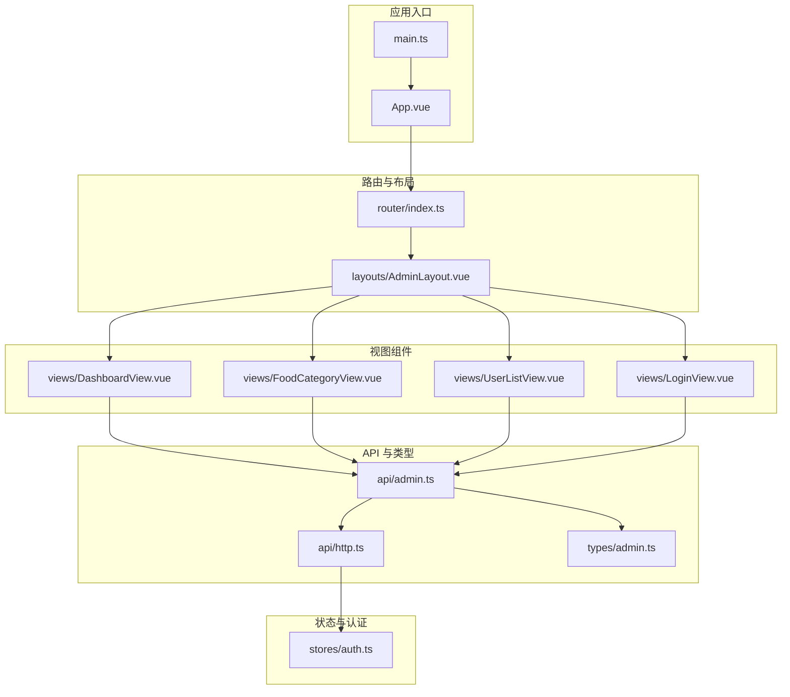
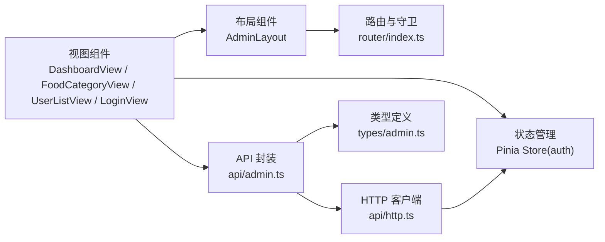
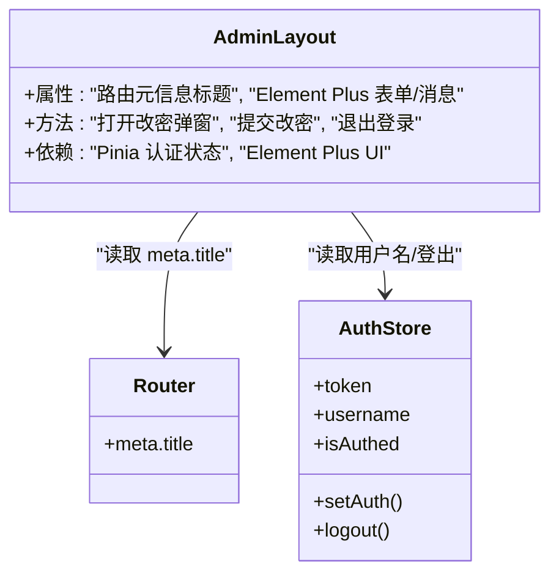
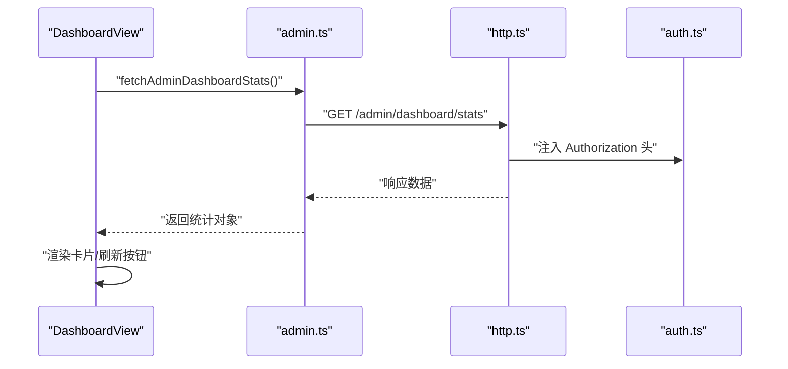
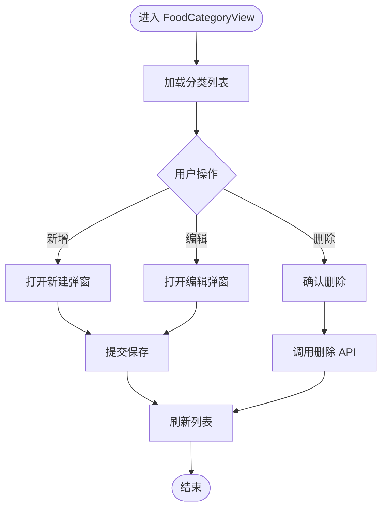
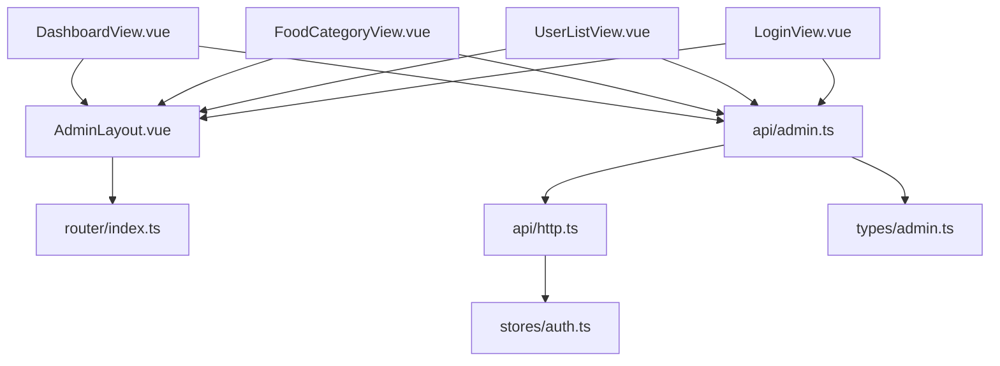

# 组件架构设计

<cite>
**本文引用的文件**
- [App.vue](file://admin-frontend/src/App.vue)
- [main.ts](file://admin-frontend/src/main.ts)
- [HelloWorld.vue](file://admin-frontend/src/components/HelloWorld.vue)
- [AdminLayout.vue](file://admin-frontend/src/layouts/AdminLayout.vue)
- [index.ts（路由）](file://admin-frontend/src/router/index.ts)
- [auth.ts（Pinia Store）](file://admin-frontend/src/stores/auth.ts)
- [DashboardView.vue](file://admin-frontend/src/views/DashboardView.vue)
- [FoodCategoryView.vue](file://admin-frontend/src/views/FoodCategoryView.vue)
- [UserListView.vue](file://admin-frontend/src/views/UserListView.vue)
- [LoginView.vue](file://admin-frontend/src/views/LoginView.vue)
- [admin.ts（API 封装）](file://admin-frontend/src/api/admin.ts)
- [http.ts（HTTP 客户端）](file://admin-frontend/src/api/http.ts)
- [admin.ts（类型定义）](file://admin-frontend/src/types/admin.ts)
- [package.json](file://admin-frontend/package.json)
- [vite.config.ts](file://admin-frontend/vite.config.ts)
</cite>

## 目录
1. [引言](#引言)
2. [项目结构](#项目结构)
3. [核心组件](#核心组件)
4. [架构总览](#架构总览)
5. [组件详细分析](#组件详细分析)
6. [依赖关系分析](#依赖关系分析)
7. [性能考虑](#性能考虑)
8. [故障排查指南](#故障排查指南)
9. [结论](#结论)
10. [附录](#附录)

## 引言
本文件面向组件化架构设计，系统性阐述本项目的分层架构、组件职责划分、组件间通信机制、复用策略与封装原则、命名规范、开发规范、样式管理与性能优化，并提供可落地的设计模式与重构建议。通过 Admin 后台前端工程的实际代码进行分析，帮助开发者在保持一致性的同时提升可维护性与扩展性。

## 项目结构
项目采用“视图层 + 布局层 + 组件层 + 状态与路由 + API 层”的分层组织方式，结合 Vue 3 + Pinia + Element Plus + Vite 的技术栈，形成清晰的职责边界与可测试性。

图表来源
- [App.vue:1-4](file://admin-frontend/src/App.vue#L1-L4)
- [main.ts:1-14](file://admin-frontend/src/main.ts#L1-L14)
- [index.ts（路由）:1-46](file://admin-frontend/src/router/index.ts#L1-L46)
- [AdminLayout.vue:1-262](file://admin-frontend/src/layouts/AdminLayout.vue#L1-L262)
- [DashboardView.vue:1-175](file://admin-frontend/src/views/DashboardView.vue#L1-L175)
- [FoodCategoryView.vue:1-108](file://admin-frontend/src/views/FoodCategoryView.vue#L1-L108)
- [UserListView.vue:1-67](file://admin-frontend/src/views/UserListView.vue#L1-L67)
- [LoginView.vue:1-148](file://admin-frontend/src/views/LoginView.vue#L1-L148)
- [auth.ts（Pinia Store）:1-29](file://admin-frontend/src/stores/auth.ts#L1-L29)
- [admin.ts（API 封装）:1-85](file://admin-frontend/src/api/admin.ts#L1-L85)
- [http.ts（HTTP 客户端）:1-31](file://admin-frontend/src/api/http.ts#L1-L31)
- [admin.ts（类型定义）:1-82](file://admin-frontend/src/types/admin.ts#L1-L82)

章节来源
- [main.ts:1-14](file://admin-frontend/src/main.ts#L1-L14)
- [index.ts（路由）:1-46](file://admin-frontend/src/router/index.ts#L1-L46)

## 核心组件
- 应用入口与挂载：应用通过入口文件初始化 Vue 实例、Pinia、路由与 UI 框架，并挂载根组件。
- 路由与守卫：统一定义页面路由与导航，基于 Pinia 认证状态进行访问控制。
- 布局组件：提供全局侧边栏、头部、主内容区与对话框等容器能力，承载页面视图。
- 视图组件：承载具体业务页面的数据加载、交互与展示逻辑。
- 状态管理：集中管理认证令牌与用户名，持久化至本地存储。
- API 层：统一封装 HTTP 请求、响应拦截与错误处理，提供业务方法。
- 类型系统：定义前后端交互的数据模型，确保类型安全。

章节来源
- [App.vue:1-4](file://admin-frontend/src/App.vue#L1-L4)
- [main.ts:1-14](file://admin-frontend/src/main.ts#L1-L14)
- [AdminLayout.vue:1-262](file://admin-frontend/src/layouts/AdminLayout.vue#L1-L262)
- [auth.ts（Pinia Store）:1-29](file://admin-frontend/src/stores/auth.ts#L1-L29)
- [admin.ts（API 封装）:1-85](file://admin-frontend/src/api/admin.ts#L1-L85)
- [http.ts（HTTP 客户端）:1-31](file://admin-frontend/src/api/http.ts#L1-L31)
- [admin.ts（类型定义）:1-82](file://admin-frontend/src/types/admin.ts#L1-L82)

## 架构总览
整体采用“视图驱动 + 布局承载 + 状态与路由协同 + API 抽象”的分层架构。视图组件负责业务场景，布局组件负责页面骨架与通用交互，状态与路由负责认证与导航，API 层负责网络与数据抽象。

图表来源
- [DashboardView.vue:1-175](file://admin-frontend/src/views/DashboardView.vue#L1-L175)
- [FoodCategoryView.vue:1-108](file://admin-frontend/src/views/FoodCategoryView.vue#L1-L108)
- [UserListView.vue:1-67](file://admin-frontend/src/views/UserListView.vue#L1-L67)
- [LoginView.vue:1-148](file://admin-frontend/src/views/LoginView.vue#L1-L148)
- [AdminLayout.vue:1-262](file://admin-frontend/src/layouts/AdminLayout.vue#L1-L262)
- [index.ts（路由）:1-46](file://admin-frontend/src/router/index.ts#L1-L46)
- [auth.ts（Pinia Store）:1-29](file://admin-frontend/src/stores/auth.ts#L1-L29)
- [admin.ts（API 封装）:1-85](file://admin-frontend/src/api/admin.ts#L1-L85)
- [http.ts（HTTP 客户端）:1-31](file://admin-frontend/src/api/http.ts#L1-L31)
- [admin.ts（类型定义）:1-82](file://admin-frontend/src/types/admin.ts#L1-L82)

## 组件详细分析

### 布局组件 AdminLayout
- 职责：提供全局侧边菜单、顶部面包屑与标题、用户信息与登出/改密弹窗；作为所有受保护页面的容器。
- 通信机制：通过路由元信息动态显示标题；通过 Pinia 获取用户名；通过 Element Plus 提供的消息与对话框组件完成交互。
- 复用策略：作为路由嵌套的外层容器，所有受保护页面共享同一布局，减少重复代码。
- 样式管理：使用 scoped 样式隔离布局样式，避免污染其他组件。

图表来源
- [AdminLayout.vue:1-262](file://admin-frontend/src/layouts/AdminLayout.vue#L1-L262)
- [index.ts（路由）:1-46](file://admin-frontend/src/router/index.ts#L1-L46)
- [auth.ts（Pinia Store）:1-29](file://admin-frontend/src/stores/auth.ts#L1-L29)

章节来源
- [AdminLayout.vue:1-262](file://admin-frontend/src/layouts/AdminLayout.vue#L1-L262)

### 视图组件：DashboardView
- 职责：加载并展示管理后台首页统计数据卡片，支持刷新。
- 通信机制：通过 API 方法拉取数据，使用 Element Plus 的消息组件反馈错误；生命周期钩子中发起加载。
- 性能：使用 v-loading 控制加载态，避免重复请求；数字格式化函数提升可读性。

图表来源
- [DashboardView.vue:1-175](file://admin-frontend/src/views/DashboardView.vue#L1-L175)
- [admin.ts（API 封装）:30-32](file://admin-frontend/src/api/admin.ts#L30-L32)
- [http.ts（HTTP 客户端）:12-18](file://admin-frontend/src/api/http.ts#L12-L18)
- [auth.ts（Pinia Store）:1-29](file://admin-frontend/src/stores/auth.ts#L1-L29)

章节来源
- [DashboardView.vue:1-175](file://admin-frontend/src/views/DashboardView.vue#L1-L175)

### 视图组件：FoodCategoryView
- 职责：管理食物分类的增删改查，包含表格、弹窗与表单。
- 通信机制：通过 API 方法实现 CRUD；使用 Element Plus 的消息与确认框；分页与表单校验。
- 复用策略：将表单与弹窗抽离为可复用的对话框组件，便于在多处使用。

图表来源
- [FoodCategoryView.vue:1-108](file://admin-frontend/src/views/FoodCategoryView.vue#L1-L108)
- [admin.ts（API 封装）:38-52](file://admin-frontend/src/api/admin.ts#L38-L52)

章节来源
- [FoodCategoryView.vue:1-108](file://admin-frontend/src/views/FoodCategoryView.vue#L1-L108)

### 视图组件：UserListView
- 职责：分页查询用户列表，支持关键词过滤与分页控件联动。
- 通信机制：组合分页参数与关键词，调用分页 API 并渲染表格与分页器。
- 性能：合理设置分页大小与重置页码，避免一次性加载过多数据。

章节来源
- [UserListView.vue:1-67](file://admin-frontend/src/views/UserListView.vue#L1-L67)

### 视图组件：LoginView
- 职责：提供登录表单，提交后写入认证状态并跳转首页。
- 通信机制：调用登录 API，成功后写入 Pinia 并跳转；失败通过消息提示。
- 安全：表单字段使用受控组件，避免明文泄露。

章节来源
- [LoginView.vue:1-148](file://admin-frontend/src/views/LoginView.vue#L1-L148)

### 通用组件：HelloWorld（示例）
- 职责：演示基础脚手架组件，包含模板与样式。
- 设计要点：最小化逻辑，便于替换为实际业务组件。

章节来源
- [HelloWorld.vue:1-94](file://admin-frontend/src/components/HelloWorld.vue#L1-L94)

### 路由与守卫
- 职责：定义页面路由与导航，区分公开页面与受保护页面；未登录用户禁止访问受保护页面。
- 通信机制：通过路由元信息控制标题与是否公开；通过 Pinia 判断登录状态。

章节来源
- [index.ts（路由）:1-46](file://admin-frontend/src/router/index.ts#L1-L46)

### 状态管理（Pinia）
- 职责：集中管理认证令牌与用户名，提供 isAuthed 计算属性与 setAuth/logout 动作。
- 通信机制：API 层在请求前注入 Authorization 头；登录成功后写入状态。

章节来源
- [auth.ts（Pinia Store）:1-29](file://admin-frontend/src/stores/auth.ts#L1-L29)

### API 封装与 HTTP 客户端
- 职责：统一封装请求与响应处理，自动注入认证头，统一错误处理。
- 通信机制：各业务模块通过 admin.ts 导出的方法调用 HTTP 客户端，避免直接引入 axios。

章节来源
- [admin.ts（API 封装）:1-85](file://admin-frontend/src/api/admin.ts#L1-L85)
- [http.ts（HTTP 客户端）:1-31](file://admin-frontend/src/api/http.ts#L1-L31)

### 类型系统
- 职责：定义后端返回结构与业务实体，保证前后端契约一致。
- 使用：视图组件、API 方法与状态均依赖类型定义，降低耦合风险。

章节来源
- [admin.ts（类型定义）:1-82](file://admin-frontend/src/types/admin.ts#L1-L82)

## 依赖关系分析
- 组件耦合：视图组件依赖 API 封装；API 封装依赖 HTTP 客户端；HTTP 客户端依赖 Pinia 认证状态。
- 外部依赖：Vue 3、Pinia、Element Plus、Axios、Vue Router、Vite。
- 循环依赖：当前结构无循环依赖，职责边界清晰。

图表来源
- [DashboardView.vue:1-175](file://admin-frontend/src/views/DashboardView.vue#L1-L175)
- [FoodCategoryView.vue:1-108](file://admin-frontend/src/views/FoodCategoryView.vue#L1-L108)
- [UserListView.vue:1-67](file://admin-frontend/src/views/UserListView.vue#L1-L67)
- [LoginView.vue:1-148](file://admin-frontend/src/views/LoginView.vue#L1-L148)
- [AdminLayout.vue:1-262](file://admin-frontend/src/layouts/AdminLayout.vue#L1-L262)
- [index.ts（路由）:1-46](file://admin-frontend/src/router/index.ts#L1-L46)
- [auth.ts（Pinia Store）:1-29](file://admin-frontend/src/stores/auth.ts#L1-L29)
- [admin.ts（API 封装）:1-85](file://admin-frontend/src/api/admin.ts#L1-L85)
- [http.ts（HTTP 客户端）:1-31](file://admin-frontend/src/api/http.ts#L1-L31)
- [admin.ts（类型定义）:1-82](file://admin-frontend/src/types/admin.ts#L1-L82)

章节来源
- [package.json:1-27](file://admin-frontend/package.json#L1-L27)
- [vite.config.ts:1-8](file://admin-frontend/vite.config.ts#L1-L8)

## 性能考虑
- 渲染优化
  - 使用 v-loading 在长耗时请求期间显示加载态，避免重复渲染与闪烁。
  - 对于大列表，优先使用虚拟滚动或分页加载，减少 DOM 节点数量。
- 状态与缓存
  - 将高频读取的状态放入 Pinia，避免跨层级 props 传递。
  - 对于不常变化的数据，可在组件内做本地缓存并在路由/页面切换时清理。
- 网络优化
  - 统一在 HTTP 客户端注入认证头，避免每个 API 方法重复处理。
  - 对错误进行统一拦截与提示，减少重复的 try/catch。
- 打包与构建
  - 使用 Vite 的按需编译与 Tree Shaking，减少打包体积。
  - Element Plus 按需引入，避免引入整包样式导致体积膨胀。

## 故障排查指南
- 登录失败
  - 现象：登录接口报错或无响应。
  - 排查：检查登录表单字段、API 返回码与消息体；确认路由守卫是否正确拦截。
  - 参考
    - [LoginView.vue:16-28](file://admin-frontend/src/views/LoginView.vue#L16-L28)
    - [admin.ts（API 封装）:22-24](file://admin-frontend/src/api/admin.ts#L22-L24)
- 权限不足或未登录
  - 现象：访问受保护页面被重定向到登录页。
  - 排查：确认 Pinia 中 token 是否存在；检查路由守卫逻辑。
  - 参考
    - [index.ts（路由）:35-43](file://admin-frontend/src/router/index.ts#L35-L43)
    - [auth.ts（Pinia Store）:11-13](file://admin-frontend/src/stores/auth.ts#L11-L13)
- 请求失败或超时
  - 现象：接口报错或长时间无响应。
  - 排查：检查 baseURL 与反向代理配置；查看响应拦截器中的错误提取逻辑。
  - 参考
    - [http.ts（HTTP 客户端）:4-10](file://admin-frontend/src/api/http.ts#L4-L10)
    - [http.ts（HTTP 客户端）:20-30](file://admin-frontend/src/api/http.ts#L20-L30)
- 修改密码失败
  - 现象：弹窗提交后提示失败或未登出。
  - 排查：确认表单校验规则、提交流程与登出跳转逻辑。
  - 参考
    - [AdminLayout.vue:48-76](file://admin-frontend/src/layouts/AdminLayout.vue#L48-L76)

章节来源
- [LoginView.vue:16-28](file://admin-frontend/src/views/LoginView.vue#L16-L28)
- [admin.ts（API 封装）:22-24](file://admin-frontend/src/api/admin.ts#L22-L24)
- [index.ts（路由）:35-43](file://admin-frontend/src/router/index.ts#L35-L43)
- [auth.ts（Pinia Store）:11-13](file://admin-frontend/src/stores/auth.ts#L11-L13)
- [http.ts（HTTP 客户端）:4-10](file://admin-frontend/src/api/http.ts#L4-L10)
- [http.ts（HTTP 客户端）:20-30](file://admin-frontend/src/api/http.ts#L20-L30)
- [AdminLayout.vue:48-76](file://admin-frontend/src/layouts/AdminLayout.vue#L48-L76)

## 结论
本项目以“视图 + 布局 + 状态 + 路由 + API”五层架构为核心，通过 Pinia 集中管理认证状态，通过 API 封装与 HTTP 客户端统一处理网络请求，配合 Element Plus 提升交互体验。组件职责清晰、通信路径明确、复用性强，具备良好的可维护性与扩展性。建议在后续迭代中持续完善类型体系、引入更细粒度的通用组件与插槽化设计，进一步提升组件复用与可测试性。

## 附录

### 组件职责划分与组织方式
- 通用组件：用于基础展示与占位，如 HelloWorld，职责单一，便于替换。
- 业务组件：承载具体业务逻辑，如 DashboardView、FoodCategoryView、UserListView、LoginView。
- 页面组件：作为路由视图，组合业务组件与布局组件，负责页面级的数据流与交互。

章节来源
- [HelloWorld.vue:1-94](file://admin-frontend/src/components/HelloWorld.vue#L1-L94)
- [DashboardView.vue:1-175](file://admin-frontend/src/views/DashboardView.vue#L1-L175)
- [FoodCategoryView.vue:1-108](file://admin-frontend/src/views/FoodCategoryView.vue#L1-L108)
- [UserListView.vue:1-67](file://admin-frontend/src/views/UserListView.vue#L1-L67)
- [LoginView.vue:1-148](file://admin-frontend/src/views/LoginView.vue#L1-L148)

### 组件间通信机制
- Props 传递：视图组件通过 props 接收外部数据（如分页参数），布局组件通过路由元信息接收页面标题。
- 事件触发：按钮点击、表单提交等通过事件回调触发业务逻辑。
- 插槽使用：Element Plus 组件提供默认插槽与具名插槽，用于自定义头部、底部等区域。

章节来源
- [AdminLayout.vue:11-12](file://admin-frontend/src/layouts/AdminLayout.vue#L11-L12)
- [UserListView.vue:36-66](file://admin-frontend/src/views/UserListView.vue#L36-L66)

### 组件复用策略与封装原则
- 单一职责：每个组件聚焦一个功能域，避免过度复杂。
- 可配置性：通过 props 暴露可配置项，减少硬编码。
- 可测试性：将副作用（网络请求）集中在 API 层，组件内部尽量纯函数化。
- 可维护性：统一命名规范与目录结构，遵循“视图/布局/组件/类型/API/状态/路由”的分层组织。

### 命名规范
- 文件命名：采用 PascalCase（如 AdminLayout.vue、DashboardView.vue）。
- 目录命名：按功能域划分（如 layouts、views、components、api、stores、types）。
- 组件导出：默认导出组件，必要时提供命名导出（如 API 方法）。

### 开发规范
- 组件开发：优先使用 Composition API（script setup），保持逻辑简洁。
- 样式管理：优先使用 scoped 样式，避免全局污染；必要时拆分为公共样式文件。
- 错误处理：统一在 API 层与视图层处理错误，避免分散的 try/catch。
- 类型约束：所有对外接口与数据结构均应有类型定义，确保契约清晰。

### 样式管理
- 作用域：组件样式使用 scoped，避免样式泄漏。
- 主题：通过 CSS 变量与 Element Plus 主题变量统一风格。
- 图标与资源：通过相对路径引用静态资源，确保构建后可用。

### 性能优化建议
- 懒加载：对非首屏组件采用动态导入，减少初始包体。
- 虚拟滚动：对长列表使用虚拟滚动，降低渲染压力。
- 缓存策略：对静态数据与配置进行本地缓存，减少重复请求。
- 依赖优化：按需引入 Element Plus 组件与图标，避免整包引入。

### 设计模式与重构指南
- 观察者模式：通过 Pinia 的响应式状态与计算属性实现组件间松耦合通信。
- 工厂模式：对通用弹窗、对话框等可抽象为工厂方法，统一创建与销毁。
- 中介者模式：通过 API 层作为中介，屏蔽底层网络细节，简化组件职责。
- 重构建议：将重复的 CRUD 模板抽取为高阶组件或混入，减少样板代码；对大型视图拆分为多个子组件，提升可读性与可测试性。