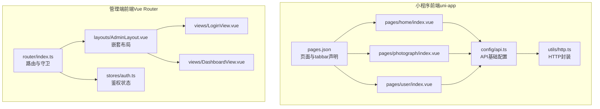
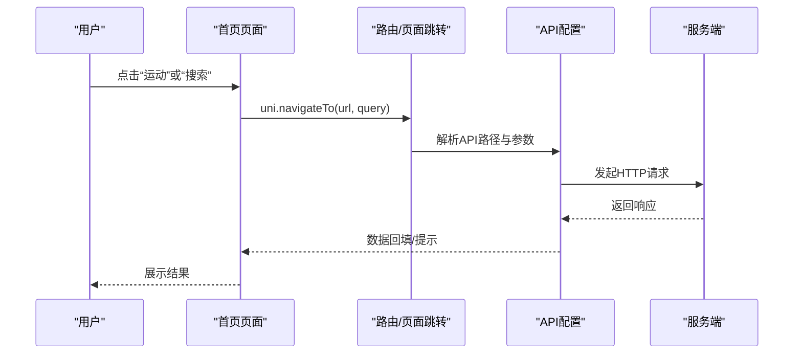
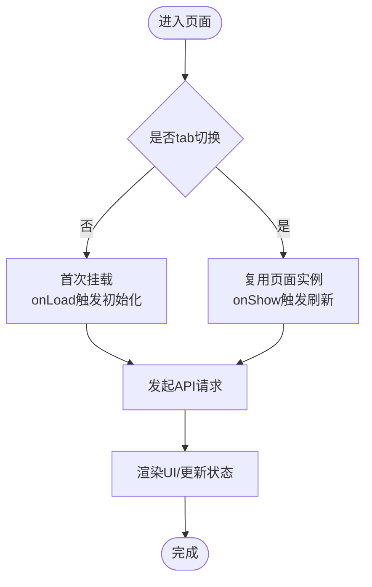
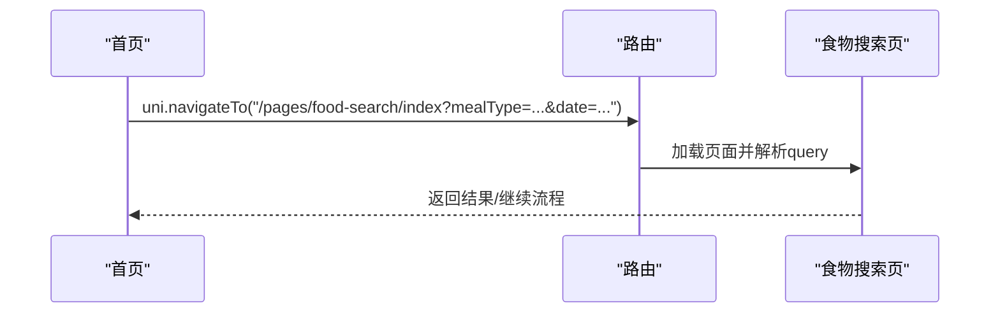
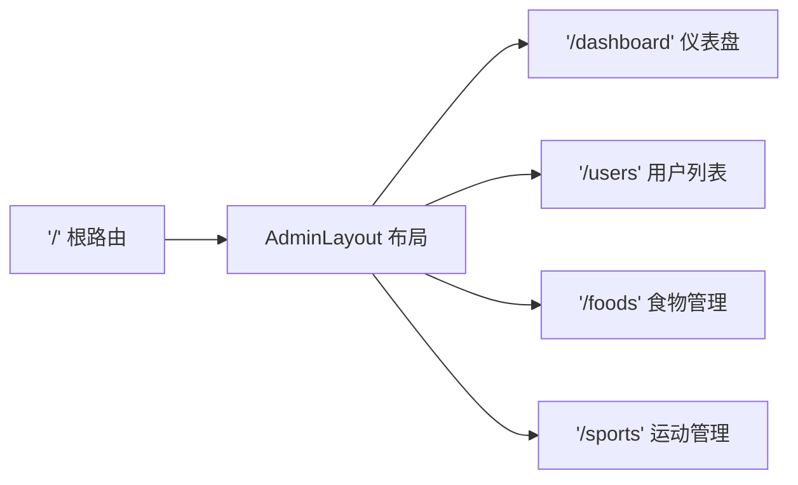
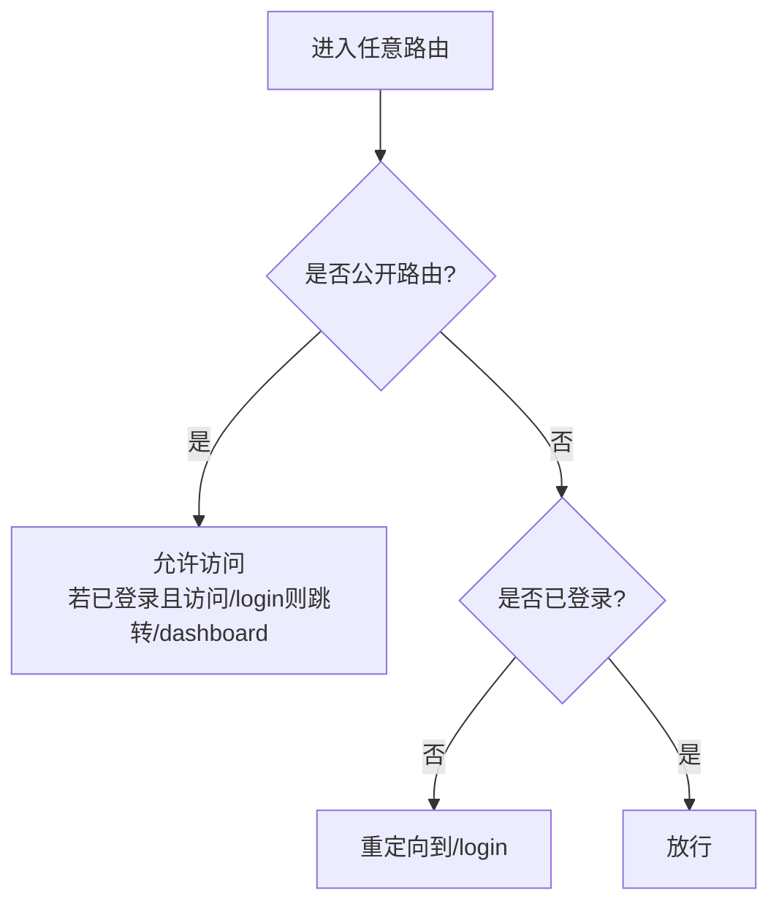
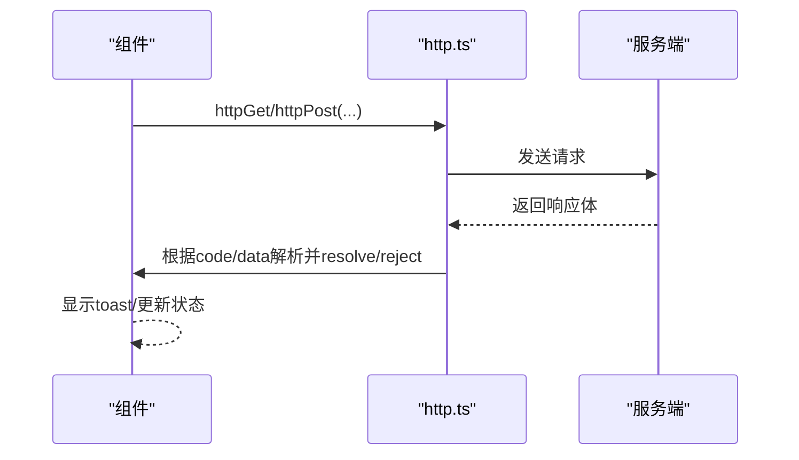
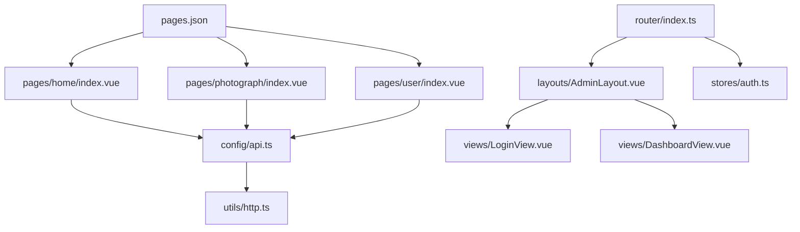

# 路由配置说明

<cite>
**本文档引用的文件**
- [pages.json](file://frontend/src/pages.json)
- [main.ts](file://frontend/src/main.ts)
- [App.vue](file://frontend/src/App.vue)
- [api.ts](file://frontend/src/config/api.ts)
- [http.ts](file://frontend/src/utils/http.ts)
- [index.vue（首页）](file://frontend/src/pages/home/index.vue)
- [index.vue（用户中心）](file://frontend/src/pages/user/index.vue)
- [index.vue（拍照识别）](file://frontend/src/pages/photograph/index.vue)
- [index.ts（管理端路由）](file://admin-frontend/src/router/index.ts)
- [AdminLayout.vue](file://admin-frontend/src/layouts/AdminLayout.vue)
- [auth.ts（管理端鉴权）](file://admin-frontend/src/stores/auth.ts)
- [LoginView.vue](file://admin-frontend/src/views/LoginView.vue)
- [DashboardView.vue](file://admin-frontend/src/views/DashboardView.vue)
</cite>

## 目录
1. [简介](#简介)
2. [项目结构](#项目结构)
3. [核心组件](#核心组件)
4. [架构总览](#架构总览)
5. [详细组件分析](#详细组件分析)
6. [依赖关系分析](#依赖关系分析)
7. [性能考虑](#性能考虑)
8. [故障排查指南](#故障排查指南)
9. [结论](#结论)
10. [附录](#附录)

## 简介
本文件面向“路由配置”主题，系统性说明前端 uni-app 小程序侧的页面路由规则、页面声明方式、导航与跳转机制、权限控制与拦截策略，以及与后端 API 的集成方式。同时给出管理端 Vue Router 的路由守卫与嵌套路由实践，帮助读者快速理解并高效扩展路由体系。

## 项目结构
本仓库包含两套前端工程：
- 小程序前端（uni-app）：通过 pages.json 声明页面与 tabbar，页面以目录形式组织，组件化开发。
- 管理端前端（Vue Router）：采用 vue-router 的嵌套路由与全局前置守卫实现权限控制。

图表来源
- [pages.json:1-194](file://frontend/src/pages.json#L1-L194)
- [index.ts（管理端路由）:1-46](file://admin-frontend/src/router/index.ts#L1-L46)
- [AdminLayout.vue:1-262](file://admin-frontend/src/layouts/AdminLayout.vue#L1-L262)

章节来源
- [pages.json:1-194](file://frontend/src/pages.json#L1-L194)
- [index.ts（管理端路由）:1-46](file://admin-frontend/src/router/index.ts#L1-L46)

## 核心组件
- 页面声明与 tabbar：通过 pages.json 统一声明所有页面与 tabbar，支持自定义导航样式、背景色、字体颜色等。
- 页面跳转：在各页面组件中使用 uni.navigateTo 等 API 实现页面间跳转与参数传递。
- 权限控制：管理端通过全局前置守卫 router.beforeEach 控制访问权限，结合 Pinia 状态持久化。
- API 集成：统一的 API 基础路径与工具函数封装，确保请求一致性与可维护性。

章节来源
- [pages.json:1-194](file://frontend/src/pages.json#L1-L194)
- [index.vue（首页）:180-231](file://frontend/src/pages/home/index.vue#L180-L231)
- [index.vue（用户中心）:139-157](file://frontend/src/pages/user/index.vue#L139-L157)
- [index.ts（管理端路由）:35-43](file://admin-frontend/src/router/index.ts#L35-L43)
- [auth.ts（管理端鉴权）:1-29](file://admin-frontend/src/stores/auth.ts#L1-L29)
- [api.ts:1-42](file://frontend/src/config/api.ts#L1-L42)
- [http.ts:1-126](file://frontend/src/utils/http.ts#L1-L126)

## 架构总览
小程序端路由基于 pages.json 声明式配置，页面按需渲染；管理端路由基于 vue-router 的声明式路由与守卫，实现嵌套路由与权限拦截。

图表来源
- [index.vue（首页）:180-231](file://frontend/src/pages/home/index.vue#L180-L231)
- [api.ts:10-18](file://frontend/src/config/api.ts#L10-L18)
- [http.ts:28-81](file://frontend/src/utils/http.ts#L28-L81)

章节来源
- [index.vue（首页）:180-231](file://frontend/src/pages/home/index.vue#L180-L231)
- [api.ts:1-42](file://frontend/src/config/api.ts#L1-L42)
- [http.ts:1-126](file://frontend/src/utils/http.ts#L1-L126)

## 详细组件分析

### 小程序端页面声明与导航
- pages.json 声明页面与 tabbar：每个页面包含 path 与 style（标题、导航样式、背景色等），tabbar 定义底部导航项与图标。
- 页面跳转与参数传递：在页面组件中使用 uni.navigateTo/redirectTo/switchTab 等 API，支持 query 参数拼接。
- 页面生命周期与状态保持：页面 onShow/onLoad 等生命周期用于触发数据拉取与状态同步，配合本地存储维持轻量状态。

图表来源
- [pages.json:144-169](file://frontend/src/pages.json#L144-L169)
- [index.vue（首页）:175-178](file://frontend/src/pages/home/index.vue#L175-L178)
- [index.vue（用户中心）:134-137](file://frontend/src/pages/user/index.vue#L134-L137)

章节来源
- [pages.json:1-194](file://frontend/src/pages.json#L1-L194)
- [index.vue（首页）:175-231](file://frontend/src/pages/home/index.vue#L175-L231)
- [index.vue（用户中心）:134-157](file://frontend/src/pages/user/index.vue#L134-L157)

### 动态路由与参数传递
- 参数传递：在跳转时通过 query 携带参数，如日期、餐型等，接收方解析并使用。
- 页面间跳转：首页将餐型与日期作为查询参数传入“食物搜索”页面；用户中心跳转到“周统计”“体重趋势”等页面。
- 参数解析：接收页面根据路由参数进行业务逻辑处理（如按日期聚合数据）。

图表来源
- [index.vue（首页）:196-200](file://frontend/src/pages/home/index.vue#L196-L200)

章节来源
- [index.vue（首页）:180-201](file://frontend/src/pages/home/index.vue#L180-L201)

### 嵌套路由与布局
- 管理端采用嵌套路由：根路由指向 AdminLayout，children 定义子页面，形成“布局-内容”的嵌套结构。
- 布局组件：AdminLayout 作为容器，内部包含菜单、面包屑、主内容区，router-view 插槽承载子路由组件。
- 标题与面包屑：通过 route.meta.title 动态设置页面标题，提升用户体验。

图表来源
- [index.ts（管理端路由）:11-33](file://admin-frontend/src/router/index.ts#L11-L33)
- [AdminLayout.vue:114-129](file://admin-frontend/src/layouts/AdminLayout.vue#L114-L129)

章节来源
- [index.ts（管理端路由）:11-33](file://admin-frontend/src/router/index.ts#L11-L33)
- [AdminLayout.vue:114-129](file://admin-frontend/src/layouts/AdminLayout.vue#L114-L129)

### 路由守卫与权限控制
- 全局前置守卫：beforeEach 判断目标路由是否为公开页面，若非公开且未登录则重定向至登录页；已登录访问 /login 自动跳转仪表盘。
- 鉴权状态：Pinia Store 存储 token 与用户名，持久化到 localStorage，刷新后仍可恢复登录态。
- 登录流程：登录页提交凭据后写入 Store 并跳转到仪表盘；退出登录时清空 Store 与本地存储并强制跳转登录。

图表来源
- [index.ts（管理端路由）:35-43](file://admin-frontend/src/router/index.ts#L35-L43)
- [auth.ts（管理端鉴权）:6-28](file://admin-frontend/src/stores/auth.ts#L6-L28)
- [LoginView.vue:16-28](file://admin-frontend/src/views/LoginView.vue#L16-L28)

章节来源
- [index.ts（管理端路由）:35-43](file://admin-frontend/src/router/index.ts#L35-L43)
- [auth.ts（管理端鉴权）:1-29](file://admin-frontend/src/stores/auth.ts#L1-L29)
- [LoginView.vue:1-148](file://admin-frontend/src/views/LoginView.vue#L1-L148)

### API 集成与错误处理
- API 基础路径：通过环境变量与常量组合，统一生成 API 路径前缀，便于多环境切换。
- HTTP 封装：统一封装 GET/POST/DELETE 请求，统一处理响应体结构与错误信息，失败时抛出错误供调用方捕获。
- 错误处理：页面组件在请求失败时弹出 toast 提示，避免白屏与无反馈。

图表来源
- [api.ts:10-18](file://frontend/src/config/api.ts#L10-L18)
- [http.ts:9-26](file://frontend/src/utils/http.ts#L9-L26)
- [index.vue（首页）:161-173](file://frontend/src/pages/home/index.vue#L161-L173)

章节来源
- [api.ts:1-42](file://frontend/src/config/api.ts#L1-L42)
- [http.ts:1-126](file://frontend/src/utils/http.ts#L1-L126)
- [index.vue（首页）:161-173](file://frontend/src/pages/home/index.vue#L161-L173)

### 页面间跳转与状态保持
- 跳转方式：首页与用户中心使用 uni.navigateTo 进行页面跳转；tabbar 页面使用 switchTab。
- 状态保持：页面 onShow 触发数据刷新；本地存储用于短期状态（如选择的餐型图标）。
- 生命周期：App.vue 的 onLaunch/onShow/onHide 提供应用级生命周期钩子，便于全局日志与初始化。

章节来源
- [index.vue（首页）:175-231](file://frontend/src/pages/home/index.vue#L175-L231)
- [index.vue（用户中心）:134-157](file://frontend/src/pages/user/index.vue#L134-L157)
- [App.vue:15-27](file://frontend/src/App.vue#L15-L27)

## 依赖关系分析
- 小程序端：pages.json 作为页面清单，页面组件依赖 config/api.ts 与 utils/http.ts；页面间通过 uni-app 导航 API 跳转。
- 管理端：router/index.ts 定义路由与守卫，AdminLayout 作为容器，views 下各页面组件承载具体业务；鉴权依赖 stores/auth.ts。

图表来源
- [pages.json:1-194](file://frontend/src/pages.json#L1-L194)
- [index.ts（管理端路由）:1-46](file://admin-frontend/src/router/index.ts#L1-L46)
- [AdminLayout.vue:1-262](file://admin-frontend/src/layouts/AdminLayout.vue#L1-L262)

章节来源
- [pages.json:1-194](file://frontend/src/pages.json#L1-L194)
- [index.ts（管理端路由）:1-46](file://admin-frontend/src/router/index.ts#L1-L46)
- [AdminLayout.vue:1-262](file://admin-frontend/src/layouts/AdminLayout.vue#L1-L262)

## 性能考虑
- 页面懒加载：小程序端通过 pages.json 声明页面，按需构建；管理端可通过路由懒加载（import()）进一步降低首屏体积。
- 预加载策略：对高频入口（如首页、用户中心）可考虑预取关键数据，减少首屏等待。
- 缓存策略：对静态资源与图片使用 CDN 与浏览器缓存；对接口数据采用合理的缓存与失效策略。
- 网络优化：统一的 HTTP 封装可增加重试与超时控制，提升弱网体验。

## 故障排查指南
- 登录后仍被重定向到登录页：检查鉴权 Store 是否正确写入 token 与用户名，确认守卫逻辑与路由 meta.public 标记。
- 页面无法显示或空白：核对 pages.json 中页面 path 与实际目录是否一致；检查页面组件是否正确导出。
- API 请求失败：检查 API_BASE_URL 与 API_PATH_PREFIX 是否匹配后端部署；查看 http.ts 对响应体的解析与错误分支。
- tabbar 图标不显示：确认 iconPath/selectedIconPath 路径与静态资源部署情况。

章节来源
- [index.ts（管理端路由）:35-43](file://admin-frontend/src/router/index.ts#L35-L43)
- [auth.ts（管理端鉴权）:1-29](file://admin-frontend/src/stores/auth.ts#L1-L29)
- [pages.json:144-169](file://frontend/src/pages.json#L144-L169)
- [http.ts:9-26](file://frontend/src/utils/http.ts#L9-L26)

## 结论
本项目在小程序端采用声明式页面配置与 uni-app 导航 API，在管理端采用 vue-router 的嵌套路由与全局守卫，形成了清晰、可扩展的路由体系。通过统一的 API 配置与 HTTP 封装，路由与数据层解耦良好。建议后续引入路由懒加载与预加载策略，持续优化首屏性能与交互体验。

## 附录
- 页面清单与 tabbar：参考 pages.json 的 pages 与 tabBar 字段。
- 管理端路由与守卫：参考 router/index.ts 的 routes 与 beforeEach。
- 鉴权状态：参考 stores/auth.ts 的 token/username 与持久化逻辑。
- API 基础路径：参考 config/api.ts 的 API_BASE_URL、API_PATH_PREFIX 与 apiPath。