# Controller层设计

<cite>
**本文引用的文件**
- [AdminAuthController.java](file://backend/src/main/java/com/ypfr/loseweight/web/AdminAuthController.java)
- [AuthController.java](file://backend/src/main/java/com/ypfr/loseweight/web/AuthController.java)
- [UserController.java](file://backend/src/main/java/com/ypfr/loseweight/web/UserController.java)
- [DailyRecordController.java](file://backend/src/main/java/com/ypfr/loseweight/web/DailyRecordController.java)
- [DashboardController.java](file://backend/src/main/java/com/ypfr/loseweight/web/DashboardController.java)
- [MealRecordController.java](file://backend/src/main/java/com/ypfr/loseweight/web/MealRecordController.java)
- [FoodLibraryController.java](file://backend/src/main/java/com/ypfr/loseweight/web/FoodLibraryController.java)
- [GlobalExceptionHandler.java](file://backend/src/main/java/com/ypfr/loseweight/common/GlobalExceptionHandler.java)
- [ApiResponse.java](file://backend/src/main/java/com/ypfr/loseweight/common/ApiResponse.java)
- [WebConfig.java](file://backend/src/main/java/com/ypfr/loseweight/config/WebConfig.java)
- [AuthUserResolver.java](file://backend/src/main/java/com/ypfr/loseweight/web/AuthUserResolver.java)
- [AdminAuthResolver.java](file://backend/src/main/java/com/ypfr/loseweight/web/AdminAuthResolver.java)
- [application.yml](file://backend/src/main/resources/application.yml)
- [WxLoginRequest.java](file://backend/src/main/java/com/ypfr/loseweight/web/dto/WxLoginRequest.java)
- [AdminLoginRequest.java](file://backend/src/main/java/com/ypfr/loseweight/web/dto/admin/AdminLoginRequest.java)
- [CreateMealRecordRequest.java](file://backend/src/main/java/com/ypfr/loseweight/web/dto/CreateMealRecordRequest.java)
- [UpdateProfileRequest.java](file://backend/src/main/java/com/ypfr/loseweight/web/dto/UpdateProfileRequest.java)
- [AdminFoodUpsertRequest.java](file://backend/src/main/java/com/ypfr/loseweight/web/dto/admin/AdminFoodUpsertRequest.java)
</cite>

## 目录
1. [简介](#简介)
2. [项目结构](#项目结构)
3. [核心组件](#核心组件)
4. [架构总览](#架构总览)
5. [详细组件分析](#详细组件分析)
6. [依赖关系分析](#依赖关系分析)
7. [性能考量](#性能考量)
8. [故障排查指南](#故障排查指南)
9. [结论](#结论)
10. [附录](#附录)

## 简介
本文件面向Spring MVC架构下的Controller层设计，系统性阐述Controller层在请求处理、参数绑定、数据验证、响应封装、异常处理等方面的职责与实现方式。文档结合项目中的认证控制器、用户控制器、记录控制器、食品库控制器等典型实现，给出可复用的设计模式与最佳实践，并提供可视化图示帮助理解。

## 项目结构
后端采用典型的分层架构，Controller层位于web包下，统一对外暴露REST接口，负责：
- 接收HTTP请求，解析路径变量、查询参数、请求体与请求头
- 参数校验（JSR-303约束与自定义校验）
- 调用Service层执行业务逻辑
- 使用统一响应包装类返回结果
- 全局异常处理，保证对外一致的错误格式

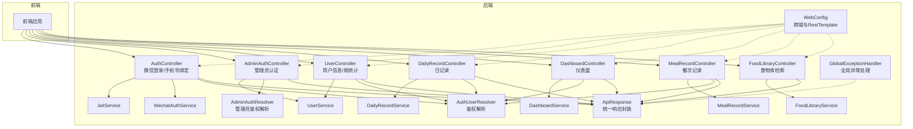

图表来源
- [AuthController.java:1-55](file://backend/src/main/java/com/ypfr/loseweight/web/AuthController.java#L1-L55)
- [AdminAuthController.java:1-62](file://backend/src/main/java/com/ypfr/loseweight/web/AdminAuthController.java#L1-L62)
- [UserController.java:1-41](file://backend/src/main/java/com/ypfr/loseweight/web/UserController.java#L1-L41)
- [DailyRecordController.java:1-40](file://backend/src/main/java/com/ypfr/loseweight/web/DailyRecordController.java#L1-L40)
- [DashboardController.java:1-39](file://backend/src/main/java/com/ypfr/loseweight/web/DashboardController.java#L1-L39)
- [MealRecordController.java:1-61](file://backend/src/main/java/com/ypfr/loseweight/web/MealRecordController.java#L1-L61)
- [FoodLibraryController.java:1-31](file://backend/src/main/java/com/ypfr/loseweight/web/FoodLibraryController.java#L1-L31)
- [AuthUserResolver.java:1-33](file://backend/src/main/java/com/ypfr/loseweight/web/AuthUserResolver.java#L1-L33)
- [AdminAuthResolver.java:1-28](file://backend/src/main/java/com/ypfr/loseweight/web/AdminAuthResolver.java#L1-L28)
- [GlobalExceptionHandler.java:1-107](file://backend/src/main/java/com/ypfr/loseweight/common/GlobalExceptionHandler.java#L1-L107)
- [ApiResponse.java:1-35](file://backend/src/main/java/com/ypfr/loseweight/common/ApiResponse.java#L1-L35)
- [WebConfig.java:1-31](file://backend/src/main/java/com/ypfr/loseweight/config/WebConfig.java#L1-L31)

章节来源
- [application.yml:1-54](file://backend/src/main/resources/application.yml#L1-L54)

## 核心组件
- 统一响应封装
  - ApiResponse提供成功与失败两种静态工厂方法，确保所有Controller返回格式一致，便于前端统一处理。
- 全局异常处理
  - GlobalExceptionHandler集中捕获业务异常、参数校验异常、数据访问异常、MyBatis类型映射异常及未捕获异常，统一转换为标准响应。
- 鉴权解析器
  - AuthUserResolver与AdminAuthResolver分别从Authorization头解析用户ID与管理员ID，支持路径级权限校验。
- 跨域与客户端
  - WebConfig配置/CORS策略与RestTemplate超时设置，保障前后端交互顺畅。

章节来源
- [ApiResponse.java:1-35](file://backend/src/main/java/com/ypfr/loseweight/common/ApiResponse.java#L1-L35)
- [GlobalExceptionHandler.java:1-107](file://backend/src/main/java/com/ypfr/loseweight/common/GlobalExceptionHandler.java#L1-L107)
- [AuthUserResolver.java:1-33](file://backend/src/main/java/com/ypfr/loseweight/web/AuthUserResolver.java#L1-L33)
- [AdminAuthResolver.java:1-28](file://backend/src/main/java/com/ypfr/loseweight/web/AdminAuthResolver.java#L1-L28)
- [WebConfig.java:1-31](file://backend/src/main/java/com/ypfr/loseweight/config/WebConfig.java#L1-L31)

## 架构总览
Controller层遵循“薄控制器、厚领域模型”的原则：
- 控制器只做路由、参数绑定、校验与鉴权
- 业务逻辑下沉至Service层
- 异常通过全局处理器统一拦截与转换
- 响应通过ApiResponse统一封装

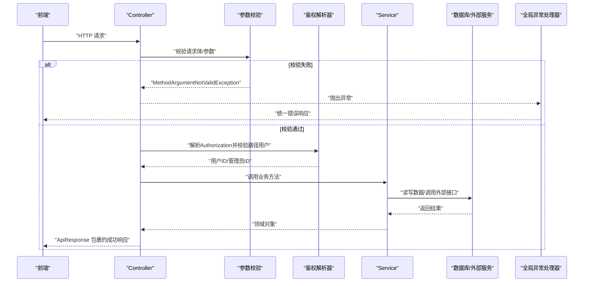

图表来源
- [AuthController.java:1-55](file://backend/src/main/java/com/ypfr/loseweight/web/AuthController.java#L1-L55)
- [AdminAuthController.java:1-62](file://backend/src/main/java/com/ypfr/loseweight/web/AdminAuthController.java#L1-L62)
- [DailyRecordController.java:1-40](file://backend/src/main/java/com/ypfr/loseweight/web/DailyRecordController.java#L1-L40)
- [GlobalExceptionHandler.java:1-107](file://backend/src/main/java/com/ypfr/loseweight/common/GlobalExceptionHandler.java#L1-L107)
- [ApiResponse.java:1-35](file://backend/src/main/java/com/ypfr/loseweight/common/ApiResponse.java#L1-L35)

## 详细组件分析

### 认证控制器（AuthController）
职责
- 提供微信小程序登录与手机号绑定接口
- 通过请求头Authorization与JWT解析当前用户身份
- 使用DTO承载请求参数，配合JSR-303进行参数校验

关键点
- 路径映射：/api/v1/auth
- 方法映射：POST /wx-login、POST /bind-phone
- 参数绑定：@RequestBody绑定请求体，@RequestHeader绑定Authorization头
- 校验：@Valid驱动参数校验，WxLoginRequest等DTO声明非空约束
- 响应：统一使用ApiResponse封装

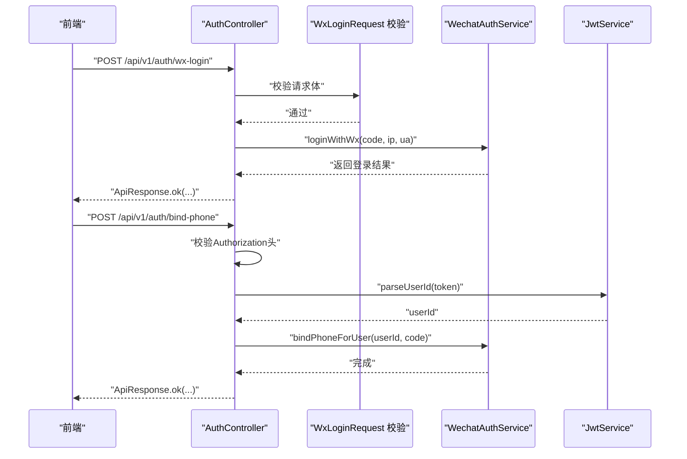

图表来源
- [AuthController.java:1-55](file://backend/src/main/java/com/ypfr/loseweight/web/AuthController.java#L1-L55)
- [WxLoginRequest.java:1-64](file://backend/src/main/java/com/ypfr/loseweight/web/dto/WxLoginRequest.java#L1-L64)

章节来源
- [AuthController.java:1-55](file://backend/src/main/java/com/ypfr/loseweight/web/AuthController.java#L1-L55)
- [WxLoginRequest.java:1-64](file://backend/src/main/java/com/ypfr/loseweight/web/dto/WxLoginRequest.java#L1-L64)

### 管理员认证控制器（AdminAuthController）
职责
- 管理员登录、修改密码、首页看板数据
- 通过AdminAuthResolver解析管理员令牌并进行权限校验

关键点
- 路径映射：/api/v1/admin
- 方法映射：POST /login、POST /change-password、GET /dashboard/stats
- 参数绑定：@RequestBody绑定请求体，@RequestHeader绑定Authorization头
- 校验：@Valid驱动AdminLoginRequest等DTO校验
- 响应：统一使用ApiResponse封装

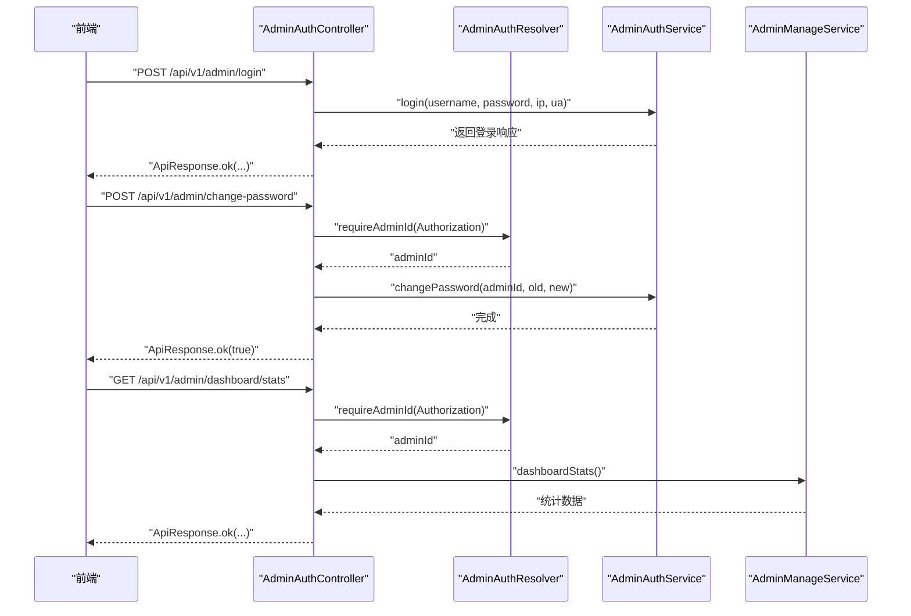

图表来源
- [AdminAuthController.java:1-62](file://backend/src/main/java/com/ypfr/loseweight/web/AdminAuthController.java#L1-L62)
- [AdminAuthResolver.java:1-28](file://backend/src/main/java/com/ypfr/loseweight/web/AdminAuthResolver.java#L1-L28)
- [AdminLoginRequest.java:1-29](file://backend/src/main/java/com/ypfr/loseweight/web/dto/admin/AdminLoginRequest.java#L1-L29)

章节来源
- [AdminAuthController.java:1-62](file://backend/src/main/java/com/ypfr/loseweight/web/AdminAuthController.java#L1-L62)
- [AdminAuthResolver.java:1-28](file://backend/src/main/java/com/ypfr/loseweight/web/AdminAuthResolver.java#L1-L28)
- [AdminLoginRequest.java:1-29](file://backend/src/main/java/com/ypfr/loseweight/web/dto/admin/AdminLoginRequest.java#L1-L29)

### 用户控制器（UserController）
职责
- 获取用户信息与周统计
- 支持日期范围查询与路径参数校验

关键点
- 路径映射：/api/v1/users
- 方法映射：GET /{id}、GET /{userId}/week-stats
- 参数绑定：@PathVariable、@RequestParam配合@DateTimeFormat
- 响应：统一使用ApiResponse封装

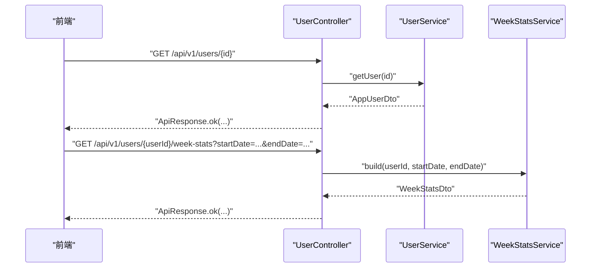

图表来源
- [UserController.java:1-41](file://backend/src/main/java/com/ypfr/loseweight/web/UserController.java#L1-L41)

章节来源
- [UserController.java:1-41](file://backend/src/main/java/com/ypfr/loseweight/web/UserController.java#L1-L41)

### 日记录控制器（DailyRecordController）
职责
- 获取指定用户的某日记录
- 通过AuthUserResolver进行路径用户鉴权

关键点
- 路径映射：/api/v1/users/{userId}/daily-records
- 方法映射：GET /daily
- 参数绑定：@RequestHeader Authorization、@PathVariable、@RequestParam
- 鉴权：requirePathUser确保用户只能访问自己的数据
- 响应：统一使用ApiResponse封装

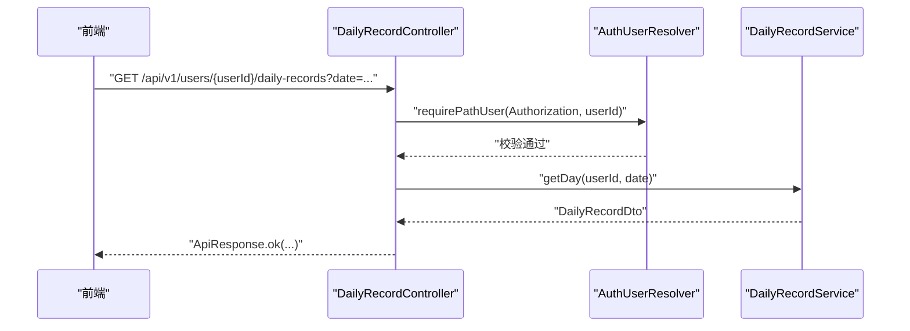

图表来源
- [DailyRecordController.java:1-40](file://backend/src/main/java/com/ypfr/loseweight/web/DailyRecordController.java#L1-L40)
- [AuthUserResolver.java:1-33](file://backend/src/main/java/com/ypfr/loseweight/web/AuthUserResolver.java#L1-L33)

章节来源
- [DailyRecordController.java:1-40](file://backend/src/main/java/com/ypfr/loseweight/web/DailyRecordController.java#L1-L40)
- [AuthUserResolver.java:1-33](file://backend/src/main/java/com/ypfr/loseweight/web/AuthUserResolver.java#L1-L33)

### 仪表盘控制器（DashboardController）
职责
- 获取用户仪表盘数据
- 通过AuthUserResolver进行路径用户鉴权

关键点
- 路径映射：/api/v1/users/{userId}/dashboard
- 方法映射：GET /dashboard
- 参数绑定：@RequestHeader Authorization、@PathVariable、@RequestParam
- 鉴权：requirePathUser确保用户只能访问自己的数据
- 响应：统一使用ApiResponse封装

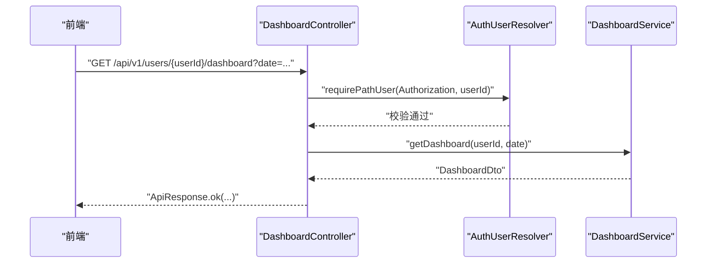

图表来源
- [DashboardController.java:1-39](file://backend/src/main/java/com/ypfr/loseweight/web/DashboardController.java#L1-L39)
- [AuthUserResolver.java:1-33](file://backend/src/main/java/com/ypfr/loseweight/web/AuthUserResolver.java#L1-L33)

章节来源
- [DashboardController.java:1-39](file://backend/src/main/java/com/ypfr/loseweight/web/DashboardController.java#L1-L39)
- [AuthUserResolver.java:1-33](file://backend/src/main/java/com/ypfr/loseweight/web/AuthUserResolver.java#L1-L33)

### 餐次记录控制器（MealRecordController）
职责
- 创建单条餐次记录、批量创建、删除餐次记录
- 通过AuthUserResolver进行路径用户鉴权

关键点
- 路径映射：/api/v1/users/{userId}/meal-records
- 方法映射：POST /、POST /batch、DELETE /{id}
- 参数绑定：@RequestHeader Authorization、@PathVariable、@RequestBody
- 鉴权：requirePathUser确保用户只能操作自己的数据
- 响应：统一使用ApiResponse封装

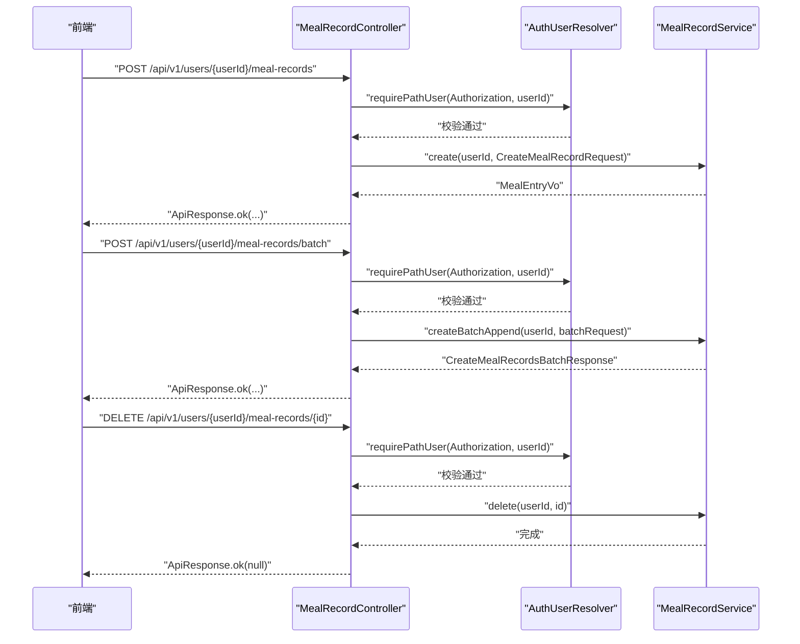

图表来源
- [MealRecordController.java:1-61](file://backend/src/main/java/com/ypfr/loseweight/web/MealRecordController.java#L1-L61)
- [AuthUserResolver.java:1-33](file://backend/src/main/java/com/ypfr/loseweight/web/AuthUserResolver.java#L1-L33)
- [CreateMealRecordRequest.java:1-99](file://backend/src/main/java/com/ypfr/loseweight/web/dto/CreateMealRecordRequest.java#L1-L99)

章节来源
- [MealRecordController.java:1-61](file://backend/src/main/java/com/ypfr/loseweight/web/MealRecordController.java#L1-L61)
- [AuthUserResolver.java:1-33](file://backend/src/main/java/com/ypfr/loseweight/web/AuthUserResolver.java#L1-L33)
- [CreateMealRecordRequest.java:1-99](file://backend/src/main/java/com/ypfr/loseweight/web/dto/CreateMealRecordRequest.java#L1-L99)

### 食物库控制器（FoodLibraryController）
职责
- 搜索食物库，支持关键词、限制数量、用户偏好与分类筛选

关键点
- 路径映射：/api/v1/food-library
- 方法映射：GET /search
- 参数绑定：@RequestParam支持字符串、整型、Long与分类编码
- 响应：统一使用ApiResponse封装

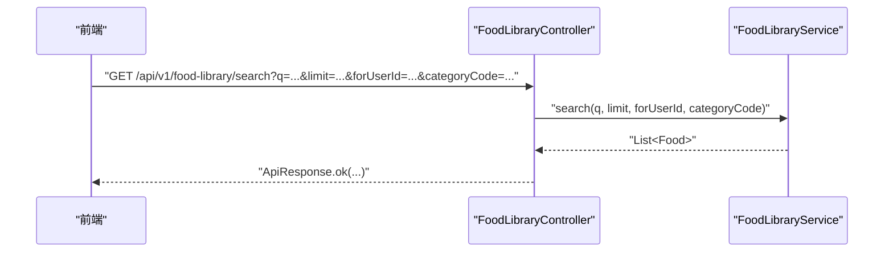

图表来源
- [FoodLibraryController.java:1-31](file://backend/src/main/java/com/ypfr/loseweight/web/FoodLibraryController.java#L1-L31)

章节来源
- [FoodLibraryController.java:1-31](file://backend/src/main/java/com/ypfr/loseweight/web/FoodLibraryController.java#L1-L31)

### DTO与参数校验
- WxLoginRequest：声明微信登录所需的code等字段的非空约束
- AdminLoginRequest：声明用户名与密码的非空约束
- CreateMealRecordRequest：声明餐次记录的关键字段
- UpdateProfileRequest：声明用户资料更新的可选字段
- AdminFoodUpsertRequest：声明管理员维护食物的必填字段与数值约束

章节来源
- [WxLoginRequest.java:1-64](file://backend/src/main/java/com/ypfr/loseweight/web/dto/WxLoginRequest.java#L1-L64)
- [AdminLoginRequest.java:1-29](file://backend/src/main/java/com/ypfr/loseweight/web/dto/admin/AdminLoginRequest.java#L1-L29)
- [CreateMealRecordRequest.java:1-99](file://backend/src/main/java/com/ypfr/loseweight/web/dto/CreateMealRecordRequest.java#L1-L99)
- [UpdateProfileRequest.java:1-121](file://backend/src/main/java/com/ypfr/loseweight/web/dto/UpdateProfileRequest.java#L1-L121)
- [AdminFoodUpsertRequest.java:1-142](file://backend/src/main/java/com/ypfr/loseweight/web/dto/admin/AdminFoodUpsertRequest.java#L1-L142)

## 依赖关系分析
- 控制器到服务层
  - AuthController依赖WechatAuthService与JwtService
  - AdminAuthController依赖AdminAuthService与AdminManageService
  - UserController依赖UserService与WeekStatsService
  - DailyRecordController依赖DailyRecordService与AuthUserResolver
  - DashboardController依赖DashboardService与AuthUserResolver
  - MealRecordController依赖MealRecordService与AuthUserResolver
  - FoodLibraryController依赖FoodLibraryService
- 控制器到工具层
  - 所有控制器均使用AuthUserResolver或AdminAuthResolver进行鉴权
  - 所有控制器均使用ApiResponse进行响应封装
  - 全局异常处理器统一拦截异常并转换为标准响应
- 配置层
  - WebConfig提供跨域与RestTemplate配置

```mermaid
classDiagram
class AuthController
class AdminAuthController
class UserController
class DailyRecordController
class DashboardController
class MealRecordController
class FoodLibraryController
class AuthUserResolver
class AdminAuthResolver
class ApiResponse
class GlobalExceptionHandler
class WebConfig
class WechatAuthService
class JwtService
class AdminAuthService
class AdminManageService
class UserService
class WeekStatsService
class DailyRecordService
class DashboardService
class MealRecordService
class FoodLibraryService
AuthController --> WechatAuthService : "依赖"
AuthController --> JwtService : "依赖"
AdminAuthController --> AdminAuthService : "依赖"
AdminAuthController --> AdminManageService : "依赖"
UserController --> UserService : "依赖"
UserController --> WeekStatsService : "依赖"
DailyRecordController --> DailyRecordService : "依赖"
DailyRecordController --> AuthUserResolver : "依赖"
DashboardController --> DashboardService : "依赖"
DashboardController --> AuthUserResolver : "依赖"
MealRecordController --> MealRecordService : "依赖"
MealRecordController --> AuthUserResolver : "依赖"
FoodLibraryController --> FoodLibraryService : "依赖"
AuthController --> AuthUserResolver : "鉴权"
AdminAuthController --> AdminAuthResolver : "鉴权"
DailyRecordController --> AuthUserResolver : "鉴权"
DashboardController --> AuthUserResolver : "鉴权"
AuthController --> ApiResponse : "响应"
AdminAuthController --> ApiResponse : "响应"
UserController --> ApiResponse : "响应"
DailyRecordController --> ApiResponse : "响应"
DashboardController --> ApiResponse : "响应"
MealRecordController --> ApiResponse : "响应"
FoodLibraryController --> ApiResponse : "响应"
GlobalExceptionHandler --> ApiResponse : "异常转响应"
WebConfig --> AuthController : "跨域"
WebConfig --> AdminAuthController : "跨域"
WebConfig --> UserController : "跨域"
WebConfig --> DailyRecordController : "跨域"
WebConfig --> DashboardController : "跨域"
WebConfig --> MealRecordController : "跨域"
WebConfig --> FoodLibraryController : "跨域"
```

图表来源
- [AuthController.java:1-55](file://backend/src/main/java/com/ypfr/loseweight/web/AuthController.java#L1-L55)
- [AdminAuthController.java:1-62](file://backend/src/main/java/com/ypfr/loseweight/web/AdminAuthController.java#L1-L62)
- [UserController.java:1-41](file://backend/src/main/java/com/ypfr/loseweight/web/UserController.java#L1-L41)
- [DailyRecordController.java:1-40](file://backend/src/main/java/com/ypfr/loseweight/web/DailyRecordController.java#L1-L40)
- [DashboardController.java:1-39](file://backend/src/main/java/com/ypfr/loseweight/web/DashboardController.java#L1-L39)
- [MealRecordController.java:1-61](file://backend/src/main/java/com/ypfr/loseweight/web/MealRecordController.java#L1-L61)
- [FoodLibraryController.java:1-31](file://backend/src/main/java/com/ypfr/loseweight/web/FoodLibraryController.java#L1-L31)
- [AuthUserResolver.java:1-33](file://backend/src/main/java/com/ypfr/loseweight/web/AuthUserResolver.java#L1-L33)
- [AdminAuthResolver.java:1-28](file://backend/src/main/java/com/ypfr/loseweight/web/AdminAuthResolver.java#L1-L28)
- [GlobalExceptionHandler.java:1-107](file://backend/src/main/java/com/ypfr/loseweight/common/GlobalExceptionHandler.java#L1-L107)
- [ApiResponse.java:1-35](file://backend/src/main/java/com/ypfr/loseweight/common/ApiResponse.java#L1-L35)
- [WebConfig.java:1-31](file://backend/src/main/java/com/ypfr/loseweight/config/WebConfig.java#L1-L31)

## 性能考量
- 跨域与客户端
  - WebConfig对/CORS进行宽松配置，允许所有源与常用方法，减少前端跨域问题
  - RestTemplate设置连接与读取超时，避免长时间阻塞
- 响应一致性
  - 统一使用ApiResponse，减少前端分支判断，提升整体处理效率
- 参数校验前置
  - 在Controller层使用@Valid与DTO约束，提前拒绝无效请求，降低后续处理成本

章节来源
- [WebConfig.java:1-31](file://backend/src/main/java/com/ypfr/loseweight/config/WebConfig.java#L1-L31)
- [ApiResponse.java:1-35](file://backend/src/main/java/com/ypfr/loseweight/common/ApiResponse.java#L1-L35)

## 故障排查指南
- 参数校验失败
  - 现象：返回400，消息包含首个字段的校验提示
  - 定位：GlobalExceptionHandler对MethodArgumentNotValidException的处理
- 业务异常
  - 现象：返回400，携带业务错误码与消息
  - 定位：业务层抛出ApiException，由全局处理器转换
- 数据访问异常
  - 现象：返回500，消息包含友好提示与数据库结构指引
  - 定位：GlobalExceptionHandler对DataAccessException与MyBatis TypeException的处理
- 未捕获异常
  - 现象：返回500，消息为通用服务器错误
  - 定位：GlobalExceptionHandler对Exception的兜底处理

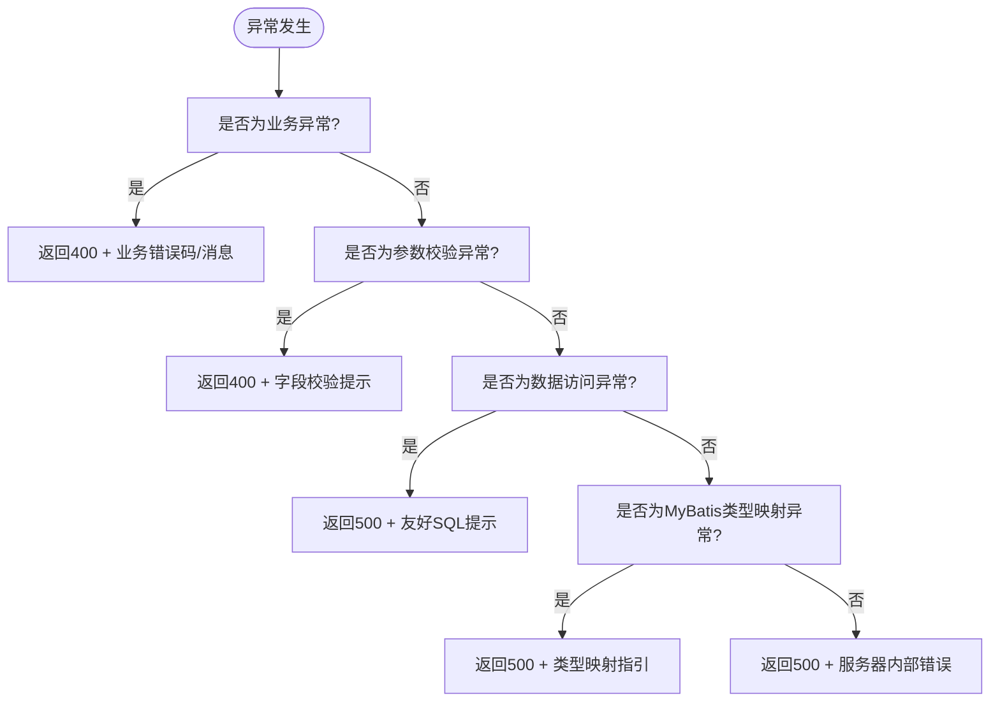

图表来源
- [GlobalExceptionHandler.java:1-107](file://backend/src/main/java/com/ypfr/loseweight/common/GlobalExceptionHandler.java#L1-L107)

章节来源
- [GlobalExceptionHandler.java:1-107](file://backend/src/main/java/com/ypfr/loseweight/common/GlobalExceptionHandler.java#L1-L107)

## 结论
本Controller层设计遵循Spring MVC最佳实践，通过统一响应、全局异常处理与鉴权解析器，实现了清晰的职责分离与一致的对外接口。典型控制器（认证、用户、记录、食品库）展示了参数绑定、校验、鉴权与响应封装的标准流程，适合在团队内推广与复用。

## 附录
- 配置要点
  - application.yml中配置了数据库连接、Tomcat参数、JWT密钥与上传目录等
  - WebConfig中配置了/CORS与RestTemplate超时

章节来源
- [application.yml:1-54](file://backend/src/main/resources/application.yml#L1-L54)
- [WebConfig.java:1-31](file://backend/src/main/java/com/ypfr/loseweight/config/WebConfig.java#L1-L31)