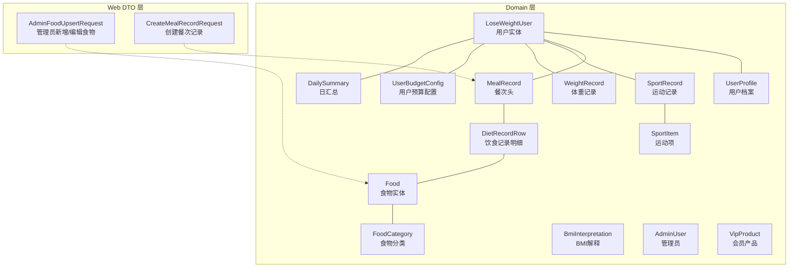
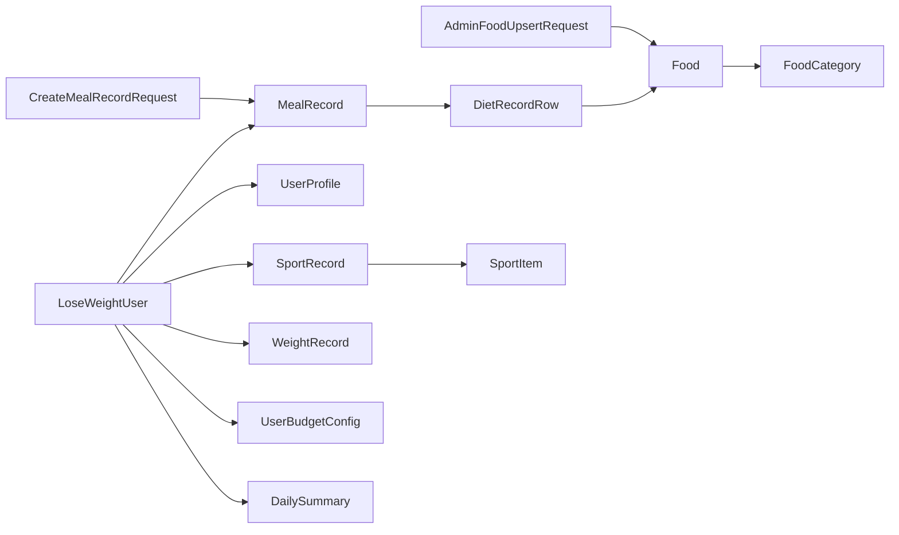

# Domain层设计

<cite>
**本文引用的文件**
- [LoseWeightUser.java](file://backend/src/main/java/com/ypfr/loseweight/domain/LoseWeightUser.java)
- [Food.java](file://backend/src/main/java/com/ypfr/loseweight/domain/Food.java)
- [DietRecordRow.java](file://backend/src/main/java/com/ypfr/loseweight/domain/DietRecordRow.java)
- [MealRecord.java](file://backend/src/main/java/com/ypfr/loseweight/domain/MealRecord.java)
- [SportRecord.java](file://backend/src/main/java/com/ypfr/loseweight/domain/SportRecord.java)
- [WeightRecord.java](file://backend/src/main/java/com/ypfr/loseweight/domain/WeightRecord.java)
- [UserProfile.java](file://backend/src/main/java/com/ypfr/loseweight/domain/UserProfile.java)
- [FoodCategory.java](file://backend/src/main/java/com/ypfr/loseweight/domain/FoodCategory.java)
- [SportItem.java](file://backend/src/main/java/com/ypfr/loseweight/domain/SportItem.java)
- [BmiInterpretation.java](file://backend/src/main/java/com/ypfr/loseweight/domain/BmiInterpretation.java)
- [AdminUser.java](file://backend/src/main/java/com/ypfr/loseweight/domain/AdminUser.java)
- [VipProduct.java](file://backend/src/main/java/com/ypfr/loseweight/domain/VipProduct.java)
- [UserBudgetConfig.java](file://backend/src/main/java/com/ypfr/loseweight/domain/UserBudgetConfig.java)
- [DailySummary.java](file://backend/src/main/java/com/ypfr/loseweight/domain/DailySummary.java)
- [AdminFoodUpsertRequest.java](file://backend/src/main/java/com/ypfr/loseweight/web/dto/admin/AdminFoodUpsertRequest.java)
- [CreateMealRecordRequest.java](file://backend/src/main/java/com/ypfr/loseweight/web/dto/CreateMealRecordRequest.java)
</cite>

## 目录
1. [引言](#引言)
2. [项目结构](#项目结构)
3. [核心组件](#核心组件)
4. [架构总览](#架构总览)
5. [详细组件分析](#详细组件分析)
6. [依赖分析](#依赖分析)
7. [性能考虑](#性能考虑)
8. [故障排查指南](#故障排查指南)
9. [结论](#结论)
10. [附录](#附录)

## 引言
本文件面向Domain层设计，系统性阐述业务建模中的实体类设计、业务规则封装、数据验证与领域对象生命周期管理。结合后端仓库中现有的实体类与DTO，给出基于JPA注解（MyBatis-Plus注解）的字段映射、关系映射、枚举类型应用、序列化处理与最佳实践建议，并以用户、饮食记录、食物、运动记录等典型实体为例，展示实体间关系、继承策略与数据转换流程。

## 项目结构
Domain层位于后端模块的domain包内，采用按“业务域”划分的文件组织方式，每个实体类对应数据库中的一个物理表或视图，通过注解完成ORM映射。同时，web层的DTO用于请求参数校验与跨层数据传输，作为Domain层与Web层之间的边界。



图表来源
- [LoseWeightUser.java:1-168](file://backend/src/main/java/com/ypfr/loseweight/domain/LoseWeightUser.java#L1-L168)
- [UserProfile.java:1-124](file://backend/src/main/java/com/ypfr/loseweight/domain/UserProfile.java#L1-L124)
- [MealRecord.java:1-125](file://backend/src/main/java/com/ypfr/loseweight/domain/MealRecord.java#L1-L125)
- [DietRecordRow.java:1-196](file://backend/src/main/java/com/ypfr/loseweight/domain/DietRecordRow.java#L1-L196)
- [Food.java:1-213](file://backend/src/main/java/com/ypfr/loseweight/domain/Food.java#L1-L213)
- [FoodCategory.java:1-83](file://backend/src/main/java/com/ypfr/loseweight/domain/FoodCategory.java#L1-L83)
- [SportRecord.java:1-124](file://backend/src/main/java/com/ypfr/loseweight/domain/SportRecord.java#L1-L124)
- [SportItem.java:1-131](file://backend/src/main/java/com/ypfr/loseweight/domain/SportItem.java#L1-L131)
- [WeightRecord.java:1-79](file://backend/src/main/java/com/ypfr/loseweight/domain/WeightRecord.java#L1-L79)
- [UserBudgetConfig.java:1-151](file://backend/src/main/java/com/ypfr/loseweight/domain/UserBudgetConfig.java#L1-L151)
- [DailySummary.java:1-218](file://backend/src/main/java/com/ypfr/loseweight/domain/DailySummary.java#L1-L218)
- [AdminFoodUpsertRequest.java:1-142](file://backend/src/main/java/com/ypfr/loseweight/web/dto/admin/AdminFoodUpsertRequest.java#L1-L142)
- [CreateMealRecordRequest.java:1-99](file://backend/src/main/java/com/ypfr/loseweight/web/dto/CreateMealRecordRequest.java#L1-L99)

章节来源
- [LoseWeightUser.java:1-168](file://backend/src/main/java/com/ypfr/loseweight/domain/LoseWeightUser.java#L1-L168)
- [Food.java:1-213](file://backend/src/main/java/com/ypfr/loseweight/domain/Food.java#L1-L213)
- [DietRecordRow.java:1-196](file://backend/src/main/java/com/ypfr/loseweight/domain/DietRecordRow.java#L1-L196)
- [MealRecord.java:1-125](file://backend/src/main/java/com/ypfr/loseweight/domain/MealRecord.java#L1-L125)
- [SportRecord.java:1-124](file://backend/src/main/java/com/ypfr/loseweight/domain/SportRecord.java#L1-L124)
- [WeightRecord.java:1-79](file://backend/src/main/java/com/ypfr/loseweight/domain/WeightRecord.java#L1-L79)
- [UserProfile.java:1-124](file://backend/src/main/java/com/ypfr/loseweight/domain/UserProfile.java#L1-L124)
- [FoodCategory.java:1-83](file://backend/src/main/java/com/ypfr/loseweight/domain/FoodCategory.java#L1-L83)
- [SportItem.java:1-131](file://backend/src/main/java/com/ypfr/loseweight/domain/SportItem.java#L1-L131)
- [BmiInterpretation.java:1-59](file://backend/src/main/java/com/ypfr/loseweight/domain/BmiInterpretation.java#L1-L59)
- [AdminUser.java:1-68](file://backend/src/main/java/com/ypfr/loseweight/domain/AdminUser.java#L1-L68)
- [VipProduct.java:1-104](file://backend/src/main/java/com/ypfr/loseweight/domain/VipProduct.java#L1-L104)
- [UserBudgetConfig.java:1-151](file://backend/src/main/java/com/ypfr/loseweight/domain/UserBudgetConfig.java#L1-L151)
- [DailySummary.java:1-218](file://backend/src/main/java/com/ypfr/loseweight/domain/DailySummary.java#L1-L218)
- [AdminFoodUpsertRequest.java:1-142](file://backend/src/main/java/com/ypfr/loseweight/web/dto/admin/AdminFoodUpsertRequest.java#L1-L142)
- [CreateMealRecordRequest.java:1-99](file://backend/src/main/java/com/ypfr/loseweight/web/dto/CreateMealRecordRequest.java#L1-L99)

## 核心组件
- 用户域：用户实体、用户档案、用户预算配置、BMI解释、管理员、会员产品
- 饮食域：食物、食物分类、餐次头、饮食记录明细、日汇总
- 运动域：运动项、运动记录
- 体重域：体重记录

这些实体共同构成减重业务的核心数据模型，覆盖从用户画像到日常摄入与消耗的全链路。

章节来源
- [LoseWeightUser.java:1-168](file://backend/src/main/java/com/ypfr/loseweight/domain/LoseWeightUser.java#L1-L168)
- [UserProfile.java:1-124](file://backend/src/main/java/com/ypfr/loseweight/domain/UserProfile.java#L1-L124)
- [UserBudgetConfig.java:1-151](file://backend/src/main/java/com/ypfr/loseweight/domain/UserBudgetConfig.java#L1-L151)
- [BmiInterpretation.java:1-59](file://backend/src/main/java/com/ypfr/loseweight/domain/BmiInterpretation.java#L1-L59)
- [AdminUser.java:1-68](file://backend/src/main/java/com/ypfr/loseweight/domain/AdminUser.java#L1-L68)
- [VipProduct.java:1-104](file://backend/src/main/java/com/ypfr/loseweight/domain/VipProduct.java#L1-L104)
- [Food.java:1-213](file://backend/src/main/java/com/ypfr/loseweight/domain/Food.java#L1-L213)
- [FoodCategory.java:1-83](file://backend/src/main/java/com/ypfr/loseweight/domain/FoodCategory.java#L1-L83)
- [MealRecord.java:1-125](file://backend/src/main/java/com/ypfr/loseweight/domain/MealRecord.java#L1-L125)
- [DietRecordRow.java:1-196](file://backend/src/main/java/com/ypfr/loseweight/domain/DietRecordRow.java#L1-L196)
- [DailySummary.java:1-218](file://backend/src/main/java/com/ypfr/loseweight/domain/DailySummary.java#L1-L218)
- [SportItem.java:1-131](file://backend/src/main/java/com/ypfr/loseweight/domain/SportItem.java#L1-L131)
- [SportRecord.java:1-124](file://backend/src/main/java/com/ypfr/loseweight/domain/SportRecord.java#L1-L124)
- [WeightRecord.java:1-79](file://backend/src/main/java/com/ypfr/loseweight/domain/WeightRecord.java#L1-L79)

## 架构总览
Domain层通过注解驱动的ORM映射，将数据库表结构与Java实体类一一对应。实体之间通过外键关系建立关联，形成清晰的业务模型。Web层的DTO负责输入校验与数据转换，避免直接暴露Domain实体，从而隔离业务规则与传输格式。

```mermaid
classDiagram
class LoseWeightUser
class UserProfile
class UserBudgetConfig
class Food
class FoodCategory
class MealRecord
class DietRecordRow
class DailySummary
class SportItem
class SportRecord
class WeightRecord
class BmiInterpretation
class AdminUser
class VipProduct
LoseWeightUser "1" o-- "1" UserProfile : "拥有"
LoseWeightUser "1" o-- "many" MealRecord : "记录"
MealRecord "1" "many" DietRecordRow : "包含"
DietRecordRow "1" --> "1" Food : "关联"
Food "1" --> "1" FoodCategory : "属于"
LoseWeightUser "1" o-- "many" SportRecord : "运动"
LoseWeightUser "1" o-- "many" WeightRecord : "体重"
LoseWeightUser "1" o-- "1" UserBudgetConfig : "预算"
LoseWeightUser "1" o-- "1" DailySummary : "日汇总"
SportRecord "1" --> "1" SportItem : "关联"
```

图表来源
- [LoseWeightUser.java:1-168](file://backend/src/main/java/com/ypfr/loseweight/domain/LoseWeightUser.java#L1-L168)
- [UserProfile.java:1-124](file://backend/src/main/java/com/ypfr/loseweight/domain/UserProfile.java#L1-L124)
- [UserBudgetConfig.java:1-151](file://backend/src/main/java/com/ypfr/loseweight/domain/UserBudgetConfig.java#L1-L151)
- [Food.java:1-213](file://backend/src/main/java/com/ypfr/loseweight/domain/Food.java#L1-L213)
- [FoodCategory.java:1-83](file://backend/src/main/java/com/ypfr/loseweight/domain/FoodCategory.java#L1-L83)
- [MealRecord.java:1-125](file://backend/src/main/java/com/ypfr/loseweight/domain/MealRecord.java#L1-L125)
- [DietRecordRow.java:1-196](file://backend/src/main/java/com/ypfr/loseweight/domain/DietRecordRow.java#L1-L196)
- [DailySummary.java:1-218](file://backend/src/main/java/com/ypfr/loseweight/domain/DailySummary.java#L1-L218)
- [SportItem.java:1-131](file://backend/src/main/java/com/ypfr/loseweight/domain/SportItem.java#L1-L131)
- [SportRecord.java:1-124](file://backend/src/main/java/com/ypfr/loseweight/domain/SportRecord.java#L1-L124)
- [WeightRecord.java:1-79](file://backend/src/main/java/com/ypfr/loseweight/domain/WeightRecord.java#L1-L79)

## 详细组件分析

### 用户实体（LoseWeightUser）
- 职责：承载用户身份信息、授权状态、注册来源与更新时间等。
- 关键点：
  - 使用自增主键注解标识主键。
  - 字段涵盖微信openid/unionid、昵称与头像授权状态、手机号绑定状态与时间、账户状态与注册来源等。
- 生命周期：由创建时间与更新时间字段体现，支持审计追踪。

章节来源
- [LoseWeightUser.java:1-168](file://backend/src/main/java/com/ypfr/loseweight/domain/LoseWeightUser.java#L1-L168)

### 用户档案（UserProfile）
- 职责：存储用户性别、年龄、身高、初始/当前/目标体重、目标达成日期与档案完成状态。
- 关键点：
  - 主键自增。
  - 与用户实体存在一对一关系，便于扩展用户画像维度。
- 业务规则：可结合BMI解释与预算配置计算目标达成情况。

章节来源
- [UserProfile.java:1-124](file://backend/src/main/java/com/ypfr/loseweight/domain/UserProfile.java#L1-L124)

### 用户预算配置（UserBudgetConfig）
- 职责：保存用户的BMR/TDEE、活动系数、推荐热量缺口与宏量目标（碳水/蛋白/脂）。
- 关键点：
  - 支持自定义BMR与生效日期，便于历史追溯。
  - 与用户实体一对一，确保预算配置与用户强绑定。
- 业务规则：预算配置是日汇总与报表的基础数据来源。

章节来源
- [UserBudgetConfig.java:1-151](file://backend/src/main/java/com/ypfr/loseweight/domain/UserBudgetConfig.java#L1-L151)

### 食物实体（Food）与食物分类（FoodCategory）
- 职责：食物实体描述食物名称、图片、GI等级、单位与标准重量、宏量与关键字等；食物分类描述分类层级、排序与状态。
- 关键点：
  - 字段映射包含特殊命名字段（如每百克卡路里、蛋白质/脂肪/碳水含量），需显式标注表字段名以避免ORM误映射。
  - JSON序列化时对字段进行别名映射，保证对外接口一致性。
  - 分类字段存在父级ID与排序号，支持树形结构。
- 业务规则：自定义食物标记与状态控制可见性与可用性。

章节来源
- [Food.java:1-213](file://backend/src/main/java/com/ypfr/loseweight/domain/Food.java#L1-L213)
- [FoodCategory.java:1-83](file://backend/src/main/java/com/ypfr/loseweight/domain/FoodCategory.java#L1-L83)

### 餐次头（MealRecord）与饮食记录明细（DietRecordRow）
- 职责：餐次头记录某天某一餐的总热量与宏量；明细记录具体食物条目及其总热量与宏量。
- 关键点：
  - 明细与食物实体建立关联，快照保留食物名称、图片与GI等级，便于历史追溯。
  - 记录时间与创建时间分离，支持异步识别与手动录入。
- 业务规则：通过餐次头聚合明细，形成每日摄入汇总。

章节来源
- [MealRecord.java:1-125](file://backend/src/main/java/com/ypfr/loseweight/domain/MealRecord.java#L1-L125)
- [DietRecordRow.java:1-196](file://backend/src/main/java/com/ypfr/loseweight/domain/DietRecordRow.java#L1-L196)

### 日汇总（DailySummary）
- 职责：按日汇总摄入、消耗、剩余热量与健康状态指标，以及进食窗口时长与首末餐时间。
- 关键点：
  - 汇总字段覆盖预算、实际摄入、运动消耗、缺口与宏量目标对比。
  - 健康饮食标志与日状态便于运营与分析。
- 业务规则：日汇总是周统计与仪表盘的核心数据源。

章节来源
- [DailySummary.java:1-218](file://backend/src/main/java/com/ypfr/loseweight/domain/DailySummary.java#L1-L218)

### 运动项（SportItem）与运动记录（SportRecord）
- 职责：运动项描述运动名称、图标与每60分钟消耗卡路里；运动记录记录某天某项运动的时长与消耗。
- 关键点：
  - 对于每分钟消耗的兼容序列化，隐藏原始每60分钟字段，避免前端歧义。
  - 图标快照便于展示与回溯。
- 业务规则：运动记录与运动项建立关联，支持多运动类型与自定义运动。

章节来源
- [SportItem.java:1-131](file://backend/src/main/java/com/ypfr/loseweight/domain/SportItem.java#L1-L131)
- [SportRecord.java:1-124](file://backend/src/main/java/com/ypfr/loseweight/domain/SportRecord.java#L1-L124)

### 体重记录（WeightRecord）
- 职责：记录用户每日体重、来源与备注。
- 关键点：
  - 与用户实体建立关联，支持多来源（如手动录入、设备同步）。
- 业务规则：体重趋势是目标达成与健康评估的重要依据。

章节来源
- [WeightRecord.java:1-79](file://backend/src/main/java/com/ypfr/loseweight/domain/WeightRecord.java#L1-L79)

### BMI解释（BmiInterpretation）
- 职责：按桶编码维护BMI解释文本与版本信息。
- 关键点：
  - 桶编码为主键，便于按区间检索与更新。
- 业务规则：与用户档案结合，提供个性化解读文案。

章节来源
- [BmiInterpretation.java:1-59](file://backend/src/main/java/com/ypfr/loseweight/domain/BmiInterpretation.java#L1-L59)

### 管理员（AdminUser）与会员产品（VipProduct）
- 职责：管理员实体支撑后台权限体系；会员产品实体描述会员套餐的价格、有效期与排序。
- 关键点：
  - 管理员状态与时间戳便于审计。
  - 会员产品启用状态与排序号支持营销策略。
- 业务规则：两者与用户域解耦，服务于运营与商业化。

章节来源
- [AdminUser.java:1-68](file://backend/src/main/java/com/ypfr/loseweight/domain/AdminUser.java#L1-L68)
- [VipProduct.java:1-104](file://backend/src/main/java/com/ypfr/loseweight/domain/VipProduct.java#L1-L104)

### Web DTO与验证
- 管理员新增/编辑食物请求（AdminFoodUpsertRequest）：对必填字段进行校验，确保食物基础信息完整。
- 创建餐次记录请求（CreateMealRecordRequest）：对餐次类型、食物名称、分量与记录时间等进行约束，保证输入质量。

章节来源
- [AdminFoodUpsertRequest.java:1-142](file://backend/src/main/java/com/ypfr/loseweight/web/dto/admin/AdminFoodUpsertRequest.java#L1-L142)
- [CreateMealRecordRequest.java:1-99](file://backend/src/main/java/com/ypfr/loseweight/web/dto/CreateMealRecordRequest.java#L1-L99)

## 依赖分析
- 实体间依赖：用户与档案、预算配置、餐次与明细、食物与分类、运动项与记录等形成清晰的一对一/一对多关系。
- 外部依赖：ORM注解（MyBatis-Plus）与JSON序列化注解（Jackson）用于映射与序列化。
- 控制耦合：Web DTO与Domain实体解耦，通过服务层进行转换与校验，降低跨层耦合。



图表来源
- [AdminFoodUpsertRequest.java:1-142](file://backend/src/main/java/com/ypfr/loseweight/web/dto/admin/AdminFoodUpsertRequest.java#L1-L142)
- [CreateMealRecordRequest.java:1-99](file://backend/src/main/java/com/ypfr/loseweight/web/dto/CreateMealRecordRequest.java#L1-L99)
- [LoseWeightUser.java:1-168](file://backend/src/main/java/com/ypfr/loseweight/domain/LoseWeightUser.java#L1-L168)
- [UserProfile.java:1-124](file://backend/src/main/java/com/ypfr/loseweight/domain/UserProfile.java#L1-L124)
- [UserBudgetConfig.java:1-151](file://backend/src/main/java/com/ypfr/loseweight/domain/UserBudgetConfig.java#L1-L151)
- [MealRecord.java:1-125](file://backend/src/main/java/com/ypfr/loseweight/domain/MealRecord.java#L1-L125)
- [DietRecordRow.java:1-196](file://backend/src/main/java/com/ypfr/loseweight/domain/DietRecordRow.java#L1-L196)
- [Food.java:1-213](file://backend/src/main/java/com/ypfr/loseweight/domain/Food.java#L1-L213)
- [FoodCategory.java:1-83](file://backend/src/main/java/com/ypfr/loseweight/domain/FoodCategory.java#L1-L83)
- [SportRecord.java:1-124](file://backend/src/main/java/com/ypfr/loseweight/domain/SportRecord.java#L1-L124)
- [SportItem.java:1-131](file://backend/src/main/java/com/ypfr/loseweight/domain/SportItem.java#L1-L131)
- [WeightRecord.java:1-79](file://backend/src/main/java/com/ypfr/loseweight/domain/WeightRecord.java#L1-L79)
- [DailySummary.java:1-218](file://backend/src/main/java/com/ypfr/loseweight/domain/DailySummary.java#L1-L218)

## 性能考虑
- 查询优化：对常用过滤条件（用户ID、日期范围、餐次类型、运动项ID）建立索引，减少全表扫描。
- 写入优化：批量插入餐次与明细，合并事务提交，降低锁竞争。
- 缓存策略：对热点配置（如BMI解释、食物分类、运动项）进行只读缓存，减少数据库压力。
- 数值精度：宏量与热量使用高精度数值类型，避免累积误差；序列化时统一舍入策略。
- DTO转换：在服务层集中进行Domain与DTO转换，避免重复映射逻辑。

## 故障排查指南
- 字段映射异常：检查特殊命名字段是否正确标注表字段名，避免ORM误映射。
- 序列化不一致：确认JSON别名与对外接口约定一致，避免前端解析错误。
- 数据缺失：核对快照字段（食物名称、图片、GI等级、运动图标）是否正确写入。
- 时间与时区：统一使用本地时间字符串格式，避免跨时区解析问题。
- 校验失败：关注DTO上的校验注解提示，优先修复必填字段与格式问题。

## 结论
Domain层通过严谨的实体设计与注解映射，将复杂的减重业务抽象为清晰的数据模型。配合Web DTO的输入校验与转换，实现了业务规则与传输格式的解耦。建议持续完善枚举与状态机、增强领域事件与审计日志，并在服务层补充业务规则封装，进一步提升系统的可维护性与扩展性。

## 附录

### JPA注解与字段映射最佳实践
- 表与主键：使用表注解声明表名，主键注解声明自增或输入主键策略。
- 字段映射：对特殊命名字段使用字段注解显式指定表字段名。
- JSON序列化：对对外字段使用序列化注解设置别名，隐藏内部实现细节。
- 只读字段：对仅用于DTO显示的字段使用非持久化注解，避免写入数据库。

### 关系映射与继承策略
- 一对一/一对多：通过外键字段与注解明确关系方向，保持模型稳定。
- 继承策略：当前实体多为扁平表映射，若需扩展可考虑单表继承策略，但需谨慎评估查询复杂度。

### 验证与规则实现
- 输入验证：在DTO层使用校验注解，确保关键字段非空与格式正确。
- 业务规则：在服务层封装业务规则（如预算计算、缺口判断、健康状态标记），避免分散在控制器或DAO层。
- 数据转换：统一在服务层进行Domain与DTO转换，必要时引入映射工具以减少样板代码。