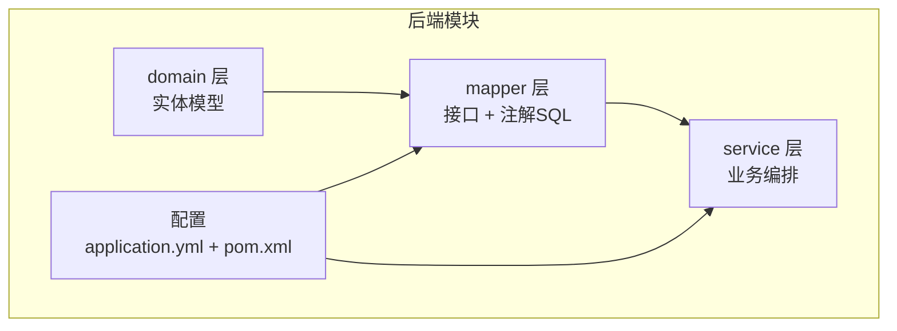
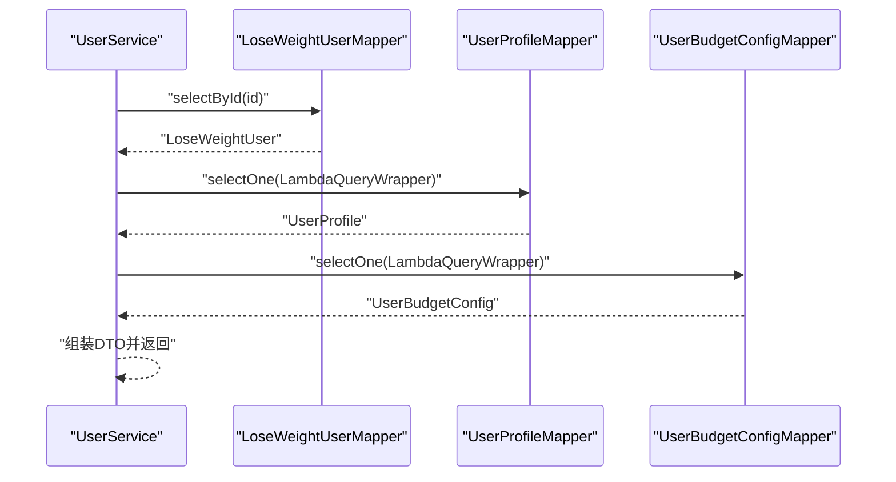
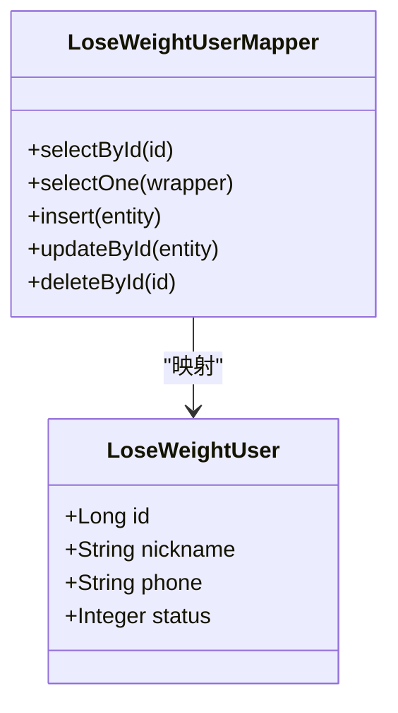
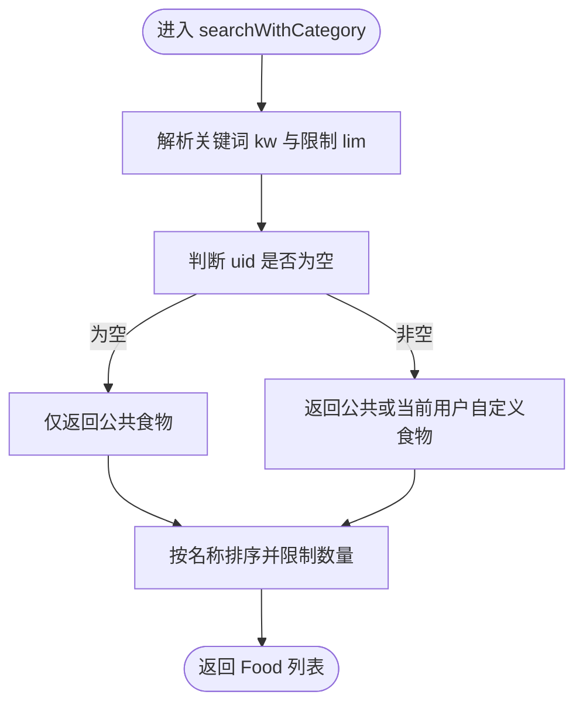
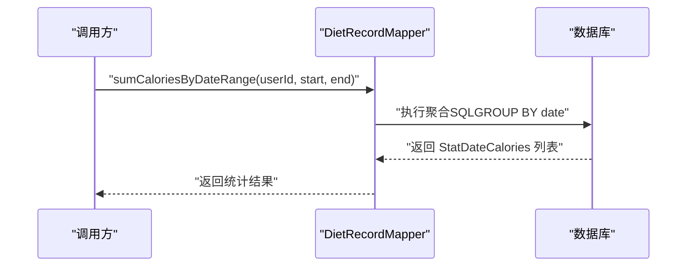
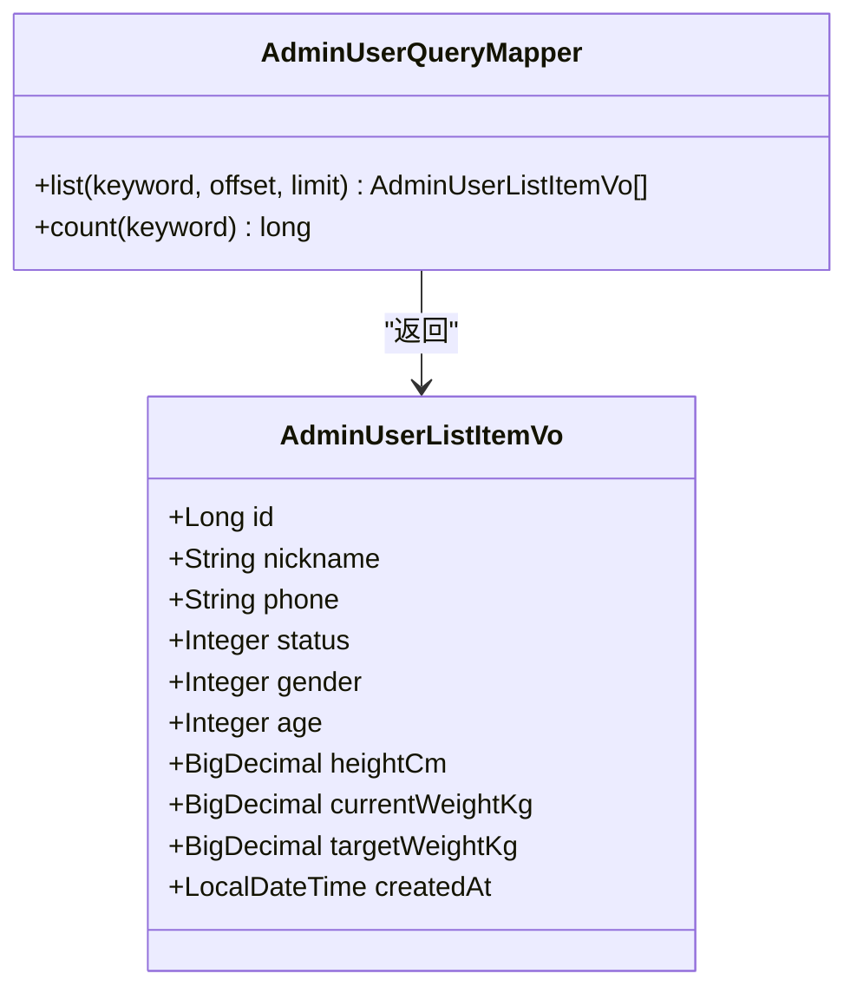
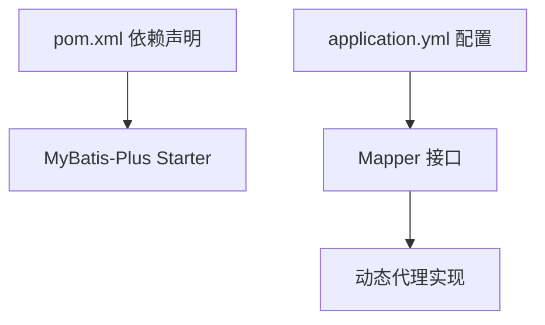

# Mapper层设计

<cite>
**本文引用的文件**
- [LoseWeightUserMapper.java](file://backend/src/main/java/com/ypfr/loseweight/mapper/LoseWeightUserMapper.java)
- [FoodMapper.java](file://backend/src/main/java/com/ypfr/loseweight/mapper/FoodMapper.java)
- [DietRecordMapper.java](file://backend/src/main/java/com/ypfr/loseweight/mapper/DietRecordMapper.java)
- [AdminUserMapper.java](file://backend/src/main/java/com/ypfr/loseweight/mapper/AdminUserMapper.java)
- [AdminUserQueryMapper.java](file://backend/src/main/java/com/ypfr/loseweight/mapper/AdminUserQueryMapper.java)
- [SportRecordMapper.java](file://backend/src/main/java/com/ypfr/loseweight/mapper/SportRecordMapper.java)
- [WeightRecordMapper.java](file://backend/src/main/java/com/ypfr/loseweight/mapper/WeightRecordMapper.java)
- [application.yml](file://backend/src/main/resources/application.yml)
- [pom.xml](file://backend/pom.xml)
- [LoseWeightUser.java](file://backend/src/main/java/com/ypfr/loseweight/domain/LoseWeightUser.java)
- [Food.java](file://backend/src/main/java/com/ypfr/loseweight/domain/Food.java)
- [DietRecordRow.java](file://backend/src/main/java/com/ypfr/loseweight/domain/DietRecordRow.java)
- [UserService.java](file://backend/src/main/java/com/ypfr/loseweight/service/UserService.java)
- [AdminUserListItemVo.java](file://backend/src/main/java/com/ypfr/loseweight/web/dto/admin/AdminUserListItemVo.java)
</cite>

## 目录
1. [引言](#引言)
2. [项目结构](#项目结构)
3. [核心组件](#核心组件)
4. [架构总览](#架构总览)
5. [详细组件分析](#详细组件分析)
6. [依赖分析](#依赖分析)
7. [性能考虑](#性能考虑)
8. [故障排查指南](#故障排查指南)
9. [结论](#结论)
10. [附录](#附录)

## 引言
本文件系统性阐述后端项目中Mapper层的设计与实现，重点围绕MyBatis-Plus框架在数据持久化中的应用，包括：
- Mapper接口的设计原则与职责边界
- XML映射文件的替代方案（注解式SQL）
- 条件构造器的使用与组合
- 动态代理与自动实现机制
- 高级特性：批量操作、分页查询、关联查询、聚合统计
- 典型数据访问模式：用户信息、饮食记录、食物等
- 复杂查询与事务处理最佳实践

## 项目结构
Mapper层位于后端模块的mapper包下，采用“领域模型 + Mapper接口”的清晰分层。每个Mapper接口通常继承MyBatis-Plus的BaseMapper，从而获得通用CRUD能力，并按需扩展自定义方法。

图表来源
- [application.yml:21-28](file://backend/src/main/resources/application.yml#L21-L28)
- [pom.xml:39-42](file://backend/pom.xml#L39-L42)

章节来源
- [application.yml:1-54](file://backend/src/main/resources/application.yml#L1-L54)
- [pom.xml:1-86](file://backend/pom.xml#L1-L86)

## 核心组件
- 基础能力：所有Mapper均继承MyBatis-Plus的BaseMapper，天然具备插入、更新、删除、分页查询、条件查询等能力。
- 自定义扩展：通过注解方式提供特定查询或聚合统计，避免XML映射文件，提升可维护性。
- 关联查询：在Mapper中直接进行JOIN查询，返回聚合结果对象或DTO。
- 统一配置：MyBatis-Plus全局配置开启驼峰映射与日志输出，便于调试。

章节来源
- [LoseWeightUserMapper.java:1-9](file://backend/src/main/java/com/ypfr/loseweight/mapper/LoseWeightUserMapper.java#L1-L9)
- [FoodMapper.java:1-69](file://backend/src/main/java/com/ypfr/loseweight/mapper/FoodMapper.java#L1-L69)
- [DietRecordMapper.java:1-55](file://backend/src/main/java/com/ypfr/loseweight/mapper/DietRecordMapper.java#L1-L55)
- [AdminUserQueryMapper.java:1-41](file://backend/src/main/java/com/ypfr/loseweight/mapper/AdminUserQueryMapper.java#L1-L41)
- [application.yml:21-28](file://backend/src/main/resources/application.yml#L21-L28)

## 架构总览
Mapper层与Service层协作，Service负责业务编排与事务控制，Mapper专注数据访问与SQL组织。MyBatis-Plus通过扫描Mapper接口生成动态代理，自动注入SQL执行逻辑。

图表来源
- [UserService.java:56-64](file://backend/src/main/java/com/ypfr/loseweight/service/UserService.java#L56-L64)
- [LoseWeightUserMapper.java:1-9](file://backend/src/main/java/com/ypfr/loseweight/mapper/LoseWeightUserMapper.java#L1-L9)
- [application.yml:21-28](file://backend/src/main/resources/application.yml#L21-L28)

## 详细组件分析

### 用户信息Mapper设计
- 接口职责：提供用户主表lw_user的读写能力，配合UserProfile与UserBudgetConfig完成用户档案与预算配置的读取与更新。
- 设计要点：
  - 继承BaseMapper，获得标准CRUD与分页能力
  - 与Service层配合，使用LambdaQueryWrapper进行条件查询
  - 与领域模型LoseWeightUser保持一一对应

图表来源
- [LoseWeightUserMapper.java:1-9](file://backend/src/main/java/com/ypfr/loseweight/mapper/LoseWeightUserMapper.java#L1-L9)
- [LoseWeightUser.java:1-168](file://backend/src/main/java/com/ypfr/loseweight/domain/LoseWeightUser.java#L1-L168)

章节来源
- [LoseWeightUserMapper.java:1-9](file://backend/src/main/java/com/ypfr/loseweight/mapper/LoseWeightUserMapper.java#L1-L9)
- [LoseWeightUser.java:1-168](file://backend/src/main/java/com/ypfr/loseweight/domain/LoseWeightUser.java#L1-L168)
- [UserService.java:56-64](file://backend/src/main/java/com/ypfr/loseweight/service/UserService.java#L56-L64)

### 食物Mapper设计与搜索策略
- 接口职责：提供食物表food的读写能力，并实现多维度搜索与聚合统计。
- 自定义方法：
  - searchWithCategory：支持关键词模糊匹配、用户可见性过滤、限制返回数量
  - searchInCommonBucket：公共分类(common) + 当前用户自定义食物，可选关键词
  - searchInCategoryCode：指定分类code（非common）时的公共库查询，支持用户自定义扩展
- 设计要点：
  - 使用注解SQL与OGNL动态拼接，灵活处理可选参数
  - 返回类型包含category字段，便于前端展示
  - 通过limit控制结果规模，避免过度加载

图表来源
- [FoodMapper.java:13-27](file://backend/src/main/java/com/ypfr/loseweight/mapper/FoodMapper.java#L13-L27)

章节来源
- [FoodMapper.java:1-69](file://backend/src/main/java/com/ypfr/loseweight/mapper/FoodMapper.java#L1-L69)
- [Food.java:1-213](file://backend/src/main/java/com/ypfr/loseweight/domain/Food.java#L1-L213)

### 饮食记录Mapper设计与统计
- 接口职责：提供饮食记录表diet_record的读写能力，并实现按用户与日期范围的聚合统计。
- 自定义方法：
  - sumCaloriesByUserAndDate：单日总热量
  - sumCaloriesByDateRange：按日期范围聚合总热量
  - selectMealWindowsByDateRange：按日期范围统计首尾用餐时间窗口
  - sumMacrosByDateRange：按日期范围聚合宏量营养素（蛋白质、脂肪、碳水）
- 设计要点：
  - 使用COALESCE处理NULL值，确保统计结果稳定
  - 返回专门的统计行对象（如StatDateCalories），避免ORM字段映射歧义
  - 日期范围查询广泛用于报表与趋势分析

图表来源
- [DietRecordMapper.java:23-31](file://backend/src/main/java/com/ypfr/loseweight/mapper/DietRecordMapper.java#L23-L31)

章节来源
- [DietRecordMapper.java:1-55](file://backend/src/main/java/com/ypfr/loseweight/mapper/DietRecordMapper.java#L1-L55)
- [DietRecordRow.java:1-196](file://backend/src/main/java/com/ypfr/loseweight/domain/DietRecordRow.java#L1-L196)

### 后台用户列表Mapper设计
- 接口职责：提供后台用户列表查询与总数统计，支持关键词过滤。
- 自定义方法：
  - list：分页查询用户及其档案信息，使用LEFT JOIN关联用户档案
  - count：根据关键词统计总数
- 设计要点：
  - 使用<where>与<if>标签实现动态条件拼接
  - 返回AdminUserListItemVo，避免泄露过多内部字段
  - offset+limit实现传统分页

图表来源
- [AdminUserQueryMapper.java:1-41](file://backend/src/main/java/com/ypfr/loseweight/mapper/AdminUserQueryMapper.java#L1-L41)
- [AdminUserListItemVo.java:1-99](file://backend/src/main/java/com/ypfr/loseweight/web/dto/admin/AdminUserListItemVo.java#L1-L99)

章节来源
- [AdminUserQueryMapper.java:1-41](file://backend/src/main/java/com/ypfr/loseweight/mapper/AdminUserQueryMapper.java#L1-L41)
- [AdminUserListItemVo.java:1-99](file://backend/src/main/java/com/ypfr/loseweight/web/dto/admin/AdminUserListItemVo.java#L1-L99)

### 运动记录Mapper设计
- 接口职责：提供运动记录表sport_record的读写能力，并实现按用户与日期范围的热量消耗聚合。
- 自定义方法：
  - sumCaloriesByUserAndDate：单日消耗总热量
  - sumCaloriesByDateRange：按日期范围聚合总消耗
- 设计要点：
  - 与饮食记录Mapper保持一致的统计风格
  - 返回StatDateCalories，统一统计对象

章节来源
- [SportRecordMapper.java:1-31](file://backend/src/main/java/com/ypfr/loseweight/mapper/SportRecordMapper.java#L1-L31)

### 体重记录Mapper设计
- 接口职责：提供体重记录表weight_record的读写能力。
- 设计要点：
  - 采用BaseMapper，无需额外注解
  - 与UserService协作，用于计算“距离上次称重的天数”等指标

章节来源
- [WeightRecordMapper.java:1-9](file://backend/src/main/java/com/ypfr/loseweight/mapper/WeightRecordMapper.java#L1-L9)

## 依赖分析
- MyBatis-Plus依赖：通过starter引入，版本号在pom中统一管理
- 数据源与连接：application.yml中配置MySQL连接、MyBatis-Plus全局配置（驼峰映射、日志实现）
- Mapper扫描：Spring Boot自动扫描mapper包下的接口，结合BaseMapper生成动态代理

图表来源
- [pom.xml:39-42](file://backend/pom.xml#L39-L42)
- [application.yml:21-28](file://backend/src/main/resources/application.yml#L21-L28)

章节来源
- [pom.xml:1-86](file://backend/pom.xml#L1-L86)
- [application.yml:1-54](file://backend/src/main/resources/application.yml#L1-L54)

## 性能考虑
- SQL优化
  - 使用LIMIT限制结果集大小，避免全表扫描
  - 在高频查询上建立合适的索引（如用户维度、日期维度）
- 统计查询
  - 聚合查询尽量在数据库侧完成，减少Java侧二次处理
  - 使用COALESCE处理NULL，避免空指针与额外判断
- 分页策略
  - 使用offset+limit的传统分页，注意大数据量场景下的性能
  - 对于超大分页，建议使用基于游标或基于时间戳的分页方案
- 日志与监控
  - 开启MyBatis日志输出，便于定位慢查询
  - 结合数据库慢查询日志与AOP切面监控Mapper执行耗时

## 故障排查指南
- SQL语法错误
  - 检查注解SQL中的拼接逻辑，确认OGNL表达式正确
  - 使用<where>与<if>标签时，注意条件之间的逻辑关系
- 字段映射问题
  - 确认驼峰映射已启用（application.yml中已配置）
  - 对于特殊字段名（如calories_per_100g），使用@TableField显式映射
- 参数传递异常
  - 确保@Param命名与SQL中参数名一致
  - 对可选参数进行判空处理，避免拼接错误
- 查询性能问题
  - 审核WHERE条件与JOIN字段是否命中索引
  - 对高频统计查询增加复合索引或物化视图

章节来源
- [application.yml:21-28](file://backend/src/main/resources/application.yml#L21-L28)
- [Food.java:22-46](file://backend/src/main/java/com/ypfr/loseweight/domain/Food.java#L22-L46)

## 结论
本项目的Mapper层以MyBatis-Plus为基础，结合注解式SQL与条件构造器，实现了高内聚、低耦合的数据访问层。通过明确的接口职责、统一的统计对象与完善的配置，既满足了日常CRUD需求，也支撑了复杂的统计与报表场景。建议在后续演进中持续关注索引优化、分页策略与日志监控，以进一步提升系统稳定性与性能。

## 附录
- 最佳实践清单
  - 优先使用BaseMapper提供的通用方法，减少重复SQL
  - 自定义查询尽量使用LambdaQueryWrapper与注解SQL组合，提高可读性
  - 统一返回DTO或统计行对象，避免ORM字段歧义
  - 对高频查询建立索引，定期分析慢查询
  - 使用事务包装跨表更新，确保数据一致性