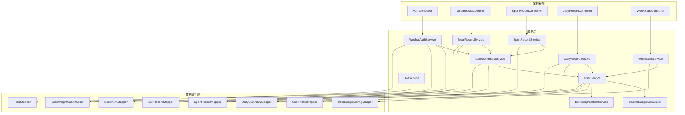
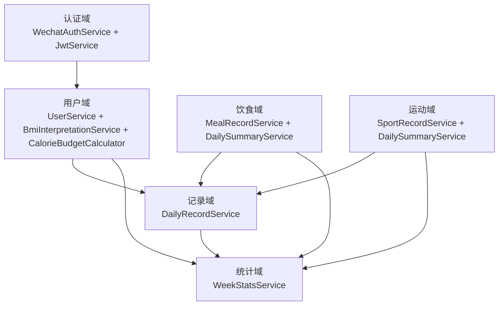
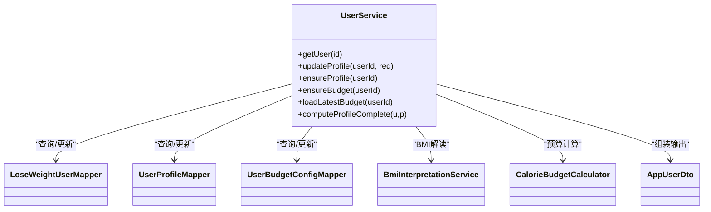
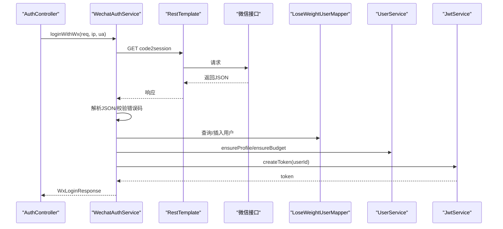
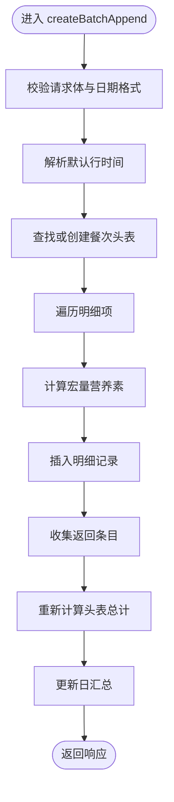
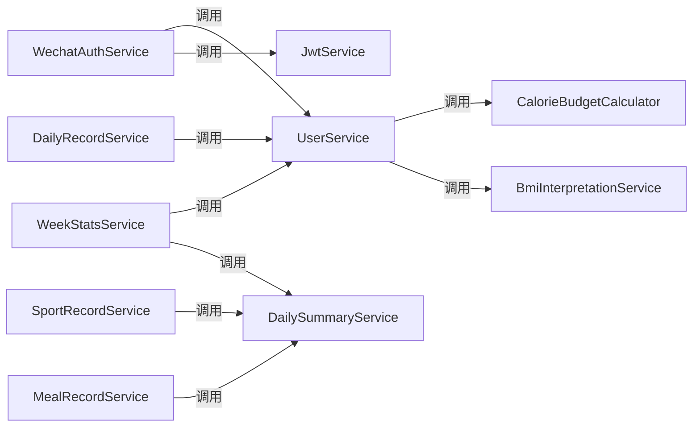

# Service层设计

<cite>
**本文引用的文件**
- [UserService.java](file://backend/src/main/java/com/ypfr/loseweight/service/UserService.java)
- [WechatAuthService.java](file://backend/src/main/java/com/ypfr/loseweight/service/WechatAuthService.java)
- [DailyRecordService.java](file://backend/src/main/java/com/ypfr/loseweight/service/DailyRecordService.java)
- [DailySummaryService.java](file://backend/src/main/java/com/ypfr/loseweight/service/DailySummaryService.java)
- [MealRecordService.java](file://backend/src/main/java/com/ypfr/loseweight/service/MealRecordService.java)
- [SportRecordService.java](file://backend/src/main/java/com/ypfr/loseweight/service/SportRecordService.java)
- [WeekStatsService.java](file://backend/src/main/java/com/ypfr/loseweight/service/WeekStatsService.java)
- [CalorieBudgetCalculator.java](file://backend/src/main/java/com/ypfr/loseweight/service/CalorieBudgetCalculator.java)
- [BmiInterpretationService.java](file://backend/src/main/java/com/ypfr/loseweight/service/BmiInterpretationService.java)
- [JwtService.java](file://backend/src/main/java/com/ypfr/loseweight/service/JwtService.java)
- [LoseWeightUserMapper.java](file://backend/src/main/java/com/ypfr/loseweight/mapper/LoseWeightUserMapper.java)
- [AppUserDto.java](file://backend/src/main/java/com/ypfr/loseweight/web/dto/AppUserDto.java)
- [WxLoginRequest.java](file://backend/src/main/java/com/ypfr/loseweight/web/dto/WxLoginRequest.java)
- [CreateMealRecordRequest.java](file://backend/src/main/java/com/ypfr/loseweight/web/dto/CreateMealRecordRequest.java)
- [CreateSportRecordRequest.java](file://backend/src/main/java/com/ypfr/loseweight/web/dto/CreateSportRecordRequest.java)
</cite>

## 目录
1. [简介](#简介)
2. [项目结构](#项目结构)
3. [核心组件](#核心组件)
4. [架构总览](#架构总览)
5. [详细组件分析](#详细组件分析)
6. [依赖分析](#依赖分析)
7. [性能考虑](#性能考虑)
8. [故障排查指南](#故障排查指南)
9. [结论](#结论)
10. [附录](#附录)

## 简介
本文件系统性梳理后端Service层的设计与实现，聚焦其在业务逻辑编排、事务管理、服务组合与业务规则落地中的核心职责。Service层作为Controller与Mapper之间的桥梁，负责：
- 接收Controller传入的DTO参数，完成参数校验与预处理
- 组合多个Mapper执行数据读写，确保业务一致性
- 实现关键业务规则（如热量预算、BMI解读、汇总计算）
- 管理事务边界，保障跨表写入的一致性
- 通过依赖注入解耦组件，提升可测试性与可维护性
- 提供统一的异常与日志策略，便于问题定位与监控

## 项目结构
Service层位于后端模块的service包下，围绕用户域、饮食、运动、汇总与统计等维度划分功能模块。各Service通过构造器注入所需Mapper与其它Service，遵循单一职责与高内聚低耦合原则。

图表来源
- [UserService.java:25-54](file://backend/src/main/java/com/ypfr/loseweight/service/UserService.java#L25-L54)
- [WechatAuthService.java:42-59](file://backend/src/main/java/com/ypfr/loseweight/service/WechatAuthService.java#L42-L59)
- [MealRecordService.java:39-48](file://backend/src/main/java/com/ypfr/loseweight/service/MealRecordService.java#L39-L48)
- [SportRecordService.java:24-31](file://backend/src/main/java/com/ypfr/loseweight/service/SportRecordService.java#L24-L31)
- [DailySummaryService.java:25-34](file://backend/src/main/java/com/ypfr/loseweight/service/DailySummaryService.java#L25-L34)
- [DailyRecordService.java:31-42](file://backend/src/main/java/com/ypfr/loseweight/service/DailyRecordService.java#L31-L42)
- [WeekStatsService.java:30-37](file://backend/src/main/java/com/ypfr/loseweight/service/WeekStatsService.java#L30-L37)
- [JwtService.java:20-27](file://backend/src/main/java/com/ypfr/loseweight/service/JwtService.java#L20-L27)
- [BmiInterpretationService.java:25-27](file://backend/src/main/java/com/ypfr/loseweight/service/BmiInterpretationService.java#L25-L27)
- [CalorieBudgetCalculator.java:11-14](file://backend/src/main/java/com/ypfr/loseweight/service/CalorieBudgetCalculator.java#L11-L14)

章节来源
- [UserService.java:25-54](file://backend/src/main/java/com/ypfr/loseweight/service/UserService.java#L25-L54)
- [WechatAuthService.java:42-59](file://backend/src/main/java/com/ypfr/loseweight/service/WechatAuthService.java#L42-L59)
- [MealRecordService.java:39-48](file://backend/src/main/java/com/ypfr/loseweight/service/MealRecordService.java#L39-L48)
- [SportRecordService.java:24-31](file://backend/src/main/java/com/ypfr/loseweight/service/SportRecordService.java#L24-L31)
- [DailySummaryService.java:25-34](file://backend/src/main/java/com/ypfr/loseweight/service/DailySummaryService.java#L25-L34)
- [DailyRecordService.java:31-42](file://backend/src/main/java/com/ypfr/loseweight/service/DailyRecordService.java#L31-L42)
- [WeekStatsService.java:30-37](file://backend/src/main/java/com/ypfr/loseweight/service/WeekStatsService.java#L30-L37)
- [JwtService.java:20-27](file://backend/src/main/java/com/ypfr/loseweight/service/JwtService.java#L20-L27)
- [BmiInterpretationService.java:25-27](file://backend/src/main/java/com/ypfr/loseweight/service/BmiInterpretationService.java#L25-L27)
- [CalorieBudgetCalculator.java:11-14](file://backend/src/main/java/com/ypfr/loseweight/service/CalorieBudgetCalculator.java#L11-L14)

## 核心组件
- 用户服务（UserService）：负责用户档案、预算配置与BMI解读的聚合查询与更新，提供AppUserDto输出模型。
- 微信认证服务（WechatAuthService）：封装小程序登录、UnionId补录、手机号绑定与登录日志记录。
- 饮食记录服务（MealRecordService）：单条/批量创建饮食记录，计算宏量营养素，维护餐次头表与明细表，并触发日汇总。
- 运动记录服务（SportRecordService）：创建/删除运动记录，按日汇总运动消耗。
- 日汇总服务（DailySummaryService）：按日聚合摄入、消耗、宏量与窗口时长，计算缺口与目标。
- 日常记录服务（DailyRecordService）：整合当日饮食与运动，生成时间线与宏量目标。
- 周统计服务（WeekStatsService）：基于日汇总构建周报卡片数据。
- 计算器（CalorieBudgetCalculator）：BMR/TDEE/每日预算计算工具类。
- BMI解读服务（BmiInterpretationService）：根据身高体重计算BMI并返回解读文案。
- JWT服务（JwtService）：令牌签发与解析，校验登录态。

章节来源
- [UserService.java:26-319](file://backend/src/main/java/com/ypfr/loseweight/service/UserService.java#L26-L319)
- [WechatAuthService.java:28-233](file://backend/src/main/java/com/ypfr/loseweight/service/WechatAuthService.java#L28-L233)
- [MealRecordService.java:29-435](file://backend/src/main/java/com/ypfr/loseweight/service/MealRecordService.java#L29-L435)
- [SportRecordService.java:18-111](file://backend/src/main/java/com/ypfr/loseweight/service/SportRecordService.java#L18-L111)
- [DailySummaryService.java:18-165](file://backend/src/main/java/com/ypfr/loseweight/service/DailySummaryService.java#L18-L165)
- [DailyRecordService.java:21-178](file://backend/src/main/java/com/ypfr/loseweight/service/DailyRecordService.java#L21-L178)
- [WeekStatsService.java:22-304](file://backend/src/main/java/com/ypfr/loseweight/service/WeekStatsService.java#L22-L304)
- [CalorieBudgetCalculator.java:11-142](file://backend/src/main/java/com/ypfr/loseweight/service/CalorieBudgetCalculator.java#L11-L142)
- [BmiInterpretationService.java:14-94](file://backend/src/main/java/com/ypfr/loseweight/service/BmiInterpretationService.java#L14-L94)
- [JwtService.java:15-58](file://backend/src/main/java/com/ypfr/loseweight/service/JwtService.java#L15-L58)

## 架构总览
Service层采用“面向领域”的模块化组织，围绕用户、饮食、运动、汇总与统计五大主题展开。Service之间通过方法调用形成清晰的协作链路，既保证了业务规则的集中实现，也避免了重复逻辑。

图表来源
- [UserService.java:26-319](file://backend/src/main/java/com/ypfr/loseweight/service/UserService.java#L26-L319)
- [WechatAuthService.java:28-233](file://backend/src/main/java/com/ypfr/loseweight/service/WechatAuthService.java#L28-L233)
- [MealRecordService.java:29-435](file://backend/src/main/java/com/ypfr/loseweight/service/MealRecordService.java#L29-L435)
- [SportRecordService.java:18-111](file://backend/src/main/java/com/ypfr/loseweight/service/SportRecordService.java#L18-L111)
- [DailyRecordService.java:21-178](file://backend/src/main/java/com/ypfr/loseweight/service/DailyRecordService.java#L21-L178)
- [WeekStatsService.java:22-304](file://backend/src/main/java/com/ypfr/loseweight/service/WeekStatsService.java#L22-L304)

## 详细组件分析

### 用户服务（UserService）
职责
- 获取用户信息并组装AppUserDto
- 更新用户资料与预算配置，自动补齐初始体重与完成度
- 计算BMI解读文本，附加“我的”页统计数据（餐次数、健康饮食天数、加入天数、最近称重距今天数）

关键点
- 依赖注入：LoseWeightUserMapper、UserProfileMapper、UserBudgetConfigMapper、AvatarStorageService、BmiInterpretationService、MealRecordMapper、DailySummaryMapper、WeightRecordMapper
- 业务规则：当首次完善资料时自动设置初始体重；使用CalorieBudgetCalculator应用至档案与预算
- 输出模型：AppUserDto，包含基础信息、BMI解读、统计指标

图表来源
- [UserService.java:26-319](file://backend/src/main/java/com/ypfr/loseweight/service/UserService.java#L26-L319)
- [AppUserDto.java:7-210](file://backend/src/main/java/com/ypfr/loseweight/web/dto/AppUserDto.java#L7-L210)
- [BmiInterpretationService.java:14-94](file://backend/src/main/java/com/ypfr/loseweight/service/BmiInterpretationService.java#L14-L94)
- [CalorieBudgetCalculator.java:11-142](file://backend/src/main/java/com/ypfr/loseweight/service/CalorieBudgetCalculator.java#L11-L142)
- [LoseWeightUserMapper.java:1-9](file://backend/src/main/java/com/ypfr/loseweight/mapper/LoseWeightUserMapper.java#L1-L9)

章节来源
- [UserService.java:26-319](file://backend/src/main/java/com/ypfr/loseweight/service/UserService.java#L26-L319)
- [AppUserDto.java:7-210](file://backend/src/main/java/com/ypfr/loseweight/web/dto/AppUserDto.java#L7-L210)

### 微信认证服务（WechatAuthService）
职责
- 小程序登录：调用微信JS-Code2Session换取openid/unionid，创建或补录用户，发放JWT
- 手机号绑定：使用全局access_token调用微信手机号接口，回写用户手机号
- 登录日志：记录每次登录结果与客户端信息

关键点
- 依赖注入：RestTemplate、ObjectMapper、WechatMiniappProperties、LoseWeightUserMapper、WechatLoginLogMapper、JwtService、WechatAccessTokenService、UserService
- 异常处理：对微信接口调用失败、响应解析失败、登录失败等情况进行统一异常抛出
- 事务边界：登录与用户资料初始化在同一流程中，由Spring事务保障一致性

图表来源
- [WechatAuthService.java:64-153](file://backend/src/main/java/com/ypfr/loseweight/service/WechatAuthService.java#L64-L153)
- [JwtService.java:29-37](file://backend/src/main/java/com/ypfr/loseweight/service/JwtService.java#L29-L37)
- [UserService.java:166-193](file://backend/src/main/java/com/ypfr/loseweight/service/UserService.java#L166-L193)

章节来源
- [WechatAuthService.java:28-233](file://backend/src/main/java/com/ypfr/loseweight/service/WechatAuthService.java#L28-L233)
- [WxLoginRequest.java:5-64](file://backend/src/main/java/com/ypfr/loseweight/web/dto/WxLoginRequest.java#L5-L64)

### 饮食记录服务（MealRecordService）
职责
- 创建单条饮食记录：计算宏量营养素、写入餐次头表与明细表
- 批量追加：在同一餐次下批量写入明细，自动合并默认时间与校验约束
- 删除记录：删除明细后若无剩余明细则删除头表，否则重新计算头表总计
- 触发日汇总：每次变更后尝试更新对应日期的日汇总

关键点
- 事务管理：批量追加使用@Transactional确保原子性
- 业务规则：支持按克或标准单位换算，优先使用食物库标准值；若无食物库则允许直接输入宏量
- 数据一致性：删除后同步刷新头表总计，避免脏数据

图表来源
- [MealRecordService.java:119-219](file://backend/src/main/java/com/ypfr/loseweight/service/MealRecordService.java#L119-L219)

章节来源
- [MealRecordService.java:29-435](file://backend/src/main/java/com/ypfr/loseweight/service/MealRecordService.java#L29-L435)
- [CreateMealRecordRequest.java:5-99](file://backend/src/main/java/com/ypfr/loseweight/web/dto/CreateMealRecordRequest.java#L5-L99)

### 运动记录服务（SportRecordService）
职责
- 创建运动记录：根据运动项基准或手动输入计算消耗
- 删除运动记录：删除后触发对应日期的日汇总更新
- 列表查询：按日返回运动记录列表

关键点
- 业务规则：优先使用运动项基准（每60分钟消耗），否则允许手动输入消耗
- 事务边界：删除后异步更新日汇总（异常被吞，不影响主流程）

章节来源
- [SportRecordService.java:18-111](file://backend/src/main/java/com/ypfr/loseweight/service/SportRecordService.java#L18-L111)
- [CreateSportRecordRequest.java:3-51](file://backend/src/main/java/com/ypfr/loseweight/web/dto/CreateSportRecordRequest.java#L3-L51)

### 日汇总服务（DailySummaryService）
职责
- 按日汇总：计算摄入、运动、剩余、缺口、宏量与进食窗口时长
- 写入策略：当某日无任何有效数据时删除旧记录；否则新增或更新
- 依赖预算：从用户最新预算配置读取TDEE、目标摄入与宏量目标

关键点
- 数学运算：使用BigDecimal保证精度，四舍五入到指定位数
- 时间窗口：首餐到末餐的时长计算，单条记录时给予合理最小值

章节来源
- [DailySummaryService.java:18-165](file://backend/src/main/java/com/ypfr/loseweight/service/DailySummaryService.java#L18-L165)

### 日常记录服务（DailyRecordService）
职责
- 整合当日数据：汇总摄入与运动，计算宏量目标，生成时间线
- 宏量目标：从用户预算配置读取碳水、脂肪、蛋白质目标，若未设置则使用默认值

章节来源
- [DailyRecordService.java:21-178](file://backend/src/main/java/com/ypfr/loseweight/service/DailyRecordService.java#L21-L178)

### 周统计服务（WeekStatsService）
职责
- 区间统计：按起止日期聚合日汇总，计算平均缺口、平均摄入、平均运动与平均进食窗口
- 指标计算：TDEE与日目标由用户档案与预算配置推导
- 可视化数据：构建周报卡片数据结构

章节来源
- [WeekStatsService.java:22-304](file://backend/src/main/java/com/ypfr/loseweight/service/WeekStatsService.java#L22-L304)

### BMI解读服务（BmiInterpretationService）
职责
- BMI分桶：依据WHO标准进行体重分桶
- 文案解析：优先从数据库读取，失败时返回内置兜底文案
- 日志记录：异常时记录warn日志并返回兜底文案

章节来源
- [BmiInterpretationService.java:14-94](file://backend/src/main/java/com/ypfr/loseweight/service/BmiInterpretationService.java#L14-L94)

### JWT服务（JwtService）
职责
- 令牌签发：基于HS256签名，设置过期时间
- 令牌解析：校验签名与有效期，解析用户ID

章节来源
- [JwtService.java:15-58](file://backend/src/main/java/com/ypfr/loseweight/service/JwtService.java#L15-L58)

## 依赖分析
- 组件内聚：每个Service聚焦单一领域，内部职责清晰
- 组件耦合：Service之间通过方法调用协作，避免循环依赖
- 外部依赖：RestTemplate用于微信接口调用；MyBatis-Plus Mapper提供数据访问能力
- 事务边界：MealRecordService的批量追加使用@Transactional，确保跨表写入一致性

图表来源
- [WechatAuthService.java:42-59](file://backend/src/main/java/com/ypfr/loseweight/service/WechatAuthService.java#L42-L59)
- [UserService.java:28-54](file://backend/src/main/java/com/ypfr/loseweight/service/UserService.java#L28-L54)
- [MealRecordService.java:39-48](file://backend/src/main/java/com/ypfr/loseweight/service/MealRecordService.java#L39-L48)
- [SportRecordService.java:24-31](file://backend/src/main/java/com/ypfr/loseweight/service/SportRecordService.java#L24-L31)
- [DailyRecordService.java:31-42](file://backend/src/main/java/com/ypfr/loseweight/service/DailyRecordService.java#L31-L42)
- [WeekStatsService.java:30-37](file://backend/src/main/java/com/ypfr/loseweight/service/WeekStatsService.java#L30-L37)

章节来源
- [WechatAuthService.java:42-59](file://backend/src/main/java/com/ypfr/loseweight/service/WechatAuthService.java#L42-L59)
- [UserService.java:28-54](file://backend/src/main/java/com/ypfr/loseweight/service/UserService.java#L28-L54)
- [MealRecordService.java:39-48](file://backend/src/main/java/com/ypfr/loseweight/service/MealRecordService.java#L39-L48)
- [SportRecordService.java:24-31](file://backend/src/main/java/com/ypfr/loseweight/service/SportRecordService.java#L24-L31)
- [DailyRecordService.java:31-42](file://backend/src/main/java/com/ypfr/loseweight/service/DailyRecordService.java#L31-L42)
- [WeekStatsService.java:30-37](file://backend/src/main/java/com/ypfr/loseweight/service/WeekStatsService.java#L30-L37)

## 性能考虑
- 聚合计算：日汇总与周统计涉及多次数据库扫描，建议在高频查询场景引入缓存或物化视图
- 批量写入：批量追加使用单事务提交，减少往返开销；注意单次最大条目限制
- 精度控制：所有财务/营养相关计算使用BigDecimal，避免浮点误差
- 异步更新：日汇总更新在业务流程中被try/catch包裹，避免影响主流程性能

## 故障排查指南
常见问题与定位要点
- 参数校验失败：检查DTO字段是否为空或格式不正确（如日期、数值范围）
- 微信接口异常：确认微信AppId/Secret配置，检查网络连通性与响应解析
- 登录失败：核对微信返回errcode/errmsg，检查openid/unionid是否成功获取
- 手机号绑定失败：确认全局access_token可用，检查微信手机号接口返回
- 日汇总未更新：确认触发条件与异常吞吐逻辑，检查对应日期是否存在有效数据

章节来源
- [WechatAuthService.java:66-100](file://backend/src/main/java/com/ypfr/loseweight/service/WechatAuthService.java#L66-L100)
- [WechatAuthService.java:156-204](file://backend/src/main/java/com/ypfr/loseweight/service/WechatAuthService.java#L156-L204)
- [DailySummaryService.java:41-154](file://backend/src/main/java/com/ypfr/loseweight/service/DailySummaryService.java#L41-L154)

## 结论
Service层通过清晰的领域划分、严格的依赖注入与事务管理，实现了业务规则的集中化与可复用性。配合完善的异常与日志策略，Service层在保障数据一致性的同时，提升了系统的可观测性与可维护性。建议在高并发场景进一步优化热点数据的缓存与批量处理策略，持续提升整体性能与用户体验。

## 附录
- 典型业务场景
  - 用户认证服务：小程序登录、UnionId补录、手机号绑定、JWT签发与校验
  - 饮食记录服务：单条/批量创建、宏量计算、头表与明细联动、日汇总触发
  - 运动记录服务：运动项基准计算、手动录入兜底、日汇总更新
  - 每日汇总服务：摄入/消耗/缺口/宏量/窗口时长聚合
  - 周统计服务：区间聚合与可视化数据构建