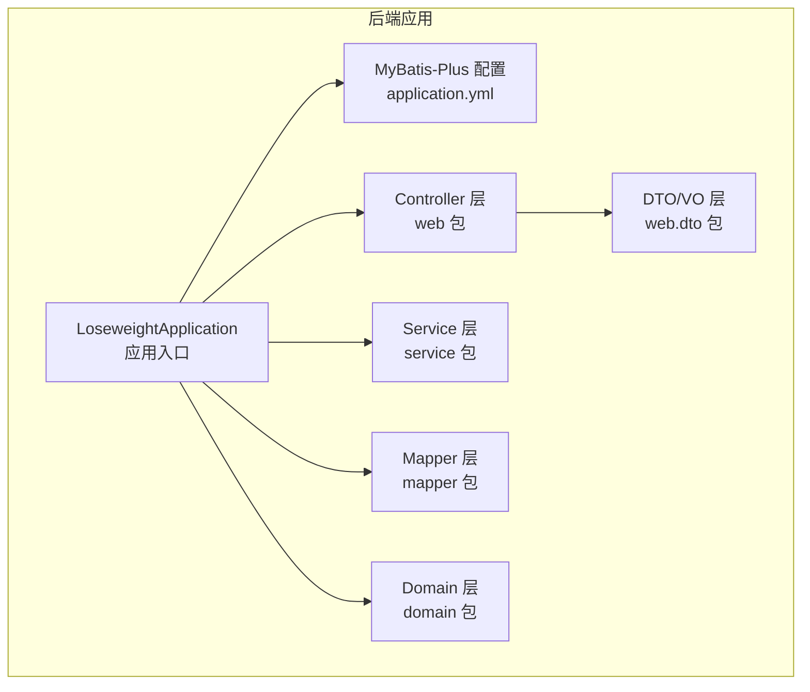
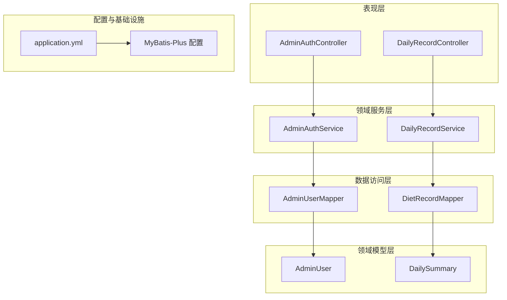
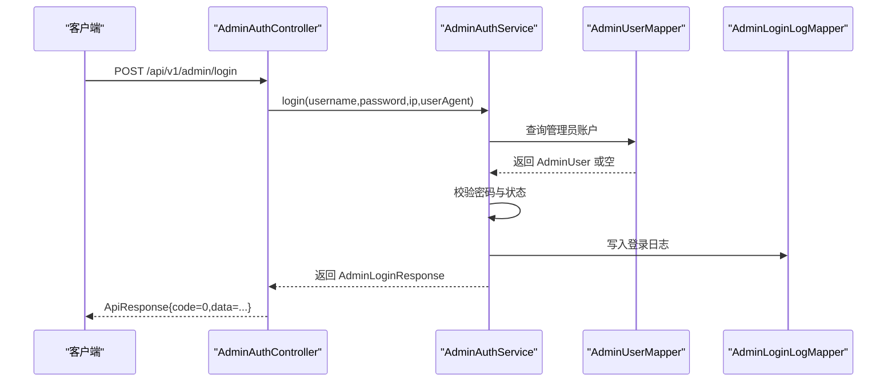
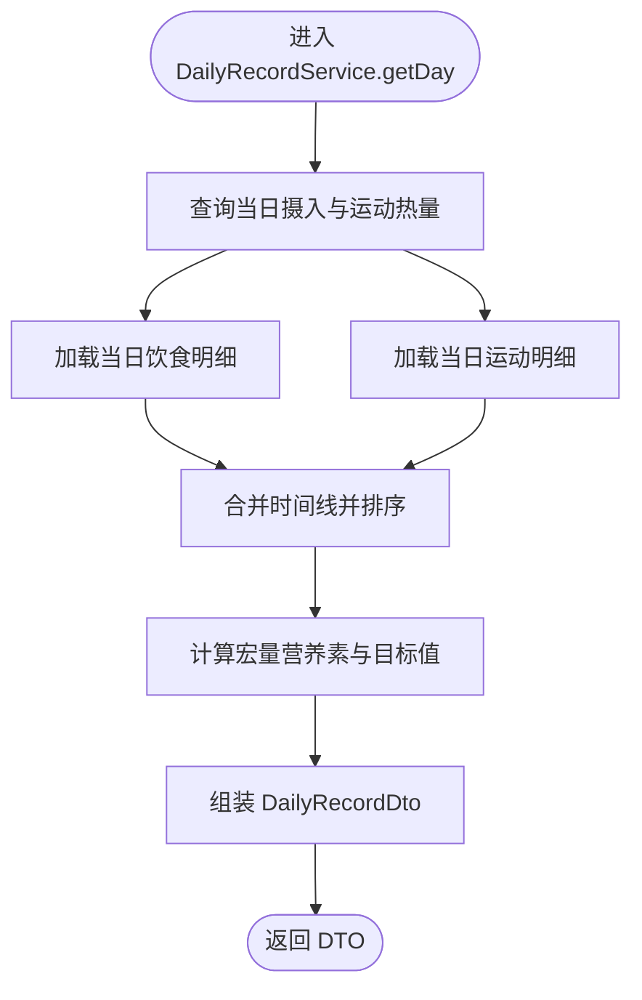
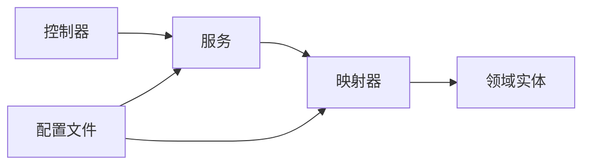
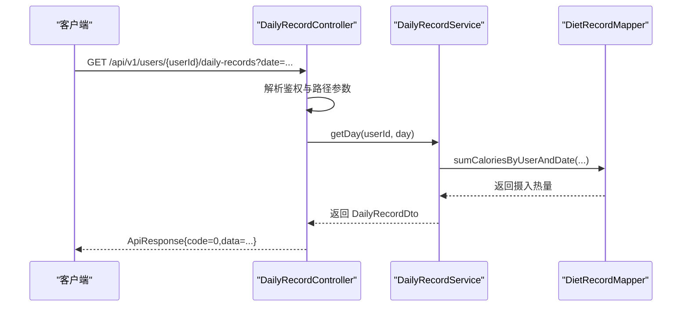

# 分层架构设计

<cite>
**本文引用的文件**
- [LoseweightApplication.java](file://backend/src/main/java/com/ypfr/loseweight/LoseweightApplication.java)
- [application.yml](file://backend/src/main/resources/application.yml)
- [ApiResponse.java](file://backend/src/main/java/com/ypfr/loseweight/common/ApiResponse.java)
- [ApiException.java](file://backend/src/main/java/com/ypfr/loseweight/common/ApiException.java)
- [GlobalExceptionHandler.java](file://backend/src/main/java/com/ypfr/loseweight/common/GlobalExceptionHandler.java)
- [AdminAuthController.java](file://backend/src/main/java/com/ypfr/loseweight/web/AdminAuthController.java)
- [DailyRecordController.java](file://backend/src/main/java/com/ypfr/loseweight/web/DailyRecordController.java)
- [AdminAuthService.java](file://backend/src/main/java/com/ypfr/loseweight/service/AdminAuthService.java)
- [DailyRecordService.java](file://backend/src/main/java/com/ypfr/loseweight/service/DailyRecordService.java)
- [AdminUserMapper.java](file://backend/src/main/java/com/ypfr/loseweight/mapper/AdminUserMapper.java)
- [DietRecordMapper.java](file://backend/src/main/java/com/ypfr/loseweight/mapper/DietRecordMapper.java)
- [AdminUser.java](file://backend/src/main/java/com/ypfr/loseweight/domain/AdminUser.java)
- [DailySummary.java](file://backend/src/main/java/com/ypfr/loseweight/domain/DailySummary.java)
- [DailyRecordDto.java](file://backend/src/main/java/com/ypfr/loseweight/web/dto/DailyRecordDto.java)
- [AdminLoginRequest.java](file://backend/src/main/java/com/ypfr/loseweight/web/dto/admin/AdminLoginRequest.java)
- [AdminLoginResponse.java](file://backend/src/main/java/com/ypfr/loseweight/web/dto/admin/AdminLoginResponse.java)
</cite>

## 目录
1. [简介](#简介)
2. [项目结构](#项目结构)
3. [核心组件](#核心组件)
4. [架构总览](#架构总览)
5. [详细组件分析](#详细组件分析)
6. [依赖关系分析](#依赖关系分析)
7. [性能考量](#性能考量)
8. [故障排查指南](#故障排查指南)
9. [结论](#结论)
10. [附录](#附录)

## 简介
本项目采用经典的分层架构设计，自上而下分为 Controller 层、Service 层、Mapper 层与 Domain 层。该架构旨在清晰分离关注点：Controller 负责 HTTP 请求接入与响应封装；Service 实现业务逻辑与服务编排；Mapper 进行数据持久化与 SQL 映射；Domain 表示业务实体并承载业务规则。通过统一的响应包装与异常处理机制，系统实现了高内聚、低耦合、易维护与可扩展的后端服务。

## 项目结构
后端模块位于 backend 目录，采用 Spring Boot + MyBatis-Plus 技术栈，配置文件集中于 resources/application.yml。应用入口类启用 Mapper 扫描与配置属性绑定，确保各层组件按约定装配。

**图表来源**
- [LoseweightApplication.java:12-19](file://backend/src/main/java/com/ypfr/loseweight/LoseweightApplication.java#L12-L19)
- [application.yml:1-54](file://backend/src/main/resources/application.yml#L1-L54)

**章节来源**
- [LoseweightApplication.java:12-19](file://backend/src/main/java/com/ypfr/loseweight/LoseweightApplication.java#L12-L19)
- [application.yml:1-54](file://backend/src/main/resources/application.yml#L1-L54)

## 核心组件
- Controller 层：负责接收 HTTP 请求、参数校验、鉴权解析、调用 Service 并以统一 ApiResponse 封装返回。
- Service 层：实现业务规则与流程编排，协调多个 Mapper 完成复杂业务场景，必要时进行数据聚合与计算。
- Mapper 层：基于 MyBatis-Plus 的 BaseMapper 接口与注解 SQL，完成数据库 CRUD 与统计查询。
- Domain 层：使用注解映射数据库表结构，作为持久化对象承载业务实体与字段约束。
- DTO/VO 层：面向前端的数据传输对象，用于控制响应结构与序列化。
- 统一响应与异常：通过 ApiResponse 统一封装响应体，ApiException 抛出业务异常，配合全局异常处理器进行统一处理。

**章节来源**
- [ApiResponse.java:15-21](file://backend/src/main/java/com/ypfr/loseweight/common/ApiResponse.java#L15-L21)
- [ApiException.java:7-14](file://backend/src/main/java/com/ypfr/loseweight/common/ApiException.java#L7-L14)
- [AdminAuthController.java:36-60](file://backend/src/main/java/com/ypfr/loseweight/web/AdminAuthController.java#L36-L60)
- [DailyRecordController.java:27-38](file://backend/src/main/java/com/ypfr/loseweight/web/DailyRecordController.java#L27-L38)

## 架构总览
下图展示了从 HTTP 请求到数据库访问的完整链路，以及各层之间的依赖方向与数据流向。

**图表来源**
- [AdminAuthController.java:23-34](file://backend/src/main/java/com/ypfr/loseweight/web/AdminAuthController.java#L23-L34)
- [DailyRecordController.java:18-25](file://backend/src/main/java/com/ypfr/loseweight/web/DailyRecordController.java#L18-L25)
- [AdminAuthService.java:17-29](file://backend/src/main/java/com/ypfr/loseweight/service/AdminAuthService.java#L17-L29)
- [DailyRecordService.java:25-42](file://backend/src/main/java/com/ypfr/loseweight/service/DailyRecordService.java#L25-L42)
- [AdminUserMapper.java:7-8](file://backend/src/main/java/com/ypfr/loseweight/mapper/AdminUserMapper.java#L7-L8)
- [DietRecordMapper.java:15-16](file://backend/src/main/java/com/ypfr/loseweight/mapper/DietRecordMapper.java#L15-L16)
- [AdminUser.java:8-18](file://backend/src/main/java/com/ypfr/loseweight/domain/AdminUser.java#L8-L18)
- [DailySummary.java:10-20](file://backend/src/main/java/com/ypfr/loseweight/domain/DailySummary.java#L10-L20)
- [application.yml:21-28](file://backend/src/main/resources/application.yml#L21-L28)

## 详细组件分析

### Controller 层职责与实现
- 入口与路由：控制器通过注解定义 REST 路由，如 /api/v1/admin 与 /api/v1/users。
- 参数校验：使用 Jakarta Bean Validation 注解对请求体进行非空等基础校验。
- 鉴权解析：通过自定义解析器从请求头中提取用户标识，校验访问权限。
- 响应封装：统一使用 ApiResponse 包裹结果，成功返回 code=0，失败返回具体 code 与 message。
- 异常处理：控制器内部不直接处理业务异常，交由全局异常处理器统一转换。

典型请求处理流程（管理员登录）：

**图表来源**
- [AdminAuthController.java:36-42](file://backend/src/main/java/com/ypfr/loseweight/web/AdminAuthController.java#L36-L42)
- [AdminAuthService.java:31-52](file://backend/src/main/java/com/ypfr/loseweight/service/AdminAuthService.java#L31-L52)
- [AdminUserMapper.java:7-8](file://backend/src/main/java/com/ypfr/loseweight/mapper/AdminUserMapper.java#L7-L8)

**章节来源**
- [AdminAuthController.java:19-61](file://backend/src/main/java/com/ypfr/loseweight/web/AdminAuthController.java#L19-L61)
- [AdminLoginRequest.java:7-27](file://backend/src/main/java/com/ypfr/loseweight/web/dto/admin/AdminLoginRequest.java#L7-L27)
- [AdminLoginResponse.java:9-31](file://backend/src/main/java/com/ypfr/loseweight/web/dto/admin/AdminLoginResponse.java#L9-L31)

### Service 层职责与实现
- 业务逻辑：实现业务规则与流程编排，如管理员登录校验、密码变更、日记录聚合等。
- 事务管理：通过 Spring 声明式事务或手动事务管理保证一致性（根据实际需求在 Service 层配置）。
- 服务编排：组合多个 Mapper 的查询结果，进行数据聚合、计算与格式化，输出 DTO。
- 异常抛出：遇到业务异常时抛出 ApiException，由全局异常处理器统一处理。

典型流程（日记录聚合）：

**图表来源**
- [DailyRecordService.java:44-84](file://backend/src/main/java/com/ypfr/loseweight/service/DailyRecordService.java#L44-L84)
- [DietRecordMapper.java:18-21](file://backend/src/main/java/com/ypfr/loseweight/mapper/DietRecordMapper.java#L18-L21)

**章节来源**
- [DailyRecordService.java:20-178](file://backend/src/main/java/com/ypfr/loseweight/service/DailyRecordService.java#L20-L178)

### Mapper 层职责与实现
- 持久化接口：继承 MyBatis-Plus BaseMapper，获得通用 CRUD 能力。
- SQL 映射：通过注解 @Select 编写统计类 SQL，如按日期范围统计总热量、宏量营养素与用餐窗口。
- 数据行对象：定义 row 包下的统计结果对象，用于承载聚合查询结果。

**章节来源**
- [AdminUserMapper.java:7-8](file://backend/src/main/java/com/ypfr/loseweight/mapper/AdminUserMapper.java#L7-L8)
- [DietRecordMapper.java:15-54](file://backend/src/main/java/com/ypfr/loseweight/mapper/DietRecordMapper.java#L15-L54)

### Domain 层职责与实现
- 实体映射：使用注解将 Java 类映射到数据库表，如 admin_user、daily_summary。
- 字段约束：包含主键、时间戳、状态等字段，支撑业务规则与审计要求。

**章节来源**
- [AdminUser.java:8-68](file://backend/src/main/java/com/ypfr/loseweight/domain/AdminUser.java#L8-L68)
- [DailySummary.java:10-218](file://backend/src/main/java/com/ypfr/loseweight/domain/DailySummary.java#L10-L218)

### DTO/VO 层职责与实现
- 控制响应结构：面向前端的轻量级数据载体，如 DailyRecordDto，包含日期、热量、宏量与时间线。
- 输入校验：请求 DTO 如 AdminLoginRequest 对必填字段进行约束。

**章节来源**
- [DailyRecordDto.java:5-52](file://backend/src/main/java/com/ypfr/loseweight/web/dto/DailyRecordDto.java#L5-L52)
- [AdminLoginRequest.java:5-28](file://backend/src/main/java/com/ypfr/loseweight/web/dto/admin/AdminLoginRequest.java#L5-L28)

## 依赖关系分析
- 控制器依赖服务：Controller 仅依赖 Service 接口，不直接依赖 Mapper，降低耦合。
- 服务依赖映射：Service 依赖 Mapper 接口，通过 MyBatis-Plus 完成数据库交互。
- 映射依赖实体：Mapper 依赖 Domain 实体类，实现 ORM 映射。
- 配置驱动：application.yml 提供数据源、MyBatis-Plus 配置与第三方能力开关。

**图表来源**
- [AdminAuthController.java:23-34](file://backend/src/main/java/com/ypfr/loseweight/web/AdminAuthController.java#L23-L34)
- [DailyRecordController.java:18-25](file://backend/src/main/java/com/ypfr/loseweight/web/DailyRecordController.java#L18-L25)
- [AdminAuthService.java:17-29](file://backend/src/main/java/com/ypfr/loseweight/service/AdminAuthService.java#L17-L29)
- [DailyRecordService.java:25-42](file://backend/src/main/java/com/ypfr/loseweight/service/DailyRecordService.java#L25-L42)
- [AdminUserMapper.java:7-8](file://backend/src/main/java/com/ypfr/loseweight/mapper/AdminUserMapper.java#L7-L8)
- [DietRecordMapper.java:15-16](file://backend/src/main/java/com/ypfr/loseweight/mapper/DietRecordMapper.java#L15-L16)
- [application.yml:21-28](file://backend/src/main/resources/application.yml#L21-L28)

**章节来源**
- [LoseweightApplication.java:12-19](file://backend/src/main/java/com/ypfr/loseweight/LoseweightApplication.java#L12-L19)
- [application.yml:1-54](file://backend/src/main/resources/application.yml#L1-L54)

## 性能考量
- SQL 优化：统计类查询建议在相关列建立索引，避免全表扫描；合理使用分页与范围查询。
- 缓存策略：热点数据可引入缓存（如 Redis），减少重复查询；注意缓存与数据库的一致性。
- 序列化开销：DTO 结构尽量扁平，避免深层嵌套导致序列化成本过高。
- 连接池与超时：合理配置数据源连接数与查询超时，防止慢查询拖垮服务。
- 日志级别：生产环境谨慎开启 Mapper 日志，避免 IO 压力过大。

## 故障排查指南
- 统一异常处理：业务异常通过 ApiException 抛出，由全局异常处理器转换为标准响应。
- 错误码规范：成功 code=0，失败使用明确的业务错误码与提示信息，便于前端与监控识别。
- 参数校验：请求体与路径参数需满足 DTO 注解约束，否则触发校验失败。
- 登录与鉴权：AdminAuthController 对 Authorization 头进行解析与校验，确保资源访问安全。

**章节来源**
- [ApiException.java:7-14](file://backend/src/main/java/com/ypfr/loseweight/common/ApiException.java#L7-L14)
- [GlobalExceptionHandler.java](file://backend/src/main/java/com/ypfr/loseweight/common/GlobalExceptionHandler.java)

## 结论
本项目通过清晰的分层架构实现了职责分离与高内聚低耦合。Controller 层专注请求接入与响应封装，Service 层承载业务逻辑与编排，Mapper 层聚焦数据持久化与 SQL 映射，Domain 层表达业务实体与规则。配合统一的响应与异常处理机制，系统具备良好的可维护性、可扩展性与稳定性。

## 附录
- 典型请求处理流程（用户日记录）：

**图表来源**
- [DailyRecordController.java:27-38](file://backend/src/main/java/com/ypfr/loseweight/web/DailyRecordController.java#L27-L38)
- [DailyRecordService.java:44-84](file://backend/src/main/java/com/ypfr/loseweight/service/DailyRecordService.java#L44-L84)
- [DietRecordMapper.java:18-21](file://backend/src/main/java/com/ypfr/loseweight/mapper/DietRecordMapper.java#L18-L21)