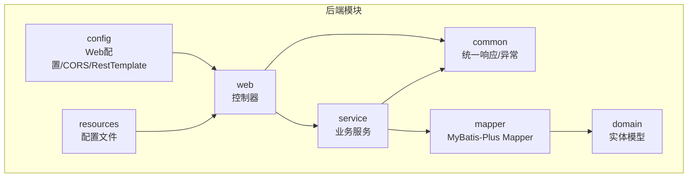
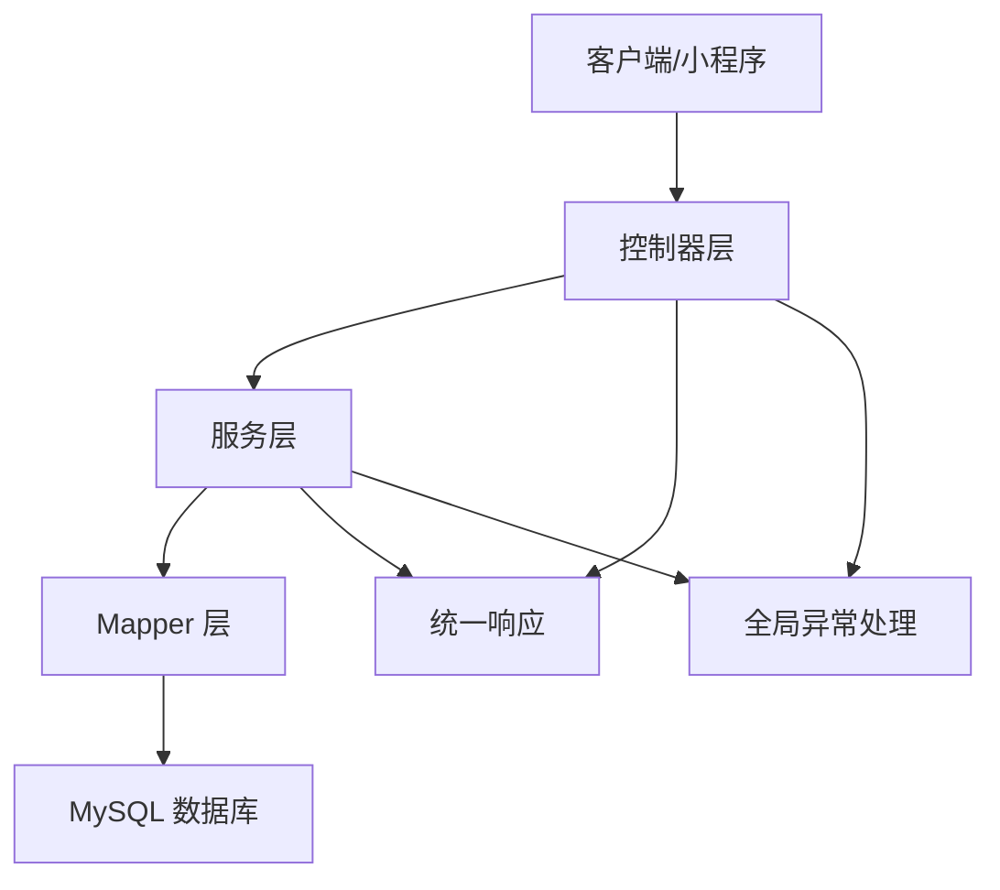
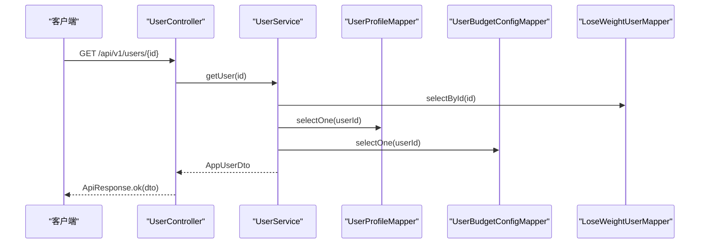
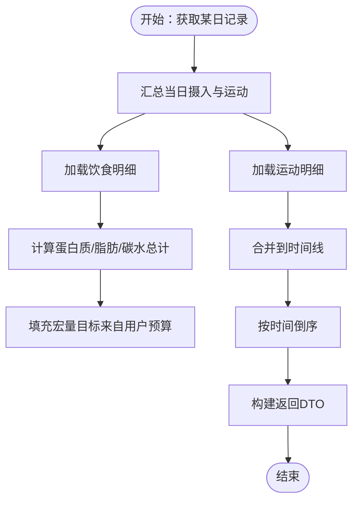
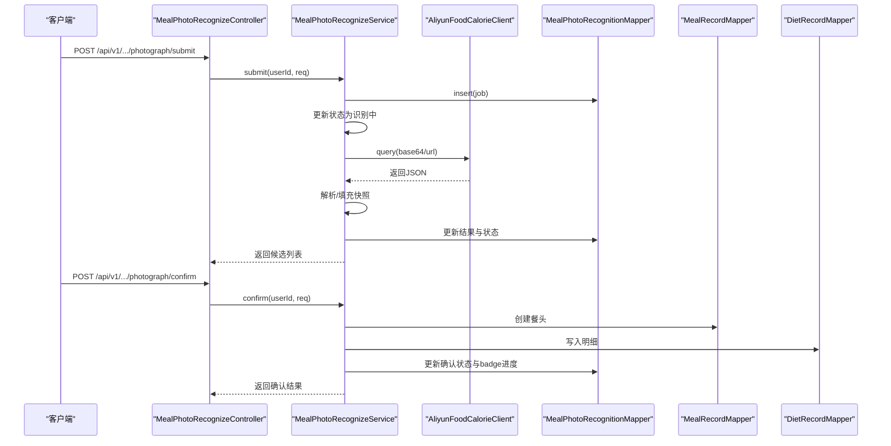
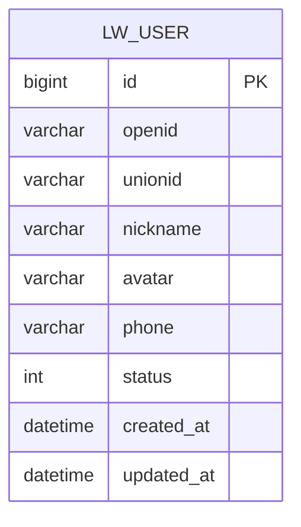
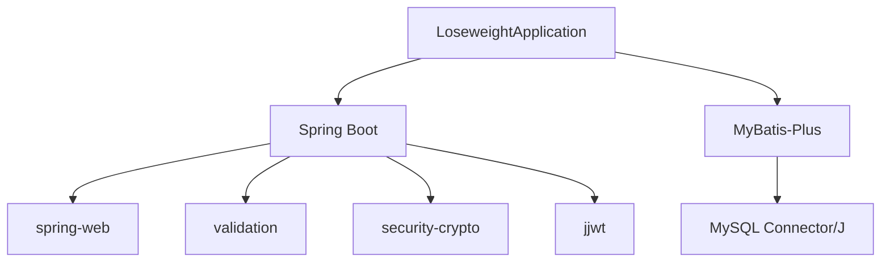

# 后端系统架构

<cite>
**本文引用的文件**   
- [LoseweightApplication.java](file://backend/src/main/java/com/ypfr/loseweight/LoseweightApplication.java)
- [pom.xml](file://backend/pom.xml)
- [application.yml](file://backend/src/main/resources/application.yml)
- [WebConfig.java](file://backend/src/main/java/com/ypfr/loseweight/config/WebConfig.java)
- [GlobalExceptionHandler.java](file://backend/src/main/java/com/ypfr/loseweight/common/GlobalExceptionHandler.java)
- [ApiResponse.java](file://backend/src/main/java/com/ypfr/loseweight/common/ApiResponse.java)
- [ApiException.java](file://backend/src/main/java/com/ypfr/loseweight/common/ApiException.java)
- [UserController.java](file://backend/src/main/java/com/ypfr/loseweight/web/UserController.java)
- [UserService.java](file://backend/src/main/java/com/ypfr/loseweight/service/UserService.java)
- [DailyRecordService.java](file://backend/src/main/java/com/ypfr/loseweight/service/DailyRecordService.java)
- [MealRecordService.java](file://backend/src/main/java/com/ypfr/loseweight/service/MealRecordService.java)
- [SportRecordService.java](file://backend/src/main/java/com/ypfr/loseweight/service/SportRecordService.java)
- [MealPhotoRecognizeService.java](file://backend/src/main/java/com/ypfr/loseweight/service/photograph/MealPhotoRecognizeService.java)
- [LoseWeightUser.java](file://backend/src/main/java/com/ypfr/loseweight/domain/LoseWeightUser.java)
</cite>

## 目录
1. [引言](#引言)
2. [项目结构](#项目结构)
3. [核心组件](#核心组件)
4. [架构总览](#架构总览)
5. [详细组件分析](#详细组件分析)
6. [依赖分析](#依赖分析)
7. [性能考虑](#性能考虑)
8. [故障排查指南](#故障排查指南)
9. [结论](#结论)
10. [附录](#附录)

## 引言
本架构文档面向后端系统，聚焦 Spring Boot 应用的高层设计与分层架构（Controller-Service-Mapper-Domain），系统采用 MyBatis-Plus 进行数据持久化，围绕“用户管理、饮食记录、运动追踪、拍照识别”等核心业务展开。文档涵盖应用启动流程、配置加载机制、依赖注入容器管理、全局异常处理、跨领域关注点（安全、监控、错误处理）以及系统上下文与组件分解图。

## 项目结构
后端位于 backend 目录，采用标准 Maven 结构，核心包划分如下：
- common：统一响应封装与全局异常处理
- config：Web 跨域与 RestTemplate 配置
- domain：实体模型（MyBatis-Plus 注解映射）
- mapper：DAO 层接口（MyBatis-Plus Mapper）
- service：业务服务层（事务与组合逻辑）
- web：控制器层（REST 接口）
- resources：Spring 配置与环境配置

图表来源
- [LoseweightApplication.java:12-24](file://backend/src/main/java/com/ypfr/loseweight/LoseweightApplication.java#L12-L24)
- [WebConfig.java:11-30](file://backend/src/main/java/com/ypfr/loseweight/config/WebConfig.java#L11-L30)
- [application.yml:1-54](file://backend/src/main/resources/application.yml#L1-L54)

章节来源
- [LoseweightApplication.java:12-24](file://backend/src/main/java/com/ypfr/loseweight/LoseweightApplication.java#L12-L24)
- [pom.xml:20-86](file://backend/pom.xml#L20-L86)
- [application.yml:1-54](file://backend/src/main/resources/application.yml#L1-L54)

## 核心组件
- 应用入口与扫描：SpringBootApplication 启动类，启用 MyBatis-Plus Mapper 扫描与配置属性类注册
- Web 层：控制器负责参数解析、鉴权解析器、返回统一响应
- 服务层：封装业务规则、事务边界、跨 Mapper 组合调用
- 持久层：MyBatis-Plus Mapper 提供 CRUD 与复杂查询
- 领域模型：实体类映射数据库表
- 公共模块：统一响应体、异常体系、全局异常处理器
- 配置模块：CORS 放通、RestTemplate 客户端配置

章节来源
- [LoseweightApplication.java:12-24](file://backend/src/main/java/com/ypfr/loseweight/LoseweightApplication.java#L12-L24)
- [WebConfig.java:11-30](file://backend/src/main/java/com/ypfr/loseweight/config/WebConfig.java#L11-L30)
- [ApiResponse.java:3-35](file://backend/src/main/java/com/ypfr/loseweight/common/ApiResponse.java#L3-L35)
- [ApiException.java:3-16](file://backend/src/main/java/com/ypfr/loseweight/common/ApiException.java#L3-L16)
- [GlobalExceptionHandler.java:14-107](file://backend/src/main/java/com/ypfr/loseweight/common/GlobalExceptionHandler.java#L14-L107)

## 架构总览
系统采用经典的分层架构：
- 控制器层：接收 HTTP 请求，进行参数校验与鉴权解析，调用服务层
- 服务层：编排业务流程、事务控制、跨 Mapper 查询与更新
- 持久层：MyBatis-Plus Mapper 封装 SQL，实体类映射表结构
- 领域模型：承载业务语义的数据载体
- 配置与公共：统一响应、异常处理、CORS、RestTemplate

图表来源
- [UserController.java:16-41](file://backend/src/main/java/com/ypfr/loseweight/web/UserController.java#L16-L41)
- [UserService.java:25-54](file://backend/src/main/java/com/ypfr/loseweight/service/UserService.java#L25-L54)
- [DailyRecordService.java:20-42](file://backend/src/main/java/com/ypfr/loseweight/service/DailyRecordService.java#L20-L42)
- [MealRecordService.java:28-48](file://backend/src/main/java/com/ypfr/loseweight/service/MealRecordService.java#L28-L48)
- [SportRecordService.java:17-31](file://backend/src/main/java/com/ypfr/loseweight/service/SportRecordService.java#L17-L31)
- [GlobalExceptionHandler.java:14-107](file://backend/src/main/java/com/ypfr/loseweight/common/GlobalExceptionHandler.java#L14-L107)

## 详细组件分析

### 用户管理模块
- 控制器 UserController：提供用户信息查询与周统计接口
- 服务 UserService：加载用户、档案、预算配置，计算 BMI 解释与“我的”页统计指标
- 关键点：确保档案与预算初始化、计算完成度、头像上传存储与回写

图表来源
- [UserController.java:28-31](file://backend/src/main/java/com/ypfr/loseweight/web/UserController.java#L28-L31)
- [UserService.java:56-64](file://backend/src/main/java/com/ypfr/loseweight/service/UserService.java#L56-L64)
- [UserService.java:166-179](file://backend/src/main/java/com/ypfr/loseweight/service/UserService.java#L166-L179)
- [UserService.java:181-193](file://backend/src/main/java/com/ypfr/loseweight/service/UserService.java#L181-L193)

章节来源
- [UserController.java:16-41](file://backend/src/main/java/com/ypfr/loseweight/web/UserController.java#L16-L41)
- [UserService.java:25-319](file://backend/src/main/java/com/ypfr/loseweight/service/UserService.java#L25-L319)

### 日常记录与宏量营养模块
- 服务 DailyRecordService：按日期聚合当日摄入与运动，计算宏量目标与时间线
- 服务 MealRecordService：单条/批量创建饮食记录，计算总热量与宏量，维护餐头与明细
- 服务 SportRecordService：创建/删除运动记录，按时间排序展示

图表来源
- [DailyRecordService.java:44-84](file://backend/src/main/java/com/ypfr/loseweight/service/DailyRecordService.java#L44-L84)
- [DailyRecordService.java:157-176](file://backend/src/main/java/com/ypfr/loseweight/service/DailyRecordService.java#L157-L176)
- [MealRecordService.java:406-412](file://backend/src/main/java/com/ypfr/loseweight/service/MealRecordService.java#L406-L412)
- [SportRecordService.java:103-110](file://backend/src/main/java/com/ypfr/loseweight/service/SportRecordService.java#L103-L110)

章节来源
- [DailyRecordService.java:20-178](file://backend/src/main/java/com/ypfr/loseweight/service/DailyRecordService.java#L20-L178)
- [MealRecordService.java:28-435](file://backend/src/main/java/com/ypfr/loseweight/service/MealRecordService.java#L28-L435)
- [SportRecordService.java:17-111](file://backend/src/main/java/com/ypfr/loseweight/service/SportRecordService.java#L17-L111)

### 拍照识别模块
- 服务 MealPhotoRecognizeService：提交图片/URL，调用阿里云识图，解析候选食物，确认后生成餐记录与明细，联动日汇总与看板

图表来源
- [MealPhotoRecognizeService.java:68-138](file://backend/src/main/java/com/ypfr/loseweight/service/photograph/MealPhotoRecognizeService.java#L68-L138)
- [MealPhotoRecognizeService.java:149-255](file://backend/src/main/java/com/ypfr/loseweight/service/photograph/MealPhotoRecognizeService.java#L149-L255)

章节来源
- [MealPhotoRecognizeService.java:37-416](file://backend/src/main/java/com/ypfr/loseweight/service/photograph/MealPhotoRecognizeService.java#L37-L416)

### 数据模型与实体
- 实体 LoseWeightUser：用户主表 lw_user 的映射，包含 openid/unionid、昵称、头像、手机号、状态与时间戳等字段

图表来源
- [LoseWeightUser.java:8-168](file://backend/src/main/java/com/ypfr/loseweight/domain/LoseWeightUser.java#L8-L168)

章节来源
- [LoseWeightUser.java:1-168](file://backend/src/main/java/com/ypfr/loseweight/domain/LoseWeightUser.java#L1-L168)

## 依赖分析
- 启动与扫描：Spring Boot 自动装配 + MyBatis-Plus Mapper 扫描
- Web 与验证：spring-boot-starter-web + spring-boot-starter-validation
- 安全与加密：spring-security-crypto
- 数据库：MyBatis-Plus 3.x + MySQL Connector/J
- JWT：jjwt-api/jackson/impl
- 配置处理器：spring-boot-configuration-processor

图表来源
- [LoseweightApplication.java:12-24](file://backend/src/main/java/com/ypfr/loseweight/LoseweightApplication.java#L12-L24)
- [pom.xml:25-75](file://backend/pom.xml#L25-L75)

章节来源
- [pom.xml:20-86](file://backend/pom.xml#L20-L86)

## 性能考虑
- 数据访问：MyBatis-Plus 提供高效 ORM，建议对高频查询建立合适索引，避免 N+1 查询
- 事务边界：服务层方法标注事务，批量写入时注意一次性提交规模，避免长事务锁表
- 网络调用：RestTemplate 设置连接/读取超时，对外部服务调用增加重试与熔断策略
- 资源限制：服务端配置了最大内存与表单大小，上传图片与大请求需控制尺寸
- 缓存与统计：日汇总与看板统计可结合缓存与异步更新，降低高峰压力

## 故障排查指南
- 全局异常处理：统一捕获业务异常、参数校验异常、数据访问异常与未知异常，返回标准化响应
- 数据库结构不匹配：针对特定表缺失列或类型映射问题，提供明确修复指引与迁移脚本提示
- 未捕获异常：记录根因，区分 SQL 与非 SQL 场景，返回友好提示并保留日志定位

章节来源
- [GlobalExceptionHandler.java:19-107](file://backend/src/main/java/com/ypfr/loseweight/common/GlobalExceptionHandler.java#L19-L107)

## 结论
本系统以清晰的分层架构与 MyBatis-Plus 技术栈为基础，围绕用户、饮食、运动与拍照识别构建核心能力。通过统一响应与全局异常处理提升稳定性，借助 CORS 与 RestTemplate 配置保障集成与外部调用能力。建议持续完善数据库索引、事务边界与缓存策略，以支撑业务增长与高并发场景。

## 附录
- 启动流程概览：Spring Boot 应用启动，加载 application.yml，注册配置属性类，扫描 Mapper，暴露 REST 接口
- 配置要点：数据库连接、Tomcat 参数、MyBatis-Plus 下划转驼峰、日志级别、微信/阿里云/JWT/上传目录等

章节来源
- [LoseweightApplication.java:12-24](file://backend/src/main/java/com/ypfr/loseweight/LoseweightApplication.java#L12-L24)
- [application.yml:1-54](file://backend/src/main/resources/application.yml#L1-L54)
- [WebConfig.java:11-30](file://backend/src/main/java/com/ypfr/loseweight/config/WebConfig.java#L11-L30)