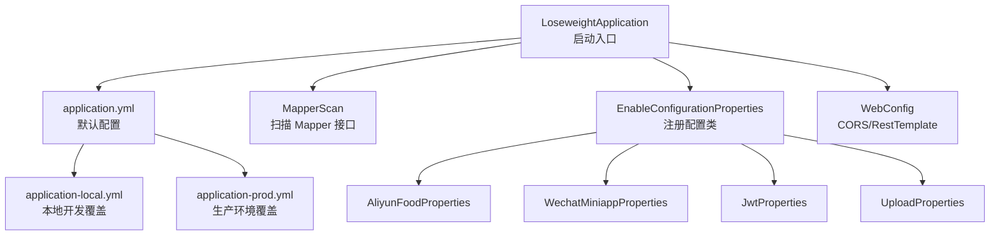
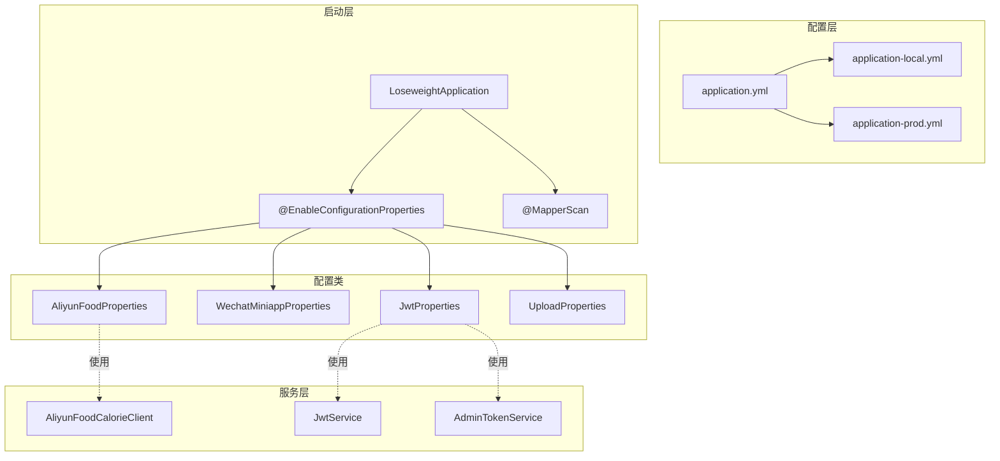
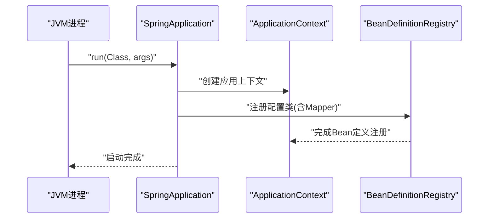
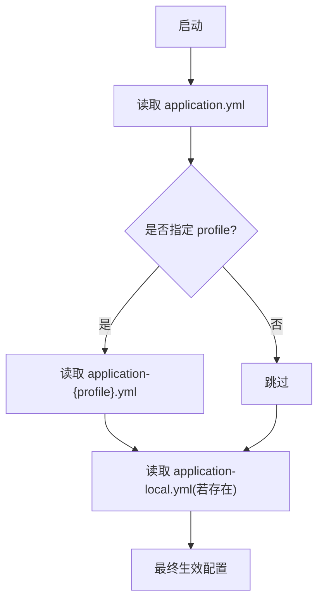
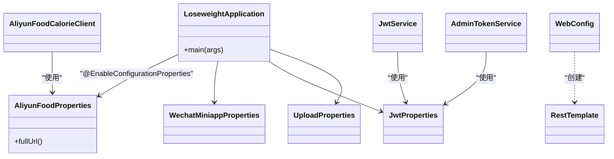
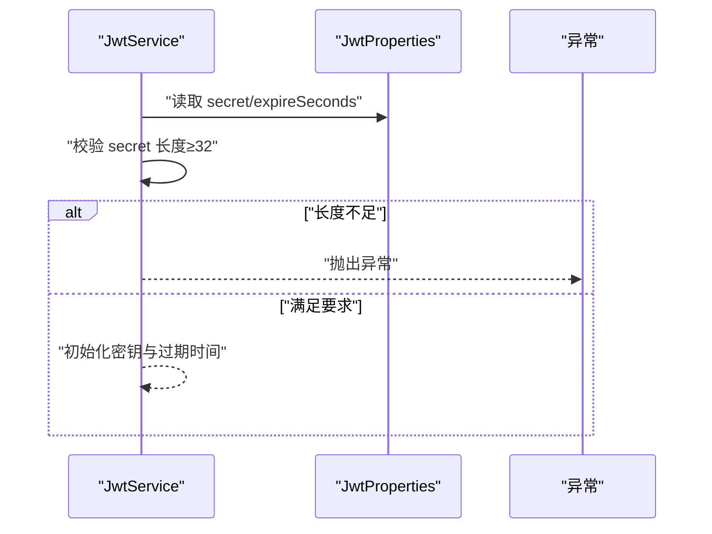
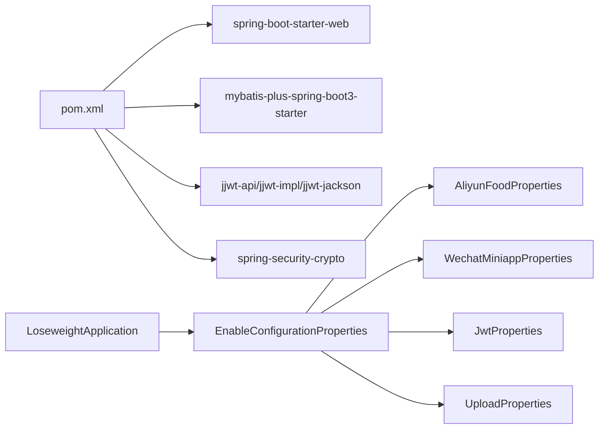

# 应用启动与配置

<cite>
**本文引用的文件**
- [LoseweightApplication.java](file://backend/src/main/java/com/ypfr/loseweight/LoseweightApplication.java)
- [application.yml](file://backend/src/main/resources/application.yml)
- [application-local.yml](file://backend/src/main/resources/application-local.yml)
- [application-prod.yml](file://backend/src/main/resources/application-prod.yml)
- [application-local.yml.example](file://backend/src/main/resources/application-local.yml.example)
- [pom.xml](file://backend/pom.xml)
- [AliyunFoodProperties.java](file://backend/src/main/java/com/ypfr/loseweight/config/AliyunFoodProperties.java)
- [WechatMiniappProperties.java](file://backend/src/main/java/com/ypfr/loseweight/config/WechatMiniappProperties.java)
- [JwtProperties.java](file://backend/src/main/java/com/ypfr/loseweight/config/JwtProperties.java)
- [UploadProperties.java](file://backend/src/main/java/com/ypfr/loseweight/config/UploadProperties.java)
- [WebConfig.java](file://backend/src/main/java/com/ypfr/loseweight/config/WebConfig.java)
- [AdminTokenService.java](file://backend/src/main/java/com/ypfr/loseweight/service/AdminTokenService.java)
- [JwtService.java](file://backend/src/main/java/com/ypfr/loseweight/service/JwtService.java)
- [AliyunFoodCalorieClient.java](file://backend/src/main/java/com/ypfr/loseweight/service/AliyunFoodCalorieClient.java)
</cite>

## 目录
1. [简介](#简介)
2. [项目结构](#项目结构)
3. [核心组件](#核心组件)
4. [架构总览](#架构总览)
5. [详细组件分析](#详细组件分析)
6. [依赖分析](#依赖分析)
7. [性能考虑](#性能考虑)
8. [故障排查指南](#故障排查指南)
9. [结论](#结论)
10. [附录](#附录)

## 简介
本文件面向Spring Boot后端应用的启动与配置，系统性阐述以下主题：
- Spring Boot应用启动流程与关键注解作用
- 组件扫描机制与配置类注册
- 外部配置文件加载顺序与环境差异
- @EnableConfigurationProperties如何启用属性绑定及各配置类职责
- 不同环境（local/prod）的关键参数差异与最佳实践
- 安全注意事项与运维建议

## 项目结构
后端采用标准Maven工程布局，核心入口位于Java源码根包下，配置文件位于resources目录，按profile分层管理。

图表来源
- [LoseweightApplication.java:12-19](file://backend/src/main/java/com/ypfr/loseweight/LoseweightApplication.java#L12-L19)
- [application.yml:1-54](file://backend/src/main/resources/application.yml#L1-L54)
- [application-local.yml:1-20](file://backend/src/main/resources/application-local.yml#L1-L20)
- [application-prod.yml:1-19](file://backend/src/main/resources/application-prod.yml#L1-L19)

章节来源
- [LoseweightApplication.java:12-19](file://backend/src/main/java/com/ypfr/loseweight/LoseweightApplication.java#L12-L19)
- [application.yml:1-54](file://backend/src/main/resources/application.yml#L1-L54)
- [application-local.yml:1-20](file://backend/src/main/resources/application-local.yml#L1-L20)
- [application-prod.yml:1-19](file://backend/src/main/resources/application-prod.yml#L1-L19)

## 核心组件
- 启动类与注解
  - @SpringBootApplication：组合了自动扫描、条件化配置与Spring Boot特性开关，负责应用上下文初始化与主程序入口。
  - @MapperScan：指定MyBatis Mapper接口扫描路径，确保SQL映射可用。
  - @EnableConfigurationProperties：显式声明启用若干配置类，使application.yml中的键值绑定到对应对象。
- 配置类与职责
  - AliyunFoodProperties：封装阿里云食物识别服务的host、path与AppCode。
  - WechatMiniappProperties：封装微信小程序AppId与AppSecret。
  - JwtProperties：封装JWT签名密钥与过期时间。
  - UploadProperties：封装上传资源目录（头像、食物图片）。
- Web配置
  - WebConfig：统一跨域策略与RestTemplate超时设置，便于调用第三方HTTP服务。

章节来源
- [LoseweightApplication.java:12-19](file://backend/src/main/java/com/ypfr/loseweight/LoseweightApplication.java#L12-L19)
- [AliyunFoodProperties.java:5-43](file://backend/src/main/java/com/ypfr/loseweight/config/AliyunFoodProperties.java#L5-L43)
- [WechatMiniappProperties.java:5-27](file://backend/src/main/java/com/ypfr/loseweight/config/WechatMiniappProperties.java#L5-L27)
- [JwtProperties.java:5-28](file://backend/src/main/java/com/ypfr/loseweight/config/JwtProperties.java#L5-L28)
- [UploadProperties.java:5-29](file://backend/src/main/java/com/ypfr/loseweight/config/UploadProperties.java#L5-L29)
- [WebConfig.java:10-30](file://backend/src/main/java/com/ypfr/loseweight/config/WebConfig.java#L10-L30)

## 架构总览
下图展示启动阶段的配置加载与绑定关系，以及关键配置类在运行时的使用位置。

图表来源
- [LoseweightApplication.java:12-19](file://backend/src/main/java/com/ypfr/loseweight/LoseweightApplication.java#L12-L19)
- [application.yml:1-54](file://backend/src/main/resources/application.yml#L1-L54)
- [application-local.yml:1-20](file://backend/src/main/resources/application-local.yml#L1-L20)
- [application-prod.yml:1-19](file://backend/src/main/resources/application-prod.yml#L1-L19)
- [AliyunFoodProperties.java:5-43](file://backend/src/main/java/com/ypfr/loseweight/config/AliyunFoodProperties.java#L5-L43)
- [WechatMiniappProperties.java:5-27](file://backend/src/main/java/com/ypfr/loseweight/config/WechatMiniappProperties.java#L5-L27)
- [JwtProperties.java:5-28](file://backend/src/main/java/com/ypfr/loseweight/config/JwtProperties.java#L5-L28)
- [UploadProperties.java:5-29](file://backend/src/main/java/com/ypfr/loseweight/config/UploadProperties.java#L5-L29)
- [AliyunFoodCalorieClient.java:16-25](file://backend/src/main/java/com/ypfr/loseweight/service/AliyunFoodCalorieClient.java#L16-L25)
- [JwtService.java:14-27](file://backend/src/main/java/com/ypfr/loseweight/service/JwtService.java#L14-L27)
- [AdminTokenService.java:14-27](file://backend/src/main/java/com/ypfr/loseweight/service/AdminTokenService.java#L14-L27)

## 详细组件分析

### 启动流程与注解解析
- @SpringBootApplication
  - 负责应用上下文的自动装配与主程序入口定位。
  - 与@ComponentScan默认扫描路径配合，确保业务组件被纳入容器。
- @MapperScan
  - 指定com.ypfr.loseweight.mapper包，使MyBatis能够发现并代理Mapper接口。
- @EnableConfigurationProperties
  - 将配置类纳入Spring容器，允许application.yml中以prefix开头的键进行类型安全绑定。

图表来源
- [LoseweightApplication.java:22-24](file://backend/src/main/java/com/ypfr/loseweight/LoseweightApplication.java#L22-L24)

章节来源
- [LoseweightApplication.java:12-19](file://backend/src/main/java/com/ypfr/loseweight/LoseweightApplication.java#L12-L19)

### 配置文件加载顺序与环境差异
- 加载顺序（从低优先级到高优先级）
  1) application.yml（默认基础配置）
  2) application-{profile}.yml（按激活的profile覆盖）
  3) application-local.yml（本地开发覆盖，不在版本库中）
- 环境差异要点
  - local：本地开发，数据库凭据与JWT密钥在本地文件中覆盖；允许监听所有网卡便于移动端联调。
  - prod：生产环境，数据库凭据与JWT密钥通过环境变量注入，避免硬编码；限制监听地址与端口。

图表来源
- [application.yml:4-5](file://backend/src/main/resources/application.yml#L4-L5)
- [application-local.yml:1-20](file://backend/src/main/resources/application-local.yml#L1-L20)
- [application-prod.yml:1-19](file://backend/src/main/resources/application-prod.yml#L1-L19)

章节来源
- [application.yml:1-54](file://backend/src/main/resources/application.yml#L1-L54)
- [application-local.yml:1-20](file://backend/src/main/resources/application-local.yml#L1-L20)
- [application-prod.yml:1-19](file://backend/src/main/resources/application-prod.yml#L1-L19)

### @EnableConfigurationProperties与属性绑定
- 作用机制
  - 通过@EnableConfigurationProperties({...})显式注册配置类，使Spring Boot将application.yml中以prefix开头的键绑定到对应字段。
  - 配置类使用@ConfigurationProperties(prefix="...")标注，实现类型安全与默认值管理。
- 运行时绑定验证
  - 若绑定失败或缺失关键值，可在服务初始化时抛出异常，提示用户完善配置。

图表来源
- [LoseweightApplication.java:14-19](file://backend/src/main/java/com/ypfr/loseweight/LoseweightApplication.java#L14-L19)
- [AliyunFoodProperties.java:5-43](file://backend/src/main/java/com/ypfr/loseweight/config/AliyunFoodProperties.java#L5-L43)
- [WechatMiniappProperties.java:5-27](file://backend/src/main/java/com/ypfr/loseweight/config/WechatMiniappProperties.java#L5-L27)
- [JwtProperties.java:5-28](file://backend/src/main/java/com/ypfr/loseweight/config/JwtProperties.java#L5-L28)
- [UploadProperties.java:5-29](file://backend/src/main/java/com/ypfr/loseweight/config/UploadProperties.java#L5-L29)
- [WebConfig.java:23-29](file://backend/src/main/java/com/ypfr/loseweight/config/WebConfig.java#L23-L29)
- [AliyunFoodCalorieClient.java:16-25](file://backend/src/main/java/com/ypfr/loseweight/service/AliyunFoodCalorieClient.java#L16-L25)
- [JwtService.java:14-27](file://backend/src/main/java/com/ypfr/loseweight/service/JwtService.java#L14-L27)
- [AdminTokenService.java:14-27](file://backend/src/main/java/com/ypfr/loseweight/service/AdminTokenService.java#L14-L27)

章节来源
- [LoseweightApplication.java:14-19](file://backend/src/main/java/com/ypfr/loseweight/LoseweightApplication.java#L14-L19)
- [AliyunFoodProperties.java:5-43](file://backend/src/main/java/com/ypfr/loseweight/config/AliyunFoodProperties.java#L5-L43)
- [WechatMiniappProperties.java:5-27](file://backend/src/main/java/com/ypfr/loseweight/config/WechatMiniappProperties.java#L5-L27)
- [JwtProperties.java:5-28](file://backend/src/main/java/com/ypfr/loseweight/config/JwtProperties.java#L5-L28)
- [UploadProperties.java:5-29](file://backend/src/main/java/com/ypfr/loseweight/config/UploadProperties.java#L5-L29)

### 配置类功能与用途
- AliyunFoodProperties
  - 用途：封装阿里云食物识别服务的访问地址与AppCode，提供拼接完整URL的方法。
  - 关键字段：host、path、appcode。
  - 使用场景：调用第三方API前校验与构造请求URL。
- WechatMiniappProperties
  - 用途：封装微信小程序AppId与AppSecret，用于服务端jscode2session等流程。
  - 关键字段：appId、appSecret。
  - 注意事项：local环境不要覆盖与小程序不一致的配置，否则会导致登录失败。
- JwtProperties
  - 用途：封装HS256签名密钥与过期时间，供JWT签发与校验使用。
  - 关键字段：secret、expireSeconds。
  - 安全要求：secret长度≥32字节且为随机字符串，生产环境必须通过环境变量注入。
- UploadProperties
  - 用途：封装上传资源目录（头像、食物图片），供静态资源读取与存储使用。
  - 关键字段：avatarDir、foodImageDir。

章节来源
- [AliyunFoodProperties.java:5-43](file://backend/src/main/java/com/ypfr/loseweight/config/AliyunFoodProperties.java#L5-L43)
- [WechatMiniappProperties.java:5-27](file://backend/src/main/java/com/ypfr/loseweight/config/WechatMiniappProperties.java#L5-L27)
- [JwtProperties.java:5-28](file://backend/src/main/java/com/ypfr/loseweight/config/JwtProperties.java#L5-L28)
- [UploadProperties.java:5-29](file://backend/src/main/java/com/ypfr/loseweight/config/UploadProperties.java#L5-L29)

### 不同环境下的配置差异与最佳实践
- local环境
  - 数据库：本地MySQL，明文凭据在application-local.yml中覆盖。
  - 微信小程序：保持与前端一致的AppId/Secret，避免登录失败。
  - JWT：本地开发密钥在application-local.yml中覆盖，长度≥32字节。
  - 服务器：监听0.0.0.0，便于移动端通过局域网IP访问。
- prod环境
  - 数据库：通过环境变量注入用户名与密码，避免硬编码。
  - JWT：通过环境变量注入密钥，长度≥32字节。
  - 服务器：限制监听地址与端口，提升安全性。
- 最佳实践
  - 本地开发：使用application-local.yml.example作为模板，复制为application-local.yml并填写敏感信息。
  - 生产部署：通过CI/CD注入环境变量，禁用明文配置；定期轮换JWT密钥。
  - 安全基线：禁止将任何包含真实密钥的配置文件提交至版本库；对敏感字段进行最小权限访问控制。

章节来源
- [application-local.yml:1-20](file://backend/src/main/resources/application-local.yml#L1-L20)
- [application-prod.yml:1-19](file://backend/src/main/resources/application-prod.yml#L1-L19)
- [application-local.yml.example:1-27](file://backend/src/main/resources/application-local.yml.example#L1-L27)

### 配置使用示例与错误处理
- JWT密钥长度校验
  - 在服务初始化时对secret长度进行检查，不足32字节直接抛出异常，避免使用弱密钥。
- 阿里云AppCode校验
  - 调用第三方API前检查AppCode是否已配置，未配置则抛出异常，提示用户完善配置。
- CORS与HTTP客户端
  - WebConfig统一配置CORS与RestTemplate超时，确保跨域与第三方调用稳定。

图表来源
- [JwtService.java:20-27](file://backend/src/main/java/com/ypfr/loseweight/service/JwtService.java#L20-L27)
- [JwtProperties.java:8-11](file://backend/src/main/java/com/ypfr/loseweight/config/JwtProperties.java#L8-L11)

章节来源
- [JwtService.java:20-27](file://backend/src/main/java/com/ypfr/loseweight/service/JwtService.java#L20-L27)
- [AdminTokenService.java:20-27](file://backend/src/main/java/com/ypfr/loseweight/service/AdminTokenService.java#L20-L27)
- [AliyunFoodCalorieClient.java:27-30](file://backend/src/main/java/com/ypfr/loseweight/service/AliyunFoodCalorieClient.java#L27-L30)
- [WebConfig.java:13-29](file://backend/src/main/java/com/ypfr/loseweight/config/WebConfig.java#L13-L29)

## 依赖分析
- Maven依赖与Spring Boot版本
  - 使用Spring Boot 3.3.5，MyBatis-Plus Starter适配3.x，JSON Web Token依赖0.12.6。
  - 提供spring-boot-configuration-processor，支持配置元数据生成与IDE提示。
- 启动类与依赖关系
  - 启动类引入四个配置类，确保它们在容器中可用；同时注册Mapper扫描与Web配置。

图表来源
- [pom.xml:25-75](file://backend/pom.xml#L25-L75)
- [LoseweightApplication.java:14-19](file://backend/src/main/java/com/ypfr/loseweight/LoseweightApplication.java#L14-L19)

章节来源
- [pom.xml:25-75](file://backend/pom.xml#L25-L75)
- [LoseweightApplication.java:14-19](file://backend/src/main/java/com/ypfr/loseweight/LoseweightApplication.java#L14-L19)

## 性能考虑
- HTTP客户端超时
  - WebConfig中为RestTemplate设置了连接与读取超时，避免长时间阻塞影响响应。
- MyBatis Plus配置
  - 开启驼峰映射与日志实现，便于调试但需注意生产环境日志级别控制。
- 文件上传大小
  - application.yml中配置了Tomcat最大表单提交大小，避免大文件导致内存溢出。

章节来源
- [WebConfig.java:23-29](file://backend/src/main/java/com/ypfr/loseweight/config/WebConfig.java#L23-L29)
- [application.yml:17-19](file://backend/src/main/resources/application.yml#L17-L19)
- [application.yml:21-28](file://backend/src/main/resources/application.yml#L21-L28)

## 故障排查指南
- 启动报错：未找到配置类或绑定失败
  - 检查@EnableConfigurationProperties是否包含目标配置类。
  - 确认application.yml中键名与prefix匹配。
- JWT相关错误
  - secret长度不足：确保≥32字节并在local/prod正确配置。
  - 登录失效：检查过期时间与客户端缓存状态。
- 第三方服务调用失败
  - 阿里云AppCode未配置：在application-local.yml中填写有效值。
  - 网络超时：调整WebConfig中的超时参数或检查网络连通性。
- CORS问题
  - 确认前端域名与后端CORS配置匹配，避免凭证跨域带来的限制。

章节来源
- [LoseweightApplication.java:14-19](file://backend/src/main/java/com/ypfr/loseweight/LoseweightApplication.java#L14-L19)
- [JwtService.java:20-27](file://backend/src/main/java/com/ypfr/loseweight/service/JwtService.java#L20-L27)
- [AliyunFoodCalorieClient.java:27-30](file://backend/src/main/java/com/ypfr/loseweight/service/AliyunFoodCalorieClient.java#L27-L30)
- [WebConfig.java:13-21](file://backend/src/main/java/com/ypfr/loseweight/config/WebConfig.java#L13-L21)

## 结论
本项目通过明确的启动注解与配置类绑定，实现了清晰的配置管理与环境隔离。结合本地与生产环境的差异化配置策略，既保证了开发效率，也满足了生产安全与性能要求。建议持续遵循“最小暴露面”原则，强化密钥轮换与审计日志，确保系统长期稳定运行。

## 附录
- 配置文件模板
  - 使用application-local.yml.example作为模板，复制为application-local.yml并填写敏感信息。
- 常用命令
  - 本地启动：mvn spring-boot:run（需确保已生成application-local.yml）
  - 生产打包：mvn clean package（通过环境变量注入敏感配置）

章节来源
- [application-local.yml.example:1-27](file://backend/src/main/resources/application-local.yml.example#L1-L27)