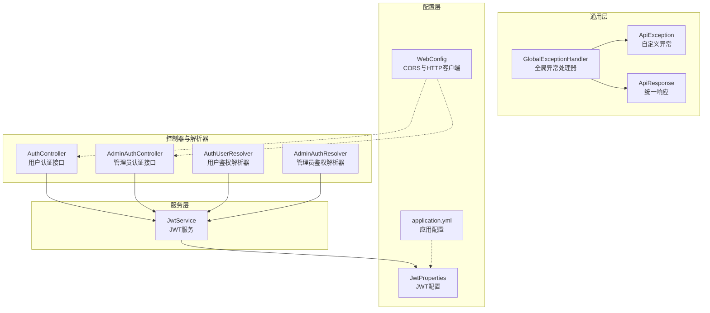
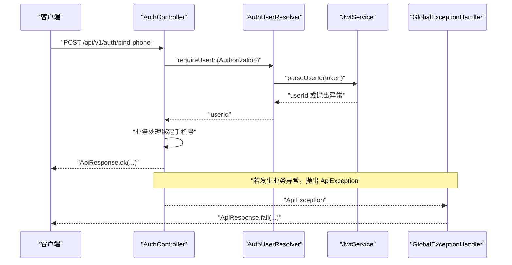
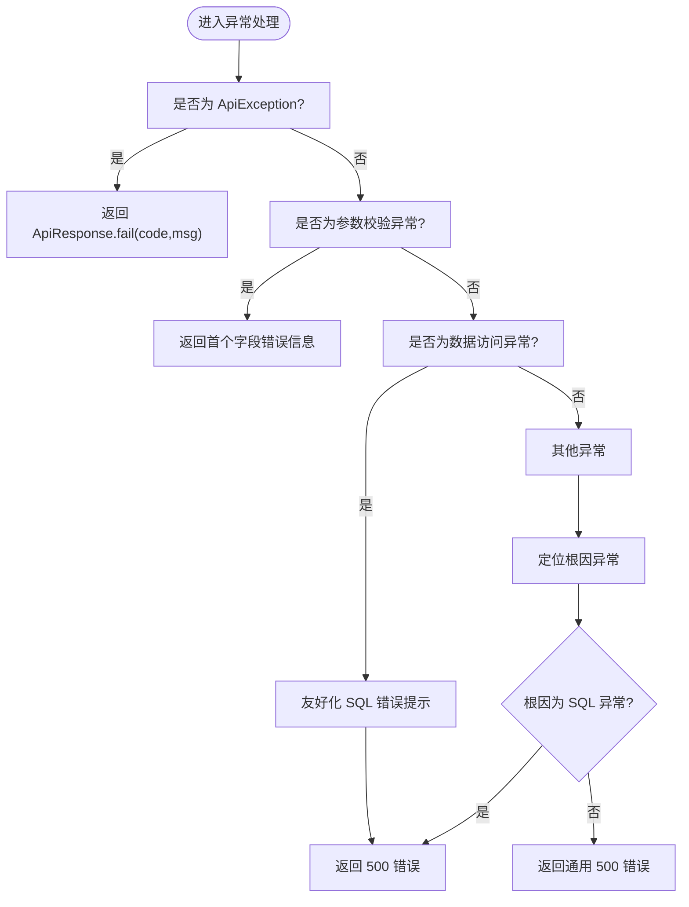
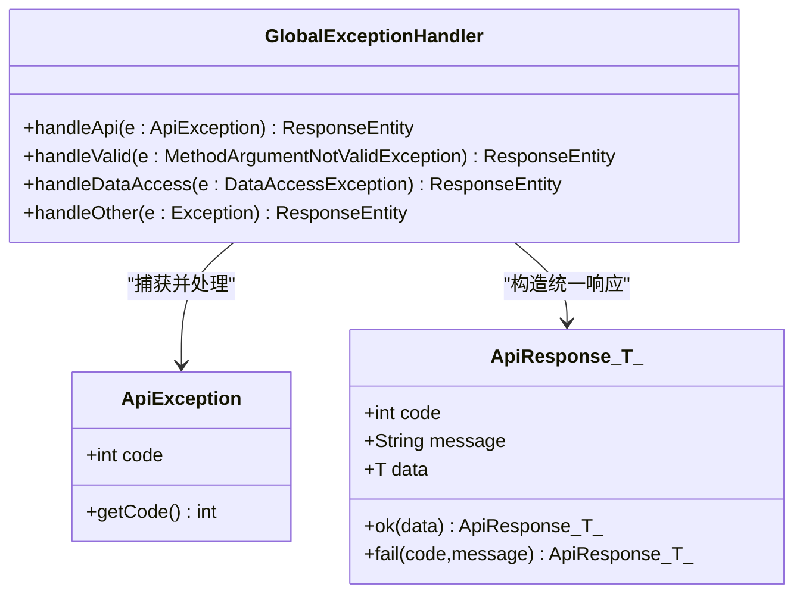
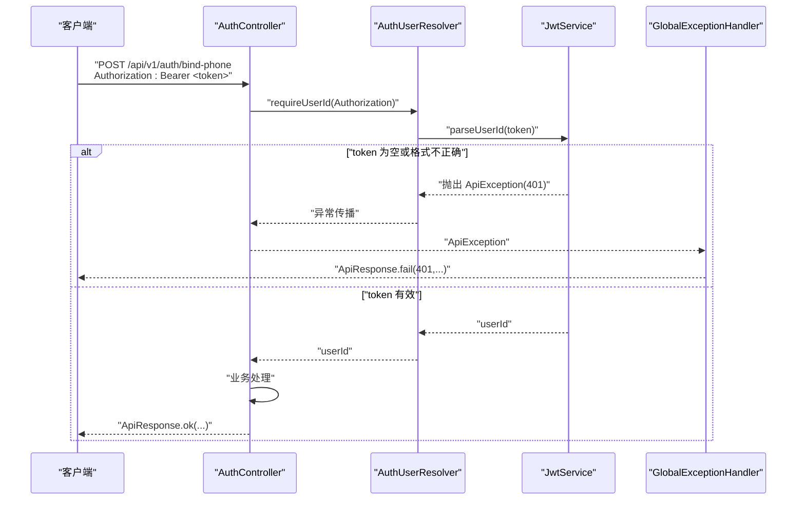
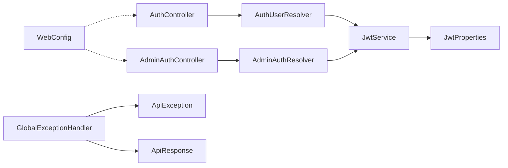

# 异常处理与安全机制

<cite>
**本文引用的文件**
- [GlobalExceptionHandler.java](file://backend/src/main/java/com/ypfr/loseweight/common/GlobalExceptionHandler.java)
- [ApiException.java](file://backend/src/main/java/com/ypfr/loseweight/common/ApiException.java)
- [ApiResponse.java](file://backend/src/main/java/com/ypfr/loseweight/common/ApiResponse.java)
- [JwtProperties.java](file://backend/src/main/java/com/ypfr/loseweight/config/JwtProperties.java)
- [JwtService.java](file://backend/src/main/java/com/ypfr/loseweight/service/JwtService.java)
- [WebConfig.java](file://backend/src/main/java/com/ypfr/loseweight/config/WebConfig.java)
- [application.yml](file://backend/src/main/resources/application.yml)
- [AuthController.java](file://backend/src/main/java/com/ypfr/loseweight/web/AuthController.java)
- [AdminAuthController.java](file://backend/src/main/java/com/ypfr/loseweight/web/AdminAuthController.java)
- [AuthUserResolver.java](file://backend/src/main/java/com/ypfr/loseweight/web/AuthUserResolver.java)
- [AdminAuthResolver.java](file://backend/src/main/java/com/ypfr/loseweight/web/AdminAuthResolver.java)
</cite>

## 目录
1. [简介](#简介)
2. [项目结构](#项目结构)
3. [核心组件](#核心组件)
4. [架构总览](#架构总览)
5. [详细组件分析](#详细组件分析)
6. [依赖分析](#依赖分析)
7. [性能考虑](#性能考虑)
8. [故障排查指南](#故障排查指南)
9. [结论](#结论)
10. [附录](#附录)

## 简介
本文件聚焦于系统的异常处理与安全机制，涵盖以下内容：
- 全局异常处理机制（GlobalExceptionHandler）的设计与实现，包括 ApiException 自定义异常、ApiResponse 统一响应格式，以及各类异常的处理策略。
- JWT 安全认证机制，包括 Token 的生成、验证与过期处理，以及 JwtProperties 配置参数的作用。
- 权限控制、接口保护、数据加密等安全措施。
- 安全最佳实践、常见安全漏洞防护与监控告警建议。

## 项目结构
后端采用 Spring MVC + MyBatis-Plus 架构，安全与异常处理相关的关键模块分布如下：
- common：统一异常与响应模型
- config：安全配置（JWT 参数、CORS）
- service：业务服务（含 JwtService）
- web：控制器与鉴权解析器（AuthController、AdminAuthController、AuthUserResolver、AdminAuthResolver）

图表来源
- [GlobalExceptionHandler.java:1-107](file://backend/src/main/java/com/ypfr/loseweight/common/GlobalExceptionHandler.java#L1-L107)
- [ApiException.java:1-16](file://backend/src/main/java/com/ypfr/loseweight/common/ApiException.java#L1-L16)
- [ApiResponse.java:1-35](file://backend/src/main/java/com/ypfr/loseweight/common/ApiResponse.java#L1-L35)
- [JwtProperties.java:1-29](file://backend/src/main/java/com/ypfr/loseweight/config/JwtProperties.java#L1-L29)
- [JwtService.java:1-58](file://backend/src/main/java/com/ypfr/loseweight/service/JwtService.java#L1-L58)
- [WebConfig.java:1-31](file://backend/src/main/java/com/ypfr/loseweight/config/WebConfig.java#L1-L31)
- [application.yml:1-54](file://backend/src/main/resources/application.yml#L1-L54)
- [AuthController.java:1-55](file://backend/src/main/java/com/ypfr/loseweight/web/AuthController.java#L1-L55)
- [AdminAuthController.java:1-62](file://backend/src/main/java/com/ypfr/loseweight/web/AdminAuthController.java#L1-L62)
- [AuthUserResolver.java:1-33](file://backend/src/main/java/com/ypfr/loseweight/web/AuthUserResolver.java#L1-L33)
- [AdminAuthResolver.java:1-28](file://backend/src/main/java/com/ypfr/loseweight/web/AdminAuthResolver.java#L1-L28)

章节来源
- [GlobalExceptionHandler.java:1-107](file://backend/src/main/java/com/ypfr/loseweight/common/GlobalExceptionHandler.java#L1-L107)
- [application.yml:1-54](file://backend/src/main/resources/application.yml#L1-L54)

## 核心组件
- 自定义异常与统一响应
  - ApiException：用于业务异常场景，携带业务状态码与消息。
  - ApiResponse：统一响应体，包含 code、message、data 字段，提供 ok/fail 工厂方法。
- 全局异常处理器
  - 捕获并转换各类异常为 ApiResponse，保证对外输出的一致性与可读性。
- JWT 安全配置与服务
  - JwtProperties：加载 app.jwt.* 配置项，提供密钥与过期时间。
  - JwtService：负责签发与校验 JWT，解析用户标识。
- 鉴权解析器与控制器
  - AuthUserResolver/AdminAuthResolver：从请求头提取并校验令牌，解析用户/管理员标识。
  - AuthController/AdminAuthController：提供微信登录、绑定手机号、管理员认证等接口。

章节来源
- [ApiException.java:1-16](file://backend/src/main/java/com/ypfr/loseweight/common/ApiException.java#L1-L16)
- [ApiResponse.java:1-35](file://backend/src/main/java/com/ypfr/loseweight/common/ApiResponse.java#L1-L35)
- [GlobalExceptionHandler.java:19-66](file://backend/src/main/java/com/ypfr/loseweight/common/GlobalExceptionHandler.java#L19-L66)
- [JwtProperties.java:5-28](file://backend/src/main/java/com/ypfr/loseweight/config/JwtProperties.java#L5-L28)
- [JwtService.java:14-57](file://backend/src/main/java/com/ypfr/loseweight/service/JwtService.java#L14-L57)
- [AuthUserResolver.java:17-31](file://backend/src/main/java/com/ypfr/loseweight/web/AuthUserResolver.java#L17-L31)
- [AdminAuthResolver.java:17-26](file://backend/src/main/java/com/ypfr/loseweight/web/AdminAuthResolver.java#L17-L26)
- [AuthController.java:32-53](file://backend/src/main/java/com/ypfr/loseweight/web/AuthController.java#L32-L53)
- [AdminAuthController.java:36-60](file://backend/src/main/java/com/ypfr/loseweight/web/AdminAuthController.java#L36-L60)

## 架构总览
系统通过“控制器 → 鉴权解析器 → 业务服务 → 数据访问”的链路实现安全与异常处理闭环。鉴权解析器负责从请求头中提取 Authorization 并调用 JwtService 进行校验；业务异常由 ApiException 抛出，最终被 GlobalExceptionHandler 统一捕获并返回 ApiResponse。

图表来源
- [AuthController.java:42-53](file://backend/src/main/java/com/ypfr/loseweight/web/AuthController.java#L42-L53)
- [AuthUserResolver.java:17-22](file://backend/src/main/java/com/ypfr/loseweight/web/AuthUserResolver.java#L17-L22)
- [JwtService.java:40-56](file://backend/src/main/java/com/ypfr/loseweight/service/JwtService.java#L40-L56)
- [GlobalExceptionHandler.java:19-22](file://backend/src/main/java/com/ypfr/loseweight/common/GlobalExceptionHandler.java#L19-L22)

## 详细组件分析

### 全局异常处理机制（GlobalExceptionHandler）
- 设计目标
  - 将业务异常、参数校验异常、数据访问异常、未捕获异常统一转换为 ApiResponse，确保前端一致的错误处理体验。
- 处理策略
  - ApiException：返回 400 与具体业务错误码与消息。
  - MethodArgumentNotValidException：提取首个字段错误信息，返回 400。
  - DataAccessException/TypeException：记录数据库错误，返回 500，并对特定 SQL 错误进行友好提示（如缺失表/列、类型映射问题）。
  - Exception：兜底处理，区分 SQL 异常与其它异常，返回 500。
- 友好化 SQL 错误
  - 针对 vip_product 表、food_category.code、app_user.phone、profile_completed 等常见缺失列，给出迁移脚本指引与缩短后的原始错误信息，便于运维快速定位。

图表来源
- [GlobalExceptionHandler.java:19-105](file://backend/src/main/java/com/ypfr/loseweight/common/GlobalExceptionHandler.java#L19-L105)

章节来源
- [GlobalExceptionHandler.java:19-105](file://backend/src/main/java/com/ypfr/loseweight/common/GlobalExceptionHandler.java#L19-L105)

### 自定义异常与统一响应（ApiException 与 ApiResponse）
- ApiException
  - 以业务码与消息封装运行时异常，便于上层统一处理。
- ApiResponse
  - 提供 ok/fail 工厂方法，统一返回结构，前端可按 code/message/data 解析。

图表来源
- [ApiException.java:3-15](file://backend/src/main/java/com/ypfr/loseweight/common/ApiException.java#L3-L15)
- [ApiResponse.java:3-35](file://backend/src/main/java/com/ypfr/loseweight/common/ApiResponse.java#L3-L35)
- [GlobalExceptionHandler.java:19-66](file://backend/src/main/java/com/ypfr/loseweight/common/GlobalExceptionHandler.java#L19-L66)

章节来源
- [ApiException.java:1-16](file://backend/src/main/java/com/ypfr/loseweight/common/ApiException.java#L1-L16)
- [ApiResponse.java:1-35](file://backend/src/main/java/com/ypfr/loseweight/common/ApiResponse.java#L1-L35)
- [GlobalExceptionHandler.java:19-66](file://backend/src/main/java/com/ypfr/loseweight/common/GlobalExceptionHandler.java#L19-L66)

### JWT 安全认证机制
- 配置参数（JwtProperties）
  - secret：HS256 密钥，要求至少 32 字节，建议使用随机字符串。
  - expire-seconds：Token 过期秒数，默认一周。
- Token 生成（JwtService.createToken）
  - 使用 HMAC-SHA256 签名，载荷包含 issuedAt、expiration 与 subject（用户标识），签名后 compact 输出。
- Token 校验（JwtService.parseUserId）
  - 校验签名与过期时间，解析 subject 为 Long 用户 ID；非法或过期抛出 401 业务异常。
- 控制器与解析器集成
  - AuthController/AdminAuthController 在需要鉴权的接口中通过 AuthUserResolver/AdminAuthResolver 从 Authorization 头解析用户/管理员 ID。
  - AuthController.bindPhone 对 Authorization 头进行严格校验，非 Bearer 或无效 token 直接抛出 401。

图表来源
- [AuthController.java:42-53](file://backend/src/main/java/com/ypfr/loseweight/web/AuthController.java#L42-L53)
- [AuthUserResolver.java:17-22](file://backend/src/main/java/com/ypfr/loseweight/web/AuthUserResolver.java#L17-L22)
- [JwtService.java:29-56](file://backend/src/main/java/com/ypfr/loseweight/service/JwtService.java#L29-L56)
- [GlobalExceptionHandler.java:19-22](file://backend/src/main/java/com/ypfr/loseweight/common/GlobalExceptionHandler.java#L19-L22)

章节来源
- [JwtProperties.java:5-28](file://backend/src/main/java/com/ypfr/loseweight/config/JwtProperties.java#L5-L28)
- [JwtService.java:14-57](file://backend/src/main/java/com/ypfr/loseweight/service/JwtService.java#L14-L57)
- [AuthController.java:42-53](file://backend/src/main/java/com/ypfr/loseweight/web/AuthController.java#L42-L53)
- [AuthUserResolver.java:17-22](file://backend/src/main/java/com/ypfr/loseweight/web/AuthUserResolver.java#L17-L22)

### 权限控制与接口保护
- 授权头规范
  - 用户接口：Authorization: Bearer <token>，解析失败直接 401。
  - 管理员接口：AdminAuthResolver 支持 Bearer 前缀，解析管理员 ID。
- 资源级权限
  - AuthUserResolver.requirePathUser 校验路径中的用户 ID 与令牌中的用户 ID 是否一致，防止越权访问。
- CORS 与传输安全
  - WebConfig 配置了 /api/** 的跨域规则，生产环境建议限制 allowedOriginPatterns 并开启 HTTPS。
  - application.yml 中数据库连接使用明文（开发默认），生产应启用 SSL 与强口令。

章节来源
- [AuthUserResolver.java:24-30](file://backend/src/main/java/com/ypfr/loseweight/web/AuthUserResolver.java#L24-L30)
- [AdminAuthResolver.java:17-26](file://backend/src/main/java/com/ypfr/loseweight/web/AdminAuthResolver.java#L17-L26)
- [WebConfig.java:14-21](file://backend/src/main/java/com/ypfr/loseweight/config/WebConfig.java#L14-L21)
- [application.yml:8-11](file://backend/src/main/resources/application.yml#L8-L11)

### 数据加密与敏感信息
- JWT 密钥
  - JwtProperties.secret 要求至少 32 字节，避免弱密钥导致的安全风险。
- 数据库凭据
  - application.yml 中示例展示了明文数据库密码，生产必须替换为安全存储（如环境变量或密钥管理服务）。
- 日志与错误信息
  - GlobalExceptionHandler 对 SQL 错误进行友好化处理，避免泄露底层细节。

章节来源
- [JwtProperties.java:8-9](file://backend/src/main/java/com/ypfr/loseweight/config/JwtProperties.java#L8-L9)
- [application.yml:45-46](file://backend/src/main/resources/application.yml#L45-L46)
- [application.yml:10-11](file://backend/src/main/resources/application.yml#L10-L11)
- [GlobalExceptionHandler.java:68-97](file://backend/src/main/java/com/ypfr/loseweight/common/GlobalExceptionHandler.java#L68-L97)

## 依赖分析
- 组件耦合
  - 控制器依赖解析器，解析器依赖 JwtService，JwtService 依赖 JwtProperties。
  - 全局异常处理器独立于业务逻辑，仅依赖异常与响应模型。
- 外部依赖
  - Spring MVC（@RestControllerAdvice、@Configuration）、MyBatis-Plus（数据访问）、Java JWT 库（io.jsonwebtoken）。

图表来源
- [AuthController.java:27-30](file://backend/src/main/java/com/ypfr/loseweight/web/AuthController.java#L27-L30)
- [AdminAuthController.java:27-34](file://backend/src/main/java/com/ypfr/loseweight/web/AdminAuthController.java#L27-L34)
- [AuthUserResolver.java:13-15](file://backend/src/main/java/com/ypfr/loseweight/web/AuthUserResolver.java#L13-L15)
- [AdminAuthResolver.java:13-15](file://backend/src/main/java/com/ypfr/loseweight/web/AdminAuthResolver.java#L13-L15)
- [JwtService.java:20-27](file://backend/src/main/java/com/ypfr/loseweight/service/JwtService.java#L20-L27)
- [JwtProperties.java:5-28](file://backend/src/main/java/com/ypfr/loseweight/config/JwtProperties.java#L5-L28)
- [GlobalExceptionHandler.java:14-17](file://backend/src/main/java/com/ypfr/loseweight/common/GlobalExceptionHandler.java#L14-L17)
- [WebConfig.java:10-31](file://backend/src/main/java/com/ypfr/loseweight/config/WebConfig.java#L10-L31)

章节来源
- [AuthController.java:27-30](file://backend/src/main/java/com/ypfr/loseweight/web/AuthController.java#L27-L30)
- [AdminAuthController.java:27-34](file://backend/src/main/java/com/ypfr/loseweight/web/AdminAuthController.java#L27-L34)
- [AuthUserResolver.java:13-15](file://backend/src/main/java/com/ypfr/loseweight/web/AuthUserResolver.java#L13-L15)
- [AdminAuthResolver.java:13-15](file://backend/src/main/java/com/ypfr/loseweight/web/AdminAuthResolver.java#L13-L15)
- [JwtService.java:20-27](file://backend/src/main/java/com/ypfr/loseweight/service/JwtService.java#L20-L27)
- [JwtProperties.java:5-28](file://backend/src/main/java/com/ypfr/loseweight/config/JwtProperties.java#L5-L28)
- [GlobalExceptionHandler.java:14-17](file://backend/src/main/java/com/ypfr/loseweight/common/GlobalExceptionHandler.java#L14-L17)
- [WebConfig.java:10-31](file://backend/src/main/java/com/ypfr/loseweight/config/WebConfig.java#L10-L31)

## 性能考虑
- Token 过期时间
  - 默认一周（604800 秒），建议根据业务场景调整，过短增加刷新频率，过长增加会话暴露风险。
- 校验开销
  - 每次请求均需解析与校验 JWT，建议在网关层或中间件缓存近期活跃用户的用户 ID，降低重复解析成本。
- 数据库异常友好化
  - GlobalExceptionHandler 对 SQL 错误进行友好化提示，减少前端重试风暴，提升用户体验。

## 故障排查指南
- 401 未授权
  - 检查 Authorization 头格式是否为 Bearer <token>，确认 token 未过期且密钥正确。
- 500 内部错误
  - 查看服务端日志，关注 SQL 错误提示；若提示缺失列或表，按指引执行对应迁移脚本。
- 参数校验失败
  - 关注首个字段错误信息，修正请求体字段与格式。
- CORS 跨域问题
  - 确认 WebConfig 中 /api/** 的跨域规则与生产环境 allowedOriginPatterns 设置。

章节来源
- [GlobalExceptionHandler.java:19-66](file://backend/src/main/java/com/ypfr/loseweight/common/GlobalExceptionHandler.java#L19-L66)
- [AuthController.java:46-48](file://backend/src/main/java/com/ypfr/loseweight/web/AuthController.java#L46-L48)
- [WebConfig.java:14-21](file://backend/src/main/java/com/ypfr/loseweight/config/WebConfig.java#L14-L21)

## 结论
本系统通过统一的异常与响应模型、严谨的 JWT 安全机制、严格的鉴权解析与接口保护，构建了清晰、可维护、可扩展的安全架构。建议在生产环境中进一步强化密钥管理、传输加密、跨域策略与监控告警体系，持续提升整体安全性与稳定性。

## 附录
- 安全最佳实践
  - 密钥管理：使用安全存储与轮换机制，定期更换 JwtProperties.secret。
  - 传输安全：启用 HTTPS，限制 CORS 允许来源。
  - 日志与审计：记录登录、变更密码、越权尝试等关键事件，设置告警阈值。
  - 输入校验：结合 Bean Validation 与全局异常处理，确保前后端一致的错误反馈。
- 常见漏洞防护
  - 注入攻击：使用 ORM 与预编译语句，避免动态拼接 SQL。
  - 会话劫持：缩短过期时间、强制刷新、支持黑名单与服务端会话存储。
  - 信息泄露：避免在错误信息中暴露内部实现细节，使用友好化提示。