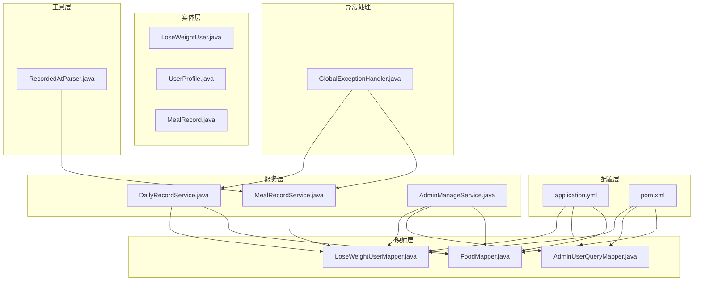
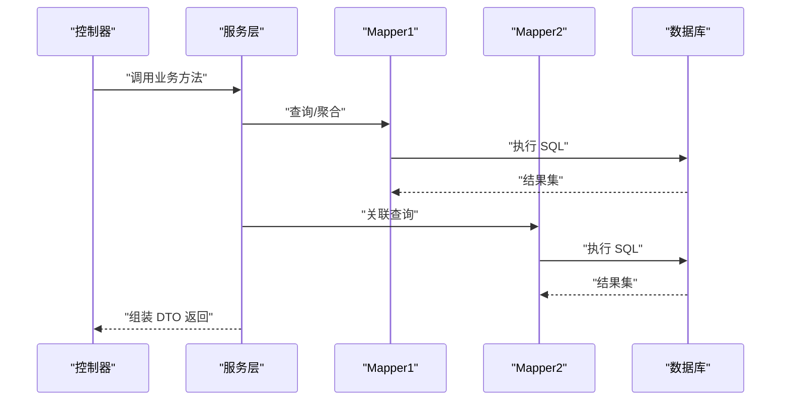
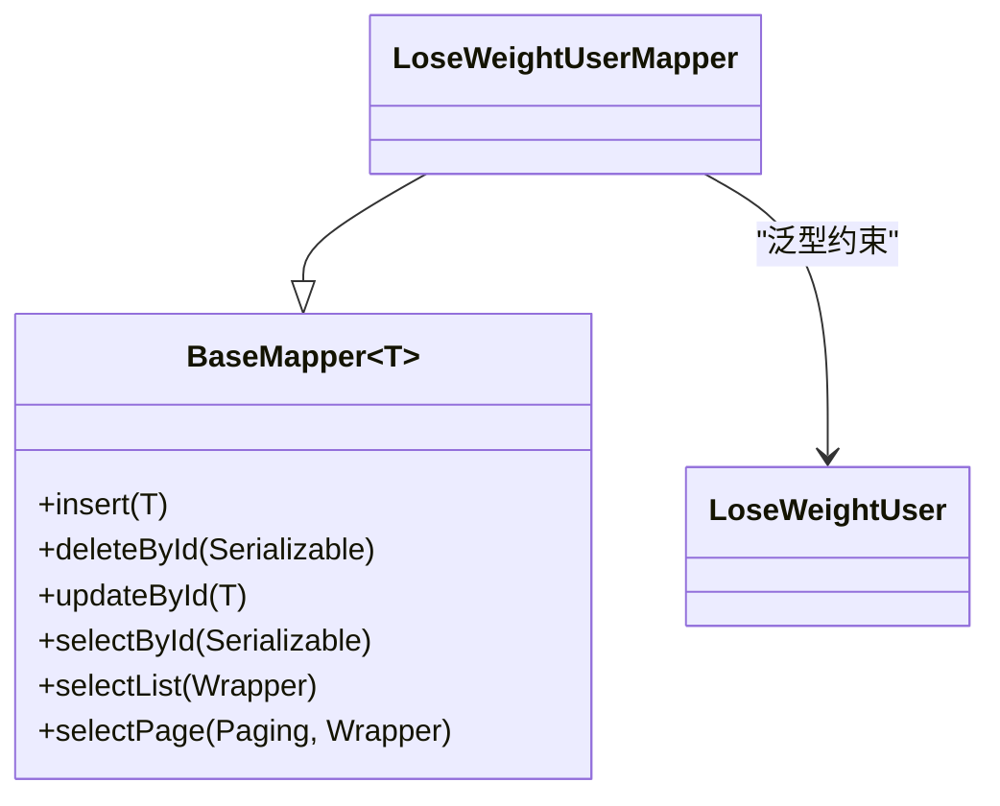
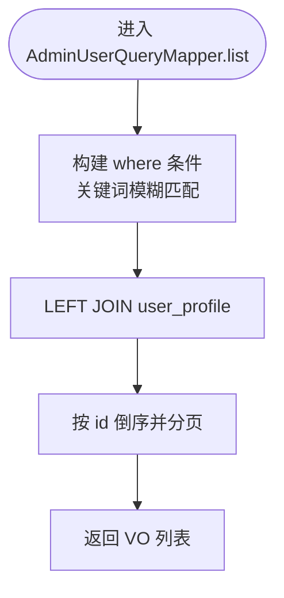
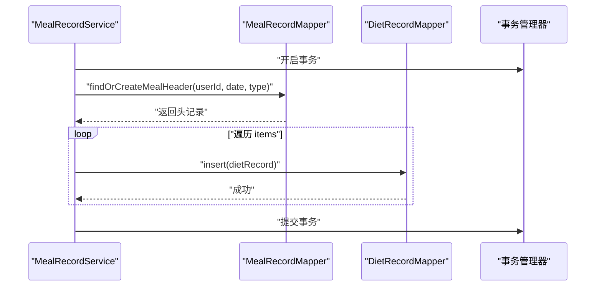
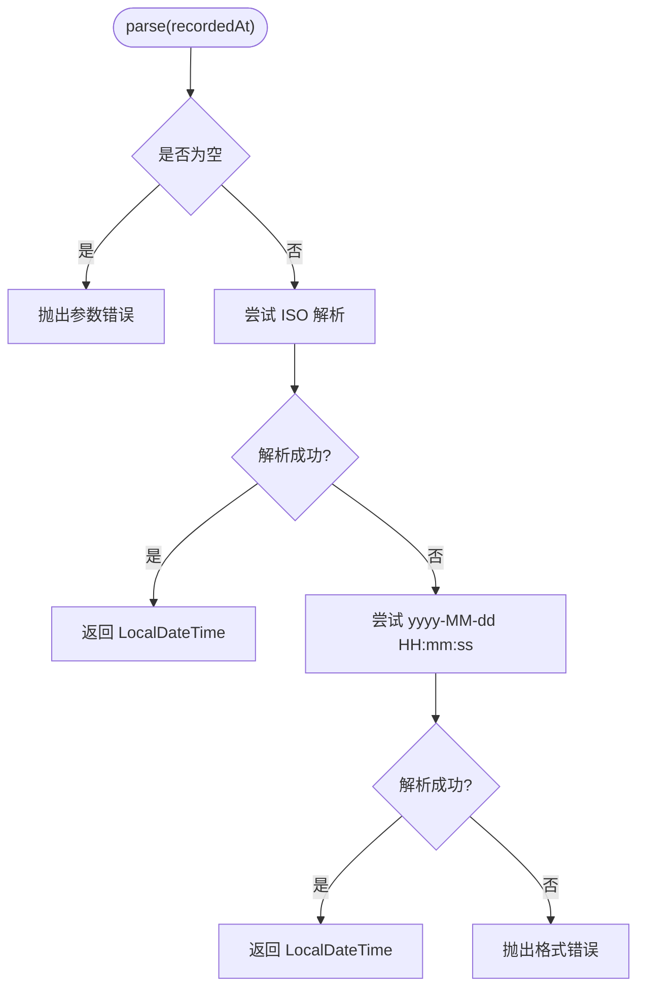
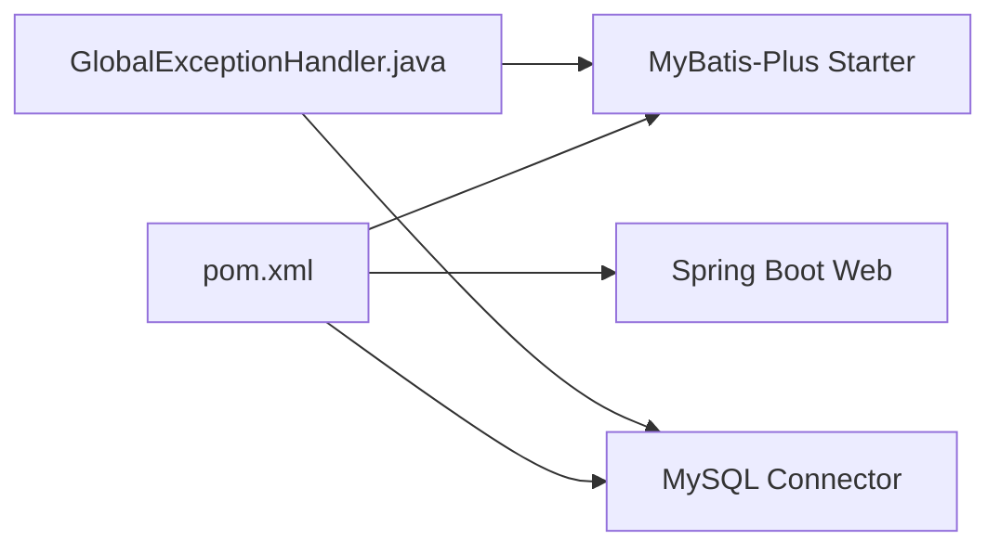

# 数据访问层设计

<cite>
**本文引用的文件**
- [application.yml](file://backend/src/main/resources/application.yml)
- [pom.xml](file://backend/pom.xml)
- [LoseWeightUser.java](file://backend/src/main/java/com/ypfr/loseweight/domain/LoseWeightUser.java)
- [UserProfile.java](file://backend/src/main/java/com/ypfr/loseweight/domain/UserProfile.java)
- [MealRecord.java](file://backend/src/main/java/com/ypfr/loseweight/domain/MealRecord.java)
- [LoseWeightUserMapper.java](file://backend/src/main/java/com/ypfr/loseweight/mapper/LoseWeightUserMapper.java)
- [AdminUserQueryMapper.java](file://backend/src/main/java/com/ypfr/loseweight/mapper/AdminUserQueryMapper.java)
- [FoodMapper.java](file://backend/src/main/java/com/ypfr/loseweight/mapper/FoodMapper.java)
- [RecordedAtParser.java](file://backend/src/main/java/com/ypfr/loseweight/util/RecordedAtParser.java)
- [DailyRecordService.java](file://backend/src/main/java/com/ypfr/loseweight/service/DailyRecordService.java)
- [MealRecordService.java](file://backend/src/main/java/com/ypfr/loseweight/service/MealRecordService.java)
- [GlobalExceptionHandler.java](file://backend/src/main/java/com/ypfr/loseweight/common/GlobalExceptionHandler.java)
- [AdminManageService.java](file://backend/src/main/java/com/ypfr/loseweight/service/AdminManageService.java)
- [AdminPagedResult.java](file://backend/src/main/java/com/ypfr/loseweight/web/dto/admin/AdminPagedResult.java)
</cite>

## 目录
1. [简介](#简介)
2. [项目结构](#项目结构)
3. [核心组件](#核心组件)
4. [架构总览](#架构总览)
5. [详细组件分析](#详细组件分析)
6. [依赖分析](#依赖分析)
7. [性能考虑](#性能考虑)
8. [故障排查指南](#故障排查指南)
9. [结论](#结论)
10. [附录](#附录)

## 简介
本文件面向数据访问层设计，系统性阐述 MyBatis-Plus 在本项目中的使用方式、Mapper 接口设计原则、XML 映射文件编写规范、通用 Mapper 的继承关系、CRUD 与复杂查询实现、实体类与数据库表的映射关系及字段命名规范、注解使用、RecordedAtParser 等工具类的设计思路与使用场景，并给出性能优化策略、批量操作实现、分页查询处理与事务管理机制。

## 项目结构
后端采用 Spring Boot + MyBatis-Plus 架构，数据访问层主要由以下模块构成：
- 实体层：位于 domain 包，使用 MyBatis-Plus 注解标注表名与主键策略
- 映射层：位于 mapper 包，提供通用 Mapper 接口与自定义 SQL 查询接口
- 服务层：位于 service 包，封装业务逻辑，协调多个 Mapper 完成复杂查询与事务控制
- 工具层：位于 util 包，提供日期解析等工具方法
- 配置层：application.yml 中启用 MyBatis-Plus 并设置驼峰映射与日志输出

图表来源
- [application.yml:21-28](file://backend/src/main/resources/application.yml#L21-L28)
- [pom.xml:39-42](file://backend/pom.xml#L39-L42)
- [LoseWeightUser.java:8-31](file://backend/src/main/java/com/ypfr/loseweight/domain/LoseWeightUser.java#L8-L31)
- [UserProfile.java:10-26](file://backend/src/main/java/com/ypfr/loseweight/domain/UserProfile.java#L10-L26)
- [MealRecord.java:10-27](file://backend/src/main/java/com/ypfr/loseweight/domain/MealRecord.java#L10-L27)
- [LoseWeightUserMapper.java:3-8](file://backend/src/main/java/com/ypfr/loseweight/mapper/LoseWeightUserMapper.java#L3-L8)
- [AdminUserQueryMapper.java:9-40](file://backend/src/main/java/com/ypfr/loseweight/mapper/AdminUserQueryMapper.java#L9-L40)
- [FoodMapper.java:37-68](file://backend/src/main/java/com/ypfr/loseweight/mapper/FoodMapper.java#L37-L68)
- [DailyRecordService.java:20-42](file://backend/src/main/java/com/ypfr/loseweight/service/DailyRecordService.java#L20-L42)
- [MealRecordService.java:116-149](file://backend/src/main/java/com/ypfr/loseweight/service/MealRecordService.java#L116-L149)
- [AdminManageService.java:31-56](file://backend/src/main/java/com/ypfr/loseweight/service/AdminManageService.java#L31-L56)
- [RecordedAtParser.java:8-31](file://backend/src/main/java/com/ypfr/loseweight/util/RecordedAtParser.java#L8-L31)
- [GlobalExceptionHandler.java:14-66](file://backend/src/main/java/com/ypfr/loseweight/common/GlobalExceptionHandler.java#L14-L66)

章节来源
- [application.yml:1-54](file://backend/src/main/resources/application.yml#L1-L54)
- [pom.xml:1-86](file://backend/pom.xml#L1-L86)

## 核心组件
- MyBatis-Plus 配置：开启下划线到驼峰映射、日志输出，统一 ID 类型策略
- 通用 Mapper：通过继承 BaseMapper 提供 CRUD 能力，减少重复 XML
- 自定义 SQL Mapper：使用 @Select 与动态 SQL 实现复杂查询与分页
- 实体类注解：@TableName、@TableId 等确保表与字段映射正确
- 工具类：RecordedAtParser 统一解析时间字符串，提升输入容错性
- 异常处理：集中捕获数据访问异常与类型映射异常，返回友好提示

章节来源
- [application.yml:21-28](file://backend/src/main/resources/application.yml#L21-L28)
- [LoseWeightUserMapper.java:3-8](file://backend/src/main/java/com/ypfr/loseweight/mapper/LoseWeightUserMapper.java#L3-L8)
- [AdminUserQueryMapper.java:12-39](file://backend/src/main/java/com/ypfr/loseweight/mapper/AdminUserQueryMapper.java#L12-L39)
- [LoseWeightUser.java:8-31](file://backend/src/main/java/com/ypfr/loseweight/domain/LoseWeightUser.java#L8-L31)
- [RecordedAtParser.java:15-30](file://backend/src/main/java/com/ypfr/loseweight/util/RecordedAtParser.java#L15-L30)
- [GlobalExceptionHandler.java:34-51](file://backend/src/main/java/com/ypfr/loseweight/common/GlobalExceptionHandler.java#L34-L51)

## 架构总览
数据访问层遵循“实体-映射-服务-控制器”的分层设计，服务层负责组合多个 Mapper 完成复杂业务，事务边界在服务层声明，异常统一由全局处理器处理。

图表来源
- [DailyRecordService.java:44-84](file://backend/src/main/java/com/ypfr/loseweight/service/DailyRecordService.java#L44-L84)
- [AdminManageService.java:31-56](file://backend/src/main/java/com/ypfr/loseweight/service/AdminManageService.java#L31-L56)

## 详细组件分析

### 通用 Mapper 设计与继承关系
- 继承关系：Mapper 接口统一继承 BaseMapper，即可获得标准 CRUD 能力
- 典型示例：LoseWeightUserMapper 继承 BaseMapper<LoseWeightUser>
- 优势：减少 XML 文件数量，降低维护成本，统一命名与行为

图表来源
- [LoseWeightUserMapper.java:3-8](file://backend/src/main/java/com/ypfr/loseweight/mapper/LoseWeightUserMapper.java#L3-L8)
- [LoseWeightUser.java:8-31](file://backend/src/main/java/com/ypfr/loseweight/domain/LoseWeightUser.java#L8-L31)

章节来源
- [LoseWeightUserMapper.java:3-8](file://backend/src/main/java/com/ypfr/loseweight/mapper/LoseWeightUserMapper.java#L3-L8)

### 实体类与数据库表映射、字段命名规范与注解使用
- 表名映射：@TableName 指定物理表名，如 lw_user、user_profile、meal_record
- 主键策略：@TableId(type = IdType.AUTO) 使用数据库自增
- 字段命名：Java 字段采用驼峰，MyBatis-Plus 开启 map-underscore-to-camel-case，自动完成下划线与驼峰转换
- 时间字段：LocalDateTime 与数据库 DATETIME 对应，避免额外转换
- 示例实体：
  - LoseWeightUser：用户主表，包含 openid、unionid、昵称、头像、手机号等字段
  - UserProfile：用户档案表，包含性别、年龄、身高、体重、目标等字段
  - MealRecord：餐次头表，记录日期、餐型、宏量营养素合计等

章节来源
- [LoseWeightUser.java:8-31](file://backend/src/main/java/com/ypfr/loseweight/domain/LoseWeightUser.java#L8-L31)
- [UserProfile.java:10-26](file://backend/src/main/java/com/ypfr/loseweight/domain/UserProfile.java#L10-L26)
- [MealRecord.java:10-27](file://backend/src/main/java/com/ypfr/loseweight/domain/MealRecord.java#L10-L27)
- [application.yml:23](file://backend/src/main/resources/application.yml#L23)

### XML 映射文件编写规范与复杂查询实现
- 动态 SQL：使用 <script>、<where>、<if> 组合实现条件拼接，如 AdminUserQueryMapper 的关键词搜索与分页
- 关联查询：LEFT JOIN、INNER JOIN 实现跨表聚合，如用户列表与档案信息联查
- 分页实现：LIMIT #{offset}, #{limit} 结合 count 查询实现分页总数
- 字段别名：使用 AS 将数据库字段映射到 DTO 属性，保持命名一致性

图表来源
- [AdminUserQueryMapper.java:12-27](file://backend/src/main/java/com/ypfr/loseweight/mapper/AdminUserQueryMapper.java#L12-L27)

章节来源
- [AdminUserQueryMapper.java:12-39](file://backend/src/main/java/com/ypfr/loseweight/mapper/AdminUserQueryMapper.java#L12-L39)

### 复杂查询 SQL 编写技巧
- 模糊搜索：CONCAT('%', #{keyword}, '%') 实现 nickname 或 phone 的模糊匹配
- 权限过滤：根据用户是否自建食物，限制可见范围（is_custom 与 creator_user_id）
- 排序优先级：自建食物优先于公共库，名称升序排列
- 参数化：使用 @Param 注解明确传参，避免 SQL 注入风险

章节来源
- [AdminUserQueryMapper.java:18-23](file://backend/src/main/java/com/ypfr/loseweight/mapper/AdminUserQueryMapper.java#L18-L23)
- [FoodMapper.java:37-68](file://backend/src/main/java/com/ypfr/loseweight/mapper/FoodMapper.java#L37-L68)

### CRUD 操作实现方式
- 插入/更新/删除：通过 LoseWeightUserMapper 继承的 BaseMapper 提供的标准方法完成
- 查询：支持按主键查询、列表查询、分页查询；复杂条件通过自定义 SQL 实现
- 聚合：服务层调用 Mapper 的 sumXXX 方法进行按日汇总

章节来源
- [LoseWeightUserMapper.java:3-8](file://backend/src/main/java/com/ypfr/loseweight/mapper/LoseWeightUserMapper.java#L3-L8)
- [DailyRecordService.java:44-49](file://backend/src/main/java/com/ypfr/loseweight/service/DailyRecordService.java#L44-L49)

### 批量操作实现
- 批量追加餐食记录：MealRecordService.createBatchAppend 在同一事务中先查找或创建头表，再批量插入明细
- 事务边界：@Transactional 保证头表与明细的一致性
- 输入校验：对 recordDate、mealType、items 数量进行严格校验，防止超限与格式错误

图表来源
- [MealRecordService.java:116-149](file://backend/src/main/java/com/ypfr/loseweight/service/MealRecordService.java#L116-L149)

章节来源
- [MealRecordService.java:116-149](file://backend/src/main/java/com/ypfr/loseweight/service/MealRecordService.java#L116-L149)

### 分页查询处理
- Mapper 层：AdminUserQueryMapper 提供 list/count 两个方法，count 用于计算总条数
- DTO 层：AdminPagedResult 封装 total/page/pageSize/list，便于前端展示
- 服务层：组合 Mapper 的 list/count，组装分页结果

章节来源
- [AdminUserQueryMapper.java:26-39](file://backend/src/main/java/com/ypfr/loseweight/mapper/AdminUserQueryMapper.java#L26-L39)
- [AdminPagedResult.java:6-44](file://backend/src/main/java/com/ypfr/loseweight/web/dto/admin/AdminPagedResult.java#L6-L44)

### 事务管理机制
- 声明式事务：在服务层使用 @Transactional 标注批量写入流程，确保原子性
- 事务传播：默认 REQUIRED，嵌套调用共享同一事务上下文
- 回滚规则：异常触发回滚，结合全局异常处理保障一致性

章节来源
- [MealRecordService.java:116-149](file://backend/src/main/java/com/ypfr/loseweight/service/MealRecordService.java#L116-L149)

### RecordedAtParser 工具类设计思路与使用场景
- 设计目标：统一解析 recordedAt 字符串，兼容 ISO 本地时间与传统格式 yyyy-MM-dd HH:mm:ss
- 错误处理：空值抛出参数错误，解析失败抛出格式错误，保证上层调用安全
- 使用场景：批量导入、记录时间归一化、前端时间字符串标准化

图表来源
- [RecordedAtParser.java:15-30](file://backend/src/main/java/com/ypfr/loseweight/util/RecordedAtParser.java#L15-L30)

章节来源
- [RecordedAtParser.java:8-31](file://backend/src/main/java/com/ypfr/loseweight/util/RecordedAtParser.java#L8-L31)

### 性能优化策略
- 启用驼峰映射：避免手动映射开销，提升读取效率
- 合理索引：根据查询条件建立索引（如 nickname、phone、user_id、record_date 等）
- 分页与 LIMIT：避免一次性加载全量数据，结合 count 实现高效分页
- 动态 SQL：仅拼接必要条件，减少全表扫描
- 批量写入：合并多次 INSERT 为批量 INSERT，降低网络往返与锁竞争

章节来源
- [application.yml:23](file://backend/src/main/resources/application.yml#L23)
- [AdminUserQueryMapper.java:18-23](file://backend/src/main/java/com/ypfr/loseweight/mapper/AdminUserQueryMapper.java#L18-L23)

## 依赖分析
- MyBatis-Plus Starter：提供 ORM 能力与自动配置
- MySQL Connector：数据库驱动
- Spring Boot Web：提供 HTTP 接口能力
- 全局异常处理：统一捕获数据访问异常与类型映射异常

图表来源
- [pom.xml:39-42](file://backend/pom.xml#L39-L42)
- [GlobalExceptionHandler.java:34-51](file://backend/src/main/java/com/ypfr/loseweight/common/GlobalExceptionHandler.java#L34-L51)

章节来源
- [pom.xml:25-75](file://backend/pom.xml#L25-L75)

## 性能考虑
- 驼峰映射与日志：开启 map-underscore-to-camel-case 与日志输出，便于定位慢查询与字段映射问题
- 分页与聚合：服务层按天聚合，避免 Mapper 层复杂 SQL；分页 LIMIT 控制单页大小
- 批量写入：批量插入明细，减少事务内循环次数
- 异常快速失败：RecordedAtParser 提前校验输入，避免无效请求进入数据库层

章节来源
- [application.yml:23-24](file://backend/src/main/resources/application.yml#L23-L24)
- [DailyRecordService.java:44-84](file://backend/src/main/java/com/ypfr/loseweight/service/DailyRecordService.java#L44-L84)
- [MealRecordService.java:116-149](file://backend/src/main/java/com/ypfr/loseweight/service/MealRecordService.java#L116-L149)
- [RecordedAtParser.java:15-30](file://backend/src/main/java/com/ypfr/loseweight/util/RecordedAtParser.java#L15-L30)

## 故障排查指南
- 数据库列与类型映射失败：常见于 tinyint 与 Boolean 的映射冲突，需按提示执行迁移脚本后重启
- 数据库结构落后：提示对照 migrations 目录执行未应用脚本
- 未捕获异常：全局异常处理器将根因 SQL 异常转为友好消息，便于定位问题

章节来源
- [GlobalExceptionHandler.java:34-51](file://backend/src/main/java/com/ypfr/loseweight/common/GlobalExceptionHandler.java#L34-L51)
- [GlobalExceptionHandler.java:87-106](file://backend/src/main/java/com/ypfr/loseweight/common/GlobalExceptionHandler.java#L87-L106)

## 结论
本项目以 MyBatis-Plus 为核心，通过通用 Mapper 与自定义 SQL 的组合，实现了清晰的数据访问层设计。实体类与注解确保了表结构与 Java 对象的稳定映射；服务层承担事务与复杂查询编排；工具类与全局异常处理提升了可用性与可观测性。配合合理的分页、批量与索引策略，整体具备良好的扩展性与性能表现。

## 附录
- 配置要点：application.yml 中的 MyBatis-Plus 配置、驼峰映射与日志级别
- 依赖要点：pom.xml 中的 MyBatis-Plus Starter、MySQL Connector 与 Web 依赖

章节来源
- [application.yml:21-28](file://backend/src/main/resources/application.yml#L21-L28)
- [pom.xml:39-42](file://backend/pom.xml#L39-L42)