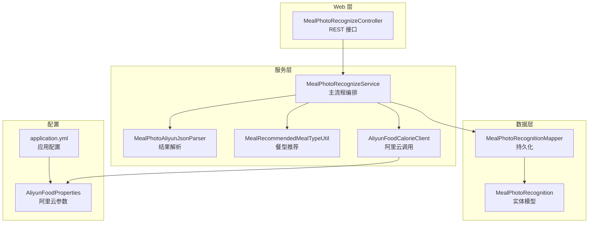
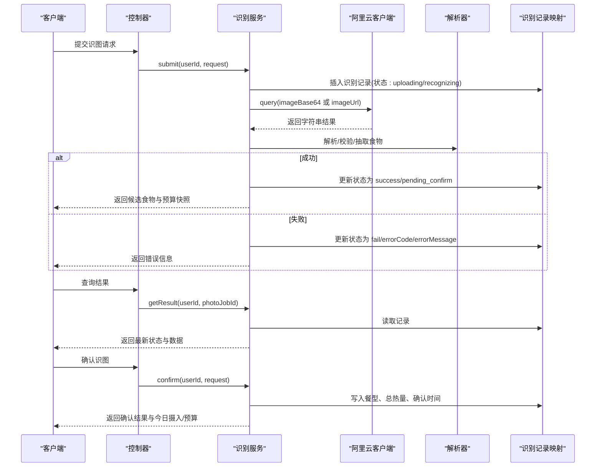
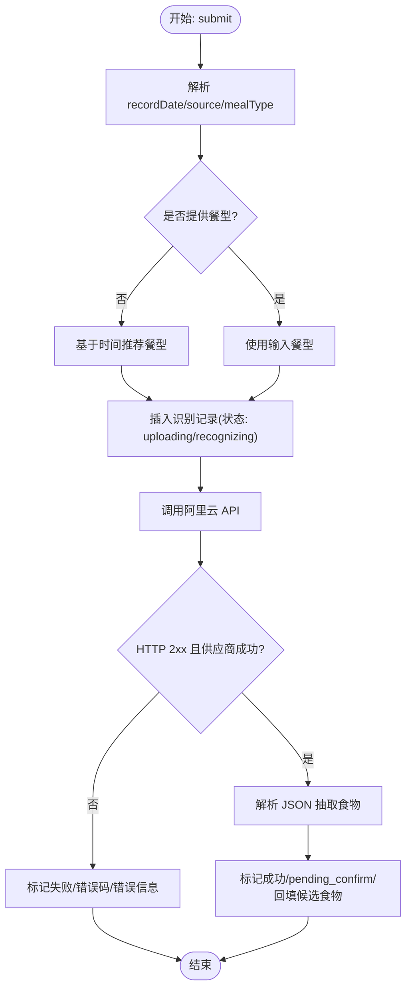
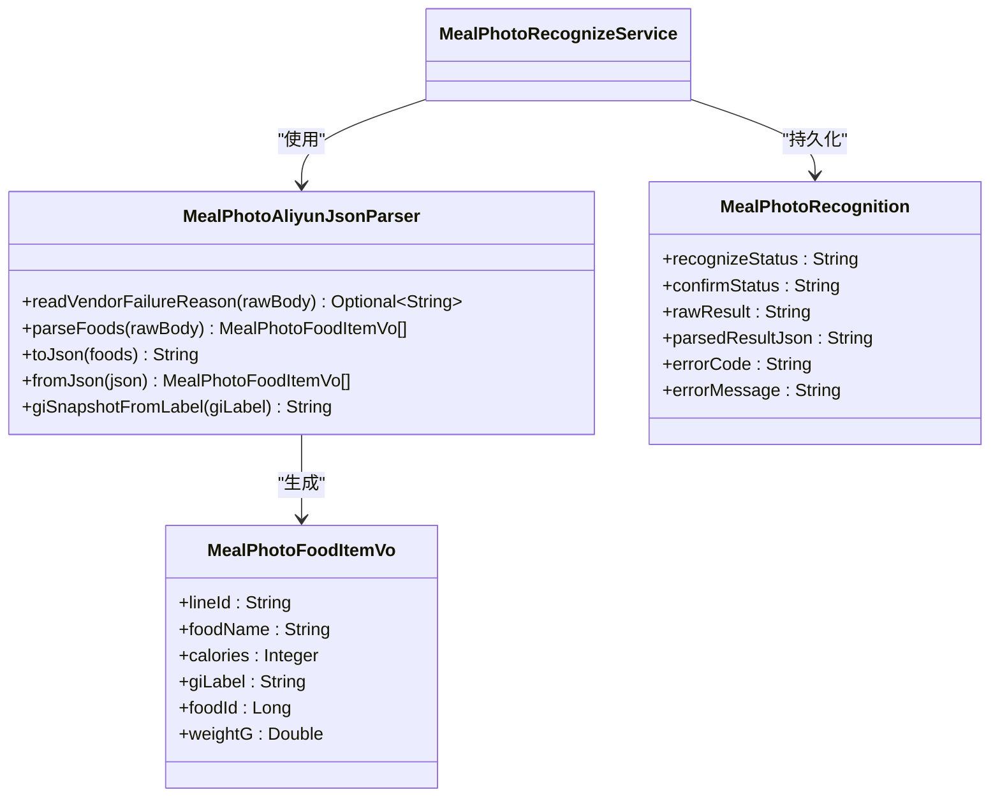
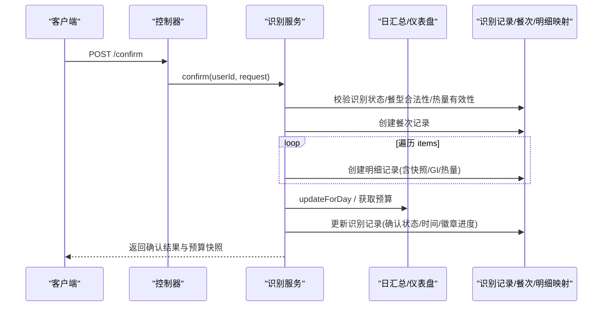
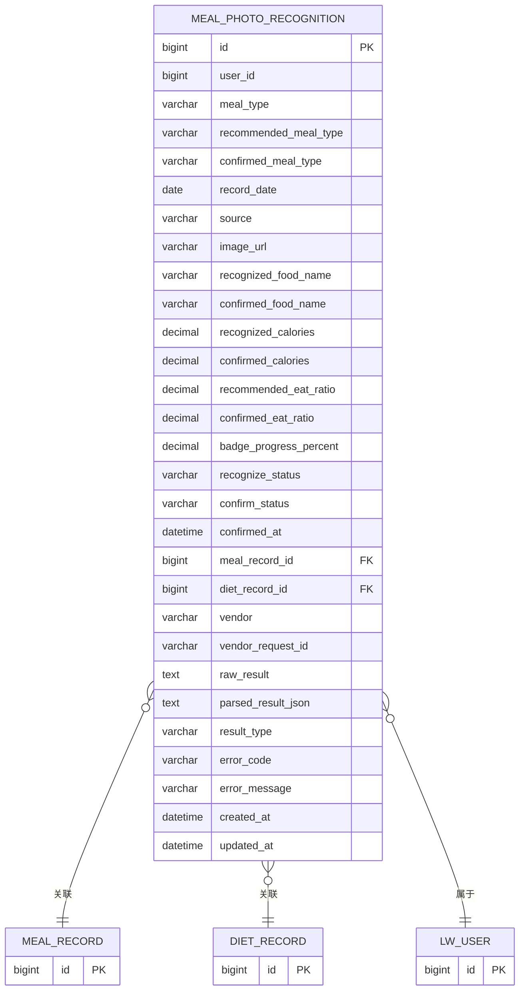
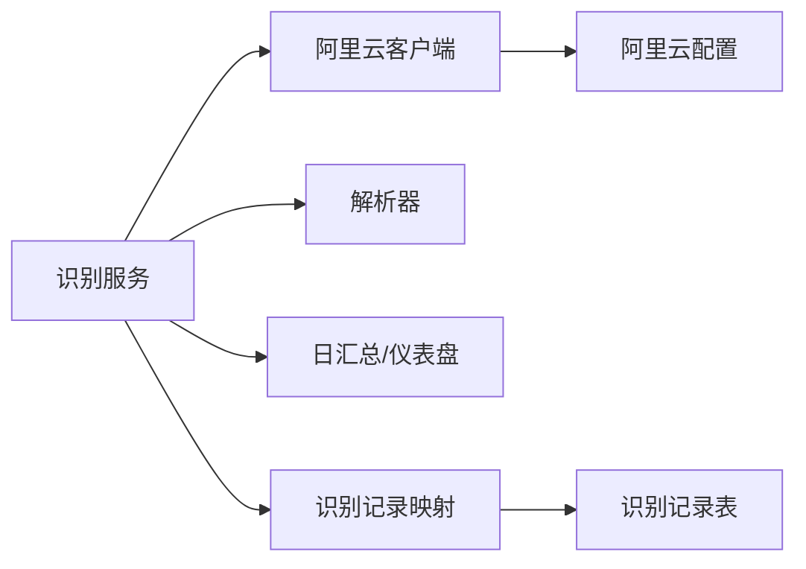

# 拍照识别服务

<cite>
**本文引用的文件**
- [MealPhotoRecognizeService.java](file://backend/src/main/java/com/ypfr/loseweight/service/photograph/MealPhotoRecognizeService.java)
- [MealPhotoAliyunJsonParser.java](file://backend/src/main/java/com/ypfr/loseweight/service/photograph/MealPhotoAliyunJsonParser.java)
- [MealRecommendedMealTypeUtil.java](file://backend/src/main/java/com/ypfr/loseweight/service/photograph/MealRecommendedMealTypeUtil.java)
- [AliyunFoodCalorieClient.java](file://backend/src/main/java/com/ypfr/loseweight/service/AliyunFoodCalorieClient.java)
- [AliyunFoodProperties.java](file://backend/src/main/java/com/ypfr/loseweight/config/AliyunFoodProperties.java)
- [MealPhotoRecognizeController.java](file://backend/src/main/java/com/ypfr/loseweight/web/MealPhotoRecognizeController.java)
- [MealPhotoRecognizeResultVo.java](file://backend/src/main/java/com/ypfr/loseweight/web/dto/photograph/MealPhotoRecognizeResultVo.java)
- [MealPhotoSubmitRequest.java](file://backend/src/main/java/com/ypfr/loseweight/web/dto/photograph/MealPhotoSubmitRequest.java)
- [MealPhotoConfirmRequest.java](file://backend/src/main/java/com/ypfr/loseweight/web/dto/photograph/MealPhotoConfirmRequest.java)
- [MealPhotoConfirmItemDto.java](file://backend/src/main/java/com/ypfr/loseweight/web/dto/photograph/MealPhotoConfirmItemDto.java)
- [MealPhotoConfirmResponseVo.java](file://backend/src/main/java/com/ypfr/loseweight/web/dto/photograph/MealPhotoConfirmResponseVo.java)
- [MealPhotoFoodItemVo.java](file://backend/src/main/java/com/ypfr/loseweight/web/dto/photograph/MealPhotoFoodItemVo.java)
- [MealPhotoRecognition.java](file://backend/src/main/java/com/ypfr/loseweight/domain/MealPhotoRecognition.java)
- [MealPhotoRecognitionMapper.java](file://backend/src/main/java/com/ypfr/loseweight/mapper/MealPhotoRecognitionMapper.java)
- [application.yml](file://backend/src/main/resources/application.yml)
- [project_current_baseline_alignment.sql](file://database/project_current_baseline_alignment.sql)
</cite>

## 目录
1. [简介](#简介)
2. [项目结构](#项目结构)
3. [核心组件](#核心组件)
4. [架构总览](#架构总览)
5. [详细组件分析](#详细组件分析)
6. [依赖分析](#依赖分析)
7. [性能考虑](#性能考虑)
8. [故障排除指南](#故障排除指南)
9. [结论](#结论)
10. [附录](#附录)

## 简介
本技术文档围绕“拍照识别服务”展开，系统性阐述 MealPhotoRecognizeService 的智能识别架构与实现细节，涵盖图片上传处理、阿里云 API 集成、识别结果解析、推荐餐型判断、图像预处理策略、食物识别算法、营养成分提取、识别准确性优化、异步处理机制、识别结果缓存策略、失败重试机制、质量控制流程、识别数据模型设计、推荐算法实现、用户反馈处理、性能优化方案、成本控制策略与故障排除指南。

## 项目结构
后端采用 Spring Boot + MyBatis-Plus 架构，拍照识别服务位于服务层 photograph 包内，配合 Web 控制器、DTO、领域模型与 Mapper 实现完整的识别与确认流程。配置通过 application.yml 与 AliyunFoodProperties 提供，数据库结构由 SQL 迁移脚本定义。

图表来源
- [MealPhotoRecognizeController.java:19-62](file://backend/src/main/java/com/ypfr/loseweight/web/MealPhotoRecognizeController.java#L19-L62)
- [MealPhotoRecognizeService.java:38-66](file://backend/src/main/java/com/ypfr/loseweight/service/photograph/MealPhotoRecognizeService.java#L38-L66)
- [MealPhotoAliyunJsonParser.java:17-25](file://backend/src/main/java/com/ypfr/loseweight/service/photograph/MealPhotoAliyunJsonParser.java#L17-L25)
- [MealRecommendedMealTypeUtil.java:6-25](file://backend/src/main/java/com/ypfr/loseweight/service/photograph/MealRecommendedMealTypeUtil.java#L6-L25)
- [AliyunFoodCalorieClient.java:17-25](file://backend/src/main/java/com/ypfr/loseweight/service/AliyunFoodCalorieClient.java#L17-L25)
- [MealPhotoRecognitionMapper.java:1-9](file://backend/src/main/java/com/ypfr/loseweight/mapper/MealPhotoRecognitionMapper.java#L1-L9)
- [MealPhotoRecognition.java:11-44](file://backend/src/main/java/com/ypfr/loseweight/domain/MealPhotoRecognition.java#L11-L44)
- [application.yml:36-41](file://backend/src/main/resources/application.yml#L36-L41)
- [AliyunFoodProperties.java:6-43](file://backend/src/main/java/com/ypfr/loseweight/config/AliyunFoodProperties.java#L6-L43)

章节来源
- [MealPhotoRecognizeController.java:19-62](file://backend/src/main/java/com/ypfr/loseweight/web/MealPhotoRecognizeController.java#L19-L62)
- [application.yml:1-54](file://backend/src/main/resources/application.yml#L1-L54)

## 核心组件
- 控制器层：提供提交、查询结果、确认三个 REST 接口，负责鉴权与请求转发。
- 服务层：编排识别流程、调用阿里云 API、解析结果、落库、构建响应。
- 解析器：兼容多种阿里云返回结构，抽取食物名称与热量，必要时从文本猜测热量。
- 推荐工具：基于当前时间推断推荐餐型。
- 阿里云客户端：封装 APPCODE、URL 参数与表单提交。
- 数据模型与映射：记录识别任务、状态、错误信息、原始与解析结果等。

章节来源
- [MealPhotoRecognizeService.java:38-66](file://backend/src/main/java/com/ypfr/loseweight/service/photograph/MealPhotoRecognizeService.java#L38-L66)
- [MealPhotoAliyunJsonParser.java:17-25](file://backend/src/main/java/com/ypfr/loseweight/service/photograph/MealPhotoAliyunJsonParser.java#L17-L25)
- [MealRecommendedMealTypeUtil.java:6-25](file://backend/src/main/java/com/ypfr/loseweight/service/photograph/MealRecommendedMealTypeUtil.java#L6-L25)
- [AliyunFoodCalorieClient.java:17-25](file://backend/src/main/java/com/ypfr/loseweight/service/AliyunFoodCalorieClient.java#L17-L25)
- [MealPhotoRecognition.java:11-44](file://backend/src/main/java/com/ypfr/loseweight/domain/MealPhotoRecognition.java#L11-L44)

## 架构总览
拍照识别服务采用“请求-识别-确认”的三阶段流水线，结合数据库状态机与 DTO 输出，形成闭环的数据流。

图表来源
- [MealPhotoRecognizeController.java:33-61](file://backend/src/main/java/com/ypfr/loseweight/web/MealPhotoRecognizeController.java#L33-L61)
- [MealPhotoRecognizeService.java:68-138](file://backend/src/main/java/com/ypfr/loseweight/service/photograph/MealPhotoRecognizeService.java#L68-L138)
- [AliyunFoodCalorieClient.java:27-48](file://backend/src/main/java/com/ypfr/loseweight/service/AliyunFoodCalorieClient.java#L27-L48)
- [MealPhotoAliyunJsonParser.java:66-95](file://backend/src/main/java/com/ypfr/loseweight/service/photograph/MealPhotoAliyunJsonParser.java#L66-L95)
- [MealPhotoRecognizeResultVo.java:10-35](file://backend/src/main/java/com/ypfr/loseweight/web/dto/photograph/MealPhotoRecognizeResultVo.java#L10-L35)

## 详细组件分析

### 1) 图片上传与提交流程
- 输入校验：要求至少提供 imageBase64 或 imageUrl，且日期格式合法。
- 餐型推荐：若未指定餐型，依据当前时间推断早餐/午餐/加餐/晚餐。
- 识别记录：插入初始状态（上传中/识别中），随后更新为识别中。
- 阿里云调用：根据提供的参数构造表单并发起请求，记录原始响应。
- 结果分支：供应商明确失败时直接标记失败；HTTP 非 2xx 也标记失败；否则进入解析与回填。

图表来源
- [MealPhotoRecognizeService.java:68-138](file://backend/src/main/java/com/ypfr/loseweight/service/photograph/MealPhotoRecognizeService.java#L68-L138)
- [MealRecommendedMealTypeUtil.java:10-25](file://backend/src/main/java/com/ypfr/loseweight/service/photograph/MealRecommendedMealTypeUtil.java#L10-L25)
- [AliyunFoodCalorieClient.java:27-48](file://backend/src/main/java/com/ypfr/loseweight/service/AliyunFoodCalorieClient.java#L27-L48)

章节来源
- [MealPhotoRecognizeService.java:68-138](file://backend/src/main/java/com/ypfr/loseweight/service/photograph/MealPhotoRecognizeService.java#L68-L138)
- [MealPhotoSubmitRequest.java:6-77](file://backend/src/main/java/com/ypfr/loseweight/web/dto/photograph/MealPhotoSubmitRequest.java#L6-L77)

### 2) 阿里云 API 集成与参数校验
- 配置项：host、path、appcode 由 AliyunFoodProperties 提供，fullUrl 组合最终地址。
- 请求头：Content-Type 使用 x-www-form-urlencoded，Authorization 使用 APPCODE。
- 参数：优先 imageBase64，其次 imageUrl；二者至少其一。
- 错误处理：当 appcode 未配置或为占位符时抛出异常，阻止误调用。

章节来源
- [AliyunFoodCalorieClient.java:27-48](file://backend/src/main/java/com/ypfr/loseweight/service/AliyunFoodCalorieClient.java#L27-L48)
- [AliyunFoodProperties.java:6-43](file://backend/src/main/java/com/ypfr/loseweight/config/AliyunFoodProperties.java#L6-L43)
- [application.yml:36-41](file://backend/src/main/resources/application.yml#L36-L41)

### 3) 识别结果解析与数据模型
- 失败判定：当 success=false 或 code 非 200/0 时，认为供应商层面失败，返回可展示的失败原因。
- 解析策略：优先尝试数组根节点、data.items 形态；否则递归深搜对象树收集食物节点；最后回退到从文本中提取热量。
- 字段抽取：优先匹配 name/foodName 等键，热量优先匹配 calory/calorie/calories/kcal 等键，缺失时回退默认值。
- GI 标签：提供从标签到快照值的映射，用于记录快照。

图表来源
- [MealPhotoAliyunJsonParser.java:32-95](file://backend/src/main/java/com/ypfr/loseweight/service/photograph/MealPhotoAliyunJsonParser.java#L32-L95)
- [MealPhotoFoodItemVo.java:7-66](file://backend/src/main/java/com/ypfr/loseweight/web/dto/photograph/MealPhotoFoodItemVo.java#L7-L66)
- [MealPhotoRecognition.java:11-44](file://backend/src/main/java/com/ypfr/loseweight/domain/MealPhotoRecognition.java#L11-L44)

章节来源
- [MealPhotoAliyunJsonParser.java:66-280](file://backend/src/main/java/com/ypfr/loseweight/service/photograph/MealPhotoAliyunJsonParser.java#L66-L280)
- [MealPhotoRecognizeService.java:114-121](file://backend/src/main/java/com/ypfr/loseweight/service/photograph/MealPhotoRecognizeService.java#L114-L121)

### 4) 推荐餐型判断
- 时间规则：基于当前 LocalTime 将一天划分为多个窗口，分别对应早餐、午餐、加餐、晚餐。
- 默认策略：若未提供餐型，自动填充推荐值；若提供非法值则忽略。

章节来源
- [MealRecommendedMealTypeUtil.java:10-25](file://backend/src/main/java/com/ypfr/loseweight/service/photograph/MealRecommendedMealTypeUtil.java#L10-L25)
- [MealPhotoRecognizeService.java:68-76](file://backend/src/main/java/com/ypfr/loseweight/service/photograph/MealPhotoRecognizeService.java#L68-L76)

### 5) 用户确认与数据落库
- 状态约束：仅当识别成功方可确认；确认前校验 items 的热量为正数。
- 写入流程：创建餐次记录与多条饮食明细记录，回填 GI 快照、图片快照、名称快照、总热量等。
- 预算更新：调用日汇总服务刷新当日摄入与预算；计算徽章进度百分比。
- 幂等处理：若已确认，直接复用已有结果返回。

图表来源
- [MealPhotoRecognizeService.java:149-255](file://backend/src/main/java/com/ypfr/loseweight/service/photograph/MealPhotoRecognizeService.java#L149-L255)
- [MealPhotoConfirmRequest.java:9-58](file://backend/src/main/java/com/ypfr/loseweight/web/dto/photograph/MealPhotoConfirmRequest.java#L9-L58)
- [MealPhotoConfirmItemDto.java:7-57](file://backend/src/main/java/com/ypfr/loseweight/web/dto/photograph/MealPhotoConfirmItemDto.java#L7-L57)

章节来源
- [MealPhotoRecognizeService.java:149-255](file://backend/src/main/java/com/ypfr/loseweight/service/photograph/MealPhotoRecognizeService.java#L149-L255)

### 6) 数据模型与持久化
- 识别记录：包含用户、餐型、来源、图片、识别状态、确认状态、错误信息、原始与解析结果、推荐/确认的热量与比例、徽章进度、关联的餐次与明细 ID 等。
- 索引设计：针对用户+日期+状态、确认状态、meal_record_id 等建立索引，支撑高频查询与清理。

图表来源
- [MealPhotoRecognition.java:11-277](file://backend/src/main/java/com/ypfr/loseweight/domain/MealPhotoRecognition.java#L11-L277)
- [project_current_baseline_alignment.sql:382-396](file://database/project_current_baseline_alignment.sql#L382-L396)

章节来源
- [MealPhotoRecognition.java:11-277](file://backend/src/main/java/com/ypfr/loseweight/domain/MealPhotoRecognition.java#L11-L277)
- [project_current_baseline_alignment.sql:382-741](file://database/project_current_baseline_alignment.sql#L382-L741)

### 7) 接口与数据契约
- 提交接口：POST /api/v1/recognize/meal-photo，返回识别结果视图对象。
- 查询接口：GET /api/v1/recognize/meal-photo/result，支持轮询获取最新状态。
- 确认接口：POST /api/v1/recognize/meal-photo/confirm，返回确认结果与预算快照。
- 请求/响应对象：包含必要的校验注解与字段定义，确保前后端契约一致。

章节来源
- [MealPhotoRecognizeController.java:33-61](file://backend/src/main/java/com/ypfr/loseweight/web/MealPhotoRecognizeController.java#L33-L61)
- [MealPhotoRecognizeResultVo.java:10-156](file://backend/src/main/java/com/ypfr/loseweight/web/dto/photograph/MealPhotoRecognizeResultVo.java#L10-L156)
- [MealPhotoSubmitRequest.java:6-77](file://backend/src/main/java/com/ypfr/loseweight/web/dto/photograph/MealPhotoSubmitRequest.java#L6-L77)
- [MealPhotoConfirmRequest.java:9-58](file://backend/src/main/java/com/ypfr/loseweight/web/dto/photograph/MealPhotoConfirmRequest.java#L9-L58)
- [MealPhotoConfirmResponseVo.java:8-65](file://backend/src/main/java/com/ypfr/loseweight/web/dto/photograph/MealPhotoConfirmResponseVo.java#L8-L65)

## 依赖分析
- 组件耦合：识别服务依赖阿里云客户端、解析器、仪表盘与日汇总服务，以及识别记录映射。
- 外部依赖：阿里云市场 API，需要正确的 APPCODE 与网络可达性。
- 数据依赖：MySQL 表结构与索引直接影响查询性能与可用性。

图表来源
- [MealPhotoRecognizeService.java:43-49](file://backend/src/main/java/com/ypfr/loseweight/service/photograph/MealPhotoRecognizeService.java#L43-L49)
- [AliyunFoodCalorieClient.java:17-25](file://backend/src/main/java/com/ypfr/loseweight/service/AliyunFoodCalorieClient.java#L17-L25)
- [MealPhotoRecognitionMapper.java:1-9](file://backend/src/main/java/com/ypfr/loseweight/mapper/MealPhotoRecognitionMapper.java#L1-L9)
- [project_current_baseline_alignment.sql:382-396](file://database/project_current_baseline_alignment.sql#L382-L396)

章节来源
- [MealPhotoRecognizeService.java:43-49](file://backend/src/main/java/com/ypfr/loseweight/service/photograph/MealPhotoRecognizeService.java#L43-L49)
- [AliyunFoodCalorieClient.java:17-25](file://backend/src/main/java/com/ypfr/loseweight/service/AliyunFoodCalorieClient.java#L17-L25)

## 性能考虑
- 传输与解析
  - 限制表单大小与内存缓冲，避免大图导致 OOM。
  - 解析器采用深度优先搜索与多键匹配，兼顾鲁棒性与性能。
- 数据库
  - 为识别记录表建立复合索引，加速按用户、日期、状态与确认状态的查询。
  - 合理拆分字段存储原始结果与解析结果，减少冗余扫描。
- 缓存与幂等
  - 对热点识别任务可引入短期缓存（如 Redis）以降低重复调用与解析开销。
  - 确认接口幂等，避免重复写入造成脏数据。
- 异步化建议
  - 当前为同步调用阿里云 API；可在高并发场景下引入消息队列异步化识别任务，前端轮询改为订阅通知。
- 资源与成本
  - 控制图片尺寸与质量，减少传输与 API 调用次数。
  - 通过批量确认与合并请求降低 API 调用频次。

章节来源
- [application.yml:7-19](file://backend/src/main/resources/application.yml#L7-L19)
- [project_current_baseline_alignment.sql:382-396](file://database/project_current_baseline_alignment.sql#L382-L396)

## 故障排除指南
- 常见错误与定位
  - 未配置 APPCODE：抛出异常，检查 application-local.yml。
  - 非法日期格式：recordDate 必须为 yyyy-MM-dd。
  - 未提供图片参数：imageBase64 与 imageUrl 至少其一。
  - 识别失败：查看 errorCode 与 errorMessage；若为供应商失败，解析器会返回可展示的原因。
  - 确认失败：确认前必须为成功状态；确认热量需为正数。
- 排查步骤
  - 检查识别记录状态与错误信息，核对原始响应长度与内容。
  - 核对阿里云配置与网络连通性。
  - 关注解析器是否命中期望结构，必要时扩展键名匹配。
- 重试与降级
  - 对于临时网络波动，可在客户端实现指数退避重试。
  - 若阿里云服务不可用，可引导用户稍后重试或切换至手动录入。

章节来源
- [AliyunFoodCalorieClient.java:28-30](file://backend/src/main/java/com/ypfr/loseweight/service/AliyunFoodCalorieClient.java#L28-L30)
- [MealPhotoRecognizeService.java:129-137](file://backend/src/main/java/com/ypfr/loseweight/service/photograph/MealPhotoRecognizeService.java#L129-L137)
- [MealPhotoAliyunJsonParser.java:32-64](file://backend/src/main/java/com/ypfr/loseweight/service/photograph/MealPhotoAliyunJsonParser.java#L32-L64)

## 结论
拍照识别服务通过清晰的三层架构与完善的错误处理，实现了从图片提交、阿里云识别、结果解析、推荐餐型、用户确认到数据落库的完整闭环。结合合理的数据库索引、可扩展的解析策略与潜在的异步化改造，可在保证识别准确性的同时提升性能与稳定性，并为后续功能扩展（如多模态识别、个性化推荐）奠定基础。

## 附录
- 配置要点
  - 在 application-local.yml 中正确设置阿里云 APPCODE 与主机地址。
  - 根据部署环境调整服务器监听地址与端口。
- 数据模型字段说明
  - 识别状态与确认状态构成状态机，驱动前端交互与后端流程。
  - 原始结果与解析结果分离，便于问题排查与二次处理。

章节来源
- [application.yml:36-41](file://backend/src/main/resources/application.yml#L36-L41)
- [MealPhotoRecognition.java:11-44](file://backend/src/main/java/com/ypfr/loseweight/domain/MealPhotoRecognition.java#L11-L44)