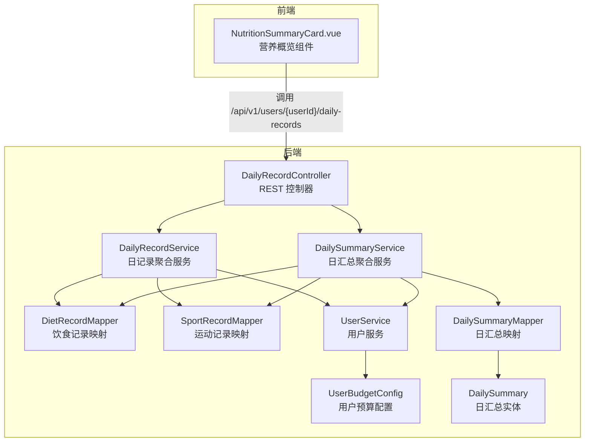
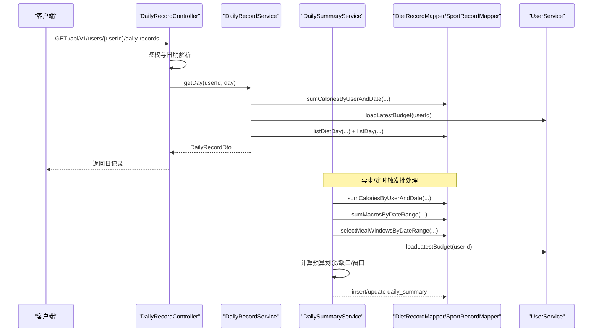
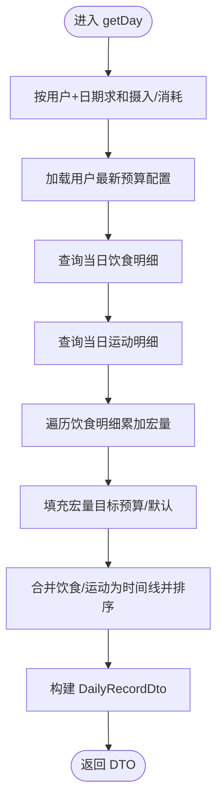
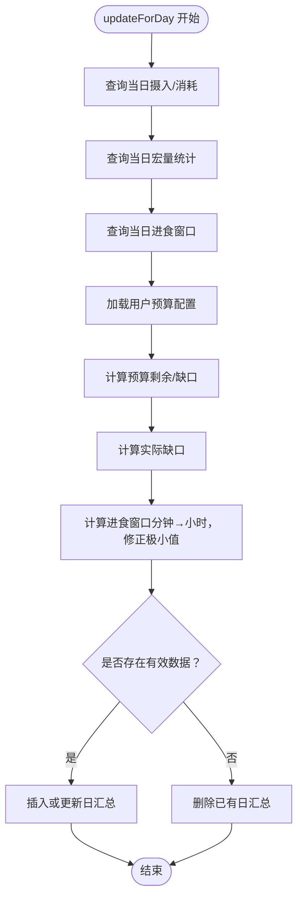
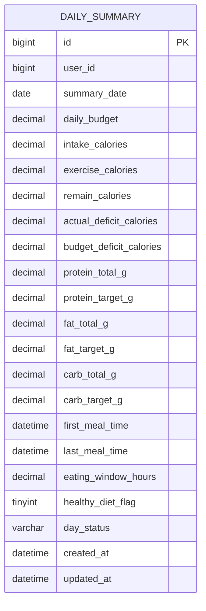
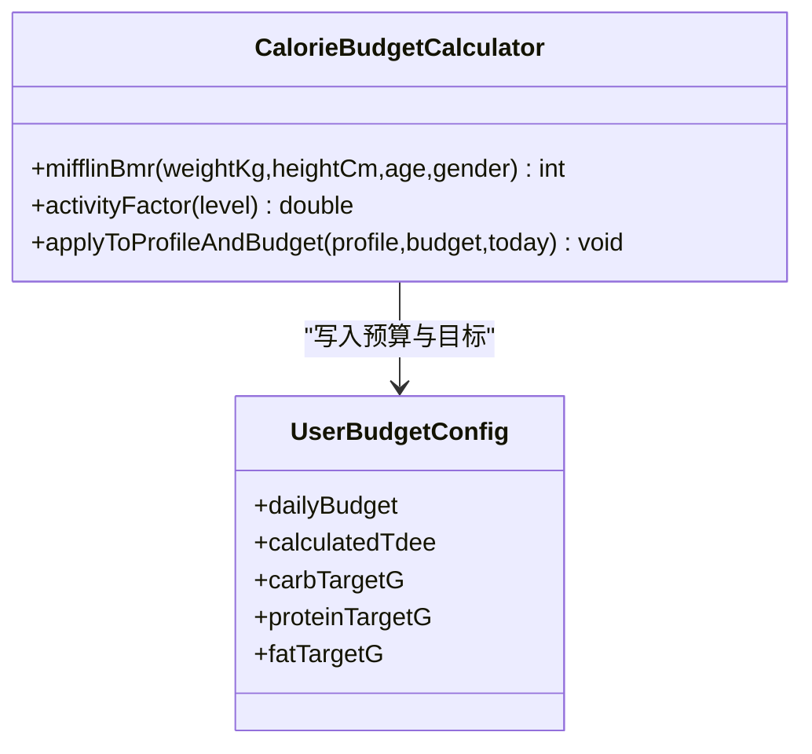
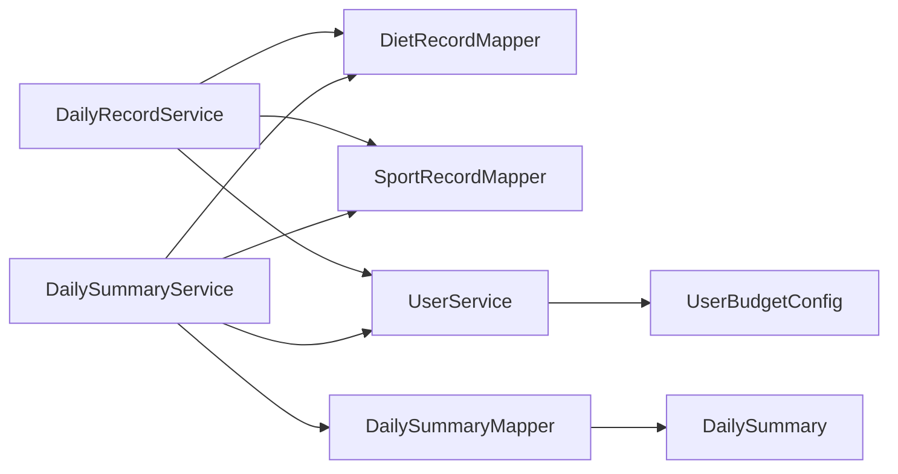

# 日常记录聚合服务

<cite>
**本文引用的文件**
- [DailyRecordService.java](file://backend/src/main/java/com/ypfr/loseweight/service/DailyRecordService.java)
- [DailySummaryService.java](file://backend/src/main/java/com/ypfr/loseweight/service/DailySummaryService.java)
- [DailySummary.java](file://backend/src/main/java/com/ypfr/loseweight/domain/DailySummary.java)
- [DailySummaryMapper.java](file://backend/src/main/java/com/ypfr/loseweight/mapper/DailySummaryMapper.java)
- [CalorieBudgetCalculator.java](file://backend/src/main/java/com/ypfr/loseweight/service/CalorieBudgetCalculator.java)
- [DailyRecordDto.java](file://backend/src/main/java/com/ypfr/loseweight/web/dto/DailyRecordDto.java)
- [DailyMacroDto.java](file://backend/src/main/java/com/ypfr/loseweight/web/dto/DailyMacroDto.java)
- [StatDateMacros.java](file://backend/src/main/java/com/ypfr/loseweight/mapper/row/StatDateMacros.java)
- [StatDateMealWindow.java](file://backend/src/main/java/com/ypfr/loseweight/mapper/row/StatDateMealWindow.java)
- [UserBudgetConfig.java](file://backend/src/main/java/com/ypfr/loseweight/domain/UserBudgetConfig.java)
- [DailyRecordController.java](file://backend/src/main/java/com/ypfr/loseweight/web/DailyRecordController.java)
- [application.yml](file://backend/src/main/resources/application.yml)
- [03-日汇总与周统计口径说明.md](file://docs/streamline/03-日汇总与周统计口径说明.md)
- [数据表字段与算法映射说明.md](file://docs/final/数据表字段与算法映射说明.md)
- [核心算法.md](file://docs/final/核心算法.md)
- [NutritionSummaryCard.vue](file://frontend/src/components/NutritionSummaryCard.vue)
</cite>

## 目录
1. [简介](#简介)
2. [项目结构](#项目结构)
3. [核心组件](#核心组件)
4. [架构总览](#架构总览)
5. [详细组件分析](#详细组件分析)
6. [依赖分析](#依赖分析)
7. [性能考虑](#性能考虑)
8. [故障排查指南](#故障排查指南)
9. [结论](#结论)
10. [附录](#附录)

## 简介
本技术文档聚焦于日常记录聚合服务模块，系统性阐述 DailyRecordService 与 DailySummaryService 的协同工作机制，涵盖每日数据聚合、营养素统计、健康指标计算、趋势分析等能力。文档详细说明日汇总数据的计算逻辑、热量预算跟踪、宏量营养素分配、健康状态评估，以及数据聚合策略、时间窗口处理、数据完整性检查与异常值检测机制。同时提供日汇总数据模型设计、统计指标定义、健康评分算法，并给出批处理优化、缓存策略与实时/离线计算平衡方案。

## 项目结构
后端采用 Spring Boot + MyBatis-Plus 架构，服务层通过 Mapper 访问数据库，控制器负责请求接入与鉴权校验。前端通过 API 获取日汇总与日常记录，用于展示与交互。

图表来源
- [DailyRecordController.java:1-40](file://backend/src/main/java/com/ypfr/loseweight/web/DailyRecordController.java#L1-L40)
- [DailyRecordService.java:1-178](file://backend/src/main/java/com/ypfr/loseweight/service/DailyRecordService.java#L1-L178)
- [DailySummaryService.java:1-165](file://backend/src/main/java/com/ypfr/loseweight/service/DailySummaryService.java#L1-L165)
- [DailySummaryMapper.java:1-10](file://backend/src/main/java/com/ypfr/loseweight/mapper/DailySummaryMapper.java#L1-L10)
- [UserBudgetConfig.java:1-151](file://backend/src/main/java/com/ypfr/loseweight/domain/UserBudgetConfig.java#L1-L151)
- [DailySummary.java:1-218](file://backend/src/main/java/com/ypfr/loseweight/domain/DailySummary.java#L1-L218)
- [NutritionSummaryCard.vue:48-152](file://frontend/src/components/NutritionSummaryCard.vue#L48-L152)

章节来源
- [DailyRecordController.java:1-40](file://backend/src/main/java/com/ypfr/loseweight/web/DailyRecordController.java#L1-L40)
- [application.yml:1-54](file://backend/src/main/resources/application.yml#L1-L54)

## 核心组件
- DailyRecordService：按日聚合用户饮食与运动记录，计算总摄入、总消耗、宏量营养素与目标，生成日记录 DTO，用于前端时间线展示。
- DailySummaryService：基于当日汇总表 daily_summary 写入或更新日汇总，计算预算剩余、缺口、进食窗口等健康指标。
- DailySummary：日汇总实体，承载预算、摄入、消耗、宏量、窗口、健康标记与状态等字段。
- UserBudgetConfig：用户预算配置，提供 TDEE、每日预算、宏量目标等参数来源。
- DTO：DailyRecordDto、DailyMacroDto 作为对外传输对象，封装日记录与宏量信息。
- Mapper 行对象：StatDateMacros、StatDateMealWindow 提供按日统计的宏量与进食窗口结果。

章节来源
- [DailyRecordService.java:44-84](file://backend/src/main/java/com/ypfr/loseweight/service/DailyRecordService.java#L44-L84)
- [DailySummaryService.java:41-154](file://backend/src/main/java/com/ypfr/loseweight/service/DailySummaryService.java#L41-L154)
- [DailySummary.java:19-37](file://backend/src/main/java/com/ypfr/loseweight/domain/DailySummary.java#L19-L37)
- [UserBudgetConfig.java:19-26](file://backend/src/main/java/com/ypfr/loseweight/domain/UserBudgetConfig.java#L19-L26)
- [DailyRecordDto.java:5-52](file://backend/src/main/java/com/ypfr/loseweight/web/dto/DailyRecordDto.java#L5-L52)
- [DailyMacroDto.java:3-59](file://backend/src/main/java/com/ypfr/loseweight/web/dto/DailyMacroDto.java#L3-L59)
- [StatDateMacros.java:6-43](file://backend/src/main/java/com/ypfr/loseweight/mapper/row/StatDateMacros.java#L6-L43)
- [StatDateMealWindow.java:6-33](file://backend/src/main/java/com/ypfr/loseweight/mapper/row/StatDateMealWindow.java#L6-L33)

## 架构总览
DailyRecordService 与 DailySummaryService 协同工作：前者面向“实时/即时”场景，返回当日明细与汇总概要；后者面向“离线/批处理”场景，将当日数据写入 daily_summary 并持续维护健康指标。二者共享用户预算配置与统计查询能力，确保前后端一致的口径与展示。

图表来源
- [DailyRecordController.java:27-38](file://backend/src/main/java/com/ypfr/loseweight/web/DailyRecordController.java#L27-L38)
- [DailyRecordService.java:44-84](file://backend/src/main/java/com/ypfr/loseweight/service/DailyRecordService.java#L44-L84)
- [DailySummaryService.java:41-154](file://backend/src/main/java/com/ypfr/loseweight/service/DailySummaryService.java#L41-L154)

## 详细组件分析

### DailyRecordService：日记录聚合与宏量目标填充
- 数据聚合
  - 摄入与运动分别按用户与日期求和，得到当日摄入与消耗。
  - 饮食明细与运动明细合并为时间线，按记录时间倒序排列。
- 宏量统计
  - 遍历饮食明细，累加蛋白质、脂肪、碳水总克数，保留一位小数。
  - 从用户预算配置加载目标克数（缺省值来自产品默认），若配置存在则覆盖。
- 输出
  - 返回 DailyRecordDto，包含日期、摄入/消耗、宏量与时间线。

图表来源
- [DailyRecordService.java:44-84](file://backend/src/main/java/com/ypfr/loseweight/service/DailyRecordService.java#L44-L84)
- [DailyRecordService.java:157-176](file://backend/src/main/java/com/ypfr/loseweight/service/DailyRecordService.java#L157-L176)

章节来源
- [DailyRecordService.java:44-84](file://backend/src/main/java/com/ypfr/loseweight/service/DailyRecordService.java#L44-L84)
- [DailyRecordService.java:157-176](file://backend/src/main/java/com/ypfr/loseweight/service/DailyRecordService.java#L157-L176)
- [DailyRecordDto.java:5-52](file://backend/src/main/java/com/ypfr/loseweight/web/dto/DailyRecordDto.java#L5-L52)
- [DailyMacroDto.java:3-59](file://backend/src/main/java/com/ypfr/loseweight/web/dto/DailyMacroDto.java#L3-L59)

### DailySummaryService：日汇总写入与健康指标计算
- 输入与准备
  - 从 diet_record 与 sport_record 按用户与日期范围统计摄入、消耗、宏量与进食窗口。
  - 从 user_budget_config 加载每日预算、TDEE、宏量目标。
- 计算逻辑
  - 预算剩余：daily_budget − intake + exercise。
  - 预算缺口：与预算剩余一致（当预算存在时）。
  - 实际缺口：TDEE + exercise − intake。
  - 进食窗口：last_meal − first_meal（不足1分钟按0.25小时处理，避免零值影响可视化）。
- 写入策略
  - 若当日无任何有效数据，则删除已有日汇总记录。
  - 若记录不存在则插入，存在则更新。
  - 保存宏量总量与目标、窗口起止时间、健康标记与状态等字段。

图表来源
- [DailySummaryService.java:41-154](file://backend/src/main/java/com/ypfr/loseweight/service/DailySummaryService.java#L41-L154)

章节来源
- [DailySummaryService.java:41-154](file://backend/src/main/java/com/ypfr/loseweight/service/DailySummaryService.java#L41-L154)
- [DailySummary.java:19-37](file://backend/src/main/java/com/ypfr/loseweight/domain/DailySummary.java#L19-L37)
- [UserBudgetConfig.java:19-26](file://backend/src/main/java/com/ypfr/loseweight/domain/UserBudgetConfig.java#L19-L26)

### 日汇总数据模型设计
- 关键字段
  - 预算与缺口：daily_budget、remain_calories、actual_deficit_calories、budget_deficit_calories。
  - 摄入与消耗：intake_calories、exercise_calories。
  - 宏量：protein_total_g/fat_total_g/carb_total_g 及其目标值。
  - 时间窗口：first_meal_time、last_meal_time、eating_window_hours。
  - 健康标记与状态：healthy_diet_flag、day_status。
- 设计要点
  - 字段命名遵循驼峰与数据库列映射一致，统一精度与空值处理。
  - 健康标记与状态预留扩展空间，便于后续健康评分与异常标识。

图表来源
- [DailySummary.java:19-37](file://backend/src/main/java/com/ypfr/loseweight/domain/DailySummary.java#L19-L37)
- [03-日汇总与周统计口径说明.md:5-24](file://docs/streamline/03-日汇总与周统计口径说明.md#L5-L24)

章节来源
- [DailySummary.java:19-37](file://backend/src/main/java/com/ypfr/loseweight/domain/DailySummary.java#L19-L37)
- [03-日汇总与周统计口径说明.md:5-24](file://docs/streamline/03-日汇总与周统计口径说明.md#L5-L24)

### 统计指标定义与健康状态评估
- 指标定义
  - 预算剩余：daily_budget − intake + exercise。
  - 实际缺口：TDEE + exercise − intake。
  - 预算缺口：与预算剩余一致（预算存在时）。
  - 进食窗口：last_meal − first_meal，单条记录时按最小正小时处理。
- 健康状态
  - healthy_diet_flag 与 day_status 当前初始化为默认值，可作为后续健康评分与异常标识的扩展点。

章节来源
- [03-日汇总与周统计口径说明.md:27-48](file://docs/streamline/03-日汇总与周统计口径说明.md#L27-L48)
- [DailySummaryService.java:76-85](file://backend/src/main/java/com/ypfr/loseweight/service/DailySummaryService.java#L76-L85)
- [DailySummary.java:36-37](file://backend/src/main/java/com/ypfr/loseweight/domain/DailySummary.java#L36-L37)

### 热量预算跟踪与宏量营养素分配
- 预算来源
  - 由 CalorieBudgetCalculator 基于用户档案与目标计算 TDEE 与每日预算，并推导宏量目标（碳水50%、蛋白质20%、脂肪30%，按 kcal/g 换算）。
- 宏量目标
  - 写入 user_budget_config，DailyRecordService 与 DailySummaryService 读取并用于展示与计算。
- 前端展示
  - 前端组件依据目标与实际值计算进度条颜色与比例，实现直观反馈。

图表来源
- [CalorieBudgetCalculator.java:15-140](file://backend/src/main/java/com/ypfr/loseweight/service/CalorieBudgetCalculator.java#L15-L140)
- [UserBudgetConfig.java:19-26](file://backend/src/main/java/com/ypfr/loseweight/domain/UserBudgetConfig.java#L19-L26)

章节来源
- [CalorieBudgetCalculator.java:67-140](file://backend/src/main/java/com/ypfr/loseweight/service/CalorieBudgetCalculator.java#L67-L140)
- [核心算法.md:166-198](file://docs/final/核心算法.md#L166-L198)
- [NutritionSummaryCard.vue:117-152](file://frontend/src/components/NutritionSummaryCard.vue#L117-L152)

### 时间窗口处理与数据完整性检查
- 时间窗口
  - 通过 StatDateMealWindow 获取首餐与末餐时间，计算窗口时长；单条记录时赋予最小正小时，避免零值影响可视化。
- 数据完整性
  - 若当日无任何有效数据（摄入/消耗/宏量/窗口/预算任一非零），则删除已有日汇总记录，确保表数据干净。
  - BigDecimal 空值安全处理，避免空指针与精度问题。

章节来源
- [DailySummaryService.java:54-64](file://backend/src/main/java/com/ypfr/loseweight/service/DailySummaryService.java#L54-L64)
- [DailySummaryService.java:102-107](file://backend/src/main/java/com/ypfr/loseweight/service/DailySummaryService.java#L102-L107)
- [StatDateMealWindow.java:8-33](file://backend/src/main/java/com/ypfr/loseweight/mapper/row/StatDateMealWindow.java#L8-L33)

### 异常值检测机制
- 异常口径
  - 无饮食：摄入为0。
  - 无运动：消耗为0。
  - 无预算：全部字段为null。
- 建议
  - 在统计层对极端值（如窗口过短/过长、缺口异常）进行阈值监控与告警，结合 healthy_diet_flag 与 day_status 字段扩展健康评分与异常标识。

章节来源
- [03-日汇总与周统计口径说明.md:52-65](file://docs/streamline/03-日汇总与周统计口径说明.md#L52-L65)
- [DailySummary.java:36-37](file://backend/src/main/java/com/ypfr/loseweight/domain/DailySummary.java#L36-L37)

### 健康评分算法（扩展建议）
- 指标权重
  - 预算缺口偏离度、宏量达标率、进食窗口合理性、运动完成度等。
- 计分规则
  - 将各指标归一化后加权求和，输出 0~100 的健康评分。
- 标记与状态
  - 使用 healthy_diet_flag 与 day_status 记录评分与状态，便于前端展示与后续趋势分析。

（本节为概念性扩展，不直接对应现有代码）

## 依赖分析
- 组件耦合
  - DailyRecordService 依赖 DietRecordMapper、SportRecordMapper、UserService，职责清晰，内聚性强。
  - DailySummaryService 依赖 DietRecordMapper、SportRecordMapper、UserService、DailySummaryMapper，承担离线聚合与写入职责。
- 外部依赖
  - MyBatis-Plus 提供 ORM 能力；Spring MVC 提供 REST 接口；MySQL 提供数据存储。
- 潜在风险
  - Mapper 查询集中在单表统计，需关注索引与分区策略；预算与宏量目标依赖用户档案与配置，需保证数据一致性。

图表来源
- [DailyRecordService.java:25-42](file://backend/src/main/java/com/ypfr/loseweight/service/DailyRecordService.java#L25-L42)
- [DailySummaryService.java:20-34](file://backend/src/main/java/com/ypfr/loseweight/service/DailySummaryService.java#L20-L34)
- [DailySummaryMapper.java:1-10](file://backend/src/main/java/com/ypfr/loseweight/mapper/DailySummaryMapper.java#L1-L10)
- [UserBudgetConfig.java:19-26](file://backend/src/main/java/com/ypfr/loseweight/domain/UserBudgetConfig.java#L19-L26)
- [DailySummary.java:19-37](file://backend/src/main/java/com/ypfr/loseweight/domain/DailySummary.java#L19-L37)

章节来源
- [DailyRecordService.java:25-42](file://backend/src/main/java/com/ypfr/loseweight/service/DailyRecordService.java#L25-L42)
- [DailySummaryService.java:20-34](file://backend/src/main/java/com/ypfr/loseweight/service/DailySummaryService.java#L20-L34)

## 性能考虑
- 批处理优化
  - 将 DailySummaryService 的更新逻辑纳入定时任务或消息队列，避免每次写入都阻塞主业务路径。
  - 对历史日期进行批量重算，减少重复扫描。
- 缓存策略
  - 缓存用户预算配置与最近一次日汇总，降低频繁查询成本。
  - 对热点日期的 DTO 结果进行短期缓存，减少重复聚合。
- 实时与离线平衡
  - 日记录接口（DailyRecordService）走实时聚合，确保用户操作即时反馈。
  - 日汇总接口（DailySummaryService）走离线/异步，保证数据准确性与稳定性。
- 数据库优化
  - 为 user_id + summary_date 建立唯一索引，加速日汇总查询与去重。
  - 对 diet_record 与 sport_record 的用户与日期字段建立复合索引，提升统计查询效率。

（本节为通用性能建议，不直接对应特定代码片段）

## 故障排查指南
- 常见异常
  - 数据库访问异常：检查数据源连接、SQL 日志与权限。
  - 类型映射异常：确认数据库列类型与实体映射一致（如布尔与整型）。
- 排查步骤
  - 查看应用日志级别与 SQL 输出，定位慢查询与异常 SQL。
  - 核对用户预算配置是否完整（性别、年龄、身高、体重、目标体重与目标日期）。
  - 确认日汇总表结构与迁移脚本一致，特别是新增字段与索引。
- 建议
  - 在 DailySummaryService 的调用方捕获异常并记录日志，确保汇总失败不影响主业务。

章节来源
- [application.yml:51-54](file://backend/src/main/resources/application.yml#L51-L54)
- [03-日汇总与周统计口径说明.md:68-71](file://docs/streamline/03-日汇总与周统计口径说明.md#L68-L71)

## 结论
DailyRecordService 与 DailySummaryService 形成“实时/即时”与“离线/聚合”的双轨机制：前者提供用户操作的即时反馈，后者保障日汇总数据的准确性与健康指标的持续演进。通过统一的预算与宏量目标、严谨的数据完整性检查与时间窗口处理，系统实现了稳定可靠的日常记录聚合能力。未来可在健康评分、异常检测与缓存策略方面进一步增强，以支撑更丰富的趋势分析与个性化建议。

## 附录
- 接口与数据流
  - 前端通过 /api/v1/users/{userId}/daily-records 获取日记录，内部由 DailyRecordController 调用 DailyRecordService。
  - 日汇总写入由 DailySummaryService 触发，写入 daily_summary 表，供周统计与趋势分析使用。
- 参考文档
  - 日汇总与周统计口径、字段映射与核心算法说明。

章节来源
- [DailyRecordController.java:27-38](file://backend/src/main/java/com/ypfr/loseweight/web/DailyRecordController.java#L27-L38)
- [03-日汇总与周统计口径说明.md:1-72](file://docs/streamline/03-日汇总与周统计口径说明.md#L1-L72)
- [数据表字段与算法映射说明.md:683-705](file://docs/final/数据表字段与算法映射说明.md#L683-L705)
- [核心算法.md:166-246](file://docs/final/核心算法.md#L166-L246)