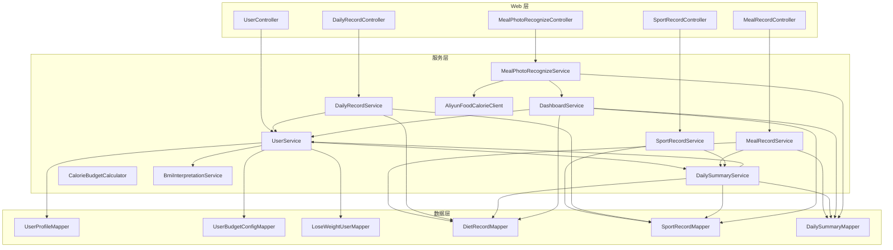
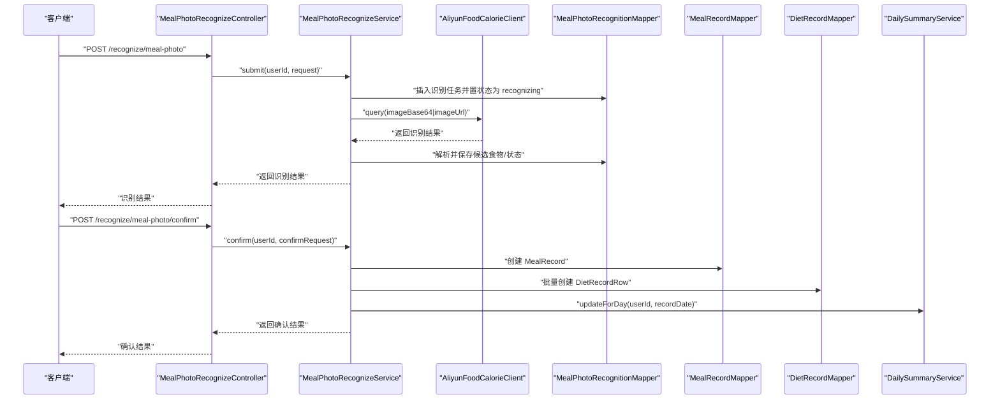
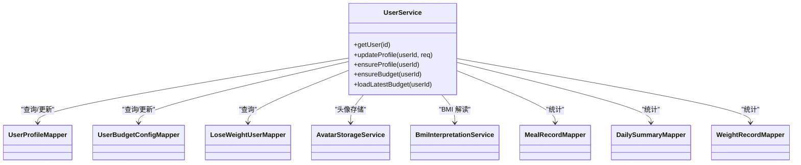
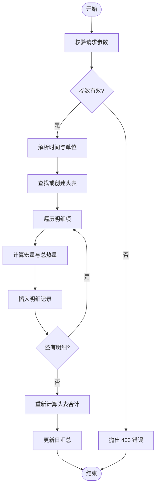
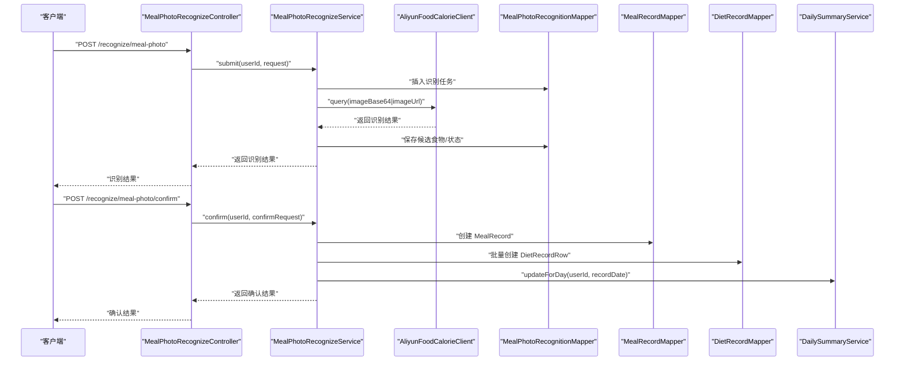
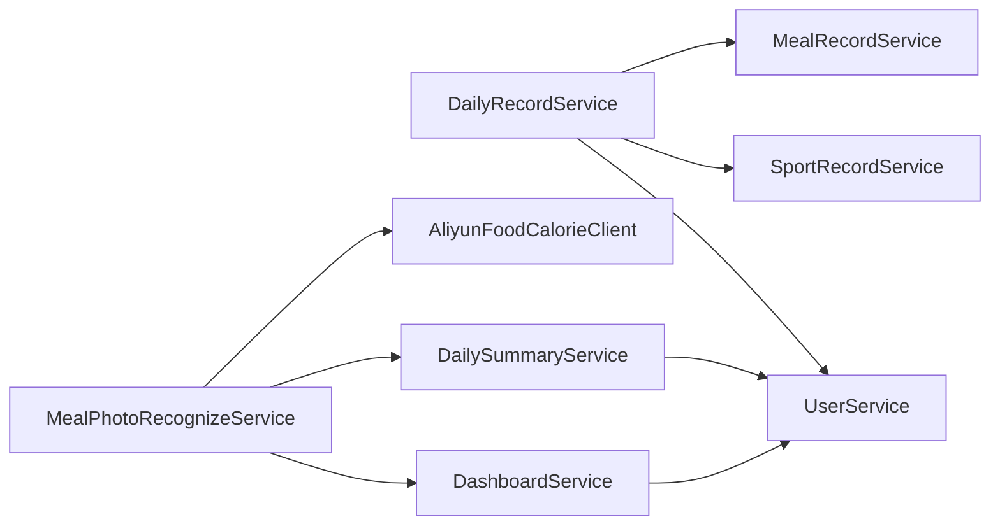

# 核心服务模块

<cite>
**本文引用的文件**
- [UserService.java](file://backend/src/main/java/com/ypfr/loseweight/service/UserService.java)
- [MealRecordService.java](file://backend/src/main/java/com/ypfr/loseweight/service/MealRecordService.java)
- [SportRecordService.java](file://backend/src/main/java/com/ypfr/loseweight/service/SportRecordService.java)
- [DailyRecordService.java](file://backend/src/main/java/com/ypfr/loseweight/service/DailyRecordService.java)
- [DailySummaryService.java](file://backend/src/main/java/com/ypfr/loseweight/service/DailySummaryService.java)
- [CalorieBudgetCalculator.java](file://backend/src/main/java/com/ypfr/loseweight/service/CalorieBudgetCalculator.java)
- [BmiInterpretationService.java](file://backend/src/main/java/com/ypfr/loseweight/service/BmiInterpretationService.java)
- [DashboardService.java](file://backend/src/main/java/com/ypfr/loseweight/service/DashboardService.java)
- [AliyunFoodCalorieClient.java](file://backend/src/main/java/com/ypfr/loseweight/service/AliyunFoodCalorieClient.java)
- [MealPhotoRecognizeService.java](file://backend/src/main/java/com/ypfr/loseweight/service/photograph/MealPhotoRecognizeService.java)
- [UserController.java](file://backend/src/main/java/com/ypfr/loseweight/web/UserController.java)
- [MealRecordController.java](file://backend/src/main/java/com/ypfr/loseweight/web/MealRecordController.java)
- [SportRecordController.java](file://backend/src/main/java/com/ypfr/loseweight/web/SportRecordController.java)
- [DailyRecordController.java](file://backend/src/main/java/com/ypfr/loseweight/web/DailyRecordController.java)
- [MealPhotoRecognizeController.java](file://backend/src/main/java/com/ypfr/loseweight/web/MealPhotoRecognizeController.java)
</cite>

## 目录
1. [简介](#简介)
2. [项目结构](#项目结构)
3. [核心组件](#核心组件)
4. [架构总览](#架构总览)
5. [详细组件分析](#详细组件分析)
6. [依赖分析](#依赖分析)
7. [性能考量](#性能考量)
8. [故障排查指南](#故障排查指南)
9. [结论](#结论)
10. [附录](#附录)

## 简介
本文件面向核心服务模块，系统化梳理并深入解析以下关键业务服务的设计与实现：用户服务（UserService）、饮食记录服务（MealRecordService）、运动记录服务（SportRecordService）、日常记录聚合服务（DailyRecordService）、拍照识别服务（MealPhotoRecognizeService）。内容涵盖各服务的业务职责、依赖关系、事务边界、性能考虑、服务间协作模式、数据流转与错误传播机制，并提供扩展点、缓存策略与异步处理建议。

## 项目结构
后端采用分层架构，核心服务位于 service 包，Web 控制器位于 web 包，领域模型与 Mapper 在 domain 与 mapper 包中。服务之间通过依赖注入组合，控制器负责鉴权与参数校验，服务层承担业务编排与数据聚合。

图表来源
- [UserController.java:16-41](file://backend/src/main/java/com/ypfr/loseweight/web/UserController.java#L16-L41)
- [MealRecordController.java:17-61](file://backend/src/main/java/com/ypfr/loseweight/web/MealRecordController.java#L17-L61)
- [SportRecordController.java:14-36](file://backend/src/main/java/com/ypfr/loseweight/web/SportRecordController.java#L14-L36)
- [DailyRecordController.java:14-40](file://backend/src/main/java/com/ypfr/loseweight/web/DailyRecordController.java#L14-L40)
- [MealPhotoRecognizeController.java:19-63](file://backend/src/main/java/com/ypfr/loseweight/web/MealPhotoRecognizeController.java#L19-L63)
- [UserService.java:25-54](file://backend/src/main/java/com/ypfr/loseweight/service/UserService.java#L25-L54)
- [MealRecordService.java:28-48](file://backend/src/main/java/com/ypfr/loseweight/service/MealRecordService.java#L28-L48)
- [SportRecordService.java:17-31](file://backend/src/main/java/com/ypfr/loseweight/service/SportRecordService.java#L17-L31)
- [DailyRecordService.java:20-42](file://backend/src/main/java/com/ypfr/loseweight/service/DailyRecordService.java#L20-L42)
- [DailySummaryService.java:17-34](file://backend/src/main/java/com/ypfr/loseweight/service/DailySummaryService.java#L17-L34)
- [DashboardService.java:18-38](file://backend/src/main/java/com/ypfr/loseweight/service/DashboardService.java#L18-L38)
- [AliyunFoodCalorieClient.java:16-25](file://backend/src/main/java/com/ypfr/loseweight/service/AliyunFoodCalorieClient.java#L16-L25)
- [MealPhotoRecognizeService.java:37-66](file://backend/src/main/java/com/ypfr/loseweight/service/photograph/MealPhotoRecognizeService.java#L37-L66)

章节来源
- [UserController.java:16-41](file://backend/src/main/java/com/ypfr/loseweight/web/UserController.java#L16-L41)
- [MealRecordController.java:17-61](file://backend/src/main/java/com/ypfr/loseweight/web/MealRecordController.java#L17-L61)
- [SportRecordController.java:14-36](file://backend/src/main/java/com/ypfr/loseweight/web/SportRecordController.java#L14-L36)
- [DailyRecordController.java:14-40](file://backend/src/main/java/com/ypfr/loseweight/web/DailyRecordController.java#L14-L40)
- [MealPhotoRecognizeController.java:19-63](file://backend/src/main/java/com/ypfr/loseweight/web/MealPhotoRecognizeController.java#L19-L63)

## 核心组件
- 用户服务（UserService）：负责用户档案、预算配置与 BMI 解读，提供用户信息 DTO 组装与统计附加。
- 饮食记录服务（MealRecordService）：负责单条/批量饮食记录创建、删除与汇总，维护餐次与宏量营养素合计。
- 运动记录服务（SportRecordService）：负责运动记录创建与删除，按时间与运动项计算消耗。
- 日常记录聚合服务（DailyRecordService）：整合当日饮食与运动，生成时间线与宏量目标。
- 拍照识别服务（MealPhotoRecognizeService）：对接第三方识图服务，完成图片提交、结果解析、确认入账与汇总更新。
- 日汇总服务（DailySummaryService）：按日汇总摄入、运动、宏量与窗口期等指标，写入或清理日汇总表。
- 预算计算器（CalorieBudgetCalculator）：基于 Mifflin-St Jeor 计算 BMR/TDEE，结合目标计算每日预算。
- BMI 解读服务（BmiInterpretationService）：根据身高体重计算 BMI 并返回对应解读文案。
- 仪表盘服务（DashboardService）：提供当日摄入、运动、预算与剩余热量的聚合视图。
- 阿里云识图客户端（AliyunFoodCalorieClient）：封装第三方识图调用。

章节来源
- [UserService.java:25-319](file://backend/src/main/java/com/ypfr/loseweight/service/UserService.java#L25-L319)
- [MealRecordService.java:28-435](file://backend/src/main/java/com/ypfr/loseweight/service/MealRecordService.java#L28-L435)
- [SportRecordService.java:17-111](file://backend/src/main/java/com/ypfr/loseweight/service/SportRecordService.java#L17-L111)
- [DailyRecordService.java:20-178](file://backend/src/main/java/com/ypfr/loseweight/service/DailyRecordService.java#L20-L178)
- [DailySummaryService.java:17-165](file://backend/src/main/java/com/ypfr/loseweight/service/DailySummaryService.java#L17-L165)
- [CalorieBudgetCalculator.java:10-142](file://backend/src/main/java/com/ypfr/loseweight/service/CalorieBudgetCalculator.java#L10-L142)
- [BmiInterpretationService.java:13-94](file://backend/src/main/java/com/ypfr/loseweight/service/BmiInterpretationService.java#L13-L94)
- [DashboardService.java:18-91](file://backend/src/main/java/com/ypfr/loseweight/service/DashboardService.java#L18-L91)
- [AliyunFoodCalorieClient.java:16-50](file://backend/src/main/java/com/ypfr/loseweight/service/AliyunFoodCalorieClient.java#L16-L50)
- [MealPhotoRecognizeService.java:37-416](file://backend/src/main/java/com/ypfr/loseweight/service/photograph/MealPhotoRecognizeService.java#L37-L416)

## 架构总览
服务层以“控制器-服务-数据层”三层组织，控制器负责鉴权与参数校验，服务层编排业务流程并调用数据层，数据层通过 MyBatis Mapper 访问数据库。跨服务调用通过依赖注入实现松耦合，事务边界在服务层显式声明，异常统一由全局异常处理器捕获并转换为标准响应。

图表来源
- [MealPhotoRecognizeController.java:33-61](file://backend/src/main/java/com/ypfr/loseweight/web/MealPhotoRecognizeController.java#L33-L61)
- [MealPhotoRecognizeService.java:68-255](file://backend/src/main/java/com/ypfr/loseweight/service/photograph/MealPhotoRecognizeService.java#L68-L255)
- [AliyunFoodCalorieClient.java:27-48](file://backend/src/main/java/com/ypfr/loseweight/service/AliyunFoodCalorieClient.java#L27-L48)

## 详细组件分析

### 用户服务（UserService）
- 业务职责
  - 加载用户、档案与预算配置，组装 AppUserDto。
  - 更新用户资料与预算，自动计算 BMR/TDEE/日预算并标记档案完成度。
  - 提供“我的”页统计数据：餐次条数、健康饮食天数、加入天数、最近称重距今天数。
- 依赖关系
  - 依赖 LoseWeightUserMapper、UserProfileMapper、UserBudgetConfigMapper。
  - 依赖 AvatarStorageService、BmiInterpretationService。
  - 依赖 MealRecordMapper、DailySummaryMapper、WeightRecordMapper 用于统计附加。
- 事务边界
  - 无显式事务注解，更新操作为多次独立写入，最终一致性由上层控制器保障。
- 性能考虑
  - 查询路径短、写入次数有限，适合常规并发场景。
  - BMI 解读与预算计算为纯内存计算，开销极低。
- 错误传播
  - 通过 ApiException 抛出 400/404 等错误码，由全局异常处理器统一处理。

图表来源
- [UserService.java:25-54](file://backend/src/main/java/com/ypfr/loseweight/service/UserService.java#L25-L54)

章节来源
- [UserService.java:25-319](file://backend/src/main/java/com/ypfr/loseweight/service/UserService.java#L25-L319)

### 饮食记录服务（MealRecordService）
- 业务职责
  - 创建单条饮食记录与明细，支持手动输入与食物库匹配。
  - 批量追加同一餐次下多条明细，复用已有头表。
  - 删除明细并联动更新头表合计，必要时删除空头表。
  - 计算宏量营养素与总热量，支持克/份等单位换算。
- 依赖关系
  - 依赖 MealRecordMapper、DietRecordMapper、FoodMapper。
  - 依赖 DailySummaryService 用于日汇总更新。
- 事务边界
  - 批量追加使用 @Transactional，确保同一批明细原子性。
- 性能考虑
  - 批量上限 100 条，避免单次过大事务。
  - 宏量计算在内存完成，数据库仅做聚合与写入。
- 错误传播
  - 参数校验失败抛出 400，资源不存在抛出 404，越权抛出 403。

图表来源
- [MealRecordService.java:119-219](file://backend/src/main/java/com/ypfr/loseweight/service/MealRecordService.java#L119-L219)

章节来源
- [MealRecordService.java:28-435](file://backend/src/main/java/com/ypfr/loseweight/service/MealRecordService.java#L28-L435)

### 运动记录服务（SportRecordService）
- 业务职责
  - 创建运动记录，优先使用内置运动项的热量系数，否则允许手动输入消耗。
  - 删除运动记录并更新日汇总。
- 依赖关系
  - 依赖 SportRecordMapper、SportItemMapper。
  - 依赖 DailySummaryService。
- 事务边界
  - 无显式事务注解，单条写入。
- 性能考虑
  - 运动项查询命中唯一约束，写入简单，性能稳定。
- 错误传播
  - 参数校验失败抛出 400，资源不存在抛出 404，越权抛出 403。

章节来源
- [SportRecordService.java:17-111](file://backend/src/main/java/com/ypfr/loseweight/service/SportRecordService.java#L17-L111)

### 日常记录聚合服务（DailyRecordService）
- 业务职责
  - 聚合当日饮食与运动，计算总摄入与消耗，生成时间线。
  - 计算宏量目标（碳水/脂肪/蛋白质），从用户预算配置加载。
- 依赖关系
  - 依赖 DietRecordMapper、SportRecordMapper。
  - 依赖 MealRecordService、SportRecordService、UserService。
- 事务边界
  - 无事务，纯读取与聚合。
- 性能考虑
  - 使用数据库侧聚合与排序，内存仅做格式化输出。
- 错误传播
  - 无内部异常处理，交由上层控制器处理。

章节来源
- [DailyRecordService.java:20-178](file://backend/src/main/java/com/ypfr/loseweight/service/DailyRecordService.java#L20-L178)

### 拍照识别服务（MealPhotoRecognizeService）
- 业务职责
  - 提交图片至第三方识图服务，解析候选食物列表。
  - 用户确认后创建 MealRecord 与多条 DietRecordRow，并更新日汇总与仪表盘。
- 依赖关系
  - 依赖 MealPhotoRecognitionMapper、MealRecordMapper、DietRecordMapper。
  - 依赖 AliyunFoodCalorieClient、DailySummaryService、DashboardService。
- 事务边界
  - 确认流程使用 @Transactional，确保创建头表与明细原子性。
- 性能考虑
  - 第三方调用为外部瓶颈，建议引入本地缓存与重试策略。
  - 结果解析与落库为 CPU 密集型，建议异步化。
- 错误传播
  - 识别失败写入错误码与消息，返回前端提示。

图表来源
- [MealPhotoRecognizeController.java:33-61](file://backend/src/main/java/com/ypfr/loseweight/web/MealPhotoRecognizeController.java#L33-L61)
- [MealPhotoRecognizeService.java:68-255](file://backend/src/main/java/com/ypfr/loseweight/service/photograph/MealPhotoRecognizeService.java#L68-L255)
- [AliyunFoodCalorieClient.java:27-48](file://backend/src/main/java/com/ypfr/loseweight/service/AliyunFoodCalorieClient.java#L27-L48)

章节来源
- [MealPhotoRecognizeService.java:37-416](file://backend/src/main/java/com/ypfr/loseweight/service/photograph/MealPhotoRecognizeService.java#L37-L416)

### 日汇总服务（DailySummaryService）
- 业务职责
  - 对指定日期进行日汇总写入，包含摄入、运动、宏量、窗口期、预算与赤字等。
  - 当无任何数据时清理空记录，保持表整洁。
- 依赖关系
  - 依赖 DailySummaryMapper、DietRecordMapper、SportRecordMapper。
  - 依赖 UserService 读取预算配置。
- 事务边界
  - 无事务，单次写入。
- 性能考虑
  - 聚合查询与条件判断在数据库完成，内存仅做四舍五入与格式化。
- 错误传播
  - 内部异常被调用方吞掉，保证主业务不受影响。

章节来源
- [DailySummaryService.java:17-165](file://backend/src/main/java/com/ypfr/loseweight/service/DailySummaryService.java#L17-L165)

### 预算计算器（CalorieBudgetCalculator）
- 业务职责
  - 计算 BMR/TDEE，结合目标体重与日期计算推荐减脂热量缺口与日预算。
  - 支持自定义 BMR 与活动系数。
- 依赖关系
  - 无外部依赖，纯静态工具类。
- 事务边界
  - 无事务。
- 性能考虑
  - 纯数学运算，毫秒级耗时。

章节来源
- [CalorieBudgetCalculator.java:10-142](file://backend/src/main/java/com/ypfr/loseweight/service/CalorieBudgetCalculator.java#L10-L142)

### BMI 解读服务（BmiInterpretationService）
- 业务职责
  - 计算 BMI 并按 WHO 分界返回对应文案。
- 依赖关系
  - 依赖 BmiInterpretationMapper。
- 事务边界
  - 无事务。
- 性能考虑
  - 查询命中唯一键，性能优异。

章节来源
- [BmiInterpretationService.java:13-94](file://backend/src/main/java/com/ypfr/loseweight/service/BmiInterpretationService.java#L13-L94)

### 仪表盘服务（DashboardService）
- 业务职责
  - 提供当日摄入、运动、预算与剩余热量的聚合视图。
- 依赖关系
  - 依赖 DailySummaryMapper、DietRecordMapper、SportRecordMapper、UserService。
- 事务边界
  - 无事务。
- 性能考虑
  - 聚合查询在数据库完成，内存仅做类型转换。

章节来源
- [DashboardService.java:18-91](file://backend/src/main/java/com/ypfr/loseweight/service/DashboardService.java#L18-L91)

## 依赖分析
- 服务内聚性
  - 各服务围绕单一职责划分，内聚度高。
- 服务耦合
  - DailyRecordService 依赖 MealRecordService 与 SportRecordService，形成聚合依赖。
  - DailySummaryService 与 DashboardService 依赖 UserService 获取预算配置。
  - MealPhotoRecognizeService 依赖第三方客户端与日汇总/仪表盘服务。
- 外部依赖
  - 阿里云识图服务为外部依赖，需配置 AppCode 与 URL。
- 循环依赖
  - 未发现循环依赖，依赖方向清晰。

图表来源
- [DailyRecordService.java:28-42](file://backend/src/main/java/com/ypfr/loseweight/service/DailyRecordService.java#L28-L42)
- [DailySummaryService.java:23-34](file://backend/src/main/java/com/ypfr/loseweight/service/DailySummaryService.java#L23-L34)
- [DashboardService.java:25-38](file://backend/src/main/java/com/ypfr/loseweight/service/DashboardService.java#L25-L38)
- [MealPhotoRecognizeService.java:46-66](file://backend/src/main/java/com/ypfr/loseweight/service/photograph/MealPhotoRecognizeService.java#L46-L66)

章节来源
- [DailyRecordService.java:20-178](file://backend/src/main/java/com/ypfr/loseweight/service/DailyRecordService.java#L20-L178)
- [DailySummaryService.java:17-165](file://backend/src/main/java/com/ypfr/loseweight/service/DailySummaryService.java#L17-L165)
- [DashboardService.java:18-91](file://backend/src/main/java/com/ypfr/loseweight/service/DashboardService.java#L18-L91)
- [MealPhotoRecognizeService.java:37-66](file://backend/src/main/java/com/ypfr/loseweight/service/photograph/MealPhotoRecognizeService.java#L37-L66)

## 性能考量
- 数据库层面
  - 使用聚合查询与排序，减少内存处理压力。
  - 通过唯一键与条件过滤降低扫描范围。
- 事务与锁
  - 批量写入使用 @Transactional，避免部分成功。
  - 日汇总写入幂等，空数据时删除记录，避免脏数据。
- 外部依赖
  - 阿里云识图为 IO 密集型，建议引入超时与重试策略。
- 缓存策略
  - 用户预算配置可按用户维度缓存，减少数据库查询。
  - 日汇总结果可短期缓存，配合定时刷新。
- 异步处理
  - 识别结果解析与落库可异步化，提升接口响应。
  - 日汇总更新可异步触发，避免阻塞主流程。

## 故障排查指南
- 常见错误与定位
  - 400 参数错误：检查请求体字段与格式（如日期、单位、正数校验）。
  - 403 资源越权：确认鉴权头与路径用户一致。
  - 404 资源不存在：确认 ID 是否正确或已被删除。
  - 识别失败：检查阿里云 AppCode 配置与网络连通性。
- 排查步骤
  - 查看控制器鉴权是否通过。
  - 定位具体服务方法，核对参数与业务规则。
  - 关注日汇总与仪表盘聚合逻辑，确认预算配置是否生效。
  - 检查第三方客户端返回状态与错误码。
- 建议
  - 在服务层对关键流程增加日志埋点，便于追踪。
  - 对外部依赖设置熔断与降级策略，避免雪崩。

章节来源
- [MealPhotoRecognizeService.java:96-138](file://backend/src/main/java/com/ypfr/loseweight/service/photograph/MealPhotoRecognizeService.java#L96-L138)
- [AliyunFoodCalorieClient.java:27-48](file://backend/src/main/java/com/ypfr/loseweight/service/AliyunFoodCalorieClient.java#L27-L48)

## 结论
核心服务模块以清晰的分层与职责划分实现了用户、饮食、运动、识别与汇总等关键能力。服务间通过依赖注入松耦合协作，事务边界明确，异常处理统一。建议在外部依赖与热点路径上引入缓存与异步化，持续优化用户体验与系统稳定性。

## 附录
- 扩展点
  - 预算配置：支持更多目标参数与动态调整策略。
  - 识别服务：支持多模态输入与多供应商接入。
  - 汇总服务：扩展周/月维度与趋势分析。
- 缓存策略
  - 用户预算配置：按用户 ID 缓存，失效时间与刷新策略可配置。
  - 日汇总结果：按日期缓存，写入后主动失效。
- 异步处理机制
  - 识别结果解析与落库异步化，使用消息队列或事件总线。
  - 日汇总更新延迟执行，合并高频变更。