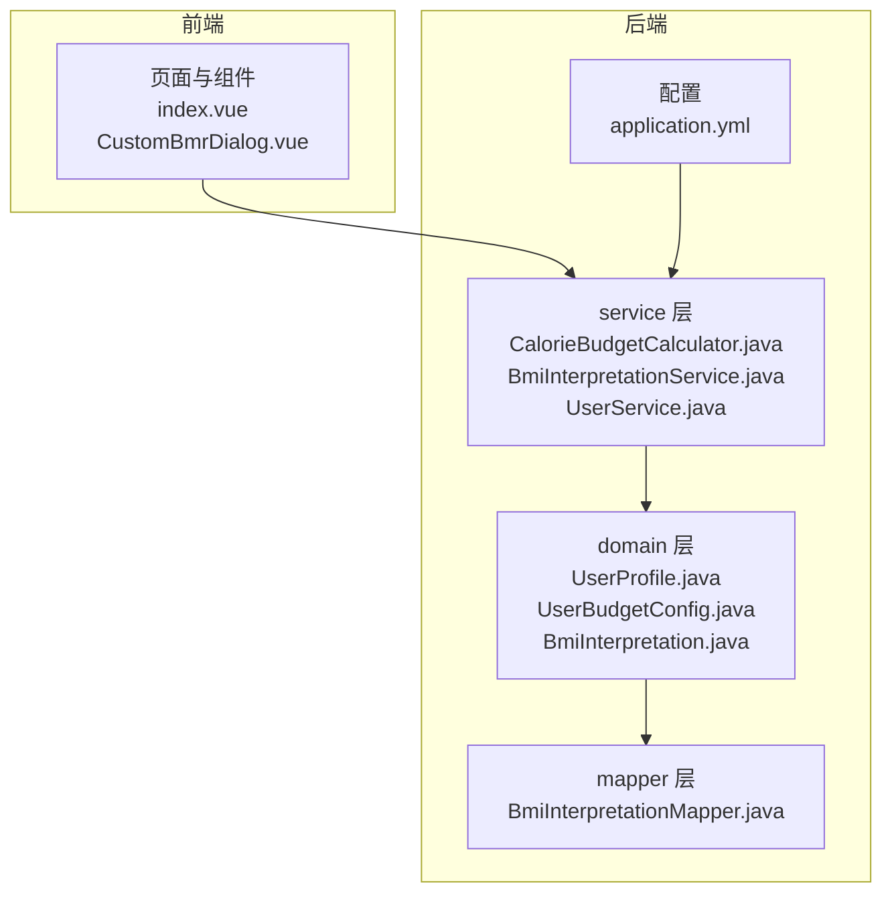
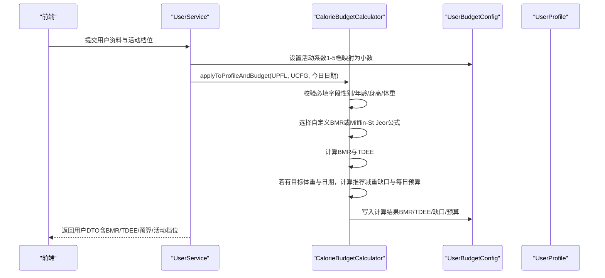
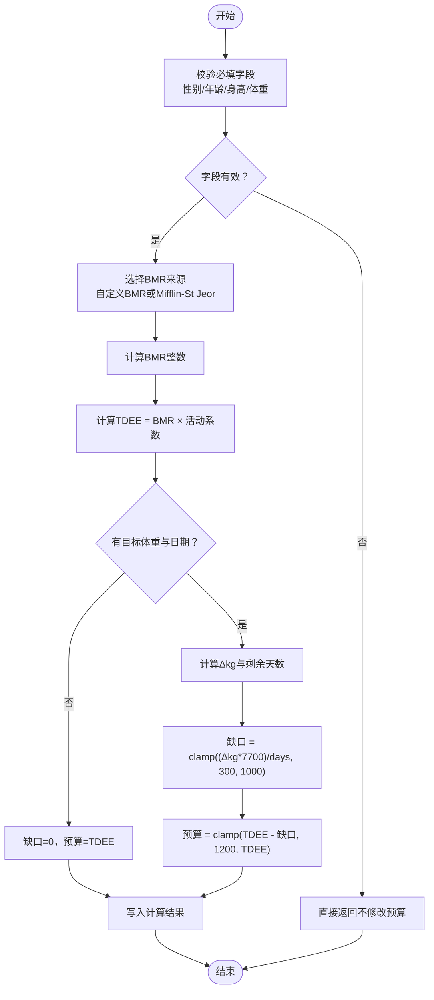
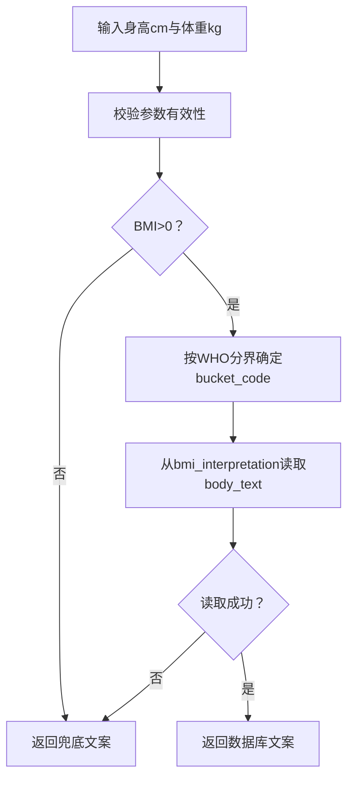
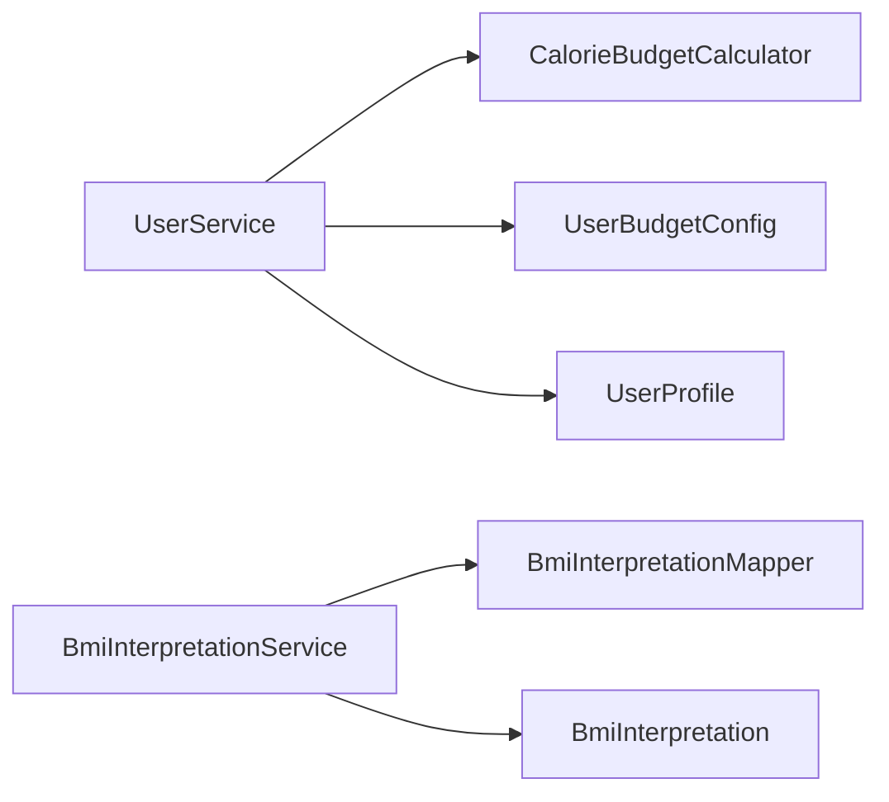

# 热量预算计算服务

<cite>
**本文引用的文件**
- [CalorieBudgetCalculator.java](file://backend/src/main/java/com/ypfr/loseweight/service/CalorieBudgetCalculator.java)
- [UserProfile.java](file://backend/src/main/java/com/ypfr/loseweight/domain/UserProfile.java)
- [UserBudgetConfig.java](file://backend/src/main/java/com/ypfr/loseweight/domain/UserBudgetConfig.java)
- [BmiInterpretation.java](file://backend/src/main/java/com/ypfr/loseweight/domain/BmiInterpretation.java)
- [BmiInterpretationService.java](file://backend/src/main/java/com/ypfr/loseweight/service/BmiInterpretationService.java)
- [BmiInterpretationMapper.java](file://backend/src/main/java/com/ypfr/loseweight/mapper/BmiInterpretationMapper.java)
- [UserService.java](file://backend/src/main/java/com/ypfr/loseweight/service/UserService.java)
- [WeekStatsService.java](file://backend/src/main/java/com/ypfr/loseweight/service/WeekStatsService.java)
- [WeightService.java](file://backend/src/main/java/com/ypfr/loseweight/service/WeightService.java)
- [application.yml](file://backend/src/main/resources/application.yml)
- [V019__bmi_interpretation.sql](file://database/migrations/V019__bmi_interpretation.sql)
- [01_schema.sql](file://database/01_schema.sql)
- [CustomBmrDialog.vue](file://frontend/src/components/home/CustomBmrDialog.vue)
- [index.vue](file://frontend/src/pages/home/index.vue)
</cite>

## 目录
1. [简介](#简介)
2. [项目结构](#项目结构)
3. [核心组件](#核心组件)
4. [架构总览](#架构总览)
5. [详细组件分析](#详细组件分析)
6. [依赖分析](#依赖分析)
7. [性能考量](#性能考量)
8. [故障排查指南](#故障排查指南)
9. [结论](#结论)
10. [附录](#附录)

## 简介
本技术文档围绕“热量预算计算服务”展开，聚焦于 CalorieBudgetCalculator 的核心算法与实现原理，涵盖基础代谢率（BMR）计算、总日常能量消耗（TDEE）估算、每日热量预算确定、BMI 解读服务等关键能力。文档同时阐述不同 BMR 计算公式、活动系数调整、目标体重影响、年龄性别因素考虑，以及数学模型、算法优化、精度控制与边界条件处理。最后给出预算计算的数据模型、BMI 分类标准、体重管理策略、可配置性与扩展性设计、结果验证方法与性能优化建议。

## 项目结构
后端采用 Spring Boot + MyBatis-Plus 架构，服务层位于 service 包，领域模型位于 domain 包，数据库迁移脚本位于 database/migrations。前端使用 Vue 3 + TypeScript，通过 API 与后端交互。

图表来源
- [CalorieBudgetCalculator.java:10-142](file://backend/src/main/java/com/ypfr/loseweight/service/CalorieBudgetCalculator.java#L10-L142)
- [UserProfile.java:11-124](file://backend/src/main/java/com/ypfr/loseweight/domain/UserProfile.java#L11-L124)
- [UserBudgetConfig.java:11-151](file://backend/src/main/java/com/ypfr/loseweight/domain/UserBudgetConfig.java#L11-L151)
- [BmiInterpretation.java:9-59](file://backend/src/main/java/com/ypfr/loseweight/domain/BmiInterpretation.java#L9-L59)
- [BmiInterpretationService.java:14-94](file://backend/src/main/java/com/ypfr/loseweight/service/BmiInterpretationService.java#L14-L94)
- [BmiInterpretationMapper.java:1-9](file://backend/src/main/java/com/ypfr/loseweight/mapper/BmiInterpretationMapper.java#L1-L9)
- [application.yml:1-54](file://backend/src/main/resources/application.yml#L1-L54)
- [index.vue:133-232](file://frontend/src/pages/home/index.vue#L133-L232)
- [CustomBmrDialog.vue:1-280](file://frontend/src/components/home/CustomBmrDialog.vue#L1-L280)

章节来源
- [application.yml:1-54](file://backend/src/main/resources/application.yml#L1-L54)
- [01_schema.sql:1-159](file://database/01_schema.sql#L1-L159)

## 核心组件
- 热量预算计算器 CalorieBudgetCalculator：提供 Mifflin-St Jeor 公式的 BMR 计算、活动系数映射、TDEE 估算、目标体重影响下的推荐减重缺口与每日预算计算。
- 用户档案 UserProfile：承载性别、年龄、身高、当前体重、目标体重、目标日期等关键信息。
- 用户预算配置 UserBudgetConfig：存储是否使用自定义 BMR、自定义 BMR 值、活动系数、计算出的 BMR/TDEE、推荐减重缺口、每日预算、宏量目标等。
- BMI 解读服务 BmiInterpretationService：基于 WHO 常用分界进行 BMI 分桶并解析展示文案。
- 数据模型与迁移：数据库 schema 定义了 app_user、user_profile、user_budget_config、bmi_interpretation 等表结构。

章节来源
- [CalorieBudgetCalculator.java:10-142](file://backend/src/main/java/com/ypfr/loseweight/service/CalorieBudgetCalculator.java#L10-L142)
- [UserProfile.java:11-124](file://backend/src/main/java/com/ypfr/loseweight/domain/UserProfile.java#L11-L124)
- [UserBudgetConfig.java:11-151](file://backend/src/main/java/com/ypfr/loseweight/domain/UserBudgetConfig.java#L11-L151)
- [BmiInterpretationService.java:14-94](file://backend/src/main/java/com/ypfr/loseweight/service/BmiInterpretationService.java#L14-L94)
- [V019__bmi_interpretation.sql:11-44](file://database/migrations/V019__bmi_interpretation.sql#L11-L44)

## 架构总览
热量预算计算贯穿“输入参数校验 → BMR 计算 → TDEE 估算 → 目标体重影响 → 预算与缺口输出”的主流程。前端负责收集用户输入与展示结果，后端服务负责业务逻辑与数据持久化。

图表来源
- [UserService.java:110-164](file://backend/src/main/java/com/ypfr/loseweight/service/UserService.java#L110-L164)
- [CalorieBudgetCalculator.java:67-140](file://backend/src/main/java/com/ypfr/loseweight/service/CalorieBudgetCalculator.java#L67-L140)

## 详细组件分析

### 组件一：CalorieBudgetCalculator（热量预算计算器）
- BMR 计算（Mifflin-St Jeor 公式）
  - 输入：体重（kg）、身高（cm）、年龄（年）、性别（1/2）。
  - 输出：整型 BMR（千卡/日）。
  - 特点：性别因子区分男女，统一以 10×体重 + 6.25×身高 − 5×年龄 ± s 的形式计算。
- 活动系数与档位映射
  - 前端档位 1-5 → 后端存储 decimal 活动系数。
  - 支持从 decimal 系数映射回 1-5 档用于展示。
  - 异常档位归一化为默认档位。
- TDEE 估算
  - TDEE = BMR × 活动系数（保留整数）。
- 目标体重影响下的预算与缺口
  - 若缺少目标体重或目标日期，或目标体重不小于当前体重，则缺口为 0，预算等于 TDEE。
  - 否则按公式 Δkg × 7700 ÷ 天数 计算缺口，并限制在 300–1000 kcal 范围内。
  - 每日预算 = TDEE − 缺口，且不低于 1200 kcal，不高于 TDEE。
- 边界条件与精度控制
  - 使用 BigDecimal 与四舍五入模式进行数值稳定处理。
  - 对输入参数进行非空与正数校验，避免非法值导致计算异常。
  - 活动系数与档位互转时采用阈值分段映射，确保展示一致性。

图表来源
- [CalorieBudgetCalculator.java:67-140](file://backend/src/main/java/com/ypfr/loseweight/service/CalorieBudgetCalculator.java#L67-L140)

章节来源
- [CalorieBudgetCalculator.java:10-142](file://backend/src/main/java/com/ypfr/loseweight/service/CalorieBudgetCalculator.java#L10-L142)

### 组件二：UserProfile（用户档案）
- 字段要点：性别、年龄、身高 cm、初始体重、当前体重、目标体重、目标日期、资料完成标记等。
- 作用：为热量预算计算提供必要输入参数；参与 BMI 计算与解读。

章节来源
- [UserProfile.java:11-124](file://backend/src/main/java/com/ypfr/loseweight/domain/UserProfile.java#L11-L124)

### 组件三：UserBudgetConfig（用户预算配置）
- 字段要点：是否使用自定义 BMR、自定义 BMR 值、活动系数、计算出的 BMR/TDEE、推荐减重缺口、每日预算、宏量目标（碳水/蛋白质/脂肪）、生效日期等。
- 作用：持久化预算计算结果，支撑前端展示与后续统计。

章节来源
- [UserBudgetConfig.java:11-151](file://backend/src/main/java/com/ypfr/loseweight/domain/UserBudgetConfig.java#L11-L151)

### 组件四：BMI 解读服务 BmiInterpretationService
- BMI 分桶（WHO 常用分界）：偏瘦（<18.5）、正常（[18.5,24）、超重（[24,28）、肥胖（≥28）。
- 文案解析：优先从数据库表 bmi_interpretation 按 bucket_code 读取，若缺失或异常则回退到内置文案。
- BMI 计算：w / (h/100)^2，保留一位小数。

图表来源
- [BmiInterpretationService.java:29-92](file://backend/src/main/java/com/ypfr/loseweight/service/BmiInterpretationService.java#L29-L92)
- [BmiInterpretation.java:9-59](file://backend/src/main/java/com/ypfr/loseweight/domain/BmiInterpretation.java#L9-L59)
- [V019__bmi_interpretation.sql:20-44](file://database/migrations/V019__bmi_interpretation.sql#L20-L44)

章节来源
- [BmiInterpretationService.java:14-94](file://backend/src/main/java/com/ypfr/loseweight/service/BmiInterpretationService.java#L14-L94)
- [BmiInterpretationMapper.java:1-9](file://backend/src/main/java/com/ypfr/loseweight/mapper/BmiInterpretationMapper.java#L1-L9)
- [V019__bmi_interpretation.sql:11-44](file://database/migrations/V019__bmi_interpretation.sql#L11-L44)

### 组件五：UserService（用户服务）
- 活动系数设置：将前端 1-5 档映射为 BigDecimal 存储。
- 自定义 BMR：支持开启/关闭与数值校验，数值保存为两位小数。
- 预算重算：在更新资料后调用 applyToProfileAndBudget，确保预算与文案同步。
- DTO 转换：将计算结果映射到前端展示字段（BMR、TDEE、每日预算、活动档位）。

章节来源
- [UserService.java:110-164](file://backend/src/main/java/com/ypfr/loseweight/service/UserService.java#L110-L164)
- [UserService.java:180-193](file://backend/src/main/java/com/ypfr/loseweight/service/UserService.java#L180-L193)
- [UserService.java:220-264](file://backend/src/main/java/com/ypfr/loseweight/service/UserService.java#L220-L264)

### 组件六：前端集成与展示
- 首页仪表盘：展示当日摄入、运动消耗、剩余预算与每日预算。
- 自定义 BMR 对话框：允许用户输入自定义 BMR，并提供“恢复”按钮切换回自动计算。
- 交互流程：用户在首页点击帮助入口进入预算说明页，或在设置中打开自定义 BMR 对话框。

章节来源
- [index.vue:133-232](file://frontend/src/pages/home/index.vue#L133-L232)
- [CustomBmrDialog.vue:1-280](file://frontend/src/components/home/CustomBmrDialog.vue#L1-L280)

## 依赖分析
- 服务层依赖
  - CalorieBudgetCalculator 为纯静态工具类，内部不持有外部状态，耦合度低。
  - BmiInterpretationService 依赖 BmiInterpretationMapper 进行数据访问。
  - UserService 在用户资料更新时调用 CalorieBudgetCalculator 重算预算，并持久化到 UserBudgetConfig。
- 数据层依赖
  - UserProfile 与 UserBudgetConfig 作为核心数据模型，分别对应 app_user 与 user_budget_config 表。
  - BmiInterpretation 对应 bmi_interpretation 表，提供 BMI 解读文案。
- 配置与环境
  - application.yml 提供数据库连接、MyBatis 配置与日志级别，保障 Mapper 层调试可见。

图表来源
- [UserService.java:110-164](file://backend/src/main/java/com/ypfr/loseweight/service/UserService.java#L110-L164)
- [CalorieBudgetCalculator.java:67-140](file://backend/src/main/java/com/ypfr/loseweight/service/CalorieBudgetCalculator.java#L67-L140)
- [BmiInterpretationService.java:23-27](file://backend/src/main/java/com/ypfr/loseweight/service/BmiInterpretationService.java#L23-L27)
- [BmiInterpretationMapper.java:1-9](file://backend/src/main/java/com/ypfr/loseweight/mapper/BmiInterpretationMapper.java#L1-L9)

章节来源
- [application.yml:21-28](file://backend/src/main/resources/application.yml#L21-L28)

## 性能考量
- 计算复杂度
  - BMR/TDEE 计算为 O(1)，预算缺口与预算计算也为 O(1)，整体时间复杂度极低。
- 数值精度
  - 使用 BigDecimal 与明确的舍入模式，避免浮点误差累积。
- I/O 与缓存
  - BMI 解读依赖数据库读取，建议在网关或服务层增加缓存（如按 bucket_code 缓存文案），减少重复查询。
- 批量与并发
  - 当前服务为单用户维度计算，无需批量处理；若扩展至多用户任务调度，建议引入队列与限流策略。
- 前端渲染
  - 首页仪表盘数据通过一次接口拉取，建议在前端做本地缓存与去抖，减少重复请求。

## 故障排查指南
- 常见问题
  - 参数缺失或非法：性别/年龄/身高/体重为空或非正数时，预算不会被修改，检查 UserProfile 填写完整性。
  - 自定义 BMR 无效：useCustomBmr 开启但数值不大于 0，会触发参数错误；确认前端传参与后端校验。
  - 活动系数异常：1-5 档位之外的值会被归一化为默认档位；检查前端传值与归一化逻辑。
  - BMI 解读异常：数据库读取失败或文案缺失时，回退到内置文案；检查表是否存在与字段是否正确。
- 排查步骤
  - 后端日志：开启 Mapper 日志级别，定位 SQL 执行与异常。
  - 前端调试：确认传入的身高、体重、目标体重、目标日期、活动档位是否正确。
  - 数据库核对：检查 user_profile 与 user_budget_config 的字段值是否符合预期。

章节来源
- [BmiInterpretationService.java:62-79](file://backend/src/main/java/com/ypfr/loseweight/service/BmiInterpretationService.java#L62-L79)
- [application.yml:51-54](file://backend/src/main/resources/application.yml#L51-L54)

## 结论
CalorieBudgetCalculator 以简洁稳定的数学模型实现了从基础代谢到每日预算的完整闭环，配合 UserProfile 与 UserBudgetConfig 的数据模型，满足了用户画像驱动的个性化预算管理需求。BmiInterpretationService 提供了可扩展的 BMI 解读能力，结合前端直观的交互界面，形成完整的健康减重体验。通过合理的边界条件处理、精度控制与可配置性设计，系统具备良好的稳定性与可维护性。

## 附录

### 数据模型与字段映射
- app_user（历史字段，兼容旧版）
  - 关键字段：gender、age、height_cm、current_weight_kg、target_weight_kg、target_date、bmr、tdee、daily_calorie_goal、activity_level。
- user_profile
  - 关键字段：gender、age、heightCm、initialWeightKg、currentWeightKg、targetWeightKg、targetDate。
- user_budget_config
  - 关键字段：useCustomBmr、customBmr、activityLevel、calculatedBmr、calculatedTdee、recommendedDeficit、dailyBudget、carbTargetG、proteinTargetG、fatTargetG、effectiveDate。
- bmi_interpretation
  - 关键字段：bucket_code（UNDERWEIGHT/NORMAL/OVERWEIGHT/OBESE）、body_text、revision、source、updated_at。

章节来源
- [01_schema.sql:11-34](file://database/01_schema.sql#L11-L34)
- [01_schema.sql:127-141](file://database/01_schema.sql#L127-L141)
- [V019__bmi_interpretation.sql:11-18](file://database/migrations/V019__bmi_interpretation.sql#L11-L18)

### 算法与公式说明
- BMR（Mifflin-St Jeor）
  - 男性：BMR = 10×体重 + 6.25×身高 − 5×年龄 + 5
  - 女性：BMR = 10×体重 + 6.25×身高 − 5×年龄 − 161
- 活动系数（1-5 档）
  - 1：1.2；2：1.375；3：1.55；4：1.725；5：1.9
- TDEE = BMR × 活动系数
- 推荐减重缺口（kcal/日）= clamp((目标体重差 × 7700) / 剩余天数, 300, 1000)
- 每日预算 = clamp(TDEE − 缺口, 1200, TDEE)

章节来源
- [CalorieBudgetCalculator.java:15-18](file://backend/src/main/java/com/ypfr/loseweight/service/CalorieBudgetCalculator.java#L15-L18)
- [CalorieBudgetCalculator.java:20-29](file://backend/src/main/java/com/ypfr/loseweight/service/CalorieBudgetCalculator.java#L20-L29)
- [CalorieBudgetCalculator.java:131-139](file://backend/src/main/java/com/ypfr/loseweight/service/CalorieBudgetCalculator.java#L131-L139)

### 可配置性与扩展性设计
- 可配置项
  - 活动系数档位：前端 1-5 档，后端映射为 decimal 存储，支持展示回推。
  - 自定义 BMR：开关 + 数值校验，数值保存为两位小数。
  - BMI 解读文案：支持数据库维护与回退机制。
- 扩展方向
  - 支持更多 BMR 公式（如 Harris-Benedict）作为可选策略。
  - 增加宏量目标的动态计算与个性化推荐。
  - 引入缓存与异步任务，优化批量与高并发场景。

章节来源
- [UserService.java:117-143](file://backend/src/main/java/com/ypfr/loseweight/service/UserService.java#L117-L143)
- [BmiInterpretationService.java:62-79](file://backend/src/main/java/com/ypfr/loseweight/service/BmiInterpretationService.java#L62-L79)

### 计算结果验证与性能优化建议
- 结果验证
  - 单元测试：针对不同性别/年龄/身高/体重/活动档位组合进行边界与典型用例验证。
  - 回归测试：在数据库迁移后验证 BMI 解读与预算计算一致性。
- 性能优化
  - 缓存：对 BMI 文案与常用计算结果做缓存。
  - 批处理：在定时任务中批量重算用户预算，避免高峰请求压力。
  - 前端：对首页数据做本地缓存与去抖，减少重复请求。