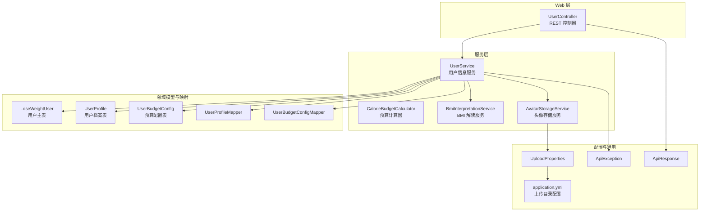
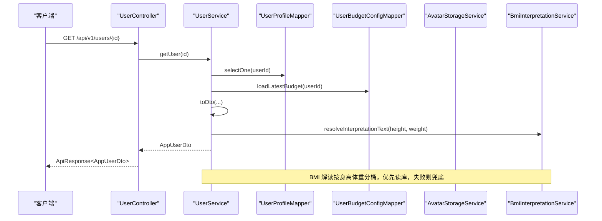
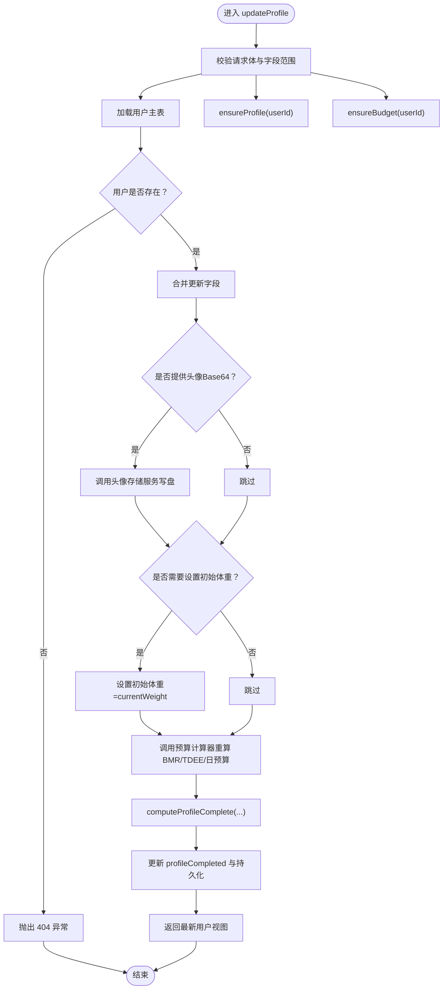
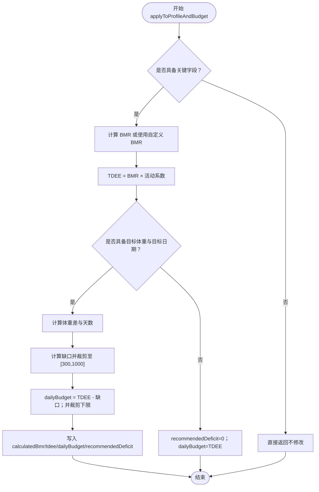
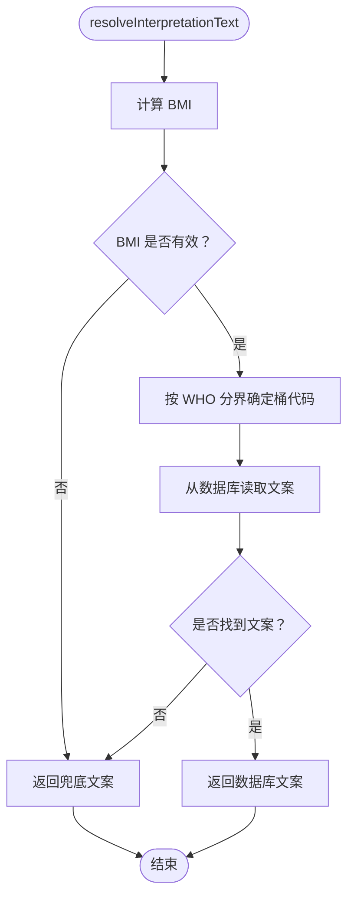
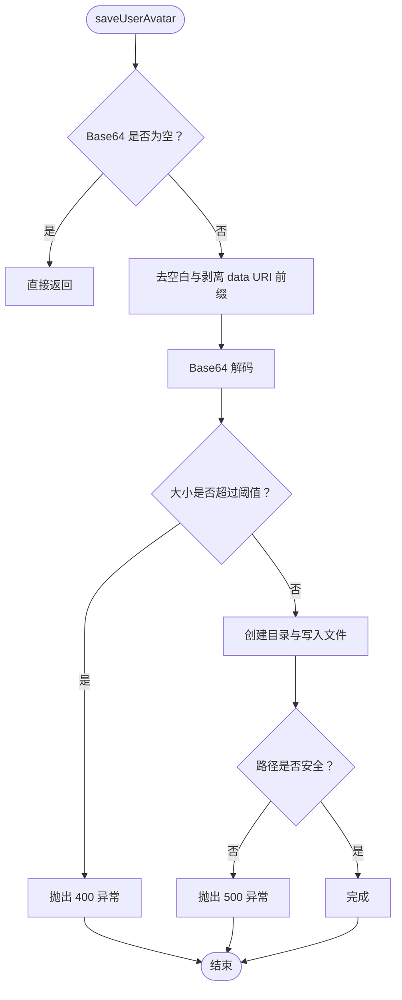
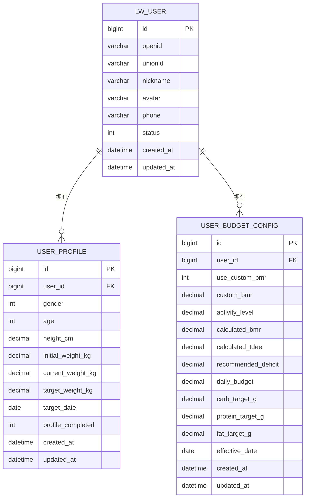
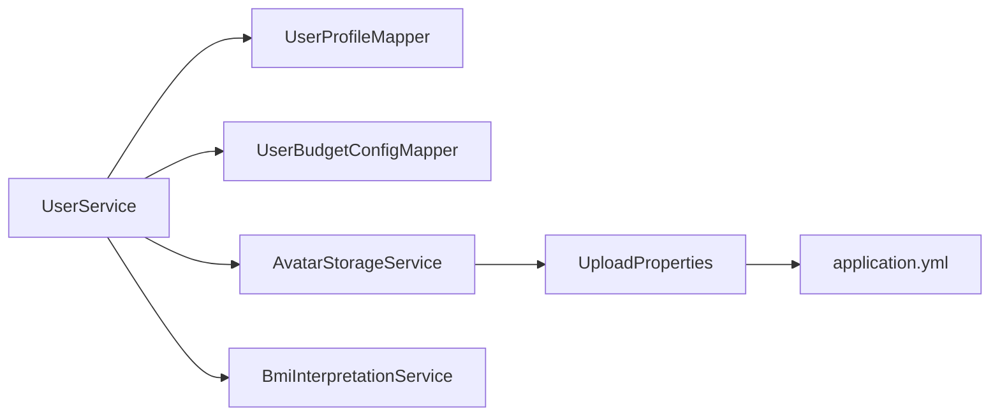

# 用户服务

<cite>
**本文引用的文件**
- [UserService.java](file://backend/src/main/java/com/ypfr/loseweight/service/UserService.java)
- [CalorieBudgetCalculator.java](file://backend/src/main/java/com/ypfr/loseweight/service/CalorieBudgetCalculator.java)
- [BmiInterpretationService.java](file://backend/src/main/java/com/ypfr/loseweight/service/BmiInterpretationService.java)
- [AvatarStorageService.java](file://backend/src/main/java/com/ypfr/loseweight/service/AvatarStorageService.java)
- [UserController.java](file://backend/src/main/java/com/ypfr/loseweight/web/UserController.java)
- [AppUserDto.java](file://backend/src/main/java/com/ypfr/loseweight/web/dto/AppUserDto.java)
- [UpdateProfileRequest.java](file://backend/src/main/java/com/ypfr/loseweight/web/dto/UpdateProfileRequest.java)
- [LoseWeightUser.java](file://backend/src/main/java/com/ypfr/loseweight/domain/LoseWeightUser.java)
- [UserProfile.java](file://backend/src/main/java/com/ypfr/loseweight/domain/UserProfile.java)
- [UserBudgetConfig.java](file://backend/src/main/java/com/ypfr/loseweight/domain/UserBudgetConfig.java)
- [UserProfileMapper.java](file://backend/src/main/java/com/ypfr/loseweight/mapper/UserProfileMapper.java)
- [UserBudgetConfigMapper.java](file://backend/src/main/java/com/ypfr/loseweight/mapper/UserBudgetConfigMapper.java)
- [application.yml](file://backend/src/main/resources/application.yml)
- [UploadProperties.java](file://backend/src/main/java/com/ypfr/loseweight/config/UploadProperties.java)
- [ApiException.java](file://backend/src/main/java/com/ypfr/loseweight/common/ApiException.java)
- [ApiResponse.java](file://backend/src/main/java/com/ypfr/loseweight/common/ApiResponse.java)
</cite>

## 目录
1. [简介](#简介)
2. [项目结构](#项目结构)
3. [核心组件](#核心组件)
4. [架构概览](#架构概览)
5. [详细组件分析](#详细组件分析)
6. [依赖分析](#依赖分析)
7. [性能考虑](#性能考虑)
8. [故障排查指南](#故障排查指南)
9. [结论](#结论)
10. [附录](#附录)

## 简介
本文件面向“用户服务”模块，系统性梳理 UserService 的职责边界与实现细节，涵盖以下主题：
- 用户信息获取与聚合
- 用户档案更新与完整性校验
- 预算配置管理与动态重算
- BMI 解读服务集成
- 基础代谢率与活动水平计算逻辑
- 头像存储服务集成
- 事务边界与数据一致性策略
- 异常处理与错误码规范
- 扩展点、性能优化建议与常见问题

## 项目结构
用户服务位于后端 Java 工程的 service 层，围绕用户主数据、档案、预算配置与外部服务（BMI 解读、头像存储）进行编排。Web 控制器负责路由与参数绑定，DTO 负责跨层数据传输。

图表来源
- [UserController.java:1-41](file://backend/src/main/java/com/ypfr/loseweight/web/UserController.java#L1-L41)
- [UserService.java:1-319](file://backend/src/main/java/com/ypfr/loseweight/service/UserService.java#L1-L319)
- [CalorieBudgetCalculator.java:1-142](file://backend/src/main/java/com/ypfr/loseweight/service/CalorieBudgetCalculator.java#L1-L142)
- [BmiInterpretationService.java:1-94](file://backend/src/main/java/com/ypfr/loseweight/service/BmiInterpretationService.java#L1-L94)
- [AvatarStorageService.java:1-56](file://backend/src/main/java/com/ypfr/loseweight/service/AvatarStorageService.java#L1-L56)
- [UserProfileMapper.java:1-9](file://backend/src/main/java/com/ypfr/loseweight/mapper/UserProfileMapper.java#L1-L9)
- [UserBudgetConfigMapper.java:1-9](file://backend/src/main/java/com/ypfr/loseweight/mapper/UserBudgetConfigMapper.java#L1-L9)
- [application.yml:47-49](file://backend/src/main/resources/application.yml#L47-L49)
- [UploadProperties.java:1-30](file://backend/src/main/java/com/ypfr/loseweight/config/UploadProperties.java#L1-L30)
- [ApiException.java:1-16](file://backend/src/main/java/com/ypfr/loseweight/common/ApiException.java#L1-L16)
- [ApiResponse.java:1-35](file://backend/src/main/java/com/ypfr/loseweight/common/ApiResponse.java#L1-L35)

章节来源
- [UserController.java:1-41](file://backend/src/main/java/com/ypfr/loseweight/web/UserController.java#L1-L41)
- [UserService.java:1-319](file://backend/src/main/java/com/ypfr/loseweight/service/UserService.java#L1-L319)
- [application.yml:1-54](file://backend/src/main/resources/application.yml#L1-L54)

## 核心组件
- 用户信息服务（UserService）：负责用户信息聚合、档案更新、预算配置加载与重算、BMI 解读、头像存储、统计指标附加等。
- 预算计算器（CalorieBudgetCalculator）：基于 Mifflin-St Jeor 公式计算 BMR/TDEE，结合目标体重与目标日期推导推荐减重热量缺口与日预算。
- BMI 解读服务（BmiInterpretationService）：根据身高体重计算 BMI 并按 WHO 分桶返回文案，支持数据库兜底与异常降级。
- 头像存储服务（AvatarStorageService）：解析 Base64 头像数据，校验大小与格式，落盘到配置目录。
- DTO（AppUserDto、UpdateProfileRequest）：前后端数据契约，承载用户视图与更新请求字段。
- 领域模型（LoseWeightUser、UserProfile、UserBudgetConfig）：持久化实体，承载用户主数据、档案与预算配置。
- 映射器（UserProfileMapper、UserBudgetConfigMapper）：MyBatis-Plus Mapper 接口，提供 CRUD 能力。
- Web 控制器（UserController）：对外暴露用户查询与周统计接口。

章节来源
- [UserService.java:25-54](file://backend/src/main/java/com/ypfr/loseweight/service/UserService.java#L25-L54)
- [CalorieBudgetCalculator.java:10-142](file://backend/src/main/java/com/ypfr/loseweight/service/CalorieBudgetCalculator.java#L10-L142)
- [BmiInterpretationService.java:13-94](file://backend/src/main/java/com/ypfr/loseweight/service/BmiInterpretationService.java#L13-L94)
- [AvatarStorageService.java:13-56](file://backend/src/main/java/com/ypfr/loseweight/service/AvatarStorageService.java#L13-L56)
- [AppUserDto.java:6-210](file://backend/src/main/java/com/ypfr/loseweight/web/dto/AppUserDto.java#L6-L210)
- [UpdateProfileRequest.java:5-121](file://backend/src/main/java/com/ypfr/loseweight/web/dto/UpdateProfileRequest.java#L5-L121)
- [LoseWeightUser.java:8-168](file://backend/src/main/java/com/ypfr/loseweight/domain/LoseWeightUser.java#L8-L168)
- [UserProfile.java:10-124](file://backend/src/main/java/com/ypfr/loseweight/domain/UserProfile.java#L10-L124)
- [UserBudgetConfig.java:10-151](file://backend/src/main/java/com/ypfr/loseweight/domain/UserBudgetConfig.java#L10-L151)
- [UserProfileMapper.java:1-9](file://backend/src/main/java/com/ypfr/loseweight/mapper/UserProfileMapper.java#L1-L9)
- [UserBudgetConfigMapper.java:1-9](file://backend/src/main/java/com/ypfr/loseweight/mapper/UserBudgetConfigMapper.java#L1-L9)
- [UserController.java:16-41](file://backend/src/main/java/com/ypfr/loseweight/web/UserController.java#L16-L41)

## 架构概览
用户服务采用“控制器-服务-领域模型-外部服务”的分层架构，遵循单一职责与依赖倒置原则。服务层通过 Mapper 与数据库交互，通过外部服务完成 BMI 解读与头像落盘，最终以 DTO 向前端输出。

图表来源
- [UserController.java:28-31](file://backend/src/main/java/com/ypfr/loseweight/web/UserController.java#L28-L31)
- [UserService.java:56-64](file://backend/src/main/java/com/ypfr/loseweight/service/UserService.java#L56-L64)
- [UserService.java:220-264](file://backend/src/main/java/com/ypfr/loseweight/service/UserService.java#L220-L264)
- [BmiInterpretationService.java:62-79](file://backend/src/main/java/com/ypfr/loseweight/service/BmiInterpretationService.java#L62-L79)

## 详细组件分析

### 用户信息服务（UserService）
- 职责边界
  - 获取用户信息：合并用户主表、档案、预算配置与统计指标，统一输出视图 DTO。
  - 更新档案：接收更新请求，校验字段合法性，必要时生成初始体重，触发预算重算，更新档案与预算配置。
  - 确保档案与预算存在：若缺失则自动初始化默认值。
  - 完整性检查：根据关键字段判断档案是否完整。
  - 统计指标附加：餐次数量、健康饮食天数、加入天数、最近称重距今天数。
- 关键流程
  - 用户获取：查询用户主表与档案，加载最新预算配置，组装 DTO 并附加统计。
  - 档案更新：校验请求体与字段范围，更新用户昵称、性别、年龄、身高、体重、目标体重、目标日期、活动等级、自定义 BMR 等；当满足条件时设置初始体重；调用预算计算器重算 BMR/TDEE/日预算；更新 profile_completed；持久化变更并返回最新用户视图。
  - 头像更新：解析 Base64，调用头像存储服务写入磁盘，回填头像 URL。
  - BMI 解读：调用 BMI 解读服务，按身高体重分桶返回文案。
- 事务与一致性
  - 当前实现为单个方法内多次独立更新，未显式声明事务边界。若需强一致，可在服务层方法上添加事务注解，确保用户、档案、预算配置的更新原子性。
- 错误处理
  - 对空请求、用户不存在、日期格式、活动等级、自定义 BMR、头像数据与大小等进行严格校验，抛出业务异常，由全局异常处理器统一包装响应。

图表来源
- [UserService.java:75-164](file://backend/src/main/java/com/ypfr/loseweight/service/UserService.java#L75-L164)
- [UserService.java:166-193](file://backend/src/main/java/com/ypfr/loseweight/service/UserService.java#L166-L193)
- [UserService.java:195-218](file://backend/src/main/java/com/ypfr/loseweight/service/UserService.java#L195-L218)
- [UserService.java:220-264](file://backend/src/main/java/com/ypfr/loseweight/service/UserService.java#L220-L264)

章节来源
- [UserService.java:56-164](file://backend/src/main/java/com/ypfr/loseweight/service/UserService.java#L56-L164)
- [UserService.java:166-193](file://backend/src/main/java/com/ypfr/loseweight/service/UserService.java#L166-L193)
- [UserService.java:195-218](file://backend/src/main/java/com/ypfr/loseweight/service/UserService.java#L195-L218)
- [UserService.java:220-264](file://backend/src/main/java/com/ypfr/loseweight/service/UserService.java#L220-L264)

### 预算配置与计算（CalorieBudgetCalculator）
- 基础代谢率（BMR）：采用 Mifflin-St Jeor 公式，性别编码 1/2 对应不同常数项。
- 活动系数：1-5 档位映射为小数因子，展示与存储分离（展示映回 1-5 档）。
- 总日常能量消耗（TDEE）：BMR × 活动系数。
- 日预算与推荐减重缺口：基于当前体重、目标体重与目标日期推导，限制缺口范围与日预算下限，确保安全范围。
- 规则要点
  - 若缺少性别、年龄、身高、当前体重任一关键字段，则不重算 calculated_* 与 daily_budget。
  - 若目标体重或目标日期缺失，日预算等于 TDEE。
  - 自定义 BMR 优先于公式计算；否则按公式计算。
  - 活动等级输入为 1-5 档，存储为 decimal 系数；展示时映回 1-5 档位。

图表来源
- [CalorieBudgetCalculator.java:67-140](file://backend/src/main/java/com/ypfr/loseweight/service/CalorieBudgetCalculator.java#L67-L140)

章节来源
- [CalorieBudgetCalculator.java:10-142](file://backend/src/main/java/com/ypfr/loseweight/service/CalorieBudgetCalculator.java#L10-L142)

### BMI 解读服务（BmiInterpretationService）
- BMI 计算：身高（cm）、体重（kg）换算为标准 BMI 值。
- 分桶策略：WHO 常用分界（<18.5 / [18.5,24) / [24,28) / ≥28），返回桶代码。
- 文案解析：优先从数据库按桶代码读取文案，异常或缺失时返回内置兜底文案。
- 异常降级：捕获读库异常并记录日志，保证服务可用性。

图表来源
- [BmiInterpretationService.java:46-79](file://backend/src/main/java/com/ypfr/loseweight/service/BmiInterpretationService.java#L46-L79)

章节来源
- [BmiInterpretationService.java:13-94](file://backend/src/main/java/com/ypfr/loseweight/service/BmiInterpretationService.java#L13-L94)

### 头像存储服务（AvatarStorageService）
- 输入：前端传入的 Base64 字符串（允许 data URI 前缀）。
- 校验：去除 data URI 前缀、Base64 解码、大小限制（阈值 2.5MB）、路径规范化与安全校验。
- 落盘：写入配置目录下的 {userId}.jpg 文件。
- 错误：非法数据、过大、路径无效、IO 异常均转为业务异常。

图表来源
- [AvatarStorageService.java:22-54](file://backend/src/main/java/com/ypfr/loseweight/service/AvatarStorageService.java#L22-L54)
- [UploadProperties.java:8-28](file://backend/src/main/java/com/ypfr/loseweight/config/UploadProperties.java#L8-L28)
- [application.yml:47-49](file://backend/src/main/resources/application.yml#L47-L49)

章节来源
- [AvatarStorageService.java:13-56](file://backend/src/main/java/com/ypfr/loseweight/service/AvatarStorageService.java#L13-L56)
- [UploadProperties.java:1-30](file://backend/src/main/java/com/ypfr/loseweight/config/UploadProperties.java#L1-L30)
- [application.yml:47-49](file://backend/src/main/resources/application.yml#L47-L49)

### 数据模型与 DTO
- 用户主表（LoseWeightUser）：包含 openid、unionid、昵称、头像、手机号、状态、注册时间等字段。
- 用户档案（UserProfile）：性别、年龄、身高、初始/当前/目标体重、目标日期、档案完成标记等。
- 预算配置（UserBudgetConfig）：是否使用自定义 BMR、自定义 BMR、活动系数、计算出的 BMR/TDEE、推荐缺口、日预算、宏量目标、生效日期等。
- 视图 DTO（AppUserDto）：向前端输出的用户信息，包含统计指标与 BMI 解读文案。
- 更新请求 DTO（UpdateProfileRequest）：支持可选字段更新，包含活动等级与自定义 BMR 开关。

图表来源
- [LoseWeightUser.java:10-168](file://backend/src/main/java/com/ypfr/loseweight/domain/LoseWeightUser.java#L10-L168)
- [UserProfile.java:10-124](file://backend/src/main/java/com/ypfr/loseweight/domain/UserProfile.java#L10-L124)
- [UserBudgetConfig.java:10-151](file://backend/src/main/java/com/ypfr/loseweight/domain/UserBudgetConfig.java#L10-L151)

章节来源
- [LoseWeightUser.java:8-168](file://backend/src/main/java/com/ypfr/loseweight/domain/LoseWeightUser.java#L8-L168)
- [UserProfile.java:10-124](file://backend/src/main/java/com/ypfr/loseweight/domain/UserProfile.java#L10-L124)
- [UserBudgetConfig.java:10-151](file://backend/src/main/java/com/ypfr/loseweight/domain/UserBudgetConfig.java#L10-L151)
- [AppUserDto.java:6-210](file://backend/src/main/java/com/ypfr/loseweight/web/dto/AppUserDto.java#L6-L210)
- [UpdateProfileRequest.java:5-121](file://backend/src/main/java/com/ypfr/loseweight/web/dto/UpdateProfileRequest.java#L5-L121)

### API 与控制器
- GET /api/v1/users/{id}：返回用户视图 DTO。
- GET /api/v1/users/{userId}/week-stats：返回周统计 DTO（由 WeekStatsService 提供，此处仅展示路由）。
- 统一响应：使用 ApiResponse 包装 code/message/data。

章节来源
- [UserController.java:16-41](file://backend/src/main/java/com/ypfr/loseweight/web/UserController.java#L16-L41)
- [ApiResponse.java:3-35](file://backend/src/main/java/com/ypfr/loseweight/common/ApiResponse.java#L3-L35)

## 依赖分析
- 组件耦合
  - UserService 依赖 UserProfileMapper、UserBudgetConfigMapper、AvatarStorageService、BmiInterpretationService、多个 Mapper 与领域模型。
  - AvatarStorageService 依赖 UploadProperties 与 application.yml 中的上传目录配置。
  - BmiInterpretationService 依赖 BmiInterpretationMapper 与数据库。
- 外部依赖
  - MySQL（MyBatis-Plus）
  - Spring Web（REST）
  - SLF4J（日志）
- 循环依赖
  - 未发现循环依赖迹象，各层职责清晰。

图表来源
- [UserService.java:28-53](file://backend/src/main/java/com/ypfr/loseweight/service/UserService.java#L28-L53)
- [AvatarStorageService.java:16-20](file://backend/src/main/java/com/ypfr/loseweight/service/AvatarStorageService.java#L16-L20)
- [UploadProperties.java:5-29](file://backend/src/main/java/com/ypfr/loseweight/config/UploadProperties.java#L5-L29)
- [application.yml:47-49](file://backend/src/main/resources/application.yml#L47-L49)

章节来源
- [UserService.java:28-53](file://backend/src/main/java/com/ypfr/loseweight/service/UserService.java#L28-L53)
- [AvatarStorageService.java:16-20](file://backend/src/main/java/com/ypfr/loseweight/service/AvatarStorageService.java#L16-L20)
- [UploadProperties.java:1-30](file://backend/src/main/java/com/ypfr/loseweight/config/UploadProperties.java#L1-L30)
- [application.yml:47-49](file://backend/src/main/resources/application.yml#L47-L49)

## 性能考虑
- 查询优化
  - 用户获取：单次查询用户主表、一次档案查询、一次预算查询，复杂度 O(1)。
  - 统计指标：通过聚合查询（计数）实现，建议在相关列建立索引（如 user_id、record_date）。
- 计算开销
  - 预算重算为纯内存计算，成本极低；BMI 解读为数据库单行查询。
- IO 与存储
  - 头像写盘为顺序 IO，注意磁盘空间与并发写入；建议引入异步落盘或队列缓冲。
- 并发与一致性
  - 当前更新流程为多条独立更新，建议在服务层方法上启用事务，确保用户、档案、预算配置的原子性提交。
- 缓存策略
  - 可对常用用户视图与 BMI 文案做缓存，降低数据库压力。

## 故障排查指南
- 常见错误与定位
  - 请求体为空：抛出 400，检查前端是否正确序列化 JSON。
  - 用户不存在：抛出 404，确认用户 ID 与登录态。
  - 日期格式无效：抛出 400，确认目标日期格式为 yyyy-MM-dd。
  - 活动等级非法：抛出 400，确认传入 1-5。
  - 自定义 BMR 非法：抛出 400，确认大于 0。
  - 头像数据无效/过大/路径无效：抛出 400/500，检查 Base64 格式与大小限制。
  - 保存头像失败：抛出 500，检查上传目录权限与磁盘空间。
- 日志与监控
  - 使用 SLF4J 记录异常堆栈；在网关或中间件层记录请求耗时与错误率。
- 修复建议
  - 在 UserService.updateProfile 上增加事务注解，保证多表更新一致性。
  - 对头像写盘增加重试与幂等（如按 userId 去重）。
  - 对 BMI 解读读库失败进行告警与熔断兜底。

章节来源
- [UserService.java:75-164](file://backend/src/main/java/com/ypfr/loseweight/service/UserService.java#L75-L164)
- [AvatarStorageService.java:22-54](file://backend/src/main/java/com/ypfr/loseweight/service/AvatarStorageService.java#L22-L54)
- [BmiInterpretationService.java:62-79](file://backend/src/main/java/com/ypfr/loseweight/service/BmiInterpretationService.java#L62-L79)
- [ApiException.java:3-16](file://backend/src/main/java/com/ypfr/loseweight/common/ApiException.java#L3-L16)

## 结论
UserService 以清晰的职责划分与稳健的数据流实现了用户信息聚合、档案更新、预算配置与外部服务集成。通过预算计算器与 BMI 解读服务，系统在保证算法一致性的同时提供了可扩展的策略入口。建议进一步强化事务边界与缓存策略，以提升一致性与性能表现。

## 附录

### ProfileComplete 计算逻辑
- 判断依据：用户昵称非空、性别为 1/2、年龄>0、身高>0、当前体重>0、目标体重>0、目标日期非空。
- 计算位置：UserService.computeProfileComplete；同时在 DTO 转换阶段进行二次校验与补正。

章节来源
- [UserService.java:195-218](file://backend/src/main/java/com/ypfr/loseweight/service/UserService.java#L195-L218)

### 活动水平等级转换
- 前端档位 1-5 → 存库 decimal 系数；展示时映回 1-5 档位。
- 转换函数：activityDecimalFromTier、tierFromActivityDecimal。

章节来源
- [CalorieBudgetCalculator.java:38-62](file://backend/src/main/java/com/ypfr/loseweight/service/CalorieBudgetCalculator.java#L38-L62)

### 预算配置策略
- 关键字段：useCustomBmr、customBmr、activityLevel、dailyBudget、recommendedDeficit、宏量目标等。
- 生效日期：effectiveDate；加载最新预算时按生效日期与主键降序取第一条。

章节来源
- [UserBudgetConfig.java:10-151](file://backend/src/main/java/com/ypfr/loseweight/domain/UserBudgetConfig.java#L10-L151)
- [UserService.java:66-73](file://backend/src/main/java/com/ypfr/loseweight/service/UserService.java#L66-L73)

### 扩展点与最佳实践
- 扩展点
  - 预算策略：新增目标周期、多目标权重、动态活动系数等。
  - BMI 解读：接入更多权威机构分桶与本地化文案。
  - 头像处理：引入图片压缩、水印、CDN 分发。
- 最佳实践
  - 事务化更新：在服务层统一开启事务，保证多表一致性。
  - 缓存与降级：对热点数据与外部依赖增加缓存与熔断。
  - 参数校验：在 DTO 层与服务层双重校验，减少无效调用。