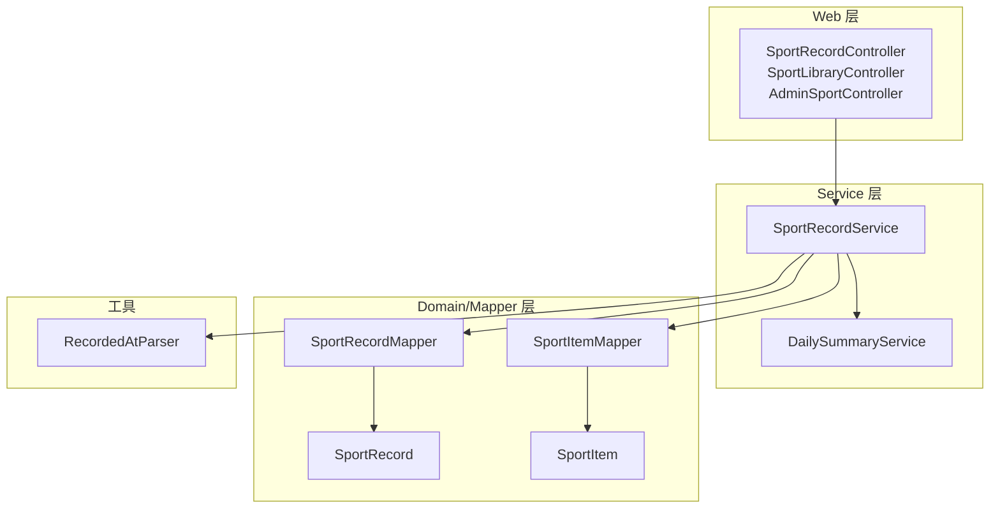
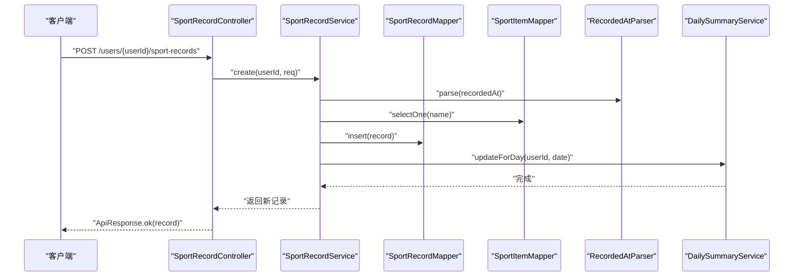
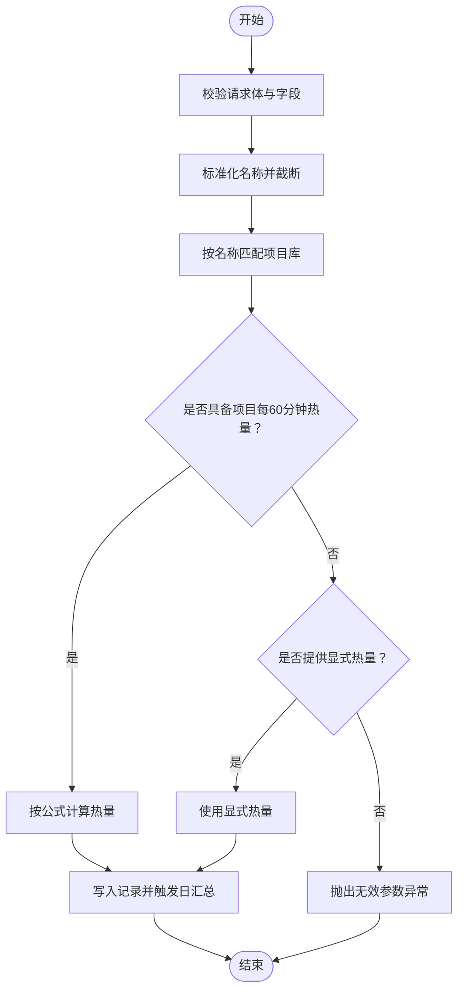
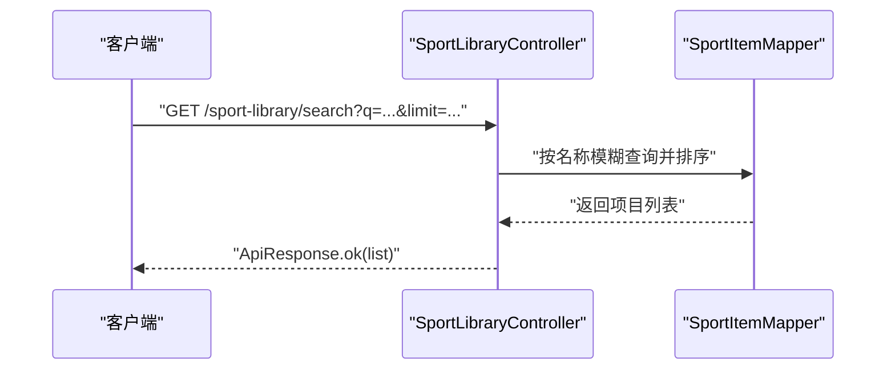
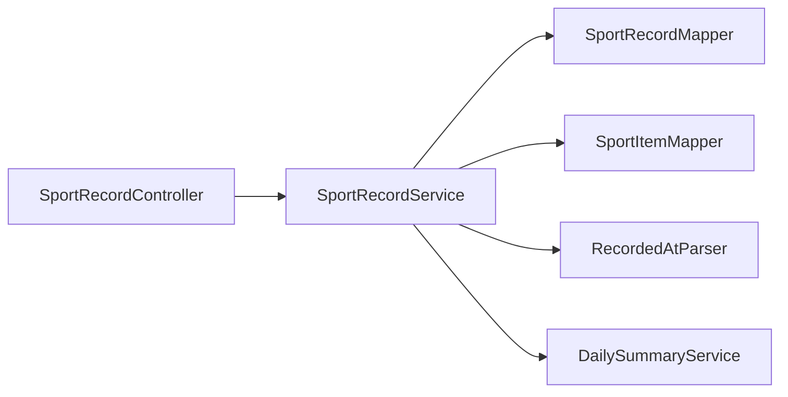

# 运动记录服务

<cite>
**本文引用的文件**
- [SportRecordService.java](file://backend/src/main/java/com/ypfr/loseweight/service/SportRecordService.java)
- [SportRecord.java](file://backend/src/main/java/com/ypfr/loseweight/domain/SportRecord.java)
- [SportItem.java](file://backend/src/main/java/com/ypfr/loseweight/domain/SportItem.java)
- [SportRecordMapper.java](file://backend/src/main/java/com/ypfr/loseweight/mapper/SportRecordMapper.java)
- [SportItemMapper.java](file://backend/src/main/java/com/ypfr/loseweight/mapper/SportItemMapper.java)
- [CreateSportRecordRequest.java](file://backend/src/main/java/com/ypfr/loseweight/web/dto/CreateSportRecordRequest.java)
- [SportRecordController.java](file://backend/src/main/java/com/ypfr/loseweight/web/SportRecordController.java)
- [RecordedAtParser.java](file://backend/src/main/java/com/ypfr/loseweight/util/RecordedAtParser.java)
- [DailySummaryService.java](file://backend/src/main/java/com/ypfr/loseweight/service/DailySummaryService.java)
- [SportLibraryController.java](file://backend/src/main/java/com/ypfr/loseweight/web/SportLibraryController.java)
- [AdminSportController.java](file://backend/src/main/java/com/ypfr/loseweight/web/AdminSportController.java)
- [01_schema.sql](file://database/01_schema.sql)
- [02_seed.sql](file://database/02_seed.sql)
</cite>

## 目录
1. [简介](#简介)
2. [项目结构](#项目结构)
3. [核心组件](#核心组件)
4. [架构概览](#架构概览)
5. [详细组件分析](#详细组件分析)
6. [依赖分析](#依赖分析)
7. [性能考虑](#性能考虑)
8. [故障排查指南](#故障排查指南)
9. [结论](#结论)
10. [附录](#附录)

## 简介
本技术文档围绕运动记录服务模块展开，重点解析 SportRecordService 的核心功能与实现细节，涵盖运动记录创建、运动项目查询、消耗热量计算、运动历史统计、运动项目分类体系、强度与热量关系、记录时间精度处理、运动项目匹配算法、热量计算公式、记录生命周期管理、数据模型设计、项目库维护以及用户运动偏好分析，并给出扩展性设计、性能监控与可视化支持建议。

## 项目结构
后端采用分层架构：Web 层负责接收请求与返回响应；Service 层承载业务逻辑；Domain/Mapper 层负责数据模型与持久化访问；Util 提供通用解析工具；DailySummaryService 负责日汇总更新。



**图表来源**
- [SportRecordController.java:1-36](file://backend/src/main/java/com/ypfr/loseweight/web/SportRecordController.java#L1-L36)
- [SportLibraryController.java:1-36](file://backend/src/main/java/com/ypfr/loseweight/web/SportLibraryController.java#L1-L36)
- [AdminSportController.java:1-67](file://backend/src/main/java/com/ypfr/loseweight/web/AdminSportController.java#L1-L67)
- [SportRecordService.java:1-111](file://backend/src/main/java/com/ypfr/loseweight/service/SportRecordService.java#L1-L111)
- [DailySummaryService.java:1-165](file://backend/src/main/java/com/ypfr/loseweight/service/DailySummaryService.java#L1-L165)
- [SportRecord.java:1-124](file://backend/src/main/java/com/ypfr/loseweight/domain/SportRecord.java#L1-L124)
- [SportItem.java:1-131](file://backend/src/main/java/com/ypfr/loseweight/domain/SportItem.java#L1-L131)
- [SportRecordMapper.java:1-31](file://backend/src/main/java/com/ypfr/loseweight/mapper/SportRecordMapper.java#L1-L31)
- [SportItemMapper.java:1-9](file://backend/src/main/java/com/ypfr/loseweight/mapper/SportItemMapper.java#L1-L9)
- [RecordedAtParser.java:1-32](file://backend/src/main/java/com/ypfr/loseweight/util/RecordedAtParser.java#L1-L32)

**章节来源**
- [SportRecordController.java:1-36](file://backend/src/main/java/com/ypfr/loseweight/web/SportRecordController.java#L1-L36)
- [SportRecordService.java:1-111](file://backend/src/main/java/com/ypfr/loseweight/service/SportRecordService.java#L1-L111)
- [SportRecord.java:1-124](file://backend/src/main/java/com/ypfr/loseweight/domain/SportRecord.java#L1-L124)
- [SportItem.java:1-131](file://backend/src/main/java/com/ypfr/loseweight/domain/SportItem.java#L1-L131)
- [SportRecordMapper.java:1-31](file://backend/src/main/java/com/ypfr/loseweight/mapper/SportRecordMapper.java#L1-L31)
- [SportItemMapper.java:1-9](file://backend/src/main/java/com/ypfr/loseweight/mapper/SportItemMapper.java#L1-L9)
- [RecordedAtParser.java:1-32](file://backend/src/main/java/com/ypfr/loseweight/util/RecordedAtParser.java#L1-L32)
- [DailySummaryService.java:1-165](file://backend/src/main/java/com/ypfr/loseweight/service/DailySummaryService.java#L1-L165)

## 核心组件
- 运动记录实体：记录用户运动详情，包含时间、时长、热量、来源、快照信息等。
- 运动项目实体：记录标准运动项目的基础信息与单位热量。
- 记录创建服务：负责校验输入、匹配项目、计算热量、写入记录并触发日汇总。
- 记录查询映射：提供按日期聚合的热量统计与范围统计。
- 时间解析工具：统一处理记录时间字符串，确保精度与时区一致性。
- 日汇总服务：基于当日摄入与运动数据更新日汇总表。

**章节来源**
- [SportRecord.java:1-124](file://backend/src/main/java/com/ypfr/loseweight/domain/SportRecord.java#L1-L124)
- [SportItem.java:1-131](file://backend/src/main/java/com/ypfr/loseweight/domain/SportItem.java#L1-L131)
- [SportRecordService.java:1-111](file://backend/src/main/java/com/ypfr/loseweight/service/SportRecordService.java#L1-L111)
- [SportRecordMapper.java:1-31](file://backend/src/main/java/com/ypfr/loseweight/mapper/SportRecordMapper.java#L1-L31)
- [RecordedAtParser.java:1-32](file://backend/src/main/java/com/ypfr/loseweight/util/RecordedAtParser.java#L1-L32)
- [DailySummaryService.java:1-165](file://backend/src/main/java/com/ypfr/loseweight/service/DailySummaryService.java#L1-L165)

## 架构概览
运动记录服务通过控制器接收请求，调用服务层完成业务处理，服务层协调映射器与工具类，最终更新日汇总以保证统计一致性。



**图表来源**
- [SportRecordController.java:24-28](file://backend/src/main/java/com/ypfr/loseweight/web/SportRecordController.java#L24-L28)
- [SportRecordService.java:33-84](file://backend/src/main/java/com/ypfr/loseweight/service/SportRecordService.java#L33-L84)
- [RecordedAtParser.java:15-30](file://backend/src/main/java/com/ypfr/loseweight/util/RecordedAtParser.java#L15-L30)
- [SportRecordMapper.java:1-31](file://backend/src/main/java/com/ypfr/loseweight/mapper/SportRecordMapper.java#L1-L31)
- [SportItemMapper.java:1-9](file://backend/src/main/java/com/ypfr/loseweight/mapper/SportItemMapper.java#L1-L9)
- [DailySummaryService.java:41-154](file://backend/src/main/java/com/ypfr/loseweight/service/DailySummaryService.java#L41-L154)

## 详细组件分析

### 运动记录创建流程
- 输入校验：名称必填、时长必须为正数；若未提供项目且未提供热量，则拒绝。
- 名称标准化：去除前后空格并截断至最大长度。
- 项目匹配：按标准化名称精确匹配项目库，取第一条。
- 热量计算优先级：
  - 若匹配到项目且其每60分钟热量有效，则按公式计算：热量 = 项目每60分钟热量 × 时长 ÷ 60。
  - 否则若显式提供热量，则直接使用。
  - 否则抛出无效参数异常。
- 写入记录：设置用户ID、记录日期、快照信息、来源为手动、记录时间由解析器提供。
- 触发日汇总：异步尝试更新对应日期的日汇总，失败不影响主流程。



**图表来源**
- [SportRecordService.java:33-84](file://backend/src/main/java/com/ypfr/loseweight/service/SportRecordService.java#L33-L84)
- [RecordedAtParser.java:15-30](file://backend/src/main/java/com/ypfr/loseweight/util/RecordedAtParser.java#L15-L30)

**章节来源**
- [SportRecordService.java:33-84](file://backend/src/main/java/com/ypfr/loseweight/service/SportRecordService.java#L33-L84)
- [CreateSportRecordRequest.java:1-51](file://backend/src/main/java/com/ypfr/loseweight/web/dto/CreateSportRecordRequest.java#L1-L51)
- [RecordedAtParser.java:15-30](file://backend/src/main/java/com/ypfr/loseweight/util/RecordedAtParser.java#L15-L30)

### 运动项目查询与匹配
- 查询接口：支持关键词模糊搜索与限制数量，按名称排序返回。
- 匹配策略：创建记录时按标准化后的名称进行精确匹配，取第一条。
- 项目库维护：管理员接口支持列表、创建、更新、删除项目，便于维护标准项目库。



**图表来源**
- [SportLibraryController.java:24-34](file://backend/src/main/java/com/ypfr/loseweight/web/SportLibraryController.java#L24-L34)
- [SportItemMapper.java:1-9](file://backend/src/main/java/com/ypfr/loseweight/mapper/SportItemMapper.java#L1-L9)

**章节来源**
- [SportLibraryController.java:24-34](file://backend/src/main/java/com/ypfr/loseweight/web/SportLibraryController.java#L24-L34)
- [AdminSportController.java:32-65](file://backend/src/main/java/com/ypfr/loseweight/web/AdminSportController.java#L32-L65)

### 消耗热量计算与强度关系
- 真值口径：当存在标准项目时，采用“每60分钟热量”作为强度基准，按实际时长线性换算。
- 公式：热量 = 项目每60分钟热量 × 时长 ÷ 60；结果保留两位小数。
- 强度与热量：项目库中的“每60分钟热量”体现运动强度；时长越长、强度越高，消耗越多。
- 备选口径：若无项目匹配，允许显式传入热量，用于自定义或特殊场景。

**章节来源**
- [SportRecordService.java:61-74](file://backend/src/main/java/com/ypfr/loseweight/service/SportRecordService.java#L61-L74)
- [SportItem.java:23-40](file://backend/src/main/java/com/ypfr/loseweight/domain/SportItem.java#L23-L40)

### 记录时间精度处理
- 支持格式：ISO本地时间字符串或“yyyy-MM-dd HH:mm:ss”两种格式。
- 解析行为：先尝试ISO格式，再尝试指定格式，均失败则抛出参数异常。
- 存储字段：记录时间精确到秒，日汇总按“记录日期”聚合。

**章节来源**
- [RecordedAtParser.java:15-30](file://backend/src/main/java/com/ypfr/loseweight/util/RecordedAtParser.java#L15-L30)
- [SportRecord.java:17-26](file://backend/src/main/java/com/ypfr/loseweight/domain/SportRecord.java#L17-L26)

### 运动历史统计
- 单日汇总：按用户与日期求和当日运动消耗。
- 时间范围统计：按用户与日期区间分组统计每日消耗。
- 统计用途：用于前端展示与报表生成。

**章节来源**
- [SportRecordMapper.java:16-29](file://backend/src/main/java/com/ypfr/loseweight/mapper/SportRecordMapper.java#L16-L29)

### 日汇总联动与生命周期
- 生命周期：创建/删除运动记录后，触发对应日期的日汇总更新。
- 更新策略：若当日无任何有效数据，则删除该日汇总；否则插入或更新。
- 影响范围：日汇总同时受饮食与运动影响，运动消耗会改变净缺口与剩余预算。

**章节来源**
- [SportRecordService.java:79-83](file://backend/src/main/java/com/ypfr/loseweight/service/SportRecordService.java#L79-L83)
- [SportRecordService.java:86-101](file://backend/src/main/java/com/ypfr/loseweight/service/SportRecordService.java#L86-L101)
- [DailySummaryService.java:41-154](file://backend/src/main/java/com/ypfr/loseweight/service/DailySummaryService.java#L41-L154)

### 数据模型设计
- 运动记录表：包含用户标识、记录日期、项目快照、时长、热量、来源、记录时间等。
- 运动项目表：包含名称、图标、每60分钟热量、分类、状态、排序等。
- 关键索引：用户+记录时间索引，保障查询效率。

```mermaid
erDiagram
APP_USER {
bigint id PK
varchar openid UK
...
}
SPORT_RECORD {
bigint id PK
bigint user_id FK
date record_date
bigint sport_item_id
varchar sport_name_snapshot
varchar icon_snapshot
int duration_min
decimal calories_burned
varchar source
datetime record_time
datetime created_at
datetime updated_at
}
SPORT_ITEM {
bigint id PK
bigint creator_user_id
varchar name
varchar icon
decimal calories_per_60min
varchar category
int is_custom
int status
int sort_no
datetime created_at
datetime updated_at
}
APP_USER ||--o{ SPORT_RECORD : "拥有"
SPORT_ITEM ||--o{ SPORT_RECORD : "被使用"
```

**图表来源**
- [01_schema.sql:56-69](file://database/01_schema.sql#L56-L69)
- [01_schema.sql:98-108](file://database/01_schema.sql#L98-L108)
- [SportRecord.java:10-26](file://backend/src/main/java/com/ypfr/loseweight/domain/SportRecord.java#L10-L26)
- [SportItem.java:13-31](file://backend/src/main/java/com/ypfr/loseweight/domain/SportItem.java#L13-L31)

**章节来源**
- [01_schema.sql:56-69](file://database/01_schema.sql#L56-L69)
- [01_schema.sql:98-108](file://database/01_schema.sql#L98-L108)
- [SportRecord.java:10-26](file://backend/src/main/java/com/ypfr/loseweight/domain/SportRecord.java#L10-L26)
- [SportItem.java:13-31](file://backend/src/main/java/com/ypfr/loseweight/domain/SportItem.java#L13-L31)

### 运动项目库维护与用户偏好分析
- 项目库维护：管理员可对项目进行增删改查，控制分类、状态与排序。
- 用户偏好：可通过用户维度的历史运动记录统计分析常见项目、时段分布与消耗趋势，辅助个性化推荐。

**章节来源**
- [AdminSportController.java:32-65](file://backend/src/main/java/com/ypfr/loseweight/web/AdminSportController.java#L32-L65)
- [SportRecordMapper.java:16-29](file://backend/src/main/java/com/ypfr/loseweight/mapper/SportRecordMapper.java#L16-L29)

## 依赖分析
- 控制器依赖服务；服务依赖映射器与工具；映射器依赖 MyBatis；服务依赖日汇总服务。
- 耦合点：服务层对映射器与工具的直接依赖；日汇总服务对多张表的读取与更新。
- 可能的循环：当前结构为单向依赖，未见循环。



**图表来源**
- [SportRecordController.java:1-36](file://backend/src/main/java/com/ypfr/loseweight/web/SportRecordController.java#L1-L36)
- [SportRecordService.java:1-111](file://backend/src/main/java/com/ypfr/loseweight/service/SportRecordService.java#L1-L111)
- [SportRecordMapper.java:1-31](file://backend/src/main/java/com/ypfr/loseweight/mapper/SportRecordMapper.java#L1-L31)
- [SportItemMapper.java:1-9](file://backend/src/main/java/com/ypfr/loseweight/mapper/SportItemMapper.java#L1-L9)
- [RecordedAtParser.java:1-32](file://backend/src/main/java/com/ypfr/loseweight/util/RecordedAtParser.java#L1-L32)
- [DailySummaryService.java:1-165](file://backend/src/main/java/com/ypfr/loseweight/service/DailySummaryService.java#L1-L165)

**章节来源**
- [SportRecordService.java:20-31](file://backend/src/main/java/com/ypfr/loseweight/service/SportRecordService.java#L20-L31)
- [DailySummaryService.java:20-34](file://backend/src/main/java/com/ypfr/loseweight/service/DailySummaryService.java#L20-L34)

## 性能考虑
- 查询优化：利用用户+记录时间索引快速定位当日记录；按日期范围统计时注意索引覆盖。
- 写入优化：批量创建时减少多次日汇总更新；可在事务内合并更新。
- 缓存策略：热门项目名称可缓存匹配结果；日汇总可按日期缓存，避免重复计算。
- 分页与限制：搜索接口限制最大返回条数，防止资源浪费。
- 异常吞吐：日汇总更新失败不影响主流程，但应记录日志以便后续重试。

[本节为通用性能建议，无需列出具体文件来源]

## 故障排查指南
- 参数异常：请求体为空、名称为空、时长非正、记录时间格式无效、未提供有效热量。
- 权限异常：删除记录时用户ID不匹配。
- 数据缺失：项目库中无匹配项且未提供热量时拒绝创建。
- 日汇总异常：更新失败不影响主流程，检查日汇总服务日志与数据库约束。

**章节来源**
- [SportRecordService.java:34-42](file://backend/src/main/java/com/ypfr/loseweight/service/SportRecordService.java#L34-L42)
- [SportRecordService.java:88-93](file://backend/src/main/java/com/ypfr/loseweight/service/SportRecordService.java#L88-L93)
- [RecordedAtParser.java:16-29](file://backend/src/main/java/com/ypfr/loseweight/util/RecordedAtParser.java#L16-L29)
- [DailySummaryService.java:36-40](file://backend/src/main/java/com/ypfr/loseweight/service/DailySummaryService.java#L36-L40)

## 结论
运动记录服务通过清晰的分层设计与严格的输入校验，实现了从项目匹配到热量计算再到日汇总联动的完整闭环。服务具备良好的扩展性与可维护性，能够支撑项目库维护、用户偏好分析与可视化报表需求。建议在生产环境中结合缓存与批处理策略进一步提升性能，并完善监控与重试机制以增强稳定性。

## 附录

### 接口与数据模型对照
- 创建运动记录
  - 方法与路径：POST /api/v1/users/{userId}/sport-records
  - 请求体字段：sportName、durationMin、calories、icon、recordedAt
  - 返回：新增运动记录对象
- 运动项目搜索
  - 方法与路径：GET /api/v1/sport-library/search?q=&limit=
  - 返回：项目列表
- 管理员维护项目
  - 方法与路径：GET/POST/PUT/DELETE /api/v1/admin/sports

**章节来源**
- [SportRecordController.java:24-34](file://backend/src/main/java/com/ypfr/loseweight/web/SportRecordController.java#L24-L34)
- [SportLibraryController.java:24-34](file://backend/src/main/java/com/ypfr/loseweight/web/SportLibraryController.java#L24-L34)
- [AdminSportController.java:32-65](file://backend/src/main/java/com/ypfr/loseweight/web/AdminSportController.java#L32-L65)