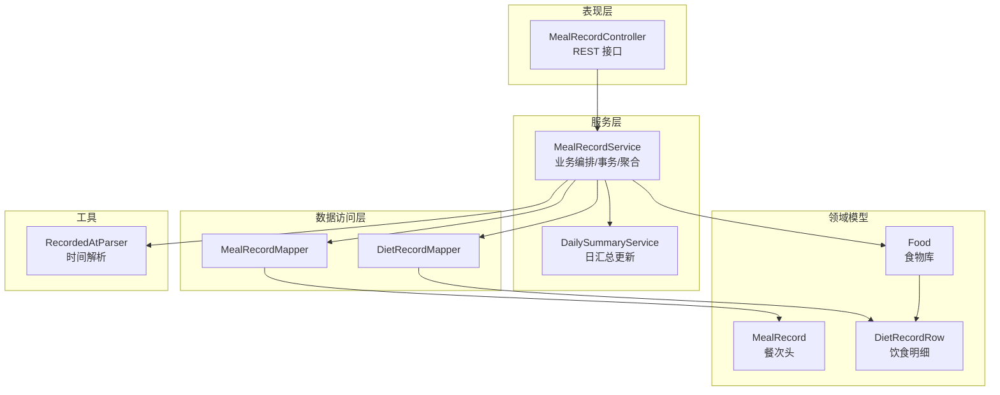
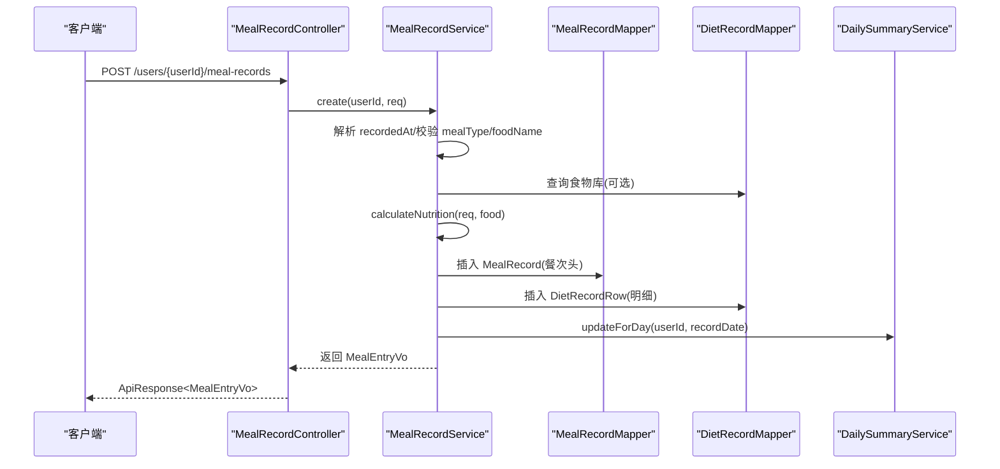
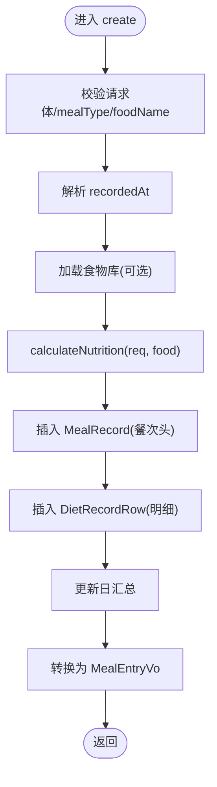
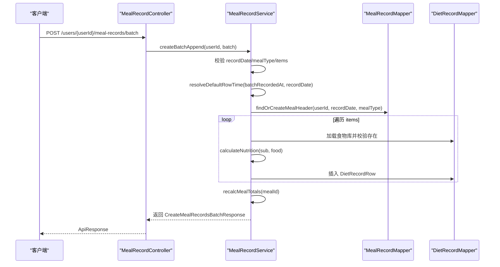
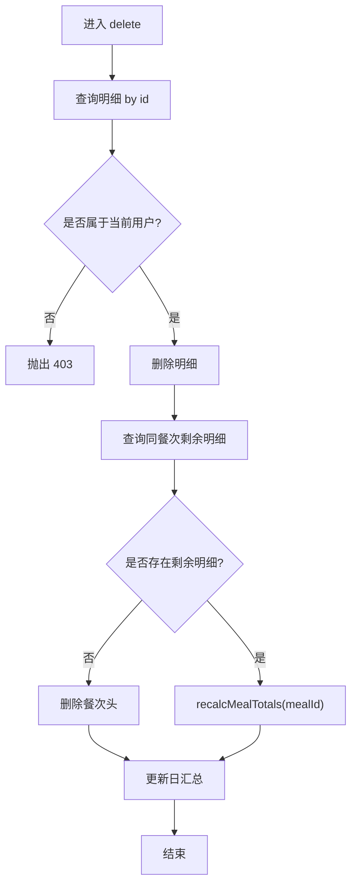
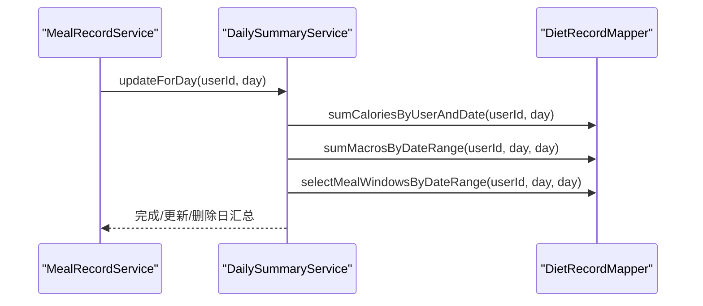
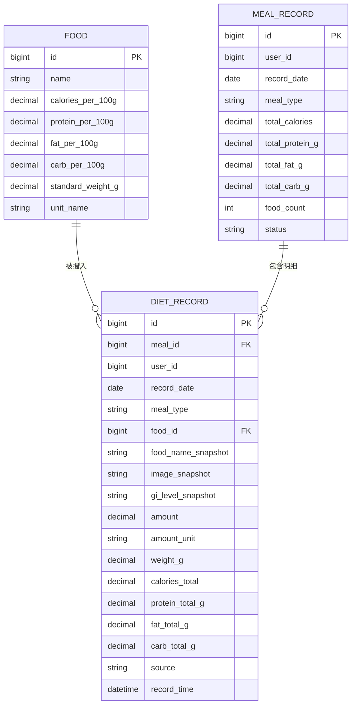
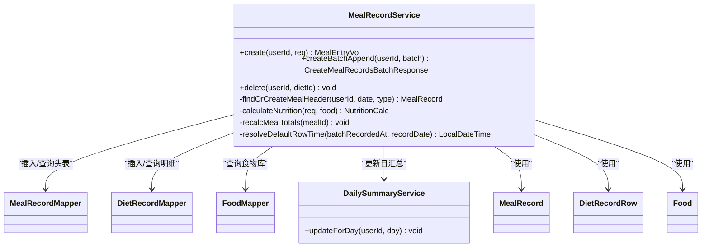

# 饮食记录服务

<cite>
**本文引用的文件**
- [MealRecordService.java](file://backend/src/main/java/com/ypfr/loseweight/service/MealRecordService.java)
- [MealRecord.java](file://backend/src/main/java/com/ypfr/loseweight/domain/MealRecord.java)
- [DietRecordRow.java](file://backend/src/main/java/com/ypfr/loseweight/domain/DietRecordRow.java)
- [MealRecordMapper.java](file://backend/src/main/java/com/ypfr/loseweight/mapper/MealRecordMapper.java)
- [DietRecordMapper.java](file://backend/src/main/java/com/ypfr/loseweight/mapper/DietRecordMapper.java)
- [CreateMealRecordRequest.java](file://backend/src/main/java/com/ypfr/loseweight/web/dto/CreateMealRecordRequest.java)
- [CreateMealRecordsBatchRequest.java](file://backend/src/main/java/com/ypfr/loseweight/web/dto/CreateMealRecordsBatchRequest.java)
- [BatchMealItemRequest.java](file://backend/src/main/java/com/ypfr/loseweight/web/dto/BatchMealItemRequest.java)
- [MealEntryVo.java](file://backend/src/main/java/com/ypfr/loseweight/web/dto/MealEntryVo.java)
- [RecordedAtParser.java](file://backend/src/main/java/com/ypfr/loseweight/util/RecordedAtParser.java)
- [DailySummaryService.java](file://backend/src/main/java/com/ypfr/loseweight/service/DailySummaryService.java)
- [MealRecordController.java](file://backend/src/main/java/com/ypfr/loseweight/web/MealRecordController.java)
- [Food.java](file://backend/src/main/java/com/ypfr/loseweight/domain/Food.java)
- [StatDateCalories.java](file://backend/src/main/java/com/ypfr/loseweight/mapper/row/StatDateCalories.java)
- [StatDateMacros.java](file://backend/src/main/java/com/ypfr/loseweight/mapper/row/StatDateMacros.java)
- [StatDateMealWindow.java](file://backend/src/main/java/com/ypfr/loseweight/mapper/row/StatDateMealWindow.java)
</cite>

## 目录
1. [简介](#简介)
2. [项目结构](#项目结构)
3. [核心组件](#核心组件)
4. [架构总览](#架构总览)
5. [详细组件分析](#详细组件分析)
6. [依赖分析](#依赖分析)
7. [性能考虑](#性能考虑)
8. [故障排查指南](#故障排查指南)
9. [结论](#结论)
10. [附录](#附录)

## 简介
本技术文档围绕饮食记录服务模块展开，系统性阐述 MealRecordService 的业务逻辑与实现架构，覆盖单餐记录创建、批量记录处理、饮食记录查询、记录状态管理等能力。文档同时详解饮食记录与营养成分的关联关系、记录时间解析机制、记录有效性验证规则，以及服务中的数据聚合逻辑、重复记录检测、记录删除保护机制。最后给出数据模型设计、记录类型分类、营养分析集成、性能优化策略、并发处理方案与数据一致性保障机制。

## 项目结构
后端采用分层架构：Web 控制器负责请求接入与鉴权校验，Service 层承载业务编排与事务控制，Mapper 层对接 MyBatis-Plus 实现数据库访问，Domain 层定义实体模型，DTO/VO 提供接口契约与输出封装，Util 提供通用解析工具。MealRecordService 位于 service 层，协调 MealRecord、DietRecordRow、Food 等实体与 Mapper、DailySummaryService 的协作。

图表来源
- [MealRecordController.java:17-60](file://backend/src/main/java/com/ypfr/loseweight/web/MealRecordController.java#L17-L60)
- [MealRecordService.java:28-48](file://backend/src/main/java/com/ypfr/loseweight/service/MealRecordService.java#L28-L48)
- [DailySummaryService.java:17-34](file://backend/src/main/java/com/ypfr/loseweight/service/DailySummaryService.java#L17-L34)
- [MealRecordMapper.java:1-9](file://backend/src/main/java/com/ypfr/loseweight/mapper/MealRecordMapper.java#L1-L9)
- [DietRecordMapper.java:15-54](file://backend/src/main/java/com/ypfr/loseweight/mapper/DietRecordMapper.java#L15-L54)
- [MealRecord.java:10-124](file://backend/src/main/java/com/ypfr/loseweight/domain/MealRecord.java#L10-L124)
- [DietRecordRow.java:10-195](file://backend/src/main/java/com/ypfr/loseweight/domain/DietRecordRow.java#L10-L195)
- [Food.java:11-212](file://backend/src/main/java/com/ypfr/loseweight/domain/Food.java#L11-L212)
- [RecordedAtParser.java:8-31](file://backend/src/main/java/com/ypfr/loseweight/util/RecordedAtParser.java#L8-L31)

章节来源
- [MealRecordController.java:17-60](file://backend/src/main/java/com/ypfr/loseweight/web/MealRecordController.java#L17-L60)
- [MealRecordService.java:28-48](file://backend/src/main/java/com/ypfr/loseweight/service/MealRecordService.java#L28-L48)

## 核心组件
- MealRecordService：核心业务服务，负责单条/批量创建、删除、汇总重算、时间解析与有效性校验，并触发日汇总更新。
- MealRecord：餐次头表，记录每日每餐的总宏量与总热量、食物数量与状态。
- DietRecordRow：饮食明细表，记录每次摄入的具体食物、份量、单位、快照信息与记录时间。
- Food：食物库，提供标准重量、每百克宏量与热量、单位名称等营养基础数据。
- DailySummaryService：日汇总服务，基于 diet_record/sport_record 计算摄入、运动、目标缺口等指标。
- DTO/VO：CreateMealRecordRequest、CreateMealRecordsBatchRequest、BatchMealItemRequest、MealEntryVo 定义请求与响应契约。
- Util：RecordedAtParser 提供记录时间解析，支持 ISO-8601 与 yyyy-MM-dd HH:mm:ss 两种格式。

章节来源
- [MealRecordService.java:28-48](file://backend/src/main/java/com/ypfr/loseweight/service/MealRecordService.java#L28-L48)
- [MealRecord.java:10-124](file://backend/src/main/java/com/ypfr/loseweight/domain/MealRecord.java#L10-L124)
- [DietRecordRow.java:10-195](file://backend/src/main/java/com/ypfr/loseweight/domain/DietRecordRow.java#L10-L195)
- [Food.java:11-212](file://backend/src/main/java/com/ypfr/loseweight/domain/Food.java#L11-L212)
- [DailySummaryService.java:17-34](file://backend/src/main/java/com/ypfr/loseweight/service/DailySummaryService.java#L17-L34)
- [CreateMealRecordRequest.java:5-98](file://backend/src/main/java/com/ypfr/loseweight/web/dto/CreateMealRecordRequest.java#L5-L98)
- [CreateMealRecordsBatchRequest.java:11-48](file://backend/src/main/java/com/ypfr/loseweight/web/dto/CreateMealRecordsBatchRequest.java#L11-L48)
- [BatchMealItemRequest.java:6-45](file://backend/src/main/java/com/ypfr/loseweight/web/dto/BatchMealItemRequest.java#L6-L45)
- [MealEntryVo.java:6-125](file://backend/src/main/java/com/ypfr/loseweight/web/dto/MealEntryVo.java#L6-L125)
- [RecordedAtParser.java:8-31](file://backend/src/main/java/com/ypfr/loseweight/util/RecordedAtParser.java#L8-L31)

## 架构总览
MealRecordService 在事务边界内协调多个数据操作：根据请求参数解析记录时间、校验输入合法性、按食物库计算宏量与热量、插入餐次头与明细、必要时重算餐次头总计并触发日汇总更新。删除操作遵循“先删明细、后看是否需要删头”的保护机制，确保数据一致性。

图表来源
- [MealRecordController.java:30-37](file://backend/src/main/java/com/ypfr/loseweight/web/MealRecordController.java#L30-L37)
- [MealRecordService.java:50-114](file://backend/src/main/java/com/ypfr/loseweight/service/MealRecordService.java#L50-L114)
- [DailySummaryService.java:41-53](file://backend/src/main/java/com/ypfr/loseweight/service/DailySummaryService.java#L41-L53)

## 详细组件分析

### 单餐记录创建流程
- 输入校验：mealType 限定为 breakfast/lunch/dinner/snack；foodName 非空；recordedAt 必填且格式有效。
- 时间解析：通过 RecordedAtParser 支持 ISO-8601 与 yyyy-MM-dd HH:mm:ss。
- 营养计算：优先使用食物库的每百克宏量与热量，结合份量与单位换算；若单位为 g 或 克，则直接以重量计算；否则按标准重量乘以份数；若无法从食物库推导，则允许直接传入总热量与宏量。
- 写入逻辑：插入 MealRecord（餐次头），设置状态为 submitted；插入 DietRecordRow（明细），写入快照与记录时间；调用 DailySummaryService 更新当日汇总。
- 输出封装：返回 MealEntryVo，包含关键营养与计量信息。

图表来源
- [MealRecordService.java:50-114](file://backend/src/main/java/com/ypfr/loseweight/service/MealRecordService.java#L50-L114)
- [RecordedAtParser.java:15-30](file://backend/src/main/java/com/ypfr/loseweight/util/RecordedAtParser.java#L15-L30)
- [Food.java:22-43](file://backend/src/main/java/com/ypfr/loseweight/domain/Food.java#L22-L43)

章节来源
- [MealRecordService.java:50-114](file://backend/src/main/java/com/ypfr/loseweight/service/MealRecordService.java#L50-L114)
- [RecordedAtParser.java:15-30](file://backend/src/main/java/com/ypfr/loseweight/util/RecordedAtParser.java#L15-L30)
- [CreateMealRecordRequest.java:5-98](file://backend/src/main/java/com/ypfr/loseweight/web/dto/CreateMealRecordRequest.java#L5-L98)

### 批量记录处理流程
- 请求约束：recordDate 必填且格式为 yyyy-MM-dd；mealType 限定；items 非空且数量不超过 100；每项 foodId 必填且对应的食物存在。
- 默认时间策略：若行级 recordedAt 缺省，则使用批次级 recordedAt；若仍缺省，则根据 recordDate 推断默认时间（当天取当前时间，否则固定中午）。
- 复用/创建头表：按 userId、recordDate、mealType 查找或创建 MealRecord；随后逐条计算营养并插入明细。
- 性能与一致性：批量插入后统一重算餐次头总计，再触发日汇总更新。

图表来源
- [MealRecordController.java:42-49](file://backend/src/main/java/com/ypfr/loseweight/web/MealRecordController.java#L42-L49)
- [MealRecordService.java:119-219](file://backend/src/main/java/com/ypfr/loseweight/service/MealRecordService.java#L119-L219)
- [CreateMealRecordsBatchRequest.java:11-48](file://backend/src/main/java/com/ypfr/loseweight/web/dto/CreateMealRecordsBatchRequest.java#L11-L48)
- [BatchMealItemRequest.java:6-45](file://backend/src/main/java/com/ypfr/loseweight/web/dto/BatchMealItemRequest.java#L6-L45)

章节来源
- [MealRecordService.java:119-219](file://backend/src/main/java/com/ypfr/loseweight/service/MealRecordService.java#L119-L219)
- [CreateMealRecordsBatchRequest.java:11-48](file://backend/src/main/java/com/ypfr/loseweight/web/dto/CreateMealRecordsBatchRequest.java#L11-L48)
- [BatchMealItemRequest.java:6-45](file://backend/src/main/java/com/ypfr/loseweight/web/dto/BatchMealItemRequest.java#L6-L45)

### 记录删除保护机制
- 删除前校验：确认记录存在且属于当前用户。
- 删除顺序：先删除明细，再查询该餐次剩余明细；若为空则删除头表，否则重算头表总计并更新。
- 日汇总：删除后对当日进行汇总更新，保持日汇总与明细一致。

图表来源
- [MealRecordService.java:346-370](file://backend/src/main/java/com/ypfr/loseweight/service/MealRecordService.java#L346-L370)
- [DietRecordRow.java:16-34](file://backend/src/main/java/com/ypfr/loseweight/domain/DietRecordRow.java#L16-L34)

章节来源
- [MealRecordService.java:346-370](file://backend/src/main/java/com/ypfr/loseweight/service/MealRecordService.java#L346-L370)

### 数据聚合与日汇总联动
- 日汇总更新：DailySummaryService 基于 diet_record/sport_record 计算当日摄入、运动、预算缺口、实际缺口、宏量总计与进食窗口等指标，并维护健康饮食标记与状态。
- 触发时机：创建/删除/批量追加后均可能触发 updateForDay(userId, day)，即使捕获异常也不影响主业务流程。
- 统计接口：DietRecordMapper 提供按日求和与区间聚合的 SQL 方法，支撑日汇总与报表统计。

图表来源
- [DailySummaryService.java:41-154](file://backend/src/main/java/com/ypfr/loseweight/service/DailySummaryService.java#L41-L154)
- [DietRecordMapper.java:18-53](file://backend/src/main/java/com/ypfr/loseweight/mapper/DietRecordMapper.java#L18-L53)

章节来源
- [DailySummaryService.java:41-154](file://backend/src/main/java/com/ypfr/loseweight/service/DailySummaryService.java#L41-L154)
- [DietRecordMapper.java:18-53](file://backend/src/main/java/com/ypfr/loseweight/mapper/DietRecordMapper.java#L18-L53)

### 数据模型设计与关联关系
- MealRecord（餐次头）：按 userId+recordDate+mealType 唯一定位，记录当日该餐次的总热量与三大宏量、食物数量与状态。
- DietRecordRow（饮食明细）：记录每次摄入的快照信息（食物名、图片、GI）、份量、单位、总热量与宏量、记录时间与来源。
- Food（食物库）：提供标准重量、每百克宏量与热量、单位名称等，用于明细侧的营养计算与快照存储。
- 关联关系：DietRecordRow 通过 mealId 关联 MealRecord；通过 foodId 关联 Food；通过 userId、recordDate、mealType 与时间维度形成查询索引。

图表来源
- [MealRecord.java:12-124](file://backend/src/main/java/com/ypfr/loseweight/domain/MealRecord.java#L12-L124)
- [DietRecordRow.java:11-195](file://backend/src/main/java/com/ypfr/loseweight/domain/DietRecordRow.java#L11-L195)
- [Food.java:11-212](file://backend/src/main/java/com/ypfr/loseweight/domain/Food.java#L11-L212)

章节来源
- [MealRecord.java:12-124](file://backend/src/main/java/com/ypfr/loseweight/domain/MealRecord.java#L12-L124)
- [DietRecordRow.java:11-195](file://backend/src/main/java/com/ypfr/loseweight/domain/DietRecordRow.java#L11-L195)
- [Food.java:11-212](file://backend/src/main/java/com/ypfr/loseweight/domain/Food.java#L11-L212)

### 记录类型分类与状态管理
- 记录类型：限定为 breakfast、lunch、dinner、snack 四类，确保每餐次独立统计与展示。
- 状态管理：餐次头创建时状态设为 submitted，便于后续统计与审计。

章节来源
- [MealRecordService.java:31-32](file://backend/src/main/java/com/ypfr/loseweight/service/MealRecordService.java#L31-L32)
- [MealRecord.java:24-27](file://backend/src/main/java/com/ypfr/loseweight/domain/MealRecord.java#L24-L27)

### 营养分析集成与计算规则
- 计算入口：calculateNutrition(req, food) 统一处理宏量与热量计算。
- 计算优先级：
  - 若单位为 g 或 克：直接以重量 g 计算；
  - 否则优先使用食物的标准重量乘以份数；
  - 若无法从食物库推导，则使用每单位热量与份数相乘；
  - 最终兜底：若仍不可得，允许直接传入总热量与宏量。
- 结果精度：所有数值保留两位小数，四舍五入。

章节来源
- [MealRecordService.java:262-335](file://backend/src/main/java/com/ypfr/loseweight/service/MealRecordService.java#L262-L335)
- [Food.java:22-43](file://backend/src/main/java/com/ypfr/loseweight/domain/Food.java#L22-L43)

### 记录时间解析机制
- 支持格式：ISO-8601 本地时间与 yyyy-MM-dd HH:mm:ss；
- 缺省策略：若批次级 recordedAt 缺省，按当天取当前时间，否则固定为当天中午 12:00:00；
- 校验约束：单条明细的 recordedAt 必须落在 recordDate 当日。

章节来源
- [RecordedAtParser.java:15-30](file://backend/src/main/java/com/ypfr/loseweight/util/RecordedAtParser.java#L15-L30)
- [MealRecordService.java:221-234](file://backend/src/main/java/com/ypfr/loseweight/service/MealRecordService.java#L221-L234)
- [MealRecordService.java:160-166](file://backend/src/main/java/com/ypfr/loseweight/service/MealRecordService.java#L160-L166)

### 重复记录检测
- 服务层未实现显式的“完全重复”检测（例如相同食物、相同份量、相同时间）。若需避免重复，建议在前端或上层业务增加去重策略或引入唯一约束（如在数据库层面增加复合唯一索引）后再由服务层抛出冲突异常。

章节来源
- [MealRecordService.java:151-207](file://backend/src/main/java/com/ypfr/loseweight/service/MealRecordService.java#L151-L207)

### 记录查询与排序
- 按用户与日期查询当日全部明细，按记录时间升序排列，便于时间线展示与统计。

章节来源
- [MealRecordService.java:406-412](file://backend/src/main/java/com/ypfr/loseweight/service/MealRecordService.java#L406-L412)

## 依赖分析
- 组件耦合：
  - MealRecordService 依赖 MealRecordMapper、DietRecordMapper、FoodMapper、DailySummaryService；
  - 与 RecordedAtParser 强耦合于时间解析；
  - 与 DTO/VO 强耦合于请求与响应契约。
- 外部依赖：
  - MyBatis-Plus 提供 ORM 能力；
  - Spring Transactional 提供事务语义；
  - Spring MVC 提供 REST 接口。

图表来源
- [MealRecordService.java:28-48](file://backend/src/main/java/com/ypfr/loseweight/service/MealRecordService.java#L28-L48)
- [DailySummaryService.java:17-34](file://backend/src/main/java/com/ypfr/loseweight/service/DailySummaryService.java#L17-L34)
- [MealRecordMapper.java:1-9](file://backend/src/main/java/com/ypfr/loseweight/mapper/MealRecordMapper.java#L1-L9)
- [DietRecordMapper.java:15-54](file://backend/src/main/java/com/ypfr/loseweight/mapper/DietRecordMapper.java#L15-L54)
- [MealRecord.java:12-124](file://backend/src/main/java/com/ypfr/loseweight/domain/MealRecord.java#L12-L124)
- [DietRecordRow.java:11-195](file://backend/src/main/java/com/ypfr/loseweight/domain/DietRecordRow.java#L11-L195)
- [Food.java:11-212](file://backend/src/main/java/com/ypfr/loseweight/domain/Food.java#L11-L212)

章节来源
- [MealRecordService.java:28-48](file://backend/src/main/java/com/ypfr/loseweight/service/MealRecordService.java#L28-L48)
- [DailySummaryService.java:17-34](file://backend/src/main/java/com/ypfr/loseweight/service/DailySummaryService.java#L17-L34)

## 性能考虑
- 批量写入：createBatchAppend 限制单次最多 100 条，减少事务持有时间与数据库压力。
- 事务范围：单条创建与批量追加均在事务中执行，确保一致性；删除后重算与日汇总更新在事务外异步化，降低阻塞。
- 聚合计数：recalcMealTotals 对明细列表做一次遍历累加，复杂度 O(n)，n 为该餐次明细数；建议在高频场景下对头表字段建立合适索引以加速查询。
- 日汇总：DailySummaryService 基于 SQL 聚合，避免应用层大对象扫描；异常吞吐设计确保主业务不受影响。
- 并发处理：建议在数据库层面增加唯一约束（如按用户+日期+餐次+记录时间+食物组合）并配合幂等键，防止重复提交导致的重复明细；服务层可引入分布式锁或乐观锁策略以进一步降低并发风险。

## 故障排查指南
- 常见错误与定位：
  - 请求体为空：抛出 400，检查请求体与 Content-Type。
  - mealType 非法：仅允许 breakfast/lunch/dinner/snack。
  - recordedAt 缺失或格式不正确：参考 RecordedAtParser 的格式要求。
  - 食物不存在：批量模式下每项 foodId 必须存在。
  - 热量无效：calculateNutrition 计算结果必须大于零。
  - 无权删除：删除时需校验用户归属。
- 日汇总异常：DailySummaryService 在 try/catch 中吞异常，不影响主流程；若发现日汇总缺失或延迟，检查该方法调用链与数据库写入情况。

章节来源
- [MealRecordService.java:50-114](file://backend/src/main/java/com/ypfr/loseweight/service/MealRecordService.java#L50-L114)
- [MealRecordService.java:119-219](file://backend/src/main/java/com/ypfr/loseweight/service/MealRecordService.java#L119-L219)
- [MealRecordService.java:346-370](file://backend/src/main/java/com/ypfr/loseweight/service/MealRecordService.java#L346-L370)
- [RecordedAtParser.java:15-30](file://backend/src/main/java/com/ypfr/loseweight/util/RecordedAtParser.java#L15-L30)
- [DailySummaryService.java:41-53](file://backend/src/main/java/com/ypfr/loseweight/service/DailySummaryService.java#L41-L53)

## 结论
MealRecordService 通过清晰的职责划分与严格的输入校验，实现了从单条到批量的饮食记录创建、删除保护与日汇总联动。其营养计算与时间解析机制兼顾灵活性与准确性，适合在多终端场景下稳定运行。为进一步提升可靠性，建议在数据库层面完善唯一约束与索引，结合幂等与锁策略增强并发安全性，并持续监控日汇总延迟与异常。

## 附录
- 接口一览（路径与方法）
  - POST /api/v1/users/{userId}/meal-records：创建单条饮食记录
  - POST /api/v1/users/{userId}/meal-records/batch：批量追加同一餐次明细
  - DELETE /api/v1/users/{userId}/meal-records/{id}：删除指定明细
- 关键 DTO/VO 字段说明
  - CreateMealRecordRequest：mealType、foodName、calories、amountValue、amountUnit、recordedAt、foodLibraryId、proteinG、fatG、carbsG
  - CreateMealRecordsBatchRequest：recordDate、mealType、recordedAt、items
  - BatchMealItemRequest：foodId、amountValue、amountUnit、recordedAt
  - MealEntryVo：id、userId、mealType、foodName、calories、proteinG、fatG、carbsG、amountValue、amountUnit、recordedAt、foodLibraryId、createdAt

章节来源
- [MealRecordController.java:17-60](file://backend/src/main/java/com/ypfr/loseweight/web/MealRecordController.java#L17-L60)
- [CreateMealRecordRequest.java:5-98](file://backend/src/main/java/com/ypfr/loseweight/web/dto/CreateMealRecordRequest.java#L5-L98)
- [CreateMealRecordsBatchRequest.java:11-48](file://backend/src/main/java/com/ypfr/loseweight/web/dto/CreateMealRecordsBatchRequest.java#L11-L48)
- [BatchMealItemRequest.java:6-45](file://backend/src/main/java/com/ypfr/loseweight/web/dto/BatchMealItemRequest.java#L6-L45)
- [MealEntryVo.java:6-125](file://backend/src/main/java/com/ypfr/loseweight/web/dto/MealEntryVo.java#L6-L125)