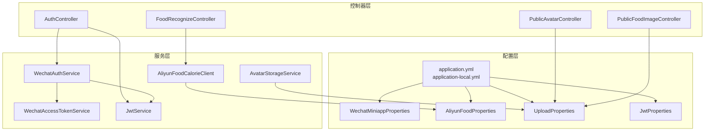
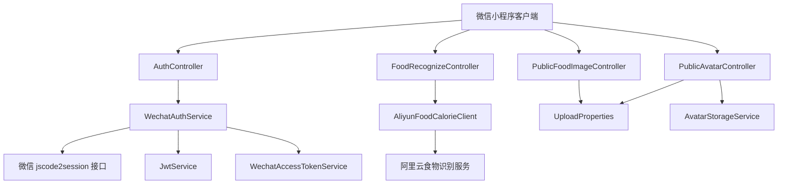
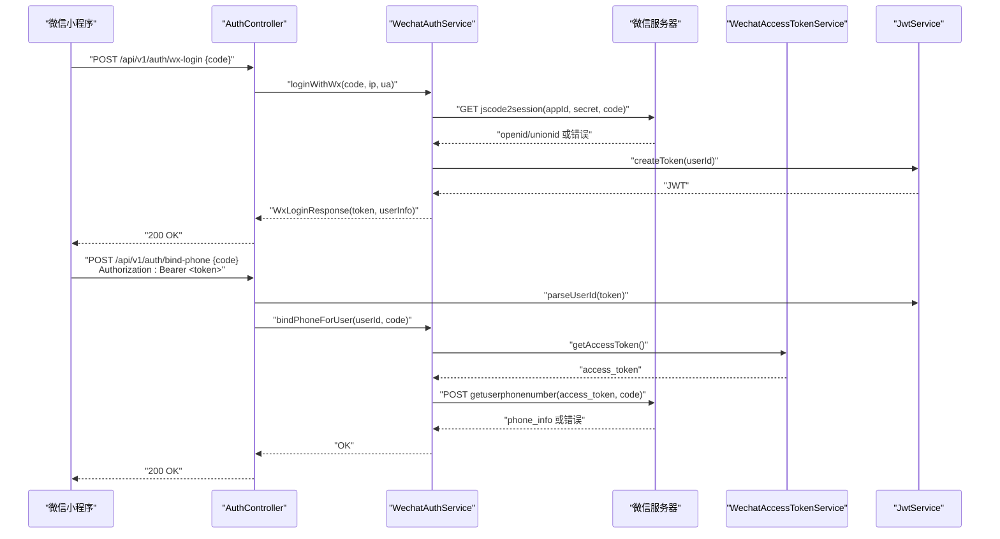
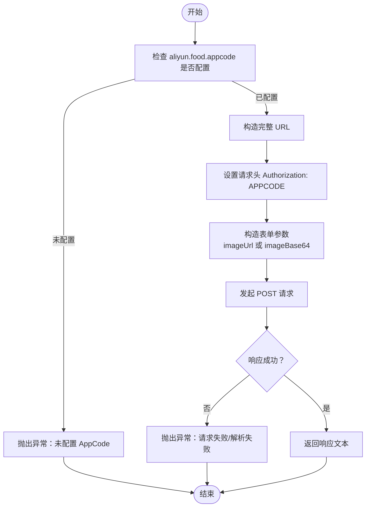
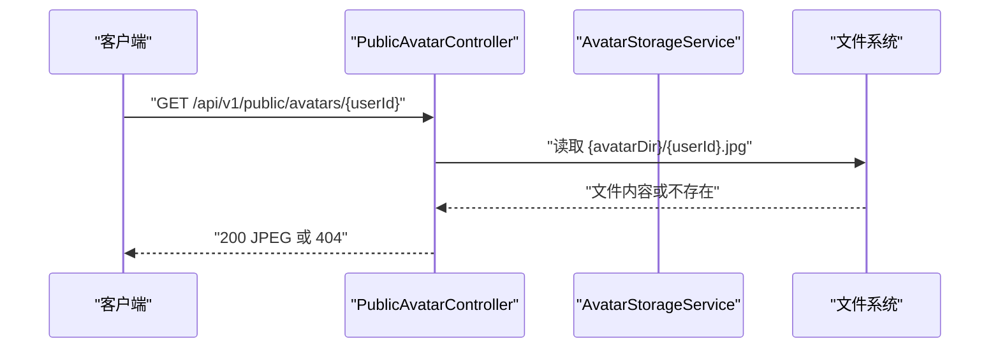
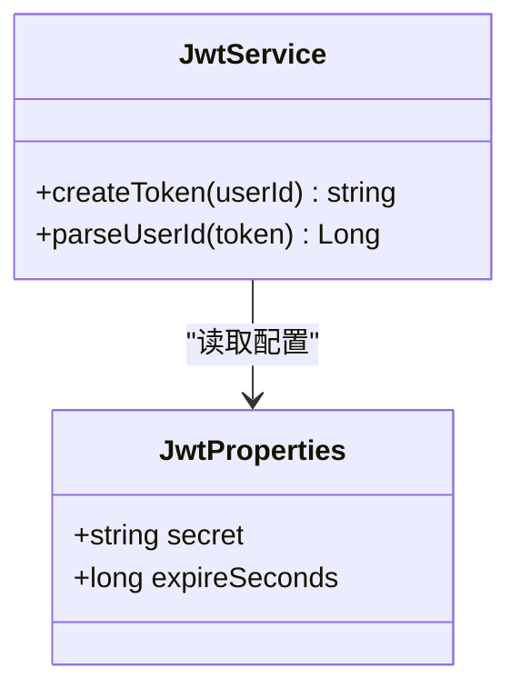
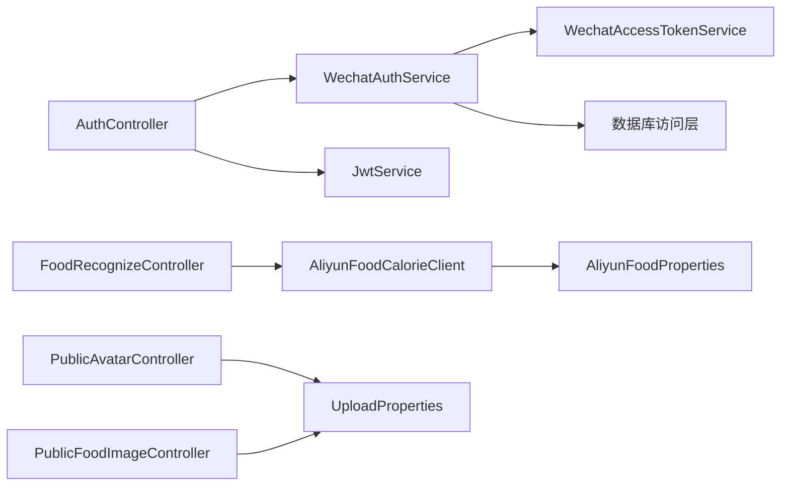

# 外部集成

<cite>
**本文引用的文件**
- [application.yml](file://backend/src/main/resources/application.yml)
- [application-local.yml](file://backend/src/main/resources/application-local.yml)
- [WechatMiniappProperties.java](file://backend/src/main/java/com/ypfr/loseweight/config/WechatMiniappProperties.java)
- [AliyunFoodProperties.java](file://backend/src/main/java/com/ypfr/loseweight/config/AliyunFoodProperties.java)
- [UploadProperties.java](file://backend/src/main/java/com/ypfr/loseweight/config/UploadProperties.java)
- [JwtProperties.java](file://backend/src/main/java/com/ypfr/loseweight/config/JwtProperties.java)
- [WechatAuthService.java](file://backend/src/main/java/com/ypfr/loseweight/service/WechatAuthService.java)
- [WechatAccessTokenService.java](file://backend/src/main/java/com/ypfr/loseweight/service/WechatAccessTokenService.java)
- [AliyunFoodCalorieClient.java](file://backend/src/main/java/com/ypfr/loseweight/service/AliyunFoodCalorieClient.java)
- [AvatarStorageService.java](file://backend/src/main/java/com/ypfr/loseweight/service/AvatarStorageService.java)
- [JwtService.java](file://backend/src/main/java/com/ypfr/loseweight/service/JwtService.java)
- [AuthController.java](file://backend/src/main/java/com/ypfr/loseweight/web/AuthController.java)
- [PublicAvatarController.java](file://backend/src/main/java/com/ypfr/loseweight/web/PublicAvatarController.java)
- [PublicFoodImageController.java](file://backend/src/main/java/com/ypfr/loseweight/web/PublicFoodImageController.java)
- [FoodRecognizeController.java](file://backend/src/main/java/com/ypfr/loseweight/web/FoodRecognizeController.java)
</cite>

## 目录
1. [简介](#简介)
2. [项目结构](#项目结构)
3. [核心组件](#核心组件)
4. [架构总览](#架构总览)
5. [详细组件分析](#详细组件分析)
6. [依赖分析](#依赖分析)
7. [性能考虑](#性能考虑)
8. [故障排除指南](#故障排除指南)
9. [结论](#结论)
10. [附录](#附录)

## 简介
本文件面向需要对接后端系统的外部集成方，系统性说明以下外部依赖的集成方式与最佳实践：
- 微信小程序生态集成：登录授权、手机号绑定、模板消息（概念性说明）
- 阿里云API集成：食物识别服务（卡路里查询）
- 文件存储配置：头像上传、食物图片管理
- 第三方支付集成：微信支付流程（概念性说明）

内容涵盖配置方法、API调用方式、错误处理策略，并提供安全与性能优化建议及故障排除指引。

## 项目结构
后端采用 Spring Boot 架构，外部集成主要涉及如下模块：
- 配置层：读取 application.yml 与 application-local.yml，暴露配置对象（如微信小程序、阿里云、上传目录、JWT）
- 控制器层：对外提供认证、头像与食物图片访问、食物识别等接口
- 服务层：封装微信登录、微信全局 access_token、阿里云食物识别、头像存储等业务逻辑
- 安全层：基于 HS256 的 JWT 令牌签发与校验

图表来源
- [application.yml:1-54](file://backend/src/main/resources/application.yml#L1-L54)
- [application-local.yml:1-20](file://backend/src/main/resources/application-local.yml#L1-L20)
- [WechatMiniappProperties.java:1-28](file://backend/src/main/java/com/ypfr/loseweight/config/WechatMiniappProperties.java#L1-L28)
- [AliyunFoodProperties.java:1-44](file://backend/src/main/java/com/ypfr/loseweight/config/AliyunFoodProperties.java#L1-L44)
- [UploadProperties.java:1-30](file://backend/src/main/java/com/ypfr/loseweight/config/UploadProperties.java#L1-L30)
- [JwtProperties.java:1-29](file://backend/src/main/java/com/ypfr/loseweight/config/JwtProperties.java#L1-L29)
- [AuthController.java:1-55](file://backend/src/main/java/com/ypfr/loseweight/web/AuthController.java#L1-L55)
- [PublicAvatarController.java:1-36](file://backend/src/main/java/com/ypfr/loseweight/web/PublicAvatarController.java#L1-L36)
- [PublicFoodImageController.java:1-43](file://backend/src/main/java/com/ypfr/loseweight/web/PublicFoodImageController.java#L1-L43)
- [FoodRecognizeController.java:1-28](file://backend/src/main/java/com/ypfr/loseweight/web/FoodRecognizeController.java#L1-L28)
- [WechatAuthService.java:1-233](file://backend/src/main/java/com/ypfr/loseweight/service/WechatAuthService.java#L1-L233)
- [WechatAccessTokenService.java:1-82](file://backend/src/main/java/com/ypfr/loseweight/service/WechatAccessTokenService.java#L1-L82)
- [AliyunFoodCalorieClient.java:1-50](file://backend/src/main/java/com/ypfr/loseweight/service/AliyunFoodCalorieClient.java#L1-L50)
- [AvatarStorageService.java:1-56](file://backend/src/main/java/com/ypfr/loseweight/service/AvatarStorageService.java#L1-L56)
- [JwtService.java:1-58](file://backend/src/main/java/com/ypfr/loseweight/service/JwtService.java#L1-L58)

章节来源
- [application.yml:1-54](file://backend/src/main/resources/application.yml#L1-L54)
- [application-local.yml:1-20](file://backend/src/main/resources/application-local.yml#L1-L20)

## 核心组件
- 微信小程序配置与登录授权
  - 配置项：微信小程序 AppId、AppSecret
  - 登录流程：前端以 wx.login 获取 code，后端调用微信 jscode2session 换取 openid，创建/关联用户并签发 JWT
  - 手机号绑定：使用微信全局 access_token 与 getPhoneNumber 返回的 code 换取手机号
- 阿里云食物识别
  - 配置项：阿里云 Host、Path、AppCode
  - 调用方式：向阿里云服务发送表单请求，支持传入图片 URL 或 Base64
- 文件存储与访问
  - 头像上传：接收 Base64，解码后写入指定目录，扩展名固定为 .jpg
  - 公共头像访问：按用户 ID 返回 JPEG 图片
  - 食物图片访问：限制文件名格式，仅允许 default.png 与 {foodId}.png
- JWT 安全
  - HS256 密钥长度要求 ≥ 32 字节，过期时间可配置

章节来源
- [WechatMiniappProperties.java:1-28](file://backend/src/main/java/com/ypfr/loseweight/config/WechatMiniappProperties.java#L1-L28)
- [WechatAuthService.java:1-233](file://backend/src/main/java/com/ypfr/loseweight/service/WechatAuthService.java#L1-L233)
- [WechatAccessTokenService.java:1-82](file://backend/src/main/java/com/ypfr/loseweight/service/WechatAccessTokenService.java#L1-L82)
- [AliyunFoodProperties.java:1-44](file://backend/src/main/java/com/ypfr/loseweight/config/AliyunFoodProperties.java#L1-L44)
- [AliyunFoodCalorieClient.java:1-50](file://backend/src/main/java/com/ypfr/loseweight/service/AliyunFoodCalorieClient.java#L1-L50)
- [UploadProperties.java:1-30](file://backend/src/main/java/com/ypfr/loseweight/config/UploadProperties.java#L1-L30)
- [AvatarStorageService.java:1-56](file://backend/src/main/java/com/ypfr/loseweight/service/AvatarStorageService.java#L1-L56)
- [PublicAvatarController.java:1-36](file://backend/src/main/java/com/ypfr/loseweight/web/PublicAvatarController.java#L1-L36)
- [PublicFoodImageController.java:1-43](file://backend/src/main/java/com/ypfr/loseweight/web/PublicFoodImageController.java#L1-L43)
- [JwtProperties.java:1-29](file://backend/src/main/java/com/ypfr/loseweight/config/JwtProperties.java#L1-L29)
- [JwtService.java:1-58](file://backend/src/main/java/com/ypfr/loseweight/service/JwtService.java#L1-L58)

## 架构总览
下图展示外部系统集成的关键交互路径：微信小程序登录授权、阿里云食物识别、文件存储访问与 JWT 安全控制。

图表来源
- [AuthController.java:1-55](file://backend/src/main/java/com/ypfr/loseweight/web/AuthController.java#L1-L55)
- [WechatAuthService.java:1-233](file://backend/src/main/java/com/ypfr/loseweight/service/WechatAuthService.java#L1-L233)
- [WechatAccessTokenService.java:1-82](file://backend/src/main/java/com/ypfr/loseweight/service/WechatAccessTokenService.java#L1-L82)
- [JwtService.java:1-58](file://backend/src/main/java/com/ypfr/loseweight/service/JwtService.java#L1-L58)
- [FoodRecognizeController.java:1-28](file://backend/src/main/java/com/ypfr/loseweight/web/FoodRecognizeController.java#L1-L28)
- [AliyunFoodCalorieClient.java:1-50](file://backend/src/main/java/com/ypfr/loseweight/service/AliyunFoodCalorieClient.java#L1-L50)
- [PublicAvatarController.java:1-36](file://backend/src/main/java/com/ypfr/loseweight/web/PublicAvatarController.java#L1-L36)
- [PublicFoodImageController.java:1-43](file://backend/src/main/java/com/ypfr/loseweight/web/PublicFoodImageController.java#L1-L43)
- [UploadProperties.java:1-30](file://backend/src/main/java/com/ypfr/loseweight/config/UploadProperties.java#L1-L30)

## 详细组件分析

### 微信小程序登录授权
- 配置要点
  - 在 application.yml 中配置 wechat.miniapp.app-id 与 app-secret
  - 在 application-local.yml 中覆盖真实密钥
- 登录流程
  - 前端调用 wx.login 获取 code
  - 后端调用微信 jscode2session，换取 openid（必要时 unionid）
  - 创建/更新用户记录，生成 JWT 并返回给前端
- 手机号绑定
  - 使用微信全局 access_token 与 getPhoneNumber 返回的 code 换取手机号
  - 更新用户绑定状态与信息
- 安全与日志
  - 对异常进行统一捕获与登录日志记录
  - 对错误信息进行截断，避免敏感信息泄露

图表来源
- [AuthController.java:1-55](file://backend/src/main/java/com/ypfr/loseweight/web/AuthController.java#L1-L55)
- [WechatAuthService.java:1-233](file://backend/src/main/java/com/ypfr/loseweight/service/WechatAuthService.java#L1-L233)
- [WechatAccessTokenService.java:1-82](file://backend/src/main/java/com/ypfr/loseweight/service/WechatAccessTokenService.java#L1-L82)
- [JwtService.java:1-58](file://backend/src/main/java/com/ypfr/loseweight/service/JwtService.java#L1-L58)

章节来源
- [WechatMiniappProperties.java:1-28](file://backend/src/main/java/com/ypfr/loseweight/config/WechatMiniappProperties.java#L1-L28)
- [WechatAuthService.java:1-233](file://backend/src/main/java/com/ypfr/loseweight/service/WechatAuthService.java#L1-L233)
- [WechatAccessTokenService.java:1-82](file://backend/src/main/java/com/ypfr/loseweight/service/WechatAccessTokenService.java#L1-L82)
- [AuthController.java:1-55](file://backend/src/main/java/com/ypfr/loseweight/web/AuthController.java#L1-L55)

### 阿里云食物识别服务
- 配置要点
  - 在 application.yml 中配置 aliyun.food.host、path、appcode
  - 在 application-local.yml 中填写真实 AppCode
- 调用方式
  - 支持传入图片 URL 或 Base64
  - 请求头设置 Authorization: APPCODE <appcode>
  - 返回原始字符串（JSON 文本）
- 错误处理
  - 未配置 AppCode 时抛出异常
  - 对网络异常与解析异常进行统一处理

图表来源
- [AliyunFoodCalorieClient.java:1-50](file://backend/src/main/java/com/ypfr/loseweight/service/AliyunFoodCalorieClient.java#L1-L50)
- [AliyunFoodProperties.java:1-44](file://backend/src/main/java/com/ypfr/loseweight/config/AliyunFoodProperties.java#L1-L44)

章节来源
- [AliyunFoodProperties.java:1-44](file://backend/src/main/java/com/ypfr/loseweight/config/AliyunFoodProperties.java#L1-L44)
- [AliyunFoodCalorieClient.java:1-50](file://backend/src/main/java/com/ypfr/loseweight/service/AliyunFoodCalorieClient.java#L1-L50)

### 文件存储与访问（头像、食物图片）
- 头像上传
  - 接收 Base64（支持 data:URL 前缀），解码后写入 {avatarDir}/{userId}.jpg
  - 限制最大大小（约 2.5MB），路径规范化防止越权
- 公共头像访问
  - GET /api/v1/public/avatars/{userId} 返回 JPEG
  - 不存在或非文件返回 404
- 食物图片访问
  - GET /api/v1/public/food-images/{fileName} 仅允许 default.png 与 {foodId}.png
  - 严格路径限制，防止目录穿越

图表来源
- [PublicAvatarController.java:1-36](file://backend/src/main/java/com/ypfr/loseweight/web/PublicAvatarController.java#L1-L36)
- [AvatarStorageService.java:1-56](file://backend/src/main/java/com/ypfr/loseweight/service/AvatarStorageService.java#L1-L56)
- [UploadProperties.java:1-30](file://backend/src/main/java/com/ypfr/loseweight/config/UploadProperties.java#L1-L30)

章节来源
- [UploadProperties.java:1-30](file://backend/src/main/java/com/ypfr/loseweight/config/UploadProperties.java#L1-L30)
- [AvatarStorageService.java:1-56](file://backend/src/main/java/com/ypfr/loseweight/service/AvatarStorageService.java#L1-L56)
- [PublicAvatarController.java:1-36](file://backend/src/main/java/com/ypfr/loseweight/web/PublicAvatarController.java#L1-L36)
- [PublicFoodImageController.java:1-43](file://backend/src/main/java/com/ypfr/loseweight/web/PublicFoodImageController.java#L1-L43)

### JWT 安全与令牌管理
- 配置要点
  - app.jwt.secret 需 ≥ 32 字节（建议随机串）
  - app.jwt.expire-seconds 可配置过期时间
- 令牌签发与校验
  - HS256 签名，签发时设置 issuedAt 与 expiration
  - 校验失败统一抛出 401 异常
- 使用建议
  - 前端应妥善保存 Bearer Token
  - 后端在受保护接口中解析用户 ID

图表来源
- [JwtProperties.java:1-29](file://backend/src/main/java/com/ypfr/loseweight/config/JwtProperties.java#L1-L29)
- [JwtService.java:1-58](file://backend/src/main/java/com/ypfr/loseweight/service/JwtService.java#L1-L58)

章节来源
- [JwtProperties.java:1-29](file://backend/src/main/java/com/ypfr/loseweight/config/JwtProperties.java#L1-L29)
- [JwtService.java:1-58](file://backend/src/main/java/com/ypfr/loseweight/service/JwtService.java#L1-L58)

### 第三方支付集成（微信支付流程）
- 概念性说明
  - 本项目未直接实现微信支付下单与回调处理
  - 建议在后端新增支付服务层，封装统一下单、订单查询、回调校验与落库
  - 前端通过后端提供的支付接口完成支付流程
- 安全与合规
  - 回调签名验证、金额一致性校验、幂等处理
  - 敏感日志脱敏，避免明文记录密钥与敏感参数
- 性能与可靠性
  - 异步通知与同步结果分离，避免阻塞主流程
  - 重试与超时策略，结合分布式锁保证幂等

[本节为概念性说明，不直接分析具体源码文件]

## 依赖分析
- 组件耦合
  - AuthController 依赖 WechatAuthService 与 JwtService
  - WechatAuthService 依赖 WechatAccessTokenService、JwtService、数据库访问层
  - AliyunFoodCalorieClient 依赖 AliyunFoodProperties
  - PublicAvatarController/ PublicFoodImageController 依赖 UploadProperties
- 外部依赖
  - 微信开放平台 API（jscode2session、getuserphonenumber、cgi-bin/token）
  - 阿里云市场食物识别服务
  - MySQL（用户与登录日志等数据持久化）

图表来源
- [AuthController.java:1-55](file://backend/src/main/java/com/ypfr/loseweight/web/AuthController.java#L1-L55)
- [WechatAuthService.java:1-233](file://backend/src/main/java/com/ypfr/loseweight/service/WechatAuthService.java#L1-L233)
- [WechatAccessTokenService.java:1-82](file://backend/src/main/java/com/ypfr/loseweight/service/WechatAccessTokenService.java#L1-L82)
- [AliyunFoodCalorieClient.java:1-50](file://backend/src/main/java/com/ypfr/loseweight/service/AliyunFoodCalorieClient.java#L1-L50)
- [AliyunFoodProperties.java:1-44](file://backend/src/main/java/com/ypfr/loseweight/config/AliyunFoodProperties.java#L1-L44)
- [PublicAvatarController.java:1-36](file://backend/src/main/java/com/ypfr/loseweight/web/PublicAvatarController.java#L1-L36)
- [PublicFoodImageController.java:1-43](file://backend/src/main/java/com/ypfr/loseweight/web/PublicFoodImageController.java#L1-L43)
- [UploadProperties.java:1-30](file://backend/src/main/java/com/ypfr/loseweight/config/UploadProperties.java#L1-L30)

章节来源
- [AuthController.java:1-55](file://backend/src/main/java/com/ypfr/loseweight/web/AuthController.java#L1-L55)
- [WechatAuthService.java:1-233](file://backend/src/main/java/com/ypfr/loseweight/service/WechatAuthService.java#L1-L233)
- [AliyunFoodCalorieClient.java:1-50](file://backend/src/main/java/com/ypfr/loseweight/service/AliyunFoodCalorieClient.java#L1-L50)
- [PublicAvatarController.java:1-36](file://backend/src/main/java/com/ypfr/loseweight/web/PublicAvatarController.java#L1-L36)
- [PublicFoodImageController.java:1-43](file://backend/src/main/java/com/ypfr/loseweight/web/PublicFoodImageController.java#L1-L43)
- [UploadProperties.java:1-30](file://backend/src/main/java/com/ypfr/loseweight/config/UploadProperties.java#L1-L30)

## 性能考虑
- 连接与超时
  - Spring MVC 配置了较大的表单与吞吐大小，适配图片上传场景
- 缓存与复用
  - 微信全局 access_token 内存缓存，过期前 1 分钟刷新，降低频繁拉取开销
- I/O 与存储
  - 头像写入限制大小，避免大文件占用磁盘与带宽
  - 文件路径规范化与存在性校验，减少异常与安全风险
- 网络调用
  - 阿里云请求使用表单参数与固定头，减少额外序列化成本

[本节提供通用指导，不直接分析具体源码文件]

## 故障排除指南
- 微信登录失败
  - 检查 wechat.miniapp.app-secret 是否正确配置
  - 确认前端 wx.login 的 code 与后端 jscode2session 参数一致
  - 查看登录日志记录，定位错误原因
- 获取手机号失败
  - 确认微信全局 access_token 获取成功且未过期
  - 检查 getPhoneNumber 返回的 code 是否有效
- 阿里云食物识别异常
  - 确认 aliyun.food.appcode 已在本地配置文件中填写
  - 检查请求参数（imageUrl 或 imageBase64）是否符合要求
- 头像上传失败
  - 检查 Base64 格式与大小限制
  - 确认 avatarDir 可写且路径未越权
- 公共图片访问 404
  - 确认文件名格式与路径范围
  - 检查文件是否存在且为常规文件

章节来源
- [WechatAuthService.java:1-233](file://backend/src/main/java/com/ypfr/loseweight/service/WechatAuthService.java#L1-L233)
- [WechatAccessTokenService.java:1-82](file://backend/src/main/java/com/ypfr/loseweight/service/WechatAccessTokenService.java#L1-L82)
- [AliyunFoodCalorieClient.java:1-50](file://backend/src/main/java/com/ypfr/loseweight/service/AliyunFoodCalorieClient.java#L1-L50)
- [AvatarStorageService.java:1-56](file://backend/src/main/java/com/ypfr/loseweight/service/AvatarStorageService.java#L1-L56)
- [PublicAvatarController.java:1-36](file://backend/src/main/java/com/ypfr/loseweight/web/PublicAvatarController.java#L1-L36)
- [PublicFoodImageController.java:1-43](file://backend/src/main/java/com/ypfr/loseweight/web/PublicFoodImageController.java#L1-L43)

## 结论
本项目提供了完善的外部集成基础能力：微信小程序登录授权、阿里云食物识别、文件存储与访问、JWT 安全控制。建议在生产环境中：
- 严格管理密钥与 AppCode，使用环境变量或安全配置中心
- 对外暴露的接口增加限流与风控策略
- 对第三方调用增加可观测性与告警
- 持续完善微信支付与模板消息等能力，满足业务闭环

[本节为总结性内容，不直接分析具体源码文件]

## 附录
- 配置示例位置
  - 微信小程序：在 application.yml 中配置 appId/appSecret；在 application-local.yml 中覆盖真实密钥
  - 阿里云：在 application.yml 中配置 host/path；在 application-local.yml 中填写 appcode
  - 上传目录：在 application.yml 中配置 app.upload.avatar-dir 与 app.upload.food-image-dir
  - JWT：在 application-local.yml 中配置 app.jwt.secret（≥32 字节）与 app.jwt.expire-seconds
- 关键接口路径
  - 登录：POST /api/v1/auth/wx-login
  - 绑定手机：POST /api/v1/auth/bind-phone（需 Bearer Token）
  - 头像访问：GET /api/v1/public/avatars/{userId}
  - 食物图片访问：GET /api/v1/public/food-images/{fileName}

章节来源
- [application.yml:1-54](file://backend/src/main/resources/application.yml#L1-L54)
- [application-local.yml:1-20](file://backend/src/main/resources/application-local.yml#L1-L20)
- [AuthController.java:1-55](file://backend/src/main/java/com/ypfr/loseweight/web/AuthController.java#L1-L55)
- [PublicAvatarController.java:1-36](file://backend/src/main/java/com/ypfr/loseweight/web/PublicAvatarController.java#L1-L36)
- [PublicFoodImageController.java:1-43](file://backend/src/main/java/com/ypfr/loseweight/web/PublicFoodImageController.java#L1-L43)