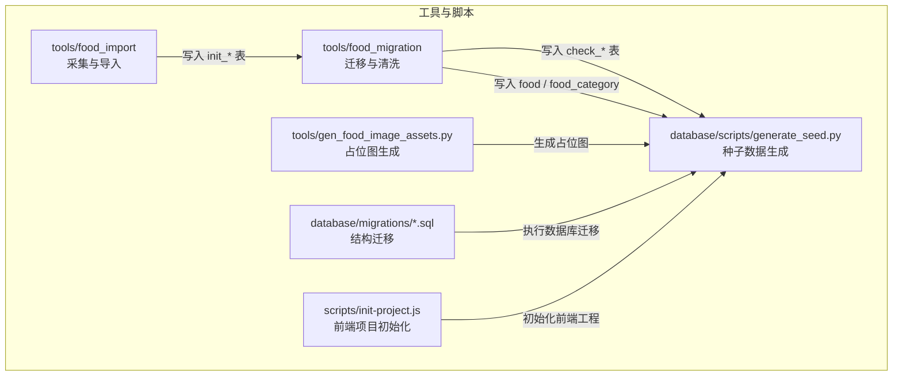
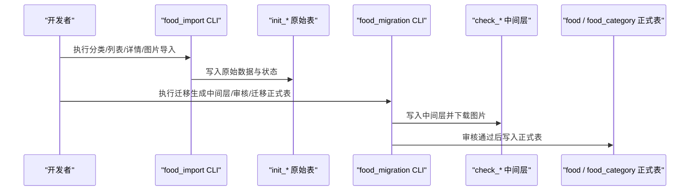
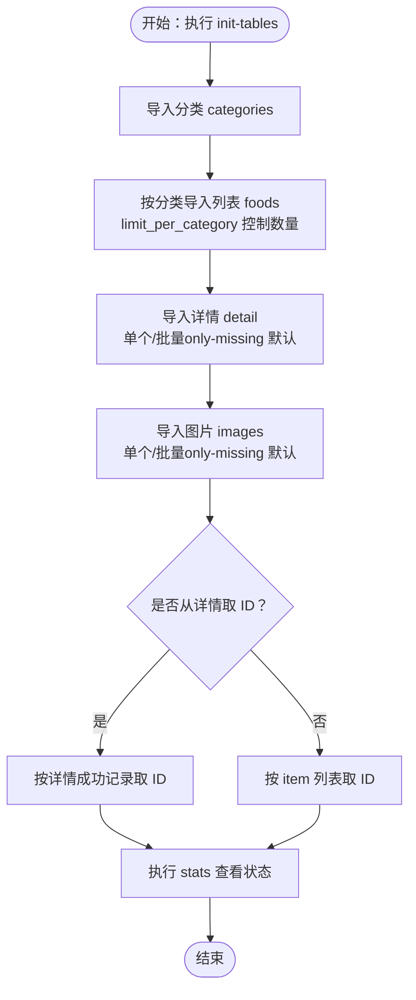
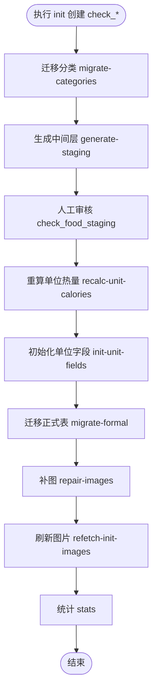
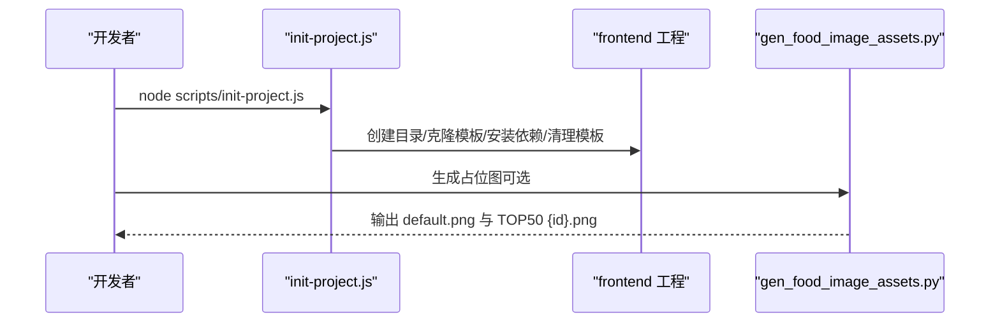
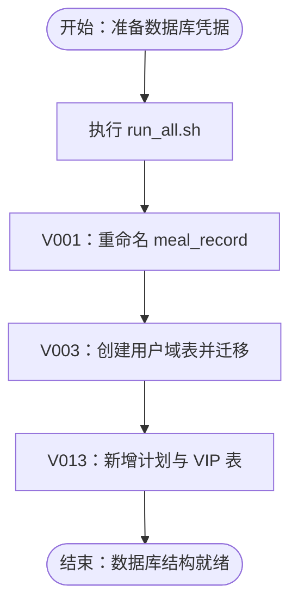
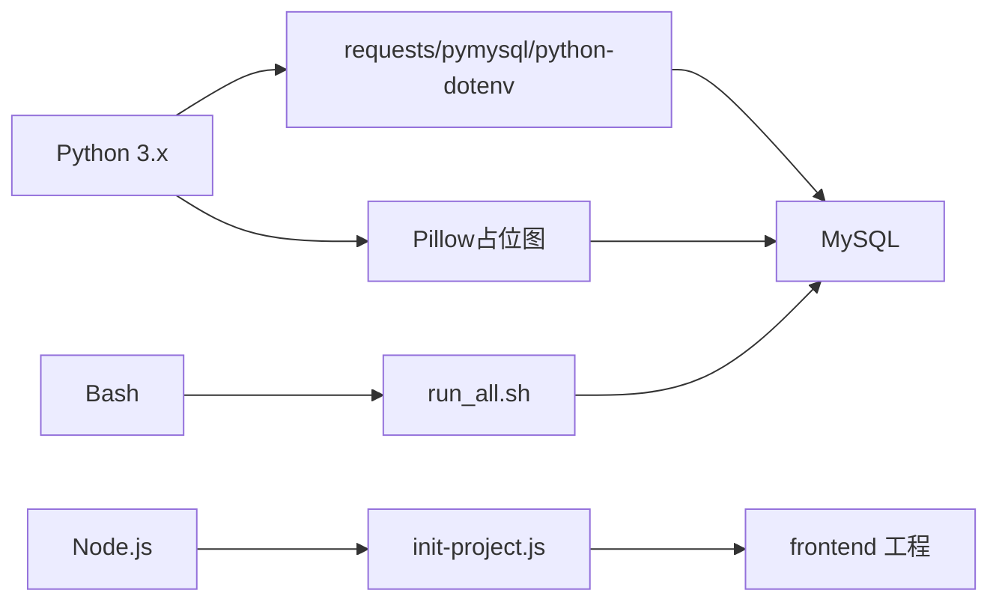

# 工具与脚本

<cite>
**本文引用的文件**
- [tools/food_import/README.md](file://tools/food_import/README.md)
- [tools/food_import/.env.example](file://tools/food_import/.env.example)
- [tools/food_import/requirements.txt](file://tools/food_import/requirements.txt)
- [tools/food_import/run_import.py](file://tools/food_import/run_import.py)
- [tools/food_migration/README.md](file://tools/food_migration/README.md)
- [tools/food_migration/requirements.txt](file://tools/food_migration/requirements.txt)
- [tools/food_migration/run_migration.py](file://tools/food_migration/run_migration.py)
- [tools/gen_food_image_assets.py](file://tools/gen_food_image_assets.py)
- [tools/requirements-food-images.txt](file://tools/requirements-food-images.txt)
- [database/scripts/generate_seed.py](file://database/scripts/generate_seed.py)
- [database/migrations/run_all.sh](file://database/migrations/run_all.sh)
- [database/migrations/V001__rename_meal_record_to_legacy.sql](file://database/migrations/V001__rename_meal_record_to_legacy.sql)
- [database/migrations/V003__create_user_domain_and_migrate.sql](file://database/migrations/V003__create_user_domain_and_migrate.sql)
- [database/migrations/V013__user_plan_and_vip.sql](file://database/migrations/V013__user_plan_and_vip.sql)
- [scripts/init-project.js](file://scripts/init-project.js)
</cite>

## 目录
1. [简介](#简介)
2. [项目结构](#项目结构)
3. [核心组件](#核心组件)
4. [架构总览](#架构总览)
5. [详细组件分析](#详细组件分析)
6. [依赖分析](#依赖分析)
7. [性能考虑](#性能考虑)
8. [故障排除指南](#故障排除指南)
9. [结论](#结论)
10. [附录](#附录)

## 简介
本文件面向开发者与测试工程师，系统性梳理并说明以下工具与脚本的安装、配置、运行方式与最佳实践：
- 数据导入工具：食物数据导入（采集渠道原始数据、批量处理）
- 数据迁移脚本：数据库结构迁移、数据转换（从原始层到正式表）
- 开发辅助工具：项目初始化、资源生成（占位图）
- 部署自动化脚本：环境配置、服务部署（迁移脚本）

目标是帮助你在最小学习成本下，高效完成数据准备、开发验证与上线前的准备工作。

## 项目结构
围绕“工具与脚本”的相关目录与文件如下：
- tools/food_import：采集渠道原始数据，写入 init_ 前缀表
- tools/food_migration：将 init_* 迁移至 check_* 中间层，再写入正式表 food 与 food_category
- tools：通用资源生成（如食物占位图）
- database/scripts：生成种子数据 SQL
- database/migrations：数据库版本迁移脚本
- scripts：前端项目初始化脚本
- docs：迁移与字段映射的记忆文档（作为迁移规则依据）

**图表来源**
- [tools/food_import/run_import.py:26-141](file://tools/food_import/run_import.py#L26-L141)
- [tools/food_migration/run_migration.py:36-199](file://tools/food_migration/run_migration.py#L36-L199)
- [tools/gen_food_image_assets.py:116-158](file://tools/gen_food_image_assets.py#L116-L158)
- [database/scripts/generate_seed.py:237-315](file://database/scripts/generate_seed.py#L237-L315)
- [database/migrations/run_all.sh:1-26](file://database/migrations/run_all.sh#L1-L26)
- [scripts/init-project.js:46-122](file://scripts/init-project.js#L46-L122)

**章节来源**
- [tools/food_import/README.md:1-104](file://tools/food_import/README.md#L1-L104)
- [tools/food_migration/README.md:1-198](file://tools/food_migration/README.md#L1-L198)
- [tools/gen_food_image_assets.py:1-158](file://tools/gen_food_image_assets.py#L1-L158)
- [database/scripts/generate_seed.py:1-315](file://database/scripts/generate_seed.py#L1-L315)
- [database/migrations/run_all.sh:1-26](file://database/migrations/run_all.sh#L1-L26)
- [scripts/init-project.js:1-122](file://scripts/init-project.js#L1-L122)

## 核心组件
- 食物数据导入工具（food_import）
  - 功能：对接外部渠道接口，采集分类、列表、详情、图片，写入 init_* 原始表
  - 适用阶段：第一阶段，保留原始字段与 JSON，便于对账、重跑、审计
- 食物数据迁移工具（food_migration）
  - 功能：将 init_* 清洗为 check_*，人工审核后迁移到正式表 food 与 food_category
  - 适用阶段：第二阶段，引入中间层与审核流程，确保主数据质量
- 种子数据生成（database/scripts/generate_seed.py）
  - 功能：生成示例数据（食物库、饮食/运动记录、体重趋势），便于演示与测试
- 数据库迁移脚本（database/migrations）
  - 功能：按版本顺序执行 SQL，完成表结构演进与数据迁移
- 前端项目初始化（scripts/init-project.js）
  - 功能：一键初始化 uni-app 前端工程，安装依赖、清理模板、启动开发
- 占位图生成（tools/gen_food_image_assets.py）
  - 功能：生成 default.png 与 TOP50 热门食物占位图，支持指定输出目录与 MySQL 密码

**章节来源**
- [tools/food_import/README.md:1-104](file://tools/food_import/README.md#L1-L104)
- [tools/food_migration/README.md:1-198](file://tools/food_migration/README.md#L1-L198)
- [database/scripts/generate_seed.py:1-315](file://database/scripts/generate_seed.py#L1-L315)
- [database/migrations/run_all.sh:1-26](file://database/migrations/run_all.sh#L1-L26)
- [scripts/init-project.js:1-122](file://scripts/init-project.js#L1-L122)
- [tools/gen_food_image_assets.py:1-158](file://tools/gen_food_image_assets.py#L1-L158)

## 架构总览
下图展示“采集 → 中间层 → 正式表”的数据流，以及与数据库迁移脚本的衔接。

**图表来源**
- [tools/food_import/run_import.py:26-141](file://tools/food_import/run_import.py#L26-L141)
- [tools/food_migration/run_migration.py:36-199](file://tools/food_migration/run_migration.py#L36-L199)

## 详细组件分析

### 数据导入工具（食物数据导入）
- 安装要求
  - Python 依赖：requests、pymysql、python-dotenv
  - 安装命令：pip install -r tools/food_import/requirements.txt
- 配置项（.env）
  - 渠道鉴权：MXNZP_APP_ID、MXNZP_APP_SECRET
  - 数据库连接：MYSQL_HOST、MYSQL_PORT、MYSQL_USER、MYSQL_PASSWORD、MYSQL_DATABASE（默认 loseweight）
  - 请求控制：REQUEST_TIMEOUT、REQUEST_SLEEP_SECONDS、REQUEST_RETRY_TIMES、LOG_LEVEL
- 运行参数与行为
  - 初始化表：python tools/food_import/run_import.py init-tables
  - 分类导入：python tools/food_import/run_import.py categories
  - 列表导入：按分类或全部；支持 limit_per_category 控制每类数量
  - 详情导入：单个或批量；批量默认仅补缺（only-missing），可选择包含已有
  - 图片导入：单个或批量；批量默认仅补缺图片行；可从详情表筛选 ID（from-detail）
  - 搜索补采：按关键字写入 special_search 分类的 item
  - 统计：查看 categories/items/details/images 等统计指标
- 输出结果
  - 控制台打印执行结果与计数
  - 数据库写入 init_* 表与拉取任务日志
- 实际使用场景与最佳实践
  - 严格遵循“先分类、后列表、再详情、最后图片”的顺序
  - 使用 only-missing 降低渠道费用与重复工作
  - 详情与图片分批执行，结合 from-detail 解耦 item 与 detail
  - 使用 stats 定期检查拉取状态与失败原因

**图表来源**
- [tools/food_import/run_import.py:26-141](file://tools/food_import/run_import.py#L26-L141)
- [tools/food_import/README.md:29-74](file://tools/food_import/README.md#L29-L74)

**章节来源**
- [tools/food_import/README.md:1-104](file://tools/food_import/README.md#L1-L104)
- [tools/food_import/.env.example:1-12](file://tools/food_import/.env.example#L1-L12)
- [tools/food_import/requirements.txt:1-4](file://tools/food_import/requirements.txt#L1-L4)
- [tools/food_import/run_import.py:26-141](file://tools/food_import/run_import.py#L26-L141)

### 数据迁移脚本（数据库结构迁移、数据转换）
- 安装要求
  - Python 依赖：pymysql、python-dotenv
  - 安装命令：pip install -r tools/food_migration/requirements.txt
- 环境准备
  - 数据库连接：MYSQL_HOST、MYSQL_PORT、MYSQL_USER、MYSQL_PASSWORD、MYSQL_DATABASE（默认 loseweight）
  - 图片本地目录：默认 backend/uploads/food-images，可通过环境变量覆盖
- 初始化中间表
  - python tools/food_migration/run_migration.py init
- 迁移流程
  - 分类迁移：migrate-categories（写入 food_category 与分类映射）
  - 生成中间层：generate-staging（关联 detail/image，下载图片，设置状态）
  - 人工审核：在 Navicat/客户端中修改 check_food_staging 的审核状态
  - 重算单位热量：recalc-unit-calories（基于内置规则与标准份量）
  - 初始化单位字段：init-unit-fields（仅补空 calories_per_unit）
  - 迁移正式表：migrate-formal（仅审核通过且未迁移的记录）
  - 补图：repair-images（针对失败/缺失的图片重试）
  - 刷新图片：refetch-init-images（从 init_image 刷新并重新下载）
  - 统计：stats（查看 init/check*/正式表/本地图片等）
- 输出结果
  - 控制台打印迁移/补图/统计结果
  - 数据库写入 check_* 与正式表，记录迁移日志
- 实际使用场景与最佳实践
  - 采用“生成中间层 → 人工审核 → 迁移正式表”的三段式，避免错误数据进入正式表
  - 使用 only-new 与 only-missing 降低重复工作量
  - 重算单位热量与标准份量时，先在库中完善 unit_name，再执行回填
  - 补图与刷新图片配合使用，确保图片一致性与完整性

**图表来源**
- [tools/food_migration/run_migration.py:36-199](file://tools/food_migration/run_migration.py#L36-L199)
- [tools/food_migration/README.md:50-175](file://tools/food_migration/README.md#L50-L175)

**章节来源**
- [tools/food_migration/README.md:1-198](file://tools/food_migration/README.md#L1-L198)
- [tools/food_migration/requirements.txt:1-3](file://tools/food_migration/requirements.txt#L1-L3)
- [tools/food_migration/run_migration.py:36-199](file://tools/food_migration/run_migration.py#L36-L199)

### 开发辅助工具（项目初始化、资源生成）
- 项目初始化（前端 uni-app）
  - 用途：一键初始化前端工程，安装依赖，清理模板文件
  - 命令：node scripts/init-project.js
  - 输出：创建 frontend 目录，克隆模板，安装依赖，清理样例页面与 H5 入口
  - 后续：进入 frontend，运行小程序开发命令并在开发者工具中打开 dist/dev/mp-weixin
- 占位图生成
  - 用途：生成 default.png 与 TOP50 热门食物占位图
  - 依赖：Pillow
  - 命令：python tools/gen_food_image_assets.py --mysql-password YOUR_PWD
  - 参数：
    - --out-dir：输出目录（默认 backend/uploads/food-images）
    - --mysql-bin：mysql 客户端可执行文件
    - --mysql-password：MySQL 密码（也可用环境变量 MYSQL_PWD）
  - 输出：生成 default.png 与若干 {id}.png

**图表来源**
- [scripts/init-project.js:46-122](file://scripts/init-project.js#L46-L122)
- [tools/gen_food_image_assets.py:116-158](file://tools/gen_food_image_assets.py#L116-L158)

**章节来源**
- [scripts/init-project.js:1-122](file://scripts/init-project.js#L1-L122)
- [tools/gen_food_image_assets.py:1-158](file://tools/gen_food_image_assets.py#L1-L158)
- [tools/requirements-food-images.txt:1-2](file://tools/requirements-food-images.txt#L1-L2)

### 部署自动化脚本（环境配置、服务部署）
- 数据库迁移脚本
  - 用途：按顺序执行 V001～V013（跳过可选 V014），完成表结构演进与数据迁移
  - 命令：cd database/migrations; ./run_all.sh root 127.0.0.1 3306 loseweight
  - 环境变量：可设置 MYSQL_PWD
  - 版本说明：
    - V001：将 meal_record 改名为 meal_record_legacy
    - V003：创建用户域相关表并从 app_user 迁移
    - V013：新增 user_plan、vip_user、vip_order
- 实际使用场景与最佳实践
  - 在新环境首次部署时，先执行 run_all.sh 完成结构迁移
  - 生产环境建议先在测试环境验证迁移脚本，再执行
  - 如需回滚，参考各版本注释中的回滚语句

**图表来源**
- [database/migrations/run_all.sh:1-26](file://database/migrations/run_all.sh#L1-L26)
- [database/migrations/V001__rename_meal_record_to_legacy.sql:1-25](file://database/migrations/V001__rename_meal_record_to_legacy.sql#L1-L25)
- [database/migrations/V003__create_user_domain_and_migrate.sql:1-146](file://database/migrations/V003__create_user_domain_and_migrate.sql#L1-L146)
- [database/migrations/V013__user_plan_and_vip.sql:1-56](file://database/migrations/V013__user_plan_and_vip.sql#L1-L56)

**章节来源**
- [database/migrations/run_all.sh:1-26](file://database/migrations/run_all.sh#L1-L26)
- [database/migrations/V001__rename_meal_record_to_legacy.sql:1-25](file://database/migrations/V001__rename_meal_record_to_legacy.sql#L1-L25)
- [database/migrations/V003__create_user_domain_and_migrate.sql:1-146](file://database/migrations/V003__create_user_domain_and_migrate.sql#L1-L146)
- [database/migrations/V013__user_plan_and_vip.sql:1-56](file://database/migrations/V013__user_plan_and_vip.sql#L1-L56)

## 依赖分析
- Python 依赖
  - food_import：requests、pymysql、python-dotenv
  - food_migration：pymysql、python-dotenv
  - 占位图生成：Pillow
- 数据库
  - 需要 MySQL 5.7+ 或兼容版本，字符集 utf8mb4
- 外部接口
  - 食物渠道接口（MXNZP），需配置 APP_ID/APP_SECRET
- 运行环境
  - Python 3.x
  - Node.js（前端初始化脚本）
  - Bash（迁移脚本）

**图表来源**
- [tools/food_import/requirements.txt:1-4](file://tools/food_import/requirements.txt#L1-L4)
- [tools/food_migration/requirements.txt:1-3](file://tools/food_migration/requirements.txt#L1-L3)
- [tools/requirements-food-images.txt:1-2](file://tools/requirements-food-images.txt#L1-L2)
- [scripts/init-project.js:1-122](file://scripts/init-project.js#L1-L122)
- [database/migrations/run_all.sh:1-26](file://database/migrations/run_all.sh#L1-L26)

**章节来源**
- [tools/food_import/requirements.txt:1-4](file://tools/food_import/requirements.txt#L1-L4)
- [tools/food_migration/requirements.txt:1-3](file://tools/food_migration/requirements.txt#L1-L3)
- [tools/requirements-food-images.txt:1-2](file://tools/requirements-food-images.txt#L1-L2)
- [scripts/init-project.js:1-122](file://scripts/init-project.js#L1-L122)
- [database/migrations/run_all.sh:1-26](file://database/migrations/run_all.sh#L1-L26)

## 性能考虑
- 采集阶段
  - 使用 only-missing 与批量 limit 控制请求规模，避免重复拉取
  - 详情与图片接口限制（如每批最多 10 个 ID），脚本已内置分批逻辑
- 迁移阶段
  - 中间层生成时按需下载图片，避免无效 IO
  - 重算单位热量与标准份量时，建议先完善 unit_name 再批量回填
- 数据库
  - 迁移脚本按版本顺序执行，避免并发冲突
  - 建议在迁移前备份数据库，生产环境谨慎操作

[本节为通用指导，无需特定文件引用]

## 故障排除指南
- 渠道接口失败
  - 检查 MXNZP_APP_ID/APP_SECRET 是否正确
  - 调整 REQUEST_SLEEP_SECONDS 与 REQUEST_RETRY_TIMES 降低限流风险
  - 使用 stats 查看失败明细（如 api_error、invalid_id、no_image）
- 数据库连接失败
  - 确认 MYSQL_HOST/PORT/USER/PASSWORD/DB 正确
  - 在迁移脚本中设置 MYSQL_PWD 环境变量
- 图片下载失败
  - 使用 repair-images 或 refetch-init-images 重试
  - 检查本地图片目录权限与磁盘空间
- 前端初始化失败
  - 确认 Node.js 与 npm 可用
  - 检查网络连通性（degit 克隆模板可能受网络影响）

**章节来源**
- [tools/food_import/README.md:66-104](file://tools/food_import/README.md#L66-L104)
- [tools/food_migration/README.md:146-175](file://tools/food_migration/README.md#L146-L175)
- [database/migrations/run_all.sh:5-6](file://database/migrations/run_all.sh#L5-L6)
- [scripts/init-project.js:25-35](file://scripts/init-project.js#L25-L35)

## 结论
通过“采集 → 中间层 → 正式表”的两阶段流程，结合数据库迁移脚本与辅助工具，你可以高效完成数据准备与开发验证。建议在团队内固化执行顺序与参数策略，配合统计与重试机制，确保数据质量与交付效率。

[本节为总结，无需特定文件引用]

## 附录
- 常用命令速查
  - 食物导入：init-tables、categories、foods、detail、images、search、stats
  - 食物迁移：init、migrate-categories、generate-staging、repair-images、refetch-init-images、migrate-formal、recalc-unit-calories、init-unit-fields、stats
  - 数据库迁移：cd database/migrations && ./run_all.sh 用户 主机 端口 数据库
  - 前端初始化：node scripts/init-project.js
  - 占位图生成：python tools/gen_food_image_assets.py --mysql-password YOUR_PWD
- 最佳实践清单
  - 采集阶段：先分类、后列表、再详情、最后图片；批量默认 only-missing
  - 迁移阶段：先生成中间层并下载图片，再人工审核，最后迁移正式表
  - 数据库迁移：先在测试环境验证，再在生产环境执行
  - 资源生成：占位图生成需提供 MySQL 密码以生成 TOP50

[本节为补充信息，无需特定文件引用]