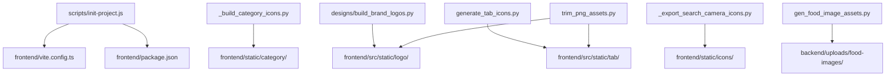
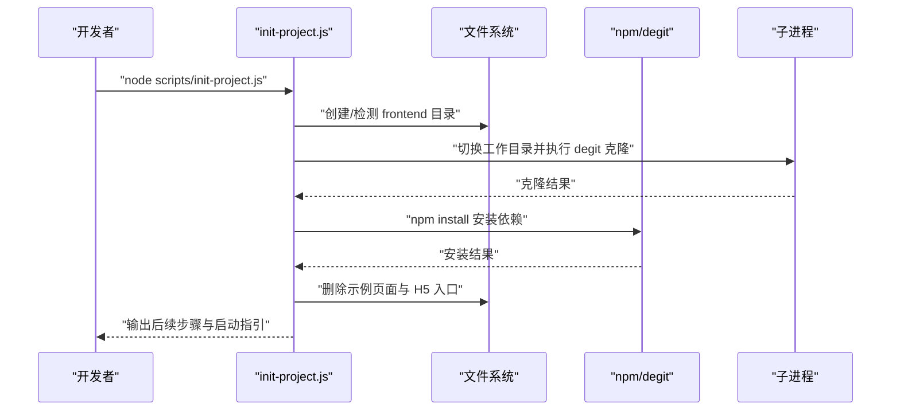
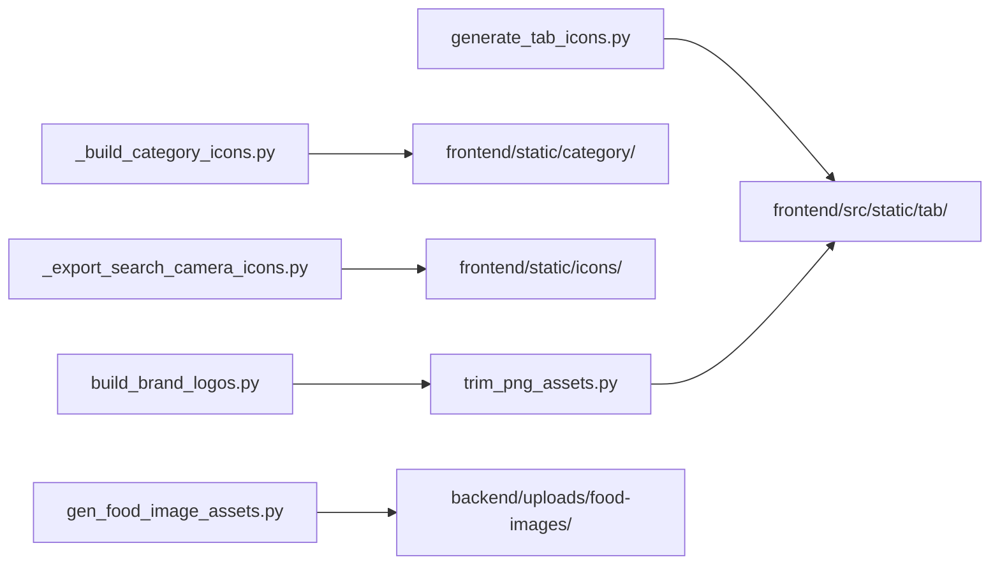

# 开发辅助工具

<cite>
**本文引用的文件**
- [scripts/init-project.js](file://scripts/init-project.js)
- [frontend/scripts/generate_tab_icons.py](file://frontend/scripts/generate_tab_icons.py)
- [frontend/scripts/trim_png_assets.py](file://frontend/scripts/trim_png_assets.py)
- [frontend/scripts/ensure_logo_c_assets.py](file://frontend/scripts/ensure_logo_c_assets.py)
- [designs/_build_category_icons.py](file://designs/_build_category_icons.py)
- [designs/_export_search_camera_icons.py](file://designs/_export_search_camera_icons.py)
- [designs/build_brand_logos.py](file://designs/build_brand_logos.py)
- [assets/logo/resize_exports.py](file://assets/logo/resize_exports.py)
- [tools/gen_food_image_assets.py](file://tools/gen_food_image_assets.py)
- [frontend/package.json](file://frontend/package.json)
- [frontend/vite.config.ts](file://frontend/vite.config.ts)
- [backend/pom.xml](file://backend/pom.xml)
- [docs/skill使用.md](file://docs/skill使用.md)
- [designs/PROMPTS.md](file://designs/PROMPTS.md)
</cite>

## 目录
1. [简介](#简介)
2. [项目结构](#项目结构)
3. [核心工具概览](#核心工具概览)
4. [架构总览](#架构总览)
5. [详细工具解析](#详细工具解析)
6. [依赖关系分析](#依赖关系分析)
7. [性能与优化建议](#性能与优化建议)
8. [故障排查指南](#故障排查指南)
9. [结论](#结论)
10. [附录](#附录)

## 简介
本文件面向参与“减肥小程序”项目的前端与全栈开发者，系统化梳理并说明项目中的开发辅助工具，包括：
- 项目初始化脚本：一键初始化 uni-app 前端工程，清理模板，安装依赖，指导后续开发流程。
- 资源生成工具：批量生成品牌 Logo、分类图标、搜索/相机图标、TabBar 图标、食物占位图等。
- 图标处理工具：对 PNG 资产进行去冗余透明边距、统一画布尺寸、按主题色态导出等处理。
- 开发环境准备与资源文件生成：提供从零到可用的完整操作指南，帮助提升开发效率与一致性。

## 项目结构
该仓库采用多模块组织方式：
- scripts：项目初始化脚本
- frontend：uni-app 前端工程，包含静态资源生成脚本与构建配置
- designs：设计资产与图标导出脚本
- assets/logo：Logo 导出与重采样脚本
- tools：后端侧资源生成工具（如食物图片占位图）
- backend：Spring Boot 后端工程
- docs：技能与设计规范文档

图表来源
- [scripts/init-project.js:1-122](file://scripts/init-project.js#L1-L122)
- [frontend/package.json:1-78](file://frontend/package.json#L1-L78)
- [frontend/vite.config.ts:1-23](file://frontend/vite.config.ts#L1-L23)
- [designs/build_brand_logos.py:1-199](file://designs/build_brand_logos.py#L1-L199)
- [designs/_build_category_icons.py:1-378](file://designs/_build_category_icons.py#L1-L378)
- [designs/_export_search_camera_icons.py:1-76](file://designs/_export_search_camera_icons.py#L1-L76)
- [frontend/scripts/generate_tab_icons.py:1-109](file://frontend/scripts/generate_tab_icons.py#L1-L109)
- [frontend/scripts/trim_png_assets.py:1-154](file://frontend/scripts/trim_png_assets.py#L1-L154)
- [tools/gen_food_image_assets.py:1-158](file://tools/gen_food_image_assets.py#L1-L158)

章节来源
- [scripts/init-project.js:1-122](file://scripts/init-project.js#L1-L122)
- [frontend/package.json:1-78](file://frontend/package.json#L1-L78)
- [frontend/vite.config.ts:1-23](file://frontend/vite.config.ts#L1-L23)

## 核心工具概览
- 项目初始化脚本：自动完成目录创建、模板克隆、依赖安装、清理样板文件与入口文件，输出后续启动指引。
- 品牌 Logo 生成：按主题色态生成暗色/对比度 Logo，并可选择写回前端静态目录与同步 dist。
- 分类图标生成：从设计文件追加分组并在前端输出 256×256 PNG，覆盖默认/激活态。
- 搜索/相机图标导出：从设计文件导出搜索与相机图标至前端静态与源码目录。
- TabBar 图标生成：按产品绿色/灰色风格生成默认/激活态图标。
- PNG 资产修剪：对 Logo 与 Tab 图标进行透明边裁剪、统一画布、按比例填充，节省体积。
- 食物图片占位图：连接本地 MySQL，抽取 TOP50 热门食物生成占位图，输出至后端上传目录。

章节来源
- [designs/build_brand_logos.py:1-199](file://designs/build_brand_logos.py#L1-L199)
- [designs/_build_category_icons.py:1-378](file://designs/_build_category_icons.py#L1-L378)
- [designs/_export_search_camera_icons.py:1-76](file://designs/_export_search_camera_icons.py#L1-L76)
- [frontend/scripts/generate_tab_icons.py:1-109](file://frontend/scripts/generate_tab_icons.py#L1-L109)
- [frontend/scripts/trim_png_assets.py:1-154](file://frontend/scripts/trim_png_assets.py#L1-L154)
- [tools/gen_food_image_assets.py:1-158](file://tools/gen_food_image_assets.py#L1-L158)

## 架构总览
以下序列图展示“项目初始化脚本”的典型调用链路，体现其与前端工程、包管理器及系统命令的关系。

图表来源
- [scripts/init-project.js:46-116](file://scripts/init-project.js#L46-L116)

章节来源
- [scripts/init-project.js:46-116](file://scripts/init-project.js#L46-L116)

## 详细工具解析

### 项目初始化脚本（scripts/init-project.js）
- 功能概述
  - 自动创建/定位前端工程目录，避免重复克隆
  - 使用模板工具克隆 uni-app Vite + TS 模板
  - 安装依赖并清理模板示例页面与 H5 入口文件
  - 输出后续开发步骤（启动小程序、打开 dist 目录）
- 关键行为
  - 目录与空目录检测
  - 子进程执行外部命令（模板克隆、依赖安装）
  - 文件系统操作（删除示例页面、删除 H5 入口）
- 参数与环境
  - 无命令行参数
  - 依赖 Node.js 运行时与系统命令行工具
- 输出结果
  - 初始化后的前端工程目录
  - 控制台日志反馈各阶段执行状态
- 使用场景
  - 新人入职快速搭建前端工程
  - 团队统一初始化流程，减少环境差异
- 注意事项
  - 若前端目录已有 package.json 且非空则跳过模板克隆
  - 失败时会中断并输出错误信息

章节来源
- [scripts/init-project.js:1-122](file://scripts/init-project.js#L1-L122)

### 品牌 Logo 生成（designs/build_brand_logos.py）
- 功能概述
  - 使用矢量绘图库生成品牌 Logo（双环断续环线稿 + 莲花瓣），输出 PNG
  - 支持仅写入设计目录或写回前端静态目录并同步 dist
- 关键行为
  - 渲染两套主题色态（暗色/对比度）
  - 可选将 PNG 写回前端静态目录并同步 dist
  - 提供命令行开关控制是否覆盖与同步
- 参数与环境
  - --install：写回前端静态目录并同步 dist
  - 依赖 Python、Matplotlib、可选 GUI 后端
- 输出结果
  - 设计目录或前端静态目录下的品牌 Logo PNG
- 使用场景
  - 设计更新后批量生成并同步到小程序静态资源
  - 避免每次运行脚本覆盖已手动替换的 PNG
- 注意事项
  - 默认仅写入设计目录，避免覆盖前端已替换资源
  - 同步 dist 需确保 dist 目录存在

章节来源
- [designs/build_brand_logos.py:164-199](file://designs/build_brand_logos.py#L164-L199)

### 分类图标生成（designs/_build_category_icons.py）
- 功能概述
  - 从设计文件追加分组定义，并批量生成 256×256 的分类图标 PNG
  - 覆盖默认与激活态，输出至前端静态与源码目录
- 关键行为
  - 解析设计文件，移除旧分组后重新写入
  - 生成早餐/午餐/晚餐/加餐/运动图标，含默认与激活态
  - 将生成的 PNG 写入前端静态与源码目录
- 参数与环境
  - 无命令行参数
  - 依赖 Python、Pillow
- 输出结果
  - 前端静态与源码目录下的分类图标 PNG
- 使用场景
  - 设计变更后批量导出分类图标
  - 与前端组件库保持一致的图标集

章节来源
- [designs/_build_category_icons.py:353-378](file://designs/_build_category_icons.py#L353-L378)

### 搜索/相机图标导出（designs/_export_search_camera_icons.py）
- 功能概述
  - 从设计文件导出搜索与相机图标，生成 256×256 PNG
  - 写入前端静态与源码目录
- 关键行为
  - 绘制搜索与相机图标，按透明度边界裁剪并适配画布
  - 将最终图像写入两个目录
- 参数与环境
  - 无命令行参数
  - 依赖 Python、Pillow
- 输出结果
  - 前端静态与源码目录下的搜索/相机图标 PNG
- 使用场景
  - 快速导出常用功能图标，保持视觉一致

章节来源
- [designs/_export_search_camera_icons.py:63-76](file://designs/_export_search_camera_icons.py#L63-L76)

### TabBar 图标生成（frontend/scripts/generate_tab_icons.py）
- 功能概述
  - 按产品绿色/灰色风格生成默认/激活态 TabBar 图标
  - 输出至前端静态目录
- 关键行为
  - 定义默认与激活态绘制函数
  - 生成并保存多个 PNG 文件
- 参数与环境
  - 无命令行参数
  - 依赖 Python、Pillow
- 输出结果
  - 前端静态目录下的 TabBar 图标 PNG
- 使用场景
  - 生成微信小程序 TabBar 所需的图标资源

章节来源
- [frontend/scripts/generate_tab_icons.py:85-109](file://frontend/scripts/generate_tab_icons.py#L85-L109)

### PNG 资产修剪（frontend/scripts/trim_png_assets.py）
- 功能概述
  - 对 Logo 与 Tab 图标进行透明边裁剪与统一画布处理
  - 按比例填充，减少文件体积并统一尺寸
- 关键行为
  - 计算透明像素边界，进行裁剪与适度 padding
  - 对 Tab 图标按统一画布比例缩放并居中
- 参数与环境
  - 无命令行参数
  - 依赖 Python、Pillow
- 输出结果
  - 原地覆盖的优化 PNG
- 使用场景
  - 优化资源体积，统一视觉与尺寸

章节来源
- [frontend/scripts/trim_png_assets.py:131-154](file://frontend/scripts/trim_png_assets.py#L131-L154)

### Logo 导出重采样（assets/logo/resize_exports.py）
- 功能概述
  - 对一组导出的 PNG 进行重采样与命名规范化
  - 生成多种尺寸与变体的 PNG
- 关键行为
  - 读取指定文件列表，逐个重采样并保存
  - 删除原始文件，输出重采样结果
- 参数与环境
  - 无命令行参数
  - 依赖 Python、Pillow
- 输出结果
  - 规范化命名与尺寸的 PNG
- 使用场景
  - 导出流程收尾，统一资源命名与尺寸

章节来源
- [assets/logo/resize_exports.py:1-29](file://assets/logo/resize_exports.py#L1-L29)

### 食物图片占位图（tools/gen_food_image_assets.py）
- 功能概述
  - 连接本地 MySQL，抽取 TOP50 热门食物生成占位图
  - 输出至后端上传目录，支持默认占位图与热门占位图
- 关键行为
  - 查询数据库并生成卡片图像
  - 保存默认占位图与热门占位图
- 参数与环境
  - --out-dir：输出目录（默认 backend/uploads/food-images）
  - --mysql-bin：MySQL 客户端可执行文件
  - --mysql-password 或 MYSQL_PWD：数据库密码
- 输出结果
  - 后端上传目录下的 default.png 与若干 {id}.png
- 使用场景
  - 开发/测试阶段快速生成食物占位图
- 注意事项
  - 需要本地 MySQL 可用与相应权限
  - 未提供密码时仅生成默认占位图

章节来源
- [tools/gen_food_image_assets.py:116-158](file://tools/gen_food_image_assets.py#L116-L158)

### 兼容性脚本（frontend/scripts/ensure_logo_c_assets.py）
- 功能概述
  - 兼容旧版 Logo 生成逻辑，透传参数到新的品牌 Logo 生成脚本
- 关键行为
  - 校验新脚本是否存在，否则报错
  - 通过子进程调用新脚本并传递参数
- 参数与环境
  - 透传命令行参数给新脚本
- 输出结果
  - 与新脚本一致的行为与输出
- 使用场景
  - 旧版本脚本迁移期间的过渡方案

章节来源
- [frontend/scripts/ensure_logo_c_assets.py:18-26](file://frontend/scripts/ensure_logo_c_assets.py#L18-L26)

## 依赖关系分析
- 工具间耦合
  - 品牌 Logo 生成与 PNG 修剪存在顺序依赖：先生成，再修剪
  - 分类图标与搜索/相机图标导出均写入前端静态目录，需注意命名冲突
  - TabBar 图标生成与 PNG 修剪共同作用于前端静态目录
- 外部依赖
  - Python 生态：Pillow、Matplotlib（可选 GUI 后端）、FreeType 字体
  - Node 生态：npm、degit（模板克隆）
  - MySQL 客户端：用于生成食物占位图
- 潜在循环依赖
  - 当前脚本均为独立工具，无直接循环依赖
- 集成点
  - 前端静态目录与 dist 目录：品牌 Logo 生成可同步 dist
  - 后端上传目录：食物占位图生成写入该目录

图表来源
- [designs/build_brand_logos.py:164-199](file://designs/build_brand_logos.py#L164-L199)
- [frontend/scripts/trim_png_assets.py:131-154](file://frontend/scripts/trim_png_assets.py#L131-L154)
- [designs/_build_category_icons.py:353-378](file://designs/_build_category_icons.py#L353-L378)
- [designs/_export_search_camera_icons.py:63-76](file://designs/_export_search_camera_icons.py#L63-L76)
- [frontend/scripts/generate_tab_icons.py:85-109](file://frontend/scripts/generate_tab_icons.py#L85-L109)
- [tools/gen_food_image_assets.py:116-158](file://tools/gen_food_image_assets.py#L116-L158)

章节来源
- [designs/build_brand_logos.py:164-199](file://designs/build_brand_logos.py#L164-L199)
- [frontend/scripts/trim_png_assets.py:131-154](file://frontend/scripts/trim_png_assets.py#L131-L154)
- [designs/_build_category_icons.py:353-378](file://designs/_build_category_icons.py#L353-L378)
- [designs/_export_search_camera_icons.py:63-76](file://designs/_export_search_camera_icons.py#L63-L76)
- [frontend/scripts/generate_tab_icons.py:85-109](file://frontend/scripts/generate_tab_icons.py#L85-L109)
- [tools/gen_food_image_assets.py:116-158](file://tools/gen_food_image_assets.py#L116-L158)

## 性能与优化建议
- 资源体积优化
  - 使用 PNG 修剪工具去除透明边距，减少文件大小
  - 统一画布尺寸与填充比例，便于缓存与传输
- 生成效率
  - 批量导出时优先使用设计文件的矢量定义，避免重复手绘
  - 将数据库查询与图像生成分离，必要时缓存查询结果
- 构建一致性
  - 通过脚本统一生成与写入路径，避免手工修改导致的不一致
  - 在 CI 中固定 Python 与 Node 版本，确保跨平台一致性

## 故障排查指南
- 初始化失败
  - 现象：模板克隆或依赖安装失败
  - 排查：确认网络可达、npm/degit 可用；查看控制台错误信息
  - 处置：重试或手动执行对应命令
- 品牌 Logo 未写回前端
  - 现象：仅生成在设计目录
  - 排查：是否使用了写回开关
  - 处置：添加写回开关并确保前端静态目录存在
- PNG 修剪无效
  - 现象：文件未变化或尺寸异常
  - 排查：确认目标文件存在、透明阈值设置合理
  - 处置：调整阈值或重新生成
- 食物占位图未生成热门项
  - 现象：仅有默认占位图
  - 排查：是否提供数据库密码或环境变量
  - 处置：提供密码参数或设置环境变量

章节来源
- [scripts/init-project.js:25-35](file://scripts/init-project.js#L25-L35)
- [designs/build_brand_logos.py:173-194](file://designs/build_brand_logos.py#L173-L194)
- [frontend/scripts/trim_png_assets.py:98-129](file://frontend/scripts/trim_png_assets.py#L98-L129)
- [tools/gen_food_image_assets.py:138-141](file://tools/gen_food_image_assets.py#L138-L141)

## 结论
本仓库提供了完善的开发辅助工具链，覆盖项目初始化、设计资产生成、图标处理与资源优化等关键环节。通过标准化流程与自动化脚本，能够显著提升团队协作效率与资源一致性，建议在日常开发中结合使用，并在 CI 中固化关键步骤，确保产出质量与可追溯性。

## 附录

### 常见开发任务操作指南
- 准备开发环境
  - 安装 Node.js（满足前端工程引擎要求）
  - 安装 Python（用于设计与资源脚本）
  - 准备 MySQL（如需生成食物占位图）
- 初始化前端工程
  - 在仓库根目录执行初始化脚本
  - 进入前端目录，按提示启动小程序开发
- 生成品牌 Logo
  - 在设计目录生成后，按需写回前端静态目录并同步 dist
- 生成分类/搜索/相机图标
  - 运行对应脚本，检查前端静态与源码目录
- 生成 TabBar 图标
  - 运行脚本生成默认/激活态 PNG
- 优化 PNG 资产
  - 运行修剪脚本，统一尺寸与填充比例
- 生成食物占位图
  - 提供数据库密码，生成默认与热门占位图

章节来源
- [frontend/package.json:4-41](file://frontend/package.json#L4-L41)
- [frontend/vite.config.ts:5-22](file://frontend/vite.config.ts#L5-L22)
- [backend/pom.xml:1-86](file://backend/pom.xml#L1-L86)
- [docs/skill使用.md:1-39](file://docs/skill使用.md#L1-L39)
- [designs/PROMPTS.md:1-71](file://designs/PROMPTS.md#L1-L71)