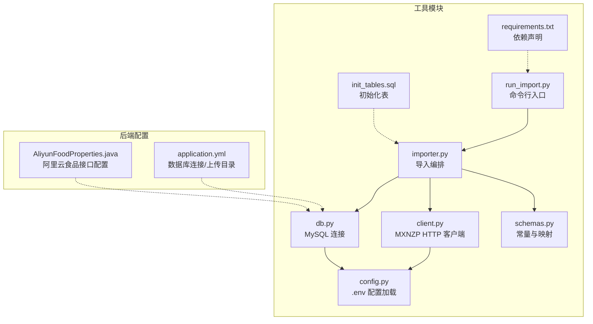
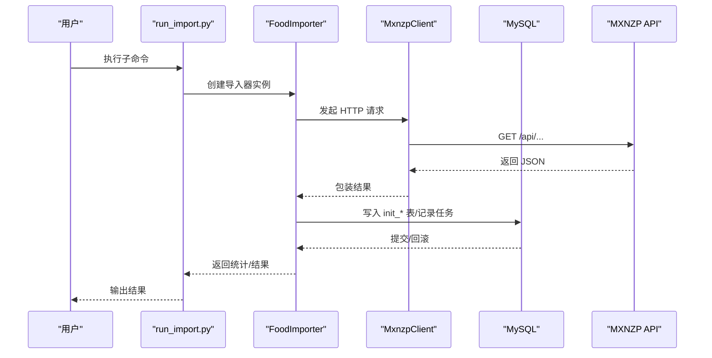
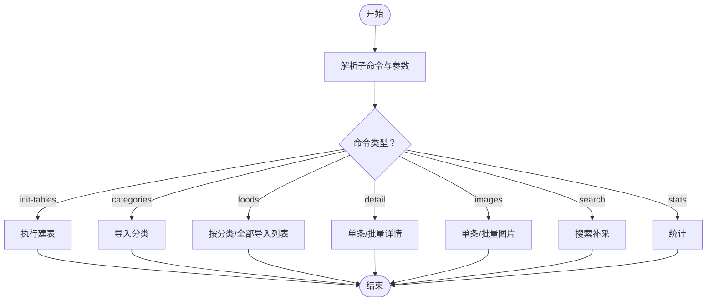
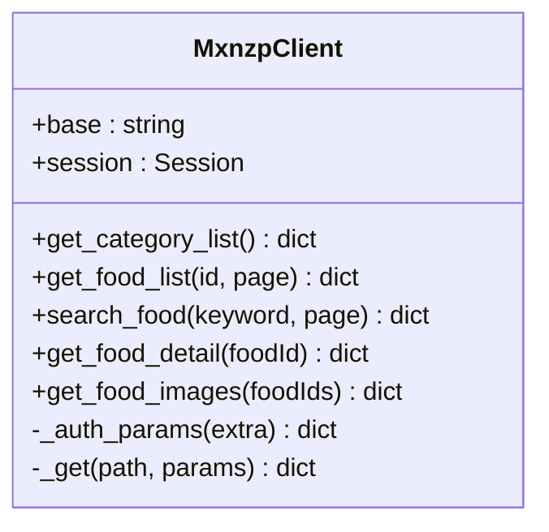
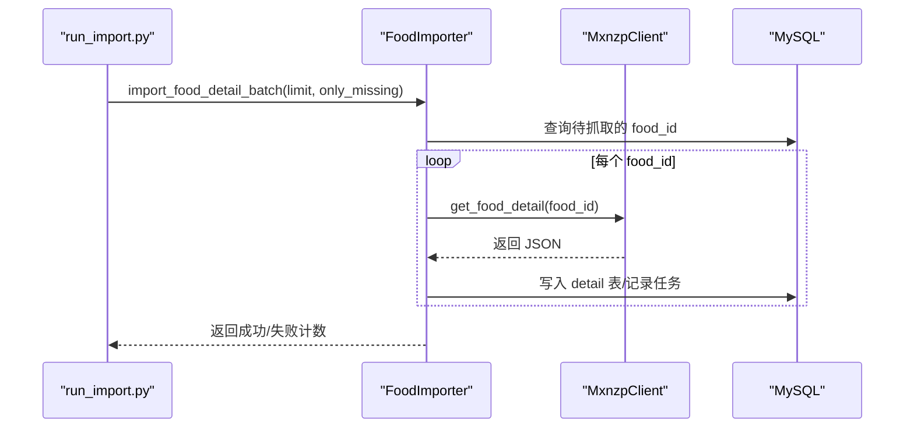
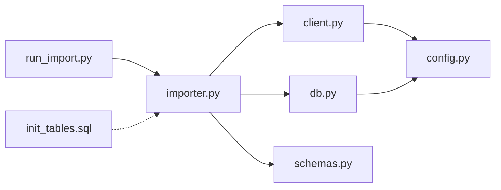

# 数据导入工具

<cite>
**本文引用的文件**
- [README.md](file://tools/food_import/README.md)
- [run_import.py](file://tools/food_import/run_import.py)
- [config.py](file://tools/food_import/config.py)
- [importer.py](file://tools/food_import/importer.py)
- [client.py](file://tools/food_import/client.py)
- [db.py](file://tools/food_import/db.py)
- [schemas.py](file://tools/food_import/schemas.py)
- [init_tables.sql](file://tools/food_import/init_tables.sql)
- [requirements.txt](file://tools/food_import/requirements.txt)
- [application.yml](file://backend/src/main/resources/application.yml)
- [AliyunFoodProperties.java](file://backend/src/main/java/com/ypfr/loseweight/config/AliyunFoodProperties.java)
</cite>

## 目录
1. [简介](#简介)
2. [项目结构](#项目结构)
3. [核心组件](#核心组件)
4. [架构总览](#架构总览)
5. [详细组件分析](#详细组件分析)
6. [依赖关系分析](#依赖关系分析)
7. [性能考量](#性能考量)
8. [故障排查指南](#故障排查指南)
9. [结论](#结论)
10. [附录](#附录)

## 简介
本工具用于从 MXNZP 食物数据渠道采集原始数据，写入数据库的“原始层”表（以 init_ 前缀命名），不直接写入业务正式表（如 food、food_category 等）。采集流程包括：分类导入、按分类抓取食物列表、抓取食物详情、抓取食物图片，以及统计与断点续跑支持。工具提供命令行入口，支持批量处理、限流与重试、任务追踪与对账。

## 项目结构
- 工具位于 tools/food_import 目录，包含 CLI 入口、配置加载、HTTP 客户端、数据库连接、数据导入编排、SQL 初始化脚本与依赖声明。
- 后端配置文件展示了数据库连接与上传目录等环境变量，便于理解工具与后端系统的集成关系。

**图表来源**
- [run_import.py:1-141](file://tools/food_import/run_import.py#L1-L141)
- [config.py:1-54](file://tools/food_import/config.py#L1-L54)
- [client.py:1-89](file://tools/food_import/client.py#L1-L89)
- [importer.py:1-854](file://tools/food_import/importer.py#L1-L854)
- [db.py:1-40](file://tools/food_import/db.py#L1-L40)
- [schemas.py:1-25](file://tools/food_import/schemas.py#L1-L25)
- [init_tables.sql:1-184](file://tools/food_import/init_tables.sql#L1-L184)
- [requirements.txt:1-4](file://tools/food_import/requirements.txt#L1-L4)
- [application.yml:1-54](file://backend/src/main/resources/application.yml#L1-L54)
- [AliyunFoodProperties.java:1-44](file://backend/src/main/java/com/ypfr/loseweight/config/AliyunFoodProperties.java#L1-L44)

**章节来源**
- [README.md:1-104](file://tools/food_import/README.md#L1-L104)
- [run_import.py:1-141](file://tools/food_import/run_import.py#L1-L141)
- [init_tables.sql:1-184](file://tools/food_import/init_tables.sql#L1-L184)

## 核心组件
- 命令行入口：解析子命令与参数，调度导入器执行具体任务。
- 配置加载：从 .env 与环境变量读取 MXNZP 鉴权、MySQL 连接、请求超时/限流/重试等参数。
- HTTP 客户端：封装 MXNZP 接口调用，统一鉴权、重试、限流与响应解析。
- 导入编排：负责分类、列表、详情、图片四类任务的数据落库、状态标记与任务日志记录。
- 数据库连接：提供 MySQL 连接上下文管理，支持事务与回滚。
- 常量与映射：定义 API 路径、通道名、健康等级标签映射等。
- 初始化表：提供建表语句，确保原始层表存在。

**章节来源**
- [run_import.py:26-141](file://tools/food_import/run_import.py#L26-L141)
- [config.py:34-54](file://tools/food_import/config.py#L34-L54)
- [client.py:22-89](file://tools/food_import/client.py#L22-L89)
- [importer.py:56-854](file://tools/food_import/importer.py#L56-L854)
- [db.py:20-40](file://tools/food_import/db.py#L20-L40)
- [schemas.py:4-25](file://tools/food_import/schemas.py#L4-L25)
- [init_tables.sql:16-181](file://tools/food_import/init_tables.sql#L16-L181)

## 架构总览
工具采用“CLI -> 导入器 -> HTTP 客户端 -> 数据库”的分层架构。导入器负责业务编排与状态管理，HTTP 客户端负责与 MXNZP 对接，数据库层提供原始层表存储与任务追踪。

**图表来源**
- [run_import.py:76-136](file://tools/food_import/run_import.py#L76-L136)
- [importer.py:111-172](file://tools/food_import/importer.py#L111-L172)
- [client.py:37-88](file://tools/food_import/client.py#L37-L88)
- [db.py:20-40](file://tools/food_import/db.py#L20-L40)

## 详细组件分析

### 命令行入口与参数
- 支持子命令：init-tables、categories、foods、detail、images、search、stats。
- 参数组互斥：如 foods 的 --category-id 与 --all 互斥；detail 的 --food-id 与 --batch 互斥；images 的 --food-ids 与 --batch 互斥。
- 批量控制：detail 与 images 支持 --limit、--only-missing/--include-existing；images 还支持 --from-detail 选择 ID 来源。
- 限制与校验：images 单次最多 10 个 ID；CLI 层对 --food-ids 数量进行检查。

**图表来源**
- [run_import.py:26-141](file://tools/food_import/run_import.py#L26-L141)

**章节来源**
- [run_import.py:26-141](file://tools/food_import/run_import.py#L26-L141)

### 配置加载与环境变量
- 优先级：仓库根目录 .env（不覆盖）< tools/food_import/.env（覆盖）。
- 关键配置项：
  - MXNZP_APP_ID / MXNZP_APP_SECRET：接口鉴权
  - MYSQL_HOST / MYSQL_PORT / MYSQL_USER / MYSQL_PASSWORD / MYSQL_DATABASE：MySQL 连接
  - REQUEST_TIMEOUT / REQUEST_SLEEP_SECONDS / REQUEST_RETRY_TIMES：请求超时、限流、重试
  - MXNZP_API_BASE：API 基础地址
  - LOG_LEVEL：日志级别
- 配置类提供类型安全访问与默认值。

**章节来源**
- [config.py:14-54](file://tools/food_import/config.py#L14-L54)

### HTTP 客户端与 API 调用
- 固定路径与鉴权：自动附加 app_id/app_secret，支持额外参数。
- 重试与限流：按配置重试，指数退避上限 30 秒；每次请求后按 sleep 时间等待。
- 响应解析：统一包装 HTTP 成功/失败、状态码、JSON/文本、错误信息。
- 接口封装：type_list、food/list、food/search、food/details、images/list。

**图表来源**
- [client.py:22-89](file://tools/food_import/client.py#L22-L89)

**章节来源**
- [client.py:22-89](file://tools/food_import/client.py#L22-L89)

### 导入编排与数据落库
- 分类导入：写入 init_food_channel_category，使用 UPSERT 更新。
- 列表导入：按分类分页抓取，写入 init_food_channel_item，支持 limit_per_category。
- 详情导入：写入 init_food_channel_detail，字段众多，包含宏量营养素、血糖指数、健康建议、食谱等 JSON 字段。
- 图片导入：写入 init_food_channel_image，支持单条与批量；批量时固定每请求 10 个 ID；支持从 item 或 detail 取 ID。
- 任务日志：每次调用写入 init_food_channel_pull_task，便于排查与对账。
- 状态管理：detail_status、image_status、source_status 等字段用于区分成功/缺失/无效/错误等状态。

**图表来源**
- [importer.py:511-547](file://tools/food_import/importer.py#L511-L547)
- [client.py:71-72](file://tools/food_import/client.py#L71-L72)
- [db.py:20-40](file://tools/food_import/db.py#L20-L40)

**章节来源**
- [importer.py:111-800](file://tools/food_import/importer.py#L111-L800)

### 数据库连接与事务
- 使用 PyMySQL 连接 MySQL，设置字符集与 DictCursor。
- 通过上下文管理器自动提交/回滚，确保异常时回滚。
- JSON 字段序列化统一通过 json_val 实现。

**章节来源**
- [db.py:20-40](file://tools/food_import/db.py#L20-L40)

### 常量与映射
- 通道名：mxnzp
- API 路径：type/list、food/list、food/search、food/details、images/list
- 健康等级映射：1 推荐、2 适量、3 少吃
- 搜索补采的虚拟分类占位符：special_search

**章节来源**
- [schemas.py:4-25](file://tools/food_import/schemas.py#L4-L25)

### 初始化表结构
- 原始层表：init_food_channel_category、init_food_channel_item、init_food_channel_detail、init_food_channel_image、init_food_channel_pull_task。
- 关键约束：UNIQUE 键保证唯一性；索引提升查询效率。
- JSON 字段：raw_json、glycemic_info_json、cookbook_json 等保存原始响应。

**章节来源**
- [init_tables.sql:16-181](file://tools/food_import/init_tables.sql#L16-L181)

## 依赖关系分析
- CLI 依赖导入器；导入器依赖 HTTP 客户端、数据库连接、常量与映射。
- HTTP 客户端依赖配置；数据库连接依赖配置。
- 初始化脚本独立于运行时逻辑，仅在首次使用前执行。

**图表来源**
- [run_import.py:14-15](file://tools/food_import/run_import.py#L14-L15)
- [importer.py:12-15](file://tools/food_import/importer.py#L12-L15)
- [client.py:10-11](file://tools/food_import/client.py#L10-L11)
- [db.py:11-11](file://tools/food_import/db.py#L11-L11)
- [schemas.py:4-4](file://tools/food_import/schemas.py#L4-L4)
- [config.py:7-12](file://tools/food_import/config.py#L7-L12)
- [init_tables.sql:1-5](file://tools/food_import/init_tables.sql#L1-L5)

**章节来源**
- [requirements.txt:1-4](file://tools/food_import/requirements.txt#L1-L4)
- [run_import.py:14-15](file://tools/food_import/run_import.py#L14-L15)
- [importer.py:12-15](file://tools/food_import/importer.py#L12-L15)
- [client.py:10-11](file://tools/food_import/client.py#L10-L11)
- [db.py:11-11](file://tools/food_import/db.py#L11-L11)
- [schemas.py:4-4](file://tools/food_import/schemas.py#L4-L4)
- [config.py:7-12](file://tools/food_import/config.py#L7-L12)
- [init_tables.sql:1-5](file://tools/food_import/init_tables.sql#L1-L5)

## 性能考量
- 限流与重试：通过 REQUEST_SLEEP_SECONDS 控制请求间隔，REQUEST_RETRY_TIMES 控制失败重试次数，降低接口限流风险。
- 批量处理：detail 与 images 支持批量，减少往返开销；images 固定每请求 10 个 ID。
- 任务日志：init_food_channel_pull_task 记录每次调用的响应与耗时，便于定位慢请求与失败原因。
- UPSERT：使用 ON DUPLICATE KEY UPDATE 减少重复写入成本，支持断点续跑。

[本节为通用指导，无需特定文件来源]

## 故障排查指南
- 分类/列表/详情/图片任一环节失败：
  - 检查 MXNZP 鉴权参数（MXNZP_APP_ID、MXNZP_APP_SECRET）与 API 基础地址（MXNZP_API_BASE）。
  - 检查 MySQL 连接参数（MYSQL_*）与数据库是否存在。
  - 查看日志输出与 init_food_channel_pull_task 的记录，确认 HTTP 状态码、消息与响应体。
- 图片接口额度问题：
  - 当接口返回业务错误（如额度相关错误）时，工具会为每个 foodId 写入 image_status=api_error，并保留原始响应包络，便于对账；额度恢复后执行 --only-missing 可自动重试。
- 重复执行与断点续跑：
  - 所有写入均使用 UPSERT，重复执行会更新记录。
  - 批量详情默认仅补缺（only_missing=True），批量图片默认仅补缺图片行（only_missing=True）。
- 单次图片数量限制：
  - images/list 接口单次最多 10 个 ID，超过将被忽略；CLI 层会拒绝超过 10 个 ID 的输入。

**章节来源**
- [README.md:95-104](file://tools/food_import/README.md#L95-L104)
- [importer.py:575-603](file://tools/food_import/importer.py#L575-L603)
- [client.py:74-88](file://tools/food_import/client.py#L74-L88)
- [run_import.py:114-118](file://tools/food_import/run_import.py#L114-L118)

## 结论
本工具提供了从 MXNZP 采集食物数据的完整链路，覆盖分类、列表、详情、图片四大环节，并通过原始层表与任务日志实现可审计、可重跑、可对账的能力。配合合理的限流与重试策略，适合在生产环境中稳定运行。后续清洗与映射到正式表的工作应独立于采集脚本，确保职责分离与可维护性。

[本节为总结，无需特定文件来源]

## 附录

### 使用示例与最佳实践
- 安装依赖
  - 在仓库根目录执行 pip 安装工具依赖。
- 配置 .env
  - 在仓库根目录或 tools/food_import/ 目录创建 .env 文件，填写 MXNZP 鉴权、MySQL 连接、请求超时/限流/重试等参数。
- 初始化表
  - 首次使用前执行建表命令，或手动执行 SQL 脚本。
- 推荐执行顺序
  - 分类导入 -> 按分类抓取列表（限制每类数量）-> 抓取详情（批量补缺）-> 抓取图片（建议从详情成功数据取 ID）-> 统计。
- 批量处理与断点续跑
  - 使用 --limit 控制批量大小；默认仅补缺（--only-missing），必要时使用 --include-existing 强制重拉。
  - 任务日志可用于排查失败与限流。
- 搜索补采
  - 使用 search 子命令按关键字补采，结果写入 init_food_channel_item，归属特殊虚拟分类。

**章节来源**
- [README.md:5-104](file://tools/food_import/README.md#L5-L104)
- [run_import.py:26-141](file://tools/food_import/run_import.py#L26-L141)

### 命令行参数速查
- init-tables：初始化原始层表
- categories：导入分类
- foods：导入食物列表
  - --category-id：指定分类 ID
  - --all：全部分类
  - --limit-per-category：每类最大数量
- detail：导入食物详情
  - --food-id：单个 ID
  - --batch：批量
  - --limit：批量大小
  - --only-missing：仅补缺（默认）
  - --include-existing：包含已有成功记录
- images：导入食物图片
  - --food-ids：逗号分隔，最多 10 个
  - --batch：批量
  - --limit：批量大小
  - --only-missing：仅补缺（默认）
  - --include-existing：包含已有图片记录
  - --from-detail：从详情成功数据取 ID（推荐）
- search：搜索补采
  - --keyword：关键字
  - --max-pages：最大页数
- stats：统计

**章节来源**
- [run_import.py:26-141](file://tools/food_import/run_import.py#L26-L141)

### 数据库连接与后端集成
- 工具使用 application.yml 中的数据库连接配置；上传目录（如食物图片）也在此配置中定义，便于与后端资源管理保持一致。

**章节来源**
- [application.yml:8-11](file://backend/src/main/resources/application.yml#L8-L11)
- [application.yml:47-49](file://backend/src/main/resources/application.yml#L47-L49)