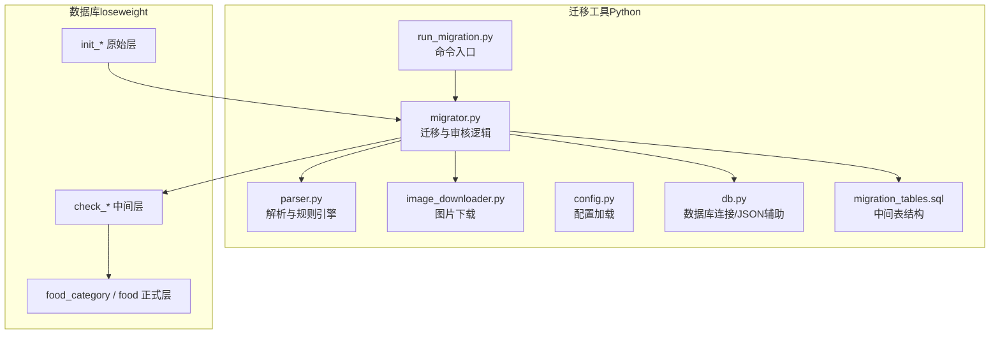
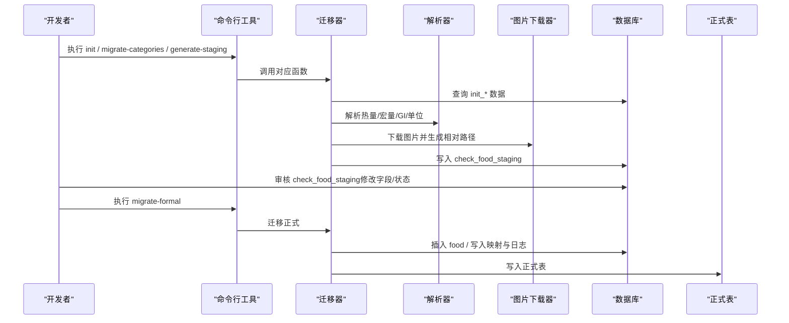
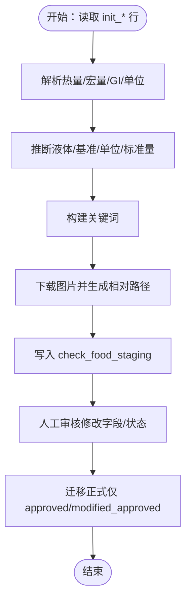

# 数据迁移脚本

<cite>
**本文引用的文件**
- [run_migration.py](file://tools/food_migration/run_migration.py)
- [migrator.py](file://tools/food_migration/migrator.py)
- [parser.py](file://tools/food_migration/parser.py)
- [image_downloader.py](file://tools/food_migration/image_downloader.py)
- [config.py](file://tools/food_migration/config.py)
- [db.py](file://tools/food_migration/db.py)
- [migration_tables.sql](file://tools/food_migration/migration_tables.sql)
- [init_tables.sql](file://tools/food_import/init_tables.sql)
- [V005__food_category_food_migrate.sql](file://database/migrations/V005__food_category_food_migrate.sql)
- [01_schema.sql](file://database/01_schema.sql)
- [food_data_migration_memory.md](file://docs/food_data_migration_memory.md)
- [requirements.txt](file://tools/food_migration/requirements.txt)
</cite>

## 目录
1. [简介](#简介)
2. [项目结构](#项目结构)
3. [核心组件](#核心组件)
4. [架构总览](#架构总览)
5. [详细组件分析](#详细组件分析)
6. [依赖分析](#依赖分析)
7. [性能考虑](#性能考虑)
8. [故障排查指南](#故障排查指南)
9. [结论](#结论)
10. [附录](#附录)

## 简介
本文件面向“数据迁移工具”的使用者与维护者，系统性说明如何将原始采集数据从 init 表迁移到正式业务表（food_category、food），涵盖数据清洗、字段映射、格式转换、图片下载与存储、中间审核层（check_*）的使用、迁移配置、数据验证规则、错误处理机制与批量处理策略，并提供迁移前后数据对比示例与质量检查方法，帮助确保迁移的准确性与完整性。

## 项目结构
- 迁移工具位于 tools/food_migration，包含命令入口、迁移逻辑、解析器、图片下载器、配置与数据库连接等模块。
- 原始采集层（init_*）表结构与采集流程位于 tools/food_import，迁移前需先完成 init_* 的填充。
- 正式业务表（food_category、food）由数据库迁移脚本创建与初始化。
- 文档与记忆卡片提供了迁移流程、字段规则、状态枚举与推荐执行顺序等说明。

图表来源
- [run_migration.py:1-199](file://tools/food_migration/run_migration.py#L1-L199)
- [migrator.py:1-751](file://tools/food_migration/migrator.py#L1-L751)
- [parser.py:1-419](file://tools/food_migration/parser.py#L1-L419)
- [image_downloader.py:1-112](file://tools/food_migration/image_downloader.py#L1-L112)
- [config.py:1-46](file://tools/food_migration/config.py#L1-L46)
- [db.py:1-58](file://tools/food_migration/db.py#L1-L58)
- [migration_tables.sql:1-117](file://tools/food_migration/migration_tables.sql#L1-L117)

章节来源
- [run_migration.py:1-199](file://tools/food_migration/run_migration.py#L1-L199)
- [migration_tables.sql:1-117](file://tools/food_migration/migration_tables.sql#L1-L117)

## 核心组件
- 命令入口与子命令管理：提供 init、migrate-categories、generate-staging、repair-images、refetch-init-images、migrate-formal、recalc-unit-calories、init-unit-fields、stats 等子命令，支持 limit、only-new/all、force 等参数。
- 迁移与审核逻辑：负责分类映射、生成 check_food_staging、补图与重试、按审核状态迁移至正式表、统计中间态与本地图片数量。
- 解析器与规则引擎：从 init_* 提取并清洗字段，推断液体/固体、能量基准（100g/100ml）、单位与标准量、宏量、GI 等，形成 check_food_staging 的候选字段。
- 图片下载器：根据优先级选择图片 URL，下载到本地 uploads/food-images，生成相对路径写入 staging。
- 配置与数据库：从环境变量加载 MySQL 连接、图片本地目录、HTTP 超时、日志级别；提供连接上下文与 JSON 序列化/反序列化辅助。
- 中间表结构：check_food_category_source_mapping、check_food_staging、check_food_source_mapping、check_food_migrate_log。

章节来源
- [run_migration.py:36-194](file://tools/food_migration/run_migration.py#L36-L194)
- [migrator.py:69-751](file://tools/food_migration/migrator.py#L69-L751)
- [parser.py:1-419](file://tools/food_migration/parser.py#L1-L419)
- [image_downloader.py:1-112](file://tools/food_migration/image_downloader.py#L1-L112)
- [config.py:28-46](file://tools/food_migration/config.py#L28-L46)
- [db.py:14-58](file://tools/food_migration/db.py#L14-L58)
- [migration_tables.sql:13-116](file://tools/food_migration/migration_tables.sql#L13-L116)

## 架构总览
迁移流程分为三层：原始层（init_*）、中间审核层（check_*）、正式层（food_category、food）。脚本通过命令行驱动，按推荐顺序执行，最终将审核通过的数据写入正式表并建立溯源映射。

图表来源
- [run_migration.py:113-194](file://tools/food_migration/run_migration.py#L113-L194)
- [migrator.py:69-751](file://tools/food_migration/migrator.py#L69-L751)
- [parser.py:197-289](file://tools/food_migration/parser.py#L197-L289)
- [image_downloader.py:46-112](file://tools/food_migration/image_downloader.py#L46-L112)

## 详细组件分析

### 命令行与执行流程
- init：执行 migration_tables.sql 创建中间表。
- migrate-categories：将 init 分类映射到 food_category，并写入 check_food_category_source_mapping。
- generate-staging：从 init 生成 check_food_staging，解析字段、下载图片，支持 only-new 与 limit。
- repair-images/refetch-init-images：补图或按 init 图片 URL 刷新并下载。
- migrate-formal：按审核状态将数据写入 food，并写入 check_food_source_mapping 与日志。
- recalc-unit-calories/init-unit-fields：基于规则回填 calories_per_unit，必要时推断 standard_weight_*。
- stats：统计各类数量与图片状态。

章节来源
- [run_migration.py:36-194](file://tools/food_migration/run_migration.py#L36-L194)

### 中间表结构与字段规则
- check_food_category_source_mapping：渠道分类到正式分类的映射，幂等与溯源。
- check_food_staging：核心中间表，包含原始来源字段、解析候选字段、图片下载状态、人工审核状态、迁移状态与日志字段。
- check_food_source_mapping：渠道食物到正式 food 的映射，防止重复迁移。
- check_food_migrate_log：迁移动作与消息记录。

章节来源
- [migration_tables.sql:13-116](file://tools/food_migration/migration_tables.sql#L13-L116)

### 数据清洗与字段映射
- 名称清洗：去除多余空白与括号内容，保证正式表 name 合法。
- 能量基准与单位：根据名称与描述推断 is_liquid、energy_basis（100g/100ml），并计算 calories_per_unit。
- 标准量推断：针对人工填写的 unit_name，按规则表与默认表推断 standard_weight_*。
- 宏量与GI：仅当单位明确为每100g时写入宏量；GI仅来自详情 JSON，不按名称猜测。
- 关键词构建：由正式名、渠道名与分类名生成，去重并控制长度。

图表来源
- [migrator.py:191-319](file://tools/food_migration/migrator.py#L191-L319)
- [parser.py:197-289](file://tools/food_migration/parser.py#L197-L289)
- [image_downloader.py:46-112](file://tools/food_migration/image_downloader.py#L46-L112)

章节来源
- [migrator.py:191-319](file://tools/food_migration/migrator.py#L191-L319)
- [parser.py:197-289](file://tools/food_migration/parser.py#L197-L289)

### 图片下载与存储
- 优先级：init_food_channel_image.image_url > init_food_channel_item.cover；若均无则跳过。
- 文件名：mxnzp_{channel_food_id}.{扩展名}，扩展名从 URL 或 Content-Type 推断。
- 本地目录：通过配置覆盖，默认 backend/uploads/food-images。
- 状态：pending/success/failed/skipped，失败不中断批处理。

章节来源
- [image_downloader.py:46-112](file://tools/food_migration/image_downloader.py#L46-L112)
- [config.py:35-42](file://tools/food_migration/config.py#L35-L42)

### 迁移配置与环境变量
- MySQL 连接：MYSQL_HOST、MYSQL_PORT、MYSQL_USER、MYSQL_PASSWORD、MYSQL_DATABASE。
- 图片本地目录：FOOD_IMAGE_LOCAL_DIR（默认 backend/uploads/food-images）。
- HTTP 超时：FOOD_MIGRATION_HTTP_TIMEOUT（秒）。
- 日志级别：LOG_LEVEL（默认 INFO）。
- 依赖：pymysql、python-dotenv。

章节来源
- [config.py:28-46](file://tools/food_migration/config.py#L28-L46)
- [requirements.txt:1-3](file://tools/food_migration/requirements.txt#L1-L3)

### 数据验证规则与错误处理
- 分类映射：必须存在 target_category_id，否则迁移失败并记录日志。
- 热量校验：正式迁移前要求 calories_per_100g 或 calories_per_100ml 至少一项存在。
- 名称校验：channel_food_name 必须清洗后非空。
- 图片校验：若本地路径为 URL 则清空，避免写入第三方地址。
- 异常处理：捕获数据库唯一约束冲突、完整性错误与通用异常，记录失败原因并继续批处理。

章节来源
- [migrator.py:547-705](file://tools/food_migration/migrator.py#L547-L705)
- [food_data_migration_memory.md:25-42](file://docs/food_data_migration_memory.md#L25-L42)

### 批量处理策略
- 支持 limit 控制批次大小，避免一次性处理过多。
- generate-staging 支持 only-new（默认）与 all 两种模式，前者跳过已存在的 staging 记录，后者扫描全部。
- repair-images/refetch-init-images 支持 limit 与 force（删除既有文件后重新下载）。
- migrate-formal 仅处理审核通过且未迁移的记录，幂等写入映射与日志。

章节来源
- [run_migration.py:47-95](file://tools/food_migration/run_migration.py#L47-L95)
- [migrator.py:322-434](file://tools/food_migration/migrator.py#L322-L434)
- [migrator.py:547-685](file://tools/food_migration/migrator.py#L547-L685)

### 迁移前后数据对比与质量检查
- 迁移前：使用 stats 查看 init、check_*、food、本地图片数量与失败数。
- 迁移后：核对正式表字段是否符合规则（名称、图片路径、GI、宏量、单位与标准量、关键词等）。
- 建议检查清单：
  - 分类映射是否正确（check_food_category_source_mapping）。
  - 审核状态是否为 approved/modified_approved。
  - calories_per_100g/calories_per_unit 是否按规则填写。
  - unit_name 与 standard_weight_* 是否匹配。
  - 图片下载状态与本地文件是否存在。
  - 关键词长度与重复项是否合规。

章节来源
- [run_migration.py:171-193](file://tools/food_migration/run_migration.py#L171-L193)
- [migrator.py:708-750](file://tools/food_migration/migrator.py#L708-L750)
- [food_data_migration_memory.md:25-42](file://docs/food_data_migration_memory.md#L25-L42)

## 依赖分析
- Python 依赖：pymysql（数据库连接）、python-dotenv（环境变量加载）。
- 数据库依赖：MySQL 5.7+（JSON 类型），正式表依赖 V005 迁移脚本创建。
- 原始层依赖：tools/food_import 提供 init_* 表结构与采集流程，迁移前需先填充 init_*。

图表来源
- [requirements.txt:1-3](file://tools/food_migration/requirements.txt#L1-L3)
- [V005__food_category_food_migrate.sql:1-91](file://database/migrations/V005__food_category_food_migrate.sql#L1-L91)
- [init_tables.sql:1-184](file://tools/food_import/init_tables.sql#L1-L184)

章节来源
- [requirements.txt:1-3](file://tools/food_migration/requirements.txt#L1-L3)
- [V005__food_category_food_migrate.sql:1-91](file://database/migrations/V005__food_category_food_migrate.sql#L1-L91)
- [init_tables.sql:1-184](file://tools/food_import/init_tables.sql#L1-L184)

## 性能考虑
- 批量限制：通过 limit 控制单次处理量，避免长时间锁表与内存占用过高。
- 唯一键约束：generate-staging 使用唯一键避免重复插入；repair-images/refetch-init-images 仅处理失败或缺失的记录。
- 图片下载并发：脚本逐条下载，避免对第三方接口造成过大压力；可通过 limit 与分批执行控制节奏。
- 审核前置：将人工审核放在生成 staging 之后、迁移正式之前，减少失败重试成本。

## 故障排查指南
- 中间表未初始化：执行 init 子命令创建 check_* 表后重试。
- 迁移失败：查看 check_food_migrate_log 获取失败原因；检查分类映射、热量字段、名称等是否满足规则。
- 图片下载失败：使用 repair-images/refetch-init-images 补图；确认 URL 可访问与网络超时设置合理。
- 数据库连接问题：检查 MYSQL_* 环境变量与网络连通性。
- 重复执行：脚本具备幂等性，重复运行不会破坏数据一致性。

章节来源
- [run_migration.py:106-112](file://tools/food_migration/run_migration.py#L106-L112)
- [migrator.py:688-705](file://tools/food_migration/migrator.py#L688-L705)
- [image_downloader.py:106-112](file://tools/food_migration/image_downloader.py#L106-L112)

## 结论
该数据迁移工具通过清晰的三层结构与严格的字段规则，实现了从原始采集到正式业务表的稳健迁移。借助中间审核层与完善的错误处理、统计与补图能力，能够在保证数据质量的同时高效完成大批量迁移任务。建议严格遵循推荐执行顺序与质量检查清单，确保迁移的准确性与可追溯性。

## 附录
- 推荐执行顺序
  1) 初始化中间表：python tools/food_migration/run_migration.py init
  2) 迁移分类：python tools/food_migration/run_migration.py migrate-categories
  3) 生成 staging：python tools/food_migration/run_migration.py generate-staging --only-new
  4) 人工审核：在数据库中调整字段与状态
  5) 迁移正式：python tools/food_migration/run_migration.py migrate-formal
  6) 可选补图：python tools/food_migration/run_migration.py repair-images
- 常用统计：python tools/food_migration/run_migration.py stats

章节来源
- [food_data_migration_memory.md:110-134](file://docs/food_data_migration_memory.md#L110-L134)