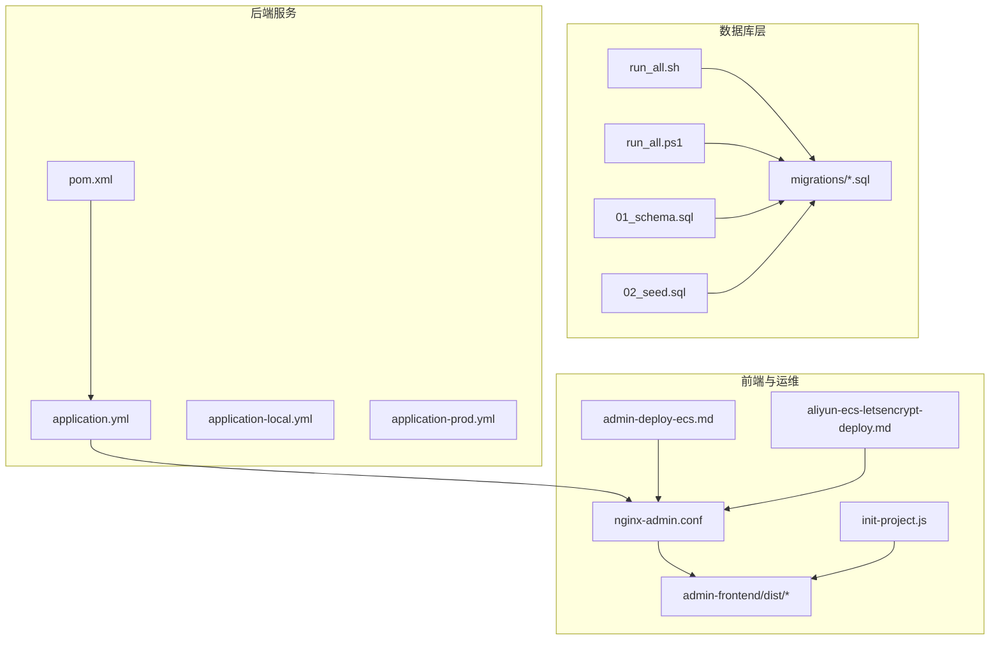
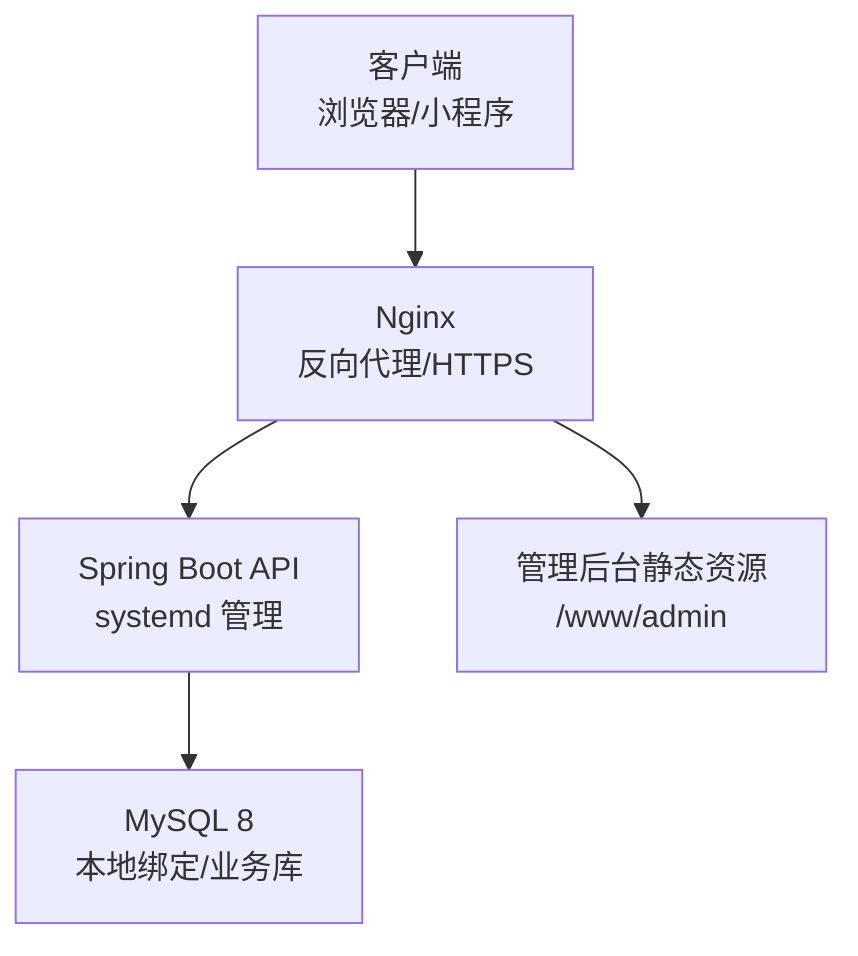
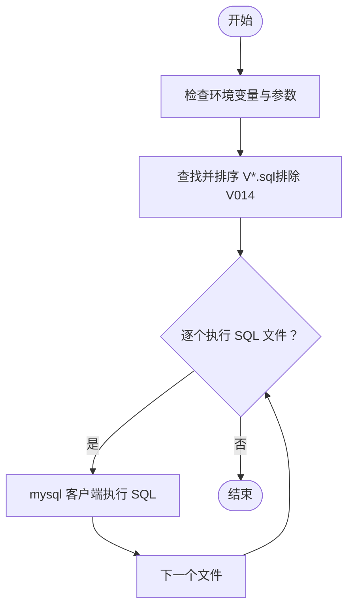
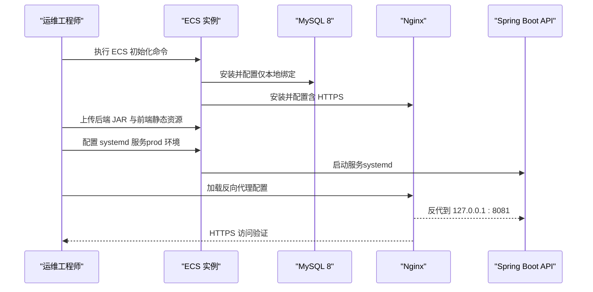
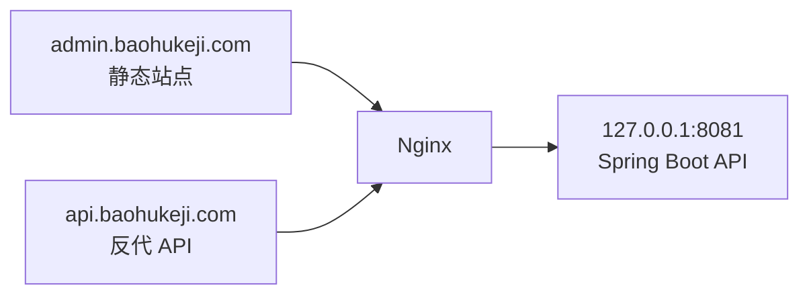
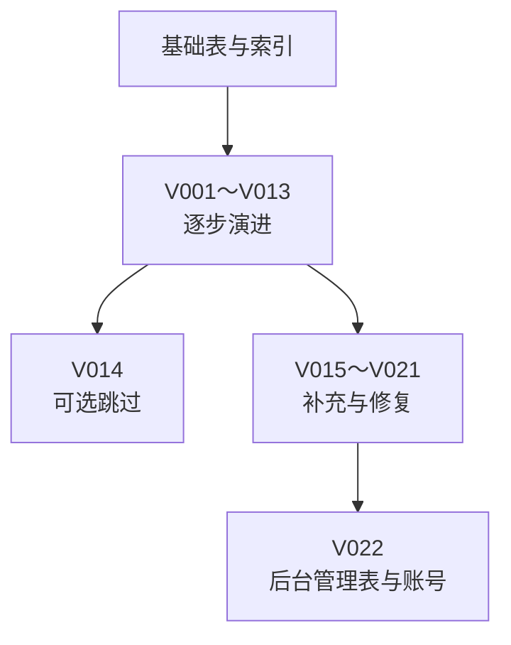
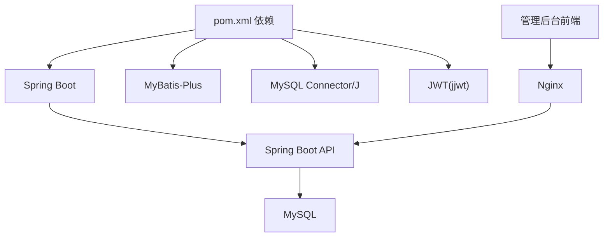

# 部署自动化脚本

<cite>
**本文引用的文件**
- [run_all.sh](file://database/migrations/run_all.sh)
- [run_all.ps1](file://database/migrations/run_all.ps1)
- [application.yml](file://backend/src/main/resources/application.yml)
- [application-local.yml](file://backend/src/main/resources/application-local.yml)
- [application-prod.yml](file://backend/src/main/resources/application-prod.yml)
- [init-project.js](file://scripts/init-project.js)
- [01_schema.sql](file://database/01_schema.sql)
- [02_seed.sql](file://database/02_seed.sql)
- [admin-deploy-ecs.md](file://docs/admin-deploy-ecs.md)
- [nginx-admin.conf](file://docs/nginx-admin.conf)
- [aliyun-ecs-letsencrypt-deploy.md](file://docs/aliyun-ecs-letsencrypt-deploy.md)
- [pom.xml](file://backend/pom.xml)
- [V022__admin_user_and_login_log.sql](file://database/migrations/V022__admin_user_and_login_log.sql)
</cite>

## 目录
1. [简介](#简介)
2. [项目结构](#项目结构)
3. [核心组件](#核心组件)
4. [架构总览](#架构总览)
5. [详细组件分析](#详细组件分析)
6. [依赖关系分析](#依赖关系分析)
7. [性能考虑](#性能考虑)
8. [故障排查指南](#故障排查指南)
9. [结论](#结论)
10. [附录](#附录)

## 简介
本文件面向运维与开发者，提供一套完整的部署自动化脚本使用指南，涵盖数据库迁移脚本、环境部署脚本、服务器配置脚本的使用方法与部署流程。文档同时解释数据库版本管理、环境变量配置、服务启动顺序与监控配置，并给出开发、测试、生产三类环境的部署步骤，帮助团队高效完成系统部署与维护。

## 项目结构
本项目包含后端 Spring Boot API、数据库脚本与迁移脚本、管理后台前端、以及部署与运维文档。关键目录与文件如下：
- database：数据库脚本与迁移脚本，包含初始化建模、种子数据与后台管理相关脚本
- backend：后端工程，包含 Spring Boot 配置与打包构建
- admin-frontend：管理后台前端工程
- docs：部署与运维文档，包含 ECS 部署、Nginx 配置、HTTPS 证书等
- scripts：项目初始化脚本

**图表来源**
- [01_schema.sql:1-159](file://database/01_schema.sql#L1-L159)
- [02_seed.sql:1-2004](file://database/02_seed.sql#L1-L2004)
- [run_all.sh:1-26](file://database/migrations/run_all.sh#L1-L26)
- [run_all.ps1:1-34](file://database/migrations/run_all.ps1#L1-L34)
- [application.yml:1-54](file://backend/src/main/resources/application.yml#L1-L54)
- [application-local.yml:1-20](file://backend/src/main/resources/application-local.yml#L1-L20)
- [application-prod.yml:1-19](file://backend/src/main/resources/application-prod.yml#L1-L19)
- [pom.xml:1-86](file://backend/pom.xml#L1-L86)
- [nginx-admin.conf:1-28](file://docs/nginx-admin.conf#L1-L28)
- [admin-deploy-ecs.md:1-108](file://docs/admin-deploy-ecs.md#L1-L108)
- [aliyun-ecs-letsencrypt-deploy.md:1-256](file://docs/aliyun-ecs-letsencrypt-deploy.md#L1-L256)
- [init-project.js:1-122](file://scripts/init-project.js#L1-L122)

**章节来源**
- [01_schema.sql:1-159](file://database/01_schema.sql#L1-L159)
- [02_seed.sql:1-2004](file://database/02_seed.sql#L1-L2004)
- [run_all.sh:1-26](file://database/migrations/run_all.sh#L1-L26)
- [run_all.ps1:1-34](file://database/migrations/run_all.ps1#L1-L34)
- [application.yml:1-54](file://backend/src/main/resources/application.yml#L1-L54)
- [application-local.yml:1-20](file://backend/src/main/resources/application-local.yml#L1-L20)
- [application-prod.yml:1-19](file://backend/src/main/resources/application-prod.yml#L1-L19)
- [pom.xml:1-86](file://backend/pom.xml#L1-L86)
- [nginx-admin.conf:1-28](file://docs/nginx-admin.conf#L1-L28)
- [admin-deploy-ecs.md:1-108](file://docs/admin-deploy-ecs.md#L1-L108)
- [aliyun-ecs-letsencrypt-deploy.md:1-256](file://docs/aliyun-ecs-letsencrypt-deploy.md#L1-L256)
- [init-project.js:1-122](file://scripts/init-project.js#L1-L122)

## 核心组件
- 数据库迁移脚本：按序执行 V001～V022 的 SQL 脚本，跳过可选的 V014 脚本；支持 Linux Bash 与 Windows PowerShell 两种运行方式
- 环境部署脚本：ECS 初始化、MySQL 安装与配置、Nginx 与 HTTPS（Let’s Encrypt）、systemd 后端服务、前端静态资源上传
- 服务器配置脚本：Nginx 反向代理配置，区分管理后台静态站点与 API 反代
- 服务启动顺序：数据库初始化 → 后端打包与 systemd 注册 → 前端静态资源部署 → Nginx 配置与 HTTPS
- 监控配置：日志路径、健康检查接口、证书自动续期与安全组规则

**章节来源**
- [run_all.sh:1-26](file://database/migrations/run_all.sh#L1-L26)
- [run_all.ps1:1-34](file://database/migrations/run_all.ps1#L1-L34)
- [admin-deploy-ecs.md:1-108](file://docs/admin-deploy-ecs.md#L1-L108)
- [nginx-admin.conf:1-28](file://docs/nginx-admin.conf#L1-L28)
- [aliyun-ecs-letsencrypt-deploy.md:1-256](file://docs/aliyun-ecs-letsencrypt-deploy.md#L1-L256)

## 架构总览
系统采用“数据库 + 后端 API + 前端静态 + Nginx 反代 + 证书”的分层架构。生产环境通过 ECS 实例承载，后端以 systemd 管理，Nginx 提供 HTTPS 与反向代理，管理后台静态资源与 API 分域提供。

**图表来源**
- [nginx-admin.conf:1-28](file://docs/nginx-admin.conf#L1-L28)
- [admin-deploy-ecs.md:1-108](file://docs/admin-deploy-ecs.md#L1-L108)
- [aliyun-ecs-letsencrypt-deploy.md:1-256](file://docs/aliyun-ecs-letsencrypt-deploy.md#L1-L256)

## 详细组件分析

### 数据库迁移脚本
- 功能概述
  - 按文件名顺序执行 database/migrations 下的 V*.sql（跳过 V014 可选脚本）
  - Linux Bash 与 Windows PowerShell 两种运行方式，均支持通过参数指定数据库连接信息
- 使用方法
  - Linux：设置环境变量 MYSQL_PWD（可选），执行脚本并传入用户名、主机、端口、数据库名
  - Windows：PowerShell 调用，支持 -User/-Host/-Port/-Database 参数
- 注意事项
  - 脚本会自动过滤 V014，避免误执行可选的遗留表清理脚本
  - 执行前确保 mysql 客户端在 PATH 中（Windows 需在 PowerShell 中正确调用）

**图表来源**
- [run_all.sh:1-26](file://database/migrations/run_all.sh#L1-L26)
- [run_all.ps1:1-34](file://database/migrations/run_all.ps1#L1-L34)

**章节来源**
- [run_all.sh:1-26](file://database/migrations/run_all.sh#L1-L26)
- [run_all.ps1:1-34](file://database/migrations/run_all.ps1#L1-L34)

### 环境部署脚本（ECS 初始化与 HTTPS）
- ECS 初始化要点
  - Ubuntu 22.04 LTS（阿里云常见镜像），安装 OpenJDK 17、Nginx、MySQL 8、Certbot
  - MySQL 仅绑定 127.0.0.1，避免公网暴露；创建业务库与账号
  - 业务目录：/www/admin、/www/backend、/var/www/certbot
  - 防火墙：UFW 开放 SSH、80、443；建议仅允许必要入站
- HTTPS 配置
  - 使用 Let’s Encrypt 证书，支持 webroot 与 nginx 插件两种签发方式
  - Nginx 配置包含 ACME 挑战、强制跳转 HTTPS、证书路径与 HSTS 头
- systemd 后端服务
  - 后端以 jar 包方式运行，通过 systemd 管理，加载 prod 配置文件
  - 通过环境变量注入数据库账号、密码与 JWT 密钥

**图表来源**
- [aliyun-ecs-letsencrypt-deploy.md:1-256](file://docs/aliyun-ecs-letsencrypt-deploy.md#L1-L256)
- [admin-deploy-ecs.md:1-108](file://docs/admin-deploy-ecs.md#L1-L108)

**章节来源**
- [aliyun-ecs-letsencrypt-deploy.md:1-256](file://docs/aliyun-ecs-letsencrypt-deploy.md#L1-L256)
- [admin-deploy-ecs.md:1-108](file://docs/admin-deploy-ecs.md#L1-L108)

### 服务器配置脚本（Nginx）
- 管理后台静态站点
  - server_name：admin.baohukeji.com
  - root：/www/admin，index：index.html
  - try_files：支持前端路由刷新不 404
- API 反向代理
  - server_name：api.baohukeji.com
  - proxy_pass：http://127.0.0.1:8081
  - 设置 Host、X-Real-IP、X-Forwarded-For、X-Forwarded-Proto 请求头
- HTTPS 与证书
  - 支持 Let’s Encrypt 证书路径与自动续期
  - HSTS 头增强安全性

**图表来源**
- [nginx-admin.conf:1-28](file://docs/nginx-admin.conf#L1-L28)

**章节来源**
- [nginx-admin.conf:1-28](file://docs/nginx-admin.conf#L1-L28)

### 服务启动顺序与监控配置
- 启动顺序
  1) 数据库初始化：执行 01_schema.sql 与 02_seed.sql，或按序执行 migrations/V001～V022（跳过 V014）
  2) 后端构建与注册：mvn 打包，systemd 注册服务，加载 prod 配置
  3) 前端构建与上传：admin-frontend 构建后上传至 /www/admin
  4) Nginx 配置与 HTTPS：加载 nginx-admin.conf 或 Let’s Encrypt 版本
- 监控与日志
  - 后端日志：journalctl -u loseweight-api 查看
  - Nginx 访问/错误日志：/var/log/nginx/ 目录
  - 健康检查：访问 /api/v1/health（如项目提供）
  - 证书续期：systemctl list-timers | grep certbot

**章节来源**
- [admin-deploy-ecs.md:1-108](file://docs/admin-deploy-ecs.md#L1-L108)
- [nginx-admin.conf:1-28](file://docs/nginx-admin.conf#L1-L28)
- [aliyun-ecs-letsencrypt-deploy.md:1-256](file://docs/aliyun-ecs-letsencrypt-deploy.md#L1-L256)

### 环境变量与配置文件
- 开发环境（local）
  - application-local.yml：覆盖数据库连接、阿里云 AppCode 等敏感配置
  - application.yml：默认本地开发配置，包含日志级别与基础参数
- 生产环境（prod）
  - application-prod.yml：通过环境变量注入 DB_USERNAME、DB_PASSWORD、APP_JWT_SECRET
  - systemd：通过 Environment 注入上述变量
- 前端环境
  - 管理后台前端需在构建时设置 VITE_API_BASE_URL 指向 api 域名

**章节来源**
- [application.yml:1-54](file://backend/src/main/resources/application.yml#L1-L54)
- [application-local.yml:1-20](file://backend/src/main/resources/application-local.yml#L1-L20)
- [application-prod.yml:1-19](file://backend/src/main/resources/application-prod.yml#L1-L19)
- [admin-deploy-ecs.md:1-108](file://docs/admin-deploy-ecs.md#L1-L108)

### 数据库版本管理与迁移
- 版本命名规范：Vxxx__描述.sql，按顺序执行
- 可选脚本：V014 为可选的遗留表清理脚本，脚本会自动跳过
- 后台管理相关：V022 新增 admin_user 与 admin_login_log 表，并插入默认管理员账号

**图表来源**
- [run_all.sh:1-26](file://database/migrations/run_all.sh#L1-L26)
- [run_all.ps1:1-34](file://database/migrations/run_all.ps1#L1-L34)
- [V022__admin_user_and_login_log.sql:1-39](file://database/migrations/V022__admin_user_and_login_log.sql#L1-L39)

**章节来源**
- [run_all.sh:1-26](file://database/migrations/run_all.sh#L1-L26)
- [run_all.ps1:1-34](file://database/migrations/run_all.ps1#L1-L34)
- [V022__admin_user_and_login_log.sql:1-39](file://database/migrations/V022__admin_user_and_login_log.sql#L1-L39)

### 项目初始化脚本（前端）
- 功能：一键初始化 uni-app 前端项目，安装依赖、清理模板文件、输出后续步骤
- 适用场景：首次克隆仓库后的前端工程搭建

**章节来源**
- [init-project.js:1-122](file://scripts/init-project.js#L1-L122)

## 依赖关系分析
- 后端依赖
  - Spring Boot 3.3.5、MyBatis-Plus、MySQL Connector/J、JWT
  - Maven 构建，打包为可执行 JAR
- 前端依赖
  - 管理后台基于 Vue/uni-app，构建产物上传至 /www/admin
- 运维依赖
  - Nginx、systemd、Certbot、OpenJDK 17、MySQL 8

**图表来源**
- [pom.xml:1-86](file://backend/pom.xml#L1-L86)
- [nginx-admin.conf:1-28](file://docs/nginx-admin.conf#L1-L28)

**章节来源**
- [pom.xml:1-86](file://backend/pom.xml#L1-L86)
- [nginx-admin.conf:1-28](file://docs/nginx-admin.conf#L1-L28)

## 性能考虑
- 数据库性能
  - 建议在生产环境开启慢查询日志与连接池优化
  - 合理设置 MySQL innodb_buffer_pool_size 与连接数上限
- API 性能
  - 合理设置 JVM 堆大小与 GC 参数，结合 systemd 的 RestartSec 保障稳定性
  - Nginx 层启用 gzip/缓存与合理的超时参数
- 前端性能
  - 构建产物开启压缩与缓存策略，CDN 加速静态资源

## 故障排查指南
- 数据库连接失败
  - 检查 MySQL 是否仅绑定 127.0.0.1，确认业务账号权限
  - 使用本地 mysql 客户端验证连接参数
- 后端无法启动
  - 查看 systemd 状态与日志：journalctl -u loseweight-api
  - 确认环境变量 DB_USERNAME、DB_PASSWORD、APP_JWT_SECRET 已正确注入
- 前端路由 404
  - 检查 Nginx try_files 配置是否正确
- HTTPS 证书问题
  - 使用 certbot certificates 检查证书状态，手动续期演练
  - 确认 ACME 挑战路径可访问

**章节来源**
- [admin-deploy-ecs.md:1-108](file://docs/admin-deploy-ecs.md#L1-L108)
- [nginx-admin.conf:1-28](file://docs/nginx-admin.conf#L1-L28)
- [aliyun-ecs-letsencrypt-deploy.md:1-256](file://docs/aliyun-ecs-letsencrypt-deploy.md#L1-L256)

## 结论
通过本部署自动化脚本与运维文档，团队可以快速完成从数据库初始化、后端服务注册、前端静态资源部署到 HTTPS 与证书管理的全流程。建议在开发、测试、生产三类环境中分别应用对应的配置与安全策略，确保系统稳定、安全、可维护。

## 附录

### 开发环境部署步骤
- 数据库
  - 执行 01_schema.sql 与 02_seed.sql，或使用 run_all.sh/run_all.ps1 按序执行 migrations
- 后端
  - application-local.yml 覆盖本地数据库与密钥配置
  - mvn spring-boot:run 或打包后 java -jar 启动
- 前端
  - npm install 与 npm run dev:mp-weixin，使用微信开发者工具打开 dist/dev/mp-weixin

**章节来源**
- [01_schema.sql:1-159](file://database/01_schema.sql#L1-L159)
- [02_seed.sql:1-2004](file://database/02_seed.sql#L1-L2004)
- [run_all.sh:1-26](file://database/migrations/run_all.sh#L1-L26)
- [run_all.ps1:1-34](file://database/migrations/run_all.ps1#L1-L34)
- [application-local.yml:1-20](file://backend/src/main/resources/application-local.yml#L1-L20)
- [init-project.js:1-122](file://scripts/init-project.js#L1-L122)

### 测试环境部署步骤
- 数据库
  - 使用 migrations/V001～V022（跳过 V014）进行版本迁移
- 后端
  - application-prod.yml 通过环境变量注入配置，systemd 启动
- 前端
  - 构建后上传至 /www/admin，Nginx 反代到 80 端口（或 HTTPS）
- 监控
  - 启用访问/错误日志，定期检查 systemd 与 Nginx 状态

**章节来源**
- [run_all.sh:1-26](file://database/migrations/run_all.sh#L1-L26)
- [run_all.ps1:1-34](file://database/migrations/run_all.ps1#L1-L34)
- [admin-deploy-ecs.md:1-108](file://docs/admin-deploy-ecs.md#L1-L108)
- [nginx-admin.conf:1-28](file://docs/nginx-admin.conf#L1-L28)

### 生产环境部署步骤
- ECS 初始化与安全加固
  - 安装 OpenJDK 17、Nginx、MySQL 8、Certbot，仅本地绑定 MySQL
  - 配置安全组与防火墙，开放 80/443/22
- 数据库
  - 执行 01_schema.sql 与 02_seed.sql，或使用 migrations/V001～V022（跳过 V014）
- 后端
  - mvn clean package -DskipTests，systemd 注册服务，加载 prod 配置
- 前端
  - 构建 admin-frontend 并上传至 /www/admin
- Nginx 与 HTTPS
  - 配置 baohukeji.conf 或 nginx-admin.conf，签发并续期 Let’s Encrypt 证书
- 验证清单
  - DNS 解析、安全组、MySQL 绑定、Nginx 状态、证书、静态后台、API 存活、管理登录、CORS、日志与密钥

**章节来源**
- [aliyun-ecs-letsencrypt-deploy.md:1-256](file://docs/aliyun-ecs-letsencrypt-deploy.md#L1-L256)
- [admin-deploy-ecs.md:1-108](file://docs/admin-deploy-ecs.md#L1-L108)
- [nginx-admin.conf:1-28](file://docs/nginx-admin.conf#L1-L28)