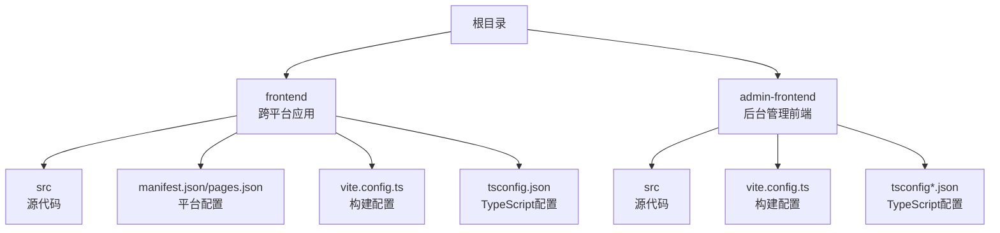
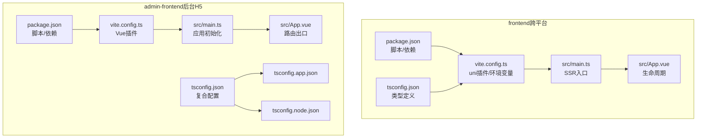
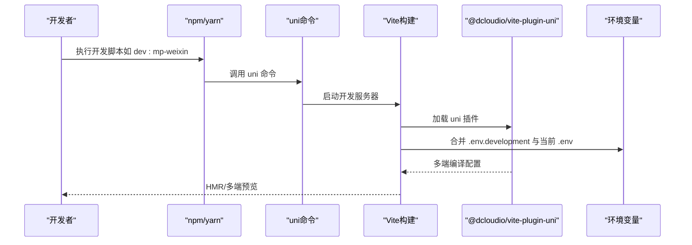
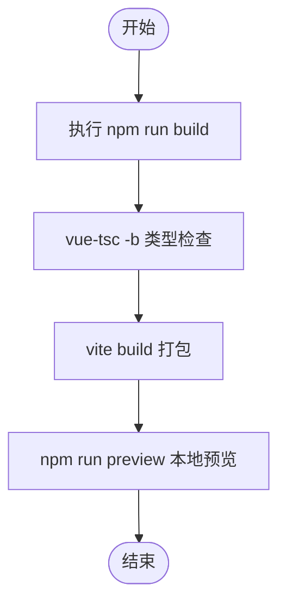
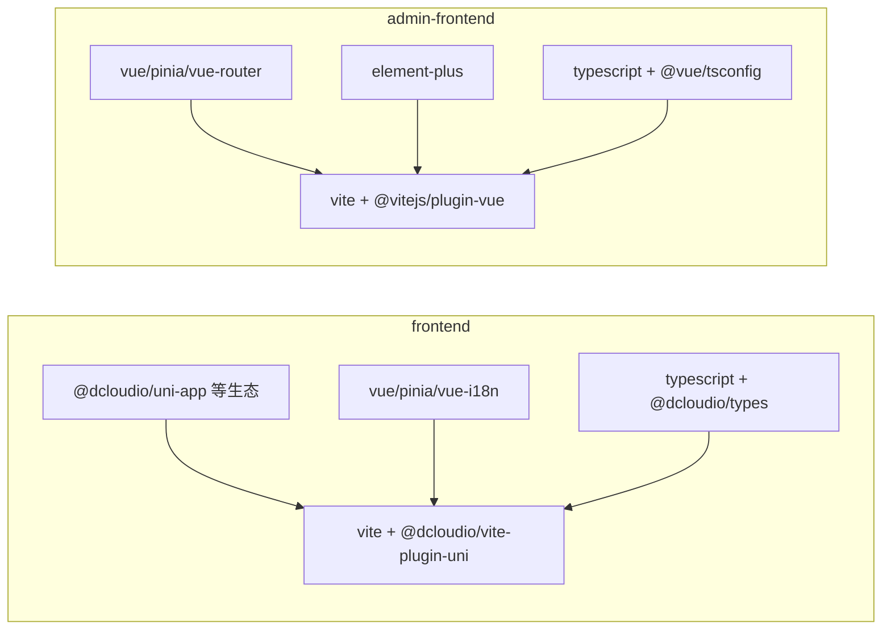

# 前端开发环境配置

<cite>
**本文档引用的文件**
- [frontend/package.json](file://frontend/package.json)
- [admin-frontend/package.json](file://admin-frontend/package.json)
- [frontend/vite.config.ts](file://frontend/vite.config.ts)
- [admin-frontend/vite.config.ts](file://admin-frontend/vite.config.ts)
- [frontend/tsconfig.json](file://frontend/tsconfig.json)
- [admin-frontend/tsconfig.json](file://admin-frontend/tsconfig.json)
- [admin-frontend/tsconfig.app.json](file://admin-frontend/tsconfig.app.json)
- [admin-frontend/tsconfig.node.json](file://admin-frontend/tsconfig.node.json)
- [frontend/src/main.ts](file://frontend/src/main.ts)
- [frontend/src/App.vue](file://frontend/src/App.vue)
- [admin-frontend/src/main.ts](file://admin-frontend/src/main.ts)
- [admin-frontend/src/App.vue](file://admin-frontend/src/App.vue)
</cite>

## 目录
1. [简介](#简介)
2. [项目结构](#项目结构)
3. [核心组件](#核心组件)
4. [架构总览](#架构总览)
5. [详细组件分析](#详细组件分析)
6. [依赖分析](#依赖分析)
7. [性能考虑](#性能考虑)
8. [故障排除指南](#故障排除指南)
9. [结论](#结论)
10. [附录](#附录)

## 简介
本指南面向前端开发者，系统性介绍本仓库中两个前端子项目的开发环境搭建与运行方式，涵盖以下要点：
- Node.js 版本要求与安装建议
- npm/yarn 包管理器配置与使用
- uni-app 跨平台开发环境（H5 与小程序）配置
- H5 前端与 admin-frontend 小程序后台前端的依赖安装与构建流程
- frontend 与 admin-frontend 两项目 package.json 差异对比
- vite.config.ts 配置项说明与 API 基础地址注入机制
- TypeScript 配置与类型检查
- 开发服务器启动方式与常用命令（npm run dev/build/preview）
- uni-app 微信开发者工具接入、H5 预览与真机调试

## 项目结构
本仓库包含两个独立的前端项目：
- frontend：基于 uni-app 的跨平台应用，支持 H5、微信小程序、支付宝小程序、百度小程序等多个平台
- admin-frontend：基于 Vue 3 + Vite 的后台管理系统前端，主要面向 H5 浏览器环境

图表来源
- [frontend/package.json:1-78](file://frontend/package.json#L1-L78)
- [admin-frontend/package.json:1-27](file://admin-frontend/package.json#L1-L27)

章节来源
- [frontend/package.json:1-78](file://frontend/package.json#L1-L78)
- [admin-frontend/package.json:1-27](file://admin-frontend/package.json#L1-L27)

## 核心组件
- Node.js 与包管理器
  - frontend 项目要求 Node.js 版本不低于指定版本，推荐使用长期支持版本以获得最佳兼容性
  - 建议使用 npm 作为默认包管理器，如需使用 yarn，请确保版本兼容
- 构建工具
  - frontend 使用 uni-app 生态与 @dcloudio/vite-plugin-uni 插件进行多端构建
  - admin-frontend 使用 Vite + @vitejs/plugin-vue 进行 H5 环境构建
- 类型系统
  - frontend 使用 @dcloudio/types 提供 uni-app 平台类型定义
  - admin-frontend 使用 @vue/tsconfig 提供 Vue 3 + TypeScript 的基础配置，并拆分为 app 与 node 两类 tsconfig

章节来源
- [frontend/package.json:4-6](file://frontend/package.json#L4-L6)
- [frontend/tsconfig.json:13](file://frontend/tsconfig.json#L13)
- [admin-frontend/tsconfig.json:1-8](file://admin-frontend/tsconfig.json#L1-L8)
- [admin-frontend/tsconfig.app.json:2-12](file://admin-frontend/tsconfig.app.json#L2-L12)
- [admin-frontend/tsconfig.node.json:2-22](file://admin-frontend/tsconfig.node.json#L2-L22)

## 架构总览
下面的图示展示了两个前端项目的整体技术栈与构建链路：

图表来源
- [frontend/package.json:1-78](file://frontend/package.json#L1-L78)
- [frontend/vite.config.ts:1-23](file://frontend/vite.config.ts#L1-L23)
- [frontend/tsconfig.json:1-17](file://frontend/tsconfig.json#L1-L17)
- [frontend/src/main.ts:1-12](file://frontend/src/main.ts#L1-L12)
- [frontend/src/App.vue:1-77](file://frontend/src/App.vue#L1-L77)
- [admin-frontend/package.json:1-27](file://admin-frontend/package.json#L1-L27)
- [admin-frontend/vite.config.ts:1-8](file://admin-frontend/vite.config.ts#L1-L8)
- [admin-frontend/tsconfig.json:1-8](file://admin-frontend/tsconfig.json#L1-L8)
- [admin-frontend/tsconfig.app.json:1-14](file://admin-frontend/tsconfig.app.json#L1-L14)
- [admin-frontend/tsconfig.node.json:1-24](file://admin-frontend/tsconfig.node.json#L1-L24)
- [admin-frontend/src/main.ts:1-14](file://admin-frontend/src/main.ts#L1-L14)
- [admin-frontend/src/App.vue:1-4](file://admin-frontend/src/App.vue#L1-L4)

## 详细组件分析

### frontend（跨平台应用）配置分析
- 脚本与命令
  - 支持多种平台的开发与构建命令，例如 H5、微信小程序、支付宝小程序等
  - 提供 type-check 进行类型检查
- 依赖与平台支持
  - 统一版本号的 @dcloudio/uni-* 生态依赖，确保多端一致性
  - pinia、vue、vue-i18n 等核心依赖
- 构建配置
  - 使用 @dcloudio/vite-plugin-uni 插件
  - 通过 loadEnv 合并 development 与 primary 环境变量，确保开发模式下正确加载 .env.development
  - 通过 define 注入 VITE_API_BASE_URL 到 import.meta.env
- TypeScript
  - 扩展 @vue/tsconfig 的 tsconfig.json
  - 设置路径别名 @/* 指向 ./src/*
  - 引入 @dcloudio/types 类型定义
- 应用入口
  - SSR 入口函数 createApp 返回 app 实例，便于多端渲染

图表来源
- [frontend/package.json:7-41](file://frontend/package.json#L7-L41)
- [frontend/vite.config.ts:5-22](file://frontend/vite.config.ts#L5-L22)

章节来源
- [frontend/package.json:7-41](file://frontend/package.json#L7-L41)
- [frontend/vite.config.ts:5-22](file://frontend/vite.config.ts#L5-L22)
- [frontend/tsconfig.json:1-17](file://frontend/tsconfig.json#L1-L17)
- [frontend/src/main.ts:1-12](file://frontend/src/main.ts#L1-L12)
- [frontend/src/App.vue:10-28](file://frontend/src/App.vue#L10-L28)

### admin-frontend（后台管理前端）配置分析
- 脚本与命令
  - dev：启动 Vite 开发服务器
  - build：先进行类型检查，再打包构建
  - preview：本地预览生产构建产物
- 依赖与生态
  - Vue 3、Pinia、Vue Router、Element Plus
  - Vite、@vitejs/plugin-vue、typescript、vue-tsc
- 构建配置
  - 使用 @vitejs/plugin-vue 插件
  - 无额外 define 注入，直接由 Vite 处理
- TypeScript
  - 采用复合配置：tsconfig.json 引用 tsconfig.app.json 与 tsconfig.node.json
  - tsconfig.app.json 面向浏览器端应用
  - tsconfig.node.json 面向 Vite 配置文件与 Node 环境

图表来源
- [admin-frontend/package.json:6-10](file://admin-frontend/package.json#L6-L10)
- [admin-frontend/vite.config.ts:5-7](file://admin-frontend/vite.config.ts#L5-L7)
- [admin-frontend/tsconfig.json:1-8](file://admin-frontend/tsconfig.json#L1-L8)
- [admin-frontend/tsconfig.app.json:1-14](file://admin-frontend/tsconfig.app.json#L1-L14)
- [admin-frontend/tsconfig.node.json:1-24](file://admin-frontend/tsconfig.node.json#L1-L24)

章节来源
- [admin-frontend/package.json:6-10](file://admin-frontend/package.json#L6-L10)
- [admin-frontend/vite.config.ts:5-7](file://admin-frontend/vite.config.ts#L5-L7)
- [admin-frontend/tsconfig.json:1-8](file://admin-frontend/tsconfig.json#L1-L8)
- [admin-frontend/tsconfig.app.json:1-14](file://admin-frontend/tsconfig.app.json#L1-L14)
- [admin-frontend/tsconfig.node.json:1-24](file://admin-frontend/tsconfig.node.json#L1-L24)

### package.json 差异对比（frontend vs admin-frontend）
- 命令差异
  - frontend 使用 uni 与 uni build，支持多端开发与构建
  - admin-frontend 使用 vite 与 vite build，专注 H5 环境
- 依赖差异
  - frontend 依赖统一版本号的 @dcloudio/uni-* 生态，包含多端平台支持
  - admin-frontend 依赖 Vue 3 生态与 Element Plus，强调 UI 组件库
- 类型与脚本
  - frontend 通过 @dcloudio/types 提供 uni-app 类型
  - admin-frontend 通过 @vue/tsconfig 与复合 tsconfig 提供类型支持

章节来源
- [frontend/package.json:1-78](file://frontend/package.json#L1-L78)
- [admin-frontend/package.json:1-27](file://admin-frontend/package.json#L1-L27)

### vite.config.ts 配置详解
- frontend
  - 通过 loadEnv 合并 development 与当前 mode 的环境变量，解决部分构建场景下 mode 非 development 导致 .env.development 未加载的问题
  - 将 VITE_API_BASE_URL 注入到 import.meta.env，便于运行时访问
- admin-frontend
  - 仅启用 @vitejs/plugin-vue 插件，保持最小化配置

章节来源
- [frontend/vite.config.ts:5-22](file://frontend/vite.config.ts#L5-L22)
- [admin-frontend/vite.config.ts:1-8](file://admin-frontend/vite.config.ts#L1-L8)

### TypeScript 配置详解
- frontend
  - 使用 @vue/tsconfig 的 tsconfig.json，开启 verbatimModuleSyntax 等现代模块语法特性
  - 定义路径别名 @/*，引入 @dcloudio/types 类型
- admin-frontend
  - tsconfig.json 为复合配置，引用 tsconfig.app.json 与 tsconfig.node.json
  - tsconfig.app.json 面向浏览器端应用，启用 noUnusedLocals 等严格规则
  - tsconfig.node.json 面向 Vite 配置与 Node 环境，启用 bundler 模式相关选项

章节来源
- [frontend/tsconfig.json:1-17](file://frontend/tsconfig.json#L1-L17)
- [admin-frontend/tsconfig.json:1-8](file://admin-frontend/tsconfig.json#L1-L8)
- [admin-frontend/tsconfig.app.json:1-14](file://admin-frontend/tsconfig.app.json#L1-L14)
- [admin-frontend/tsconfig.node.json:1-24](file://admin-frontend/tsconfig.node.json#L1-L24)

### 应用入口与生命周期
- frontend
  - SSR 入口函数 createApp 返回 app 实例，便于多端渲染
  - 在 App.vue 中输出 API_BASE_URL 日志，便于真机调试核对
- admin-frontend
  - 在 main.ts 中注册 Pinia、Router、Element Plus，并挂载应用
  - App.vue 作为路由出口容器

章节来源
- [frontend/src/main.ts:1-12](file://frontend/src/main.ts#L1-L12)
- [frontend/src/App.vue:10-28](file://frontend/src/App.vue#L10-L28)
- [admin-frontend/src/main.ts:1-14](file://admin-frontend/src/main.ts#L1-L14)
- [admin-frontend/src/App.vue:1-4](file://admin-frontend/src/App.vue#L1-L4)

## 依赖分析
- 前端项目依赖关系概览

图表来源
- [frontend/package.json:42-76](file://frontend/package.json#L42-L76)
- [admin-frontend/package.json:11-25](file://admin-frontend/package.json#L11-L25)

章节来源
- [frontend/package.json:42-76](file://frontend/package.json#L42-L76)
- [admin-frontend/package.json:11-25](file://admin-frontend/package.json#L11-L25)

## 性能考虑
- 构建优化
  - 使用 Vite 的原生 ESM 与按需编译，提升开发体验
  - 建议在生产构建时开启压缩与 Tree Shaking
- 环境变量
  - 通过 define 注入常量可减少运行时判断开销
- 依赖精简
  - 仅保留必要平台依赖，避免不必要的包体积增长

## 故障排除指南
- 真机调试 API 地址核对
  - frontend 在 App.vue 中输出 API_BASE_URL，可在 vConsole 中查看是否为最新编译产物的局域网地址
- 环境变量未加载
  - frontend 的 vite.config.ts 已合并 development 与当前 mode 的环境变量，若仍异常，请确认 .env.development 与 .env 文件存在且键名正确
- HMR/多端编译问题
  - 若出现分包编译或组件缓存导致的路径错误，可参考 App.vue 中注释提示进行清理或强制生成对应组件资源

章节来源
- [frontend/src/App.vue:15-18](file://frontend/src/App.vue#L15-L18)
- [frontend/vite.config.ts:10-13](file://frontend/vite.config.ts#L10-L13)

## 结论
本指南提供了从环境准备到多端运行的完整路径。frontend 项目通过 uni-app 生态实现 H5 与多小程序平台的一致开发体验；admin-frontend 项目则专注于 H5 环境下的后台管理界面。建议开发者根据目标平台选择合适的命令与配置，并结合环境变量与类型检查保障开发质量。

## 附录

### 常用命令速查
- frontend
  - 开发：npm run dev:mp-weixin（或 dev:h5/dev:h5:ssr 等）
  - 构建：npm run build:mp-weixin（或 build:h5/build:h5:ssr 等）
  - 类型检查：npm run type-check
- admin-frontend
  - 开发：npm run dev
  - 构建：npm run build
  - 预览：npm run preview

章节来源
- [frontend/package.json:7-41](file://frontend/package.json#L7-L41)
- [admin-frontend/package.json:6-10](file://admin-frontend/package.json#L6-L10)

### uni-app 跨平台开发环境配置要点
- Node.js 版本满足要求
- 安装依赖后，使用 uni 命令启动对应平台的开发服务
- 通过 vite.config.ts 的环境变量注入，确保 API 基础地址在不同模式下正确生效
- 真机调试时，关注 vConsole 输出的 API_BASE_URL，确认为最新编译产物的局域网地址

章节来源
- [frontend/package.json:4-6](file://frontend/package.json#L4-L6)
- [frontend/vite.config.ts:5-22](file://frontend/vite.config.ts#L5-L22)
- [frontend/src/App.vue:15-18](file://frontend/src/App.vue#L15-L18)