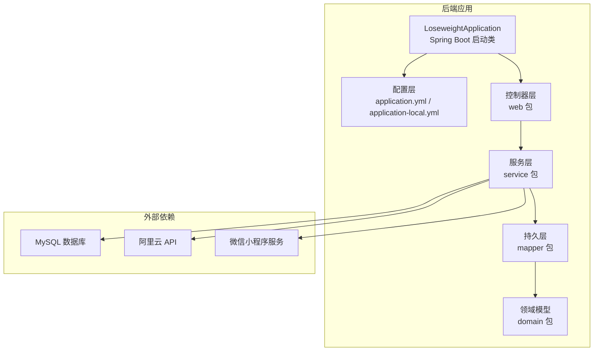
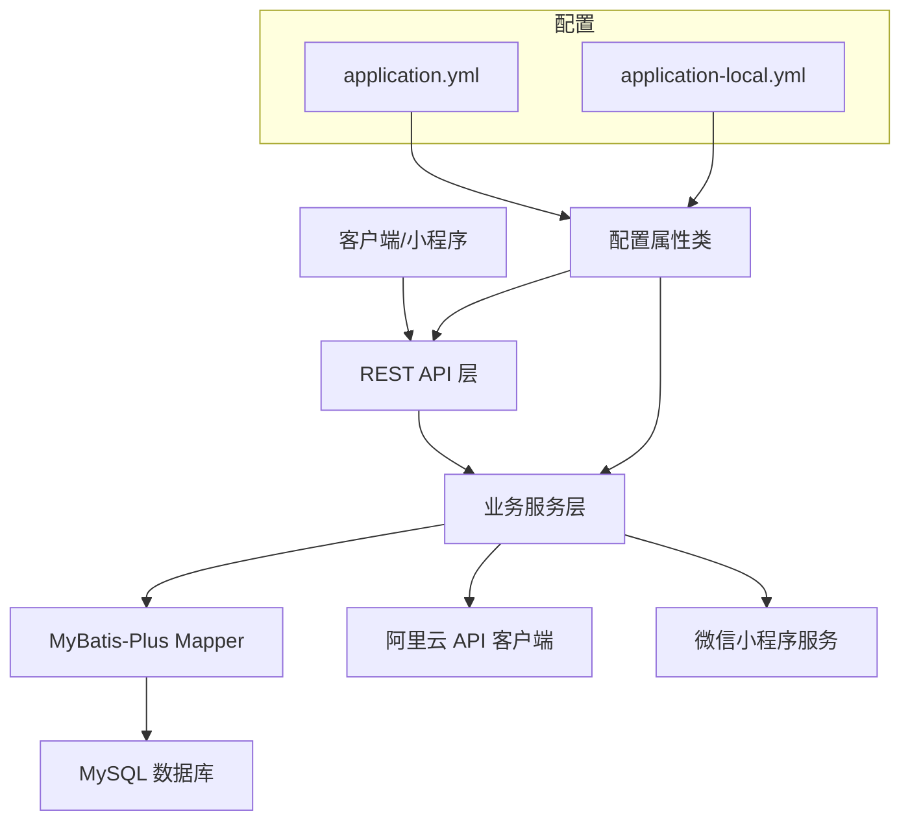
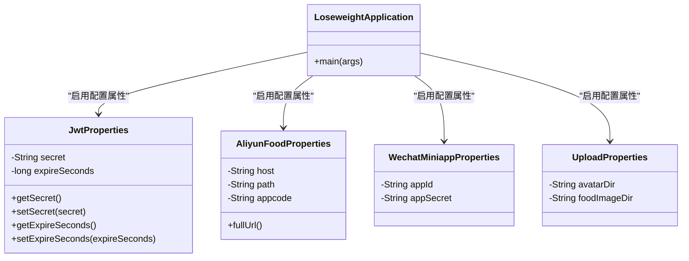
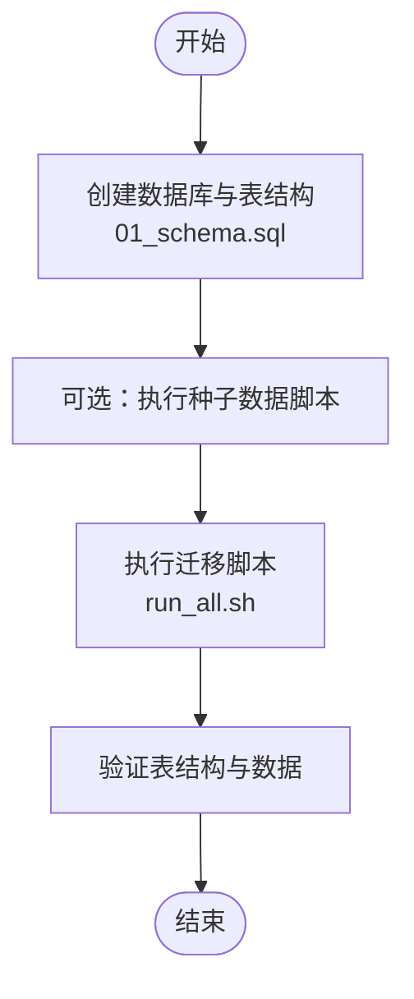
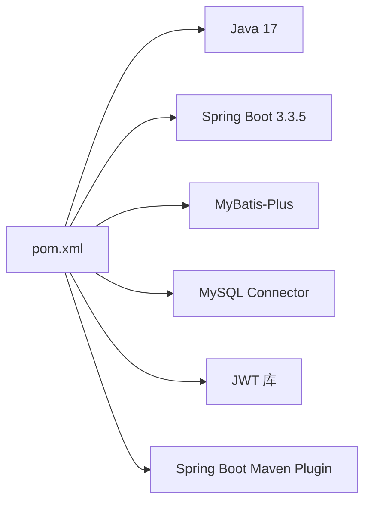
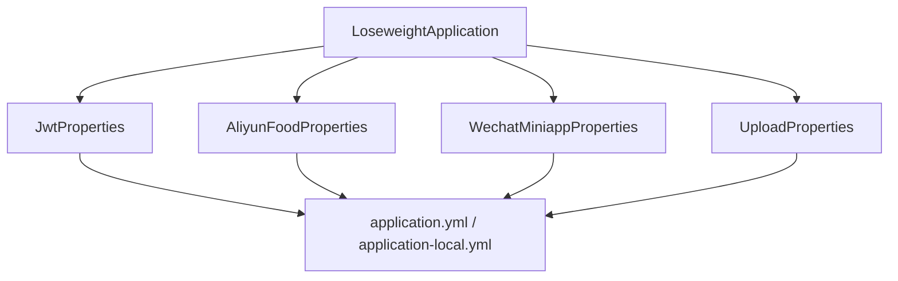

# 后端开发环境配置

<cite>
**本文引用的文件**
- [pom.xml](file://backend/pom.xml)
- [application.yml](file://backend/src/main/resources/application.yml)
- [application-local.yml](file://backend/src/main/resources/application-local.yml)
- [application-local.yml.example](file://backend/src/main/resources/application-local.yml.example)
- [LoseweightApplication.java](file://backend/src/main/java/com/ypfr/loseweight/LoseweightApplication.java)
- [JwtProperties.java](file://backend/src/main/java/com/ypfr/loseweight/config/JwtProperties.java)
- [AliyunFoodProperties.java](file://backend/src/main/java/com/ypfr/loseweight/config/AliyunFoodProperties.java)
- [WechatMiniappProperties.java](file://backend/src/main/java/com/ypfr/loseweight/config/WechatMiniappProperties.java)
- [UploadProperties.java](file://backend/src/main/java/com/ypfr/loseweight/config/UploadProperties.java)
- [WebConfig.java](file://backend/src/main/java/com/ypfr/loseweight/config/WebConfig.java)
- [01_schema.sql](file://database/01_schema.sql)
- [run_all.sh](file://database/migrations/run_all.sh)
</cite>

## 目录
1. [简介](#简介)
2. [项目结构](#项目结构)
3. [核心组件](#核心组件)
4. [架构概览](#架构概览)
5. [详细组件分析](#详细组件分析)
6. [依赖分析](#依赖分析)
7. [性能考虑](#性能考虑)
8. [故障排除指南](#故障排除指南)
9. [结论](#结论)
10. [附录](#附录)

## 简介
本指南面向后端开发者，提供从零搭建本项目开发环境的完整流程，涵盖以下内容：
- Java 17+ JDK 安装与验证
- Maven 环境配置与依赖下载
- Spring Boot 项目导入与编译
- 数据库初始化与连接配置
- 应用配置文件 application-local.yml 的各项参数说明
- 项目启动与运行方式
- 常见问题排查与解决方案

## 项目结构
后端采用 Spring Boot 3.3.5 + MyBatis-Plus 的标准工程结构，核心模块包括：
- 配置层：application.yml 与 application-local.yml 提供多环境配置
- 领域模型与持久层：mapper 接口与实体类
- 业务服务层：service 包含各类业务逻辑
- 控制器层：web 包含 REST 接口定义
- 工具与通用组件：util 与 common

**图表来源**
- [LoseweightApplication.java:1-26](file://backend/src/main/java/com/ypfr/loseweight/LoseweightApplication.java#L1-L26)
- [application.yml:1-54](file://backend/src/main/resources/application.yml#L1-L54)
- [pom.xml:1-86](file://backend/pom.xml#L1-L86)

**章节来源**
- [pom.xml:1-86](file://backend/pom.xml#L1-L86)
- [application.yml:1-54](file://backend/src/main/resources/application.yml#L1-L54)

## 核心组件
- Spring Boot 启动类负责扫描配置类与 Mapper 接口，启用多环境配置属性绑定
- 配置属性类用于强类型读取 application.yml 与 application-local.yml 中的配置项
- Web 配置提供跨域支持与 HTTP 客户端超时设置
- 数据源配置指向本地 MySQL 实例，MyBatis-Plus 提供 ORM 能力

**章节来源**
- [LoseweightApplication.java:1-26](file://backend/src/main/java/com/ypfr/loseweight/LoseweightApplication.java#L1-L26)
- [WebConfig.java:1-31](file://backend/src/main/java/com/ypfr/loseweight/config/WebConfig.java#L1-L31)
- [pom.xml:20-75](file://backend/pom.xml#L20-L75)

## 架构概览
后端系统以 Spring Boot 为核心，通过配置属性类将外部配置注入到各组件中。业务层通过 MyBatis-Plus 访问 MySQL 数据库，同时集成阿里云 API 与微信小程序服务。

**图表来源**
- [application.yml:1-54](file://backend/src/main/resources/application.yml#L1-L54)
- [application-local.yml:1-20](file://backend/src/main/resources/application-local.yml#L1-L20)
- [JwtProperties.java:1-29](file://backend/src/main/java/com/ypfr/loseweight/config/JwtProperties.java#L1-L29)
- [AliyunFoodProperties.java:1-44](file://backend/src/main/java/com/ypfr/loseweight/config/AliyunFoodProperties.java#L1-L44)
- [WechatMiniappProperties.java:1-28](file://backend/src/main/java/com/ypfr/loseweight/config/WechatMiniappProperties.java#L1-L28)

## 详细组件分析

### 配置文件与属性绑定
- application.yml：定义默认配置，包括数据库连接、服务器端口与地址、MyBatis-Plus 参数、微信小程序 App 信息、阿里云 API 默认值以及 JWT 默认密钥占位符
- application-local.yml：本地开发专用配置，覆盖敏感信息与本地化参数
- 配置属性类：
  - JwtProperties：读取 app.jwt.* 配置，包含密钥与过期秒数
  - AliyunFoodProperties：读取 aliyun.food.* 配置，包含主机、路径与 AppCode
  - WechatMiniappProperties：读取 wechat.miniapp.* 配置，包含 AppId 与 AppSecret
  - UploadProperties：读取 app.upload.* 配置，包含上传目录

**图表来源**
- [LoseweightApplication.java:14-19](file://backend/src/main/java/com/ypfr/loseweight/LoseweightApplication.java#L14-L19)
- [JwtProperties.java:1-29](file://backend/src/main/java/com/ypfr/loseweight/config/JwtProperties.java#L1-L29)
- [AliyunFoodProperties.java:1-44](file://backend/src/main/java/com/ypfr/loseweight/config/AliyunFoodProperties.java#L1-L44)
- [WechatMiniappProperties.java:1-28](file://backend/src/main/java/com/ypfr/loseweight/config/WechatMiniappProperties.java#L1-L28)
- [UploadProperties.java:1-30](file://backend/src/main/java/com/ypfr/loseweight/config/UploadProperties.java#L1-L30)

**章节来源**
- [application.yml:1-54](file://backend/src/main/resources/application.yml#L1-L54)
- [application-local.yml:1-20](file://backend/src/main/resources/application-local.yml#L1-L20)
- [application-local.yml.example:1-27](file://backend/src/main/resources/application-local.yml.example#L1-L27)
- [JwtProperties.java:1-29](file://backend/src/main/java/com/ypfr/loseweight/config/JwtProperties.java#L1-L29)
- [AliyunFoodProperties.java:1-44](file://backend/src/main/java/com/ypfr/loseweight/config/AliyunFoodProperties.java#L1-L44)
- [WechatMiniappProperties.java:1-28](file://backend/src/main/java/com/ypfr/loseweight/config/WechatMiniappProperties.java#L1-L28)
- [UploadProperties.java:1-30](file://backend/src/main/java/com/ypfr/loseweight/config/UploadProperties.java#L1-L30)

### 数据库初始化与连接
- 数据库初始化脚本：01_schema.sql 创建数据库与核心表结构
- 迁移脚本：migrations 目录包含版本化迁移脚本，run_all.sh 提供一键执行脚本（跳过可选脚本）
- 数据源配置：application.yml 与 application-local.yml 中的 spring.datasource.* 指定 JDBC URL、用户名与密码

**图表来源**
- [01_schema.sql:1-159](file://database/01_schema.sql#L1-L159)
- [run_all.sh:1-26](file://database/migrations/run_all.sh#L1-L26)

**章节来源**
- [01_schema.sql:1-159](file://database/01_schema.sql#L1-L159)
- [run_all.sh:1-26](file://database/migrations/run_all.sh#L1-L26)
- [application.yml:8-11](file://backend/src/main/resources/application.yml#L8-L11)

### 依赖与构建
- Java 版本：17
- 核心依赖：Spring Boot Starter Web、Validation、MyBatis-Plus、MySQL Connector、JWT
- 构建插件：spring-boot-maven-plugin

**图表来源**
- [pom.xml:20-75](file://backend/pom.xml#L20-L75)

**章节来源**
- [pom.xml:1-86](file://backend/pom.xml#L1-L86)

## 依赖分析
- 组件耦合：配置属性类通过注解绑定到 Spring 容器，启动类统一启用这些属性类
- 外部依赖：MySQL 用于持久化，阿里云 API 用于食物识别，微信小程序服务用于登录与授权
- 插件依赖：Maven 插件负责打包与运行

**图表来源**
- [LoseweightApplication.java:14-19](file://backend/src/main/java/com/ypfr/loseweight/LoseweightApplication.java#L14-L19)
- [application.yml:42-49](file://backend/src/main/resources/application.yml#L42-L49)
- [application-local.yml:4-20](file://backend/src/main/resources/application-local.yml#L4-L20)

**章节来源**
- [LoseweightApplication.java:1-26](file://backend/src/main/java/com/ypfr/loseweight/LoseweightApplication.java#L1-L26)
- [application.yml:1-54](file://backend/src/main/resources/application.yml#L1-L54)
- [application-local.yml:1-20](file://backend/src/main/resources/application-local.yml#L1-L20)

## 性能考虑
- MyBatis-Plus 日志级别：application.yml 中开启 SQL 日志，便于开发调试
- 服务器参数：application.yml 中设置 Tomcat 最大表单大小与吞吐量限制
- 上传文件大小：application.yml 中设置编码最大内存大小，避免大文件上传失败

**章节来源**
- [application.yml:21-28](file://backend/src/main/resources/application.yml#L21-L28)
- [application.yml:6-7](file://backend/src/main/resources/application.yml#L6-L7)
- [application.yml:17-19](file://backend/src/main/resources/application.yml#L17-L19)

## 故障排除指南

### 端口占用
- 现象：启动时报端口冲突
- 解决：修改 application.yml 中 server.port 为其他可用端口

**章节来源**
- [application.yml:13-14](file://backend/src/main/resources/application.yml#L13-L14)

### 数据库连接失败
- 现象：应用启动时报数据库连接异常
- 排查步骤：
  - 确认 MySQL 服务已启动
  - 校验 application.yml 与 application-local.yml 中的 spring.datasource.url、username、password
  - 使用 01_schema.sql 初始化数据库与表结构
  - 使用 run_all.sh 执行迁移脚本

**章节来源**
- [application.yml:8-11](file://backend/src/main/resources/application.yml#L8-L11)
- [application-local.yml:4-8](file://backend/src/main/resources/application-local.yml#L4-L8)
- [01_schema.sql:1-159](file://database/01_schema.sql#L1-L159)
- [run_all.sh:1-26](file://database/migrations/run_all.sh#L1-L26)

### JWT 配置错误
- 现象：登录或鉴权失败
- 排查步骤：
  - 确认 application-local.yml 中 app.jwt.secret 至少 32 字符且与前端一致
  - 确认 app.jwt.expire-seconds 合理（秒）

**章节来源**
- [application.yml:42-46](file://backend/src/main/resources/application.yml#L42-L46)
- [application-local.yml.example:23-27](file://backend/src/main/resources/application-local.yml.example#L23-L27)

### 阿里云 API 配置错误
- 现象：食物识别功能异常
- 排查步骤：
  - 在 application-local.yml 中填写有效的 aliyun.food.appcode
  - 校验 aliyun.food.host 与 path 正确性

**章节来源**
- [application.yml:36-41](file://backend/src/main/resources/application.yml#L36-L41)
- [application-local.yml:14-20](file://backend/src/main/resources/application-local.yml#L14-L20)
- [application-local.yml.example:16-22](file://backend/src/main/resources/application-local.yml.example#L16-L22)

### 微信小程序配置不一致
- 现象：微信登录失败或 code 校验异常
- 排查步骤：
  - 确保 wechat.miniapp.app-id 与小程序后台一致
  - 确保 wechat.miniapp.app-secret 与小程序后台一致

**章节来源**
- [application.yml:31-34](file://backend/src/main/resources/application.yml#L31-L34)
- [application-local.yml:10-12](file://backend/src/main/resources/application-local.yml#L10-L12)

### 上传目录权限问题
- 现象：头像或食物图片上传失败
- 排查步骤：
  - 确认 app.upload.avatar-dir 与 app.upload.food-image-dir 指向的目录存在且可写
  - 若使用相对路径，确认运行目录正确

**章节来源**
- [application.yml:47-49](file://backend/src/main/resources/application.yml#L47-L49)
- [UploadProperties.java:8-12](file://backend/src/main/java/com/ypfr/loseweight/config/UploadProperties.java#L8-L12)

## 结论
按照本指南完成 JDK、Maven、数据库与配置文件的准备后，即可顺利编译并运行后端服务。建议在本地开发环境中优先使用 application-local.yml 覆盖敏感配置，确保生产安全。

## 附录

### 环境准备与安装
- Java 17+ JDK：从官方渠道下载并配置 JAVA_HOME 与 PATH
- Maven：安装并配置本地仓库，确保网络可访问中央仓库

### 项目导入与编译
- 导入项目：使用 IDE 导入 backend 目录下的 Maven 项目
- 下载依赖：执行 Maven 依赖下载
- 编译打包：执行 mvn clean install

**章节来源**
- [pom.xml:77-84](file://backend/pom.xml#L77-L84)

### 数据库初始化步骤
- 初始化数据库与表结构：执行 01_schema.sql
- 执行迁移脚本：使用 run_all.sh（跳过可选脚本）
- 验证数据：检查核心表是否创建成功

**章节来源**
- [01_schema.sql:1-159](file://database/01_schema.sql#L1-L159)
- [run_all.sh:1-26](file://database/migrations/run_all.sh#L1-L26)

### 应用配置项详解
- 数据库连接
  - spring.datasource.url：JDBC 连接字符串
  - spring.datasource.username：数据库用户名
  - spring.datasource.password：数据库密码
- 服务器配置
  - server.port：HTTP 服务端口
  - server.address：监听地址（0.0.0.0 便于局域网访问）
  - server.tomcat.max-http-form-post-size：表单上传大小限制
  - server.tomcat.max-swallow-size：读取超时限制
- MyBatis-Plus
  - mybatis-plus.configuration.map-underscore-to-camel-case：下划线转驼峰
  - mybatis-plus.configuration.log-impl：SQL 日志实现
  - mybatis-plus.global-config.db-config.id-type：主键策略
- 微信小程序
  - wechat.miniapp.app-id：小程序 AppId
  - wechat.miniapp.app-secret：小程序 AppSecret
- 阿里云 API
  - aliyun.food.host：服务主机
  - aliyun.food.path：请求路径
  - aliyun.food.appcode：阿里云 AppCode
- JWT
  - app.jwt.secret：HS256 密钥（至少 32 字符）
  - app.jwt.expire-seconds：过期时间（秒）
- 上传配置
  - app.upload.avatar-dir：头像存储目录
  - app.upload.food-image-dir：食物图片存储目录

**章节来源**
- [application.yml:1-54](file://backend/src/main/resources/application.yml#L1-L54)
- [application-local.yml:1-20](file://backend/src/main/resources/application-local.yml#L1-L20)
- [application-local.yml.example:1-27](file://backend/src/main/resources/application-local.yml.example#L1-L27)

### 启动与运行
- 本地开发启动：使用 IDE 运行 LoseweightApplication.main() 或通过 Maven 插件启动
- 打包运行：执行 mvn clean install 后，使用 java -jar target/loseweight-api-0.0.1-SNAPSHOT.jar 启动

**章节来源**
- [LoseweightApplication.java:22-24](file://backend/src/main/java/com/ypfr/loseweight/LoseweightApplication.java#L22-L24)
- [pom.xml:77-84](file://backend/pom.xml#L77-L84)