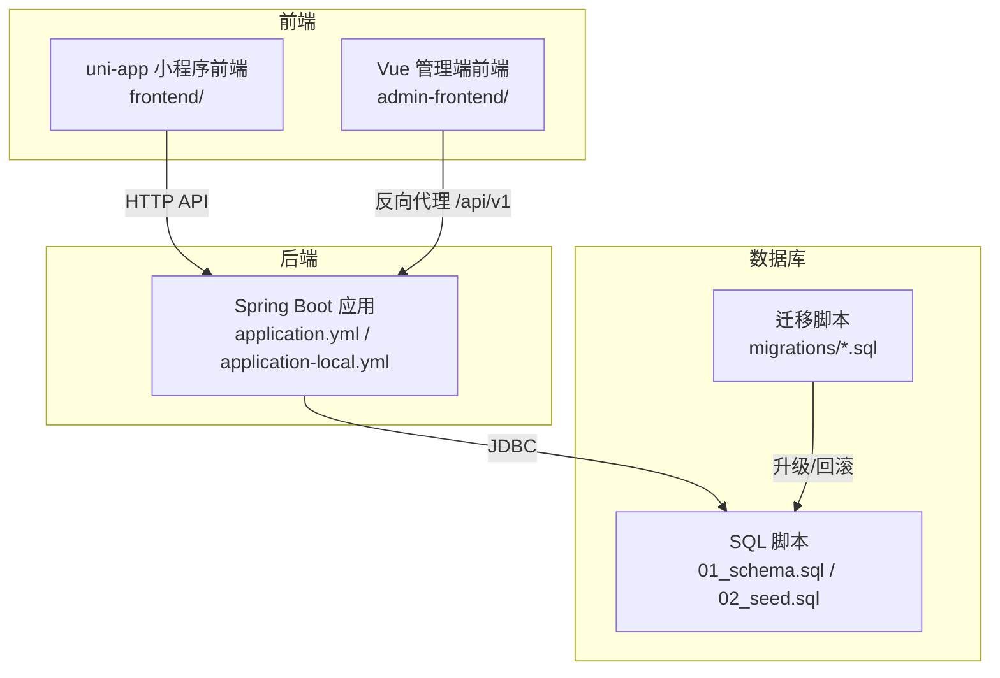
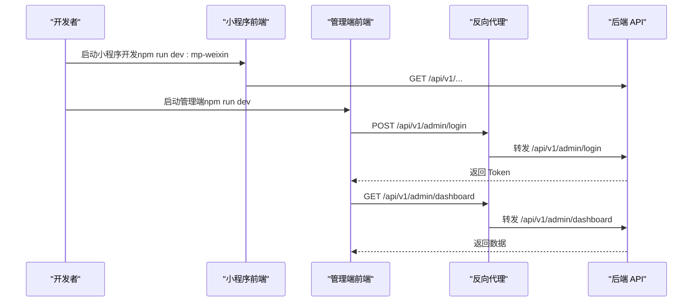
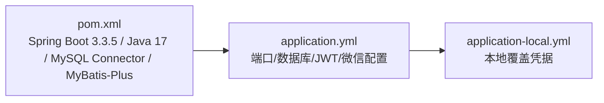

# 开发环境搭建

<cite>
**本文引用的文件**
- [backend/pom.xml](file://backend/pom.xml)
- [backend/src/main/resources/application.yml](file://backend/src/main/resources/application.yml)
- [backend/src/main/resources/application-local.yml](file://backend/src/main/resources/application-local.yml)
- [frontend/package.json](file://frontend/package.json)
- [admin-frontend/package.json](file://admin-frontend/package.json)
- [frontend/vite.config.ts](file://frontend/vite.config.ts)
- [admin-frontend/vite.config.ts](file://admin-frontend/vite.config.ts)
- [frontend/src/config/api.ts](file://frontend/src/config/api.ts)
- [admin-frontend/src/api/http.ts](file://admin-frontend/src/api/http.ts)
- [database/01_schema.sql](file://database/01_schema.sql)
- [database/02_seed.sql](file://database/02_seed.sql)
- [database/migrations/run_all.sh](file://database/migrations/run_all.sh)
- [database/migrations/run_all.ps1](file://database/migrations/run_all.ps1)
- [scripts/init-project.js](file://scripts/init-project.js)
</cite>

## 目录
1. [简介](#简介)
2. [项目结构](#项目结构)
3. [核心组件](#核心组件)
4. [架构总览](#架构总览)
5. [详细组件分析](#详细组件分析)
6. [依赖关系分析](#依赖关系分析)
7. [性能考虑](#性能考虑)
8. [故障排除指南](#故障排除指南)
9. [结论](#结论)
10. [附录](#附录)

## 简介
本指南面向首次参与“吃多少”项目的开发者，提供从零搭建完整本地开发环境的操作手册。内容涵盖：
- 环境要求（Java 17+、Node.js、MySQL 等）
- 后端开发环境配置（Spring Boot 项目设置、数据库连接配置）
- 前端开发环境配置（uni-app 项目设置、依赖安装）
- 数据库初始化（MySQL 安装、表结构创建、种子数据导入）
- 常见问题与调试技巧

## 项目结构
项目采用前后端分离架构，包含后端 Spring Boot API、小程序前端 uni-app、管理端前端 Vue、数据库脚本与迁移工具。

图表来源
- [backend/src/main/resources/application.yml:1-54](file://backend/src/main/resources/application.yml#L1-L54)
- [frontend/src/config/api.ts:1-42](file://frontend/src/config/api.ts#L1-L42)
- [admin-frontend/src/api/http.ts:1-31](file://admin-frontend/src/api/http.ts#L1-L31)
- [database/01_schema.sql:1-159](file://database/01_schema.sql#L1-L159)
- [database/migrations/run_all.sh:1-26](file://database/migrations/run_all.sh#L1-L26)

章节来源
- [backend/src/main/resources/application.yml:1-54](file://backend/src/main/resources/application.yml#L1-L54)
- [frontend/package.json:1-78](file://frontend/package.json#L1-L78)
- [admin-frontend/package.json:1-27](file://admin-frontend/package.json#L1-L27)

## 核心组件
- 后端服务
  - Spring Boot 版本：3.3.5
  - Java 版本：17
  - 数据库驱动：MySQL Connector/J
  - ORM：MyBatis-Plus
- 前端
  - 小程序前端：uni-app（支持多端，重点为微信小程序）
  - 管理端前端：Vue + Vite
- 数据库
  - MySQL 8.0+（utf8mb4 字符集）
  - 提供完整建表与种子数据脚本

章节来源
- [backend/pom.xml:1-86](file://backend/pom.xml#L1-L86)
- [frontend/package.json:1-78](file://frontend/package.json#L1-L78)
- [admin-frontend/package.json:1-27](file://admin-frontend/package.json#L1-L27)

## 架构总览
后端以 Spring Boot 提供 REST API，前端通过 HTTP 请求访问。管理端前端通过 Nginx 反向代理将 /api/v1 请求转发至后端。

图表来源
- [frontend/src/config/api.ts:1-42](file://frontend/src/config/api.ts#L1-L42)
- [admin-frontend/src/api/http.ts:1-31](file://admin-frontend/src/api/http.ts#L1-L31)
- [backend/src/main/resources/application.yml:13-20](file://backend/src/main/resources/application.yml#L13-L20)

## 详细组件分析

### 环境要求与安装
- Java 17+
  - 用于编译与运行 Spring Boot 后端
  - Maven 3.6+（随 Spring Boot 插件使用）
- Node.js 20.12.2+
  - 用于 uni-app 与管理端前端构建
- MySQL 8.0+
  - 提供数据库实例与字符集 utf8mb4

章节来源
- [backend/pom.xml:20-23](file://backend/pom.xml#L20-L23)
- [frontend/package.json:4-6](file://frontend/package.json#L4-L6)
- [database/01_schema.sql:4-6](file://database/01_schema.sql#L4-L6)

### 后端开发环境配置（Spring Boot）
- 应用配置
  - 默认端口：8080
  - 监听地址：0.0.0.0（便于真机访问）
  - MyBatis-Plus：下划线转驼峰、日志实现
- 数据库连接
  - 默认连接：jdbc:mysql://127.0.0.1:3306/loseweight
  - 用户名/密码：见 application.yml 与 application-local.yml
  - 本地覆盖：复制 application-local.yml.example 并填写真实凭据
- 微信小程序配置
  - AppID/AppSecret：在 application.yml 中定义
  - 本地开发建议保持与小程序工程一致，避免 code2session 不匹配
- JWT 配置
  - secret：至少 32 字节随机串（本地覆盖）
  - 过期秒数：7 天
- 上传目录
  - 头像与食物图片存储路径：./uploads/avatars、./uploads/food-images

章节来源
- [backend/src/main/resources/application.yml:1-54](file://backend/src/main/resources/application.yml#L1-L54)
- [backend/src/main/resources/application-local.yml:1-20](file://backend/src/main/resources/application-local.yml#L1-L20)

### 前端开发环境配置（uni-app）
- 小程序前端
  - 工作目录：frontend
  - 启动命令：npm run dev:mp-weixin
  - 真机调试：将 API_BASE_URL 改为本机局域网 IP + 端口（8080），并在微信开发者工具勾选“开发环境不校验域名”
  - 环境变量
    - VITE_API_BASE_URL：后端根地址（默认 http://127.0.0.1:8080）
    - VITE_API_PATH_PREFIX：REST 路径前缀（默认 /api/v1）
    - VITE_DEV_USER_ID：未登录联调时的默认用户 ID（默认 1）
- 管理端前端
  - 工作目录：admin-frontend
  - 启动命令：npm run dev
  - 反向代理：/api/v1 → 后端（由 Nginx 或 Vite Dev Server 配置）

章节来源
- [frontend/package.json:7-40](file://frontend/package.json#L7-L40)
- [frontend/vite.config.ts:1-23](file://frontend/vite.config.ts#L1-L23)
- [frontend/src/config/api.ts:1-42](file://frontend/src/config/api.ts#L1-L42)
- [admin-frontend/package.json:6-10](file://admin-frontend/package.json#L6-L10)
- [admin-frontend/vite.config.ts:1-8](file://admin-frontend/vite.config.ts#L1-L8)
- [admin-frontend/src/api/http.ts:1-31](file://admin-frontend/src/api/http.ts#L1-L31)

### 数据库初始化（MySQL）
- 方案一：直接执行 SQL
  - 建库与建表：执行 database/01_schema.sql
  - 种子数据：执行 database/02_seed.sql
- 方案二：使用迁移脚本
  - Linux/macOS：bash database/migrations/run_all.sh root 127.0.0.1 3306 loseweight
  - Windows：powershell -ExecutionPolicy ByPass -File database/migrations/run_all.ps1 -User root -Database loseweight
  - 注意：默认跳过 V014（可选删除旧表）脚本

章节来源
- [database/01_schema.sql:1-159](file://database/01_schema.sql#L1-L159)
- [database/02_seed.sql:1-2004](file://database/02_seed.sql#L1-L2004)
- [database/migrations/run_all.sh:1-26](file://database/migrations/run_all.sh#L1-L26)
- [database/migrations/run_all.ps1:1-34](file://database/migrations/run_all.ps1#L1-L34)

### 项目初始化脚本（可选）
- scripts/init-project.js
  - 自动克隆 uni-app 模板、安装依赖、清理示例页面与入口文件
  - 适合首次初始化前端项目

章节来源
- [scripts/init-project.js:1-122](file://scripts/init-project.js#L1-L122)

## 依赖关系分析
后端依赖关系示意：

图表来源
- [backend/pom.xml:1-86](file://backend/pom.xml#L1-L86)
- [backend/src/main/resources/application.yml:1-54](file://backend/src/main/resources/application.yml#L1-L54)
- [backend/src/main/resources/application-local.yml:1-20](file://backend/src/main/resources/application-local.yml#L1-L20)

章节来源
- [backend/pom.xml:1-86](file://backend/pom.xml#L1-L86)
- [backend/src/main/resources/application.yml:1-54](file://backend/src/main/resources/application.yml#L1-L54)
- [backend/src/main/resources/application-local.yml:1-20](file://backend/src/main/resources/application-local.yml#L1-L20)

## 性能考虑
- 后端
  - MyBatis-Plus：开启下划线转驼峰映射，减少手动映射成本
  - Tomcat 参数：增大表单与吞吐大小，适配前端上传场景
- 前端
  - 小程序端：合理拆分模块、按需引入组件，避免一次性加载过多资源
  - 管理端：Vite 默认启用缓存与预构建，开发体验更佳

章节来源
- [backend/src/main/resources/application.yml:13-20](file://backend/src/main/resources/application.yml#L13-L20)

## 故障排除指南
- 后端无法连接数据库
  - 检查 application.yml 与 application-local.yml 的用户名/密码
  - 确认 MySQL 实例运行且网络可达
- 小程序真机调试报跨域
  - 将 VITE_API_BASE_URL 改为本机局域网 IP + 端口（8080）
  - 在微信开发者工具勾选“开发环境不校验域名”
- 管理端登录失败
  - 确认 Nginx 已将 /api/v1/admin/* 转发至后端
  - 检查后端 JWT secret 是否在 application-local.yml 中正确覆盖
- 数据库迁移失败
  - Linux/macOS：确认 mysql 客户端在 PATH 中
  - Windows：以管理员权限运行 PowerShell，并启用执行策略
- uni-app 初始化失败
  - 确认 Node.js 版本满足 package.json 引擎要求
  - 检查网络连通性（degit 模板下载）

章节来源
- [frontend/src/config/api.ts:1-42](file://frontend/src/config/api.ts#L1-L42)
- [admin-frontend/src/api/http.ts:1-31](file://admin-frontend/src/api/http.ts#L1-L31)
- [database/migrations/run_all.sh:1-26](file://database/migrations/run_all.sh#L1-L26)
- [database/migrations/run_all.ps1:1-34](file://database/migrations/run_all.ps1#L1-L34)
- [frontend/package.json:4-6](file://frontend/package.json#L4-L6)
- [scripts/init-project.js:1-122](file://scripts/init-project.js#L1-L122)

## 结论
按照本指南完成环境准备与配置后，您可以在本地顺利启动后端 API、小程序前端与管理端前端，并完成数据库初始化。遇到问题时，可依据“故障排除指南”逐项排查。

## 附录

### 常用命令清单
- 后端
  - 启动：mvn spring-boot:run 或 IDE 直接运行主类
- 前端（小程序）
  - 进入 frontend 目录，执行 npm run dev:mp-weixin
- 前端（管理端）
  - 进入 admin-frontend 目录，执行 npm run dev
- 数据库
  - 直接执行 SQL：mysql -u root -p < database/01_schema.sql
  - 执行种子：mysql -u root -p < database/02_seed.sql
  - 使用迁移脚本：Linux/macOS 执行 run_all.sh；Windows 执行 run_all.ps1

章节来源
- [frontend/package.json:7-40](file://frontend/package.json#L7-L40)
- [admin-frontend/package.json:6-10](file://admin-frontend/package.json#L6-L10)
- [database/01_schema.sql:1-159](file://database/01_schema.sql#L1-L159)
- [database/02_seed.sql:1-2004](file://database/02_seed.sql#L1-L2004)
- [database/migrations/run_all.sh:1-26](file://database/migrations/run_all.sh#L1-L26)
- [database/migrations/run_all.ps1:1-34](file://database/migrations/run_all.ps1#L1-L34)