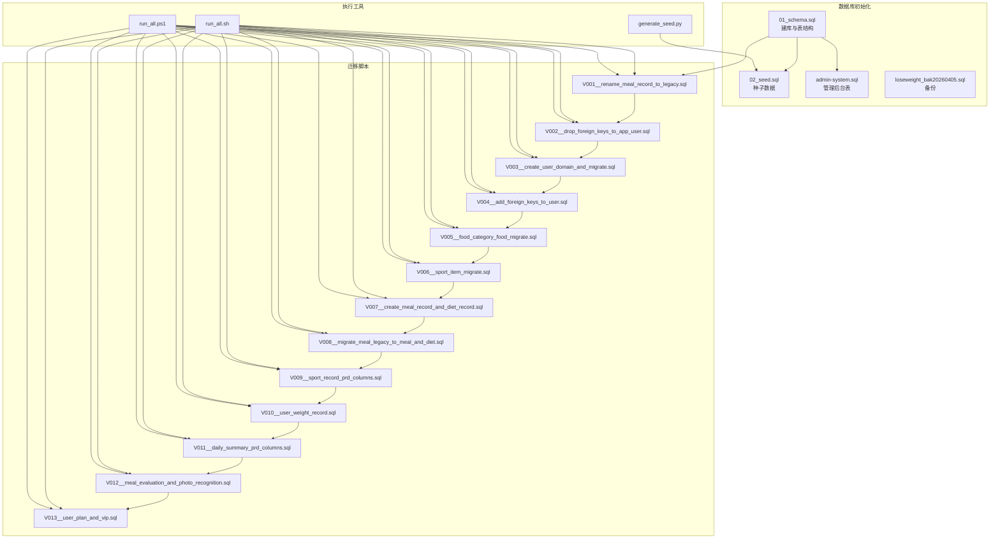
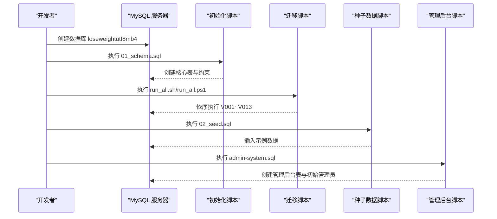
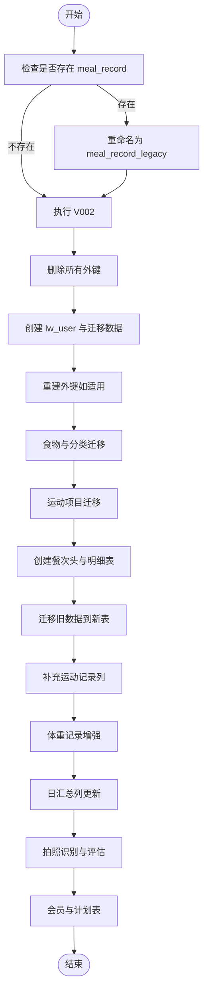
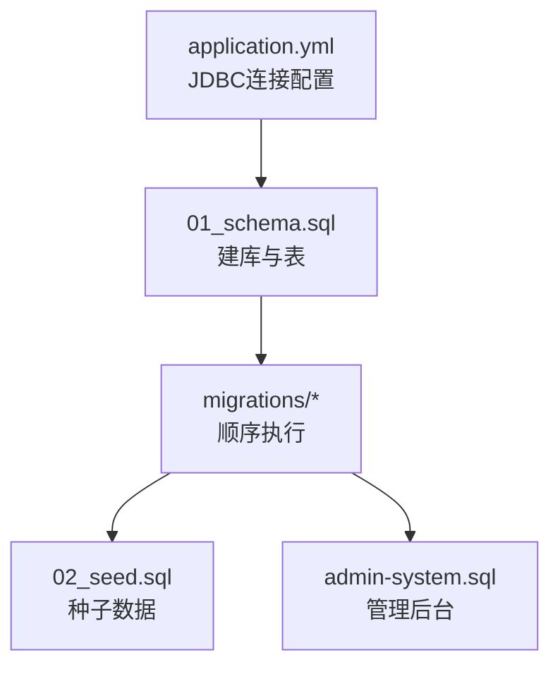

# 数据库初始化配置

<cite>
**本文档引用的文件**
- [01_schema.sql](file://database/01_schema.sql)
- [02_seed.sql](file://database/02_seed.sql)
- [admin-system.sql](file://database/admin-system.sql)
- [project_current_baseline_alignment.sql](file://database/project_current_baseline_alignment.sql)
- [run_all.sh](file://database/migrations/run_all.sh)
- [run_all.ps1](file://database/migrations/run_all.ps1)
- [application.yml](file://backend/src/main/resources/application.yml)
- [generate_seed.py](file://database/scripts/generate_seed.py)
- [V001__rename_meal_record_to_legacy.sql](file://database/migrations/V001__rename_meal_record_to_legacy.sql)
- [V002__drop_foreign_keys_to_app_user.sql](file://database/migrations/V002__drop_foreign_keys_to_app_user.sql)
- [V003__create_user_domain_and_migrate.sql](file://database/migrations/V003__create_user_domain_and_migrate.sql)
- [V013__user_plan_and_vip.sql](file://database/migrations/V013__user_plan_and_vip.sql)
</cite>

## 目录
1. [简介](#简介)
2. [项目结构](#项目结构)
3. [核心组件](#核心组件)
4. [架构总览](#架构总览)
5. [详细组件分析](#详细组件分析)
6. [依赖关系分析](#依赖关系分析)
7. [性能考虑](#性能考虑)
8. [故障排除指南](#故障排除指南)
9. [结论](#结论)
10. [附录](#附录)

## 简介
本指南面向数据库初始化与运维场景，涵盖 MySQL 8.0+ 安装与配置、数据库与字符集设置、表结构初始化、种子数据导入、数据库迁移脚本执行、索引与外键约束策略、SQL 脚本执行顺序、数据导入工具使用、备份与恢复流程、性能调优与监控配置，以及常见问题诊断与解决方法。文档基于仓库中的数据库脚本与配置文件进行整理，确保与实际代码实现保持一致。

## 项目结构
数据库相关资源主要位于 database 目录，包含：
- 初始化脚本：01_schema.sql、02_seed.sql、03_wechat_login_log.sql、04_app_user_phone.sql、05_app_user_profile_completed.sql
- 管理后台脚本：admin-system.sql
- 基线对齐脚本：project_current_baseline_alignment.sql
- 迁移脚本：migrations/V001__*.sql 至 V013__*.sql
- 迁移执行脚本：migrations/run_all.sh、migrations/run_all.ps1
- 数据生成脚本：scripts/generate_seed.py
- 备份文件：loseweight_bak20260405.sql

图表来源
- [01_schema.sql:1-159](file://database/01_schema.sql#L1-L159)
- [02_seed.sql:1-800](file://database/02_seed.sql#L1-L800)
- [admin-system.sql:1-37](file://database/admin-system.sql#L1-L37)
- [project_current_baseline_alignment.sql:1-786](file://database/project_current_baseline_alignment.sql#L1-L786)
- [run_all.sh:1-26](file://database/migrations/run_all.sh#L1-L26)
- [run_all.ps1:1-34](file://database/migrations/run_all.ps1#L1-L34)
- [generate_seed.py:1-315](file://database/scripts/generate_seed.py#L1-L315)

章节来源
- [01_schema.sql:1-159](file://database/01_schema.sql#L1-L159)
- [02_seed.sql:1-800](file://database/02_seed.sql#L1-L800)
- [admin-system.sql:1-37](file://database/admin-system.sql#L1-L37)
- [project_current_baseline_alignment.sql:1-786](file://database/project_current_baseline_alignment.sql#L1-L786)
- [run_all.sh:1-26](file://database/migrations/run_all.sh#L1-L26)
- [run_all.ps1:1-34](file://database/migrations/run_all.ps1#L1-L34)
- [generate_seed.py:1-315](file://database/scripts/generate_seed.py#L1-L315)

## 核心组件
- 数据库与字符集：默认字符集 utf8mb4，排序规则 utf8mb4_unicode_ci，确保支持表情符号与多语言。
- 用户域与预算配置：lw_user、user_profile、user_budget_config 三表分离用户基本信息、档案与预算配置，提升扩展性。
- 餐次与饮食记录：meal_record（餐次头）与 diet_record（具体食物明细）分离设计，便于统计与分析。
- 运动与体重：sport_record（支持项目库映射）与 user_weight_record（含来源与备注）。
- 拍照识别与评估：meal_photo_recognition、meal_evaluation 提升智能识别与反馈能力。
- 管理后台：admin_user、admin_login_log，支持后台登录与审计。
- 迁移体系：V001-V013 逐步演进，支持可重复执行与幂等对齐脚本。

章节来源
- [01_schema.sql:4-6](file://database/01_schema.sql#L4-L6)
- [01_schema.sql:11-34](file://database/01_schema.sql#L11-L34)
- [01_schema.sql:37-54](file://database/01_schema.sql#L37-L54)
- [01_schema.sql:57-69](file://database/01_schema.sql#L57-L69)
- [01_schema.sql:72-81](file://database/01_schema.sql#L72-L81)
- [01_schema.sql:84-96](file://database/01_schema.sql#L84-L96)
- [01_schema.sql:99-108](file://database/01_schema.sql#L99-L108)
- [01_schema.sql:111-124](file://database/01_schema.sql#L111-L124)
- [01_schema.sql:127-141](file://database/01_schema.sql#L127-L141)
- [01_schema.sql:144-158](file://database/01_schema.sql#L144-L158)
- [admin-system.sql:7-29](file://database/admin-system.sql#L7-L29)
- [project_current_baseline_alignment.sql:131-190](file://database/project_current_baseline_alignment.sql#L131-L190)
- [project_current_baseline_alignment.sql:230-276](file://database/project_current_baseline_alignment.sql#L230-L276)
- [project_current_baseline_alignment.sql:278-314](file://database/project_current_baseline_alignment.sql#L278-L314)
- [project_current_baseline_alignment.sql:316-327](file://database/project_current_baseline_alignment.sql#L316-L327)
- [project_current_baseline_alignment.sql:357-396](file://database/project_current_baseline_alignment.sql#L357-L396)
- [project_current_baseline_alignment.sql:398-414](file://database/project_current_baseline_alignment.sql#L398-L414)
- [project_current_baseline_alignment.sql:416-430](file://database/project_current_baseline_alignment.sql#L416-L430)
- [project_current_baseline_alignment.sql:432-477](file://database/project_current_baseline_alignment.sql#L432-L477)

## 架构总览
数据库初始化与迁移采用“建库-建表-迁移-导入”的分层流程，确保可重复执行与幂等性。

图表来源
- [01_schema.sql:4-6](file://database/01_schema.sql#L4-L6)
- [run_all.sh:15-23](file://database/migrations/run_all.sh#L15-L23)
- [run_all.ps1:19-31](file://database/migrations/run_all.ps1#L19-L31)
- [02_seed.sql:1-800](file://database/02_seed.sql#L1-L800)
- [admin-system.sql:1-37](file://database/admin-system.sql#L1-L37)

## 详细组件分析

### 组件A：数据库与字符集配置
- 建库脚本明确指定 DEFAULT CHARACTER SET utf8mb4 与 COLLATE utf8mb4_unicode_ci，确保多语言与表情符号兼容。
- 迁移脚本与种子脚本均使用 SET NAMES utf8mb4，保证连接字符集一致性。
- 建议在 MySQL 8.0+ 上设置默认字符集与排序规则，避免历史版本默认字符集导致的兼容问题。

章节来源
- [01_schema.sql:4-6](file://database/01_schema.sql#L4-L6)
- [02_seed.sql:5-5](file://database/02_seed.sql#L5-L5)
- [run_all.sh:22-22](file://database/migrations/run_all.sh#L22-L22)
- [run_all.ps1:26-26](file://database/migrations/run_all.ps1#L26-L26)

### 组件B：表结构初始化（01_schema.sql）
- 核心表包括：app_user、meal_record、sport_record、weight_record、food_library、sport_library、food_recognition_log、daily_summary、wechat_login_log。
- 关键约束与索引：
  - 唯一索引：app_user 的 openid 唯一；daily_summary 的 user+date 唯一；food_library、sport_library 的名称索引。
  - 外键：各明细表均引用 app_user，确保数据完整性。
- 建议：在生产环境开启外键检查，迁移阶段可临时关闭以支持重命名与删除操作。

章节来源
- [01_schema.sql:11-34](file://database/01_schema.sql#L11-L34)
- [01_schema.sql:37-54](file://database/01_schema.sql#L37-L54)
- [01_schema.sql:57-69](file://database/01_schema.sql#L57-L69)
- [01_schema.sql:72-81](file://database/01_schema.sql#L72-L81)
- [01_schema.sql:84-96](file://database/01_schema.sql#L84-L96)
- [01_schema.sql:99-108](file://database/01_schema.sql#L99-L108)
- [01_schema.sql:111-124](file://database/01_schema.sql#L111-L124)
- [01_schema.sql:127-141](file://database/01_schema.sql#L127-L141)
- [01_schema.sql:144-158](file://database/01_schema.sql#L144-L158)

### 组件C：种子数据导入（02_seed.sql）
- 自动生成脚本 generate_seed.py 生成：
  - 测试用户（id=1）档案与预算配置
  - 食物库（≥30 分类、每类≥30 条）
  - 2026-02/03 的饮食记录（按餐次与时间分布）
  - 2026-02/03 的运动记录（多样化项目）
  - 2025-06-01 至 2026-03-31 的体重记录（趋势下降+波动）
- 重复执行策略：针对用户1的数据进行清理后再插入，确保幂等。

章节来源
- [02_seed.sql:1-800](file://database/02_seed.sql#L1-L800)
- [generate_seed.py:237-315](file://database/scripts/generate_seed.py#L237-L315)

### 组件D：管理后台表（admin-system.sql）
- 新增 admin_user 与 admin_login_log 表，支持后台登录与审计。
- 初始管理员账户与密码（BCrypt）已在脚本中定义，部署后应立即修改。

章节来源
- [admin-system.sql:7-29](file://database/admin-system.sql#L7-L29)
- [admin-system.sql:31-36](file://database/admin-system.sql#L31-L36)

### 组件E：迁移脚本执行（migrations）
- 执行顺序：V001~V013，其中 V014 为可选清理脚本，执行脚本会跳过。
- 关键步骤：
  - V001：将旧表 meal_record 重命名为 meal_record_legacy，释放表名给新的餐次头表。
  - V002：删除指向 app_user 的外键，为后续删除 app_user 做准备。
  - V003：创建 lw_user、user_profile、user_budget_config，并从 app_user 迁移数据，最后删除 app_user。
  - V013：新增 user_plan、vip_user、vip_order，支撑会员与计划功能。
- 幂等与回滚：多数脚本具备幂等判断，回滚通常需要备份恢复。

图表来源
- [V001__rename_meal_record_to_legacy.sql:14-24](file://database/migrations/V001__rename_meal_record_to_legacy.sql#L14-L24)
- [V002__drop_foreign_keys_to_app_user.sql:11-20](file://database/migrations/V002__drop_foreign_keys_to_app_user.sql#L11-L20)
- [V003__create_user_domain_and_migrate.sql:73-145](file://database/migrations/V003__create_user_domain_and_migrate.sql#L73-L145)
- [V013__user_plan_and_vip.sql:10-55](file://database/migrations/V013__user_plan_and_vip.sql#L10-L55)

章节来源
- [run_all.sh:15-23](file://database/migrations/run_all.sh#L15-L23)
- [run_all.ps1:19-31](file://database/migrations/run_all.ps1#L19-L31)
- [V001__rename_meal_record_to_legacy.sql:1-25](file://database/migrations/V001__rename_meal_record_to_legacy.sql#L1-L25)
- [V002__drop_foreign_keys_to_app_user.sql:1-21](file://database/migrations/V002__drop_foreign_keys_to_app_user.sql#L1-L21)
- [V003__create_user_domain_and_migrate.sql:1-146](file://database/migrations/V003__create_user_domain_and_migrate.sql#L1-L146)
- [V013__user_plan_and_vip.sql:1-56](file://database/migrations/V013__user_plan_and_vip.sql#L1-L56)

### 组件F：基线对齐脚本（project_current_baseline_alignment.sql）
- 提供幂等补充：仅使用 ADD COLUMN/KEY/CONSTRAINT，避免 DROP/TRUNCATE/DELETE。
- 适用于已有表但缺少某些列或索引的环境，自动补齐至当前项目基线。
- 包含历史对照表与现行基线表，便于理解演进路径。

章节来源
- [project_current_baseline_alignment.sql:1-15](file://database/project_current_baseline_alignment.sql#L1-L15)
- [project_current_baseline_alignment.sql:483-782](file://database/project_current_baseline_alignment.sql#L483-L782)

### 组件G：数据导入工具（generate_seed.py）
- 自动生成 02_seed.sql，包含：
  - 食物库：≥30 分类、每类≥30 条，营养模板与单位随机化。
  - 饮食记录：按日期与餐次分布，包含加餐。
  - 运动记录：多样项目与时长/消耗计算。
  - 体重记录：2025-06-01 至 2026-03-31 的趋势下降+波动。
- 使用方式：修改后运行 python database/scripts/generate_seed.py 更新 02_seed.sql。

章节来源
- [generate_seed.py:1-315](file://database/scripts/generate_seed.py#L1-L315)
- [02_seed.sql:1-800](file://database/02_seed.sql#L1-L800)

## 依赖关系分析
- 应用配置依赖数据库连接：application.yml 指定 JDBC URL、用户名与密码，确保连接参数正确。
- 迁移脚本依赖顺序：必须按 V001~V013 顺序执行，否则会出现表名冲突或外键缺失。
- 种子数据依赖：需在 01_schema.sql 之后执行，且 lw_user 已存在。

图表来源
- [application.yml:8-11](file://backend/src/main/resources/application.yml#L8-L11)
- [01_schema.sql:4-6](file://database/01_schema.sql#L4-L6)
- [run_all.sh:15-23](file://database/migrations/run_all.sh#L15-L23)
- [run_all.ps1:19-31](file://database/migrations/run_all.ps1#L19-L31)
- [02_seed.sql:1-800](file://database/02_seed.sql#L1-L800)
- [admin-system.sql:1-37](file://database/admin-system.sql#L1-L37)

章节来源
- [application.yml:8-11](file://backend/src/main/resources/application.yml#L8-L11)
- [run_all.sh:15-23](file://database/migrations/run_all.sh#L15-L23)
- [run_all.ps1:19-31](file://database/migrations/run_all.ps1#L19-L31)

## 性能考虑
- 字符集与排序规则：统一使用 utf8mb4_unicode_ci，减少排序与比较成本。
- 索引策略：
  - 高选择性列建立索引：如 app_user.openid、daily_summary.user+date、food_library.name、sport_library.name。
  - 复合索引：meal_record.user+record_date+meal_type、diet_record.meal_id、sport_record.user_id+record_date 等。
  - 外键索引：确保引用表的外键列建立索引，提升 JOIN 与删除性能。
- 外键约束：生产环境建议开启，迁移阶段可临时关闭以支持重命名与删除。
- 查询优化：避免 SELECT *，使用覆盖索引；对时间范围查询使用索引列；合理使用 LIMIT。
- 存储引擎：InnoDB 默认事务安全，适合高并发写入与一致性要求高的场景。

[本节为通用指导，不直接分析具体文件]

## 故障排除指南
- 迁移失败（V001 重命名冲突）：
  - 现象：提示表已存在或冲突。
  - 处理：确认是否已执行 V001，若未执行则先执行；若已执行，检查是否存在遗留的 meal_record_legacy。
- 外键报错（V002 删除外键失败）：
  - 现象：无法删除外键或外键不存在。
  - 处理：确认已执行 V001 且存在对应外键；检查 FOREIGN_KEY_CHECKS 设置。
- 迁移失败（V003 删除 app_user 失败）：
  - 现象：删除 app_user 报错。
  - 处理：确认 V002 已执行并删除了所有外键；必要时回滚到 V002 再重试。
- 迁移失败（V013 表已存在）：
  - 现象：user_plan/vip_user/vip_order 已存在。
  - 处理：使用幂等对齐脚本 project_current_baseline_alignment.sql 补充缺失列或索引。
- 连接失败（application.yml）：
  - 现象：应用启动报数据库连接错误。
  - 处理：核对主机、端口、数据库名、用户名与密码；确保 MySQL 开放远程访问（开发环境）。
- 种子数据重复：
  - 现象：重复执行 02_seed.sql 报错。
  - 处理：脚本内置清理逻辑，确保幂等；如仍有冲突，检查用户ID与唯一索引。

章节来源
- [V001__rename_meal_record_to_legacy.sql:12-24](file://database/migrations/V001__rename_meal_record_to_legacy.sql#L12-L24)
- [V002__drop_foreign_keys_to_app_user.sql:11-20](file://database/migrations/V002__drop_foreign_keys_to_app_user.sql#L11-L20)
- [V003__create_user_domain_and_migrate.sql:145-145](file://database/migrations/V003__create_user_domain_and_migrate.sql#L145-L145)
- [V013__user_plan_and_vip.sql:10-55](file://database/migrations/V013__user_plan_and_vip.sql#L10-L55)
- [application.yml:8-11](file://backend/src/main/resources/application.yml#L8-L11)
- [02_seed.sql:7-11](file://database/02_seed.sql#L7-L11)

## 结论
本指南提供了从 MySQL 8.0+ 安装配置到数据库初始化、迁移、种子数据导入、管理后台部署、备份恢复、性能调优与故障排除的完整流程。遵循脚本执行顺序与幂等设计，可确保数据库在不同环境的一致性与可维护性。建议在生产环境实施前进行充分测试与备份，并根据实际业务调整索引与约束策略。

[本节为总结性内容，不直接分析具体文件]

## 附录

### A. SQL 脚本执行顺序与说明
- 01_schema.sql：建库与表结构，包含字符集与排序规则设置。
- migrations/V001~V013：按顺序执行，逐步演进用户域、餐次与明细、运动与体重、识别与评估、会员与计划。
- 02_seed.sql：生成并导入示例数据，确保可重复执行。
- admin-system.sql：创建管理后台表与初始管理员。
- project_current_baseline_alignment.sql：幂等补充缺失列与索引。

章节来源
- [01_schema.sql:1-159](file://database/01_schema.sql#L1-L159)
- [run_all.sh:15-23](file://database/migrations/run_all.sh#L15-L23)
- [run_all.ps1:19-31](file://database/migrations/run_all.ps1#L19-L31)
- [02_seed.sql:1-800](file://database/02_seed.sql#L1-L800)
- [admin-system.sql:1-37](file://database/admin-system.sql#L1-L37)
- [project_current_baseline_alignment.sql:1-786](file://database/project_current_baseline_alignment.sql#L1-L786)

### B. 数据导入工具使用方法
- generate_seed.py：运行 python database/scripts/generate_seed.py 生成 02_seed.sql。
- 02_seed.sql：可重复执行，内置清理与幂等逻辑。

章节来源
- [generate_seed.py:313-315](file://database/scripts/generate_seed.py#L313-L315)
- [02_seed.sql:1-800](file://database/02_seed.sql#L1-L800)

### C. 数据库备份与恢复流程
- 备份：mysqldump -u root -p loseweight > loseweight_bak20260405.sql
- 恢复：mysql -u root -p loseweight < loseweight_bak20260405.sql
- 建议：生产环境定期备份，迁移前务必备份；回滚时使用备份恢复。

[本节为通用流程说明，不直接分析具体文件]

### D. 数据库性能调优与监控配置
- 性能调优：合理索引、分区策略（按日期分区）、慢查询日志、查询缓存（如适用）。
- 监控配置：启用慢查询日志、二进制日志、连接数与缓冲池监控。
- 建议：结合业务热点表与查询模式，针对性优化索引与 SQL。

[本节为通用指导，不直接分析具体文件]