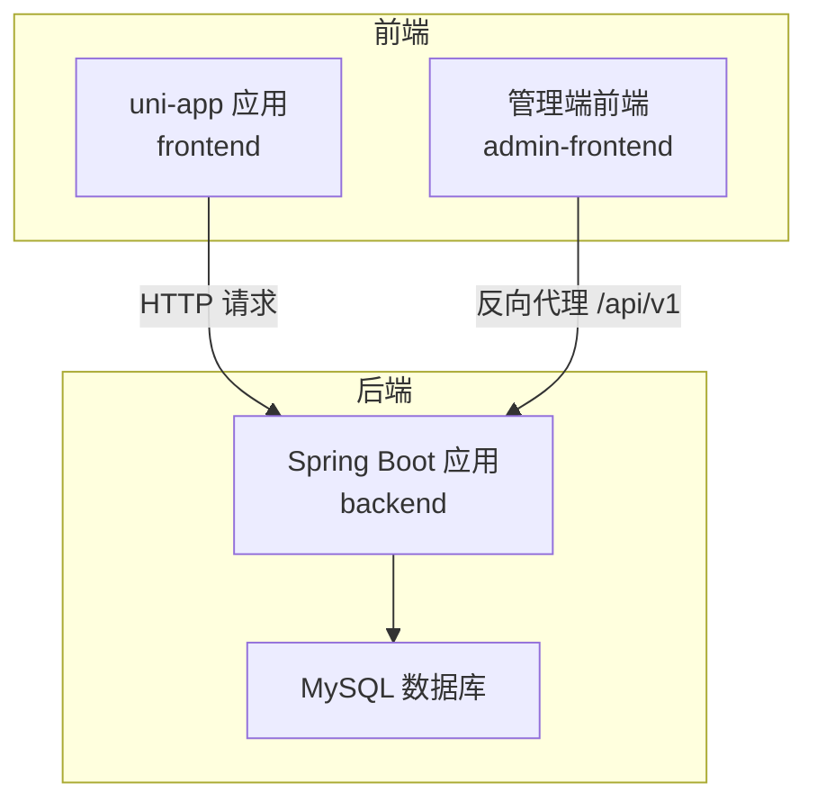
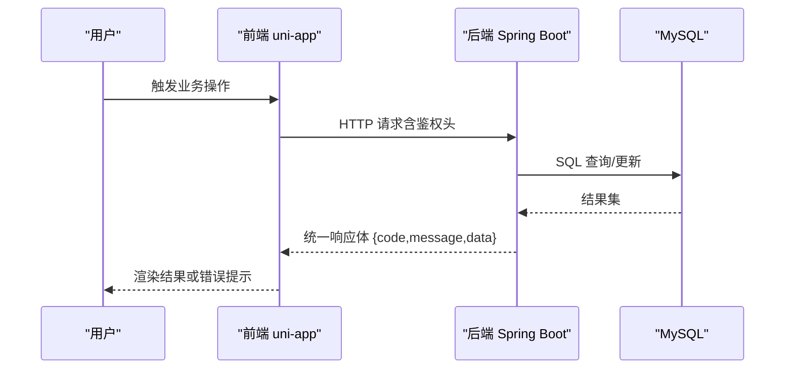
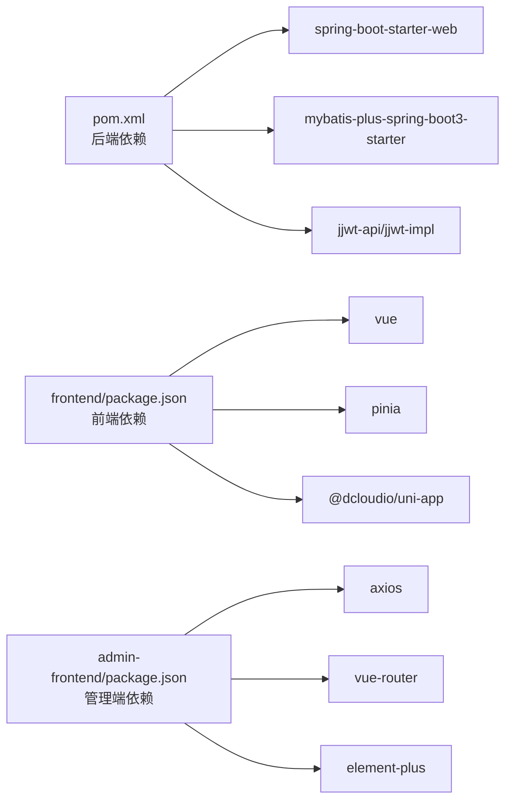
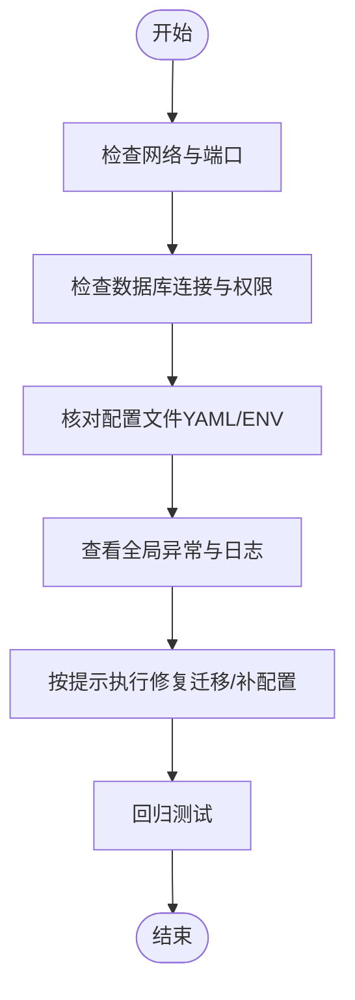

# 常见问题解答

<cite>
**本文引用的文件**
- [pom.xml](file://backend/pom.xml)
- [application.yml](file://backend/src/main/resources/application.yml)
- [application-local.yml](file://backend/src/main/resources/application-local.yml)
- [GlobalExceptionHandler.java](file://backend/src/main/java/com/ypfr/loseweight/common/GlobalExceptionHandler.java)
- [JwtProperties.java](file://backend/src/main/java/com/ypfr/loseweight/config/JwtProperties.java)
- [WechatMiniappProperties.java](file://backend/src/main/java/com/ypfr/loseweight/config/WechatMiniappProperties.java)
- [AliyunFoodProperties.java](file://backend/src/main/java/com/ypfr/loseweight/config/AliyunFoodProperties.java)
- [package.json（后端）](file://backend/pom.xml)
- [package.json（前端）](file://frontend/package.json)
- [package.json（管理端前端）](file://admin-frontend/package.json)
- [vite.config.ts（前端）](file://frontend/vite.config.ts)
- [vite.config.ts（管理端前端）](file://admin-frontend/vite.config.ts)
- [tsconfig.json（前端）](file://frontend/tsconfig.json)
- [api.ts（前端配置）](file://frontend/src/config/api.ts)
- [http.ts（前端通用HTTP封装）](file://frontend/src/utils/http.ts)
- [http.ts（管理端HTTP封装）](file://admin-frontend/src/api/http.ts)
- [auth.ts（管理端状态存储）](file://admin-frontend/src/stores/auth.ts)
</cite>

## 目录
1. [简介](#简介)
2. [项目结构](#项目结构)
3. [核心组件](#核心组件)
4. [架构总览](#架构总览)
5. [详细组件分析](#详细组件分析)
6. [依赖关系分析](#依赖关系分析)
7. [性能考虑](#性能考虑)
8. [故障排查指南](#故障排查指南)
9. [结论](#结论)
10. [附录](#附录)

## 简介
本文件面向开发者与运维人员，系统性梳理项目在开发、构建、运行阶段可能遇到的常见问题，覆盖以下主题：
- 开发环境搭建：JDK 版本不兼容、Node.js 版本冲突、数据库连接失败
- 编译与构建：Maven 依赖下载失败、Vite 打包错误、TypeScript 编译报错
- 运行时异常：Spring Boot 启动失败、JWT 令牌验证错误、API 接口 404/500 错误
- 前端页面加载：组件渲染异常、路由跳转失败、样式显示错误
- 后端服务异常：数据库连接池耗尽、文件上传失败、微信接口调用超时

针对每个问题，提供具体错误信息、可能原因分析、解决步骤、配置文件修正示例与命令行操作指南。

## 项目结构
项目采用前后端分离架构：
- 后端：Spring Boot 3 + MyBatis-Plus，使用 MySQL 作为持久化存储，提供 REST API
- 前端：基于 uni-app 的多端工程，支持 H5、小程序等平台
- 管理端前端：Vue 3 + Vite + Element Plus，通过 Nginx 反向代理访问后端

**图表来源**
- [application.yml:1-54](file://backend/src/main/resources/application.yml#L1-L54)
- [pom.xml:1-86](file://backend/pom.xml#L1-L86)
- [package.json（前端）:1-78](file://frontend/package.json#L1-L78)
- [package.json（管理端前端）:1-27](file://admin-frontend/package.json#L1-L27)

**章节来源**
- [pom.xml:1-86](file://backend/pom.xml#L1-L86)
- [application.yml:1-54](file://backend/src/main/resources/application.yml#L1-L54)
- [package.json（前端）:1-78](file://frontend/package.json#L1-L78)
- [package.json（管理端前端）:1-27](file://admin-frontend/package.json#L1-L27)

## 核心组件
- 后端配置与属性绑定
  - JWT 密钥与过期时间：app.jwt.secret、app.jwt.expire-seconds
  - 微信小程序 AppID/AppSecret：wechat.miniapp.app-id、wechat.miniapp.app-secret
  - 阿里云食物识别服务：aliyun.food.host、aliyun.food.path、aliyun.food.appcode
- 全局异常处理：统一捕获数据库访问异常、参数校验异常、MyBatis 类型映射异常等，并输出友好提示
- 前端配置与网络层
  - API 基础地址与路径前缀：VITE_API_BASE_URL、VITE_API_PATH_PREFIX
  - HTTP 封装：GET/POST/DELETE 带鉴权头，统一封装响应体与错误处理
  - 管理端 Axios 实例：自动注入 Bearer Token，统一拦截错误消息

**章节来源**
- [JwtProperties.java:1-29](file://backend/src/main/java/com/ypfr/loseweight/config/JwtProperties.java#L1-L29)
- [WechatMiniappProperties.java:1-28](file://backend/src/main/java/com/ypfr/loseweight/config/WechatMiniappProperties.java#L1-L28)
- [AliyunFoodProperties.java:1-44](file://backend/src/main/java/com/ypfr/loseweight/config/AliyunFoodProperties.java#L1-L44)
- [GlobalExceptionHandler.java:1-107](file://backend/src/main/java/com/ypfr/loseweight/common/GlobalExceptionHandler.java#L1-L107)
- [api.ts（前端配置）:1-42](file://frontend/src/config/api.ts#L1-L42)
- [http.ts（前端通用HTTP封装）:1-126](file://frontend/src/utils/http.ts#L1-L126)
- [http.ts（管理端HTTP封装）:1-31](file://admin-frontend/src/api/http.ts#L1-L31)

## 架构总览
后端通过 Spring MVC 暴露 REST 接口，前端通过 uni-app 发起请求，管理端前端通过 Nginx 反向代理访问后端 /api/v1 路径。

**图表来源**
- [http.ts（前端通用HTTP封装）:1-126](file://frontend/src/utils/http.ts#L1-L126)
- [application.yml:1-54](file://backend/src/main/resources/application.yml#L1-L54)

**章节来源**
- [http.ts（前端通用HTTP封装）:1-126](file://frontend/src/utils/http.ts#L1-L126)
- [application.yml:1-54](file://backend/src/main/resources/application.yml#L1-L54)

## 详细组件分析

### 开发环境搭建问题

#### JDK 版本不兼容
- 现象
  - Maven 构建报错，提示 Java 版本不匹配
- 可能原因
  - 本地 JDK 版本与项目属性不一致
- 解决步骤
  - 确认项目 Java 版本属性
  - 安装对应 JDK 并设置 JAVA_HOME 与 PATH
  - 使用 mvn -v 验证版本
- 配置参考
  - [pom.xml:20-23](file://backend/pom.xml#L20-L23)

**章节来源**
- [pom.xml:20-23](file://backend/pom.xml#L20-L23)

#### Node.js 版本冲突
- 现象
  - 安装依赖时报错，或运行脚本报错
- 可能原因
  - Node.js 版本过低或过高，与工程引擎要求不匹配
- 解决步骤
  - 查看工程 engines 字段与当前 Node 版本
  - 使用 nvm 或官方安装包切换到推荐版本
  - 清理 node_modules 与锁文件后重装
- 配置参考
  - [package.json（前端）:4-6](file://frontend/package.json#L4-L6)
  - [package.json（管理端前端）:1-27](file://admin-frontend/package.json#L1-L27)

**章节来源**
- [package.json（前端）:4-6](file://frontend/package.json#L4-L6)
- [package.json（管理端前端）:1-27](file://admin-frontend/package.json#L1-L27)

#### 数据库连接失败
- 现象
  - 启动后端报数据库连接异常
- 可能原因
  - 数据库地址、端口、账号、密码不正确
  - 未创建数据库或字符集/时区配置不匹配
- 解决步骤
  - 校验 application.yml 与 application-local.yml 中的数据库配置
  - 在本地/测试环境创建数据库并初始化表结构
  - 确保网络连通与防火墙放行
- 配置参考
  - [application.yml:8-12](file://backend/src/main/resources/application.yml#L8-L12)
  - [application-local.yml:4-12](file://backend/src/main/resources/application-local.yml#L4-L12)

**章节来源**
- [application.yml:8-12](file://backend/src/main/resources/application.yml#L8-L12)
- [application-local.yml:4-12](file://backend/src/main/resources/application-local.yml#L4-L12)

### 编译与构建错误

#### Maven 依赖下载失败
- 现象
  - mvn clean install 报网络或镜像相关错误
- 可能原因
  - 代理/网络限制、Maven 仓库不可达
- 解决步骤
  - 配置国内镜像源或代理
  - 清理本地仓库缓存后重试
  - 使用 -U 参数强制更新快照
- 配置参考
  - [pom.xml:1-86](file://backend/pom.xml#L1-L86)

**章节来源**
- [pom.xml:1-86](file://backend/pom.xml#L1-L86)

#### Vite 打包错误
- 现象
  - npm run build:* 报错，如类型检查失败、插件冲突
- 可能原因
  - TypeScript 版本不匹配、Vite 插件版本不兼容
- 解决步骤
  - 对齐 TypeScript 与 Vue 生态版本
  - 更新 @dcloudio/vite-plugin-uni 或相关插件
  - 修复类型错误后再打包
- 配置参考
  - [vite.config.ts（前端）:1-23](file://frontend/vite.config.ts#L1-L23)
  - [vite.config.ts（管理端前端）:1-8](file://admin-frontend/vite.config.ts#L1-L8)
  - [tsconfig.json（前端）:1-17](file://frontend/tsconfig.json#L1-L17)

**章节来源**
- [vite.config.ts（前端）:1-23](file://frontend/vite.config.ts#L1-L23)
- [vite.config.ts（管理端前端）:1-8](file://admin-frontend/vite.config.ts#L1-L8)
- [tsconfig.json（前端）:1-17](file://frontend/tsconfig.json#L1-L17)

#### TypeScript 编译报错
- 现象
  - npm run type-check 或打包时报类型错误
- 可能原因
  - 类型定义缺失、模块解析错误、lib/types 配置不当
- 解决步骤
  - 检查 tsconfig.json 的 lib 与 types 配置
  - 安装缺失的类型包（如 @dcloudio/types）
  - 修复具体类型问题后再编译
- 配置参考
  - [tsconfig.json（前端）:1-17](file://frontend/tsconfig.json#L1-L17)
  - [package.json（前端）:63-76](file://frontend/package.json#L63-L76)

**章节来源**
- [tsconfig.json（前端）:1-17](file://frontend/tsconfig.json#L1-L17)
- [package.json（前端）:63-76](file://frontend/package.json#L63-L76)

### 运行时异常

#### Spring Boot 启动失败
- 现象
  - 启动报错，无法完成上下文初始化
- 可能原因
  - 数据库连接失败、配置文件缺失、端口占用
- 解决步骤
  - 检查 application.yml 与 application-local.yml
  - 确认数据库可用且端口未被占用
  - 查看控制台日志定位具体异常
- 配置参考
  - [application.yml:1-54](file://backend/src/main/resources/application.yml#L1-L54)
  - [application-local.yml:1-20](file://backend/src/main/resources/application-local.yml#L1-L20)

**章节来源**
- [application.yml:1-54](file://backend/src/main/resources/application.yml#L1-L54)
- [application-local.yml:1-20](file://backend/src/main/resources/application-local.yml#L1-L20)

#### JWT 令牌验证错误
- 现象
  - 登录成功但后续接口返回鉴权失败
- 可能原因
  - JWT 密钥不一致、过期时间过短、跨环境配置不同
- 解决步骤
  - 在 application-local.yml 中设置足够长度的随机密钥
  - 确保前端与后端使用相同密钥
  - 检查 Token 是否过期
- 配置参考
  - [application.yml:42-46](file://backend/src/main/resources/application.yml#L42-L46)
  - [JwtProperties.java:1-29](file://backend/src/main/java/com/ypfr/loseweight/config/JwtProperties.java#L1-L29)

**章节来源**
- [application.yml:42-46](file://backend/src/main/resources/application.yml#L42-L46)
- [JwtProperties.java:1-29](file://backend/src/main/java/com/ypfr/loseweight/config/JwtProperties.java#L1-L29)

#### API 接口 404/500 错误
- 现象
  - 前端请求返回 404 或 500
- 可能原因
  - 路径前缀不一致、控制器未找到、数据库结构不匹配
- 解决步骤
  - 校验 VITE_API_PATH_PREFIX 与后端路径前缀一致
  - 检查控制器是否存在及注解是否正确
  - 若数据库列缺失或类型不匹配，按全局异常提示执行迁移脚本
- 配置参考
  - [api.ts（前端配置）:10-12](file://frontend/src/config/api.ts#L10-L12)
  - [GlobalExceptionHandler.java:68-97](file://backend/src/main/java/com/ypfr/loseweight/common/GlobalExceptionHandler.java#L68-L97)

**章节来源**
- [api.ts（前端配置）:10-12](file://frontend/src/config/api.ts#L10-L12)
- [GlobalExceptionHandler.java:68-97](file://backend/src/main/java/com/ypfr/loseweight/common/GlobalExceptionHandler.java#L68-L97)

### 前端页面加载问题

#### 组件渲染异常
- 现象
  - 页面空白或组件不显示
- 可能原因
  - 路由未正确配置、组件导入路径错误、类型定义不匹配
- 解决步骤
  - 检查路由配置与页面路径
  - 确认组件路径与命名导出一致
  - 修复类型错误后重新编译
- 配置参考
  - [tsconfig.json（前端）:8-11](file://frontend/tsconfig.json#L8-L11)

**章节来源**
- [tsconfig.json（前端）:8-11](file://frontend/tsconfig.json#L8-L11)

#### 路由跳转失败
- 现象
  - 点击按钮无反应或跳转到空白页
- 可能原因
  - 路由守卫逻辑错误、history 模式与服务器配置不匹配
- 解决步骤
  - 检查路由配置与导航逻辑
  - 确保服务器支持 history 模式回退
- 配置参考
  - [vite.config.ts（前端）:1-23](file://frontend/vite.config.ts#L1-L23)

**章节来源**
- [vite.config.ts（前端）:1-23](file://frontend/vite.config.ts#L1-L23)

#### 样式显示错误
- 现象
  - 样式未生效或布局错乱
- 可能原因
  - CSS 作用域问题、样式加载顺序、第三方样式冲突
- 解决步骤
  - 检查 scoped 与样式引入顺序
  - 确认第三方库样式未被覆盖
- 配置参考
  - [package.json（前端）:72-76](file://frontend/package.json#L72-L76)

**章节来源**
- [package.json（前端）:72-76](file://frontend/package.json#L72-L76)

### 后端服务异常

#### 数据库连接池耗尽
- 现象
  - 高并发下出现连接超时或拒绝
- 可能原因
  - 连接池配置过小、SQL 性能差、未正确关闭资源
- 解决步骤
  - 调整连接池大小与超时参数
  - 优化慢查询与事务边界
  - 确保资源释放与异常处理完善
- 配置参考
  - [application.yml:8-12](file://backend/src/main/resources/application.yml#L8-L12)

**章节来源**
- [application.yml:8-12](file://backend/src/main/resources/application.yml#L8-L12)

#### 文件上传失败
- 现象
  - 头像或图片上传报错
- 可能原因
  - 上传目录权限不足、文件大小超过限制、路径配置错误
- 解决步骤
  - 创建 uploads 目录并赋予写权限
  - 检查 server.tomcat.max-http-form-post-size 配置
  - 确认路径前缀与实际目录一致
- 配置参考
  - [application.yml:17-19](file://backend/src/main/resources/application.yml#L17-L19)
  - [application.yml:47-49](file://backend/src/main/resources/application.yml#L47-L49)

**章节来源**
- [application.yml:17-19](file://backend/src/main/resources/application.yml#L17-L19)
- [application.yml:47-49](file://backend/src/main/resources/application.yml#L47-L49)

#### 微信接口调用超时
- 现象
  - 登录或获取用户信息接口超时
- 可能原因
  - AppID/AppSecret 不一致、网络不稳定、调用频率过高
- 解决步骤
  - 确保与小程序配置一致的 AppID/AppSecret
  - 检查网络连通性与限流策略
  - 在 application-local.yml 中正确配置
- 配置参考
  - [application.yml:31-35](file://backend/src/main/resources/application.yml#L31-L35)
  - [WechatMiniappProperties.java:1-28](file://backend/src/main/java/com/ypfr/loseweight/config/WechatMiniappProperties.java#L1-L28)

**章节来源**
- [application.yml:31-35](file://backend/src/main/resources/application.yml#L31-L35)
- [WechatMiniappProperties.java:1-28](file://backend/src/main/java/com/ypfr/loseweight/config/WechatMiniappProperties.java#L1-L28)

## 依赖关系分析

**图表来源**
- [pom.xml:25-75](file://backend/pom.xml#L25-L75)
- [package.json（前端）:42-62](file://frontend/package.json#L42-L62)
- [package.json（管理端前端）:11-25](file://admin-frontend/package.json#L11-L25)

**章节来源**
- [pom.xml:25-75](file://backend/pom.xml#L25-L75)
- [package.json（前端）:42-62](file://frontend/package.json#L42-L62)
- [package.json（管理端前端）:11-25](file://admin-frontend/package.json#L11-L25)

## 性能考虑
- 启动与热更新
  - 使用 Spring Boot DevTools（如启用）提升开发体验
  - 前端开发模式下合理拆分包与懒加载
- 数据访问
  - 优化 MyBatis SQL 与索引设计，避免 N+1 查询
  - 合理设置连接池大小与超时阈值
- 网络与缓存
  - 前端对常用接口做缓存与去抖
  - 后端对热点数据做缓存与限流

## 故障排查指南

### 常见错误定位流程

**图表来源**
- [GlobalExceptionHandler.java:19-66](file://backend/src/main/java/com/ypfr/loseweight/common/GlobalExceptionHandler.java#L19-L66)
- [application.yml:1-54](file://backend/src/main/resources/application.yml#L1-L54)

### 关键配置修正示例

- 设置后端 JWT 密钥（至少 32 字符随机串）
  - 修改 application-local.yml 中 app.jwt.secret
  - 示例路径：[application-local.yml:1-20](file://backend/src/main/resources/application-local.yml#L1-L20)

- 配置阿里云食物识别 AppCode
  - 修改 application-local.yml 中 aliyun.food.appcode
  - 示例路径：[application-local.yml:14-20](file://backend/src/main/resources/application-local.yml#L14-L20)

- 前端 API 基础地址与路径前缀
  - 设置 VITE_API_BASE_URL 与 VITE_API_PATH_PREFIX
  - 示例路径：[api.ts（前端配置）:1-42](file://frontend/src/config/api.ts#L1-L42)

- 管理端反向代理与鉴权头
  - Nginx 反代 /api/v1 至后端，Axios 自动注入 Authorization
  - 示例路径：[http.ts（管理端HTTP封装）:1-31](file://admin-frontend/src/api/http.ts#L1-L31)

**章节来源**
- [application-local.yml:1-20](file://backend/src/main/resources/application-local.yml#L1-L20)
- [api.ts（前端配置）:1-42](file://frontend/src/config/api.ts#L1-L42)
- [http.ts（管理端HTTP封装）:1-31](file://admin-frontend/src/api/http.ts#L1-L31)

### 命令行操作指南

- 后端
  - 清理并打包：mvn clean package
  - 运行应用：mvn spring-boot:run
  - 查看日志：tail -f logs/app.log

- 前端
  - 安装依赖：npm install
  - 开发运行：npm run dev:mp-weixin
  - 类型检查：npm run type-check
  - 构建产物：npm run build:h5

- 管理端前端
  - 安装依赖：npm install
  - 开发运行：npm run dev
  - 构建产物：npm run build

**章节来源**
- [pom.xml:77-84](file://backend/pom.xml#L77-L84)
- [package.json（前端）:7-41](file://frontend/package.json#L7-L41)
- [package.json（管理端前端）:6-10](file://admin-frontend/package.json#L6-L10)

## 结论
通过规范的环境配置、严格的依赖管理与完善的异常处理机制，可有效降低开发与运维成本。建议团队建立统一的开发与部署规范，定期进行数据库迁移与依赖升级，确保前后端接口契约稳定一致。

## 附录

### 配置文件清单与用途
- application.yml：后端主配置（数据库、服务器、日志、第三方服务）
- application-local.yml：本地覆盖配置（敏感信息、本地服务密钥）
- vite.config.ts（前端/管理端）：Vite 构建与开发服务器配置
- tsconfig.json（前端）：TypeScript 编译选项与路径映射
- package.json（各模块）：依赖与脚本定义

**章节来源**
- [application.yml:1-54](file://backend/src/main/resources/application.yml#L1-L54)
- [application-local.yml:1-20](file://backend/src/main/resources/application-local.yml#L1-L20)
- [vite.config.ts（前端）:1-23](file://frontend/vite.config.ts#L1-L23)
- [vite.config.ts（管理端前端）:1-8](file://admin-frontend/vite.config.ts#L1-L8)
- [tsconfig.json（前端）:1-17](file://frontend/tsconfig.json#L1-L17)
- [package.json（前端）:1-78](file://frontend/package.json#L1-L78)
- [package.json（管理端前端）:1-27](file://admin-frontend/package.json#L1-L27)