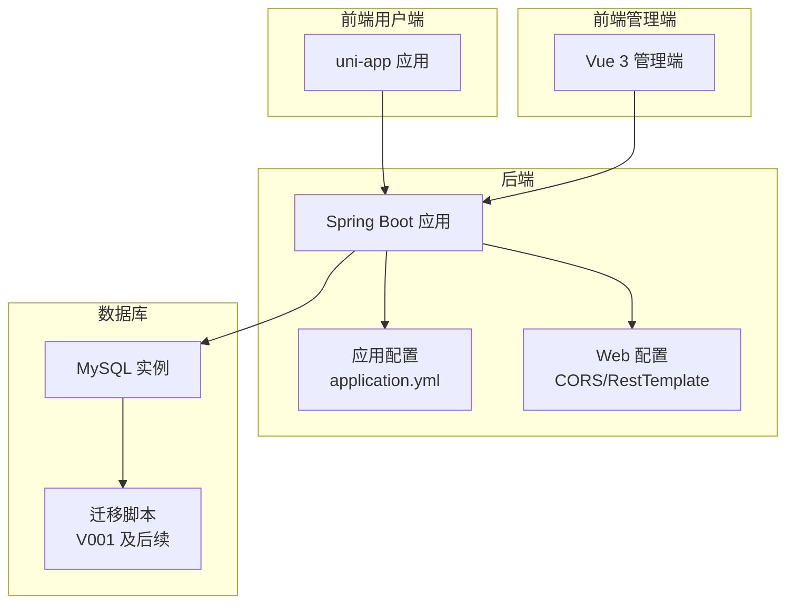
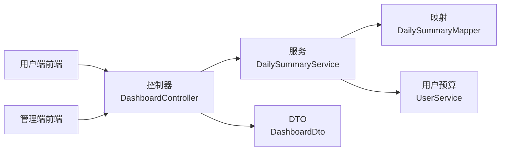
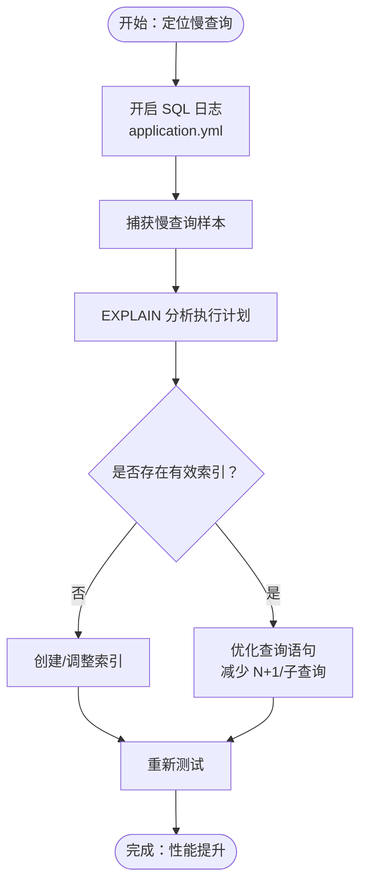
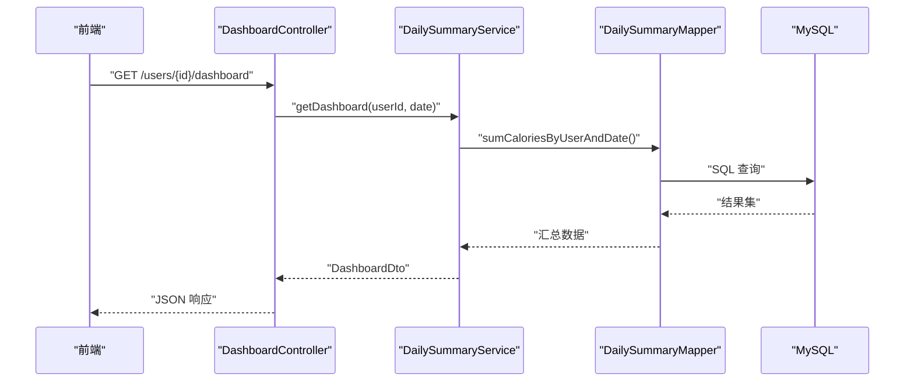
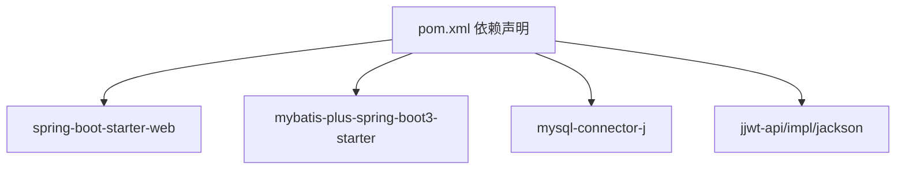

# 性能问题诊断

<cite>
**本文引用的文件**
- [LoseweightApplication.java](file://backend/src/main/java/com/ypfr/loseweight/LoseweightApplication.java)
- [application.yml](file://backend/src/main/resources/application.yml)
- [WebConfig.java](file://backend/src/main/java/com/ypfr/loseweight/config/WebConfig.java)
- [pom.xml](file://backend/pom.xml)
- [DashboardController.java](file://backend/src/main/java/com/ypfr/loseweight/web/DashboardController.java)
- [DailySummaryService.java](file://backend/src/main/java/com/ypfr/loseweight/service/DailySummaryService.java)
- [DailySummaryMapper.java](file://backend/src/main/java/com/ypfr/loseweight/mapper/DailySummaryMapper.java)
- [vite.config.ts（前端）](file://frontend/vite.config.ts)
- [package.json（前端）](file://frontend/package.json)
- [vite.config.ts（管理端前端）](file://admin-frontend/vite.config.ts)
- [package.json（管理端前端）](file://admin-frontend/package.json)
- [loseweight.ts（前端API）](file://frontend/src/api/loseweight.ts)
- [admin.ts（管理端前端API）](file://admin-frontend/src/api/admin.ts)
- [V001__rename_meal_record_to_legacy.sql](file://database/migrations/V001__rename_meal_record_to_legacy.sql)
</cite>

## 目录
1. [简介](#简介)
2. [项目结构](#项目结构)
3. [核心组件](#核心组件)
4. [架构概览](#架构概览)
5. [详细组件分析](#详细组件分析)
6. [依赖分析](#依赖分析)
7. [性能考虑](#性能考虑)
8. [故障排查指南](#故障排查指南)
9. [结论](#结论)
10. [附录](#附录)

## 简介
本文件面向“性能问题诊断”目标，结合现有代码库现状，构建一套可落地的性能诊断体系，覆盖数据库查询优化、前端渲染性能优化、API响应时间优化与系统资源监控，并给出性能测试工具使用建议、瓶颈识别方法、优化实施步骤、指标阈值与告警配置思路以及性能回归测试方案。

## 项目结构
项目采用前后端分离架构：
- 后端基于 Spring Boot 3 + MyBatis-Plus，提供 REST API。
- 前端采用 uni-app（多端统一），管理端前端采用 Vue 3 + Vite。
- 数据库迁移脚本位于 database/migrations，包含表结构演进与重命名等历史变更。

图表来源
- [LoseweightApplication.java:12-24](file://backend/src/main/java/com/ypfr/loseweight/LoseweightApplication.java#L12-L24)
- [application.yml:1-54](file://backend/src/main/resources/application.yml#L1-L54)
- [WebConfig.java:11-30](file://backend/src/main/java/com/ypfr/loseweight/config/WebConfig.java#L11-L30)
- [V001__rename_meal_record_to_legacy.sql:1-25](file://database/migrations/V001__rename_meal_record_to_legacy.sql#L1-L25)

章节来源
- [LoseweightApplication.java:12-24](file://backend/src/main/java/com/ypfr/loseweight/LoseweightApplication.java#L12-L24)
- [application.yml:1-54](file://backend/src/main/resources/application.yml#L1-L54)
- [WebConfig.java:11-30](file://backend/src/main/java/com/ypfr/loseweight/config/WebConfig.java#L11-L30)
- [vite.config.ts（前端）:1-23](file://frontend/vite.config.ts#L1-L23)
- [vite.config.ts（管理端前端）:1-8](file://admin-frontend/vite.config.ts#L1-L8)

## 核心组件
- 应用入口与扫描：Spring Boot 启动类负责包扫描与配置属性启用。
- 配置中心：application.yml 提供数据源、服务器、MyBatis 配置、日志级别等。
- Web 层：CORS 允许跨域，RestTemplate 设置连接与读取超时。
- 控制器层：示例 DashboardController 提供用户看板接口。
- 服务层：DailySummaryService 负责按日汇总摄入/运动/宏量营养素等。
- 映射层：DailySummaryMapper 使用 MyBatis-Plus 基础能力。
- 前端 API：用户端与管理端分别封装 HTTP 请求与适配器。

章节来源
- [LoseweightApplication.java:12-24](file://backend/src/main/java/com/ypfr/loseweight/LoseweightApplication.java#L12-L24)
- [application.yml:1-54](file://backend/src/main/resources/application.yml#L1-L54)
- [WebConfig.java:11-30](file://backend/src/main/java/com/ypfr/loseweight/config/WebConfig.java#L11-L30)
- [DashboardController.java:14-38](file://backend/src/main/java/com/ypfr/loseweight/web/DashboardController.java#L14-L38)
- [DailySummaryService.java:17-34](file://backend/src/main/java/com/ypfr/loseweight/service/DailySummaryService.java#L17-L34)
- [DailySummaryMapper.java:1-10](file://backend/src/main/java/com/ypfr/loseweight/mapper/DailySummaryMapper.java#L1-L10)
- [loseweight.ts（前端API）:15-22](file://frontend/src/api/loseweight.ts#L15-L22)
- [admin.ts（管理端前端API）:22-32](file://admin-frontend/src/api/admin.ts#L22-L32)

## 架构概览
后端以 MVC 模式组织，控制器负责鉴权与参数解析，服务层聚合领域逻辑，映射层对接数据库。前端通过 API 适配器调用后端接口，管理端与用户端分别独立构建与部署。

图表来源
- [DashboardController.java:14-38](file://backend/src/main/java/com/ypfr/loseweight/web/DashboardController.java#L14-L38)
- [DailySummaryService.java:17-34](file://backend/src/main/java/com/ypfr/loseweight/service/DailySummaryService.java#L17-L34)
- [DailySummaryMapper.java:1-10](file://backend/src/main/java/com/ypfr/loseweight/mapper/DailySummaryMapper.java#L1-L10)

## 详细组件分析

### 数据库查询优化
- 慢查询分析
  - 利用 application.yml 中的日志级别配置，开启 SQL 日志输出，定位慢查询与重复查询。
  - 结合数据库慢查询日志（需在 MySQL 侧启用）与执行计划分析，识别未命中索引或全表扫描的查询。
- 索引优化策略
  - 针对按用户与日期的聚合查询（如摄入/运动热量汇总），确保用户 ID 与日期字段具备合适索引。
  - 对于时间窗口计算（首餐到末餐），评估是否需要复合索引以减少排序成本。
- 查询计划分析
  - 使用 EXPLAIN 分析关键路径查询，关注回表次数、临时表与排序开销。
  - 关注迁移脚本中的表结构变化（如 V001 将旧表重命名为 legacy），避免误用旧表或索引失效。
- 事务与锁
  - 汇总写入（updateForDay）涉及多表聚合与更新，应评估事务粒度与锁竞争，必要时拆分或加读写分离。

图表来源
- [application.yml:21-28](file://backend/src/main/resources/application.yml#L21-L28)
- [DailySummaryService.java:41-52](file://backend/src/main/java/com/ypfr/loseweight/service/DailySummaryService.java#L41-L52)
- [V001__rename_meal_record_to_legacy.sql:1-25](file://database/migrations/V001__rename_meal_record_to_legacy.sql#L1-L25)

章节来源
- [application.yml:21-28](file://backend/src/main/resources/application.yml#L21-L28)
- [DailySummaryService.java:41-52](file://backend/src/main/java/com/ypfr/loseweight/service/DailySummaryService.java#L41-L52)
- [V001__rename_meal_record_to_legacy.sql:1-25](file://database/migrations/V001__rename_meal_record_to_legacy.sql#L1-L25)

### 前端渲染性能优化
- 组件懒加载
  - 在路由层面按需加载页面组件，减少首屏 JS 体积与解析时间。
- 图片压缩与格式优化
  - 用户头像与食物图片在上传前进行压缩与格式转换，降低带宽与渲染压力。
- CSS 优化
  - 移除未使用样式，合并小图标为雪碧图或 SVG，避免重绘与回流。
- 状态管理与缓存
  - 使用 Pinia 缓存近期数据，避免重复请求；对长列表采用虚拟滚动。
- 构建与打包
  - 生产构建开启 Tree-shaking 与代码分割；按需引入 Element Plus 组件以减小包体。

章节来源
- [vite.config.ts（前端）:1-23](file://frontend/vite.config.ts#L1-L23)
- [package.json（前端）:42-77](file://frontend/package.json#L42-L77)
- [vite.config.ts（管理端前端）:1-8](file://admin-frontend/vite.config.ts#L1-L8)
- [package.json（管理端前端）:11-26](file://admin-frontend/package.json#L11-L26)

### API 响应时间优化
- 缓存策略
  - 对热点看板数据（如每日汇总）增加 Redis 缓存，设置合理 TTL 与失效策略。
- 并发控制
  - 使用限流与熔断（Sentinel 或 Resilience4j）保护下游依赖（如第三方识别服务）。
- 异步处理
  - 将耗时任务（如批量统计、报表导出）放入消息队列异步执行，返回即时结果。
- 超时与重试
  - WebConfig 中已设置 RestTemplate 超时，建议在调用第三方接口时细化超时与指数退避重试。

图表来源
- [DashboardController.java:27-36](file://backend/src/main/java/com/ypfr/loseweight/web/DashboardController.java#L27-L36)
- [DailySummaryService.java:41-52](file://backend/src/main/java/com/ypfr/loseweight/service/DailySummaryService.java#L41-L52)
- [DailySummaryMapper.java:1-10](file://backend/src/main/java/com/ypfr/loseweight/mapper/DailySummaryMapper.java#L1-L10)

章节来源
- [WebConfig.java:23-29](file://backend/src/main/java/com/ypfr/loseweight/config/WebConfig.java#L23-L29)
- [DashboardController.java:27-36](file://backend/src/main/java/com/ypfr/loseweight/web/DashboardController.java#L27-L36)
- [DailySummaryService.java:41-52](file://backend/src/main/java/com/ypfr/loseweight/service/DailySummaryService.java#L41-L52)

### 系统资源监控
- CPU 使用率
  - 通过操作系统监控工具（如 top/htop、Windows 任务管理器）观察后端进程 CPU 占用峰值。
- 内存占用
  - JVM 参数与 GC 日志结合，观察堆内存使用与 Full GC 频率；Spring Boot Actuator 可暴露运行时指标。
- 磁盘 IO
  - 监控数据库数据文件与日志文件的 IO 压力，关注慢查询与大结果集导致的 IO 放大。
- 网络与连接
  - Tomcat 最大连接数、线程池与连接超时配置需与实际负载匹配，避免连接泄漏。

章节来源
- [application.yml:13-20](file://backend/src/main/resources/application.yml#L13-L20)
- [pom.xml:25-75](file://backend/pom.xml#L25-L75)

## 依赖分析
后端依赖包括 Web、MyBatis-Plus、MySQL 驱动、JWT 等；前端依赖 uni-app、Vue 3、Pinia、Element Plus 等。模块间耦合主要体现在控制器依赖服务、服务依赖映射与外部 HTTP 客户端。

图表来源
- [pom.xml:25-75](file://backend/pom.xml#L25-L75)

章节来源
- [pom.xml:25-75](file://backend/pom.xml#L25-L75)
- [package.json（前端）:42-77](file://frontend/package.json#L42-L77)
- [package.json（管理端前端）:11-26](file://admin-frontend/package.json#L11-L26)

## 性能考虑
- 数据库层
  - 为高频查询字段建立索引；定期分析表统计信息与碎片化情况。
  - 使用连接池参数（最大连接数、空闲超时）与 SQL 优化相结合。
- 后端层
  - 控制器与服务层避免 N+1 查询；对批量操作使用批处理与分页。
  - 合理设置线程池大小与队列长度，防止阻塞。
- 前端层
  - 减少不必要的重渲染，使用浅比较与 computed；图片懒加载与 CDN 加速。
- 监控与告警
  - 建议接入 APM（如 SkyWalking/Zipkin）与指标面板（Prometheus/Grafana），设置 CPU/内存/请求时延/错误率阈值。

## 故障排查指南
- API 响应缓慢
  - 步骤：抓取慢请求链路（日志/Trace）、定位慢查询（EXPLAIN）、检查缓存命中、确认第三方依赖超时与重试。
- 页面渲染卡顿
  - 步骤：使用浏览器性能面板分析主线程占用、检查大列表渲染、确认图片尺寸与格式。
- 数据库连接异常
  - 步骤：核对连接池参数、检查慢查询与锁等待、确认网络连通性与防火墙策略。
- CORS 或跨域问题
  - 步骤：核对 WebConfig 中 CORS 规则与请求头，确保预检请求放行。

章节来源
- [WebConfig.java:14-21](file://backend/src/main/java/com/ypfr/loseweight/config/WebConfig.java#L14-L21)
- [application.yml:13-20](file://backend/src/main/resources/application.yml#L13-L20)

## 结论
通过“日志可观测 + SQL 执行计划 + 前端渲染优化 + API 缓存与异步 + 系统资源监控”的组合拳，可系统性地发现并解决性能瓶颈。建议将性能测试纳入 CI 流水线，形成持续的性能回归保障。

## 附录

### 性能测试工具与使用
- JMeter（后端接口压测）
  - 场景：构造用户看板、每日记录等高频接口的并发请求，观察响应时间与错误率。
  - 关键点：线程组并发数、 Ramp-Up 时间、定时器、聚合报告。
- Lighthouse（网页性能分析）
  - 场景：对管理端前端页面进行性能打分，识别首屏时间、交互延迟、图片优化空间。
- 数据库性能分析器
  - 场景：MySQL 慢查询日志与执行计划分析，定位热点 SQL 与索引缺失。

### 性能指标阈值与告警配置（建议）
- 接口 P95 响应时间：小于 500ms（视业务而定）
- 错误率：小于 0.1%
- CPU 使用率：平均小于 70%，瞬时峰值不超过 90%
- 内存使用：GC 周期稳定，Full GC 频率极低
- 数据库 QPS：根据容量规划预留 30% 安全余量

### 性能回归测试方案
- 自动化回归：将 JMeter 场景与 Lighthouse 报告纳入 CI，设定阈值失败即阻断。
- A/B 对比：灰度发布前后对比关键指标，确保无回退。
- 压测基线：建立稳定基线，定期复测，及时发现回归。