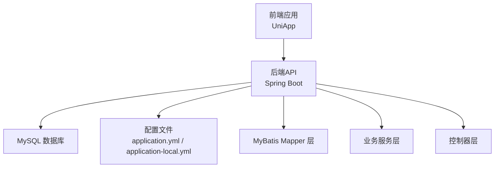
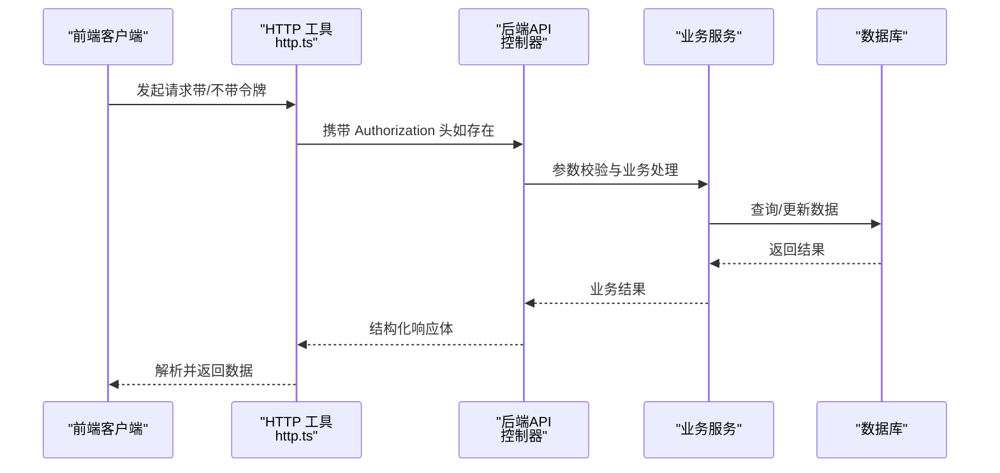
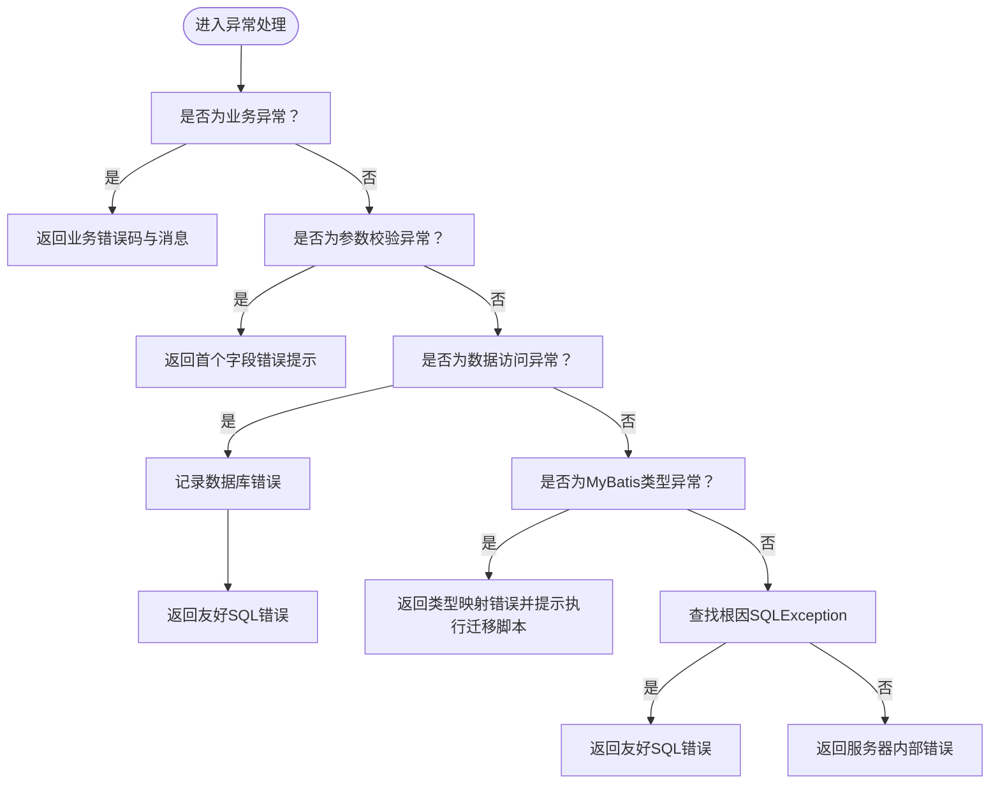
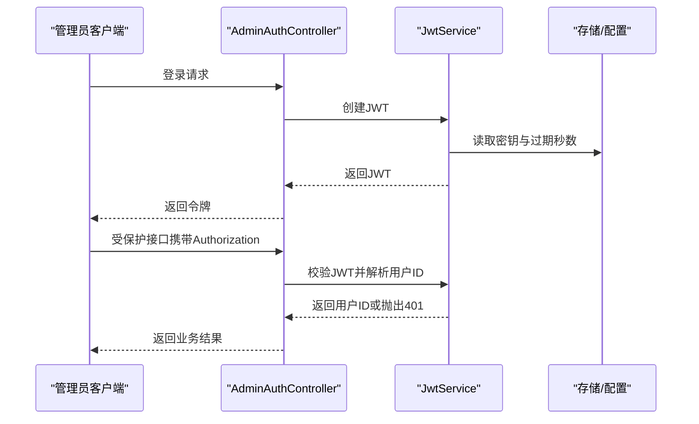
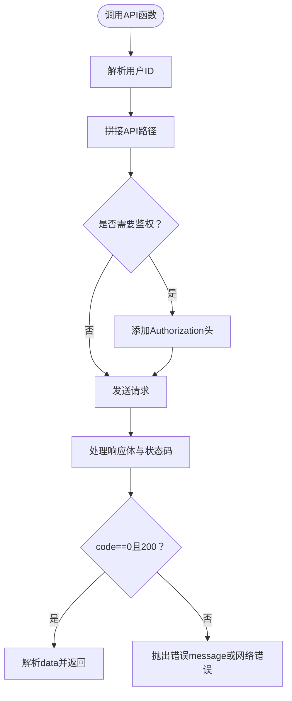
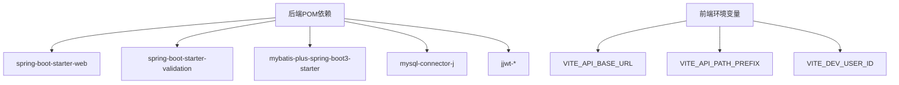

# 故障排除与FAQ

<cite>
**本文引用的文件**
- [GlobalExceptionHandler.java](file://backend/src/main/java/com/ypfr/loseweight/common/GlobalExceptionHandler.java)
- [ApiException.java](file://backend/src/main/java/com/ypfr/loseweight/common/ApiException.java)
- [JwtService.java](file://backend/src/main/java/com/ypfr/loseweight/service/JwtService.java)
- [AdminAuthController.java](file://backend/src/main/java/com/ypfr/loseweight/web/AdminAuthController.java)
- [application.yml](file://backend/src/main/resources/application.yml)
- [application-local.yml](file://backend/src/main/resources/application-local.yml)
- [http.ts](file://frontend/src/utils/http.ts)
- [api.ts](file://frontend/src/config/api.ts)
- [loseweight.ts](file://frontend/src/api/loseweight.ts)
- [pom.xml](file://backend/pom.xml)
- [V021__vip_product_enabled_int.sql](file://database/migrations/V021__vip_product_enabled_int.sql)
- [V017__food_category_code_sidebar_seed.sql](file://database/migrations/V017__food_category_code_sidebar_seed.sql)
- [01_schema.sql](file://database/01_schema.sql)
</cite>

## 目录
1. [简介](#简介)
2. [项目结构](#项目结构)
3. [核心组件](#核心组件)
4. [架构总览](#架构总览)
5. [详细组件分析](#详细组件分析)
6. [依赖分析](#依赖分析)
7. [性能考虑](#性能考虑)
8. [故障排除指南](#故障排除指南)
9. [结论](#结论)
10. [附录](#附录)

## 简介
本文件面向开发与运维人员，提供系统性故障排除与常见问题解答，涵盖环境搭建、编译与运行时异常、API 调用失败、日志分析方法、性能诊断、紧急恢复方案以及调试工具与监控仪表板使用建议。内容基于仓库中的后端 Spring Boot 与前端 UniApp 实现，结合数据库迁移脚本与配置文件进行定位与修复。

## 项目结构
项目采用前后端分离架构：
- 后端：Spring Boot 应用，提供 REST API，使用 MyBatis-Plus 访问 MySQL。
- 前端：UniApp 应用，通过封装的 HTTP 工具与后端交互。
- 数据库：包含初始化建表脚本与版本化迁移脚本，支持幂等执行。

图表来源
- [application.yml:1-54](file://backend/src/main/resources/application.yml#L1-L54)
- [pom.xml:1-86](file://backend/pom.xml#L1-L86)

章节来源
- [application.yml:1-54](file://backend/src/main/resources/application.yml#L1-L54)
- [pom.xml:1-86](file://backend/pom.xml#L1-L86)

## 核心组件
- 全局异常处理器：统一捕获与转换异常，输出结构化响应，便于前端展示与日志定位。
- JWT 服务：负责令牌签发与校验，保障接口鉴权。
- 前端 HTTP 工具：统一封装 GET/POST/DELETE 请求与鉴权头，处理响应体与状态码。
- 配置中心：后端通过 YAML 配置数据源、日志级别、第三方服务参数等；前端通过环境变量控制 API 基址与路径前缀。
- 数据库：包含基础表结构与迁移脚本，确保表结构与后端实体映射一致。

章节来源
- [GlobalExceptionHandler.java:1-107](file://backend/src/main/java/com/ypfr/loseweight/common/GlobalExceptionHandler.java#L1-L107)
- [JwtService.java:1-58](file://backend/src/main/java/com/ypfr/loseweight/service/JwtService.java#L1-L58)
- [http.ts:1-126](file://frontend/src/utils/http.ts#L1-L126)
- [api.ts:1-42](file://frontend/src/config/api.ts#L1-L42)
- [application.yml:1-54](file://backend/src/main/resources/application.yml#L1-L54)

## 架构总览
后端控制器接收请求，经鉴权与参数校验后调用服务层，服务层通过 Mapper 访问数据库，最终返回结构化响应。前端通过 HTTP 工具发起请求，自动处理鉴权头与响应体。

图表来源
- [http.ts:1-126](file://frontend/src/utils/http.ts#L1-L126)
- [AdminAuthController.java:1-62](file://backend/src/main/java/com/ypfr/loseweight/web/AdminAuthController.java#L1-L62)
- [JwtService.java:1-58](file://backend/src/main/java/com/ypfr/loseweight/service/JwtService.java#L1-L58)

## 详细组件分析

### 异常处理与全局错误响应
- 统一异常处理：捕获业务异常、参数校验异常、数据访问异常、MyBatis 类型映射异常等，输出结构化响应，包含状态码与友好提示。
- 特定场景提示：针对数据库列缺失、类型映射冲突、会员表结构不匹配等情况，给出明确修复指引与脚本路径。
- 未捕获异常：记录根因并返回通用“服务器内部错误”。

图表来源
- [GlobalExceptionHandler.java:1-107](file://backend/src/main/java/com/ypfr/loseweight/common/GlobalExceptionHandler.java#L1-L107)

章节来源
- [GlobalExceptionHandler.java:1-107](file://backend/src/main/java/com/ypfr/loseweight/common/GlobalExceptionHandler.java#L1-L107)

### JWT 鉴权流程
- 令牌签发：基于配置的密钥生成 JWT，设置过期时间。
- 令牌校验：解析签名与载荷，提取用户 ID；空令牌或解析失败返回 401。
- 控制器使用：通过解析器从请求头获取管理员 ID，实现受保护接口。

图表来源
- [AdminAuthController.java:1-62](file://backend/src/main/java/com/ypfr/loseweight/web/AdminAuthController.java#L1-L62)
- [JwtService.java:1-58](file://backend/src/main/java/com/ypfr/loseweight/service/JwtService.java#L1-L58)

章节来源
- [JwtService.java:1-58](file://backend/src/main/java/com/ypfr/loseweight/service/JwtService.java#L1-L58)
- [AdminAuthController.java:1-62](file://backend/src/main/java/com/ypfr/loseweight/web/AdminAuthController.java#L1-L62)

### 前端 HTTP 工具与 API 调用
- 统一响应体：约定 code=0 表示成功，非 0 表示业务错误；根据状态码与 code 判断成功或失败。
- 鉴权头：支持在请求头添加 Authorization: Bearer <token>。
- 用户 ID 解析：优先使用登录后存储的用户 ID，否则使用开发环境默认 ID。
- API 路径：基于环境变量拼接 API 基址与路径前缀，保证与后端控制器一致。

图表来源
- [http.ts:1-126](file://frontend/src/utils/http.ts#L1-L126)
- [api.ts:1-42](file://frontend/src/config/api.ts#L1-L42)
- [loseweight.ts:1-66](file://frontend/src/api/loseweight.ts#L1-L66)

章节来源
- [http.ts:1-126](file://frontend/src/utils/http.ts#L1-L126)
- [api.ts:1-42](file://frontend/src/config/api.ts#L1-L42)
- [loseweight.ts:1-66](file://frontend/src/api/loseweight.ts#L1-L66)

## 依赖分析
- 后端依赖：Spring Web、Validation、MyBatis-Plus、MySQL Connector、JWT。
- 前端依赖：UniApp 运行时与 HTTP 请求封装。
- 配置依赖：后端通过 YAML 与环境变量控制数据库连接、日志级别、第三方服务参数；前端通过 Vite 环境变量控制 API 基址与路径前缀。

图表来源
- [pom.xml:1-86](file://backend/pom.xml#L1-L86)
- [application.yml:1-54](file://backend/src/main/resources/application.yml#L1-L54)
- [api.ts:1-42](file://frontend/src/config/api.ts#L1-L42)

章节来源
- [pom.xml:1-86](file://backend/pom.xml#L1-L86)
- [application.yml:1-54](file://backend/src/main/resources/application.yml#L1-L54)
- [api.ts:1-42](file://frontend/src/config/api.ts#L1-L42)

## 性能考虑
- 数据库层面
  - 索引与唯一键：确保高频查询列（如用户 ID、日期、唯一标识）具备索引，减少全表扫描。
  - 迁移脚本幂等：使用迁移脚本补齐缺失列与索引，避免因结构落后导致慢查询。
  - 日志级别：生产环境谨慎开启 SQL 日志，避免 IO 压力。
- 接口层面
  - 分页与批量：对列表接口启用分页，避免一次性返回大量数据。
  - 缓存策略：对静态数据与热点查询引入缓存，降低数据库压力。
- 前端层面
  - 懒加载与虚拟列表：对长列表与图片资源采用懒加载，减少首屏渲染压力。
  - 请求合并：对多次小请求进行合并，降低网络往返次数。

## 故障排除指南

### 一、环境搭建问题
- 症状
  - 后端启动报数据库连接失败或权限错误。
  - 前端无法访问后端 API，出现跨域或 404。
- 可能原因
  - 数据库未创建或账号权限不足。
  - 后端 application-local.yml 未正确配置数据库凭据。
  - 前端 VITE_API_BASE_URL 未指向后端实际地址。
- 解决步骤
  - 在 MySQL 中创建数据库并执行初始化脚本，确保用户具备相应权限。
  - 在后端复制并填写 application-local.yml，确认主机、端口、用户名、密码。
  - 在前端 .env 中设置 VITE_API_BASE_URL 为后端真实地址（真机调试需使用局域网 IP）。
  - 如使用 Nginx，确保反向代理转发到后端端口。

章节来源
- [application.yml:1-54](file://backend/src/main/resources/application.yml#L1-L54)
- [application-local.yml:1-20](file://backend/src/main/resources/application-local.yml#L1-L20)
- [api.ts:1-42](file://frontend/src/config/api.ts#L1-L42)

### 二、编译错误
- 症状
  - Maven 编译失败，提示缺少依赖或版本冲突。
- 可能原因
  - 本地依赖缓存损坏或网络受限。
  - Java 版本与项目不匹配。
- 解决步骤
  - 清理本地仓库缓存并重试下载依赖。
  - 确认本地 Java 版本满足项目要求。
  - 检查 pom.xml 中依赖版本与仓库镜像配置。

章节来源
- [pom.xml:1-86](file://backend/pom.xml#L1-L86)

### 三、运行时异常
- 症状
  - 访问接口返回 500，日志显示数据库相关错误。
- 可能原因
  - 数据库结构落后，缺少必要列或索引。
  - MyBatis 类型映射冲突（如 TINYINT 与 Boolean 映射）。
- 解决步骤
  - 按迁移脚本顺序执行数据库变更，确保结构与后端一致。
  - 若出现类型映射错误，执行指定迁移脚本修复列类型后重启服务。
  - 查看全局异常处理器返回的友好提示，定位具体缺失对象或列。

章节来源
- [GlobalExceptionHandler.java:1-107](file://backend/src/main/java/com/ypfr/loseweight/common/GlobalExceptionHandler.java#L1-L107)
- [V021__vip_product_enabled_int.sql:1-11](file://database/migrations/V021__vip_product_enabled_int.sql#L1-L11)
- [V017__food_category_code_sidebar_seed.sql:1-344](file://database/migrations/V017__food_category_code_sidebar_seed.sql#L1-L344)

### 四、API 调用失败
- 症状
  - 前端请求返回“请求失败”或“网络错误”，或响应体 code 非 0。
- 可能原因
  - 未登录或令牌无效，后端返回 401。
  - 请求头未携带 Authorization 或格式不正确。
  - 后端参数校验失败，返回字段级错误。
- 解决步骤
  - 确保已登录并正确存储令牌，再次发起请求。
  - 检查请求头 Authorization 是否为 Bearer <token>。
  - 根据后端返回的字段错误提示修正参数。
  - 若为 401，引导用户重新登录以刷新令牌。

章节来源
- [http.ts:1-126](file://frontend/src/utils/http.ts#L1-L126)
- [JwtService.java:1-58](file://backend/src/main/java/com/ypfr/loseweight/service/JwtService.java#L1-L58)
- [GlobalExceptionHandler.java:1-107](file://backend/src/main/java/com/ypfr/loseweight/common/GlobalExceptionHandler.java#L1-L107)

### 五、日志分析方法
- 错误日志解读
  - 关注全局异常处理器记录的错误堆栈与根因，定位数据库列缺失、类型映射、SQL 语法等问题。
  - 对于 500 错误，优先查看数据库相关提示与迁移脚本指引。
- 性能日志分析
  - 开启 SQL 日志（开发环境）观察慢查询与重复查询，针对性补充索引或缓存。
  - 前端关注请求耗时与重试次数，排查网络与接口设计问题。
- 调试技巧
  - 使用最小化请求复现问题，逐步缩小范围。
  - 在后端增加细粒度日志，记录关键参数与中间结果。
  - 前端在请求失败时打印完整响应体与状态码，辅助定位。

章节来源
- [GlobalExceptionHandler.java:1-107](file://backend/src/main/java/com/ypfr/loseweight/common/GlobalExceptionHandler.java#L1-L107)
- [application.yml:51-54](file://backend/src/main/resources/application.yml#L51-L54)

### 六、性能问题诊断
- 数据库查询优化
  - 检查高频查询是否命中索引，必要时补充联合索引。
  - 使用迁移脚本补齐缺失列与唯一键，避免重复插入与冲突。
- 前端渲染优化
  - 对长列表采用虚拟滚动或分页加载。
  - 图片与图标资源按需加载，减少首屏体积。
- API 响应时间优化
  - 合并多次小请求，减少网络往返。
  - 对静态数据与热点接口引入缓存，缩短响应时间。

章节来源
- [V017__food_category_code_sidebar_seed.sql:1-344](file://database/migrations/V017__food_category_code_sidebar_seed.sql#L1-L344)
- [01_schema.sql:1-159](file://database/01_schema.sql#L1-L159)

### 七、紧急恢复方案
- 数据恢复
  - 使用数据库备份文件进行恢复，确保备份完整性与可恢复性。
  - 恢复后执行必要的迁移脚本，确保表结构与版本一致。
- 服务重启
  - 修改配置或数据库结构后，重启后端服务使变更生效。
- 配置回滚
  - 将 application-local.yml 回滚至上一个稳定版本。
  - 前端通过环境变量切换 API 基址，快速回退到备用后端。

章节来源
- [application-local.yml:1-20](file://backend/src/main/resources/application-local.yml#L1-L20)
- [api.ts:1-42](file://frontend/src/config/api.ts#L1-L42)

### 八、开发调试工具与监控仪表板使用
- 开发调试工具
  - Postman/Thunder Client：构造请求与校验响应，便于接口联调。
  - 浏览器开发者工具：查看网络请求、响应体与状态码，定位前端问题。
  - 日志查看：在后端控制台或日志文件中定位异常堆栈与根因。
- 监控仪表板
  - 建议接入 APM/监控平台，关注接口响应时间、错误率与数据库慢查询。
  - 前端埋点上报关键操作耗时与失败原因，辅助性能优化。

## 结论
本指南围绕后端异常处理、JWT 鉴权、前端 HTTP 工具与配置、数据库迁移脚本与结构，提供了系统性的故障排除流程与优化建议。遵循“先定位、再修复、后验证”的原则，结合日志与监控工具，可高效解决环境搭建、编译、运行时异常与性能问题，并在紧急情况下快速恢复服务。

## 附录
- 常用命令参考
  - 后端启动：使用 Spring Boot 插件或打包后运行 JAR。
  - 数据库初始化：执行建表脚本与迁移脚本，确保结构一致。
  - 前端构建：使用 Vite 构建并部署静态资源。
- 参考文件清单
  - 后端配置与异常处理：application.yml、application-local.yml、GlobalExceptionHandler.java、JwtService.java。
  - 前端配置与请求封装：api.ts、http.ts、loseweight.ts。
  - 数据库脚本：01_schema.sql、V017__food_category_code_sidebar_seed.sql、V021__vip_product_enabled_int.sql。