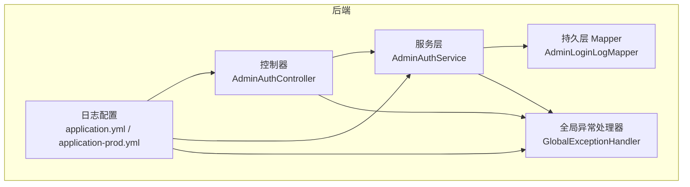
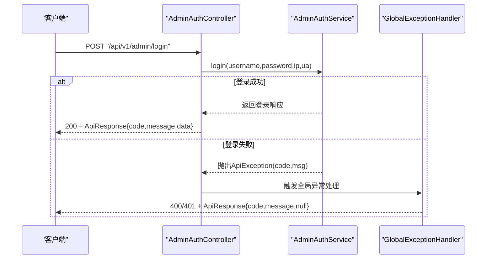
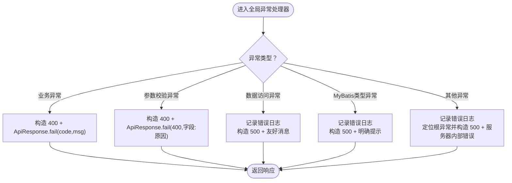
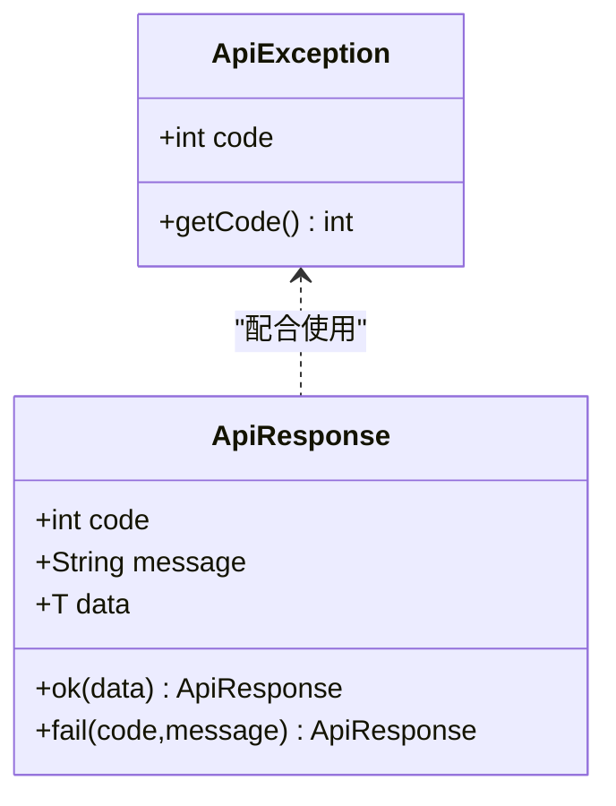
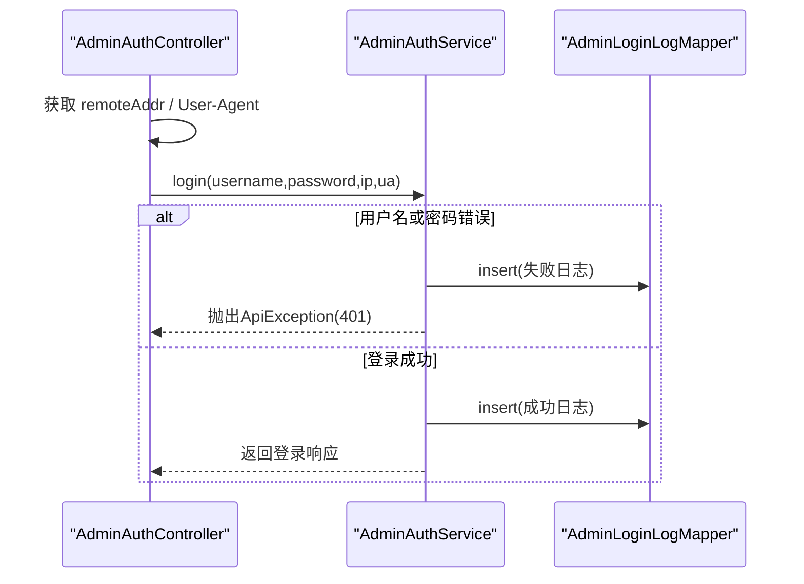
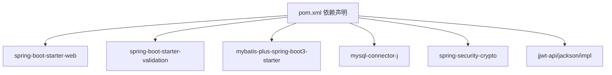

# 日志分析方法

<cite>
**本文引用的文件**
- [GlobalExceptionHandler.java](file://backend/src/main/java/com/ypfr/loseweight/common/GlobalExceptionHandler.java)
- [ApiException.java](file://backend/src/main/java/com/ypfr/loseweight/common/ApiException.java)
- [ApiResponse.java](file://backend/src/main/java/com/ypfr/loseweight/common/ApiResponse.java)
- [application.yml](file://backend/src/main/resources/application.yml)
- [application-local.yml](file://backend/src/main/resources/application-local.yml)
- [application-prod.yml](file://backend/src/main/resources/application-prod.yml)
- [AdminAuthService.java](file://backend/src/main/java/com/ypfr/loseweight/service/AdminAuthService.java)
- [AdminAuthController.java](file://backend/src/main/java/com/ypfr/loseweight/web/AdminAuthController.java)
- [WebConfig.java](file://backend/src/main/java/com/ypfr/loseweight/config/WebConfig.java)
- [JwtProperties.java](file://backend/src/main/java/com/ypfr/loseweight/config/JwtProperties.java)
- [pom.xml](file://backend/pom.xml)
- [V017__food_category_code_sidebar_seed.sql](file://database/migrations/V017__food_category_code_sidebar_seed.sql)
- [V021__vip_product_enabled_int.sql](file://database/migrations/V021__vip_product_enabled_int.sql)
</cite>

## 目录
1. [简介](#简介)
2. [项目结构](#项目结构)
3. [核心组件](#核心组件)
4. [架构总览](#架构总览)
5. [详细组件分析](#详细组件分析)
6. [依赖分析](#依赖分析)
7. [性能考虑](#性能考虑)
8. [故障排查指南](#故障排查指南)
9. [结论](#结论)
10. [附录](#附录)

## 简介
本文件面向后端开发与运维人员，系统化梳理本项目的日志分析方法，涵盖以下主题：
- 错误日志解读：HTTP状态码含义、异常堆栈跟踪分析、业务异常处理流程
- 性能日志分析：数据库慢查询识别、API响应时间监控、内存使用分析
- 调试工具使用：IDE调试器设置、Postman接口测试、浏览器开发者工具
- 日志级别配置：DEBUG/INFO/WARN/ERROR级别设置、敏感信息脱敏处理
- 日志格式解析示例、关键指标监控方法、日志收集工具配置
- 常见日志问题的诊断思路与解决策略

## 项目结构
后端采用Spring Boot工程，日志相关的关键位置如下：
- 异常统一处理：全局异常处理器负责捕获各类异常并输出结构化响应
- 日志配置：YAML中定义日志级别与MyBatis SQL日志实现
- 控制层与服务层：控制器负责提取请求上下文（如IP、UA），服务层负责业务逻辑与持久化
- 数据库迁移脚本：用于修复常见数据库结构不匹配导致的异常

图表来源
- [AdminAuthController.java:1-62](file://backend/src/main/java/com/ypfr/loseweight/web/AdminAuthController.java#L1-L62)
- [AdminAuthService.java:1-80](file://backend/src/main/java/com/ypfr/loseweight/service/AdminAuthService.java#L1-L80)
- [GlobalExceptionHandler.java:1-107](file://backend/src/main/java/com/ypfr/loseweight/common/GlobalExceptionHandler.java#L1-L107)
- [application.yml:51-54](file://backend/src/main/resources/application.yml#L51-L54)
- [application-prod.yml:16-19](file://backend/src/main/resources/application-prod.yml#L16-L19)

章节来源
- [application.yml:1-54](file://backend/src/main/resources/application.yml#L1-L54)
- [application-prod.yml:1-19](file://backend/src/main/resources/application-prod.yml#L1-L19)

## 核心组件
- 全局异常处理器：集中捕获业务异常、参数校验异常、数据访问异常、MyBatis类型映射异常以及未处理异常，并输出结构化响应体
- 业务异常类：ApiException携带业务码与消息，便于前端与日志侧统一识别
- 统一响应体：ApiResponse封装code/message/data，确保前后端契约一致
- 日志配置：本地与生产环境分别设置日志级别，MyBatis SQL日志由Slf4j实现输出

章节来源
- [GlobalExceptionHandler.java:1-107](file://backend/src/main/java/com/ypfr/loseweight/common/GlobalExceptionHandler.java#L1-L107)
- [ApiException.java:1-16](file://backend/src/main/java/com/ypfr/loseweight/common/ApiException.java#L1-L16)
- [ApiResponse.java:1-35](file://backend/src/main/java/com/ypfr/loseweight/common/ApiResponse.java#L1-L35)
- [application.yml:51-54](file://backend/src/main/resources/application.yml#L51-L54)
- [application-prod.yml:16-19](file://backend/src/main/resources/application-prod.yml#L16-L19)

## 架构总览
下图展示一次登录请求从控制器到服务层再到异常处理的整体流程，以及日志与配置的交互。

图表来源
- [AdminAuthController.java:36-42](file://backend/src/main/java/com/ypfr/loseweight/web/AdminAuthController.java#L36-L42)
- [AdminAuthService.java:31-52](file://backend/src/main/java/com/ypfr/loseweight/service/AdminAuthService.java#L31-L52)
- [GlobalExceptionHandler.java:19-32](file://backend/src/main/java/com/ypfr/loseweight/common/GlobalExceptionHandler.java#L19-L32)

## 详细组件分析

### 全局异常处理与日志记录
- 捕获范围：业务异常、参数校验异常、数据访问异常、MyBatis类型映射异常、通用异常
- 输出策略：根据异常类型返回对应HTTP状态码与结构化响应；对数据库异常进行友好化消息拼装
- 日志记录：对未处理异常与数据库异常进行错误日志记录，便于定位根因

图表来源
- [GlobalExceptionHandler.java:19-66](file://backend/src/main/java/com/ypfr/loseweight/common/GlobalExceptionHandler.java#L19-L66)
- [GlobalExceptionHandler.java:68-97](file://backend/src/main/java/com/ypfr/loseweight/common/GlobalExceptionHandler.java#L68-L97)

章节来源
- [GlobalExceptionHandler.java:1-107](file://backend/src/main/java/com/ypfr/loseweight/common/GlobalExceptionHandler.java#L1-L107)

### 业务异常与统一响应
- 业务异常：ApiException携带业务码与消息，便于前端与日志侧统一识别
- 统一响应：ApiResponse封装code/message/data，确保前后端契约一致

图表来源
- [ApiException.java:1-16](file://backend/src/main/java/com/ypfr/loseweight/common/ApiException.java#L1-L16)
- [ApiResponse.java:1-35](file://backend/src/main/java/com/ypfr/loseweight/common/ApiResponse.java#L1-L35)

章节来源
- [ApiException.java:1-16](file://backend/src/main/java/com/ypfr/loseweight/common/ApiException.java#L1-L16)
- [ApiResponse.java:1-35](file://backend/src/main/java/com/ypfr/loseweight/common/ApiResponse.java#L1-L35)

### 控制器与服务层日志采集点
- 控制器：从请求中提取IP与User-Agent，作为登录日志的重要上下文
- 服务层：在登录成功/失败时写入管理员登录日志，便于审计与安全分析

图表来源
- [AdminAuthController.java:36-42](file://backend/src/main/java/com/ypfr/loseweight/web/AdminAuthController.java#L36-L42)
- [AdminAuthService.java:31-78](file://backend/src/main/java/com/ypfr/loseweight/service/AdminAuthService.java#L31-L78)

章节来源
- [AdminAuthController.java:1-62](file://backend/src/main/java/com/ypfr/loseweight/web/AdminAuthController.java#L1-L62)
- [AdminAuthService.java:1-80](file://backend/src/main/java/com/ypfr/loseweight/service/AdminAuthService.java#L1-L80)

### 日志级别与SQL日志配置
- 本地开发：设置特定包的日志级别为DEBUG，便于观察SQL与业务日志
- 生产环境：root级别INFO，减少冗余日志
- MyBatis SQL日志：通过Slf4j实现输出，便于排查慢查询与异常SQL

章节来源
- [application.yml:51-54](file://backend/src/main/resources/application.yml#L51-L54)
- [application-prod.yml:16-19](file://backend/src/main/resources/application-prod.yml#L16-L19)

### 数据库结构不匹配与异常关联
- 常见问题：数据库列缺失或类型映射不一致（如会员表enabled字段类型）
- 处理策略：通过全局异常处理器给出明确修复指引与脚本路径
- 修复脚本：提供幂等的迁移脚本，修复字段类型与缺失列

章节来源
- [GlobalExceptionHandler.java:42-51](file://backend/src/main/java/com/ypfr/loseweight/common/GlobalExceptionHandler.java#L42-L51)
- [GlobalExceptionHandler.java:68-97](file://backend/src/main/java/com/ypfr/loseweight/common/GlobalExceptionHandler.java#L68-L97)
- [V017__food_category_code_sidebar_seed.sql:1-344](file://database/migrations/V017__food_category_code_sidebar_seed.sql#L1-L344)
- [V021__vip_product_enabled_int.sql:1-11](file://database/migrations/V021__vip_product_enabled_int.sql#L1-L11)

## 依赖分析
- Spring MVC与WebFlux：提供REST接口能力
- MyBatis-Plus：ORM框架，结合日志实现输出SQL
- Spring Security Crypto：密码编码与校验
- JWT：令牌签发与校验（配置项位于属性类）

图表来源
- [pom.xml:25-75](file://backend/pom.xml#L25-L75)

章节来源
- [pom.xml:1-86](file://backend/pom.xml#L1-L86)

## 性能考虑
- 数据库慢查询识别
  - 开启MyBatis SQL日志（本地开发），关注长时间运行的SQL
  - 结合全局异常处理器输出的友好消息，定位结构不匹配或索引缺失导致的慢查询
- API响应时间监控
  - 在控制器层记录请求开始与结束时间，计算耗时并输出到日志
  - 关注参数校验与外部调用（如RestTemplate）的超时配置
- 内存使用分析
  - 生产环境降低日志级别，避免过多DEBUG日志造成内存压力
  - 关注大对象序列化与上传文件大小限制

章节来源
- [application.yml:21-28](file://backend/src/main/resources/application.yml#L21-L28)
- [WebConfig.java:23-29](file://backend/src/main/java/com/ypfr/loseweight/config/WebConfig.java#L23-L29)
- [application-prod.yml:16-19](file://backend/src/main/resources/application-prod.yml#L16-L19)

## 故障排查指南
- HTTP状态码与响应体解读
  - 400：参数校验异常，响应体包含首个字段与错误消息
  - 401：业务认证失败（如用户名或密码错误），响应体包含业务码与消息
  - 500：服务器内部错误，响应体包含友好消息；若为数据库异常，需查看后端日志定位具体SQL与结构问题
- 异常堆栈跟踪分析
  - 未处理异常：全局异常处理器会记录错误日志并向上抛出500
  - 数据库异常：优先查看根异常（root cause），结合友好消息与脚本指引修复
- 业务异常处理
  - 业务异常由ApiException抛出，响应体包含业务码与消息，便于前端与日志侧统一识别
- 常见数据库问题
  - 缺少列或列类型不匹配：参考全局异常处理器提供的脚本路径，执行幂等迁移脚本
  - MyBatis类型映射异常：按提示修复字段类型（如会员表enabled改为INT）

章节来源
- [GlobalExceptionHandler.java:19-66](file://backend/src/main/java/com/ypfr/loseweight/common/GlobalExceptionHandler.java#L19-L66)
- [GlobalExceptionHandler.java:68-97](file://backend/src/main/java/com/ypfr/loseweight/common/GlobalExceptionHandler.java#L68-L97)
- [ApiException.java:1-16](file://backend/src/main/java/com/ypfr/loseweight/common/ApiException.java#L1-L16)
- [ApiResponse.java:1-35](file://backend/src/main/java/com/ypfr/loseweight/common/ApiResponse.java#L1-L35)

## 结论
通过统一的异常处理、结构化的响应体与清晰的日志配置，本项目实现了“可读、可诊断、可追踪”的日志体系。建议在日常开发中：
- 本地开启DEBUG级别日志，生产维持INFO级别
- 遇到数据库异常优先查看根异常与友好消息，按指引执行迁移脚本
- 在控制器层补充请求耗时与关键上下文日志，提升可观测性

## 附录
- 日志级别配置要点
  - 本地：设置特定包为DEBUG，便于SQL与业务日志观测
  - 生产：root级别INFO，避免日志风暴
- 敏感信息脱敏处理
  - 对日志中的密码、令牌、手机号等敏感字段进行脱敏或屏蔽
- 调试工具使用建议
  - IDE：断点设置在控制器与服务层关键节点，观察上下文与异常传播
  - Postman：构造典型场景（含参数校验失败、数据库异常场景），观察响应体与状态码
  - 浏览器开发者工具：抓取网络请求，核对请求头与响应体

章节来源
- [application.yml:51-54](file://backend/src/main/resources/application.yml#L51-L54)
- [application-prod.yml:16-19](file://backend/src/main/resources/application-prod.yml#L16-L19)
- [WebConfig.java:13-21](file://backend/src/main/java/com/ypfr/loseweight/config/WebConfig.java#L13-L21)
- [JwtProperties.java:1-28](file://backend/src/main/java/com/ypfr/loseweight/config/JwtProperties.java#L1-L28)