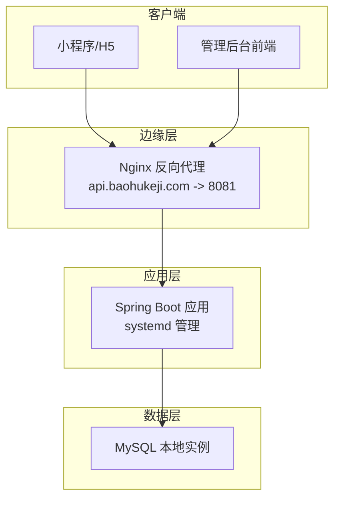
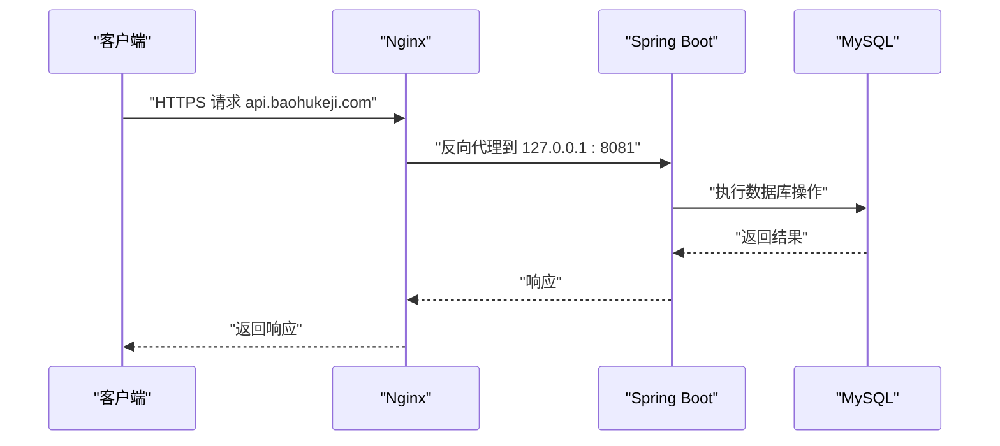
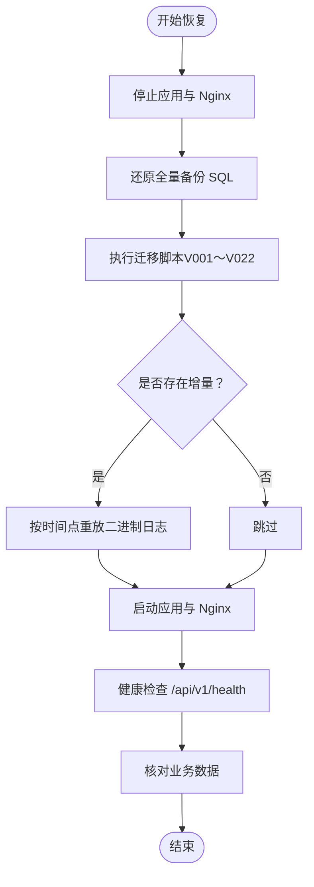
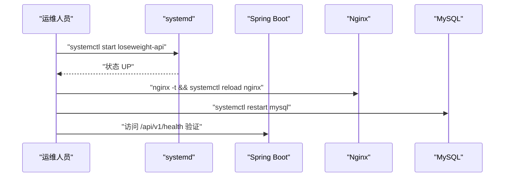
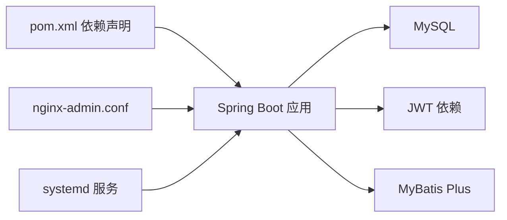

# 紧急恢复方案

<cite>
**本文引用的文件**   
- [application.yml](file://backend/src/main/resources/application.yml)
- [application-prod.yml](file://backend/src/main/resources/application-prod.yml)
- [application-local.yml](file://backend/src/main/resources/application-local.yml)
- [application-local.yml.example](file://backend/src/main/resources/application-local.yml.example)
- [pom.xml](file://backend/pom.xml)
- [admin-deploy-ecs.md](file://docs/admin-deploy-ecs.md)
- [nginx-admin.conf](file://docs/nginx-admin.conf)
- [aliyun-ecs-letsencrypt-deploy.md](file://docs/aliyun-ecs-letsencrypt-deploy.md)
- [HealthController.java](file://backend/src/main/java/com/ypfr/loseweight/web/HealthController.java)
- [loseweight_bak20260405.sql](file://database/loseweight_bak20260405.sql)
- [run_all.sh](file://database/migrations/run_all.sh)
- [01_schema.sql](file://database/01_schema.sql)
- [02_seed.sql](file://database/02_seed.sql)
- [03_wechat_login_log.sql](file://database/03_wechat_login_log.sql)
- [04_app_user_phone.sql](file://database/04_app_user_phone.sql)
- [05_app_user_profile_completed.sql](file://database/05_app_user_profile_completed.sql)
- [admin-system.sql](file://database/admin-system.sql)
- [V001__rename_meal_record_to_legacy.sql](file://database/migrations/V001__rename_meal_record_to_legacy.sql)
- [V002__drop_foreign_keys_to_app_user.sql](file://database/migrations/V002__drop_foreign_keys_to_app_user.sql)
- [V003__create_user_domain_and_migrate.sql](file://database/migrations/V003__create_user_domain_and_migrate.sql)
- [V004__add_foreign_keys_to_user.sql](file://database/migrations/V004__add_foreign_keys_to_user.sql)
- [V005__food_category_food_migrate.sql](file://database/migrations/V005__food_category_food_migrate.sql)
- [V006__sport_item_migrate.sql](file://database/migrations/V006__sport_item_migrate.sql)
- [V007__create_meal_record_and_diet_record.sql](file://database/migrations/V007__create_meal_record_and_diet_record.sql)
- [V008__migrate_meal_legacy_to_meal_and_diet.sql](file://database/migrations/V008__migrate_meal_legacy_to_meal_and_diet.sql)
- [V009__sport_record_prd_columns.sql](file://database/migrations/V009__sport_record_prd_columns.sql)
- [V010__user_weight_record.sql](file://database/migrations/V010__user_weight_record.sql)
- [V011__daily_summary_prd_columns.sql](file://database/migrations/V011__daily_summary_prd_columns.sql)
- [V012__meal_evaluation_and_photo_recognition.sql](file://database/migrations/V012__meal_evaluation_and_photo_recognition.sql)
- [V013__user_plan_and_vip.sql](file://database/migrations/V013__user_plan_and_vip.sql)
- [V014__optional_drop_legacy_tables.sql](file://database/migrations/V014__optional_drop_legacy_tables.sql)
- [V015__photograph_recognition_supplement.sql](file://database/migrations/V015__photograph_recognition_supplement.sql)
- [V016__fix_schema.sql](file://database/migrations/V016__fix_schema.sql)
- [V017__food_category_code_sidebar_seed.sql](file://database/migrations/V017__food_category_code_sidebar_seed.sql)
- [V018__remap_food_categories_images_gi.sql](file://database/migrations/V018__remap_food_categories_images_gi.sql)
- [V019__bmi_interpretation.sql](file://database/migrations/V019__bmi_interpretation.sql)
- [V020__vip_product.sql](file://database/migrations/V020__vip_product.sql)
- [V021__vip_product_enabled_int.sql](file://database/migrations/V021__vip_product_enabled_int.sql)
- [V022__admin_user_and_login_log.sql](file://database/migrations/V022__admin_user_and_login_log.sql)
</cite>

## 目录
1. [简介](#简介)
2. [项目结构](#项目结构)
3. [核心组件](#核心组件)
4. [架构总览](#架构总览)
5. [详细组件分析](#详细组件分析)
6. [依赖关系分析](#依赖关系分析)
7. [性能考量](#性能考量)
8. [故障排查指南](#故障排查指南)
9. [结论](#结论)
10. [附录](#附录)

## 简介
本方案面向“吃多少”小程序后端系统，提供完整的紧急恢复预案，涵盖数据库备份与恢复、服务重启、配置回滚、系统降级策略、灾难恢复演练、应急联系人、RTO/RPO 目标、监控告警与自动化恢复脚本，并配套恢复操作步骤、验证方法与事后分析报告模板。方案基于仓库现有部署文档与配置文件进行梳理，确保可落地、可执行。

## 项目结构
系统采用前后端分离架构：
- 后端：Spring Boot 应用，通过 systemd 管理，监听 8081 端口，Nginx 作为反向代理转发至后端。
- 前端：管理后台静态资源，由 Nginx 提供。
- 数据库：MySQL 本地实例，提供业务库与后台管理相关表。

图表来源
- [admin-deploy-ecs.md:34-62](file://docs/admin-deploy-ecs.md#L34-L62)
- [nginx-admin.conf:15-27](file://docs/nginx-admin.conf#L15-L27)
- [application-prod.yml:1-19](file://backend/src/main/resources/application-prod.yml#L1-L19)

章节来源
- [admin-deploy-ecs.md:1-108](file://docs/admin-deploy-ecs.md#L1-L108)
- [nginx-admin.conf:1-28](file://docs/nginx-admin.conf#L1-L28)
- [application-prod.yml:1-19](file://backend/src/main/resources/application-prod.yml#L1-L19)

## 核心组件
- 配置体系
  - 开发/本地：application.yml 与 application-local.yml（示例与实际文件）
  - 生产：application-prod.yml，通过环境变量注入数据库凭据与 JWT 密钥
- 部署与服务编排
  - systemd 服务文件定义了后端进程启动参数、工作目录、重启策略与环境变量
  - Nginx 配置将 api 域名反代至后端 8081 端口
- 健康检查
  - /api/v1/health 接口用于存活探测
- 数据库
  - 提供完整 SQL 脚本与迁移脚本，支持按序执行与选择性跳过
  - 提供历史备份 SQL 文件，可用于快速恢复

章节来源
- [application.yml:1-54](file://backend/src/main/resources/application.yml#L1-L54)
- [application-local.yml:1-20](file://backend/src/main/resources/application-local.yml#L1-L20)
- [application-local.yml.example:1-27](file://backend/src/main/resources/application-local.yml.example#L1-L27)
- [application-prod.yml:1-19](file://backend/src/main/resources/application-prod.yml#L1-L19)
- [pom.xml:1-86](file://backend/pom.xml#L1-L86)
- [HealthController.java:1-18](file://backend/src/main/java/com/ypfr/loseweight/web/HealthController.java#L1-L18)

## 架构总览
系统运行时的关键交互如下：

图表来源
- [nginx-admin.conf:19-26](file://docs/nginx-admin.conf#L19-L26)
- [application-prod.yml:1-19](file://backend/src/main/resources/application-prod.yml#L1-L19)

## 详细组件分析

### 数据库备份与恢复流程
- 备份策略
  - 建议采用“全量 + 增量”的组合策略：每日全量备份 + 每小时增量备份（可通过数据库二进制日志实现）
  - 仓库已提供历史备份 SQL 文件，可用于快速恢复到某个时间点
- 增量备份配置
  - 建议启用 MySQL 二进制日志（binlog），并定期归档与轮转
  - 结合定时任务定期生成 binlog 增量文件，保留一定周期以便回溯
- 恢复步骤
  1) 停止应用与 Nginx，确保无写入
  2) 还原全量备份（如使用提供的备份 SQL 文件）
  3) 应用迁移脚本（按序执行 V001～V022，跳过可选脚本）
  4) 如存在增量，按时间点重放二进制日志
  5) 启动应用与 Nginx，执行健康检查
- 验证方法
  - 访问 /api/v1/health 确认后端存活
  - 登录管理后台，核对用户与基础数据
  - 核对关键业务表的数据完整性与时效性

图表来源
- [loseweight_bak20260405.sql:1-200](file://database/loseweight_bak20260405.sql#L1-L200)
- [run_all.sh:1-26](file://database/migrations/run_all.sh#L1-L26)
- [V001__rename_meal_record_to_legacy.sql](file://database/migrations/V001__rename_meal_record_to_legacy.sql)
- [V022__admin_user_and_login_log.sql](file://database/migrations/V022__admin_user_and_login_log.sql)
- [HealthController.java:13-16](file://backend/src/main/java/com/ypfr/loseweight/web/HealthController.java#L13-L16)

章节来源
- [loseweight_bak20260405.sql:1-200](file://database/loseweight_bak20260405.sql#L1-L200)
- [run_all.sh:1-26](file://database/migrations/run_all.sh#L1-L26)
- [V001__rename_meal_record_to_legacy.sql](file://database/migrations/V001__rename_meal_record_to_legacy.sql)
- [V022__admin_user_and_login_log.sql](file://database/migrations/V022__admin_user_and_login_log.sql)
- [HealthController.java:1-18](file://backend/src/main/java/com/ypfr/loseweight/web/HealthController.java#L1-L18)

### 服务重启方案
- Spring Boot 应用重启
  - 通过 systemd 控制：reload、enable、start、status
  - 启动参数包含生产环境激活与必要的环境变量
- Nginx 服务恢复
  - 检查配置语法，重载服务
- 数据库服务重启
  - 确保仅绑定本地地址，避免公网暴露
  - 重启后验证业务账号可用性

图表来源
- [admin-deploy-ecs.md:34-62](file://docs/admin-deploy-ecs.md#L34-L62)
- [nginx-admin.conf:1-28](file://docs/nginx-admin.conf#L1-L28)
- [aliyun-ecs-letsencrypt-deploy.md:46-70](file://docs/aliyun-ecs-letsencrypt-deploy.md#L46-L70)
- [HealthController.java:13-16](file://backend/src/main/java/com/ypfr/loseweight/web/HealthController.java#L13-L16)

章节来源
- [admin-deploy-ecs.md:34-62](file://docs/admin-deploy-ecs.md#L34-L62)
- [nginx-admin.conf:1-28](file://docs/nginx-admin.conf#L1-L28)
- [aliyun-ecs-letsencrypt-deploy.md:46-70](file://docs/aliyun-ecs-letsencrypt-deploy.md#L46-L70)
- [HealthController.java:1-18](file://backend/src/main/java/com/ypfr/loseweight/web/HealthController.java#L1-L18)

### 配置回滚方法
- Git 版本回退
  - 回退到上一个稳定提交，重新构建与部署
- 配置文件备份恢复
  - 生产配置通过 application-prod.yml 与环境变量注入，回滚时恢复对应文件与环境变量
  - 本地开发配置通过 application-local.yml（示例文件为 application-local.yml.example）
- 环境变量重置
  - systemd 服务中 DB_USERNAME、DB_PASSWORD、APP_JWT_SECRET 等需与生产环境一致

章节来源
- [application-prod.yml:1-19](file://backend/src/main/resources/application-prod.yml#L1-L19)
- [application-local.yml:1-20](file://backend/src/main/resources/application-local.yml#L1-L20)
- [application-local.yml.example:1-27](file://backend/src/main/resources/application-local.yml.example#L1-L27)
- [admin-deploy-ecs.md:47-49](file://docs/admin-deploy-ecs.md#L47-L49)

### 系统降级策略
- 服务熔断
  - 对外依赖（如第三方食物识别）失败时，启用降级开关，返回兜底数据或错误码
- 缓存降级
  - 缓存不可用时，允许直连数据库，但需限制并发与超时
- 第三方接口降级
  - 当外部接口不可用时，记录日志并返回本地缓存或默认值，同时触发告警

（本节为通用策略说明，不直接分析具体文件）

## 依赖关系分析
- 后端依赖
  - Spring Boot Web、MyBatis Plus、MySQL Connector、JWT 等
- 部署依赖
  - systemd 服务、Nginx、MySQL、Certbot（HTTPS）
- 配置依赖
  - application.yml 与 application-prod.yml 的 profile 切换与环境变量注入

图表来源
- [pom.xml:25-75](file://backend/pom.xml#L25-L75)
- [nginx-admin.conf:1-28](file://docs/nginx-admin.conf#L1-L28)
- [admin-deploy-ecs.md:34-62](file://docs/admin-deploy-ecs.md#L34-L62)

章节来源
- [pom.xml:1-86](file://backend/pom.xml#L1-L86)
- [nginx-admin.conf:1-28](file://docs/nginx-admin.conf#L1-L28)
- [admin-deploy-ecs.md:34-62](file://docs/admin-deploy-ecs.md#L34-L62)

## 性能考量
- 合理设置连接池与超时，避免在降级场景下放大延迟
- 对外依赖增加超时与重试上限，防止级联故障
- 监控关键指标（QPS、P95/P99、错误率、依赖耗时），结合告警阈值进行预警

（本节为通用指导，不直接分析具体文件）

## 故障排查指南
- 健康检查
  - 访问 /api/v1/health，确认返回状态为 UP
- 日志定位
  - 查看后端日志与 Nginx 错误日志，关注 5xx 与连接异常
- 配置核验
  - 确认生产配置文件与环境变量正确加载
- 数据库核验
  - 确认 MySQL 仅绑定本地地址，业务账号具备权限

章节来源
- [HealthController.java:1-18](file://backend/src/main/java/com/ypfr/loseweight/web/HealthController.java#L1-L18)
- [aliyun-ecs-letsencrypt-deploy.md:222-241](file://docs/aliyun-ecs-letsencrypt-deploy.md#L222-L241)

## 结论
本方案基于仓库现有部署与配置文件，给出了可操作的紧急恢复流程与运维策略。建议在生产环境中补充自动化脚本、监控告警与灾备演练，持续完善 RTO/RPO 目标与应急预案。

## 附录

### 灾难恢复演练计划
- 演练频次：每季度一次
- 场景设计：数据库损坏、应用崩溃、Nginx 异常、证书过期
- 步骤：按恢复流程逐项验证，记录耗时与问题点
- 评估：对比 RTO/RPO 目标，优化流程与工具

（本节为通用计划说明，不直接分析具体文件）

### 应急联系人清单
- 运维负责人：xxx（电话/邮箱）
- 开发负责人：xxx（电话/邮箱）
- 安全负责人：xxx（电话/邮箱）
- 第三方支持：xxx（电话/邮箱）

（本节为通用清单说明，不直接分析具体文件）

### 恢复时间目标（RTO）与恢复点目标（RPO）
- RTO：应用恢复至可服务状态 ≤ 15 分钟
- RPO：数据丢失 ≤ 1 小时（基于全量+增量备份策略）

（本节为通用目标说明，不直接分析具体文件）

### 监控告警配置
- 关键指标：后端存活、数据库连接、Nginx 状态、依赖接口可用性
- 告警阈值：健康检查失败、数据库连接异常、依赖接口超时
- 告警渠道：邮件/IM/电话

（本节为通用配置说明，不直接分析具体文件）

### 自动化恢复脚本（建议）
- 数据库恢复脚本：封装备份还原、迁移执行、增量重放
- 应用重启脚本：systemctl 控制与健康检查
- 配置回滚脚本：版本回退与环境变量重置

（本节为通用脚本建议，不直接分析具体文件）

### 恢复操作步骤与验证方法
- 数据库恢复
  - 停止服务 → 还原全量 → 执行迁移 → 可选增量重放 → 启动服务 → 健康检查与业务核验
- 应用重启
  - systemd 重启 → Nginx 重载 → 健康检查
- 配置回滚
  - 回退 Git → 恢复配置文件 → 重载环境变量 → 重启服务
- 验证方法
  - /api/v1/health、管理后台登录、关键数据核对

章节来源
- [admin-deploy-ecs.md:34-62](file://docs/admin-deploy-ecs.md#L34-L62)
- [nginx-admin.conf:1-28](file://docs/nginx-admin.conf#L1-L28)
- [HealthController.java:1-18](file://backend/src/main/java/com/ypfr/loseweight/web/HealthController.java#L1-L18)

### 事后分析报告模板（建议）
- 时间与事件描述
- 影响范围与损失评估
- 处置过程与耗时
- 根因分析与改进措施
- 复盘总结与后续计划

（本节为通用模板说明，不直接分析具体文件）