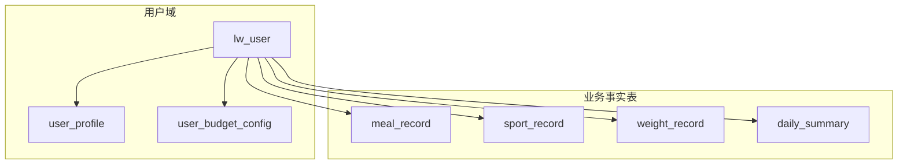
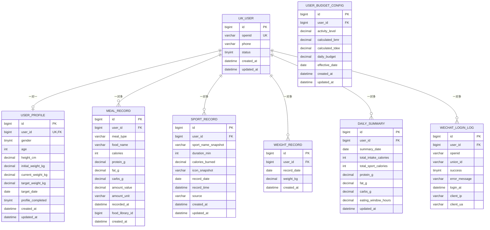
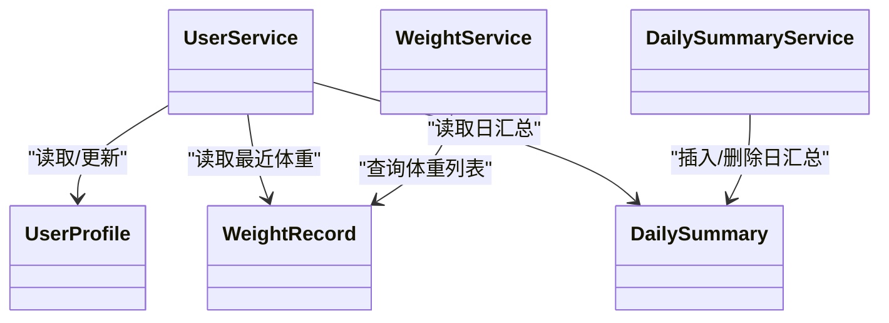

# 关系映射与约束

<cite>
**本文引用的文件**
- [01_schema.sql](file://database/01_schema.sql)
- [02_seed.sql](file://database/02_seed.sql)
- [V003__create_user_domain_and_migrate.sql](file://database/migrations/V003__create_user_domain_and_migrate.sql)
- [V004__add_foreign_keys_to_user.sql](file://database/migrations/V004__add_foreign_keys_to_user.sql)
- [V009__sport_record_prd_columns.sql](file://database/migrations/V009__sport_record_prd_columns.sql)
- [project_current_baseline_alignment.sql](file://database/project_current_baseline_alignment.sql)
- [UserService.java](file://backend/src/main/java/com/ypfr/loseweight/service/UserService.java)
- [WeightService.java](file://backend/src/main/java/com/ypfr/loseweight/service/WeightService.java)
- [DailySummaryService.java](file://backend/src/main/java/com/ypfr/loseweight/service/DailySummaryService.java)
- [UserProfile.java](file://backend/src/main/java/com/ypfr/loseweight/domain/UserProfile.java)
- [WeightRecord.java](file://backend/src/main/java/com/ypfr/loseweight/domain/WeightRecord.java)
- [DailySummary.java](file://backend/src/main/java/com/ypfr/loseweight/domain/DailySummary.java)
</cite>

## 目录
1. [简介](#简介)
2. [项目结构](#项目结构)
3. [核心组件](#核心组件)
4. [架构总览](#架构总览)
5. [详细组件分析](#详细组件分析)
6. [依赖分析](#依赖分析)
7. [性能考量](#性能考量)
8. [故障排查指南](#故障排查指南)
9. [结论](#结论)
10. [附录](#附录)

## 简介
本文件面向数据库关系映射与约束设计，系统化梳理用户表与其他业务表之间的外键关系、引用完整性保障、唯一约束与索引策略，以及反规范化设计的权衡与影响。文档同时给出ER图与关系图，帮助读者快速理解表间依赖与查询路径，并总结关系查询的最佳实践与注意事项。

## 项目结构
数据库层采用“用户域 + 业务事实表”的分层设计：
- 用户域：lw_user（用户主体）、user_profile（用户档案）、user_budget_config（预算配置）
- 业务事实表：meal_record（饮食记录）、sport_record（运动记录）、weight_record（体重记录）、daily_summary（日汇总）

图表来源
- [V003__create_user_domain_and_migrate.sql:12-71](file://database/migrations/V003__create_user_domain_and_migrate.sql#L12-L71)
- [01_schema.sql:11-159](file://database/01_schema.sql#L11-L159)

章节来源
- [V003__create_user_domain_and_migrate.sql:12-71](file://database/migrations/V003__create_user_domain_and_migrate.sql#L12-L71)
- [01_schema.sql:11-159](file://database/01_schema.sql#L11-L159)

## 核心组件
- 用户表（lw_user）：存储用户身份信息与状态，唯一约束 openid，作为所有业务事实表的父表。
- 用户档案（user_profile）：一对一承载性别、身高、体重、目标等信息，通过外键与 lw_user 引用。
- 用户预算（user_budget_config）：按生效日期维度的预算配置快照，通过外键与 lw_user 引用。
- 饮食记录（meal_record）：按条目记录食物摄入，按 user_id + recorded_at 排序，外键引用 lw_user。
- 运动记录（sport_record）：按条目记录运动消耗，按 user_id + record_date 排序，外键引用 lw_user。
- 体重记录（weight_record）：按日一条体重，唯一约束 user_id + record_date，外键引用 lw_user。
- 日汇总（daily_summary）：按日聚合摄入、消耗与宏量营养素，唯一约束 user_id + summary_date，外键引用 lw_user。
- 微信登录日志（wechat_login_log）：记录登录行为，user_id 外键引用 lw_user，支持级联删除为 SET NULL。

章节来源
- [01_schema.sql:11-159](file://database/01_schema.sql#L11-L159)
- [V003__create_user_domain_and_migrate.sql:12-71](file://database/migrations/V003__create_user_domain_and_migrate.sql#L12-L71)
- [V004__add_foreign_keys_to_user.sql:10-26](file://database/migrations/V004__add_foreign_keys_to_user.sql#L10-L26)

## 架构总览
下图展示用户域与业务事实表之间的外键关系与引用完整性：

图表来源
- [01_schema.sql:11-159](file://database/01_schema.sql#L11-L159)
- [V003__create_user_domain_and_migrate.sql:12-71](file://database/migrations/V003__create_user_domain_and_migrate.sql#L12-L71)
- [V004__add_foreign_keys_to_user.sql:10-26](file://database/migrations/V004__add_foreign_keys_to_user.sql#L10-L26)

## 详细组件分析

### 用户表与其他表的一对多关系映射
- app_user → meal_record：一对多（用户到饮食记录），meal_record.user_id 引用 app_user.id。
- app_user → sport_record：一对多（用户到运动记录），sport_record.user_id 引用 app_user.id。
- app_user → weight_record：一对多（用户到体重记录），weight_record.user_id 引用 app_user.id。
- app_user → daily_summary：一对多（用户到日汇总），daily_summary.user_id 引用 app_user.id。
- app_user → wechat_login_log：一对多（用户到登录日志），wechat_login_log.user_id 引用 app_user.id。

迁移后（当前线上结构）：
- lw_user → user_profile：一对一（通过 user_profile.user_id 唯一约束）。
- lw_user → user_budget_config：一对多（按生效日期快照）。
- lw_user → meal_record：一对多。
- lw_user → sport_record：一对多。
- lw_user → weight_record：一对多。
- lw_user → daily_summary：一对多。
- lw_user → wechat_login_log：一对多。

章节来源
- [01_schema.sql:11-159](file://database/01_schema.sql#L11-L159)
- [V003__create_user_domain_and_migrate.sql:12-71](file://database/migrations/V003__create_user_domain_and_migrate.sql#L12-L71)
- [V004__add_foreign_keys_to_user.sql:10-26](file://database/migrations/V004__add_foreign_keys_to_user.sql#L10-L26)

### 外键约束与引用完整性
- meal_record.user_id → lw_user.id：保证每条饮食记录归属有效用户。
- sport_record.user_id → lw_user.id：保证每条运动记录归属有效用户。
- weight_record.user_id → lw_user.id：保证每条体重记录归属有效用户。
- daily_summary.user_id → lw_user.id：保证每条日汇总归属有效用户。
- wechat_login_log.user_id → lw_user.id：保证登录日志归属有效用户。
- user_profile.user_id → lw_user.id：保证档案归属有效用户。
- user_budget_config.user_id → lw_user.id：保证预算配置归属有效用户。

级联策略：
- wechat_login_log.user_id：ON DELETE SET NULL，当用户被删除时，登录日志保留但 user_id 置空，用于审计与追踪。
- 其他事实表未声明 ON DELETE/CASCADE，默认为 RESTRICT（MySQL 默认），防止误删用户导致数据悬挂。

章节来源
- [01_schema.sql:36-159](file://database/01_schema.sql#L36-L159)
- [V004__add_foreign_keys_to_user.sql:10-26](file://database/migrations/V004__add_foreign_keys_to_user.sql#L10-L26)

### 唯一约束与设计目的
- lw_user.openid：全局唯一，确保微信 openid 唯一性，避免重复注册与数据混淆。
- user_profile.user_id：唯一，确保每个用户仅有一份档案。
- weight_record(user_id, record_date)：唯一，确保用户每天仅有一条体重记录，避免重复录入引发统计偏差。
- daily_summary(user_id, summary_date)：唯一，确保日汇总按用户+日期唯一，避免重复聚合。
- wechat_login_log(openid, login_at)：复合索引，便于按 openid 快速检索登录历史。

章节来源
- [01_schema.sql:11-159](file://database/01_schema.sql#L11-L159)
- [V003__create_user_domain_and_migrate.sql:34-71](file://database/migrations/V003__create_user_domain_and_migrate.sql#L34-L71)

### 索引策略与查询性能
- meal_record(user_id, recorded_at)：复合索引，支撑按用户的时间线查询与分页。
- sport_record(user_id, record_date)：复合索引，支撑按用户+日期的运动记录查询。
- wechat_login_log(user_id, login_at)：复合索引，支撑按用户登录时间序列查询。
- wechat_login_log(openid, login_at)：复合索引，支撑按 openid 登录时间序列查询。
- user_budget_config(user_id, effective_date)：复合索引，支撑按用户+生效日期的预算快照查询。
- food_library(name)：单列索引，支撑食物名称检索。
- sport_library(name)：单列索引，支撑运动项目名称检索。

索引对关系查询的影响：
- 复合索引优先匹配最左前缀，能显著降低 JOIN 与 WHERE 子句的扫描范围。
- 对于高频的“用户+时间”查询，复合索引可避免额外排序与临时表。

章节来源
- [01_schema.sql:36-159](file://database/01_schema.sql#L36-L159)
- [V003__create_user_domain_and_migrate.sql:52-71](file://database/migrations/V003__create_user_domain_and_migrate.sql#L52-L71)
- [project_current_baseline_alignment.sql:590-618](file://database/project_current_baseline_alignment.sql#L590-L618)

### 级联删除与级联更新策略
- 当前未设置 ON DELETE/CASCADE，采用默认 RESTRICT，避免误删用户导致事实表悬挂。
- wechat_login_log.user_id 设置为 ON DELETE SET NULL，保留登录审计数据，同时允许用户注销或删除账户而不丢失历史登录轨迹。
- 级联更新（ON UPDATE CASCADE）未启用，避免用户主键变更引发大规模外键更新。

策略选择与影响：
- 安全性：RESTRICT 与 SET NULL 降低误删风险，保护审计链路。
- 维护成本：需要在业务层先清理子表再删用户，或允许部分数据悬挂（登录日志）以保留审计证据。

章节来源
- [01_schema.sql:157-157](file://database/01_schema.sql#L157-L157)
- [V004__add_foreign_keys_to_user.sql:26-26](file://database/migrations/V004__add_foreign_keys_to_user.sql#L26-L26)

### 反规范化设计的权衡与必要性
- daily_summary：将日级聚合结果持久化，减少运行时计算成本，提升报表与趋势查询性能。
- user_budget_config：按生效日期快照保存预算参数，避免跨期预算变更带来的复杂关联查询。
- sport_record：拆分字段（sport_name_snapshot、calories_burned、record_time）与新增索引，优化查询与统计效率。

权衡点：
- 写入成本：反规范化会增加写入时的数据一致性维护成本（如预算快照、日汇总重算）。
- 存储成本：冗余字段与快照表占用更多空间。
- 查询性能：显著提升读取性能，尤其在大数据量场景下收益明显。

章节来源
- [01_schema.sql:126-141](file://database/01_schema.sql#L126-L141)
- [V003__create_user_domain_and_migrate.sql:52-71](file://database/migrations/V003__create_user_domain_and_migrate.sql#L52-L71)
- [V009__sport_record_prd_columns.sql:33-49](file://database/migrations/V009__sport_record_prd_columns.sql#L33-L49)
- [project_current_baseline_alignment.sql:590-618](file://database/project_current_baseline_alignment.sql#L590-L618)

### 关系查询最佳实践与注意事项
- 使用复合索引进行“用户+时间/日期”过滤，避免隐式排序与全表扫描。
- 在统计类查询中，优先利用已存在的唯一索引（如体重、日汇总）避免重复数据。
- 删除用户前，先清理或迁移子表数据，或接受登录日志的 user_id 置空以保留审计证据。
- 跨表查询时，尽量在上层服务层（如 DailySummaryService）封装聚合逻辑，减少 SQL 复杂度。

章节来源
- [DailySummaryService.java:87-134](file://backend/src/main/java/com/ypfr/loseweight/service/DailySummaryService.java#L87-L134)
- [WeightService.java:39-45](file://backend/src/main/java/com/ypfr/loseweight/service/WeightService.java#L39-L45)
- [UserService.java:304-318](file://backend/src/main/java/com/ypfr/loseweight/service/UserService.java#L304-L318)

## 依赖分析
- Java 实体与表映射：
  - UserProfile → user_profile
  - WeightRecord → user_weight_record（注意：schema 中为 weight_record，实体类名为 user_weight_record）
  - DailySummary → daily_summary
- 服务层依赖：
  - UserService 依赖多个 Mapper，涉及用户、档案、预算、体重与日汇总。
  - WeightService 依赖 WeightRecordMapper 与 UserProfileMapper，用于体重列表与最近一次记录天数计算。
  - DailySummaryService 依赖 DailySummaryMapper，负责日汇总的插入与删除。

图表来源
- [UserService.java:25-54](file://backend/src/main/java/com/ypfr/loseweight/service/UserService.java#L25-L54)
- [WeightService.java:17-37](file://backend/src/main/java/com/ypfr/loseweight/service/WeightService.java#L17-L37)
- [DailySummaryService.java:87-134](file://backend/src/main/java/com/ypfr/loseweight/service/DailySummaryService.java#L87-L134)
- [UserProfile.java:10-26](file://backend/src/main/java/com/ypfr/loseweight/domain/UserProfile.java#L10-L26)
- [WeightRecord.java:10-21](file://backend/src/main/java/com/ypfr/loseweight/domain/WeightRecord.java#L10-L21)
- [DailySummary.java:10-40](file://backend/src/main/java/com/ypfr/loseweight/domain/DailySummary.java#L10-L40)

章节来源
- [UserProfile.java:10-26](file://backend/src/main/java/com/ypfr/loseweight/domain/UserProfile.java#L10-L26)
- [WeightRecord.java:10-21](file://backend/src/main/java/com/ypfr/loseweight/domain/WeightRecord.java#L10-L21)
- [DailySummary.java:10-40](file://backend/src/main/java/com/ypfr/loseweight/domain/DailySummary.java#L10-L40)
- [UserService.java:25-54](file://backend/src/main/java/com/ypfr/loseweight/service/UserService.java#L25-L54)
- [WeightService.java:17-37](file://backend/src/main/java/com/ypfr/loseweight/service/WeightService.java#L17-L37)
- [DailySummaryService.java:87-134](file://backend/src/main/java/com/ypfr/loseweight/service/DailySummaryService.java#L87-L134)

## 性能考量
- 索引覆盖：优先使用“用户+时间/日期”的复合索引，减少回表与排序。
- 反规范化：日汇总与预算快照显著降低运行时聚合成本，适合高频读取场景。
- 写入优化：批量写入时尽量按索引顺序提交，减少页分裂与锁竞争。
- 统计查询：利用现有唯一索引（体重、日汇总）避免重复统计，减少计算量。

## 故障排查指南
- 外键冲突：当插入子表记录时报外键错误，检查 lw_user 是否存在对应 id，或 openid 是否唯一。
- 唯一冲突：体重或日汇总重复插入时，检查 user_id + date 组合是否已存在。
- 登录审计：若用户被删除但仍需保留登录记录，确认 wechat_login_log.user_id 是否为 NULL。
- 查询缓慢：确认 WHERE 条件是否命中复合索引最左前缀，避免函数包裹索引列。

章节来源
- [01_schema.sql:72-81](file://database/01_schema.sql#L72-L81)
- [01_schema.sql:126-141](file://database/01_schema.sql#L126-L141)
- [01_schema.sql:144-159](file://database/01_schema.sql#L144-L159)

## 结论
本设计以 lw_user 为核心，通过明确的外键约束与唯一约束保障引用完整性与数据一致性；通过复合索引与反规范化（日汇总、预算快照）提升查询性能；通过合理的级联策略平衡安全与审计需求。建议在业务层严格遵循“先清理子表再删用户”的流程，确保数据完整与可追溯。

## 附录
- 示例数据：02_seed.sql 提供了用户与食物库的基础数据，便于验证外键与唯一约束。
- 迁移脚本：V003/V004 展示了从 app_user 到 lw_user 的演进过程与外键重建策略。
- 运行脚本：V009 与 project_current_baseline_alignment 展示了运动记录字段与索引的演进。

章节来源
- [02_seed.sql:1-800](file://database/02_seed.sql#L1-L800)
- [V003__create_user_domain_and_migrate.sql:73-146](file://database/migrations/V003__create_user_domain_and_migrate.sql#L73-L146)
- [V004__add_foreign_keys_to_user.sql:10-26](file://database/migrations/V004__add_foreign_keys_to_user.sql#L10-L26)
- [V009__sport_record_prd_columns.sql:33-49](file://database/migrations/V009__sport_record_prd_columns.sql#L33-L49)
- [project_current_baseline_alignment.sql:590-618](file://database/project_current_baseline_alignment.sql#L590-L618)