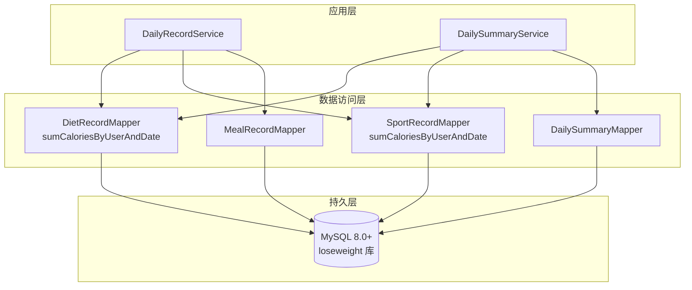
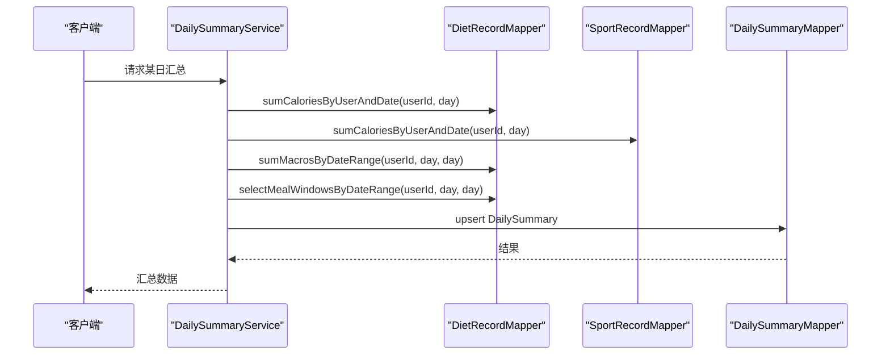
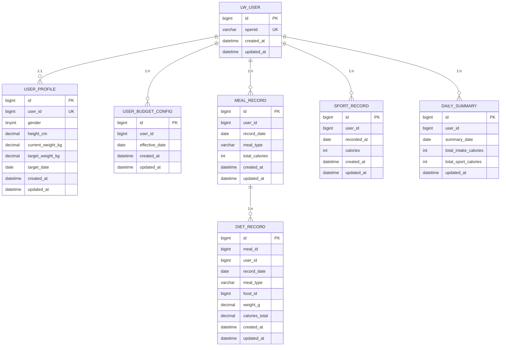
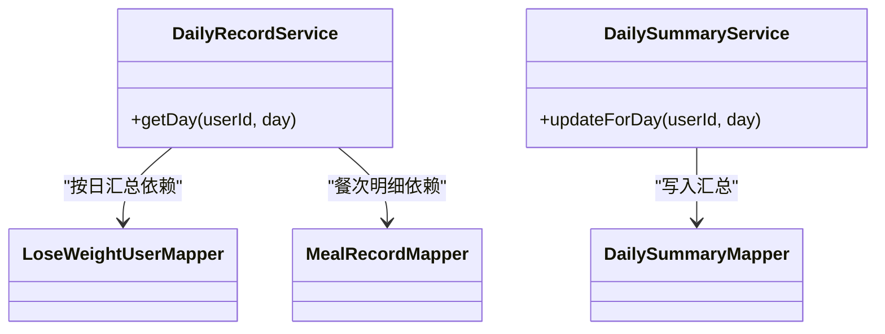

# 性能优化与索引策略

<cite>
**本文引用的文件**
- [application.yml](file://backend/src/main/resources/application.yml)
- [application-prod.yml](file://backend/src/main/resources/application-prod.yml)
- [application-local.yml](file://backend/src/main/resources/application-local.yml)
- [01_schema.sql](file://database/01_schema.sql)
- [02_seed.sql](file://database/02_seed.sql)
- [V003__create_user_domain_and_migrate.sql](file://database/migrations/V003__create_user_domain_and_migrate.sql)
- [V007__create_meal_record_and_diet_record.sql](file://database/migrations/V007__create_meal_record_and_diet_record.sql)
- [V012__meal_evaluation_and_photo_recognition.sql](file://database/migrations/V012__meal_evaluation_and_photo_recognition.sql)
- [DailyRecordService.java](file://backend/src/main/java/com/ypfr/loseweight/service/DailyRecordService.java)
- [DailySummaryService.java](file://backend/src/main/java/com/ypfr/loseweight/service/DailySummaryService.java)
- [LoseWeightUserMapper.java](file://backend/src/main/java/com/ypfr/loseweight/mapper/LoseWeightUserMapper.java)
- [DailySummaryMapper.java](file://backend/src/main/java/com/ypfr/loseweight/mapper/DailySummaryMapper.java)
- [MealRecordMapper.java](file://backend/src/main/java/com/ypfr/loseweight/mapper/MealRecordMapper.java)
</cite>

## 目录
1. [简介](#简介)
2. [项目结构](#项目结构)
3. [核心组件](#核心组件)
4. [架构概览](#架构概览)
5. [详细组件分析](#详细组件分析)
6. [依赖关系分析](#依赖关系分析)
7. [性能考量](#性能考量)
8. [故障排查指南](#故障排查指南)
9. [结论](#结论)
10. [附录](#附录)

## 简介
本文件面向数据库性能优化，结合现有数据库模式与后端服务实现，系统化梳理索引设计有效性、查询性能分析方法、读写分离与分库分表可行性、缓存策略、连接池与事务配置、监控与容量规划，并给出SQL优化案例、索引重建策略与统计信息更新频率建议。目标是在保证功能正确性的前提下，提升查询效率、降低延迟与资源占用，支撑业务增长。

## 项目结构
后端采用Spring Boot + MyBatis-Plus，数据库为MySQL 8.0+，使用迁移脚本管理Schema演进。数据库层以Mapper接口驱动，服务层封装业务逻辑并调用Mapper执行聚合统计与汇总计算。

图表来源
- [DailyRecordService.java:44-84](file://backend/src/main/java/com/ypfr/loseweight/service/DailyRecordService.java#L44-L84)
- [DailySummaryService.java:41-154](file://backend/src/main/java/com/ypfr/loseweight/service/DailySummaryService.java#L41-L154)

章节来源
- [application.yml:1-54](file://backend/src/main/resources/application.yml#L1-L54)
- [application-prod.yml:1-19](file://backend/src/main/resources/application-prod.yml#L1-L19)
- [application-local.yml:1-20](file://backend/src/main/resources/application-local.yml#L1-L20)

## 核心组件
- 数据库模式：包含用户域、饮食与运动记录、体重记录、食物库、日汇总等核心表，采用utf8mb4字符集与InnoDB引擎。
- 迁移脚本：完成用户域重构、餐次与饮食明细建模、拍照识别相关表迁移。
- 服务层：提供按日汇总与展示的聚合逻辑，涉及跨表统计与时间窗口计算。
- Mapper接口：基于MyBatis-Plus，提供基础CRUD与条件查询能力。

章节来源
- [01_schema.sql:11-159](file://database/01_schema.sql#L11-L159)
- [V003__create_user_domain_and_migrate.sql:12-71](file://database/migrations/V003__create_user_domain_and_migrate.sql#L12-L71)
- [V007__create_meal_record_and_diet_record.sql:10-55](file://database/migrations/V007__create_meal_record_and_diet_record.sql#L10-L55)
- [V012__meal_evaluation_and_photo_recognition.sql:10-48](file://database/migrations/V012__meal_evaluation_and_photo_recognition.sql#L10-L48)

## 架构概览
应用通过Mapper访问数据库，服务层负责业务编排与统计计算。查询路径通常围绕用户ID与日期维度展开，部分场景需要跨表聚合与时间窗口分析。

图表来源
- [DailySummaryService.java:41-154](file://backend/src/main/java/com/ypfr/loseweight/service/DailySummaryService.java#L41-L154)

## 详细组件分析

### 数据库模式与索引现状
- 用户域表：lw_user（唯一索引openid），user_profile（唯一索引user_id），user_budget_config（复合索引user_id+effective_date）。
- 饮食与运动：diet_record（meal_id、user_id+record_date），meal_record（user_id+record_date+meal_type），sport_record（user_id+record_date）。
- 其他：food_library（name），daily_summary（user_id+summary_date），wechat_login_log（user_id+login_at、openid+login_at）等。

图表来源
- [01_schema.sql:11-159](file://database/01_schema.sql#L11-L159)
- [V003__create_user_domain_and_migrate.sql:12-71](file://database/migrations/V003__create_user_domain_and_migrate.sql#L12-L71)
- [V007__create_meal_record_and_diet_record.sql:10-55](file://database/migrations/V007__create_meal_record_and_diet_record.sql#L10-L55)

章节来源
- [01_schema.sql:11-159](file://database/01_schema.sql#L11-L159)
- [V003__create_user_domain_and_migrate.sql:12-71](file://database/migrations/V003__create_user_domain_and_migrate.sql#L12-L71)
- [V007__create_meal_record_and_diet_record.sql:10-55](file://database/migrations/V007__create_meal_record_and_diet_record.sql#L10-L55)
- [V012__meal_evaluation_and_photo_recognition.sql:10-48](file://database/migrations/V012__meal_evaluation_and_photo_recognition.sql#L10-L48)

### 查询性能分析方法
- EXPLAIN执行计划分析：针对高频查询（如按用户+日期统计、按用户+日期范围统计、按用户+日期窗口查询）使用EXPLAIN分析索引使用情况与扫描行数。
- 慢查询日志分析：开启慢查询日志，设定阈值（如1秒），定期巡检慢SQL，定位未命中索引或回表过多的语句。
- 统计信息与直方图：定期更新表与索引统计信息，确保优化器选择最优执行计划。
- 延迟与吞吐观测：结合数据库监控与应用埋点，观察P95/P99延迟与QPS变化趋势。

### 索引有效性评估与优化建议
- 复合索引
  - meal_record(user_id, record_date, meal_type)：支持按用户+日期+餐型查询，有利于餐次汇总与展示。
  - diet_record(user_id, record_date)：支持按用户+日期的明细统计，减少回表成本。
  - user_budget_config(user_id, effective_date)：支持预算配置按生效日期检索。
  - daily_summary(user_id, summary_date)：唯一索引，避免重复插入与更新。
- 覆盖索引
  - 在统计类查询中优先使用覆盖索引，减少回表。例如diet_record(calories_total, weight_g)组合索引可覆盖部分聚合查询。
- 选择性优化
  - 高选择性列优先放在复合索引前缀，如user_id在多数查询中具备高选择性。
  - 对枚举字段（如meal_type、status）建立独立索引或与user_id联合使用，视查询分布而定。
- 索引重建策略
  - 定期重建碎片化索引（如超过10%碎片率）。
  - 新增索引先灰度验证，确认收益后再全量上线。
- 统计信息更新频率
  - 高频变更表：每日或每2小时更新一次。
  - 稳定表：每周更新一次即可。

### 读写分离、分库分表可行性评估与实施策略
- 读写分离
  - 适用场景：读多写少、报表与汇总类查询较多。
  - 实施要点：主库写入，从库只读；强一致需求（如写后即查）需规避从库延迟；热点用户路由至固定从库。
- 分库分表
  - 评估依据：用户规模、单表行数、查询是否天然按用户分片。
  - 分片键选择：优先使用user_id，确保用户相关查询局部性好。
  - 风险控制：先做影子库验证，再灰度切换；保留反向路由与回滚方案。
- 当前现状
  - 项目处于早期阶段，读写压力尚可，暂不建议立即分库分表，但应预留分片键与路由规则。

### 缓存策略设计
- 热点数据缓存
  - 用户档案与预算配置：按user_id缓存，变更时失效。
  - 食物库：按名称或ID缓存，定期批量刷新。
- 查询结果缓存
  - 按日汇总与时间线：按(user_id, date)维度缓存，过期时间短（如10分钟）。
  - 餐次与运动列表：按(user_id, date)缓存，写后失效。
- 会话状态缓存
  - 登录态与权限：Redis存储，设置合理TTL与续期。
- 缓存一致性
  - 写路径：先写数据库，再更新/删除缓存。
  - 读路径：缓存未命中时回源并回填。

### 连接池配置、事务超时与死锁预防
- 连接池
  - 最大连接数：根据峰值QPS与并发事务数估算，预留10%-30%冗余。
  - 空闲超时：适中偏短，避免持有无效连接。
  - 获取超时：严格限制，避免阻塞排队。
- 事务超时
  - 默认超时：按业务最长容忍时间设置（如5-10秒）。
  - 长事务：拆分与重试，避免长时间持锁。
- 死锁预防
  - 统一锁顺序：按user_id或表主键升序获取锁。
  - 减少事务粒度：尽早提交，避免在事务中做IO密集操作。
  - 死锁检测与重试：捕获死锁异常后指数退避重试。

### 性能监控指标、告警阈值与容量规划
- 关键指标
  - QPS、P95/P99延迟、错误率、连接池使用率、锁等待队列长度、慢查询数量。
  - 表大小、索引大小、缓冲池命中率、磁盘IOPS、网络带宽。
- 告警阈值
  - 延迟：P95>100ms，P99>500ms。
  - 错误率：>0.1%。
  - 连接池：使用率>80%，获取超时>100ms。
  - 慢查询：>10条/分钟。
- 容量规划
  - 基于历史增长曲线与业务预测，预留2-3年扩容空间。
  - 读写分离与分库分表前置评估，提前完成路由与迁移演练。

### SQL优化案例与索引重建
- 案例1：按用户+日期统计摄入与消耗
  - 现状：可能全表扫描或回表多次。
  - 优化：确保diet_record(user_id, record_date)与sport_record(user_id, recorded_at)命中索引；必要时增加覆盖索引。
- 案例2：按日期范围统计宏量营养素
  - 现状：范围查询可能回表。
  - 优化：diet_record(user_id, record_date)作为前缀索引，配合覆盖列减少回表。
- 案例3：计算进食窗口（首餐到末餐）
  - 现状：排序与时间差计算可能成为瓶颈。
  - 优化：在diet_record上建立(user_id, record_date, record_time)复合索引，减少排序成本。
- 索引重建与统计
  - 周期性重建碎片索引；更新统计信息后重新分析执行计划。

章节来源
- [DailyRecordService.java:44-84](file://backend/src/main/java/com/ypfr/loseweight/service/DailyRecordService.java#L44-L84)
- [DailySummaryService.java:41-154](file://backend/src/main/java/com/ypfr/loseweight/service/DailySummaryService.java#L41-L154)

### 数据库参数调优、存储引擎与硬件配置
- 参数调优
  - innodb_buffer_pool_size：建议占物理内存40%-60%。
  - innodb_log_file_size：平衡刷盘频率与崩溃恢复时间。
  - innodb_flush_log_at_trx_commit：生产环境设为1或2，兼顾安全与性能。
  - sort_buffer_size、read_buffer_size：根据查询复杂度适当增大。
- 存储引擎
  - InnoDB：默认行级锁、崩溃恢复能力强，适合本项目。
- 硬件配置
  - CPU：多核高主频，满足并发与排序需求。
  - 内存：充足内存以提升缓冲池命中率。
  - 存储：SSD，降低I/O延迟；RAID需权衡可靠性与性能。

## 依赖关系分析
服务层依赖Mapper接口，Mapper依赖数据库表结构与索引设计。查询路径与索引命中直接决定性能表现。

图表来源
- [DailyRecordService.java:31-42](file://backend/src/main/java/com/ypfr/loseweight/service/DailyRecordService.java#L31-L42)
- [DailySummaryService.java:25-34](file://backend/src/main/java/com/ypfr/loseweight/service/DailySummaryService.java#L25-L34)
- [LoseWeightUserMapper.java:1-9](file://backend/src/main/java/com/ypfr/loseweight/mapper/LoseWeightUserMapper.java#L1-L9)
- [DailySummaryMapper.java:1-10](file://backend/src/main/java/com/ypfr/loseweight/mapper/DailySummaryMapper.java#L1-L10)
- [MealRecordMapper.java:1-9](file://backend/src/main/java/com/ypfr/loseweight/mapper/MealRecordMapper.java#L1-L9)

章节来源
- [DailyRecordService.java:31-42](file://backend/src/main/java/com/ypfr/loseweight/service/DailyRecordService.java#L31-L42)
- [DailySummaryService.java:25-34](file://backend/src/main/java/com/ypfr/loseweight/service/DailySummaryService.java#L25-L34)

## 性能考量
- 查询路径优化：优先使用复合索引前缀匹配，减少回表与排序。
- 统计与汇总：服务层聚合逻辑应尽量将过滤下推到数据库，减少应用侧二次处理。
- 并发与锁：控制事务时长，避免长事务与热点行争用。
- 缓存与异步：对非实时要求的数据采用缓存与异步更新，降低数据库瞬时压力。

## 故障排查指南
- 慢查询定位
  - 使用EXPLAIN分析索引使用与扫描行数；关注全表扫描与回表次数。
  - 检查统计信息是否陈旧，必要时更新。
- 连接池问题
  - 观察连接池使用率与获取超时；排查是否存在长事务或未释放连接。
- 死锁排查
  - 记录死锁日志，复现锁顺序；调整业务逻辑统一锁顺序。
- 监控告警
  - 延迟、错误率、慢查询数量异常时，快速冻结变更并回滚可疑索引或SQL。

章节来源
- [application.yml:51-54](file://backend/src/main/resources/application.yml#L51-L54)
- [application-prod.yml:16-19](file://backend/src/main/resources/application-prod.yml#L16-L19)

## 结论
本项目数据库层具备清晰的领域模型与合理的索引布局，服务层的聚合统计逻辑明确。建议以索引优化与查询路径优化为抓手，辅以缓存与连接池调优，逐步引入读写分离与分库分表预案。同时完善监控与告警体系，持续跟踪性能指标，保障系统在业务增长中的稳定性与可扩展性。

## 附录
- 示例SQL优化流程（概念性）
  - 步骤1：收集慢查询日志，筛选高频语句。
  - 步骤2：使用EXPLAIN分析执行计划，检查索引使用情况。
  - 步骤3：根据查询模式设计或调整复合索引，必要时增加覆盖索引。
  - 步骤4：更新统计信息，重新执行计划对比。
  - 步骤5：灰度验证，监控延迟与错误率，确认收益后全量上线。
  - 步骤6：定期巡检与索引健康度评估，按需重建与维护。