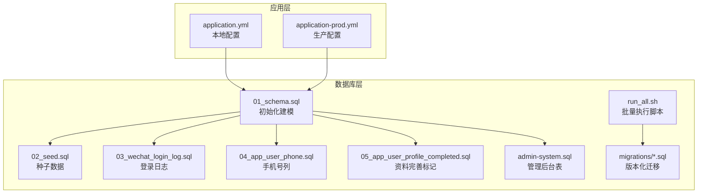
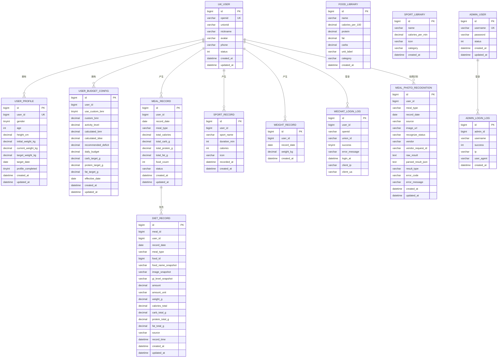
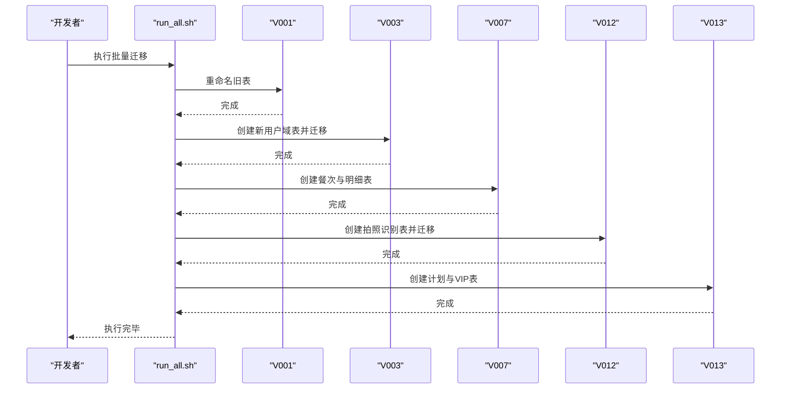
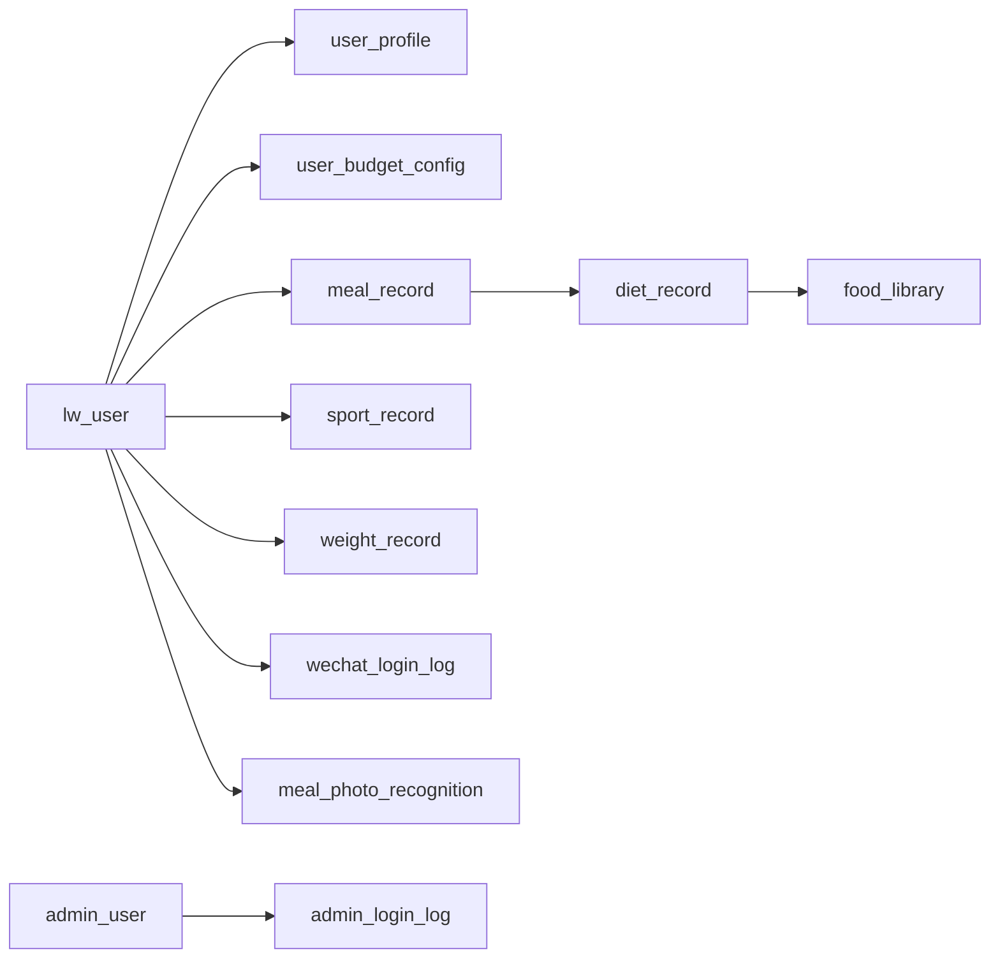

# 数据库架构设计

<cite>
**本文引用的文件**
- [01_schema.sql](file://database/01_schema.sql)
- [02_seed.sql](file://database/02_seed.sql)
- [admin-system.sql](file://database/admin-system.sql)
- [application.yml](file://backend/src/main/resources/application.yml)
- [application-prod.yml](file://backend/src/main/resources/application-prod.yml)
- [run_all.sh](file://database/migrations/run_all.sh)
- [V001__rename_meal_record_to_legacy.sql](file://database/migrations/V001__rename_meal_record_to_legacy.sql)
- [V003__create_user_domain_and_migrate.sql](file://database/migrations/V003__create_user_domain_and_migrate.sql)
- [V007__create_meal_record_and_diet_record.sql](file://database/migrations/V007__create_meal_record_and_diet_record.sql)
- [V012__meal_evaluation_and_photo_recognition.sql](file://database/migrations/V012__meal_evaluation_and_photo_recognition.sql)
- [V013__user_plan_and_vip.sql](file://database/migrations/V013__user_plan_and_vip.sql)
- [V014__optional_drop_legacy_tables.sql](file://database/migrations/V014__optional_drop_legacy_tables.sql)
- [03_wechat_login_log.sql](file://database/03_wechat_login_log.sql)
- [04_app_user_phone.sql](file://database/04_app_user_phone.sql)
- [05_app_user_profile_completed.sql](file://database/05_app_user_profile_completed.sql)
</cite>

## 目录
1. [简介](#简介)
2. [项目结构](#项目结构)
3. [核心组件](#核心组件)
4. [架构总览](#架构总览)
5. [详细组件分析](#详细组件分析)
6. [依赖关系分析](#依赖关系分析)
7. [性能考量](#性能考量)
8. [故障排查指南](#故障排查指南)
9. [结论](#结论)
10. [附录](#附录)

## 简介
本文件面向数据库架构设计，基于仓库中的数据库脚本与后端配置，系统化阐述整体设计思路、表结构组织原则与命名规范，解释字符集与排序规则的选择与影响，梳理迁移演进路径，明确连接池与事务隔离等运行期配置要点，并给出性能监控与优化策略、分区与索引实践以及 MySQL 8.0+ 特性与安全配置建议。文档同时提供多种图示帮助理解数据流与组件交互。

## 项目结构
数据库相关资源主要分布在 database 目录，包含：
- 初始化建模脚本：01_schema.sql、02_seed.sql、03_wechat_login_log.sql、04_app_user_phone.sql、05_app_user_profile_completed.sql
- 管理后台扩展：admin-system.sql
- 迁移脚本：migrations 下的版本化 SQL，配合 run_all.sh 批量执行
- 后端数据源配置：application.yml、application-prod.yml

**图表来源**
- [01_schema.sql:1-159](file://database/01_schema.sql#L1-L159)
- [02_seed.sql:1-800](file://database/02_seed.sql#L1-L800)
- [admin-system.sql:1-37](file://database/admin-system.sql#L1-L37)
- [application.yml:1-54](file://backend/src/main/resources/application.yml#L1-L54)
- [application-prod.yml:1-19](file://backend/src/main/resources/application-prod.yml#L1-L19)
- [run_all.sh:1-26](file://database/migrations/run_all.sh#L1-L26)

**章节来源**
- [01_schema.sql:1-159](file://database/01_schema.sql#L1-L159)
- [02_seed.sql:1-800](file://database/02_seed.sql#L1-L800)
- [admin-system.sql:1-37](file://database/admin-system.sql#L1-L37)
- [application.yml:1-54](file://backend/src/main/resources/application.yml#L1-L54)
- [application-prod.yml:1-19](file://backend/src/main/resources/application-prod.yml#L1-L19)
- [run_all.sh:1-26](file://database/migrations/run_all.sh#L1-L26)

## 核心组件
- 用户域模型
  - lw_user：统一用户主体，承载 openid、昵称/头像来源、手机号绑定状态、注册来源与状态
  - user_profile：用户档案，性别、年龄、身高、初始/当前/目标体重、目标日期、资料完善标记
  - user_budget_config：用户预算配置，包含 BMR/TDEE、活动系数、推荐热量缺口、日预算与宏量目标、生效日期
- 饮食域模型
  - meal_record：餐次头，按日期+类型聚合，记录总热量与宏量
  - diet_record：饮食明细，记录具体食物快照、GI、分量、总宏量与来源（搜索/自定义/拍照/手动）
- 运动与体重
  - sport_record：运动记录，时点型
  - weight_record：体重记录，按日唯一
- 公共与审计
  - food_library、sport_library：基础库
  - wechat_login_log：微信登录审计
  - food_recognition_log（迁移后为 meal_photo_recognition）：拍照识别流水
  - daily_summary：日汇总
  - admin_user、admin_login_log：管理后台

**章节来源**
- [01_schema.sql:10-159](file://database/01_schema.sql#L10-L159)
- [V003__create_user_domain_and_migrate.sql:12-146](file://database/migrations/V003__create_user_domain_and_migrate.sql#L12-L146)
- [V007__create_meal_record_and_diet_record.sql:10-56](file://database/migrations/V007__create_meal_record_and_diet_record.sql#L10-L56)
- [V012__meal_evaluation_and_photo_recognition.sql:10-82](file://database/migrations/V012__meal_evaluation_and_photo_recognition.sql#L10-L82)
- [admin-system.sql:7-37](file://database/admin-system.sql#L7-L37)

## 架构总览
整体采用“用户域 + 饮食域 + 运动体重 + 公共库 + 审计”的分层设计。用户域以 lw_user 为核心，通过 user_profile 与 user_budget_config 维度化用户画像与目标；饮食域以 meal_record 作为聚合入口，diet_record 作为明细；运动与体重分别独立建模；公共库与审计表支撑检索与追踪。

**图表来源**
- [01_schema.sql:10-159](file://database/01_schema.sql#L10-L159)
- [V003__create_user_domain_and_migrate.sql:12-146](file://database/migrations/V003__create_user_domain_and_migrate.sql#L12-L146)
- [V007__create_meal_record_and_diet_record.sql:10-56](file://database/migrations/V007__create_meal_record_and_diet_record.sql#L10-L56)
- [V012__meal_evaluation_and_photo_recognition.sql:10-82](file://database/migrations/V012__meal_evaluation_and_photo_recognition.sql#L10-L82)
- [admin-system.sql:7-37](file://database/admin-system.sql#L7-L37)

## 详细组件分析

### 字符集与排序规则
- 字符集：utf8mb4
  - 说明：支持四字节 UTF-8，覆盖 emoji 与多语言字符，避免存储与比较异常
- 排序规则：unicode_ci
  - 说明：大小写不敏感、基于 Unicode 语义排序，兼顾国际化文本比较与索引扫描效率
- 影响范围：数据库、表、列均采用统一字符集与排序规则，确保跨模块一致性

**章节来源**
- [01_schema.sql:4-6](file://database/01_schema.sql#L4-L6)
- [02_seed.sql:5-5](file://database/02_seed.sql#L5-L5)

### 表结构组织原则与命名规范
- 命名规范
  - 表名：lw_user、user_profile、user_budget_config、meal_record、diet_record、sport_record、weight_record、food_library、sport_library、wechat_login_log、meal_photo_recognition、admin_user、admin_login_log
  - 列名：下划线分隔，语义清晰（如 daily_budget、record_time、recognize_status）
  - 约束名：主键 PK、唯一 UK、外键 FK，遵循 innodb 约束命名风格
- 组织原则
  - 用户域：lw_user + user_profile + user_budget_config
  - 饮食域：meal_record（聚合）+ diet_record（明细）
  - 运动体重：sport_record、weight_record
  - 公共库：food_library、sport_library
  - 审计：wechat_login_log、meal_photo_recognition、admin_login_log
  - 管理后台：admin_user

**章节来源**
- [01_schema.sql:10-159](file://database/01_schema.sql#L10-L159)
- [V003__create_user_domain_and_migrate.sql:12-146](file://database/migrations/V003__create_user_domain_and_migrate.sql#L12-L146)
- [V007__create_meal_record_and_diet_record.sql:10-56](file://database/migrations/V007__create_meal_record_and_diet_record.sql#L10-L56)
- [V012__meal_evaluation_and_photo_recognition.sql:10-82](file://database/migrations/V012__meal_evaluation_and_photo_recognition.sql#L10-L82)
- [admin-system.sql:7-37](file://database/admin-system.sql#L7-L37)

### 迁移演进与版本化管理
- 迁移策略
  - 使用版本化 SQL（V001–V014），按顺序执行，确保结构与数据一致性
  - 提供 run_all.sh 自动遍历并执行（跳过可选脚本）
- 关键里程碑
  - V001：将旧 meal_record 重命名为 legacy，为新模型让路
  - V003：拆分 app_user 为 lw_user、user_profile、user_budget_config，保留主键一致性
  - V007：引入 meal_record（聚合）与 diet_record（明细）
  - V012：引入 meal_photo_recognition 并迁移历史识别日志
  - V013：引入用户计划与 VIP 相关表
  - V014：可选删除 legacy 表或归档
- 回滚与备份
  - V014 明确提示删除前需备份，强调不可逆性

**图表来源**
- [run_all.sh:1-26](file://database/migrations/run_all.sh#L1-L26)
- [V001__rename_meal_record_to_legacy.sql:1-25](file://database/migrations/V001__rename_meal_record_to_legacy.sql#L1-L25)
- [V003__create_user_domain_and_migrate.sql:1-146](file://database/migrations/V003__create_user_domain_and_migrate.sql#L1-L146)
- [V007__create_meal_record_and_diet_record.sql:1-56](file://database/migrations/V007__create_meal_record_and_diet_record.sql#L1-L56)
- [V012__meal_evaluation_and_photo_recognition.sql:1-82](file://database/migrations/V012__meal_evaluation_and_photo_recognition.sql#L1-L82)
- [V013__user_plan_and_vip.sql:1-56](file://database/migrations/V013__user_plan_and_vip.sql#L1-L56)

**章节来源**
- [run_all.sh:1-26](file://database/migrations/run_all.sh#L1-L26)
- [V001__rename_meal_record_to_legacy.sql:1-25](file://database/migrations/V001__rename_meal_record_to_legacy.sql#L1-L25)
- [V003__create_user_domain_and_migrate.sql:1-146](file://database/migrations/V003__create_user_domain_and_migrate.sql#L1-L146)
- [V007__create_meal_record_and_diet_record.sql:1-56](file://database/migrations/V007__create_meal_record_and_diet_record.sql#L1-L56)
- [V012__meal_evaluation_and_photo_recognition.sql:1-82](file://database/migrations/V012__meal_evaluation_and_photo_recognition.sql#L1-L82)
- [V013__user_plan_and_vip.sql:1-56](file://database/migrations/V013__user_plan_and_vip.sql#L1-L56)
- [V014__optional_drop_legacy_tables.sql:1-21](file://database/migrations/V014__optional_drop_legacy_tables.sql#L1-L21)

### 索引与查询优化
- 用户域
  - lw_user：唯一索引 openid
  - user_profile：唯一索引 user_id
  - user_budget_config：复合索引 user_id + effective_date
- 饮食域
  - meal_record：复合索引 user_id + record_date + meal_type
  - diet_record：索引 meal_id、user_id + record_date
- 运动体重
  - sport_record：复合索引 user_id + recorded_at
  - weight_record：唯一索引 user_id + record_date
- 审计与识别
  - wechat_login_log：复合索引 user_id + login_at、openid + login_at
  - meal_photo_recognition：复合索引 user_id + record_date + recognize_status
- 优化建议
  - 使用复合索引覆盖常见查询条件（用户+时间/日期/类型）
  - 对高频过滤字段建立合适索引，避免全表扫描
  - 定期分析慢查询日志，结合 EXPLAIN 分析执行计划

**章节来源**
- [01_schema.sql:32-159](file://database/01_schema.sql#L32-L159)
- [V007__create_meal_record_and_diet_record.sql:24-55](file://database/migrations/V007__create_meal_record_and_diet_record.sql#L24-L55)
- [V012__meal_evaluation_and_photo_recognition.sql:46-47](file://database/migrations/V012__meal_evaluation_and_photo_recognition.sql#L46-L47)

### 数据分区与分表（建议）
- 当前脚本未实现分区或分表，但可基于以下维度进行规划：
  - 按时间分区：wechat_login_log、meal_photo_recognition、diet_record、sport_record、weight_record
  - 按用户 ID 分片：在高并发场景下可考虑按 user_id 哈希分片
- 实施建议
  - 先评估数据量级与访问模式，再决定分区/分表策略
  - 保证迁移期间的查询兼容性与一致性

[本节为通用建议，不直接分析具体文件]

### 连接池、事务隔离与并发控制
- 连接池
  - Spring Boot 默认使用 HikariCP，可通过 application.yml 配置连接池参数（最大连接数、空闲超时、连接超时等）
- 事务隔离
  - 默认隔离级别通常为 READ_COMMITTED 或 REPEATABLE_READ，具体取决于驱动与服务器设置
  - 对于强一致需求，可在关键流程显式声明 REQUIRED_NEW 或调整隔离级别
- 并发控制
  - 唯一键冲突使用 ON DUPLICATE KEY UPDATE 或 INSERT ... ON DUPLICATE KEY UPDATE
  - 对热点表采用乐观锁（版本号）或悲观锁（SELECT ... FOR UPDATE）

**章节来源**
- [application.yml:8-11](file://backend/src/main/resources/application.yml#L8-L11)
- [application-prod.yml:6-9](file://backend/src/main/resources/application-prod.yml#L6-L9)

### 主从复制、备份与高可用
- 主从复制
  - 建议开启 binlog，设置 server-id，合理配置 relay log 与 GTID
  - 读写分离：写库走主库，读库走从库，热点读取可缓存
- 备份策略
  - 全量备份 + 增量/binlog 备份，定期校验恢复
  - 迁移脚本执行前后均应做备份，特别是 V014 删除 legacy 表前
- 高可用
  - 建议使用半同步复制、自动故障转移与只读从库
  - 应用侧增加重试与熔断，避免雪崩

**章节来源**
- [run_all.sh:1-26](file://database/migrations/run_all.sh#L1-L26)
- [V014__optional_drop_legacy_tables.sql:1-21](file://database/migrations/V014__optional_drop_legacy_tables.sql#L1-L21)

### MySQL 8.0+ 新特性与安全配置
- 新特性
  - 默认 utf8mb4 与 unicode_ci，增强国际化支持
  - 更严格的 SQL 模式与安全选项，建议启用 sql_mode 包含严格模式
- 安全配置
  - 强制使用 SSL 连接（serverTimezone、useSSL 参数）
  - 最小权限原则：为应用账号授予必要权限，避免 root 直连
  - 定期轮换密码与 JWT Secret，生产环境通过环境变量注入

**章节来源**
- [01_schema.sql:4-6](file://database/01_schema.sql#L4-L6)
- [application.yml:9-11](file://backend/src/main/resources/application.yml#L9-L11)
- [application-prod.yml:7-14](file://backend/src/main/resources/application-prod.yml#L7-L14)

## 依赖关系分析
- 内部依赖
  - lw_user 是用户域核心，被 user_profile、user_budget_config、meal_record、diet_record、sport_record、weight_record、wechat_login_log、meal_photo_recognition、admin_login_log 等引用
  - meal_record 依赖 diet_record，diet_record 可关联 food_library
- 外部依赖
  - 应用通过 JDBC 连接 MySQL，使用 MyBatis-Plus 进行 ORM 映射
  - 管理后台独立表，不改变业务表结构

**图表来源**
- [01_schema.sql:10-159](file://database/01_schema.sql#L10-L159)
- [V003__create_user_domain_and_migrate.sql:12-146](file://database/migrations/V003__create_user_domain_and_migrate.sql#L12-L146)
- [V007__create_meal_record_and_diet_record.sql:10-56](file://database/migrations/V007__create_meal_record_and_diet_record.sql#L10-L56)
- [V012__meal_evaluation_and_photo_recognition.sql:10-82](file://database/migrations/V012__meal_evaluation_and_photo_recognition.sql#L10-L82)
- [admin-system.sql:7-37](file://database/admin-system.sql#L7-L37)

**章节来源**
- [01_schema.sql:10-159](file://database/01_schema.sql#L10-L159)
- [V003__create_user_domain_and_migrate.sql:12-146](file://database/migrations/V003__create_user_domain_and_migrate.sql#L12-L146)
- [V007__create_meal_record_and_diet_record.sql:10-56](file://database/migrations/V007__create_meal_record_and_diet_record.sql#L10-L56)
- [V012__meal_evaluation_and_photo_recognition.sql:10-82](file://database/migrations/V012__meal_evaluation_and_photo_recognition.sql#L10-L82)
- [admin-system.sql:7-37](file://database/admin-system.sql#L7-L37)

## 性能考量
- 查询优化
  - 使用 EXPLAIN 分析慢查询，优化索引与 SQL 结构
  - 避免 SELECT *，按需投影
- 缓存策略
  - 对静态/低频变更数据（如 food_library、sport_library）引入 Redis 缓存
- 监控指标
  - QPS、TP99、连接数、锁等待、慢查询数量、缓冲池命中率、磁盘 IO
- 扩展建议
  - 读写分离 + 分库分表（按用户 ID 哈希）
  - 引入分布式事务中间件（如 Seata）处理跨库一致性

[本节为通用指导，不直接分析具体文件]

## 故障排查指南
- 常见问题定位
  - 迁移失败：检查 run_all.sh 执行日志与版本顺序，确认前置依赖（如 V002 外键已删除）
  - 登录日志缺失：确认 wechat_login_log 是否存在并具备索引
  - 拍照识别异常：检查 meal_photo_recognition 的 recognize_status 与错误字段
- 数据一致性
  - V014 删除 legacy 表前务必备份，避免不可逆损失
- 连接问题
  - 核对 application.yml 中的 JDBC URL、用户名、密码与时区配置

**章节来源**
- [run_all.sh:1-26](file://database/migrations/run_all.sh#L1-L26)
- [V012__meal_evaluation_and_photo_recognition.sql:50-82](file://database/migrations/V012__meal_evaluation_and_photo_recognition.sql#L50-L82)
- [V014__optional_drop_legacy_tables.sql:1-21](file://database/migrations/V014__optional_drop_legacy_tables.sql#L1-L21)
- [application.yml:9-11](file://backend/src/main/resources/application.yml#L9-L11)

## 结论
该数据库架构以用户域为核心，围绕饮食、运动体重与审计形成完整闭环，配合版本化迁移与管理后台扩展，满足业务演进与运维需求。通过统一字符集与排序规则、合理的索引设计与必要的安全配置，为高并发与国际化场景提供了坚实基础。建议后续在数据量与访问压力增长时，引入分区/分表、缓存与读写分离等优化手段，并持续完善监控与备份体系。

## 附录
- 初始化与增量脚本
  - 初始化：执行 01_schema.sql 与 02_seed.sql
  - 增量：执行 03_wechat_login_log.sql、04_app_user_phone.sql、05_app_user_profile_completed.sql
- 管理后台
  - 执行 admin-system.sql，初始化管理员与登录日志表

**章节来源**
- [01_schema.sql:1-159](file://database/01_schema.sql#L1-L159)
- [02_seed.sql:1-800](file://database/02_seed.sql#L1-L800)
- [03_wechat_login_log.sql:1-19](file://database/03_wechat_login_log.sql#L1-L19)
- [04_app_user_phone.sql:1-6](file://database/04_app_user_phone.sql#L1-L6)
- [05_app_user_profile_completed.sql:1-20](file://database/05_app_user_profile_completed.sql#L1-L20)
- [admin-system.sql:1-37](file://database/admin-system.sql#L1-L37)