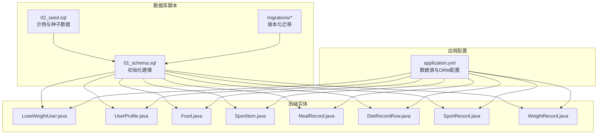
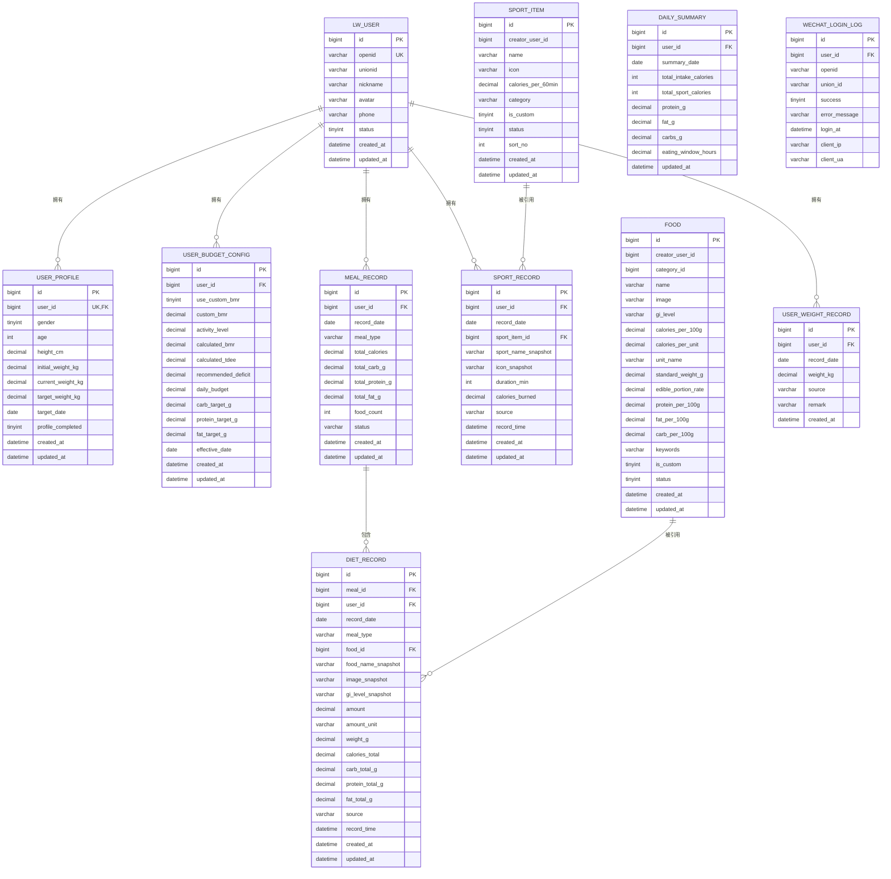
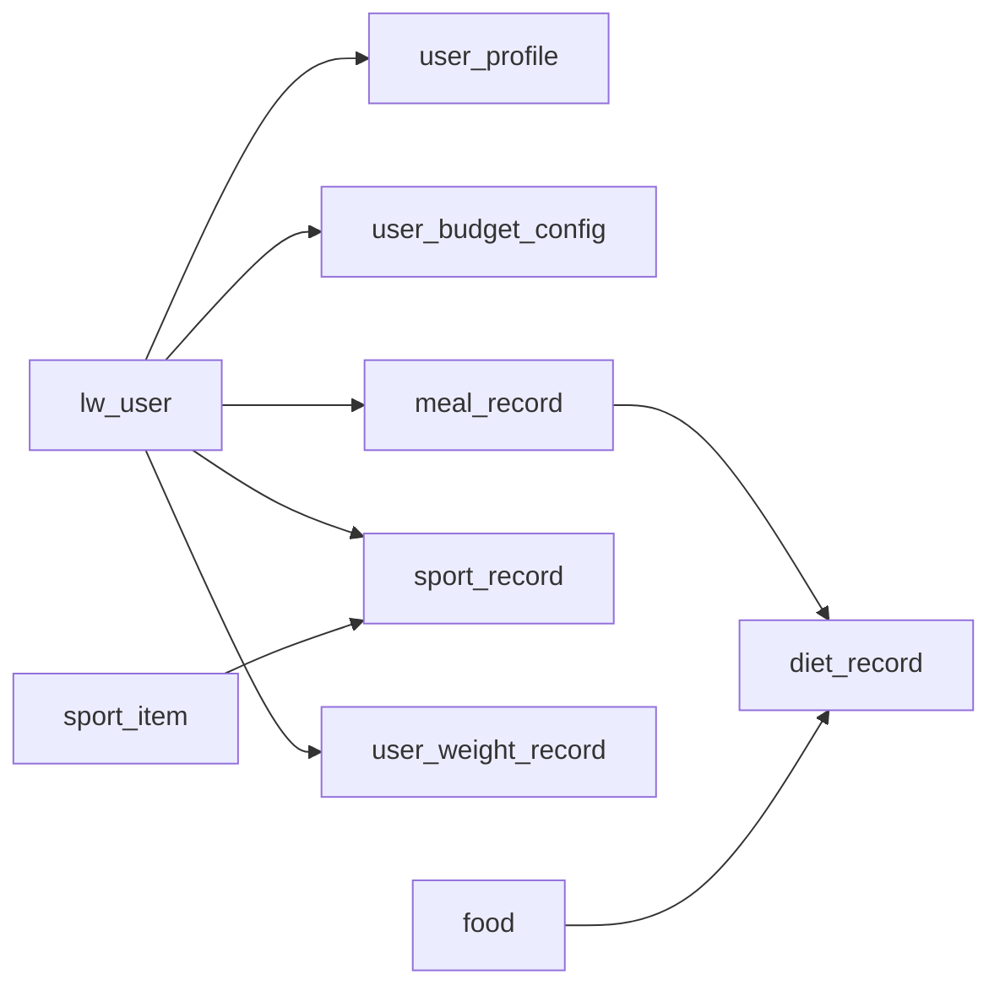

# 数据库设计

<cite>
**本文引用的文件**
- [01_schema.sql](file://database/01_schema.sql)
- [02_seed.sql](file://database/02_seed.sql)
- [03_wechat_login_log.sql](file://database/03_wechat_login_log.sql)
- [04_app_user_phone.sql](file://database/04_app_user_phone.sql)
- [05_app_user_profile_completed.sql](file://database/05_app_user_profile_completed.sql)
- [admin-system.sql](file://database/admin-system.sql)
- [application.yml](file://backend/src/main/resources/application.yml)
- [LoseWeightUser.java](file://backend/src/main/java/com/ypfr/loseweight/domain/LoseWeightUser.java)
- [UserProfile.java](file://backend/src/main/java/com/ypfr/loseweight/domain/UserProfile.java)
- [Food.java](file://backend/src/main/java/com/ypfr/loseweight/domain/Food.java)
- [SportItem.java](file://backend/src/main/java/com/ypfr/loseweight/domain/SportItem.java)
- [MealRecord.java](file://backend/src/main/java/com/ypfr/loseweight/domain/MealRecord.java)
- [DietRecordRow.java](file://backend/src/main/java/com/ypfr/loseweight/domain/DietRecordRow.java)
- [SportRecord.java](file://backend/src/main/java/com/ypfr/loseweight/domain/SportRecord.java)
- [WeightRecord.java](file://backend/src/main/java/com/ypfr/loseweight/domain/WeightRecord.java)
- [V001__rename_meal_record_to_legacy.sql](file://database/migrations/V001__rename_meal_record_to_legacy.sql)
- [V003__create_user_domain_and_migrate.sql](file://database/migrations/V003__create_user_domain_and_migrate.sql)
- [V007__create_meal_record_and_diet_record.sql](file://database/migrations/V007__create_meal_record_and_diet_record.sql)
- [V010__user_weight_record.sql](file://database/migrations/V010__user_weight_record.sql)
- [V013__user_plan_and_vip.sql](file://database/migrations/V013__user_plan_and_vip.sql)
</cite>

## 目录
1. [简介](#简介)
2. [项目结构](#项目结构)
3. [核心组件](#核心组件)
4. [架构总览](#架构总览)
5. [详细组件分析](#详细组件分析)
6. [依赖分析](#依赖分析)
7. [性能考虑](#性能考虑)
8. [故障排除指南](#故障排除指南)
9. [结论](#结论)
10. [附录](#附录)

## 简介
本文件面向减肥应用系统的数据库设计，聚焦于用户域、饮食记录、运动记录与体重记录等核心实体，系统性梳理实体关系、字段定义、数据类型、主键/外键、索引与约束，并结合迁移脚本说明历史演进与当前状态。同时提供数据访问模式、缓存策略建议、性能优化要点、数据生命周期与归档策略、数据迁移路径与版本管理、以及数据安全与隐私要求。

## 项目结构
数据库层由以下部分组成：
- 初始化建模脚本：定义初始表结构与约束
- 示例与种子数据：提供测试与演示所需的基础数据
- 迁移脚本：记录从旧版结构到当前结构的演进路径
- 后端实体映射：MyBatis-Plus 注解映射数据库表结构
- 应用配置：数据源与ORM配置

**图表来源**
- [01_schema.sql:1-159](file://database/01_schema.sql#L1-L159)
- [02_seed.sql:1-2004](file://database/02_seed.sql#L1-L2004)
- [application.yml:1-54](file://backend/src/main/resources/application.yml#L1-L54)
- [LoseWeightUser.java:1-168](file://backend/src/main/java/com/ypfr/loseweight/domain/LoseWeightUser.java#L1-L168)
- [UserProfile.java:1-124](file://backend/src/main/java/com/ypfr/loseweight/domain/UserProfile.java#L1-L124)
- [Food.java:1-213](file://backend/src/main/java/com/ypfr/loseweight/domain/Food.java#L1-L213)
- [SportItem.java:1-131](file://backend/src/main/java/com/ypfr/loseweight/domain/SportItem.java#L1-L131)
- [MealRecord.java:1-125](file://backend/src/main/java/com/ypfr/loseweight/domain/MealRecord.java#L1-L125)
- [DietRecordRow.java:1-196](file://backend/src/main/java/com/ypfr/loseweight/domain/DietRecordRow.java#L1-L196)
- [SportRecord.java:1-124](file://backend/src/main/java/com/ypfr/loseweight/domain/SportRecord.java#L1-L124)
- [WeightRecord.java:1-79](file://backend/src/main/java/com/ypfr/loseweight/domain/WeightRecord.java#L1-L79)

**章节来源**
- [01_schema.sql:1-159](file://database/01_schema.sql#L1-L159)
- [02_seed.sql:1-2004](file://database/02_seed.sql#L1-L2004)
- [application.yml:1-54](file://backend/src/main/resources/application.yml#L1-L54)

## 核心组件
本节概述核心表及其职责与关键字段。

- 用户域
  - lw_user：用户主体信息（微信 openid、昵称/头像来源与授权、手机号绑定状态与来源、状态、注册来源、时间戳）
  - user_profile：用户档案（性别、年龄、身高、初始/当前/目标体重、目标日期、档案完成标记）
  - user_budget_config：用户预算配置（是否使用自定义BMR、活动系数、计算BMR/TDEE、推荐减重缺口、日预算、宏量目标、生效日期）

- 饮食域
  - meal_record：餐次头（用户、日期、餐型、总宏量、食物数量、状态、时间戳）
  - diet_record：饮食明细（归属餐次、用户、日期、餐型、食物快照、分量与单位、重量、总热量与宏量、来源、记录时间）

- 运动域
  - sport_record：运动记录（用户、日期、运动项快照、图标、持续时间、消耗热量、来源、记录时间）

- 体重域
  - user_weight_record：体重记录（用户、日期、体重、来源、备注、时间戳）

- 基础设施
  - food：食物库（名称、GI等级、每100g/单位热量与宏量、关键词、是否自定义、状态、时间戳）
  - sport_item：运动项目库（名称、图标、每60分钟消耗、分类、是否自定义、状态、排序、时间戳）
  - daily_summary：日汇总（用户、汇总日期、总摄入/消耗、宏量、进食窗口、更新时间）
  - wechat_login_log：微信登录日志（用户、openid/unionid、成功与否、错误信息、登录时间、客户端IP/UA）

**章节来源**
- [LoseWeightUser.java:1-168](file://backend/src/main/java/com/ypfr/loseweight/domain/LoseWeightUser.java#L1-L168)
- [UserProfile.java:1-124](file://backend/src/main/java/com/ypfr/loseweight/domain/UserProfile.java#L1-L124)
- [Food.java:1-213](file://backend/src/main/java/com/ypfr/loseweight/domain/Food.java#L1-L213)
- [SportItem.java:1-131](file://backend/src/main/java/com/ypfr/loseweight/domain/SportItem.java#L1-L131)
- [MealRecord.java:1-125](file://backend/src/main/java/com/ypfr/loseweight/domain/MealRecord.java#L1-L125)
- [DietRecordRow.java:1-196](file://backend/src/main/java/com/ypfr/loseweight/domain/DietRecordRow.java#L1-L196)
- [SportRecord.java:1-124](file://backend/src/main/java/com/ypfr/loseweight/domain/SportRecord.java#L1-L124)
- [WeightRecord.java:1-79](file://backend/src/main/java/com/ypfr/loseweight/domain/WeightRecord.java#L1-L79)
- [01_schema.sql:10-159](file://database/01_schema.sql#L10-L159)

## 架构总览
数据库采用“用户域 + 饮食域 + 运动域 + 体重域 + 基础设施库”的分层设计，围绕 lw_user 作为中心实体，通过外键关联形成清晰的主从关系。迁移脚本展示了从旧版 app_user 到新版用户域的演进过程，以及从“一行一食物”的 meal_record 到“餐次头 + 明细”的结构升级。

**图表来源**
- [01_schema.sql:10-159](file://database/01_schema.sql#L10-L159)
- [V003__create_user_domain_and_migrate.sql:12-71](file://database/migrations/V003__create_user_domain_and_migrate.sql#L12-L71)
- [V007__create_meal_record_and_diet_record.sql:10-55](file://database/migrations/V007__create_meal_record_and_diet_record.sql#L10-L55)
- [V010__user_weight_record.sql:10-16](file://database/migrations/V010__user_weight_record.sql#L10-L16)
- [V013__user_plan_and_vip.sql:10-55](file://database/migrations/V013__user_plan_and_vip.sql#L10-L55)
- [LoseWeightUser.java:1-168](file://backend/src/main/java/com/ypfr/loseweight/domain/LoseWeightUser.java#L1-L168)
- [UserProfile.java:1-124](file://backend/src/main/java/com/ypfr/loseweight/domain/UserProfile.java#L1-L124)
- [Food.java:1-213](file://backend/src/main/java/com/ypfr/loseweight/domain/Food.java#L1-L213)
- [SportItem.java:1-131](file://backend/src/main/java/com/ypfr/loseweight/domain/SportItem.java#L1-L131)
- [MealRecord.java:1-125](file://backend/src/main/java/com/ypfr/loseweight/domain/MealRecord.java#L1-L125)
- [DietRecordRow.java:1-196](file://backend/src/main/java/com/ypfr/loseweight/domain/DietRecordRow.java#L1-L196)
- [SportRecord.java:1-124](file://backend/src/main/java/com/ypfr/loseweight/domain/SportRecord.java#L1-L124)
- [WeightRecord.java:1-79](file://backend/src/main/java/com/ypfr/loseweight/domain/WeightRecord.java#L1-L79)

## 详细组件分析

### 用户域表设计
- lw_user
  - 主键：id（自增）
  - 唯一键：openid
  - 关键字段：微信 openid/unionid、昵称/头像来源与授权、手机号绑定状态/时间/来源、状态、注册来源、创建/更新时间
  - 用途：用户身份与基础属性
- user_profile
  - 主键：id；唯一键：user_id
  - 外键：user_id → lw_user(id)
  - 关键字段：性别、年龄、身高、初始/当前/目标体重、目标日期、档案完成标记
  - 用途：用户个人档案
- user_budget_config
  - 主键：id；索引：user_id + effective_date
  - 外键：user_id → lw_user(id)
  - 关键字段：是否使用自定义BMR、活动系数、计算BMR/TDEE、推荐减重缺口、日预算、宏量目标、生效日期
  - 用途：计算与跟踪每日营养与热量预算

**章节来源**
- [01_schema.sql:12-32](file://database/01_schema.sql#L12-L32)
- [01_schema.sql:34-50](file://database/01_schema.sql#L34-L50)
- [01_schema.sql:52-71](file://database/01_schema.sql#L52-L71)
- [V003__create_user_domain_and_migrate.sql:12-71](file://database/migrations/V003__create_user_domain_and_migrate.sql#L12-L71)
- [LoseWeightUser.java:1-168](file://backend/src/main/java/com/ypfr/loseweight/domain/LoseWeightUser.java#L1-L168)
- [UserProfile.java:1-124](file://backend/src/main/java/com/ypfr/loseweight/domain/UserProfile.java#L1-L124)

### 饮食域表设计
- meal_record
  - 主键：id；索引：user_id + record_date + meal_type
  - 外键：user_id → lw_user(id)
  - 关键字段：record_date、meal_type、total_* 宏量、food_count、status
  - 用途：按餐次聚合的头信息
- diet_record
  - 主键：id；索引：meal_id、user_id + record_date
  - 外键：meal_id → meal_record(id)、user_id → lw_user(id)、food_id → food(id)
  - 关键字段：food_name_snapshot、image_snapshot、gi_level_snapshot、amount/amount_unit、weight_g、calories_total、宏量总计、source、record_time
  - 用途：具体食物条目明细

**章节来源**
- [01_schema.sql:37-54](file://database/01_schema.sql#L37-L54)
- [01_schema.sql:28-49](file://database/01_schema.sql#L28-L49)
- [V007__create_meal_record_and_diet_record.sql:10-55](file://database/migrations/V007__create_meal_record_and_diet_record.sql#L10-L55)
- [MealRecord.java:1-125](file://backend/src/main/java/com/ypfr/loseweight/domain/MealRecord.java#L1-L125)
- [DietRecordRow.java:1-196](file://backend/src/main/java/com/ypfr/loseweight/domain/DietRecordRow.java#L1-L196)

### 运动域表设计
- sport_item
  - 主键：id
  - 关键字段：name、icon、calories_per_60min、category、is_custom、status、sort_no
  - 用途：运动项目库，支持每60分钟消耗与API兼容的每分钟消耗
- sport_record
  - 主键：id；索引：user_id + record_date
  - 外键：user_id → lw_user(id)、sport_item_id → sport_item(id)
  - 关键字段：sport_name_snapshot、icon_snapshot、duration_min、calories_burned、source、record_time
  - 用途：运动记录明细

**章节来源**
- [01_schema.sql:99-108](file://database/01_schema.sql#L99-L108)
- [01_schema.sql:57-69](file://database/01_schema.sql#L57-L69)
- [SportItem.java:1-131](file://backend/src/main/java/com/ypfr/loseweight/domain/SportItem.java#L1-L131)
- [SportRecord.java:1-124](file://backend/src/main/java/com/ypfr/loseweight/domain/SportRecord.java#L1-L124)

### 体重域表设计
- user_weight_record
  - 主键：id；索引：user_id + record_date（注：迁移后取消唯一索引以允许多条记录）
  - 外键：user_id → lw_user(id)
  - 关键字段：record_date、weight_kg、source、remark、created_at
  - 用途：体重记录明细

**章节来源**
- [01_schema.sql:72-81](file://database/01_schema.sql#L72-L81)
- [V010__user_weight_record.sql:10-16](file://database/migrations/V010__user_weight_record.sql#L10-L16)
- [WeightRecord.java:1-79](file://backend/src/main/java/com/ypfr/loseweight/domain/WeightRecord.java#L1-L79)

### 基础设施与日汇总
- food：食物库，包含每100g与单位的热量与宏量、GI等级、关键词、分类、状态
- daily_summary：日汇总表，按用户+日期唯一，记录当日摄入/消耗、宏量与进食窗口
- wechat_login_log：微信登录流水，记录成功/失败、错误信息、客户端信息

**章节来源**
- [01_schema.sql:84-96](file://database/01_schema.sql#L84-L96)
- [01_schema.sql:127-141](file://database/01_schema.sql#L127-L141)
- [01_schema.sql:144-158](file://database/01_schema.sql#L144-L158)

### 数据访问模式与缓存策略
- 访问模式
  - 用户域：按 openid 查询用户，按 user_id 关联档案与预算
  - 饮食域：按 user_id + record_date + meal_type 查询餐次头，再按 meal_id 查询明细
  - 运动域：按 user_id + record_date 查询运动记录
  - 体重域：按 user_id + record_date 查询体重记录
- 缓存策略建议
  - 用户档案与预算：短期缓存（如Redis），基于 user_id + 有效期，变更时失效
  - 食物库与运动项目库：只读缓存，定期刷新
  - 日汇总：按用户与日期维度缓存，写入时同步更新

[本节为通用指导，不直接分析具体文件]

### 数据验证与业务规则
- 字段约束
  - 唯一键：lw_user.openid、user_profile.user_id、daily_summary.user_id+summary_date、user_weight_record.user_id+record_date（迁移后取消唯一）
- 业务规则
  - 餐次状态：draft/submitted；来源：search/custom/photo/manual
  - 运动来源：manual 等；体重来源：manual/system
  - 预算配置按生效日期生效，宏量目标可为空表示未设定
  - 微信登录日志记录成功/失败与错误摘要，便于审计

**章节来源**
- [01_schema.sql:32-34](file://database/01_schema.sql#L32-L34)
- [01_schema.sql:48-50](file://database/01_schema.sql#L48-L50)
- [01_schema.sql:139-141](file://database/01_schema.sql#L139-L141)
- [V007__create_meal_record_and_diet_record.sql:20-20](file://database/migrations/V007__create_meal_record_and_diet_record.sql#L20-L20)
- [V007__create_meal_record_and_diet_record.sql:46-46](file://database/migrations/V007__create_meal_record_and_diet_record.sql#L46-L46)
- [V010__user_weight_record.sql:14-15](file://database/migrations/V010__user_weight_record.sql#L14-L15)

### 示例数据
- 种子数据包含约1000条食物记录，覆盖31个分类，每类≥30条，用于演示与测试
- 示例用户包含基础档案与目标，便于前端与后端联调

**章节来源**
- [02_seed.sql:1-2004](file://database/02_seed.sql#L1-L2004)

## 依赖分析
- 组件耦合
  - lw_user 是核心实体，被多个子表引用（profile、budget、meal、sport、weight）
  - meal_record 与 diet_record 强关联，保证餐次与明细一致性
  - food 与 sport_item 作为只读基础设施，被 diet_record 与 sport_record 引用
- 外部依赖
  - 数据源配置：MySQL 8.0+，字符集 utf8mb4，排序规则 utf8mb4_unicode_ci
  - ORM：MyBatis-Plus，下划线转驼峰映射开启

**图表来源**
- [01_schema.sql:12-71](file://database/01_schema.sql#L12-L71)
- [01_schema.sql:37-81](file://database/01_schema.sql#L37-L81)
- [01_schema.sql:99-108](file://database/01_schema.sql#L99-L108)
- [V007__create_meal_record_and_diet_record.sql:10-55](file://database/migrations/V007__create_meal_record_and_diet_record.sql#L10-L55)

**章节来源**
- [application.yml:8-28](file://backend/src/main/resources/application.yml#L8-L28)

## 性能考虑
- 索引策略
  - 饮食：meal_record 基于 user_id + record_date + meal_type；diet_record 基于 meal_id 与 user_id + record_date
  - 运动：sport_record 基于 user_id + record_date
  - 体重：user_weight_record 基于 user_id + record_date（迁移后取消唯一，避免重复插入阻塞）
- 写入优化
  - 批量插入：diet_record 与 sport_record 可批量写入，减少事务次数
  - 分区建议：按 record_date 对日级表进行分区（如需要更大规模）
- 读取优化
  - 使用覆盖索引减少回表
  - 对高频查询（如今日汇总）引入物化视图或定时任务预计算

[本节为通用指导，不直接分析具体文件]

## 故障排除指南
- 常见问题
  - openid 重复：lw_user 唯一键冲突，需检查来源与迁移逻辑
  - 外键约束失败：确认 lw_user 是否存在，或迁移脚本是否完整执行
  - 体重重复：迁移后取消唯一索引，允许同日多条记录，若出现异常需检查 source/remark
- 排查步骤
  - 核对迁移脚本执行顺序与结果
  - 检查 wechat_login_log 与业务日志定位异常点
  - 使用 EXPLAIN 分析慢查询，补充必要索引

**章节来源**
- [V001__rename_meal_record_to_legacy.sql:1-25](file://database/migrations/V001__rename_meal_record_to_legacy.sql#L1-L25)
- [V003__create_user_domain_and_migrate.sql:1-146](file://database/migrations/V003__create_user_domain_and_migrate.sql#L1-L146)
- [V010__user_weight_record.sql:1-16](file://database/migrations/V010__user_weight_record.sql#L1-L16)
- [03_wechat_login_log.sql](file://database/03_wechat_login_log.sql)

## 结论
本数据库设计以 lw_user 为核心，构建了用户档案、预算、饮食、运动与体重的完整闭环，并通过迁移脚本清晰记录了从旧版结构到当前结构的演进。合理的索引与外键约束确保了数据一致性，配套的种子数据与示例有助于快速验证。建议在生产环境中配合缓存、分区与物化汇总提升性能，并完善数据生命周期与归档策略。

## 附录

### 数据生命周期、保留策略与归档规则
- 生命周期
  - 用户数据：永久保留，支持注销流程与数据导出
  - 饮食/运动/体重：默认保留长期，支持用户删除请求
- 保留策略
  - 日汇总与明细：按用户维度设置保留期（如3年），到期前自动归档
- 归档规则
  - 按月/季度归档至独立库或对象存储，保留查询索引与元数据

[本节为通用指导，不直接分析具体文件]

### 数据迁移路径与版本管理
- 迁移路径
  - V001：重命名旧 meal_record 为 legacy，释放表名
  - V002：删除外键，准备迁移
  - V003：创建 lw_user、user_profile、user_budget_config 并迁移数据，删除 app_user
  - V004：重建外键
  - V005：食物分类与食物库迁移
  - V006：运动项目迁移
  - V007：创建 meal_record 与 diet_record
  - V008：将旧数据迁移到新结构
  - V009：运动记录字段调整
  - V010：体重表改名并扩展字段
  - V011：日汇总字段调整
  - V012：拍照识别与评估
  - V013：新增用户计划与VIP相关表
  - V014-V022：后续演进（如管理员、BMI解释、产品等）
- 版本管理
  - 使用 Flyway/Liquibase 管理迁移脚本，严格按序执行与回滚

**章节来源**
- [V001__rename_meal_record_to_legacy.sql:1-25](file://database/migrations/V001__rename_meal_record_to_legacy.sql#L1-L25)
- [V003__create_user_domain_and_migrate.sql:1-146](file://database/migrations/V003__create_user_domain_and_migrate.sql#L1-L146)
- [V007__create_meal_record_and_diet_record.sql:1-56](file://database/migrations/V007__create_meal_record_and_diet_record.sql#L1-L56)
- [V010__user_weight_record.sql:1-16](file://database/migrations/V010__user_weight_record.sql#L1-L16)
- [V013__user_plan_and_vip.sql:1-56](file://database/migrations/V013__user_plan_and_vip.sql#L1-L56)

### 数据安全、隐私与访问控制
- 安全措施
  - 最小权限原则：应用连接数据库使用受限账号
  - 加密传输：生产环境启用 SSL
  - 参数化查询：防止SQL注入
- 隐私保护
  - 用户敏感信息（如手机号）仅在授权范围内使用，提供删除与导出功能
  - 日志脱敏：微信登录日志不保存敏感字段
- 访问控制
  - 后端服务通过统一鉴权（JWT）控制接口访问
  - 数据库层面限制管理员与普通用户的操作范围

**章节来源**
- [application.yml:8-12](file://backend/src/main/resources/application.yml#L8-L12)
- [03_wechat_login_log.sql](file://database/03_wechat_login_log.sql)