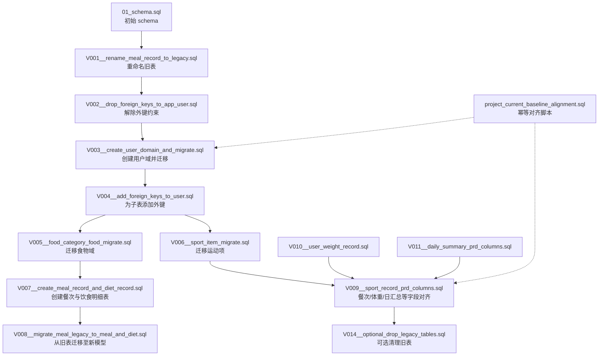
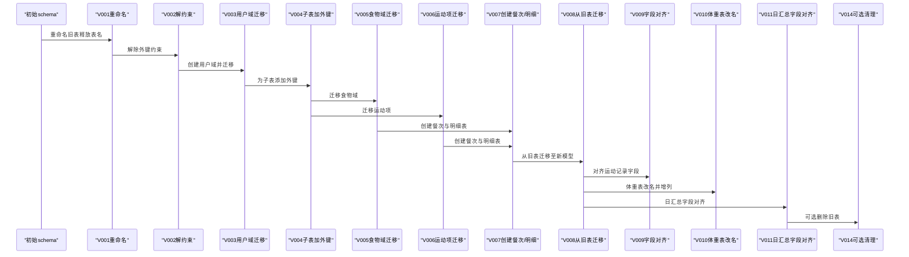
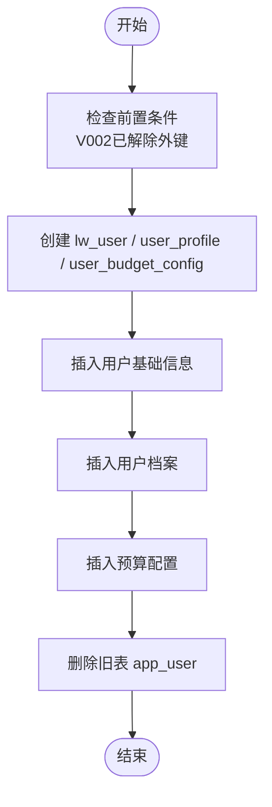
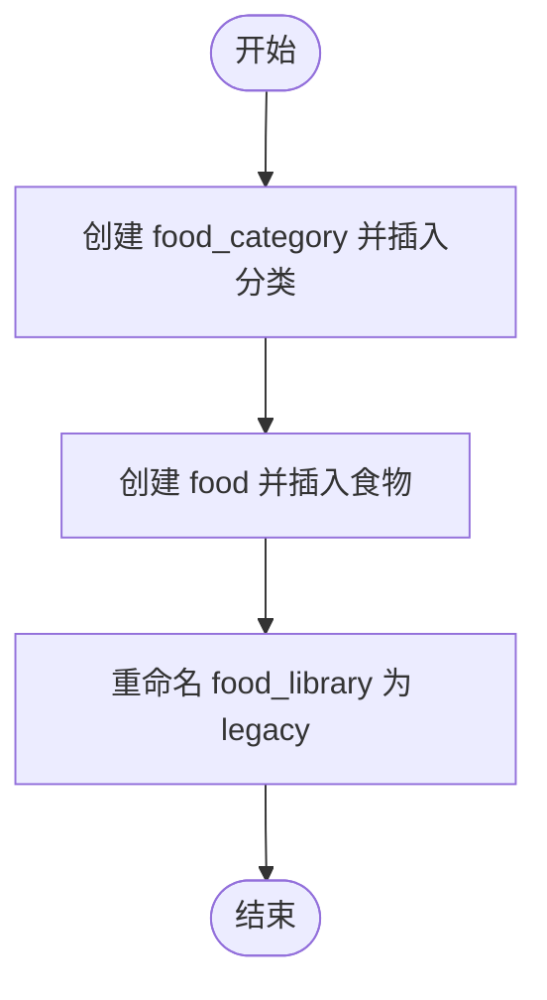
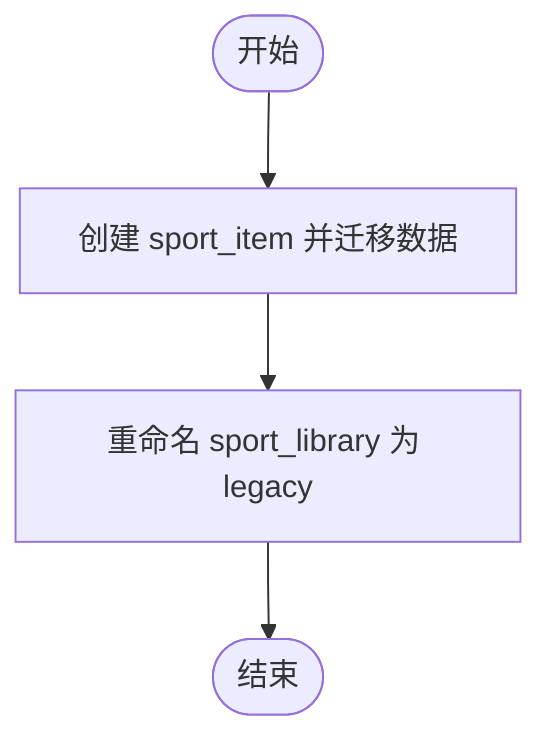
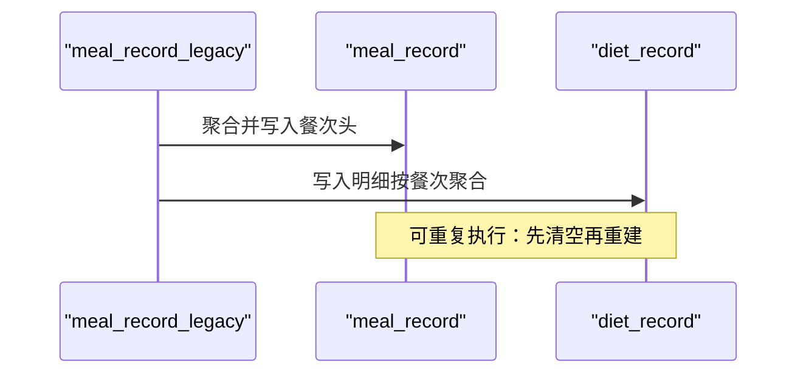
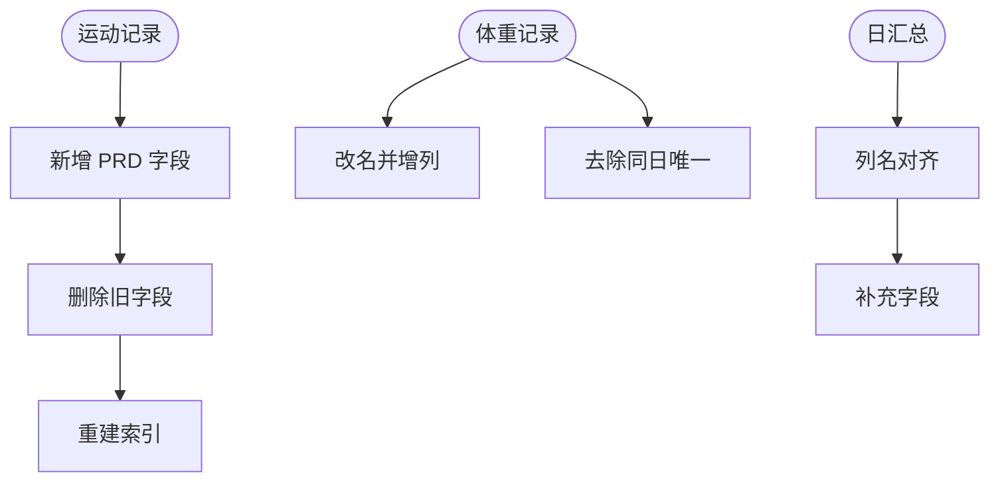
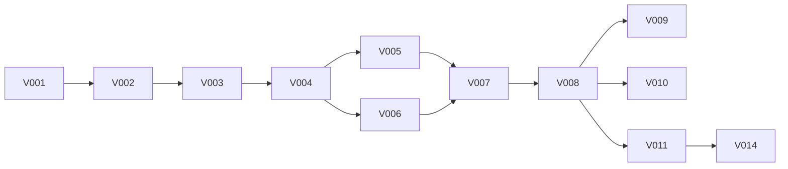

# 数据迁移策略

<cite>
**本文引用的文件**
- [V001__rename_meal_record_to_legacy.sql](file://database/migrations/V001__rename_meal_record_to_legacy.sql)
- [V002__drop_foreign_keys_to_app_user.sql](file://database/migrations/V002__drop_foreign_keys_to_app_user.sql)
- [V003__create_user_domain_and_migrate.sql](file://database/migrations/V003__create_user_domain_and_migrate.sql)
- [V004__add_foreign_keys_to_user.sql](file://database/migrations/V004__add_foreign_keys_to_user.sql)
- [V005__food_category_food_migrate.sql](file://database/migrations/V005__food_category_food_migrate.sql)
- [V006__sport_item_migrate.sql](file://database/migrations/V006__sport_item_migrate.sql)
- [V007__create_meal_record_and_diet_record.sql](file://database/migrations/V007__create_meal_record_and_diet_record.sql)
- [V008__migrate_meal_legacy_to_meal_and_diet.sql](file://database/migrations/V008__migrate_meal_legacy_to_meal_and_diet.sql)
- [V009__sport_record_prd_columns.sql](file://database/migrations/V009__sport_record_prd_columns.sql)
- [V010__user_weight_record.sql](file://database/migrations/V010__user_weight_record.sql)
- [V011__daily_summary_prd_columns.sql](file://database/migrations/V011__daily_summary_prd_columns.sql)
- [V014__optional_drop_legacy_tables.sql](file://database/migrations/V014__optional_drop_legacy_tables.sql)
- [run_all.sh](file://database/migrations/run_all.sh)
- [run_all.ps1](file://database/migrations/run_all.ps1)
- [01_schema.sql](file://database/01_schema.sql)
- [project_current_baseline_alignment.sql](file://database/project_current_baseline_alignment.sql)
</cite>

## 目录
1. [简介](#简介)
2. [项目结构](#项目结构)
3. [核心组件](#核心组件)
4. [架构总览](#架构总览)
5. [详细组件分析](#详细组件分析)
6. [依赖分析](#依赖分析)
7. [性能考虑](#性能考虑)
8. [故障排查指南](#故障排查指南)
9. [结论](#结论)
10. [附录](#附录)

## 简介
本文件系统化阐述本项目的数据库版本管理与迁移策略，覆盖从旧版 schema 到新版领域模型的完整演进路径。重点说明以下方面：
- 版本管理与迁移脚本组织：基于顺序编号的增量脚本，明确前置条件与可选步骤。
- 表重命名、字段调整、索引重建等操作的迁移流程与回滚注意事项。
- 用户域迁移的复杂性：数据转换、兼容性处理与回滚策略。
- 迁移脚本的执行顺序、依赖关系与错误处理机制。
- 数据一致性检查、完整性验证与迁移后的质量保证。
- 增量迁移与全量迁移策略及适用场景。
- 风险评估、备份恢复与紧急回滚方案。
- 迁移过程中的性能影响与优化措施。

## 项目结构
数据库迁移相关文件集中在 database/migrations 目录，配合初始化 schema 与“当前基线对齐”脚本，形成完整的演进路径。迁移脚本采用“Vxxx__描述.sql”的命名规范，按顺序执行，部分脚本为可选。

图表来源
- [01_schema.sql:1-159](file://database/01_schema.sql#L1-L159)
- [V001__rename_meal_record_to_legacy.sql:1-25](file://database/migrations/V001__rename_meal_record_to_legacy.sql#L1-L25)
- [V002__drop_foreign_keys_to_app_user.sql:1-21](file://database/migrations/V002__drop_foreign_keys_to_app_user.sql#L1-L21)
- [V003__create_user_domain_and_migrate.sql:1-146](file://database/migrations/V003__create_user_domain_and_migrate.sql#L1-L146)
- [V004__add_foreign_keys_to_user.sql:1-27](file://database/migrations/V004__add_foreign_keys_to_user.sql#L1-L27)
- [V005__food_category_food_migrate.sql:1-91](file://database/migrations/V005__food_category_food_migrate.sql#L1-L91)
- [V006__sport_item_migrate.sql:1-48](file://database/migrations/V006__sport_item_migrate.sql#L1-L48)
- [V007__create_meal_record_and_diet_record.sql:1-56](file://database/migrations/V007__create_meal_record_and_diet_record.sql#L1-L56)
- [V008__migrate_meal_legacy_to_meal_and_diet.sql:1-66](file://database/migrations/V008__migrate_meal_legacy_to_meal_and_diet.sql#L1-L66)
- [V009__sport_record_prd_columns.sql:1-50](file://database/migrations/V009__sport_record_prd_columns.sql#L1-L50)
- [V010__user_weight_record.sql:1-16](file://database/migrations/V010__user_weight_record.sql#L1-L16)
- [V011__daily_summary_prd_columns.sql:1-29](file://database/migrations/V011__daily_summary_prd_columns.sql#L1-L29)
- [V014__optional_drop_legacy_tables.sql:1-21](file://database/migrations/V014__optional_drop_legacy_tables.sql#L1-L21)
- [project_current_baseline_alignment.sql:1-786](file://database/project_current_baseline_alignment.sql#L1-L786)

章节来源
- [01_schema.sql:1-159](file://database/01_schema.sql#L1-L159)
- [project_current_baseline_alignment.sql:1-786](file://database/project_current_baseline_alignment.sql#L1-L786)

## 核心组件
- 版本管理与执行器
  - 迁移脚本：按顺序编号的 SQL 文件，定义了每个版本的变更内容与前置条件。
  - 执行器：提供跨平台的批量执行脚本，支持跳过可选脚本并逐个执行。
- 用户域迁移
  - 从单一 app_user 拆分为 lw_user、user_profile、user_budget_config 三张表，保留 user_id 主键值，确保子表无需改动。
- 食物域迁移
  - 从 food_library 拆分出 food_category 与 food，并保留 id 映射，便于 diet_record.food_id 直接复用。
- 运动域迁移
  - 从 sport_library 拆分出 sport_item，单位换算（每分钟 → 每60分钟）。
- 餐次与饮食明细
  - 引入 meal_record（餐次头）与 diet_record（饮食明细），实现“一行一餐次 + 明细聚合”的新模式。
- 字段与索引对齐
  - 对 sport_record、user_weight_record、daily_summary 等表进行列名与结构对齐，补充缺失字段并重建索引。
- 可选清理
  - 提供可选脚本用于删除或归档旧表，强调执行前必须备份与验收。

章节来源
- [V003__create_user_domain_and_migrate.sql:1-146](file://database/migrations/V003__create_user_domain_and_migrate.sql#L1-L146)
- [V005__food_category_food_migrate.sql:1-91](file://database/migrations/V005__food_category_food_migrate.sql#L1-L91)
- [V006__sport_item_migrate.sql:1-48](file://database/migrations/V006__sport_item_migrate.sql#L1-L48)
- [V007__create_meal_record_and_diet_record.sql:1-56](file://database/migrations/V007__create_meal_record_and_diet_record.sql#L1-L56)
- [V008__migrate_meal_legacy_to_meal_and_diet.sql:1-66](file://database/migrations/V008__migrate_meal_legacy_to_meal_and_diet.sql#L1-L66)
- [V009__sport_record_prd_columns.sql:1-50](file://database/migrations/V009__sport_record_prd_columns.sql#L1-L50)
- [V010__user_weight_record.sql:1-16](file://database/migrations/V010__user_weight_record.sql#L1-L16)
- [V011__daily_summary_prd_columns.sql:1-29](file://database/migrations/V011__daily_summary_prd_columns.sql#L1-L29)
- [V014__optional_drop_legacy_tables.sql:1-21](file://database/migrations/V014__optional_drop_legacy_tables.sql#L1-L21)

## 架构总览
下图展示从旧版 schema 到当前基线的整体迁移路径与关键里程碑：

图表来源
- [01_schema.sql:1-159](file://database/01_schema.sql#L1-L159)
- [V001__rename_meal_record_to_legacy.sql:1-25](file://database/migrations/V001__rename_meal_record_to_legacy.sql#L1-L25)
- [V002__drop_foreign_keys_to_app_user.sql:1-21](file://database/migrations/V002__drop_foreign_keys_to_app_user.sql#L1-L21)
- [V003__create_user_domain_and_migrate.sql:1-146](file://database/migrations/V003__create_user_domain_and_migrate.sql#L1-L146)
- [V004__add_foreign_keys_to_user.sql:1-27](file://database/migrations/V004__add_foreign_keys_to_user.sql#L1-L27)
- [V005__food_category_food_migrate.sql:1-91](file://database/migrations/V005__food_category_food_migrate.sql#L1-L91)
- [V006__sport_item_migrate.sql:1-48](file://database/migrations/V006__sport_item_migrate.sql#L1-L48)
- [V007__create_meal_record_and_diet_record.sql:1-56](file://database/migrations/V007__create_meal_record_and_diet_record.sql#L1-L56)
- [V008__migrate_meal_legacy_to_meal_and_diet.sql:1-66](file://database/migrations/V008__migrate_meal_legacy_to_meal_and_diet.sql#L1-L66)
- [V009__sport_record_prd_columns.sql:1-50](file://database/migrations/V009__sport_record_prd_columns.sql#L1-L50)
- [V010__user_weight_record.sql:1-16](file://database/migrations/V010__user_weight_record.sql#L1-L16)
- [V011__daily_summary_prd_columns.sql:1-29](file://database/migrations/V011__daily_summary_prd_columns.sql#L1-L29)
- [V014__optional_drop_legacy_tables.sql:1-21](file://database/migrations/V014__optional_drop_legacy_tables.sql#L1-L21)

## 详细组件分析

### 用户域迁移（V003）
- 目标：将单一 app_user 拆分为 lw_user、user_profile、user_budget_config，保留 user_id 主键值，避免子表 user_id 变更。
- 关键点：
  - 数据转换：昵称来源、头像来源、电话绑定状态、活动系数、BMR/TDEE、目标缺口等字段映射。
  - 外键约束：迁移完成后为子表添加指向 lw_user(id) 的外键。
  - 回滚：强烈建议保留备份，单独回滚本脚本风险极高。
- 复杂性：字段映射与默认值处理、多表一致性、外键依赖链。

图表来源
- [V003__create_user_domain_and_migrate.sql:1-146](file://database/migrations/V003__create_user_domain_and_migrate.sql#L1-L146)
- [V002__drop_foreign_keys_to_app_user.sql:1-21](file://database/migrations/V002__drop_foreign_keys_to_app_user.sql#L1-L21)

章节来源
- [V003__create_user_domain_and_migrate.sql:1-146](file://database/migrations/V003__create_user_domain_and_migrate.sql#L1-L146)
- [V002__drop_foreign_keys_to_app_user.sql:1-21](file://database/migrations/V002__drop_foreign_keys_to_app_user.sql#L1-L21)
- [V004__add_foreign_keys_to_user.sql:1-27](file://database/migrations/V004__add_foreign_keys_to_user.sql#L1-L27)

### 食物域迁移（V005）
- 目标：拆分 food_library 为 food_category 与 food，保留 id 映射，便于 diet_record.food_id 直接复用。
- 关键点：
  - 分类标准化：将空/空白分类统一为“未分类”，建立唯一索引。
  - 单位与标准量：根据 unit_label 推导 standard_weight_g。
  - 字段映射：calories_per_100g、宏量等字段对齐。
  - 重命名：food_library 改为 food_library_legacy，保留只读归档。
- 复杂性：分类去重与映射、单位解析、数据完整性校验。

图表来源
- [V005__food_category_food_migrate.sql:1-91](file://database/migrations/V005__food_category_food_migrate.sql#L1-L91)

章节来源
- [V005__food_category_food_migrate.sql:1-91](file://database/migrations/V005__food_category_food_migrate.sql#L1-L91)

### 运动项迁移（V006）
- 目标：拆分 sport_library 为 sport_item，单位换算（每分钟 → 每60分钟）。
- 关键点：
  - 单位换算：calories_per_min × 60 → calories_per_60min。
  - 字段映射：名称、图标、分类、排序等。
  - 重命名：sport_library 改为 sport_library_legacy。
- 复杂性：单位一致性、字段对齐、历史数据的可追溯性。

图表来源
- [V006__sport_item_migrate.sql:1-48](file://database/migrations/V006__sport_item_migrate.sql#L1-L48)

章节来源
- [V006__sport_item_migrate.sql:1-48](file://database/migrations/V006__sport_item_migrate.sql#L1-L48)

### 餐次与饮食明细（V007/V008）
- 目标：引入 meal_record（餐次头）与 diet_record（饮食明细），实现“一行一餐次 + 明细聚合”。
- 关键点：
  - V007：创建 meal_record 与 diet_record，定义主外键与索引。
  - V008：从 meal_record_legacy 按 (user_id, 日期, meal_type) 聚合写入 meal_record，并写入 diet_record。
  - 可重复执行：先清空 PRD 表再重建，避免生产重复执行导致数据丢失。
- 复杂性：聚合逻辑、时间维度对齐、明细与头表的一致性。

图表来源
- [V007__create_meal_record_and_diet_record.sql:1-56](file://database/migrations/V007__create_meal_record_and_diet_record.sql#L1-L56)
- [V008__migrate_meal_legacy_to_meal_and_diet.sql:1-66](file://database/migrations/V008__migrate_meal_legacy_to_meal_and_diet.sql#L1-L66)

章节来源
- [V007__create_meal_record_and_diet_record.sql:1-56](file://database/migrations/V007__create_meal_record_and_diet_record.sql#L1-L56)
- [V008__migrate_meal_legacy_to_meal_and_diet.sql:1-66](file://database/migrations/V008__migrate_meal_legacy_to_meal_and_diet.sql#L1-L66)

### 字段与索引对齐（V009/V010/V011）
- 目标：对 sport_record、user_weight_record、daily_summary 等表进行列名与结构对齐，补充缺失字段并重建索引。
- 关键点：
  - 运动记录：新增 record_date、sport_item_id、snapshot 字段，删除冗余列，重建索引。
  - 体重记录：改名为 user_weight_record，新增 source/remark，去除同日唯一。
  - 日汇总：列名对齐（intake/exercise 等），补充缺口/目标/餐时/日状态等字段。
- 复杂性：列名变更与索引重建、历史数据的兼容性处理。

图表来源
- [V009__sport_record_prd_columns.sql:1-50](file://database/migrations/V009__sport_record_prd_columns.sql#L1-L50)
- [V010__user_weight_record.sql:1-16](file://database/migrations/V010__user_weight_record.sql#L1-L16)
- [V011__daily_summary_prd_columns.sql:1-29](file://database/migrations/V011__daily_summary_prd_columns.sql#L1-L29)

章节来源
- [V009__sport_record_prd_columns.sql:1-50](file://database/migrations/V009__sport_record_prd_columns.sql#L1-L50)
- [V010__user_weight_record.sql:1-16](file://database/migrations/V010__user_weight_record.sql#L1-L16)
- [V011__daily_summary_prd_columns.sql:1-29](file://database/migrations/V011__daily_summary_prd_columns.sql#L1-L29)

### 可选清理（V014）
- 目标：在应用已切换新模型且数据对账通过后，删除或仅归档旧表。
- 关键点：
  - 警告：执行后无法仅从库内恢复旧表结构与数据，需依赖备份回滚。
  - 可选：默认不执行任何 DROP，需手动启用注释块或手工执行。
- 复杂性：备份与验收流程、回滚窗口期管理。

章节来源
- [V014__optional_drop_legacy_tables.sql:1-21](file://database/migrations/V014__optional_drop_legacy_tables.sql#L1-L21)

### 幂等对齐（project_current_baseline_alignment.sql）
- 目标：将空库或部分缺表环境向“当前项目基线”对齐，仅使用“若不存在则 ADD”策略，避免 DROP/TRUNCATE/DELETE。
- 关键点：
  - 仅 ADD：列、索引、外键，不改变现有数据。
  - 存储过程：sp_project_baseline_align_add_only 实现幂等补充。
  - 局限：对非 ADD 的变更（如列名变更、删除唯一索引）需由其他脚本处理。
- 复杂性：与迁移脚本的互补关系、执行时机与顺序。

章节来源
- [project_current_baseline_alignment.sql:1-786](file://database/project_current_baseline_alignment.sql#L1-L786)

## 依赖分析
- 顺序依赖
  - V001 → V002 → V003 → V004 → V005/V006 → V007 → V008 → V009/V010/V11 → V014
- 外键依赖
  - V002 解除外键，V003 迁移后 V004 重新添加外键，确保引用完整性。
- 可选依赖
  - V014 仅在验收通过后执行，且需备份。

图表来源
- [V001__rename_meal_record_to_legacy.sql:1-25](file://database/migrations/V001__rename_meal_record_to_legacy.sql#L1-L25)
- [V002__drop_foreign_keys_to_app_user.sql:1-21](file://database/migrations/V002__drop_foreign_keys_to_app_user.sql#L1-L21)
- [V003__create_user_domain_and_migrate.sql:1-146](file://database/migrations/V003__create_user_domain_and_migrate.sql#L1-L146)
- [V004__add_foreign_keys_to_user.sql:1-27](file://database/migrations/V004__add_foreign_keys_to_user.sql#L1-L27)
- [V005__food_category_food_migrate.sql:1-91](file://database/migrations/V005__food_category_food_migrate.sql#L1-L91)
- [V006__sport_item_migrate.sql:1-48](file://database/migrations/V006__sport_item_migrate.sql#L1-L48)
- [V007__create_meal_record_and_diet_record.sql:1-56](file://database/migrations/V007__create_meal_record_and_diet_record.sql#L1-L56)
- [V008__migrate_meal_legacy_to_meal_and_diet.sql:1-66](file://database/migrations/V008__migrate_meal_legacy_to_meal_and_diet.sql#L1-L66)
- [V009__sport_record_prd_columns.sql:1-50](file://database/migrations/V009__sport_record_prd_columns.sql#L1-L50)
- [V010__user_weight_record.sql:1-16](file://database/migrations/V010__user_weight_record.sql#L1-L16)
- [V011__daily_summary_prd_columns.sql:1-29](file://database/migrations/V011__daily_summary_prd_columns.sql#L1-L29)
- [V014__optional_drop_legacy_tables.sql:1-21](file://database/migrations/V014__optional_drop_legacy_tables.sql#L1-L21)

章节来源
- [run_all.sh:1-26](file://database/migrations/run_all.sh#L1-L26)
- [run_all.ps1:1-34](file://database/migrations/run_all.ps1#L1-L34)

## 性能考虑
- 批量执行与顺序控制
  - 使用执行器按文件名排序逐个执行，避免并发写入引发锁争用。
  - 跳过可选脚本（如 V014），减少不必要的DDL开销。
- 聚合与重建
  - V008 的聚合写入建议在低峰期执行，避免大事务长时间持有锁。
  - 索引重建（如 V009/V011）建议在维护窗口内进行。
- 字符集与连接参数
  - 执行器显式设置字符集，避免跨环境字符集差异导致的异常。
- 幂等对齐
  - 使用“仅 ADD”策略减少对线上业务的影响，适合增量补丁场景。

章节来源
- [run_all.sh:1-26](file://database/migrations/run_all.sh#L1-L26)
- [run_all.ps1:1-34](file://database/migrations/run_all.ps1#L1-L34)
- [project_current_baseline_alignment.sql:1-786](file://database/project_current_baseline_alignment.sql#L1-L786)

## 故障排查指南
- 常见问题
  - 外键冲突：确保 V002 已正确解除外键，V004 再添加新外键。
  - 重复执行风险：V008 为可重复执行脚本，但仅适用于全新或清空后的 PRD 表。
  - 旧表冲突：若仍存在与新表同名的旧表（如未改名的 meal_record），需先执行 V001 或手工迁移。
  - 列名不一致：daily_summary 若仍为旧列名，需执行 V011 或接受保留旧列。
- 错误处理机制
  - 执行器在 PowerShell 版本中遇到失败会立即退出，便于快速定位问题。
  - 建议在执行前开启事务日志与二进制日志，以便回滚与审计。
- 回滚策略
  - 用户域迁移：强烈建议保留备份，单独回滚本脚本风险极高。
  - 旧表清理：V014 仅在验收通过后执行，否则依赖备份恢复。
  - 幂等对齐：仅 ADD 不涉及删除/修改，回滚相对简单。

章节来源
- [V002__drop_foreign_keys_to_app_user.sql:1-21](file://database/migrations/V002__drop_foreign_keys_to_app_user.sql#L1-L21)
- [V004__add_foreign_keys_to_user.sql:1-27](file://database/migrations/V004__add_foreign_keys_to_user.sql#L1-L27)
- [V008__migrate_meal_legacy_to_meal_and_diet.sql:1-66](file://database/migrations/V008__migrate_meal_legacy_to_meal_and_diet.sql#L1-L66)
- [V014__optional_drop_legacy_tables.sql:1-21](file://database/migrations/V014__optional_drop_legacy_tables.sql#L1-L21)
- [project_current_baseline_alignment.sql:1-786](file://database/project_current_baseline_alignment.sql#L1-L786)

## 结论
本项目的迁移策略以“顺序编号 + 幂等对齐 + 可选清理”为核心，通过严格的前置条件与回滚注意事项，确保从旧版 schema 到新领域模型的平滑过渡。用户域、食物域与运动域的拆分与迁移，配合餐次与明细的新模型，显著提升了数据结构的清晰度与扩展性。建议在生产环境中遵循“备份优先、验收先行、窗口执行、监控回放”的原则，确保迁移过程的安全与稳定。

## 附录
- 执行器使用
  - Linux/macOS：./run_all.sh 用户 主机 端口 数据库
  - Windows：powershell .\run_all.ps1 -User -Host -Port -Database
- 建议流程
  - 准备阶段：备份数据库，确认迁移窗口。
  - 执行阶段：按顺序执行 V001–V013（跳过 V014），观察日志与性能。
  - 验收阶段：核对数据一致性与完整性，执行幂等对齐脚本。
  - 清理阶段：在备份与验收通过后，执行 V014 或归档旧表。

章节来源
- [run_all.sh:1-26](file://database/migrations/run_all.sh#L1-L26)
- [run_all.ps1:1-34](file://database/migrations/run_all.ps1#L1-L34)