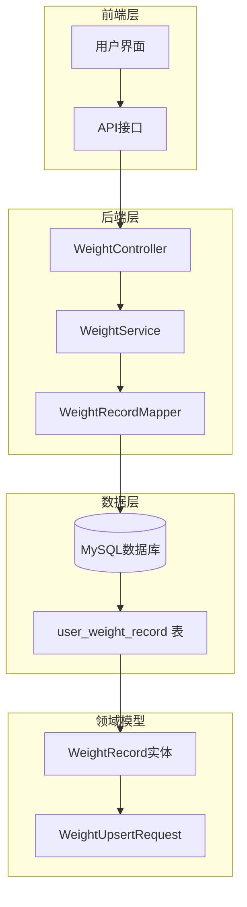
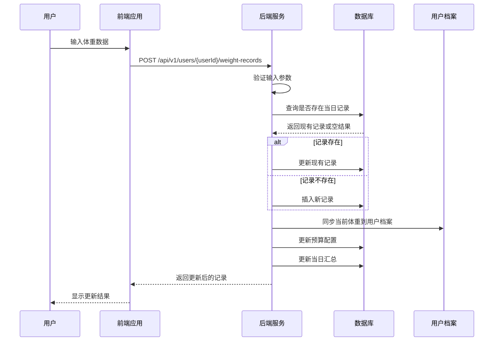
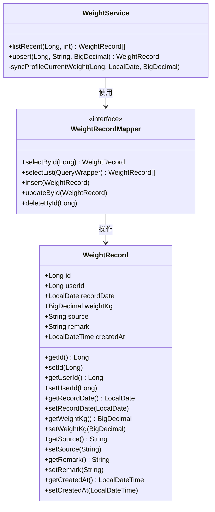
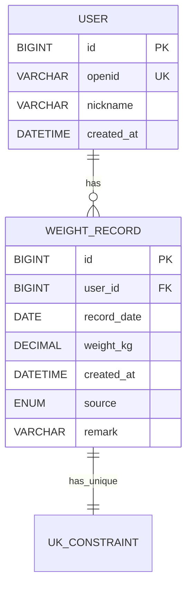
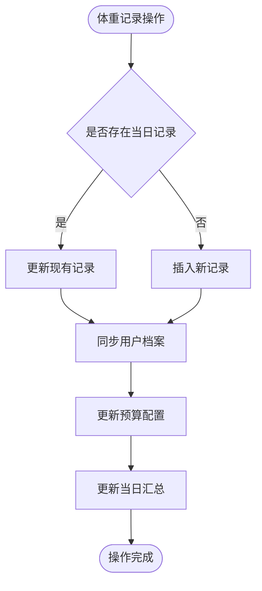
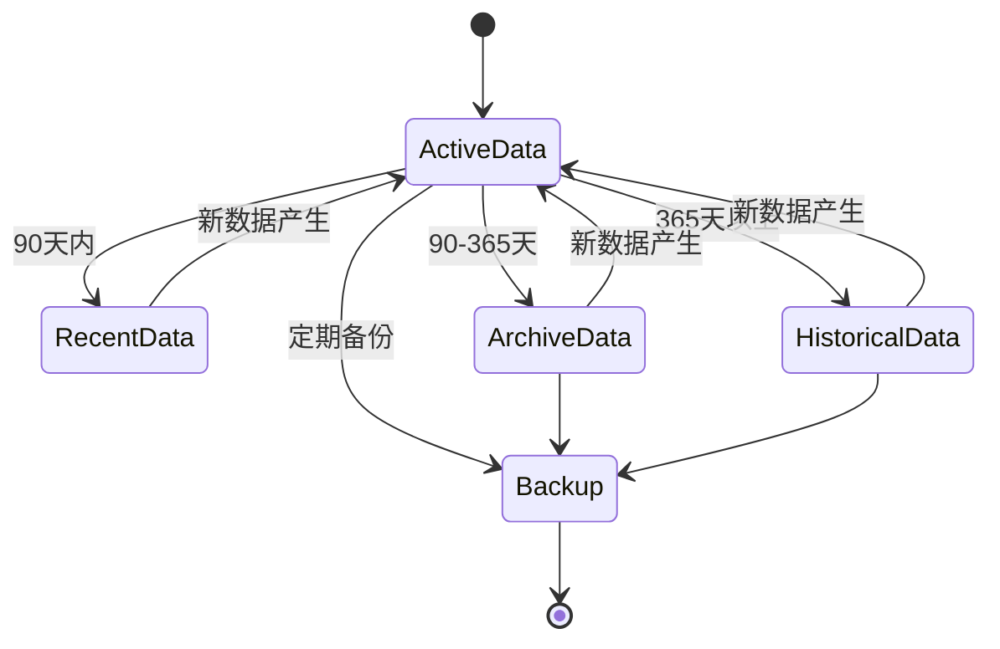
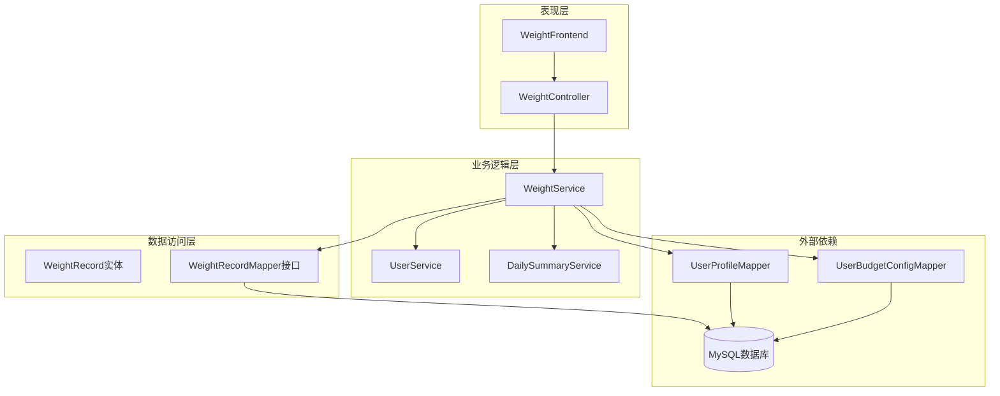
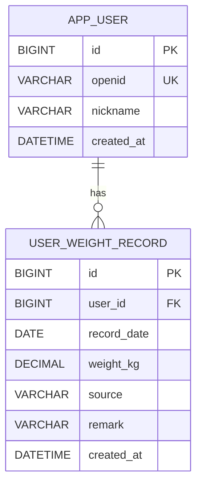

# 体重记录表设计

<cite>
**本文档引用的文件**
- [V010__user_weight_record.sql](file://database/migrations/V010__user_weight_record.sql)
- [V016__fix_schema.sql](file://database/migrations/V016__fix_schema.sql)
- [01_schema.sql](file://database/01_schema.sql)
- [loseweight_bak20260405.sql](file://database/loseweight_bak20260405.sql)
- [WeightRecord.java](file://backend/src/main/java/com/ypfr/loseweight/domain/WeightRecord.java)
- [WeightRecordMapper.java](file://backend/src/main/java/com/ypfr/loseweight/mapper/WeightRecordMapper.java)
- [WeightService.java](file://backend/src/main/java/com/ypfr/loseweight/service/WeightService.java)
- [WeightController.java](file://backend/src/main/java/com/ypfr/loseweight/web/WeightController.java)
- [weight.ts](file://frontend/src/api/weight.ts)
- [weightTrendMock.ts](file://frontend/src/constants/weightTrendMock.ts)
- [weight-trend.vue](file://frontend/src/pages/user/weight-trend.vue)
</cite>

## 目录
1. [简介](#简介)
2. [项目结构](#项目结构)
3. [核心组件](#核心组件)
4. [架构概览](#架构概览)
5. [详细组件分析](#详细组件分析)
6. [依赖关系分析](#依赖关系分析)
7. [性能考虑](#性能考虑)
8. [故障排除指南](#故障排除指南)
9. [结论](#结论)
10. [附录](#附录)

## 简介

体重记录表（user_weight_record）是减脂管理系统中的核心数据表之一，用于记录用户的每日体重变化。该表采用了按日记录的设计理念，通过unique约束确保每个用户每天只能有一条体重记录，从而保证数据的准确性和一致性。

本文档将深入分析体重记录表的表结构设计、数据模型、查询优化策略以及历史数据管理方案，为开发者和运维人员提供全面的技术参考。

## 项目结构

体重记录表在整个系统中的位置和作用：



**图表来源**
- [WeightController.java:16-38](file://backend/src/main/java/com/ypfr/loseweight/web/WeightController.java#L16-L38)
- [WeightService.java:17-37](file://backend/src/main/java/com/ypfr/loseweight/service/WeightService.java#L17-L37)
- [WeightRecordMapper.java:1-9](file://backend/src/main/java/com/ypfr/loseweight/mapper/WeightRecordMapper.java#L1-L9)

**章节来源**
- [WeightController.java:16-38](file://backend/src/main/java/com/ypfr/loseweight/web/WeightController.java#L16-L38)
- [WeightService.java:17-37](file://backend/src/main/java/com/ypfr/loseweight/service/WeightService.java#L17-L37)
- [WeightRecordMapper.java:1-9](file://backend/src/main/java/com/ypfr/loseweight/mapper/WeightRecordMapper.java#L1-L9)

## 核心组件

### 表结构设计

体重记录表采用标准的关系型数据库设计，包含以下关键字段：

| 字段名 | 数据类型 | 约束条件 | 描述 |
|--------|----------|----------|------|
| id | BIGINT UNSIGNED | PRIMARY KEY, AUTO_INCREMENT | 主键标识符 |
| user_id | BIGINT UNSIGNED | NOT NULL, FOREIGN KEY | 用户外键关联 |
| record_date | DATE | NOT NULL | 记录日期（日粒度） |
| weight_kg | DECIMAL(6,2) | NOT NULL | 体重值（公斤） |
| source | VARCHAR(16) | NOT NULL, DEFAULT 'manual' | 数据来源类型 |
| remark | VARCHAR(256) | NULL | 备注说明 |
| created_at | DATETIME | NOT NULL, DEFAULT CURRENT_TIMESTAMP | 创建时间戳 |

### 设计理念分析

#### 按日记录的设计优势

1. **简化数据模型**：采用日粒度记录避免了时间戳的复杂性
2. **符合用户习惯**：用户通常按天测量体重，符合自然的时间分组
3. **查询效率高**：按日期范围查询更加直观和高效
4. **存储成本低**：相比高频记录，日粒度显著减少存储空间

#### 去重策略说明

早期版本采用unique约束确保每个用户每天只有一条记录：
- 约束名称：uk_weight_user_date(user_id, record_date)
- 目的：防止重复记录同一日期的体重数据
- 业务意义：保证体重趋势分析的准确性

**章节来源**
- [01_schema.sql:71-81](file://database/01_schema.sql#L71-L81)
- [loseweight_bak20260405.sql:4047-4056](file://database/loseweight_bak20260405.sql#L4047-L4056)

## 架构概览

体重记录系统的整体架构流程：



**图表来源**
- [WeightController.java:32-37](file://backend/src/main/java/com/ypfr/loseweight/web/WeightController.java#L32-L37)
- [WeightService.java:47-79](file://backend/src/main/java/com/ypfr/loseweight/service/WeightService.java#L47-L79)

**章节来源**
- [WeightController.java:26-37](file://backend/src/main/java/com/ypfr/loseweight/web/WeightController.java#L26-L37)
- [WeightService.java:39-79](file://backend/src/main/java/com/ypfr/loseweight/service/WeightService.java#L39-L79)

## 详细组件分析

### 数据模型类分析



**图表来源**
- [WeightRecord.java:11-78](file://backend/src/main/java/com/ypfr/loseweight/domain/WeightRecord.java#L11-L78)
- [WeightRecordMapper.java:1-9](file://backend/src/main/java/com/ypfr/loseweight/mapper/WeightRecordMapper.java#L1-L9)
- [WeightService.java:17-37](file://backend/src/main/java/com/ypfr/loseweight/service/WeightService.java#L17-L37)

### 字段精度和存储分析

#### weight_kg字段设计

| 属性 | 设计值 | 实际存储 | 业务含义 |
|------|--------|----------|----------|
| 类型 | DECIMAL(6,2) | DECIMAL(6,2) | 精确到0.01公斤 |
| 最小值 | 0 | 0.00 | 人体最小可能体重 |
| 最大值 | 999.99 | 999.99 | 超过正常范围的上限 |
| 存储空间 | 3字节 | 3字节 | 占用固定空间，无额外开销 |
| 精度控制 | 两位小数 | 两位小数 | 符合体重测量精度要求 |

**设计考量**：
- 支持0.01公斤的精确度，满足日常体重测量需求
- 能够覆盖正常人体体重范围（约30-200公斤）
- DECIMAL类型避免浮点数精度问题
- 固定精度确保数据一致性

#### record_date字段设计

| 属性 | 设计值 | 实际存储 | 业务意义 |
|------|--------|----------|----------|
| 类型 | DATE | DATE | 年月日格式 |
| 时间精度 | 0秒 | 0秒 | 日粒度唯一性 |
| 存储空间 | 3字节 | 3字节 | 最小化存储开销 |
| 时区处理 | 无时区 | 无时区 | 统一本地日期概念 |

**选择理由**：
- 采用DATE类型而非DATETIME，确保日粒度唯一性
- 避免时区转换带来的复杂性
- 简化查询逻辑和索引设计
- 符合用户按日记录的习惯

#### unique约束uk_weight_user_date设计



**图表来源**
- [01_schema.sql:71-81](file://database/01_schema.sql#L71-L81)
- [loseweight_bak20260405.sql:4053-4055](file://database/loseweight_bak20260405.sql#L4053-L4055)

**约束设计目的**：
1. **业务完整性**：确保每个用户每天只能有一次体重记录
2. **数据一致性**：防止重复数据导致的趋势分析偏差
3. **查询效率**：unique索引提供快速的唯一性检查
4. **维护简便**：自动处理重复插入的情况

**章节来源**
- [01_schema.sql:71-81](file://database/01_schema.sql#L71-L81)
- [loseweight_bak20260405.sql:4053-4055](file://database/loseweight_bak20260405.sql#L4053-L4055)

### 索引设计和查询优化

#### 现有索引结构

| 索引类型 | 索引名称 | 列组合 | 用途 | 性能影响 |
|----------|----------|--------|------|----------|
| PRIMARY | PRIMARY | id | 主键查找 | O(log n) |
| UNIQUE | uk_weight_user_date | user_id, record_date | 唯一性约束 | O(log n) | 
| FOREIGN KEY | fk_weight_record_user | user_id | 外键关联 | O(log n) |

#### 查询性能优化策略

1. **按用户查询最近记录**：
```sql
SELECT * FROM user_weight_record 
WHERE user_id = ? 
ORDER BY record_date DESC 
LIMIT ?
```

2. **按日期范围查询**：
```sql
SELECT * FROM user_weight_record 
WHERE user_id = ? 
AND record_date BETWEEN ? AND ?
ORDER BY record_date
```

3. **历史数据访问模式**：
- 最近N天趋势：按record_date降序排列
- 月度统计：按record_date分组聚合
- 年度对比：按年份分组比较

**章节来源**
- [WeightService.java:39-45](file://backend/src/main/java/com/ypfr/loseweight/service/WeightService.java#L39-L45)

### 数据审计和追踪

#### created_at字段的审计功能

| 功能特性 | 实现方式 | 业务价值 |
|----------|----------|----------|
| 自动时间戳 | DEFAULT CURRENT_TIMESTAMP | 无需手动设置 |
| 数据追踪 | 记录创建时间 | 支持数据溯源 |
| 历史分析 | 支持按时间排序 | 分析数据增长趋势 |
| 合规要求 | 完整的时间记录 | 满足审计需求 |

#### 数据变更追踪



**图表来源**
- [WeightService.java:81-107](file://backend/src/main/java/com/ypfr/loseweight/service/WeightService.java#L81-L107)

**章节来源**
- [WeightService.java:81-107](file://backend/src/main/java/com/ypfr/loseweight/service/WeightService.java#L81-L107)

### 历史数据管理策略

#### 数据生命周期管理

1. **短期数据（最近90天）**：
   - 高频访问，保持完整记录
   - 支持详细趋势分析
   - 便于用户查看近期变化

2. **中期数据（3个月-1年）**：
   - 降低存储频率
   - 保留关键节点数据
   - 支持月度趋势分析

3. **长期数据（1年以上）**：
   - 可选归档策略
   - 保留年度关键数据
   - 控制存储成本

#### 数据迁移和备份



**章节来源**
- [weight-trend.vue:196-204](file://frontend/src/pages/user/weight-trend.vue#L196-L204)

## 依赖关系分析

### 组件间依赖关系



**图表来源**
- [WeightController.java:20-24](file://backend/src/main/java/com/ypfr/loseweight/web/WeightController.java#L20-L24)
- [WeightService.java:20-37](file://backend/src/main/java/com/ypfr/loseweight/service/WeightService.java#L20-L37)

### 外部依赖分析

| 依赖组件 | 用途 | 版本要求 | 影响程度 |
|----------|------|----------|----------|
| MyBatis-Plus | ORM框架 | 3.x | 高 |
| Spring Boot | 应用框架 | 2.x | 高 |
| MySQL | 数据库 | 8.0+ | 中 |
| Vue.js | 前端框架 | 3.x | 低 |

**章节来源**
- [WeightRecordMapper.java:1-9](file://backend/src/main/java/com/ypfr/loseweight/mapper/WeightRecordMapper.java#L1-L9)
- [WeightService.java:20-37](file://backend/src/main/java/com/ypfr/loseweight/service/WeightService.java#L20-L37)

## 性能考虑

### 查询性能优化

1. **索引优化策略**：
   - 为user_id建立单独索引支持用户过滤
   - unique索引确保数据完整性
   - 复合索引支持按日期范围查询

2. **查询模式优化**：
   - 最近记录查询：按record_date降序，限制数量
   - 日期范围查询：使用between操作符
   - 聚合查询：按record_date分组统计

3. **缓存策略**：
   - 用户最近体重缓存
   - 用户档案实时同步
   - 前端图表数据缓存

### 存储优化

1. **数据压缩**：
   - DECIMAL类型固定精度，无额外存储开销
   - DATE类型3字节存储，节省空间
   - VARCHAR字段按需使用

2. **批量操作**：
   - 支持批量插入和更新
   - 减少数据库连接开销
   - 提高数据导入效率

## 故障排除指南

### 常见问题及解决方案

#### 1. 重复记录问题

**症状**：插入相同日期的体重记录时报错

**原因**：unique约束uk_weight_user_date触发

**解决方案**：
- 使用upsert操作自动处理重复记录
- 检查record_date格式是否正确
- 确认用户权限验证

#### 2. 数据精度问题

**症状**：体重显示精度异常

**原因**：DECIMAL精度设置不当

**解决方案**：
- 确保前端输入精度不超过两位小数
- 后端进行精度验证
- 数据库层面保持DECIMAL(6,2)格式

#### 3. 查询性能问题

**症状**：大量数据查询响应缓慢

**原因**：缺少合适的索引或查询条件不当

**解决方案**：
- 为user_id和record_date建立复合索引
- 优化查询条件，避免全表扫描
- 实施分页查询策略

**章节来源**
- [WeightService.java:47-79](file://backend/src/main/java/com/ypfr/loseweight/service/WeightService.java#L47-L79)

## 结论

体重记录表设计体现了简洁而高效的数据库设计理念。通过采用日粒度记录、unique约束和合理的字段设计，系统在保证数据准确性的同时实现了良好的性能表现。

### 设计亮点

1. **简洁性**：表结构简单明了，易于理解和维护
2. **完整性**：unique约束确保数据一致性
3. **性能**：合理的索引设计支持高效查询
4. **扩展性**：预留source和remark字段支持未来扩展

### 改进建议

1. **数据归档**：实现历史数据自动归档机制
2. **监控告警**：添加数据质量监控和异常告警
3. **备份策略**：制定定期备份和恢复计划
4. **性能监控**：持续监控查询性能和存储使用情况

## 附录

### 数据表结构图



**图表来源**
- [01_schema.sql:11-34](file://database/01_schema.sql#L11-L34)
- [01_schema.sql:71-81](file://database/01_schema.sql#L71-L81)

### 典型体重变化趋势示例

基于前端权重趋势页面的实现，典型的体重变化趋势包括：

1. **减重初期**：快速下降，通常在开始阶段
2. **平台期**：体重稳定一段时间
3. **持续减重**：稳定的每周减重节奏
4. **波动调整**：偶尔的体重波动

这些趋势通过前端图表组件进行可视化展示，支持用户跟踪减重进展。

**章节来源**
- [weight-trend.vue:265-292](file://frontend/src/pages/user/weight-trend.vue#L265-L292)